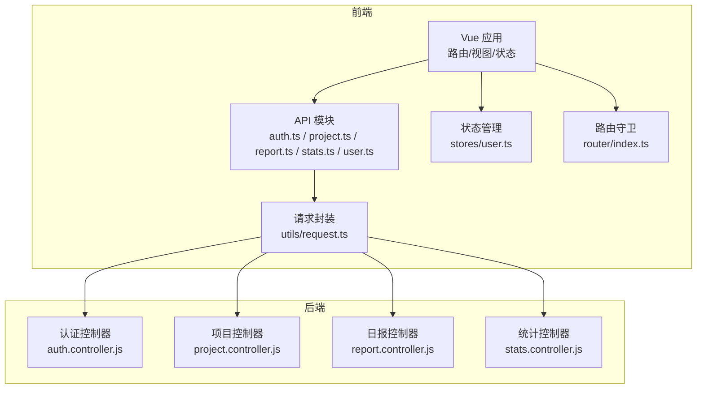
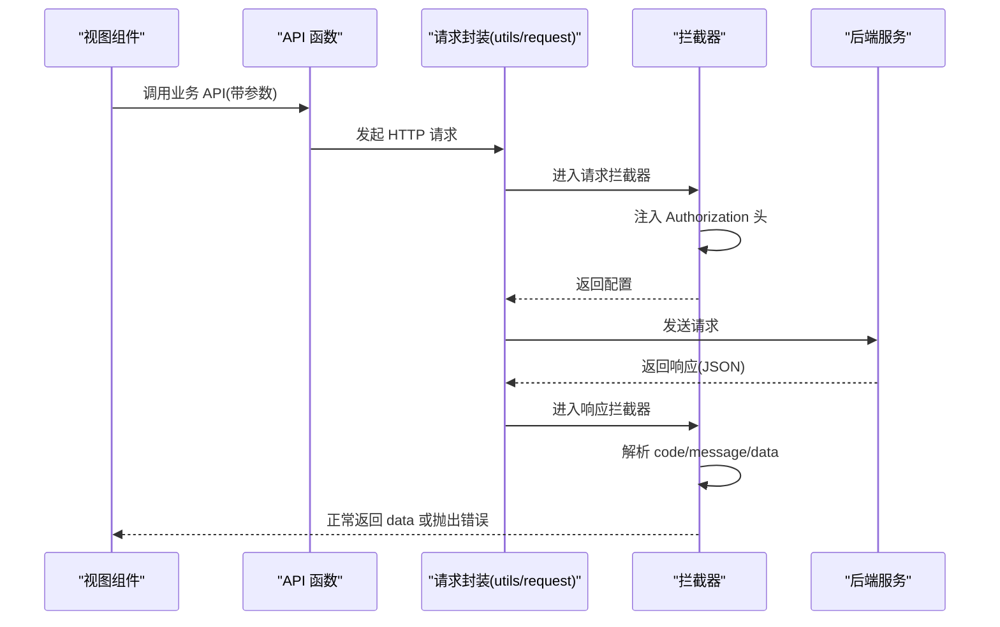
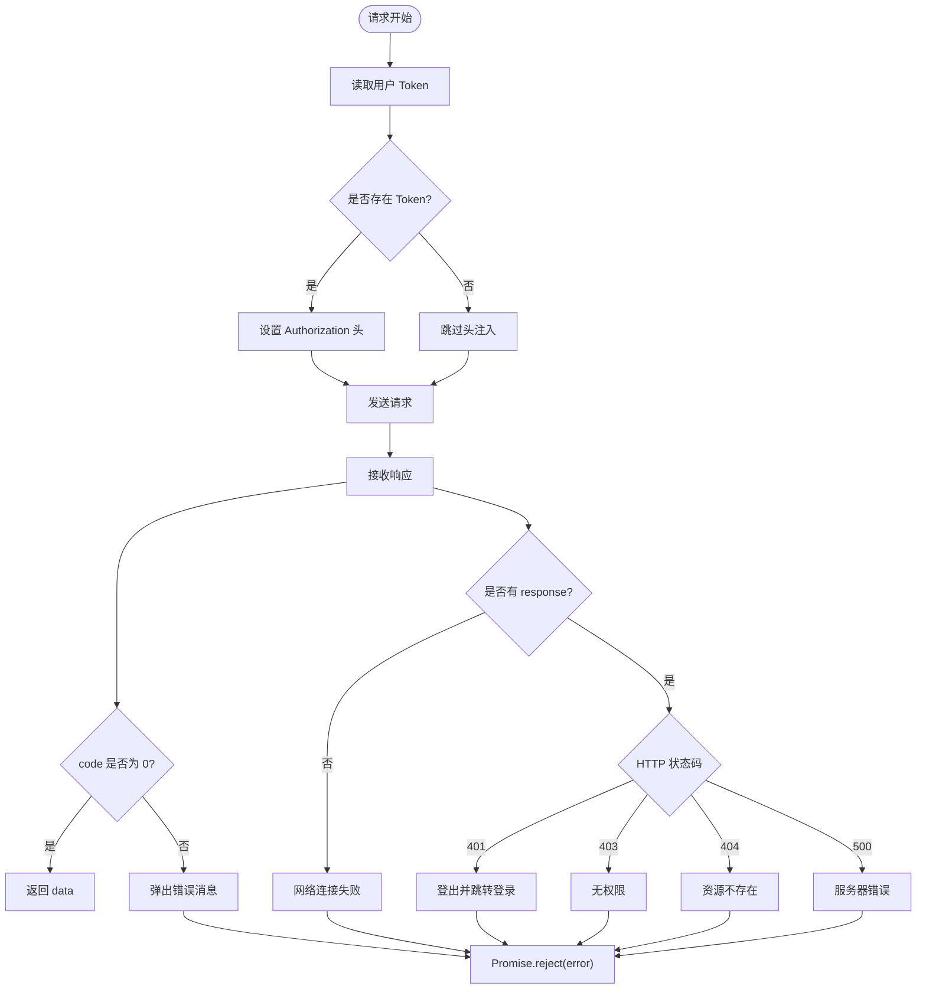
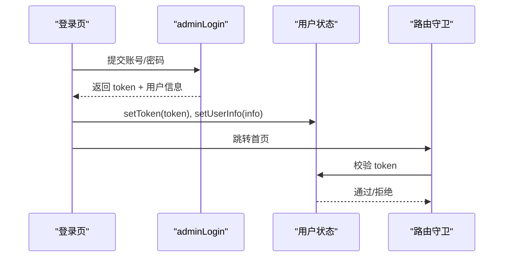
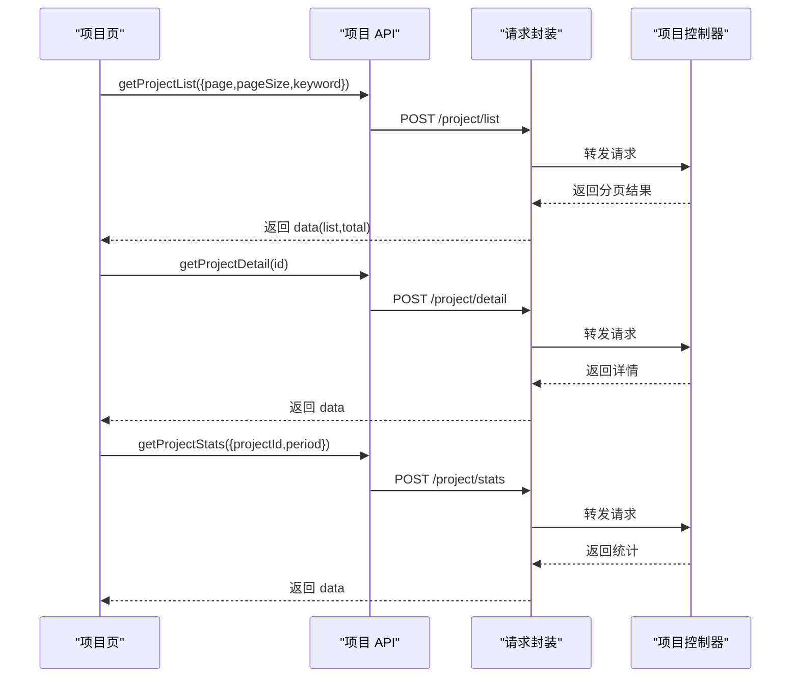
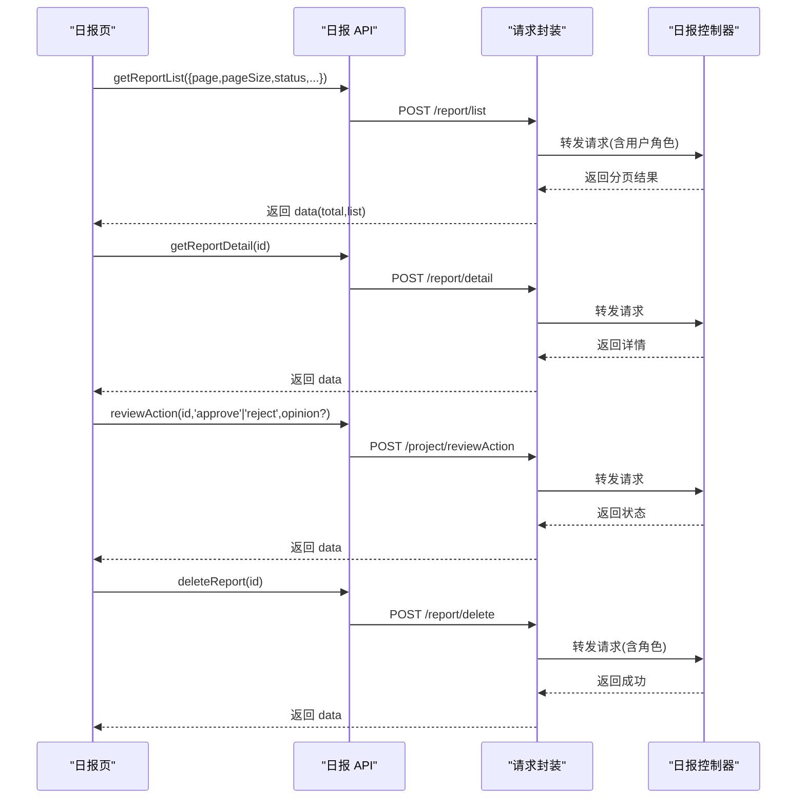
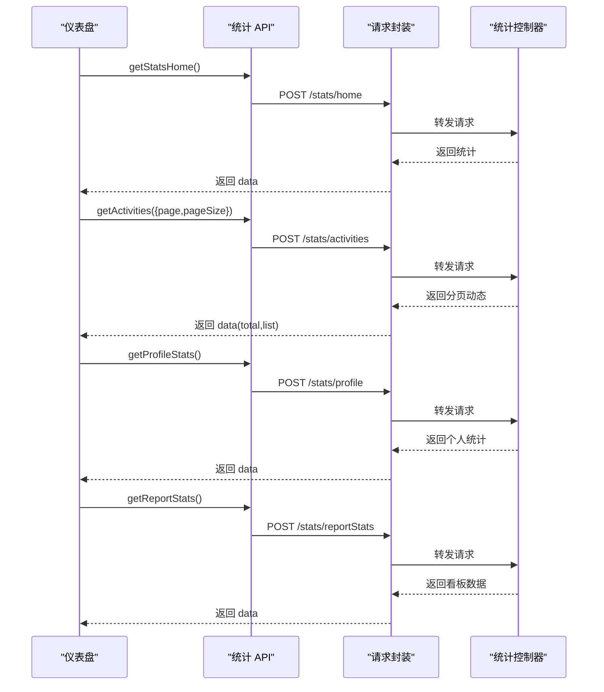
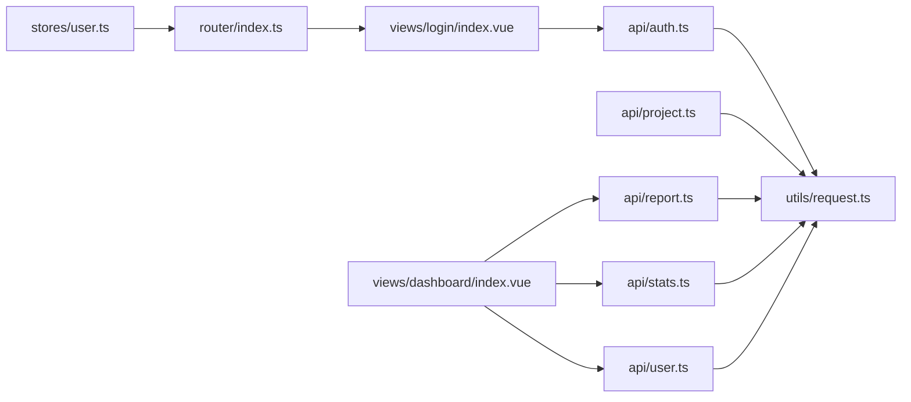

# API 接口集成

<cite>
**本文引用的文件**
- [webapp/src/utils/request.ts](file://webapp/src/utils/request.ts)
- [webapp/src/types/api.d.ts](file://webapp/src/types/api.d.ts)
- [webapp/src/api/auth.ts](file://webapp/src/api/auth.ts)
- [webapp/src/api/project.ts](file://webapp/src/api/project.ts)
- [webapp/src/api/report.ts](file://webapp/src/api/report.ts)
- [webapp/src/api/stats.ts](file://webapp/src/api/stats.ts)
- [webapp/src/api/user.ts](file://webapp/src/api/user.ts)
- [webapp/src/stores/user.ts](file://webapp/src/stores/user.ts)
- [webapp/src/router/index.ts](file://webapp/src/router/index.ts)
- [webapp/src/views/login/index.vue](file://webapp/src/views/login/index.vue)
- [webapp/src/views/dashboard/index.vue](file://webapp/src/views/dashboard/index.vue)
- [backend/src/auth/controllers/auth.controller.js](file://backend/src/auth/controllers/auth.controller.js)
- [backend/src/core/controllers/project.controller.js](file://backend/src/core/controllers/project.controller.js)
- [backend/src/core/controllers/report.controller.js](file://backend/src/core/controllers/report.controller.js)
- [backend/src/features/controllers/stats.controller.js](file://backend/src/features/controllers/stats.controller.js)
</cite>

## 目录
1. [简介](#简介)
2. [项目结构](#项目结构)
3. [核心组件](#核心组件)
4. [架构总览](#架构总览)
5. [详细组件分析](#详细组件分析)
6. [依赖关系分析](#依赖关系分析)
7. [性能考虑](#性能考虑)
8. [故障排查指南](#故障排查指南)
9. [结论](#结论)
10. [附录](#附录)

## 简介
本文件面向 Web 管理后台的 API 接口集成，基于 Axios 封装的网络请求库，系统性说明后端 API 的调用方式、参数传递、响应处理与错误管理；详述认证流程（登录验证、Token 管理、路由守卫）、项目管理、日报管理、统计分析等核心业务模块的 API 使用范式；并提供请求/响应拦截器配置建议（Loading 状态、错误提示、重试机制），以及 TypeScript 类型定义、接口契约与数据验证的类型安全保障。

## 项目结构
前端采用 Vue 3 + TypeScript + Pinia + Element Plus 架构，API 层按功能域拆分，统一通过封装的 Axios 实例进行请求与响应处理，并在路由层配合 Token 进行鉴权拦截。

图表来源
- [webapp/src/utils/request.ts:1-77](file://webapp/src/utils/request.ts#L1-L77)
- [webapp/src/api/auth.ts:1-31](file://webapp/src/api/auth.ts#L1-L31)
- [webapp/src/api/project.ts:1-53](file://webapp/src/api/project.ts#L1-L53)
- [webapp/src/api/report.ts:1-106](file://webapp/src/api/report.ts#L1-L106)
- [webapp/src/api/stats.ts:1-51](file://webapp/src/api/stats.ts#L1-L51)
- [webapp/src/api/user.ts:1-63](file://webapp/src/api/user.ts#L1-L63)
- [webapp/src/stores/user.ts:1-54](file://webapp/src/stores/user.ts#L1-L54)
- [webapp/src/router/index.ts:1-77](file://webapp/src/router/index.ts#L1-L77)
- [backend/src/auth/controllers/auth.controller.js:1-162](file://backend/src/auth/controllers/auth.controller.js#L1-L162)
- [backend/src/core/controllers/project.controller.js:1-63](file://backend/src/core/controllers/project.controller.js#L1-L63)
- [backend/src/core/controllers/report.controller.js:1-172](file://backend/src/core/controllers/report.controller.js#L1-L172)
- [backend/src/features/controllers/stats.controller.js:1-81](file://backend/src/features/controllers/stats.controller.js#L1-L81)

章节来源
- [webapp/src/utils/request.ts:1-77](file://webapp/src/utils/request.ts#L1-L77)
- [webapp/src/router/index.ts:1-77](file://webapp/src/router/index.ts#L1-L77)

## 核心组件
- 请求封装与拦截器：统一基地址、超时、请求头、鉴权头注入、统一响应解包与错误处理。
- 类型系统：统一的响应包装结构、分页结构、业务实体类型定义。
- API 模块：按领域划分的函数式 API，如认证、项目、日报、统计、用户管理。
- 状态与路由：Pinia 用户状态存储与路由守卫，实现登录态校验与跳转。

章节来源
- [webapp/src/utils/request.ts:1-77](file://webapp/src/utils/request.ts#L1-L77)
- [webapp/src/types/api.d.ts:1-162](file://webapp/src/types/api.d.ts#L1-L162)
- [webapp/src/api/auth.ts:1-31](file://webapp/src/api/auth.ts#L1-L31)
- [webapp/src/api/project.ts:1-53](file://webapp/src/api/project.ts#L1-L53)
- [webapp/src/api/report.ts:1-106](file://webapp/src/api/report.ts#L1-L106)
- [webapp/src/api/stats.ts:1-51](file://webapp/src/api/stats.ts#L1-L51)
- [webapp/src/api/user.ts:1-63](file://webapp/src/api/user.ts#L1-L63)
- [webapp/src/stores/user.ts:1-54](file://webapp/src/stores/user.ts#L1-L54)
- [webapp/src/router/index.ts:1-77](file://webapp/src/router/index.ts#L1-L77)

## 架构总览
前端通过封装的 Axios 实例发起请求，请求拦截器自动附加 Bearer Token，响应拦截器统一解析 code/message/data 并做错误提示与登出处理；API 模块以函数形式暴露接口契约，结合 TypeScript 类型确保参数与返回值的类型安全；路由守卫在进入受保护页面前检查 Token。

图表来源
- [webapp/src/utils/request.ts:15-74](file://webapp/src/utils/request.ts#L15-L74)
- [webapp/src/api/auth.ts:22-30](file://webapp/src/api/auth.ts#L22-L30)
- [webapp/src/api/project.ts:39-52](file://webapp/src/api/project.ts#L39-L52)
- [webapp/src/api/report.ts:65-88](file://webapp/src/api/report.ts#L65-L88)
- [webapp/src/api/stats.ts:32-45](file://webapp/src/api/stats.ts#L32-L45)

## 详细组件分析

### 请求与响应拦截器
- 基础配置：baseURL、timeout、Content-Type。
- 请求拦截器：从 Pinia 用户状态读取 token，注入 Authorization 头。
- 响应拦截器：对 code=0 的成功响应直接返回 data；对业务错误弹出错误消息并 reject；对 401 自动登出并跳转登录页；对 403/404/500 等错误提示；对无 response 的网络异常进行提示。

图表来源
- [webapp/src/utils/request.ts:15-74](file://webapp/src/utils/request.ts#L15-L74)

章节来源
- [webapp/src/utils/request.ts:1-77](file://webapp/src/utils/request.ts#L1-L77)

### 认证与 Token 管理
- 登录接口：支持账号密码登录与企业微信 OAuth 登录；登录成功后写入 Token 到本地存储与 Pinia 状态。
- 路由守卫：非公开路由在进入前检查 Token，缺失则跳转登录页。
- Token 刷新：当前实现未内置自动刷新逻辑，建议在请求拦截器中对 401 响应触发刷新流程（例如静默刷新或引导重新登录）。

图表来源
- [webapp/src/views/login/index.vue:37-65](file://webapp/src/views/login/index.vue#L37-L65)
- [webapp/src/api/auth.ts:22-30](file://webapp/src/api/auth.ts#L22-L30)
- [webapp/src/stores/user.ts:23-36](file://webapp/src/stores/user.ts#L23-L36)
- [webapp/src/router/index.ts:59-74](file://webapp/src/router/index.ts#L59-L74)

章节来源
- [webapp/src/views/login/index.vue:1-211](file://webapp/src/views/login/index.vue#L1-L211)
- [webapp/src/api/auth.ts:1-31](file://webapp/src/api/auth.ts#L1-L31)
- [webapp/src/stores/user.ts:1-54](file://webapp/src/stores/user.ts#L1-L54)
- [webapp/src/router/index.ts:1-77](file://webapp/src/router/index.ts#L1-L77)

### 项目管理 API
- 列表：分页 + 关键词搜索。
- 详情：根据项目 ID 查询详情，包含成员、报表、统计指标。
- 统计：按项目与周期统计报表数量、审批率、趋势等。

图表来源
- [webapp/src/api/project.ts:39-52](file://webapp/src/api/project.ts#L39-L52)
- [backend/src/core/controllers/project.controller.js:11-60](file://backend/src/core/controllers/project.controller.js#L11-L60)

章节来源
- [webapp/src/api/project.ts:1-53](file://webapp/src/api/project.ts#L1-L53)
- [backend/src/core/controllers/project.controller.js:1-63](file://backend/src/core/controllers/project.controller.js#L1-L63)

### 日报管理 API
- 列表：支持分页、状态、日期范围、关键词筛选；管理员可见全部，普通用户仅看自己。
- 详情：返回完整日报内容与审批信息。
- 审核：支持通过/驳回，可附意见。
- 删除：仅草稿或已驳回可删。
- 人员统计看板：分页统计作业人员相关指标。

图表来源
- [webapp/src/api/report.ts:65-93](file://webapp/src/api/report.ts#L65-L93)
- [backend/src/core/controllers/report.controller.js:10-132](file://backend/src/core/controllers/report.controller.js#L10-L132)

章节来源
- [webapp/src/api/report.ts:1-106](file://webapp/src/api/report.ts#L1-L106)
- [backend/src/core/controllers/report.controller.js:1-172](file://backend/src/core/controllers/report.controller.js#L1-L172)

### 统计分析 API
- 首页统计：待审核数、已提交数、已处理数、未读数等。
- 最近动态：分页聚合审批、日报、系统消息等动态。
- 个人中心统计：个人累计数据。
- 日报统计看板：总量、月度、待审、已审、审批率与趋势。

图表来源
- [webapp/src/api/stats.ts:32-50](file://webapp/src/api/stats.ts#L32-L50)
- [backend/src/features/controllers/stats.controller.js:11-73](file://backend/src/features/controllers/stats.controller.js#L11-L73)

章节来源
- [webapp/src/api/stats.ts:1-51](file://webapp/src/api/stats.ts#L1-L51)
- [backend/src/features/controllers/stats.controller.js:1-81](file://backend/src/features/controllers/stats.controller.js#L1-L81)

### 用户管理 API（管理员）
- 用户列表：分页 + 多维筛选。
- 角色管理：设置/取消管理员角色。
- 状态管理：禁用/启用用户。
- 预注册：为外部系统预注册用户并绑定 openid。
- 审核：审核通过用户。
- 密码管理：管理员重置用户密码。
- 删除：软删除用户。

章节来源
- [webapp/src/api/user.ts:1-63](file://webapp/src/api/user.ts#L1-L63)

### 类型系统与接口契约
- 统一响应结构：code、message、data。
- 分页结构：total、list。
- 业务实体：用户、审批、日报、公告、项目、资产、部门、角色等。
- API 参数：严格区分请求参数与返回类型，避免运行时错误。

章节来源
- [webapp/src/types/api.d.ts:1-162](file://webapp/src/types/api.d.ts#L1-L162)

### 视图与调用示例
- 登录页：表单校验、调用登录 API、写入 Token 与用户信息、跳转首页。
- 仪表盘：并发拉取首页统计、用户概览、待审核列表，展示统计卡片与最近动态。

章节来源
- [webapp/src/views/login/index.vue:37-65](file://webapp/src/views/login/index.vue#L37-L65)
- [webapp/src/views/dashboard/index.vue:30-54](file://webapp/src/views/dashboard/index.vue#L30-L54)

## 依赖关系分析
- API 模块依赖请求封装，统一走拦截器链路。
- 视图组件依赖 API 模块与 Pinia 状态。
- 路由守卫依赖用户状态进行鉴权。
- 后端控制器负责具体业务逻辑与响应格式化。

图表来源
- [webapp/src/api/auth.ts:1-31](file://webapp/src/api/auth.ts#L1-L31)
- [webapp/src/api/project.ts:1-53](file://webapp/src/api/project.ts#L1-L53)
- [webapp/src/api/report.ts:1-106](file://webapp/src/api/report.ts#L1-L106)
- [webapp/src/api/stats.ts:1-51](file://webapp/src/api/stats.ts#L1-L51)
- [webapp/src/api/user.ts:1-63](file://webapp/src/api/user.ts#L1-L63)
- [webapp/src/utils/request.ts:1-77](file://webapp/src/utils/request.ts#L1-L77)
- [webapp/src/views/login/index.vue:1-211](file://webapp/src/views/login/index.vue#L1-L211)
- [webapp/src/views/dashboard/index.vue:1-147](file://webapp/src/views/dashboard/index.vue#L1-L147)
- [webapp/src/stores/user.ts:1-54](file://webapp/src/stores/user.ts#L1-L54)
- [webapp/src/router/index.ts:1-77](file://webapp/src/router/index.ts#L1-L77)

章节来源
- [webapp/src/api/auth.ts:1-31](file://webapp/src/api/auth.ts#L1-L31)
- [webapp/src/api/project.ts:1-53](file://webapp/src/api/project.ts#L1-L53)
- [webapp/src/api/report.ts:1-106](file://webapp/src/api/report.ts#L1-L106)
- [webapp/src/api/stats.ts:1-51](file://webapp/src/api/stats.ts#L1-L51)
- [webapp/src/api/user.ts:1-63](file://webapp/src/api/user.ts#L1-L63)
- [webapp/src/utils/request.ts:1-77](file://webapp/src/utils/request.ts#L1-L77)
- [webapp/src/views/login/index.vue:1-211](file://webapp/src/views/login/index.vue#L1-L211)
- [webapp/src/views/dashboard/index.vue:1-147](file://webapp/src/views/dashboard/index.vue#L1-L147)
- [webapp/src/stores/user.ts:1-54](file://webapp/src/stores/user.ts#L1-L54)
- [webapp/src/router/index.ts:1-77](file://webapp/src/router/index.ts#L1-L77)

## 性能考虑
- 批量请求：使用 Promise.allSettled 并发拉取多个统计接口，减少首屏等待。
- 分页加载：列表接口支持分页参数，避免一次性传输大量数据。
- 缓存策略：可在 Pinia 中对高频接口结果进行缓存，降低重复请求。
- 超时与重试：Axios 已设置超时，可根据需要在拦截器中实现指数退避重试（需谨慎避免风暴重试）。

章节来源
- [webapp/src/views/dashboard/index.vue:33-37](file://webapp/src/views/dashboard/index.vue#L33-L37)

## 故障排查指南
- 登录 401：检查 Token 是否存在、是否过期；拦截器会自动清空并跳转登录页。
- 权限不足 403：确认用户角色与所需权限；后端按角色限制可见范围。
- 资源不存在 404：确认请求路径与参数；后端控制器对必填参数进行校验。
- 服务器错误 500：查看后端日志与错误处理器；前端统一提示“服务器错误”。
- 网络异常：无 response 时提示“网络连接失败”，检查网络与代理配置。

章节来源
- [webapp/src/utils/request.ts:46-74](file://webapp/src/utils/request.ts#L46-L74)

## 结论
该集成方案通过统一的请求封装与拦截器，实现了鉴权、错误处理与响应解包的一致性；API 模块按领域划分清晰，配合 TypeScript 类型定义提供了良好的类型安全；路由守卫与用户状态共同保障了受保护页面的访问控制。建议后续完善 Token 自动刷新与重试机制，进一步提升用户体验与稳定性。

## 附录
- 环境变量：VITE_API_BASE_URL 用于配置后端域名。
- 企业微信 OAuth：前端通过后端提供的配置生成授权链接，回调后写入 Token 并跳转首页。

章节来源
- [webapp/src/utils/request.ts:8-13](file://webapp/src/utils/request.ts#L8-L13)
- [webapp/src/views/login/index.vue:67-80](file://webapp/src/views/login/index.vue#L67-L80)