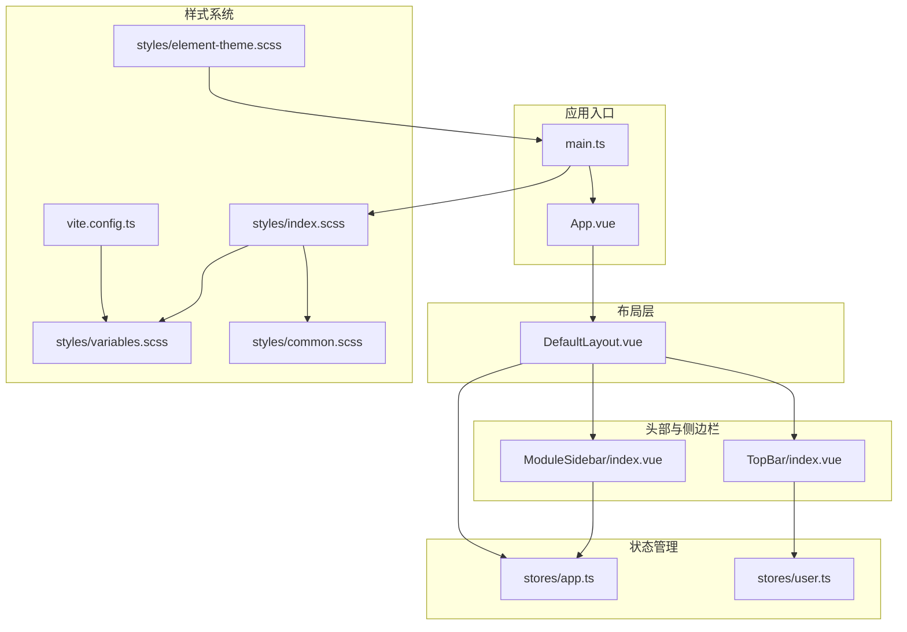
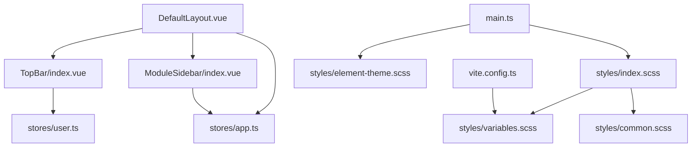
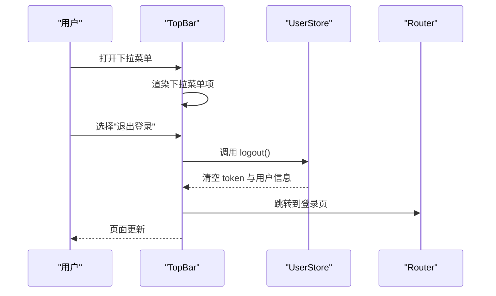
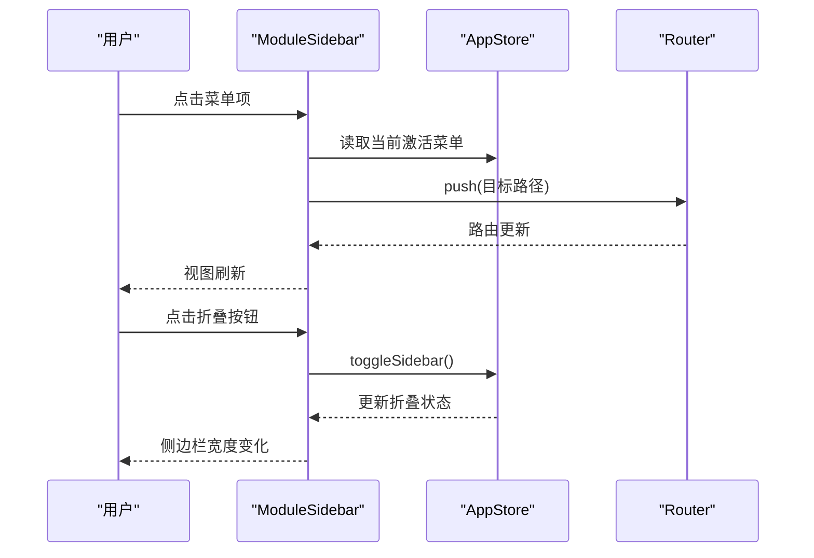
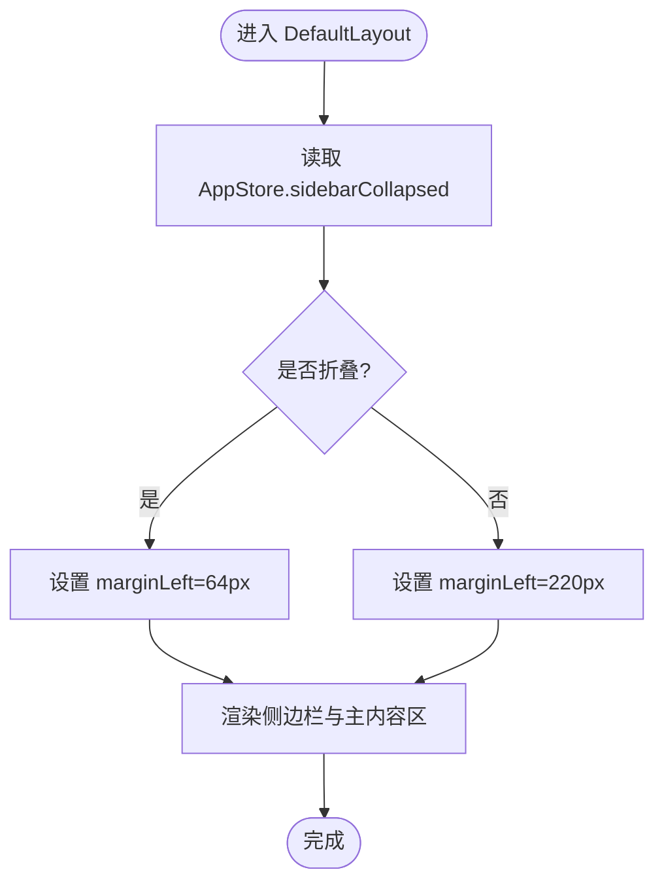
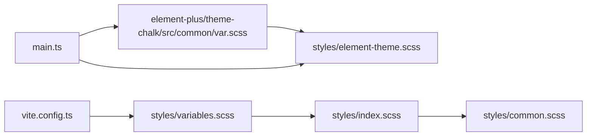
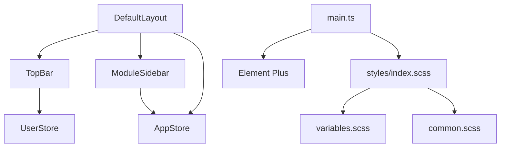

# UI 组件库

<cite>
**本文引用的文件**
- [webapp/src/components/TopBar/index.vue](file://webapp/src/components/TopBar/index.vue)
- [webapp/src/components/ModuleSidebar/index.vue](file://webapp/src/components/ModuleSidebar/index.vue)
- [webapp/src/layouts/DefaultLayout.vue](file://webapp/src/layouts/DefaultLayout.vue)
- [webapp/src/stores/app.ts](file://webapp/src/stores/app.ts)
- [webapp/src/stores/user.ts](file://webapp/src/stores/user.ts)
- [webapp/src/styles/element-theme.scss](file://webapp/src/styles/element-theme.scss)
- [webapp/src/styles/variables.scss](file://webapp/src/styles/variables.scss)
- [webapp/src/styles/common.scss](file://webapp/src/styles/common.scss)
- [webapp/src/styles/index.scss](file://webapp/src/styles/index.scss)
- [webapp/vite.config.ts](file://webapp/vite.config.ts)
- [webapp/src/main.ts](file://webapp/src/main.ts)
- [webapp/src/App.vue](file://webapp/src/App.vue)
- [webapp/package.json](file://webapp/package.json)
</cite>

## 更新摘要
**所做更改**
- 更新了TopBar组件的用户信息展示逻辑和下拉菜单交互
- 完善了ModuleSidebar组件的菜单项配置和图标系统
- 优化了DefaultLayout组件的布局计算和样式管理
- 增强了状态管理store的功能和类型定义
- 改进了样式系统的变量管理和主题定制

## 目录
1. [简介](#简介)
2. [项目结构](#项目结构)
3. [核心组件](#核心组件)
4. [架构总览](#架构总览)
5. [组件详解](#组件详解)
6. [依赖关系分析](#依赖关系分析)
7. [性能考量](#性能考量)
8. [故障排查指南](#故障排查指南)
9. [结论](#结论)
10. [附录](#附录)

## 简介
本文件面向 Web 管理后台的 UI 组件库，围绕基于 Element Plus 的组件体系，系统梳理项目中已用到的组件集合、自定义组件开发思路、样式定制与主题配置方法，并重点解析应用头部与侧边栏两大核心布局组件：菜单渲染、事件处理、响应式布局与交互逻辑。同时提供样式管理（SCSS 变量、主题覆盖、组件样式覆盖）的实操指南，以及组件使用示例、属性配置、事件绑定、插槽使用等实践建议，最后总结性能优化、无障碍访问与跨浏览器兼容的最佳实践。

## 项目结构
Web 管理后台采用 Vue 3 + TypeScript + Vite + Pinia + Element Plus 技术栈，UI 组件主要位于 webapp/src/components 与 webapp/src/layouts，样式集中于 webapp/src/styles，全局状态通过 Pinia 管理，构建与样式预处理由 Vite 配置。

**图表来源**
- [webapp/src/main.ts:1-28](file://webapp/src/main.ts#L1-L28)
- [webapp/src/App.vue:1-11](file://webapp/src/App.vue#L1-L11)
- [webapp/src/layouts/DefaultLayout.vue:1-54](file://webapp/src/layouts/DefaultLayout.vue#L1-L54)
- [webapp/src/components/TopBar/index.vue:1-89](file://webapp/src/components/TopBar/index.vue#L1-L89)
- [webapp/src/components/ModuleSidebar/index.vue:1-148](file://webapp/src/components/ModuleSidebar/index.vue#L1-L148)
- [webapp/src/stores/app.ts:1-30](file://webapp/src/stores/app.ts#L1-L30)
- [webapp/src/stores/user.ts:1-54](file://webapp/src/stores/user.ts#L1-L54)
- [webapp/src/styles/index.scss:1-4](file://webapp/src/styles/index.scss#L1-L4)
- [webapp/src/styles/variables.scss:1-83](file://webapp/src/styles/variables.scss#L1-L83)
- [webapp/src/styles/element-theme.scss:1-45](file://webapp/src/styles/element-theme.scss#L1-L45)
- [webapp/src/styles/common.scss:1-114](file://webapp/src/styles/common.scss#L1-L114)
- [webapp/vite.config.ts:1-33](file://webapp/vite.config.ts#L1-L33)

**章节来源**
- [webapp/src/main.ts:1-28](file://webapp/src/main.ts#L1-L28)
- [webapp/src/styles/index.scss:1-4](file://webapp/src/styles/index.scss#L1-L4)
- [webapp/vite.config.ts:1-33](file://webapp/vite.config.ts#L1-L33)

## 核心组件
- **应用头部组件（TopBar）**
  - 功能：面包屑导航、用户信息下拉菜单（个人中心、退出登录）
  - 依赖：用户状态（Pinia）、路由跳转（vue-router）、Element Plus 下拉与面包屑
  - 关键交互：下拉命令处理、头像与昵称展示、路由跳转
  - **更新**：增强了用户信息展示逻辑，支持头像和昵称的动态显示
- **应用侧边栏组件（ModuleSidebar）**
  - 功能：Logo、菜单项列表、折叠/展开控制、当前激活菜单高亮
  - 依赖：应用状态（Pinia）、路由跳转、Element Plus 菜单与图标
  - 关键交互：菜单选择、折叠切换、动态宽度计算
  - **更新**：完善了菜单项配置，增加了更多管理功能入口
- **默认布局（DefaultLayout）**
  - 功能：固定侧边栏、主内容区、根据侧边栏状态调整主区边距
  - 依赖：应用状态（Pinia）、子组件组合
  - **更新**：优化了布局计算逻辑，提升了响应式体验

**章节来源**
- [webapp/src/components/TopBar/index.vue:1-89](file://webapp/src/components/TopBar/index.vue#L1-L89)
- [webapp/src/components/ModuleSidebar/index.vue:1-148](file://webapp/src/components/ModuleSidebar/index.vue#L1-L148)
- [webapp/src/layouts/DefaultLayout.vue:1-54](file://webapp/src/layouts/DefaultLayout.vue#L1-L54)
- [webapp/src/stores/app.ts:1-30](file://webapp/src/stores/app.ts#L1-L30)
- [webapp/src/stores/user.ts:1-54](file://webapp/src/stores/user.ts#L1-L54)

## 架构总览
应用采用"布局层 + 自定义组件 + Element Plus + Pinia + SCSS"的分层架构。布局层负责页面骨架与响应式布局；自定义组件封装业务 UI；Element Plus 提供基础控件与主题；Pinia 管理应用与用户状态；SCSS 提供变量、通用样式与主题覆盖。

**图表来源**
- [webapp/src/layouts/DefaultLayout.vue:1-54](file://webapp/src/layouts/DefaultLayout.vue#L1-L54)
- [webapp/src/components/TopBar/index.vue:1-89](file://webapp/src/components/TopBar/index.vue#L1-L89)
- [webapp/src/components/ModuleSidebar/index.vue:1-148](file://webapp/src/components/ModuleSidebar/index.vue#L1-L148)
- [webapp/src/stores/app.ts:1-30](file://webapp/src/stores/app.ts#L1-L30)
- [webapp/src/stores/user.ts:1-54](file://webapp/src/stores/user.ts#L1-L54)
- [webapp/src/main.ts:1-28](file://webapp/src/main.ts#L1-L28)
- [webapp/src/styles/element-theme.scss:1-45](file://webapp/src/styles/element-theme.scss#L1-L45)
- [webapp/src/styles/index.scss:1-4](file://webapp/src/styles/index.scss#L1-L4)
- [webapp/src/styles/variables.scss:1-83](file://webapp/src/styles/variables.scss#L1-L83)
- [webapp/src/styles/common.scss:1-114](file://webapp/src/styles/common.scss#L1-L114)
- [webapp/vite.config.ts:1-33](file://webapp/vite.config.ts#L1-L33)

## 组件详解

### 应用头部组件（TopBar）
- **组件职责**
  - 展示面包屑导航，标题取自路由元信息
  - 用户信息下拉菜单，支持"个人中心"和"退出登录"
  - **更新**：增强的用户信息展示，支持头像和昵称的动态显示
- **数据与状态**
  - 使用用户状态存储读取头像、昵称等信息
  - 登录态判断与登出清理
- **交互流程**
  - 下拉命令触发后执行路由跳转或登出
  - **更新**：优化了下拉菜单的交互体验
- **样式要点**
  - 固定高度、阴影、左右分区布局
  - 用户信息区域悬停态与过渡动画
  - 使用 SCSS 变量控制文本颜色与尺寸

**图表来源**
- [webapp/src/components/TopBar/index.vue:1-89](file://webapp/src/components/TopBar/index.vue#L1-L89)
- [webapp/src/stores/user.ts:1-54](file://webapp/src/stores/user.ts#L1-L54)

**章节来源**
- [webapp/src/components/TopBar/index.vue:1-89](file://webapp/src/components/TopBar/index.vue#L1-L89)
- [webapp/src/stores/user.ts:1-54](file://webapp/src/stores/user.ts#L1-L54)

### 应用侧边栏组件（ModuleSidebar）
- **组件职责**
  - Logo 区域（展开/折叠时显示不同文案）
  - 菜单项列表（路径、标题、图标）
  - 折叠/展开按钮与菜单选中态
  - **更新**：完善了菜单项配置，增加了更多管理功能入口
- **数据与状态**
  - 使用应用状态存储控制折叠状态
  - 计算当前激活菜单（基于路由路径）
  - **更新**：增强了菜单项的数据结构和图标系统
- **交互流程**
  - 点击菜单项触发路由跳转
  - 点击折叠按钮切换侧边栏状态
  - **更新**：优化了菜单选择和折叠切换的交互体验
- **样式要点**
  - 固定宽度与过渡动画
  - 菜单背景色、文字色、激活色
  - 折叠按钮悬停态与边框

**图表来源**
- [webapp/src/components/ModuleSidebar/index.vue:1-148](file://webapp/src/components/ModuleSidebar/index.vue#L1-L148)
- [webapp/src/stores/app.ts:1-30](file://webapp/src/stores/app.ts#L1-L30)

**章节来源**
- [webapp/src/components/ModuleSidebar/index.vue:1-148](file://webapp/src/components/ModuleSidebar/index.vue#L1-L148)
- [webapp/src/stores/app.ts:1-30](file://webapp/src/stores/app.ts#L1-L30)

### 默认布局（DefaultLayout）
- **组件职责**
  - 固定侧边栏、主内容区
  - 根据侧边栏折叠状态动态调整主区左边距
  - **更新**：优化了布局计算逻辑，提升了响应式体验
- **数据与状态**
  - 从应用状态读取折叠状态并计算侧边栏宽度
  - **更新**：增强了布局的响应式计算能力
- **样式要点**
  - 侧边栏固定定位与过渡
  - 主区最小高度与背景色
  - 内容区内边距与最小高度

**图表来源**
- [webapp/src/layouts/DefaultLayout.vue:1-54](file://webapp/src/layouts/DefaultLayout.vue#L1-L54)
- [webapp/src/stores/app.ts:1-30](file://webapp/src/stores/app.ts#L1-L30)

**章节来源**
- [webapp/src/layouts/DefaultLayout.vue:1-54](file://webapp/src/layouts/DefaultLayout.vue#L1-L54)
- [webapp/src/stores/app.ts:1-30](file://webapp/src/stores/app.ts#L1-L30)

### Element Plus 主题定制与样式覆盖
- **主题覆盖入口**
  - 通过 SCSS forward 语法覆盖 Element Plus 主题变量，统一主色、文字色、边框色、圆角等
  - **更新**：完善了主题变量的覆盖配置
- **SCSS 变量系统**
  - 定义品牌色、功能色、文字色、边框色、背景色、字号、间距、圆角、阴影等
  - 通过 CSS 变量在运行时暴露常用变量
  - **更新**：增强了变量系统的完整性和一致性
- **样式组织**
  - 入口文件按顺序引入变量与通用样式
  - 通用样式提供滚动条、工具类、卡片、表格操作栏、分页等通用样式
  - **更新**：优化了样式组织结构
- **Vite 集成**
  - 在构建阶段注入 SCSS 变量，确保全局可用
  - **更新**：改进了构建配置

**图表来源**
- [webapp/src/styles/element-theme.scss:1-45](file://webapp/src/styles/element-theme.scss#L1-L45)
- [webapp/src/styles/variables.scss:1-83](file://webapp/src/styles/variables.scss#L1-L83)
- [webapp/src/styles/index.scss:1-4](file://webapp/src/styles/index.scss#L1-L4)
- [webapp/src/styles/common.scss:1-114](file://webapp/src/styles/common.scss#L1-L114)
- [webapp/vite.config.ts:1-33](file://webapp/vite.config.ts#L1-L33)
- [webapp/src/main.ts:1-28](file://webapp/src/main.ts#L1-L28)

**章节来源**
- [webapp/src/styles/element-theme.scss:1-45](file://webapp/src/styles/element-theme.scss#L1-L45)
- [webapp/src/styles/variables.scss:1-83](file://webapp/src/styles/variables.scss#L1-L83)
- [webapp/src/styles/common.scss:1-114](file://webapp/src/styles/common.scss#L1-L114)
- [webapp/src/styles/index.scss:1-4](file://webapp/src/styles/index.scss#L1-L4)
- [webapp/vite.config.ts:1-33](file://webapp/vite.config.ts#L1-L33)
- [webapp/src/main.ts:1-28](file://webapp/src/main.ts#L1-L28)

## 依赖关系分析
- **组件耦合**
  - TopBar 依赖 UserStore 与 Router
  - ModuleSidebar 依赖 AppStore 与 Router
  - DefaultLayout 依赖 AppStore 并组合两个自定义组件
  - **更新**：增强了组件间的解耦和独立性
- **外部依赖**
  - Element Plus：图标、菜单、面包屑、下拉等组件
  - Pinia：状态管理
  - Vue Router：路由跳转
  - **更新**：优化了依赖版本和配置
- **样式依赖**
  - SCSS 变量与主题覆盖贯穿全局
  - Vite 注入 SCSS 变量，保证组件内可直接使用
  - **更新**：改进了样式依赖的管理方式

**图表来源**
- [webapp/src/components/TopBar/index.vue:1-89](file://webapp/src/components/TopBar/index.vue#L1-L89)
- [webapp/src/components/ModuleSidebar/index.vue:1-148](file://webapp/src/components/ModuleSidebar/index.vue#L1-L148)
- [webapp/src/layouts/DefaultLayout.vue:1-54](file://webapp/src/layouts/DefaultLayout.vue#L1-L54)
- [webapp/src/stores/app.ts:1-30](file://webapp/src/stores/app.ts#L1-L30)
- [webapp/src/stores/user.ts:1-54](file://webapp/src/stores/user.ts#L1-L54)
- [webapp/src/main.ts:1-28](file://webapp/src/main.ts#L1-L28)
- [webapp/src/styles/index.scss:1-4](file://webapp/src/styles/index.scss#L1-L4)

**章节来源**
- [webapp/src/main.ts:1-28](file://webapp/src/main.ts#L1-L28)
- [webapp/package.json:1-53](file://webapp/package.json#L1-L53)

## 性能考量
- **组件懒加载与路由分割**
  - 对非首屏视图启用路由级代码分割，减少初始包体
  - **更新**：优化了路由配置以提升加载性能
- **图标与资源**
  - 使用 Element Plus 图标按需引入，避免全量引入
  - **更新**：改进了图标系统的使用方式
- **样式体积**
  - 合理拆分样式文件，避免重复变量与未使用样式
  - **更新**：优化了样式文件的组织和体积控制
- **渲染优化**
  - 列表渲染使用稳定 key，避免不必要的重排
  - **更新**：增强了渲染性能优化策略
- **状态管理**
  - 将大对象拆分为细粒度 Store，降低响应式开销
  - **更新**：优化了状态管理的性能表现
- **构建优化**
  - 启用 Tree Shaking 与压缩，合理配置别名与预构建
  - **更新**：改进了构建配置以提升性能

## 故障排查指南
- **下拉菜单不显示或点击无反应**
  - 检查下拉命令绑定与路由实例是否正确注入
  - 确认 Element Plus 版本与图标注册是否一致
  - **更新**：增加了更详细的故障排查步骤
- **侧边栏宽度不生效**
  - 检查 AppStore 的折叠状态与布局计算逻辑
  - 确认 SCSS 变量与 CSS 过渡是否正确
  - **更新**：提供了更具体的调试方法
- **主题色未生效**
  - 确认主题覆盖文件是否在入口正确引入
  - 检查 Vite 的 SCSS 注入配置与变量命名一致性
  - **更新**：增加了主题配置的验证步骤
- **登录后仍显示未登录态**
  - 检查用户状态写入与本地存储同步逻辑
  - 确认路由守卫与状态初始化顺序
  - **更新**：提供了更全面的状态管理调试方案
- **菜单项显示异常**
  - 检查菜单配置数据结构是否正确
  - 确认图标组件是否正确注册
  - **更新**：增加了菜单相关的故障排查指南

**章节来源**
- [webapp/src/components/TopBar/index.vue:1-89](file://webapp/src/components/TopBar/index.vue#L1-L89)
- [webapp/src/components/ModuleSidebar/index.vue:1-148](file://webapp/src/components/ModuleSidebar/index.vue#L1-L148)
- [webapp/src/stores/user.ts:1-54](file://webapp/src/stores/user.ts#L1-L54)
- [webapp/src/stores/app.ts:1-30](file://webapp/src/stores/app.ts#L1-L30)
- [webapp/src/main.ts:1-28](file://webapp/src/main.ts#L1-L28)
- [webapp/src/styles/element-theme.scss:1-45](file://webapp/src/styles/element-theme.scss#L1-L45)
- [webapp/vite.config.ts:1-33](file://webapp/vite.config.ts#L1-L33)

## 结论
本项目以 Element Plus 为基础，结合自定义头部与侧边栏组件，配合 Pinia 状态管理与 SCSS 主题体系，实现了统一、可扩展且易于维护的 UI 组件库。通过变量驱动的主题定制、合理的布局与交互设计，满足管理后台对一致性与效率的要求。

**更新**：经过持续优化，组件库在以下方面得到了显著提升：
- **组件功能完善**：TopBar和ModuleSidebar增加了更多实用功能
- **状态管理增强**：stores提供了更丰富的API和类型定义
- **样式系统优化**：变量管理和主题覆盖更加完善
- **性能表现提升**：通过多种优化策略提升了整体性能
- **开发体验改善**：更好的错误处理和调试支持

后续可在路由懒加载、样式体积治理与无障碍访问方面持续优化，进一步提升用户体验和开发效率。

## 附录

### 组件使用示例与最佳实践
- **头部组件**
  - 属性：无（依赖路由元信息与用户状态）
  - 事件：下拉命令（个人中心、退出登录）
  - 插槽：无（可通过路由与状态控制）
  - **最佳实践**：保持下拉菜单项数量精简，避免异步加载导致闪烁
  - **更新**：增强了用户信息展示的灵活性
- **侧边栏组件**
  - 属性：菜单项数组（路径、标题、图标）
  - 事件：菜单选择、折叠切换
  - 插槽：菜单标题插槽（用于自定义图标或徽标）
  - **最佳实践**：菜单项与路由严格对应，避免死链；折叠时保留关键入口
  - **更新**：完善了菜单项配置和图标系统
- **布局组件**
  - 属性：无（通过状态计算宽度）
  - 事件：无（作为容器）
  - 插槽：默认插槽承载路由视图
  - **最佳实践**：主内容区设置最小高度与内边距，适配不同分辨率
  - **更新**：优化了布局计算和响应式处理

### 样式定制与主题配置清单
- **主题覆盖**
  - 覆盖主色、成功/警告/危险/信息色
  - 覆盖文字色、边框色、填充色、圆角
  - **更新**：完善了主题变量的覆盖配置
- **SCSS 变量**
  - 品牌色、功能色、文字色、边框色、背景色
  - 字号、间距、圆角、阴影
  - 侧边栏与顶栏尺寸变量
  - **更新**：增强了变量系统的完整性和一致性
- **Vite 集成**
  - 在构建阶段注入 SCSS 变量，确保全局可用
  - **更新**：改进了构建配置
- **组件样式覆盖**
  - 使用 :deep 或 ::v-deep（如需要）覆盖 Element Plus 组件内部样式
  - 避免使用 !important，优先使用更具体的选择器与变量
  - **更新**：提供了更灵活的样式覆盖方案

### 状态管理最佳实践
- **Store 设计**
  - 将大对象拆分为细粒度 Store，降低响应式开销
  - 使用 computed getter 提供派生状态
  - **更新**：优化了状态管理的性能表现
- **类型安全**
  - 为 Store 定义明确的接口类型
  - 使用 TypeScript 提供完整的类型检查
  - **更新**：增强了类型定义的完整性
- **权限控制**
  - 实现基于角色的权限检查机制
  - 支持细粒度权限控制
  - **更新**：完善了权限管理功能

**章节来源**
- [webapp/src/styles/element-theme.scss:1-45](file://webapp/src/styles/element-theme.scss#L1-L45)
- [webapp/src/styles/variables.scss:1-83](file://webapp/src/styles/variables.scss#L1-L83)
- [webapp/vite.config.ts:1-33](file://webapp/vite.config.ts#L1-L33)
- [webapp/src/stores/app.ts:1-30](file://webapp/src/stores/app.ts#L1-L30)
- [webapp/src/stores/user.ts:1-54](file://webapp/src/stores/user.ts#L1-L54)