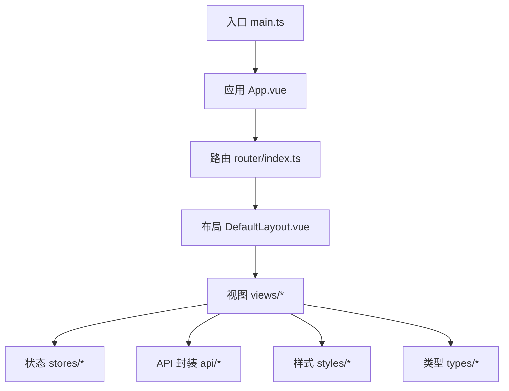
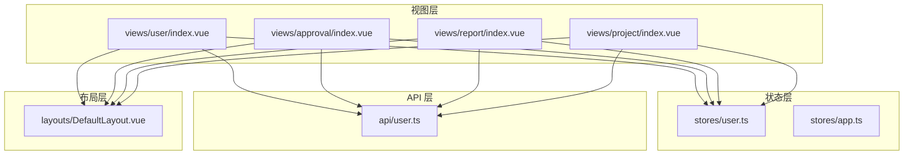
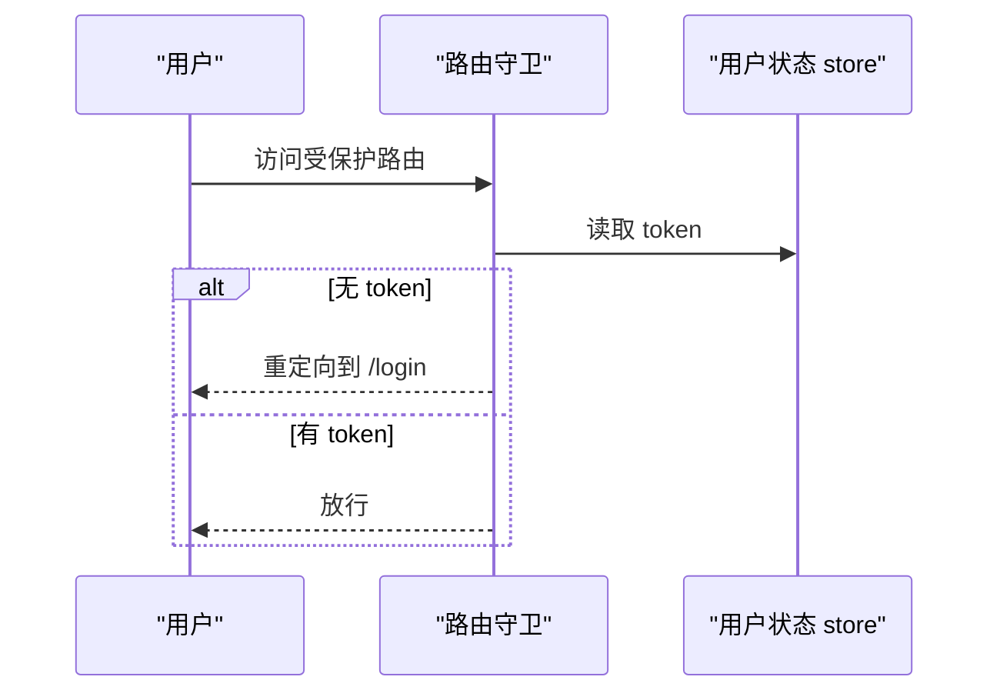
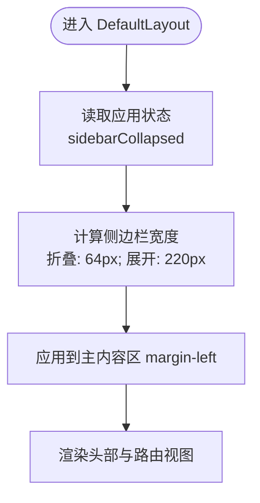
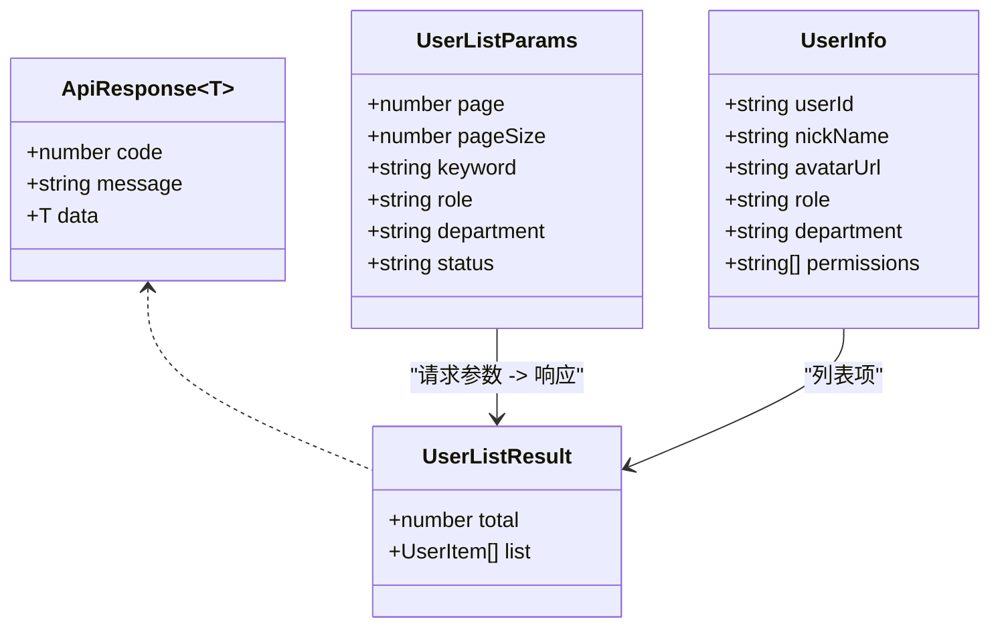
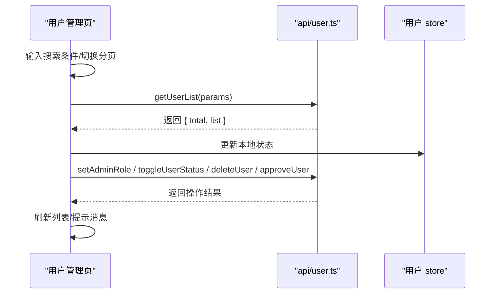
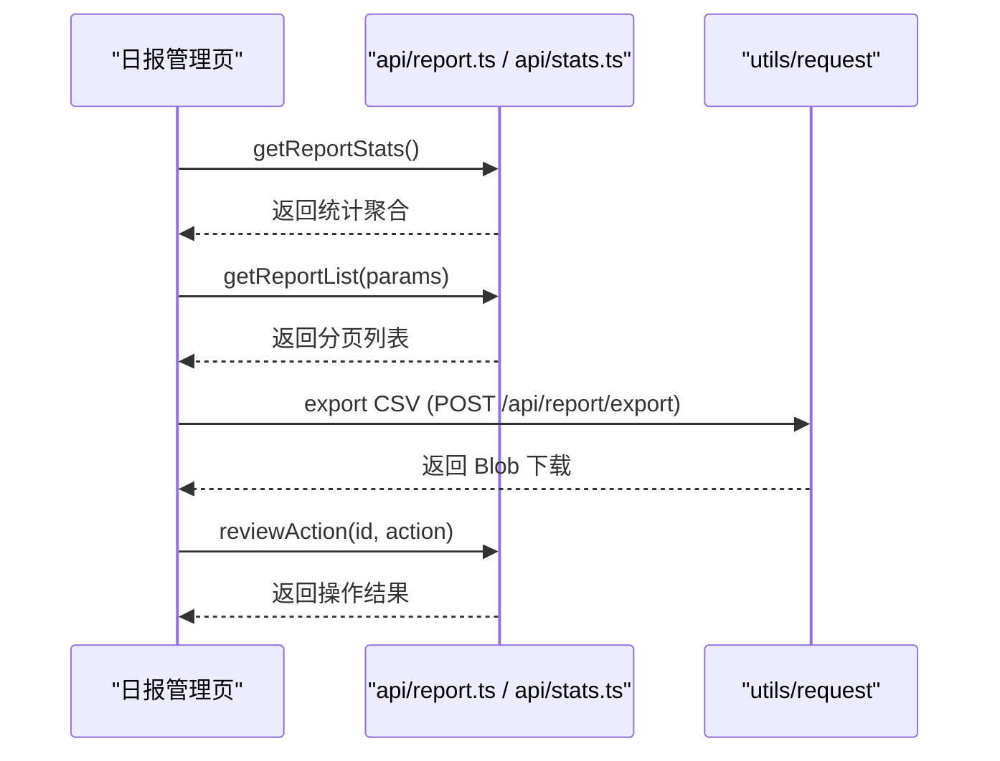
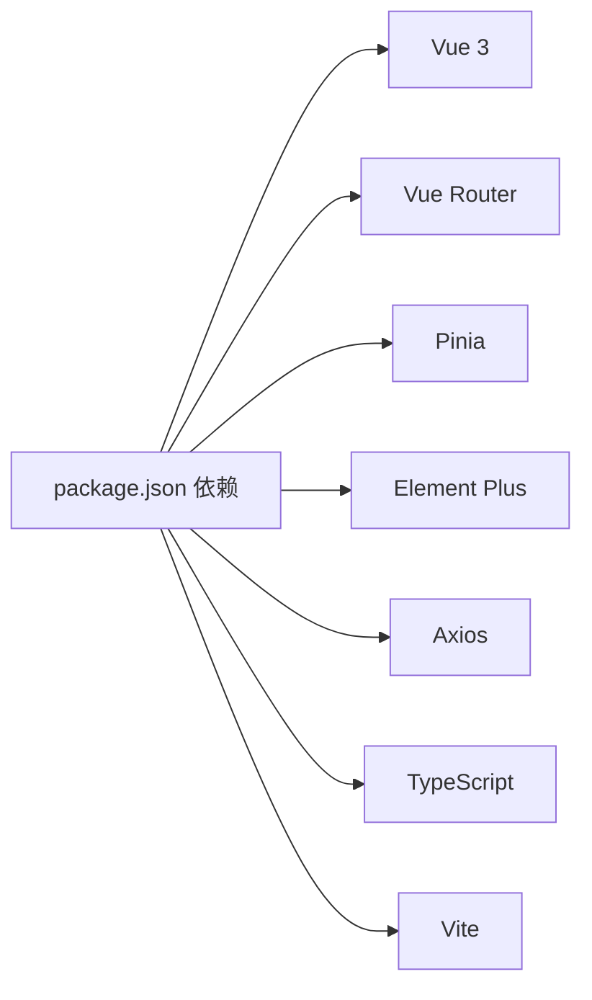

# Web 管理后台

<cite>
**本文引用的文件**
- [webapp/README.md](file://webapp/README.md)
- [webapp/docs/README.md](file://webapp/docs/README.md)
- [webapp/package.json](file://webapp/package.json)
- [webapp/vite.config.ts](file://webapp/vite.config.ts)
- [webapp/src/main.ts](file://webapp/src/main.ts)
- [webapp/src/router/index.ts](file://webapp/src/router/index.ts)
- [webapp/src/App.vue](file://webapp/src/App.vue)
- [webapp/src/layouts/DefaultLayout.vue](file://webapp/src/layouts/DefaultLayout.vue)
- [webapp/src/stores/user.ts](file://webapp/src/stores/user.ts)
- [webapp/src/stores/app.ts](file://webapp/src/stores/app.ts)
- [webapp/src/styles/variables.scss](file://webapp/src/styles/variables.scss)
- [webapp/src/types/api.d.ts](file://webapp/src/types/api.d.ts)
- [webapp/src/views/user/index.vue](file://webapp/src/views/user/index.vue)
- [webapp/src/views/approval/index.vue](file://webapp/src/views/approval/index.vue)
- [webapp/src/views/report/index.vue](file://webapp/src/views/report/index.vue)
- [webapp/src/views/project/index.vue](file://webapp/src/views/project/index.vue)
- [webapp/src/api/user.ts](file://webapp/src/api/user.ts)
</cite>

## 更新摘要
**所做更改**
- 删除了 Mini-PRD 文档引用，保留了 README 作为主要文档
- 更新了组件架构描述，反映当前的简化实现
- 修正了功能页面的描述，基于实际代码实现
- 更新了文档索引，移除了不存在的页面和模块
- 修正了 API 模块和路由清单的准确性

## 目录
1. [简介](#简介)
2. [项目结构](#项目结构)
3. [核心组件](#核心组件)
4. [架构总览](#架构总览)
5. [详细组件分析](#详细组件分析)
6. [依赖关系分析](#依赖关系分析)
7. [性能考虑](#性能考虑)
8. [故障排查指南](#故障排查指南)
9. [结论](#结论)
10. [附录](#附录)

## 简介
本文件为"智慧办公助手 OA 系统"的 Web 管理后台开发文档，基于 Vue 3 + TypeScript + Element Plus 技术栈，覆盖项目配置、路由设计、布局架构、主题配置、TypeScript 类型体系、核心功能页面实现、Element Plus 组件库使用、API 集成方案、状态管理策略与权限控制机制。

**更新** 基于最新的项目状态，文档已更新以反映简化的架构和实际的功能实现。

## 项目结构
- 采用 Vite + Vue 3 + TypeScript 构建，使用 Pinia 进行状态管理，Element Plus 提供 UI 组件库。
- 核心目录组织：
  - src/api：封装后端接口调用
  - src/components：可复用组件（如头部、侧边栏）
  - src/layouts：布局容器（默认布局）
  - src/router：路由定义与导航守卫
  - src/stores：Pinia 状态管理（用户、应用）
  - src/styles：全局样式与主题变量
  - src/types：全局类型声明
  - src/utils：工具函数（如请求封装）
  - src/views：页面视图（用户、审批、日报、项目、仪表盘、登录、错误页）

**图表来源**
- [webapp/src/main.ts:1-28](file://webapp/src/main.ts#L1-L28)
- [webapp/src/App.vue:1-11](file://webapp/src/App.vue#L1-L11)
- [webapp/src/router/index.ts:1-77](file://webapp/src/router/index.ts#L1-L77)
- [webapp/src/layouts/DefaultLayout.vue:1-54](file://webapp/src/layouts/DefaultLayout.vue#L1-L54)

**章节来源**
- [webapp/package.json:1-53](file://webapp/package.json#L1-L53)
- [webapp/vite.config.ts:1-33](file://webapp/vite.config.ts#L1-L33)

## 核心组件
- 应用入口与插件初始化：注册 Element Plus、全局图标、Pinia、路由，并挂载应用。
- 默认布局：包含固定侧边栏与主内容区，支持侧边栏折叠与宽度过渡。
- 路由系统：定义登录页、仪表盘、用户管理、审批管理、日报管理、项目管理等页面；设置公共路由与鉴权守卫。
- 状态管理：用户态（token、用户信息、权限）、应用态（侧边栏折叠、移动端标识）。
- 主题与样式：SCSS 变量集中管理，CSS 变量同步，统一颜色、尺寸、阴影与组件风格。

**章节来源**
- [webapp/src/main.ts:1-28](file://webapp/src/main.ts#L1-L28)
- [webapp/src/layouts/DefaultLayout.vue:1-54](file://webapp/src/layouts/DefaultLayout.vue#L1-L54)
- [webapp/src/router/index.ts:1-77](file://webapp/src/router/index.ts#L1-L77)
- [webapp/src/stores/user.ts:1-54](file://webapp/src/stores/user.ts#L1-L54)
- [webapp/src/stores/app.ts:1-30](file://webapp/src/stores/app.ts#L1-L30)
- [webapp/src/styles/variables.scss:1-83](file://webapp/src/styles/variables.scss#L1-L83)

## 架构总览
前端采用"视图层 + 状态层 + API 层 + 布局层"的分层架构，配合 Element Plus 组件库与 SCSS 主题变量，形成一致的视觉与交互体验。

**图表来源**
- [webapp/src/views/user/index.vue:1-289](file://webapp/src/views/user/index.vue#L1-L289)
- [webapp/src/views/approval/index.vue:1-77](file://webapp/src/views/approval/index.vue#L1-L77)
- [webapp/src/views/report/index.vue:1-290](file://webapp/src/views/report/index.vue#L1-L290)
- [webapp/src/views/project/index.vue:1-117](file://webapp/src/views/project/index.vue#L1-L117)
- [webapp/src/stores/user.ts:1-54](file://webapp/src/stores/user.ts#L1-L54)
- [webapp/src/stores/app.ts:1-30](file://webapp/src/stores/app.ts#L1-L30)
- [webapp/src/api/user.ts:1-63](file://webapp/src/api/user.ts#L1-L63)
- [webapp/src/layouts/DefaultLayout.vue:1-54](file://webapp/src/layouts/DefaultLayout.vue#L1-L54)

## 详细组件分析

### 路由与导航守卫
- 路由结构：
  - 登录页：公开访问
  - 布局页：包含仪表盘、用户管理、审批管理、日报管理、项目管理子路由
  - 404 页：兜底
- 导航守卫：
  - 对非公开路由进行鉴权，若无 token 则重定向至登录页

**图表来源**
- [webapp/src/router/index.ts:59-74](file://webapp/src/router/index.ts#L59-L74)
- [webapp/src/stores/user.ts:15-20](file://webapp/src/stores/user.ts#L15-L20)

**章节来源**
- [webapp/src/router/index.ts:1-77](file://webapp/src/router/index.ts#L1-L77)
- [webapp/src/stores/user.ts:1-54](file://webapp/src/stores/user.ts#L1-L54)

### 布局与主题
- 布局：
  - 固定侧边栏，支持折叠；主内容区根据侧边栏宽度动态调整 margin-left
  - 顶部导航与面包屑由侧边栏组件提供
- 主题：
  - 使用 SCSS 变量集中定义主色、功能色、文字色、边框色、背景色、字号、间距、圆角、阴影
  - 同步生成 CSS 变量，供组件与样式使用

**图表来源**
- [webapp/src/layouts/DefaultLayout.vue:9-26](file://webapp/src/layouts/DefaultLayout.vue#L9-L26)
- [webapp/src/stores/app.ts:6-12](file://webapp/src/stores/app.ts#L6-L12)
- [webapp/src/styles/variables.scss:53-62](file://webapp/src/styles/variables.scss#L53-L62)

**章节来源**
- [webapp/src/layouts/DefaultLayout.vue:1-54](file://webapp/src/layouts/DefaultLayout.vue#L1-L54)
- [webapp/src/stores/app.ts:1-30](file://webapp/src/stores/app.ts#L1-L30)
- [webapp/src/styles/variables.scss:1-83](file://webapp/src/styles/variables.scss#L1-L83)

### TypeScript 类型体系
- 全局类型：
  - 通用响应结构、分页参数与结果、用户信息、登录响应、审批项/详情/时间线、日报、公告、项目、资产、部门、角色等
- 页面内类型：
  - 使用接口约束 API 返回与本地状态，确保类型安全
- API 类型：
  - 用户模块类型与接口定义分离，便于维护与复用

**图表来源**
- [webapp/src/types/api.d.ts:3-162](file://webapp/src/types/api.d.ts#L3-L162)
- [webapp/src/api/user.ts:20-27](file://webapp/src/api/user.ts#L20-L27)

**章节来源**
- [webapp/src/types/api.d.ts:1-162](file://webapp/src/types/api.d.ts#L1-L162)
- [webapp/src/api/user.ts:1-63](file://webapp/src/api/user.ts#L1-L63)

### Element Plus 组件库与自定义组件
- 全局注册：
  - 注册 Element Plus 中文语言包与所有图标组件，便于在全局使用
- 自定义组件：
  - TopBar、ModuleSidebar 作为布局子组件，分别负责顶部导航与侧边菜单
- 表单与表格：
  - 使用 ElForm、ElTable、ElPagination、ElDialog、ElTabs 等构建复杂交互
- 数据展示：
  - 使用 ElDescriptions、ElCard、ElTag、ElAlert 等增强可读性与信息密度

**章节来源**
- [webapp/src/main.ts:7-21](file://webapp/src/main.ts#L7-L21)
- [webapp/src/components/TopBar/index.vue](file://webapp/src/components/TopBar/index.vue)
- [webapp/src/components/ModuleSidebar/index.vue](file://webapp/src/components/ModuleSidebar/index.vue)

### 用户管理页面
- 功能点：
  - 多条件搜索与筛选（关键词、角色、状态）
  - 分页加载用户列表
  - 用户角色切换、状态切换、删除、审核、注册与邀请
  - 弹窗表单与批量操作
- 类型与 API：
  - 使用 UserItem、UserListParams、UserListResult 等类型
  - 通过 api/user.ts 的接口完成 CRUD 与状态变更

**图表来源**
- [webapp/src/views/user/index.vue:45-58](file://webapp/src/views/user/index.vue#L45-L58)
- [webapp/src/api/user.ts:29-62](file://webapp/src/api/user.ts#L29-L62)
- [webapp/src/stores/user.ts:38-41](file://webapp/src/stores/user.ts#L38-L41)

**章节来源**
- [webapp/src/views/user/index.vue:1-289](file://webapp/src/views/user/index.vue#L1-L289)
- [webapp/src/api/user.ts:1-63](file://webapp/src/api/user.ts#L1-L63)

### 审批管理页面
- 功能点：
  - 三种标签页：待审批、我发起的、已处理
  - 列表展示审批标题、类型、申请人、部门、日期与状态
  - 基于请求封装进行数据拉取与刷新

**章节来源**
- [webapp/src/views/approval/index.vue:1-77](file://webapp/src/views/approval/index.vue#L1-L77)

### 日报管理页面
- 功能点：
  - 三类标签页：统计看板、日报查询、人员看板
  - 统计看板：总数量、月度数量、待审数量、通过数量、通过率
  - 日报查询：多维筛选、导出 CSV、详情弹窗、审核通过/驳回、删除
  - 人员看板：按人员维度统计与跳转查询
- 关键流程：Tab 切换触发对应数据加载；导出流程通过 fetch 发送带 Token 的请求并下载 Blob 文件

**图表来源**
- [webapp/src/views/report/index.vue:54-123](file://webapp/src/views/report/index.vue#L54-L123)
- [webapp/src/views/report/index.vue:83-104](file://webapp/src/views/report/index.vue#L83-L104)

**章节来源**
- [webapp/src/views/report/index.vue:1-290](file://webapp/src/views/report/index.vue#L1-L290)

### 项目管理页面
- 功能点：
  - 将日报数据按项目分组，统计项目下的日报数、参与人数与最近更新时间
  - 支持项目名搜索与刷新
- 数据来源：合并"待审核"与"已通过"的日报列表，进行聚合计算

**章节来源**
- [webapp/src/views/project/index.vue:1-117](file://webapp/src/views/project/index.vue#L1-L117)

### API 集成方案
- 请求封装：
  - 通过 utils/request 统一处理请求头、拦截器与错误处理
- 接口契约：
  - 所有接口返回统一的 ApiResponse 结构，结合泛型确保类型安全
- 示例：
  - 用户管理：getUserList、setAdminRole、toggleUserStatus、createUser、approveUser、deleteUser
  - 日报管理：getReportStats、getReportList、reviewAction、getWorkerStats、deleteReport
  - 项目管理：getReviewList（用于获取待审核/已通过的日报）

**章节来源**
- [webapp/src/types/api.d.ts:3-8](file://webapp/src/types/api.d.ts#L3-L8)
- [webapp/src/api/user.ts:29-62](file://webapp/src/api/user.ts#L29-L62)

### 状态管理策略
- 用户状态：
  - token、userInfo、登录态、管理员态、权限校验、登出
- 应用状态：
  - 侧边栏折叠、移动端标识
- 使用 Pinia 的组合式 Store，提供响应式状态与派生计算，避免重复逻辑

**章节来源**
- [webapp/src/stores/user.ts:1-54](file://webapp/src/stores/user.ts#L1-L54)
- [webapp/src/stores/app.ts:1-30](file://webapp/src/stores/app.ts#L1-L30)

### 权限控制机制
- 路由级权限：
  - 通过 meta.public 区分公开路由；非公开路由在 beforeEach 中检查 token
- 组件级权限：
  - 通过用户 store 的 hasPermission 实现细粒度按钮/菜单可见性控制（建议在具体页面中按需扩展）

**章节来源**
- [webapp/src/router/index.ts:59-74](file://webapp/src/router/index.ts#L59-L74)
- [webapp/src/stores/user.ts:38-41](file://webapp/src/stores/user.ts#L38-L41)

## 依赖关系分析
- 构建与脚手架：Vite、TypeScript、ESLint、Prettier
- 运行时依赖：Vue 3、Vue Router、Pinia、Element Plus、Axios、ECharts、XLSX
- 开发依赖：TS 配置、ESLint 插件、Prettier、Husky、lint-staged

**图表来源**
- [webapp/package.json:15-23](file://webapp/package.json#L15-L23)
- [webapp/package.json:24-44](file://webapp/package.json#L24-L44)

**章节来源**
- [webapp/package.json:1-53](file://webapp/package.json#L1-L53)

## 性能考虑
- 路由懒加载：使用动态导入减少首屏体积
- 组件懒加载：Element Plus 图标按需注册，避免全局引入
- 分页与虚拟滚动：在大数据表格场景建议引入虚拟滚动或服务端分页
- 缓存策略：对静态资源与接口结果进行合理缓存，降低重复请求
- 样式优化：统一使用 SCSS 变量，减少重复样式与重绘

## 故障排查指南
- 登录后无法进入受保护页面：
  - 检查路由守卫是否正确读取 token；确认登录成功后是否写入 localStorage
- 侧边栏宽度异常：
  - 检查应用 store 的 sidebarCollapsed 状态与样式计算
- 表格数据不显示：
  - 检查接口返回结构与分页参数；确认类型定义与实际返回一致
- 导出失败：
  - 检查 Token 是否携带、后端接口是否允许跨域、Blob 下载是否成功
- Element Plus 组件样式错乱：
  - 确认主题变量已正确引入，且未被局部样式覆盖

**章节来源**
- [webapp/src/router/index.ts:59-74](file://webapp/src/router/index.ts#L59-L74)
- [webapp/src/stores/app.ts:6-12](file://webapp/src/stores/app.ts#L6-L12)
- [webapp/src/views/report/index.vue:83-104](file://webapp/src/views/report/index.vue#L83-L104)
- [webapp/src/styles/variables.scss:64-82](file://webapp/src/styles/variables.scss#L64-L82)

## 结论
本项目以 Vue 3 + TypeScript 为基础，结合 Element Plus 与 Pinia，构建了清晰的分层架构与统一的主题体系。通过完善的路由守卫与状态管理，实现了良好的权限控制与用户体验。核心功能页面覆盖用户、审批、日报、项目等关键业务，配合类型安全的 API 定义与组件化 UI，具备良好的可维护性与扩展性。

**更新** 基于当前的简化实现，文档反映了实际的功能状态和架构设计。

## 附录
- 开发命令：
  - dev：启动开发服务器
  - build：类型检查与打包
  - preview：预览生产包
  - lint/format/type-check：代码质量与格式化
- 代理配置：
  - /api 前缀转发至 https://warblood.online，便于联调后端

**章节来源**
- [webapp/package.json:6-13](file://webapp/package.json#L6-L13)
- [webapp/vite.config.ts:21-31](file://webapp/vite.config.ts#L21-L31)

### 项目文档与状态

**更新** 基于最新的项目状态，更新了文档索引和功能模块描述。

#### 项目文档清单
- 项目规则：`.trae/rules/project.md` - 开发规范、强制要求、核心原则
- PRD：`docs/Web-PRD.md` - 产品需求、功能规格、验收标准
- 技术文档：`docs/Technical-Selection.md` - 技术选型方案

#### 已实现功能模块
- **仪表盘** - 全局数据看板、待办事项、系统状态
- **用户管理** - 用户CRUD、部门管理、批量导入导出
- **审批管理** - 审批列表查看、状态管理
- **日报管理** - 提交率统计、批量审核、导出、模板配置
- **项目管理** - 项目总览、任务看板、进度统计

#### 项目开发里程碑
- M0：项目初始化 - ✅ 已完成
- M1：用户与权限 - 🔜 进行中  
- M2：内容编排 - ⚪ 待开发
- M3：审批管理 - ⚪ 待开发
- M4：仪表盘+日报 - ⚪ 待开发
- M5：系统运维 - ⚪ 待开发
- M6：项目+资产 - ⚪ 待开发
- M7：公告+消息 - ⚪ 待开发
- M8：发布上线 - ⚪ 待开发

**章节来源**
- [webapp/README.md:1-99](file://webapp/README.md#L1-L99)
- [webapp/docs/README.md:1-106](file://webapp/docs/README.md#L1-L106)