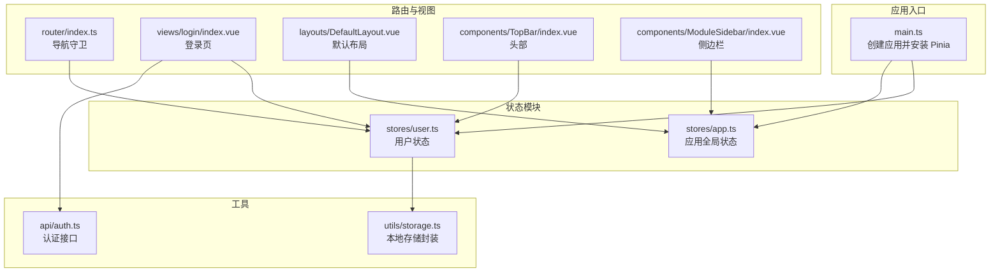
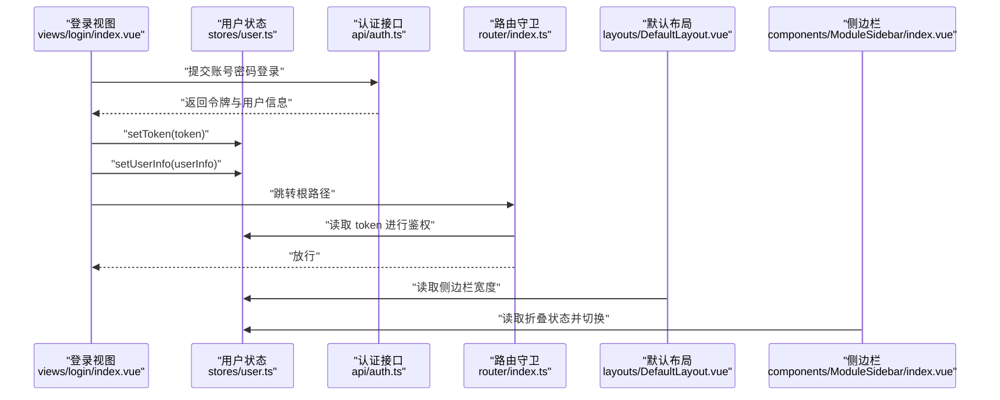
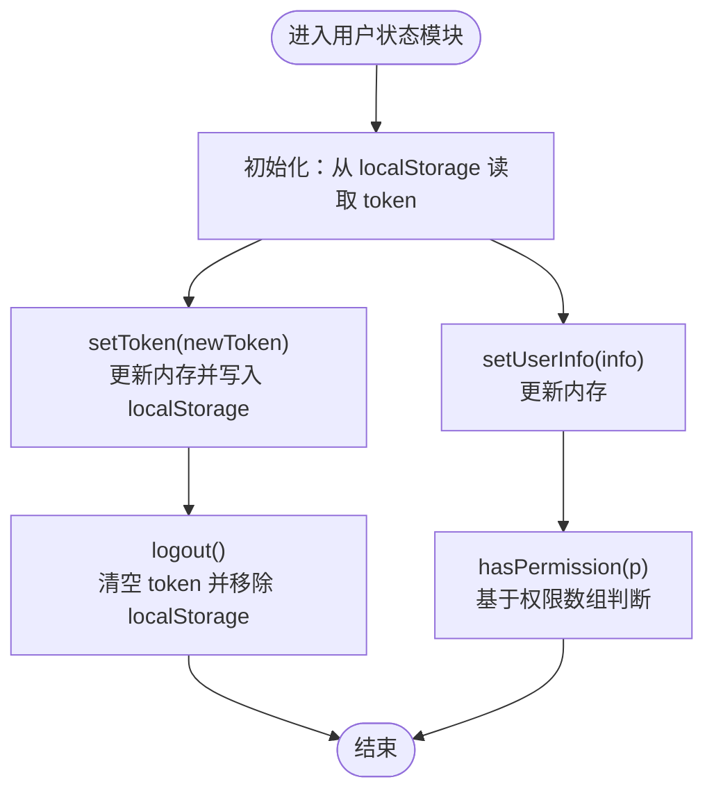
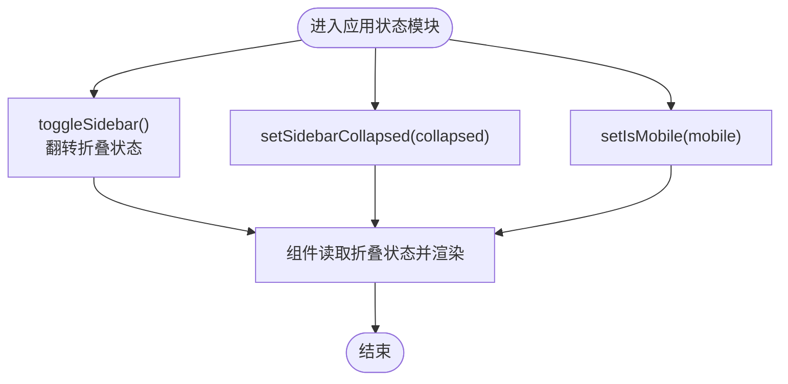
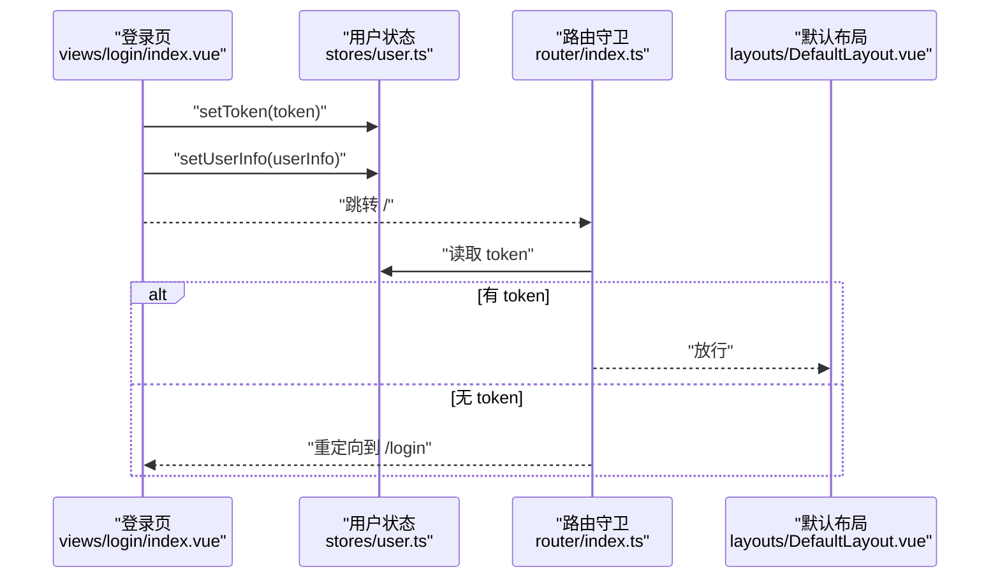
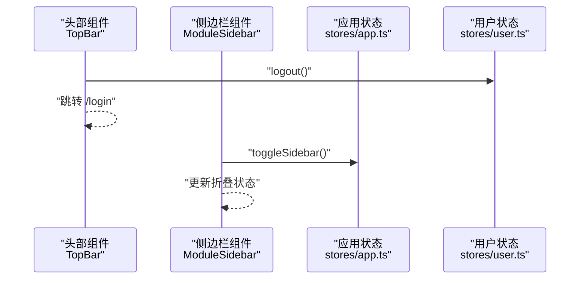
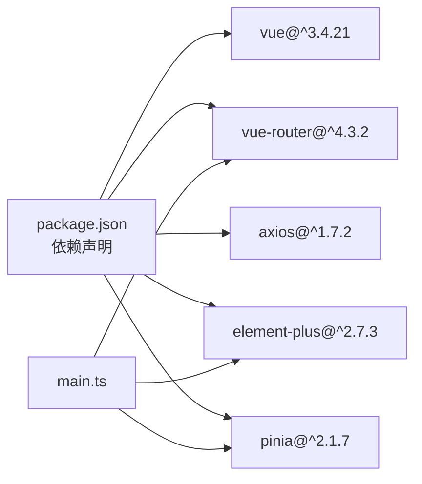

# 状态管理

<cite>
**本文引用的文件**
- [main.ts](file://webapp/src/main.ts)
- [app.ts](file://webapp/src/stores/app.ts)
- [user.ts](file://webapp/src/stores/user.ts)
- [storage.ts](file://webapp/src/utils/storage.ts)
- [index.ts](file://webapp/src/router/index.ts)
- [index.vue](file://webapp/src/views/login/index.vue)
- [DefaultLayout.vue](file://webapp/src/layouts/DefaultLayout.vue)
- [index.vue](file://webapp/src/components/TopBar/index.vue)
- [index.vue](file://webapp/src/components/ModuleSidebar/index.vue)
- [auth.ts](file://webapp/src/api/auth.ts)
- [package.json](file://webapp/package.json)
</cite>

## 目录
1. [简介](#简介)
2. [项目结构](#项目结构)
3. [核心组件](#核心组件)
4. [架构总览](#架构总览)
5. [详细组件分析](#详细组件分析)
6. [依赖分析](#依赖分析)
7. [性能考虑](#性能考虑)
8. [故障排查指南](#故障排查指南)
9. [结论](#结论)
10. [附录](#附录)

## 简介
本文件面向 Web 管理后台的状态管理系统，基于 Pinia 进行状态建模与持久化，覆盖用户状态（登录态、权限、资料）、全局布局状态（侧边栏折叠、移动端标识），并给出模块划分、命名规范、数据流与本地存储策略的最佳实践。同时提供调试与快照建议，帮助开发者高效定位问题。

## 项目结构
- 应用入口通过 Pinia 容器挂载全局状态，路由在导航守卫中读取用户状态进行鉴权。
- 状态模块按职责拆分：用户状态与应用全局状态分别独立维护。
- 组件通过组合式 API 访问状态，实现解耦与可测试性。

**图表来源**
- [main.ts:1-28](file://webapp/src/main.ts#L1-L28)
- [user.ts:1-54](file://webapp/src/stores/user.ts#L1-L54)
- [app.ts:1-30](file://webapp/src/stores/app.ts#L1-L30)
- [index.ts:1-77](file://webapp/src/router/index.ts#L1-L77)
- [index.vue:1-211](file://webapp/src/views/login/index.vue#L1-L211)
- [DefaultLayout.vue:1-54](file://webapp/src/layouts/DefaultLayout.vue#L1-L54)
- [index.vue:1-89](file://webapp/src/components/TopBar/index.vue#L1-L89)
- [index.vue:1-148](file://webapp/src/components/ModuleSidebar/index.vue#L1-L148)
- [storage.ts:1-59](file://webapp/src/utils/storage.ts#L1-L59)
- [auth.ts:1-31](file://webapp/src/api/auth.ts#L1-L31)

**章节来源**
- [main.ts:1-28](file://webapp/src/main.ts#L1-L28)
- [package.json:1-53](file://webapp/package.json#L1-L53)

## 核心组件
- 用户状态模块（user）
  - 状态：令牌、用户信息
  - 计算属性：登录态、是否管理员
  - 动作：设置令牌、设置用户信息、登出、权限校验
  - 本地持久化：令牌写入 localStorage
- 应用全局状态模块（app）
  - 状态：侧边栏折叠、移动端标识
  - 动作：切换折叠、设置折叠、设置移动端
- 本地存储封装（storage）
  - 提供 localStorage/sessionStorage 的通用读写封装，支持泛型解析

**章节来源**
- [user.ts:1-54](file://webapp/src/stores/user.ts#L1-L54)
- [app.ts:1-30](file://webapp/src/stores/app.ts#L1-L30)
- [storage.ts:1-59](file://webapp/src/utils/storage.ts#L1-L59)

## 架构总览
下图展示从登录到路由守卫、再到组件消费状态的整体流程。

**图表来源**
- [index.vue:1-211](file://webapp/src/views/login/index.vue#L1-L211)
- [user.ts:1-54](file://webapp/src/stores/user.ts#L1-L54)
- [auth.ts:1-31](file://webapp/src/api/auth.ts#L1-L31)
- [index.ts:1-77](file://webapp/src/router/index.ts#L1-L77)
- [DefaultLayout.vue:1-54](file://webapp/src/layouts/DefaultLayout.vue#L1-L54)
- [index.vue:1-148](file://webapp/src/components/ModuleSidebar/index.vue#L1-L148)

## 详细组件分析

### 用户状态模块（user）
- 数据结构
  - 令牌：字符串，来自登录成功响应
  - 用户信息：包含用户标识、昵称、头像、角色、部门、权限列表
- 计算属性
  - 登录态：基于令牌是否存在
  - 是否管理员：基于角色是否为管理员或超级管理员
- 动作
  - 设置令牌：更新内存值并持久化到 localStorage
  - 设置用户信息：更新内存值
  - 登出：清空令牌与用户信息，并移除 localStorage 中的令牌
  - 权限校验：基于用户权限列表判断是否具备某项权限
- 本地存储策略
  - 令牌采用 localStorage 持久化；刷新页面后仍可保持登录态
  - 未实现自动拉取用户资料的“刷新”动作，可在业务需要时扩展

**图表来源**
- [user.ts:1-54](file://webapp/src/stores/user.ts#L1-L54)

**章节来源**
- [user.ts:1-54](file://webapp/src/stores/user.ts#L1-L54)

### 应用全局状态模块（app）
- 数据结构
  - 侧边栏折叠：布尔值，决定菜单是否折叠
  - 移动端标识：布尔值，用于适配移动端布局
- 动作
  - 切换折叠：翻转折叠状态
  - 设置折叠：直接赋值
  - 设置移动端：直接赋值
- 使用场景
  - 默认布局根据折叠状态计算主内容区左侧边距
  - 侧边栏组件监听折叠状态并渲染不同布局

**图表来源**
- [app.ts:1-30](file://webapp/src/stores/app.ts#L1-L30)
- [DefaultLayout.vue:1-54](file://webapp/src/layouts/DefaultLayout.vue#L1-L54)
- [index.vue:1-148](file://webapp/src/components/ModuleSidebar/index.vue#L1-L148)

**章节来源**
- [app.ts:1-30](file://webapp/src/stores/app.ts#L1-L30)
- [DefaultLayout.vue:1-54](file://webapp/src/layouts/DefaultLayout.vue#L1-L54)
- [index.vue:1-148](file://webapp/src/components/ModuleSidebar/index.vue#L1-L148)

### 登录流程与路由守卫
- 登录页
  - 接收后端返回的令牌，写入用户状态
  - 写入用户信息（昵称、角色、部门等）
  - 成功后跳转至根路径
- 路由守卫
  - 对非公开路由，在进入前检查用户状态中的令牌
  - 无令牌则重定向至登录页

**图表来源**
- [index.vue:1-211](file://webapp/src/views/login/index.vue#L1-L211)
- [user.ts:1-54](file://webapp/src/stores/user.ts#L1-L54)
- [index.ts:1-77](file://webapp/src/router/index.ts#L1-L77)

**章节来源**
- [index.vue:1-211](file://webapp/src/views/login/index.vue#L1-L211)
- [index.ts:1-77](file://webapp/src/router/index.ts#L1-L77)

### 头部与侧边栏组件
- 头部组件
  - 读取用户信息显示头像与昵称
  - 下拉菜单支持“个人中心”与“退出登录”
  - 退出登录时调用用户状态的登出动作并跳转登录页
- 侧边栏组件
  - 读取应用状态的折叠状态
  - 提供折叠/展开按钮，调用应用状态的动作切换折叠

**图表来源**
- [index.vue:1-89](file://webapp/src/components/TopBar/index.vue#L1-L89)
- [index.vue:1-148](file://webapp/src/components/ModuleSidebar/index.vue#L1-L148)
- [app.ts:1-30](file://webapp/src/stores/app.ts#L1-L30)
- [user.ts:1-54](file://webapp/src/stores/user.ts#L1-L54)

**章节来源**
- [index.vue:1-89](file://webapp/src/components/TopBar/index.vue#L1-L89)
- [index.vue:1-148](file://webapp/src/components/ModuleSidebar/index.vue#L1-L148)

## 依赖分析
- 状态容器
  - 应用在入口处安装 Pinia，所有状态模块通过 defineStore 定义
- 组件依赖
  - 视图与组件通过组合式 API 访问状态，避免跨层级传递
- 工具依赖
  - 本地存储封装提供统一的读写能力，减少重复代码
- 外部依赖
  - Vue Router 用于导航守卫与路由跳转
  - Element Plus 用于 UI 组件与图标

**图表来源**
- [package.json:1-53](file://webapp/package.json#L1-L53)
- [main.ts:1-28](file://webapp/src/main.ts#L1-L28)

**章节来源**
- [package.json:1-53](file://webapp/package.json#L1-L53)
- [main.ts:1-28](file://webapp/src/main.ts#L1-L28)

## 性能考虑
- 状态粒度
  - 将用户状态与布局状态分离，避免无关状态变更触发不必要的重渲染
- 计算属性
  - 使用 computed 缓存派生数据（如登录态、管理员态），减少重复计算
- 本地存储
  - 令牌持久化于 localStorage，减少每次刷新的网络请求
- 组件更新
  - 通过只读引用与计算属性读取状态，尽量避免深层嵌套对象的频繁替换

## 故障排查指南
- 登录后无法进入受保护页面
  - 检查路由守卫是否正确读取用户状态中的令牌
  - 确认登录页是否成功调用设置令牌与用户信息的动作
- 退出登录后仍可访问
  - 确认登出动作是否清除令牌并移除本地存储
  - 检查是否有其他地方缓存了令牌
- 侧边栏折叠状态异常
  - 确认组件是否正确绑定应用状态的折叠状态
  - 检查布局组件是否根据折叠状态计算主内容区的边距
- 本地存储读写问题
  - 使用统一的存储封装进行读写，确保类型安全与序列化一致

**章节来源**
- [index.ts:1-77](file://webapp/src/router/index.ts#L1-L77)
- [user.ts:1-54](file://webapp/src/stores/user.ts#L1-L54)
- [app.ts:1-30](file://webapp/src/stores/app.ts#L1-L30)
- [storage.ts:1-59](file://webapp/src/utils/storage.ts#L1-L59)

## 结论
本状态管理方案以 Pinia 为核心，将用户状态与应用全局状态清晰分离，结合路由守卫实现基础鉴权，配合统一的本地存储封装提升可维护性。建议后续补充用户资料的自动刷新与权限路由控制，进一步完善安全与体验。

## 附录

### 状态模块划分原则与命名规范
- 模块划分
  - 用户相关：登录态、角色、权限、资料
  - 应用全局：布局、主题、语言、设备类型等
- 命名规范
  - 模块文件：小驼峰，如 user.ts、app.ts
  - 导出函数：useXxxStore 或 useXxx
  - 状态字段：语义化小驼峰，如 isMobile、sidebarCollapsed
  - 动作方法：动词短语，如 toggleSidebar、setToken

### 数据流向最佳实践
- 单向数据流：视图 -> 动作 -> 状态 -> 组件渲染
- 避免跨模块直接修改：通过动作间接更新
- 计算属性优先：对派生数据使用 computed
- 本地存储：仅存放必要且可序列化的轻量数据

### 本地存储策略
- 令牌：localStorage 持久化，刷新后仍有效
- 临时会话：可使用 sessionStorage
- 统一封装：通过 storage.local/storage.session 提供类型安全的读写

### 调试与快照
- 开发者工具
  - 使用浏览器 Vue DevTools 查看 Pinia 状态树
- 快照建议
  - 在关键节点（登录、登出、权限变更）记录状态快照
  - 对比前后状态差异，定位异常