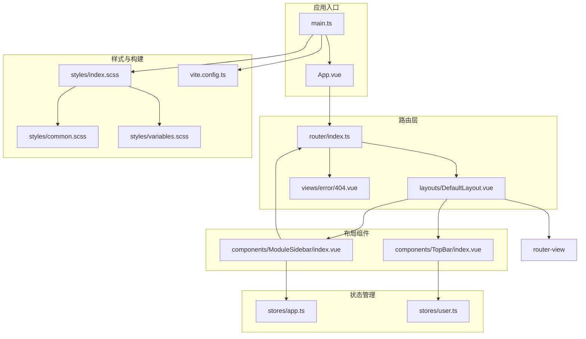
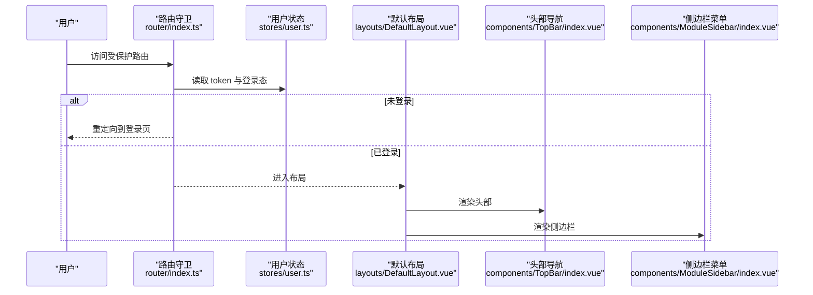
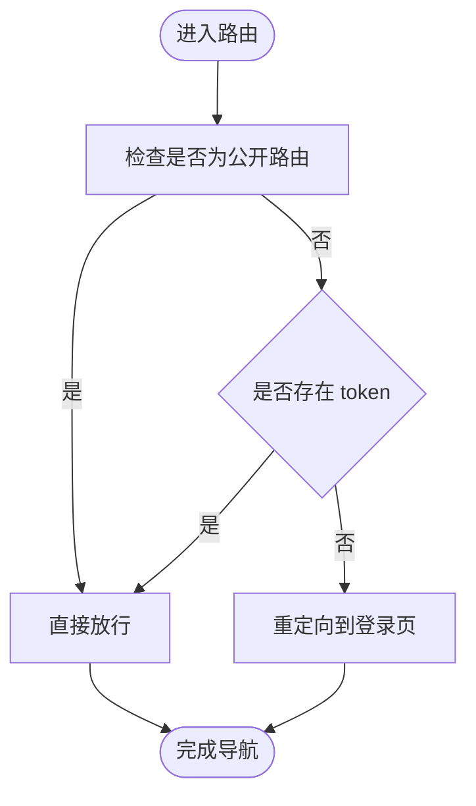
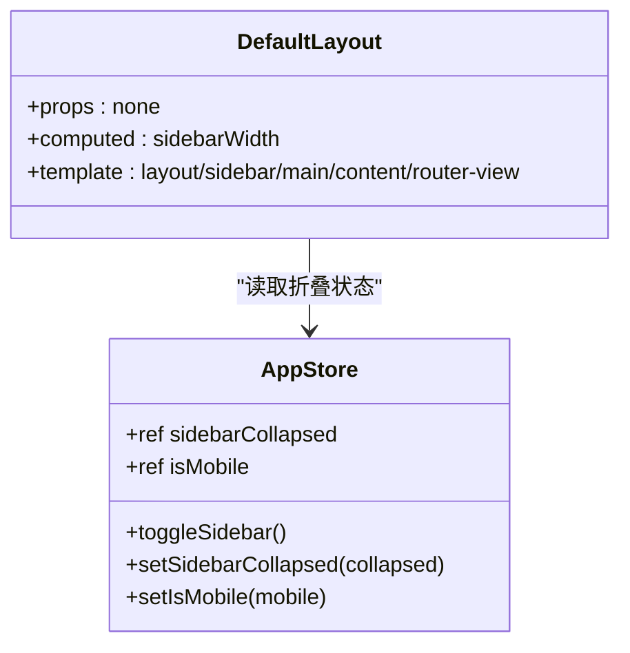
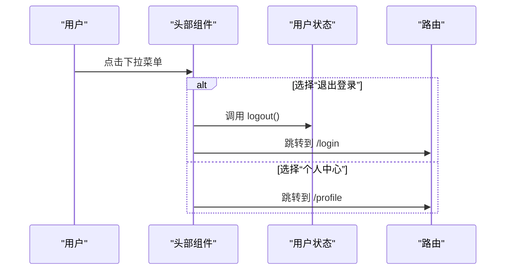
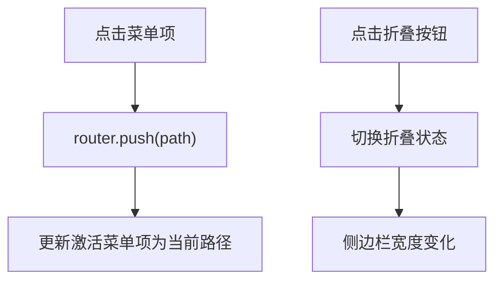
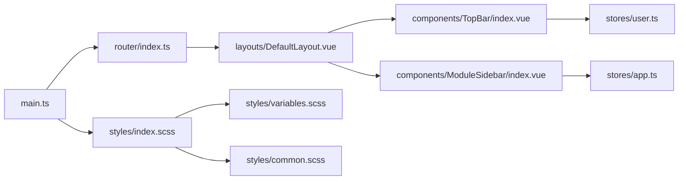

# 路由与布局

<cite>
**本文引用的文件**
- [webapp/src/router/index.ts](file://webapp/src/router/index.ts)
- [webapp/src/layouts/DefaultLayout.vue](file://webapp/src/layouts/DefaultLayout.vue)
- [webapp/src/components/TopBar/index.vue](file://webapp/src/components/TopBar/index.vue)
- [webapp/src/components/ModuleSidebar/index.vue](file://webapp/src/components/ModuleSidebar/index.vue)
- [webapp/src/stores/app.ts](file://webapp/src/stores/app.ts)
- [webapp/src/stores/user.ts](file://webapp/src/stores/user.ts)
- [webapp/src/views/error/404.vue](file://webapp/src/views/error/404.vue)
- [webapp/src/main.ts](file://webapp/src/main.ts)
- [webapp/vite.config.ts](file://webapp/vite.config.ts)
- [webapp/src/styles/index.scss](file://webapp/src/styles/index.scss)
- [webapp/src/styles/common.scss](file://webapp/src/styles/common.scss)
- [webapp/src/styles/variables.scss](file://webapp/src/styles/variables.scss)
- [webapp/src/views/dashboard/index.vue](file://webapp/src/views/dashboard/index.vue)
- [webapp/src/App.vue](file://webapp/src/App.vue)
- [webapp/src/types/api.d.ts](file://webapp/src/types/api.d.ts)
- [webapp/src/api/auth.ts](file://webapp/src/api/auth.ts)
</cite>

## 目录
1. [简介](#简介)
2. [项目结构](#项目结构)
3. [核心组件](#核心组件)
4. [架构总览](#架构总览)
5. [详细组件分析](#详细组件分析)
6. [依赖关系分析](#依赖关系分析)
7. [性能考量](#性能考量)
8. [故障排查指南](#故障排查指南)
9. [结论](#结论)
10. [附录](#附录)

## 简介
本文件面向 Web 管理后台的前端工程，系统性梳理路由与布局体系：包括 Vue Router 的路由配置、路由守卫、动态路由与嵌套路由；默认布局组件的设计理念与实现细节（头部导航、侧边栏菜单、内容区域）；响应式设计、菜单权限控制、面包屑导航、页面标题管理；以及路由懒加载、权限验证、404 页面处理的最佳实践。同时提供移动端适配、主题切换、国际化支持等扩展能力的实现思路。

## 项目结构
该工程采用基于功能域的组织方式，路由与布局相关的核心目录如下：
- 路由：webapp/src/router/index.ts
- 布局：webapp/src/layouts/DefaultLayout.vue
- 头部与侧边栏：webapp/src/components/TopBar/index.vue、webapp/src/components/ModuleSidebar/index.vue
- 状态管理：webapp/src/stores/app.ts、webapp/src/stores/user.ts
- 错误页：webapp/src/views/error/404.vue
- 应用入口与构建：webapp/src/main.ts、webapp/vite.config.ts
- 样式：webapp/src/styles/index.scss、webapp/src/styles/common.scss、webapp/src/styles/variables.scss
- 视图示例：webapp/src/views/dashboard/index.vue
- 类型与接口：webapp/src/types/api.d.ts、webapp/src/api/auth.ts

图表来源
- [webapp/src/main.ts:1-28](file://webapp/src/main.ts#L1-L28)
- [webapp/src/App.vue:1-11](file://webapp/src/App.vue#L1-L11)
- [webapp/src/router/index.ts:1-77](file://webapp/src/router/index.ts#L1-L77)
- [webapp/src/layouts/DefaultLayout.vue:1-54](file://webapp/src/layouts/DefaultLayout.vue#L1-L54)
- [webapp/src/components/TopBar/index.vue:1-89](file://webapp/src/components/TopBar/index.vue#L1-L89)
- [webapp/src/components/ModuleSidebar/index.vue:1-148](file://webapp/src/components/ModuleSidebar/index.vue#L1-L148)
- [webapp/src/stores/app.ts:1-30](file://webapp/src/stores/app.ts#L1-L30)
- [webapp/src/stores/user.ts:1-54](file://webapp/src/stores/user.ts#L1-L54)
- [webapp/src/views/error/404.vue:1-61](file://webapp/src/views/error/404.vue#L1-L61)
- [webapp/src/styles/index.scss:1-4](file://webapp/src/styles/index.scss#L1-L4)
- [webapp/src/styles/common.scss:1-114](file://webapp/src/styles/common.scss#L1-L114)
- [webapp/src/styles/variables.scss:1-83](file://webapp/src/styles/variables.scss#L1-L83)
- [webapp/vite.config.ts:1-33](file://webapp/vite.config.ts#L1-L33)

章节来源
- [webapp/src/main.ts:1-28](file://webapp/src/main.ts#L1-L28)
- [webapp/src/router/index.ts:1-77](file://webapp/src/router/index.ts#L1-L77)
- [webapp/src/styles/index.scss:1-4](file://webapp/src/styles/index.scss#L1-L4)

## 核心组件
- 路由配置与守卫
  - 使用历史模式与路由懒加载，嵌套路由承载主布局与子页面。
  - 全局前置守卫实现未标记为公开的路由进行登录校验。
- 默认布局
  - 固定侧边栏与可收缩宽度，主内容区随侧边栏宽度自适应。
  - 内容区包含头部导航与路由视图插槽。
- 头部导航
  - 面包屑基于路由元信息 title 渲染，下拉菜单提供个人中心与退出登录。
- 侧边栏菜单
  - 固定菜单项集合，支持折叠/展开，点击跳转对应路由。
- 状态管理
  - 应用状态：侧边栏折叠、移动端标识。
  - 用户状态：token、用户信息、登录态、角色与权限判断。
- 错误页
  - 404 页面提供返回首页与返回上一页的操作。

章节来源
- [webapp/src/router/index.ts:1-77](file://webapp/src/router/index.ts#L1-L77)
- [webapp/src/layouts/DefaultLayout.vue:1-54](file://webapp/src/layouts/DefaultLayout.vue#L1-L54)
- [webapp/src/components/TopBar/index.vue:1-89](file://webapp/src/components/TopBar/index.vue#L1-L89)
- [webapp/src/components/ModuleSidebar/index.vue:1-148](file://webapp/src/components/ModuleSidebar/index.vue#L1-L148)
- [webapp/src/stores/app.ts:1-30](file://webapp/src/stores/app.ts#L1-L30)
- [webapp/src/stores/user.ts:1-54](file://webapp/src/stores/user.ts#L1-L54)
- [webapp/src/views/error/404.vue:1-61](file://webapp/src/views/error/404.vue#L1-L61)

## 架构总览
整体采用“路由驱动布局”的架构：路由负责页面级导航与权限控制，布局组件负责页面结构与交互行为，状态管理在组件间共享布局状态与用户信息，样式通过变量与通用样式统一风格。

图表来源
- [webapp/src/router/index.ts:59-74](file://webapp/src/router/index.ts#L59-L74)
- [webapp/src/stores/user.ts:18-21](file://webapp/src/stores/user.ts#L18-L21)
- [webapp/src/layouts/DefaultLayout.vue:14-27](file://webapp/src/layouts/DefaultLayout.vue#L14-L27)
- [webapp/src/components/TopBar/index.vue:21-47](file://webapp/src/components/TopBar/index.vue#L21-L47)
- [webapp/src/components/ModuleSidebar/index.vue:66-95](file://webapp/src/components/ModuleSidebar/index.vue#L66-L95)

## 详细组件分析

### 路由系统与守卫
- 路由结构
  - 登录页：公开路由，无需登录即可访问。
  - 根路径：布局容器，redirect 到仪表盘；children 定义多个子路由。
  - 通配符：匹配所有未命中路由，指向 404 页面。
- 路由懒加载
  - 所有页面组件均使用动态导入，按需加载，提升首屏性能。
- 路由守卫
  - 全局 beforeEach：对非公开路由进行登录态校验；未登录则跳转登录页；否则放行。
- 嵌套路由
  - 子路由渲染于布局的 router-view 中，形成“布局-页面”的层次化结构。

图表来源
- [webapp/src/router/index.ts:60-74](file://webapp/src/router/index.ts#L60-L74)
- [webapp/src/stores/user.ts:15-16](file://webapp/src/stores/user.ts#L15-L16)

章节来源
- [webapp/src/router/index.ts:1-77](file://webapp/src/router/index.ts#L1-L77)
- [webapp/src/stores/user.ts:13-52](file://webapp/src/stores/user.ts#L13-L52)

### 默认布局组件
- 结构
  - 侧边栏固定定位，主内容区通过 marginLeft 自适应侧边栏宽度。
  - 头部与内容区包裹在 main 容器内，router-view 插槽用于渲染子路由。
- 响应式与动画
  - 侧边栏宽度与主内容区 margin-left 均带有过渡动画，提升交互体验。
- 与状态管理联动
  - 通过计算属性读取 appStore 的 sidebarCollapsed，实现折叠状态的响应式更新。

图表来源
- [webapp/src/layouts/DefaultLayout.vue:1-54](file://webapp/src/layouts/DefaultLayout.vue#L1-L54)
- [webapp/src/stores/app.ts:4-29](file://webapp/src/stores/app.ts#L4-L29)

章节来源
- [webapp/src/layouts/DefaultLayout.vue:1-54](file://webapp/src/layouts/DefaultLayout.vue#L1-L54)
- [webapp/src/stores/app.ts:1-30](file://webapp/src/stores/app.ts#L1-L30)

### 头部导航组件
- 面包屑
  - 首页 + 当前路由 meta.title（若未设置则回退为“仪表盘”）。
- 用户下拉菜单
  - 支持跳转个人中心与退出登录；退出时清理 token 并跳转登录页。
- 与用户状态联动
  - 展示头像与昵称，来源于用户状态中的 userInfo。

图表来源
- [webapp/src/components/TopBar/index.vue:8-18](file://webapp/src/components/TopBar/index.vue#L8-L18)
- [webapp/src/stores/user.ts:32-36](file://webapp/src/stores/user.ts#L32-L36)
- [webapp/src/components/TopBar/index.vue:21-47](file://webapp/src/components/TopBar/index.vue#L21-L47)

章节来源
- [webapp/src/components/TopBar/index.vue:1-89](file://webapp/src/components/TopBar/index.vue#L1-L89)
- [webapp/src/stores/user.ts:13-52](file://webapp/src/stores/user.ts#L13-L52)

### 侧边栏菜单组件
- 菜单项
  - 固定菜单项集合，包含图标、标题与路径；点击触发路由跳转。
- 折叠逻辑
  - 通过 appStore.toggleSidebar 控制折叠状态；折叠后宽度由 220px 缩减至 64px。
- 与路由联动
  - 默认激活项为当前路由路径；点击菜单项时调用 router.push。

图表来源
- [webapp/src/components/ModuleSidebar/index.vue:57-63](file://webapp/src/components/ModuleSidebar/index.vue#L57-L63)
- [webapp/src/components/ModuleSidebar/index.vue:72-87](file://webapp/src/components/ModuleSidebar/index.vue#L72-L87)
- [webapp/src/stores/app.ts:10-16](file://webapp/src/stores/app.ts#L10-L16)

章节来源
- [webapp/src/components/ModuleSidebar/index.vue:1-148](file://webapp/src/components/ModuleSidebar/index.vue#L1-L148)
- [webapp/src/stores/app.ts:1-30](file://webapp/src/stores/app.ts#L1-L30)

### 404 页面
- 功能
  - 提供“返回首页”和“返回上一页”两个操作按钮，增强用户体验。
- 与路由集成
  - 作为通配符路由指向的视图，在所有未匹配路由时显示。

章节来源
- [webapp/src/views/error/404.vue:1-61](file://webapp/src/views/error/404.vue#L1-L61)
- [webapp/src/router/index.ts:51-55](file://webapp/src/router/index.ts#L51-L55)

### 样式与主题
- 样式入口
  - index.scss 引入 variables.scss 与 common.scss，确保全局变量与通用样式生效。
- 变量与主题
  - variables.scss 定义主色、功能色、文字色、背景色、圆角、阴影、组件尺寸等变量，并在 :root 中导出 CSS 变量。
- 通用样式
  - common.scss 提供滚动条、工具类、页面容器、卡片、表格操作栏、分页器等通用样式。
- 构建配置
  - vite.config.ts 在 css.preprocessorOptions.scss.additionalData 中注入变量，使全局变量在各组件中可用。

章节来源
- [webapp/src/styles/index.scss:1-4](file://webapp/src/styles/index.scss#L1-L4)
- [webapp/src/styles/variables.scss:1-83](file://webapp/src/styles/variables.scss#L1-L83)
- [webapp/src/styles/common.scss:1-114](file://webapp/src/styles/common.scss#L1-L114)
- [webapp/vite.config.ts:14-20](file://webapp/vite.config.ts#L14-L20)

### 视图示例：仪表盘
- 数据加载
  - 使用 Promise.allSettled 并行加载统计信息、用户列表与待审日报，提升加载效率。
- 组件结构
  - 统计卡片网格布局、快捷入口网格布局、最近动态列表。
- 与 API 类型
  - 类型定义位于 api.d.ts，接口定义位于 api/auth.ts，便于统一约束数据结构。

章节来源
- [webapp/src/views/dashboard/index.vue:1-147](file://webapp/src/views/dashboard/index.vue#L1-L147)
- [webapp/src/types/api.d.ts:1-162](file://webapp/src/types/api.d.ts#L1-L162)
- [webapp/src/api/auth.ts:1-31](file://webapp/src/api/auth.ts#L1-L31)

## 依赖关系分析
- 组件耦合
  - DefaultLayout 与 TopBar、ModuleSidebar 为组合关系；ModuleSidebar 依赖路由进行跳转。
  - TopBar 依赖用户状态展示信息；ModuleSidebar 依赖应用状态控制折叠。
- 状态管理
  - stores/user.ts 提供登录态、角色与权限判断；stores/app.ts 提供布局状态。
- 路由与视图
  - 路由懒加载减少初始包体；通配符路由保证兜底页面。
- 样式与主题
  - 变量集中管理，配合 Vite 的 SCSS 注入，实现全局主题一致。

图表来源
- [webapp/src/router/index.ts:1-77](file://webapp/src/router/index.ts#L1-L77)
- [webapp/src/layouts/DefaultLayout.vue:1-54](file://webapp/src/layouts/DefaultLayout.vue#L1-L54)
- [webapp/src/components/TopBar/index.vue:1-89](file://webapp/src/components/TopBar/index.vue#L1-L89)
- [webapp/src/components/ModuleSidebar/index.vue:1-148](file://webapp/src/components/ModuleSidebar/index.vue#L1-L148)
- [webapp/src/stores/app.ts:1-30](file://webapp/src/stores/app.ts#L1-L30)
- [webapp/src/stores/user.ts:1-54](file://webapp/src/stores/user.ts#L1-L54)
- [webapp/src/main.ts:1-28](file://webapp/src/main.ts#L1-L28)
- [webapp/src/styles/index.scss:1-4](file://webapp/src/styles/index.scss#L1-L4)
- [webapp/src/styles/variables.scss:1-83](file://webapp/src/styles/variables.scss#L1-L83)
- [webapp/src/styles/common.scss:1-114](file://webapp/src/styles/common.scss#L1-L114)

章节来源
- [webapp/src/main.ts:1-28](file://webapp/src/main.ts#L1-L28)
- [webapp/src/router/index.ts:1-77](file://webapp/src/router/index.ts#L1-L77)

## 性能考量
- 路由懒加载
  - 通过动态导入实现按需加载，降低首屏资源压力，提升加载速度。
- 并发请求
  - 仪表盘示例中使用 Promise.allSettled 并行请求多处数据，缩短等待时间。
- 样式体积
  - 变量集中管理，避免重复定义；通用样式复用，减少冗余样式代码。
- 构建优化
  - Vite 的 SCSS 注入与别名配置，提升开发体验与编译效率。

章节来源
- [webapp/src/router/index.ts:10, 22, 34, 40, 46:10-46](file://webapp/src/router/index.ts#L10-L46)
- [webapp/src/views/dashboard/index.vue:33-37](file://webapp/src/views/dashboard/index.vue#L33-L37)
- [webapp/vite.config.ts:8-13](file://webapp/vite.config.ts#L8-L13)

## 故障排查指南
- 登录态异常
  - 现象：访问受保护路由被重定向到登录页。
  - 排查：确认 stores/user.ts 中 token 是否存在；检查路由守卫逻辑。
- 404 页面不显示
  - 现象：访问不存在的路由未跳转 404。
  - 排查：确认通配符路由已正确配置；检查路由顺序与命名冲突。
- 侧边栏宽度不变化
  - 现象：点击折叠按钮无效。
  - 排查：确认 stores/app.ts 的 toggleSidebar 是否被调用；检查样式过渡与计算属性。
- 面包屑标题不正确
  - 现象：面包屑未显示预期标题。
  - 排查：确认子路由 meta.title 是否设置；检查头部组件对 $route.meta 的引用。

章节来源
- [webapp/src/stores/user.ts:15-16](file://webapp/src/stores/user.ts#L15-L16)
- [webapp/src/router/index.ts:59-74](file://webapp/src/router/index.ts#L59-L74)
- [webapp/src/views/error/404.vue:6-12](file://webapp/src/views/error/404.vue#L6-L12)
- [webapp/src/stores/app.ts:10-16](file://webapp/src/stores/app.ts#L10-L16)
- [webapp/src/components/TopBar/index.vue:24-26](file://webapp/src/components/TopBar/index.vue#L24-L26)

## 结论
该路由与布局系统以 Vue Router 为核心，结合 Pinia 状态管理与 Element Plus 组件库，实现了清晰的页面结构、完善的权限控制与良好的交互体验。通过路由懒加载、并行请求与样式变量管理，兼顾了性能与可维护性。后续可在菜单权限控制、面包屑层级化、页面标题动态化、移动端适配与国际化等方面进一步完善。

## 附录

### 菜单权限控制（扩展建议）
- 在路由 meta 中增加权限标识，如 meta.permissions。
- 在路由守卫中根据用户权限动态生成菜单项或隐藏不可见菜单。
- 在 ModuleSidebar 中根据用户权限过滤菜单项集合。

章节来源
- [webapp/src/router/index.ts:23, 35, 41, 47:23-47](file://webapp/src/router/index.ts#L23-L47)
- [webapp/src/stores/user.ts:38-41](file://webapp/src/stores/user.ts#L38-L41)

### 面包屑导航（扩展建议）
- 将面包屑与路由层级关联，遍历父路由生成层级链路。
- 对 meta.title 为空的路由使用默认标题策略。

章节来源
- [webapp/src/components/TopBar/index.vue:23-27](file://webapp/src/components/TopBar/index.vue#L23-L27)

### 页面标题管理（扩展建议）
- 在路由 meta 中统一维护页面标题，头部组件读取并设置 document.title。
- 或在导航完成后通过导航钩子动态设置标题。

章节来源
- [webapp/src/router/index.ts:23, 35, 41, 47:23-47](file://webapp/src/router/index.ts#L23-L47)

### 移动端适配（扩展建议）
- 在 stores/app.ts 中引入 isMobile 状态，结合媒体查询或设备检测。
- 侧边栏在移动端可改为抽屉式布局，或在小屏时自动折叠。

章节来源
- [webapp/src/stores/app.ts:7, 18:7-18](file://webapp/src/stores/app.ts#L7-L18)

### 主题切换（扩展建议）
- 在 stores/app.ts 中新增 themeMode 状态，结合 CSS 变量切换主题。
- 提供明暗主题映射，动态更新 :root 变量。

章节来源
- [webapp/src/stores/app.ts:4-29](file://webapp/src/stores/app.ts#L4-L29)
- [webapp/src/styles/variables.scss:64-82](file://webapp/src/styles/variables.scss#L64-L82)

### 国际化支持（扩展建议）
- 使用 Element Plus 的 locale 配置与 i18n 库。
- 路由 meta.title 支持多语言键值，运行时根据语言切换显示。

章节来源
- [webapp/src/main.ts:10, 25:10-25](file://webapp/src/main.ts#L10-L25)