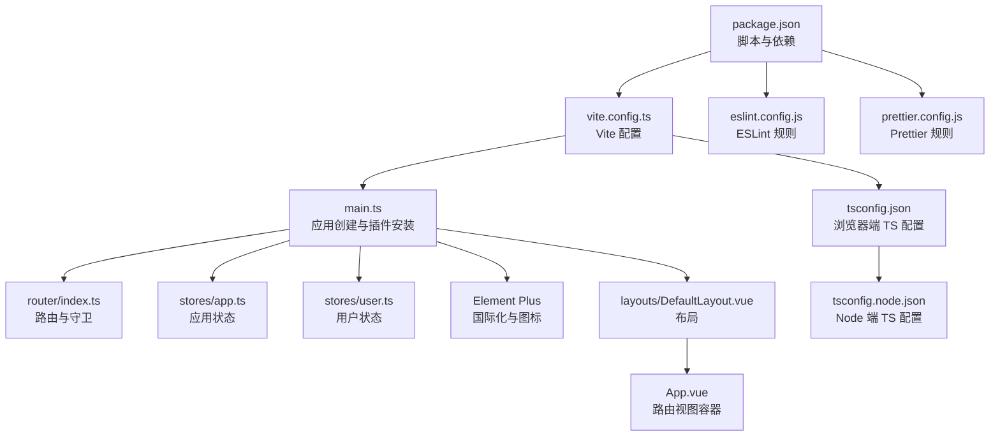
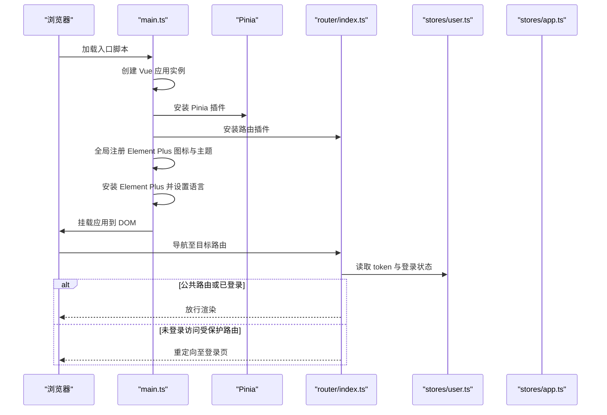
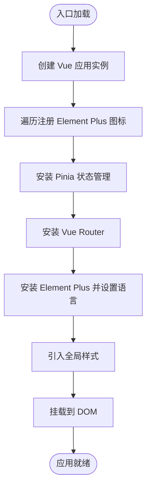
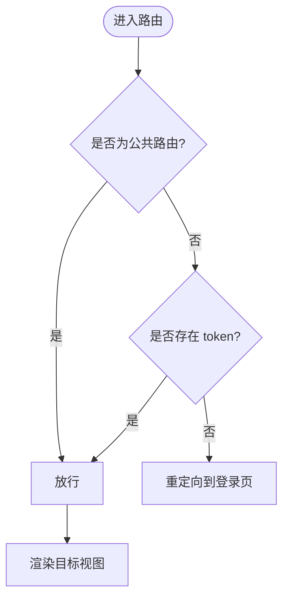
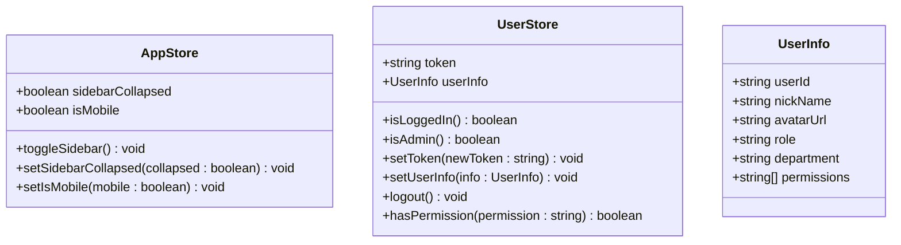
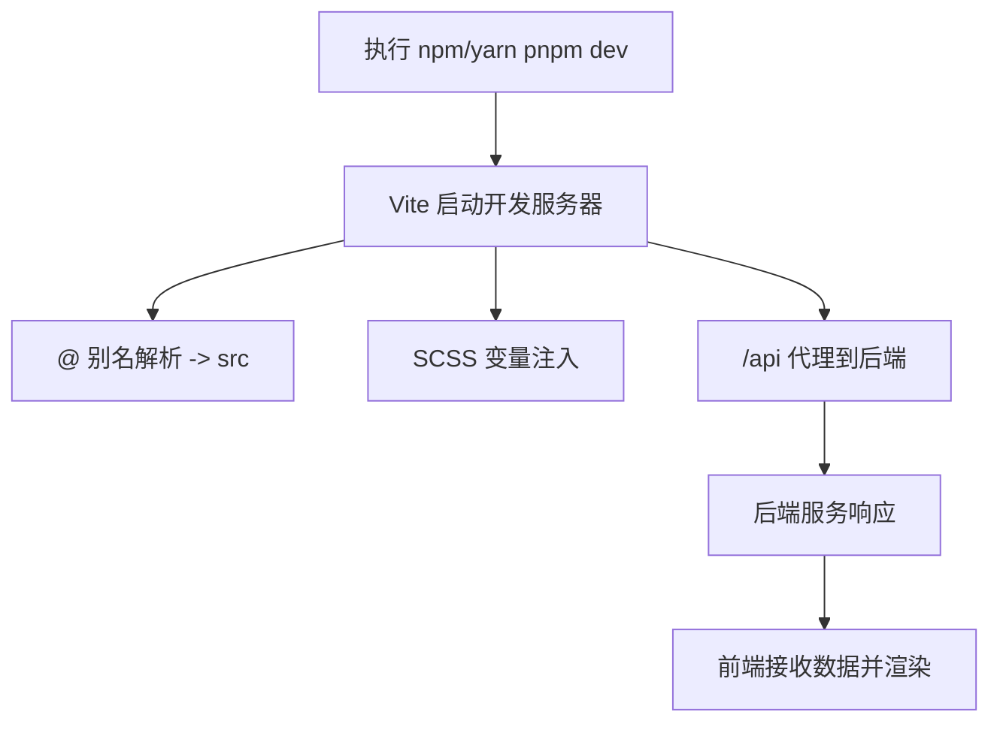
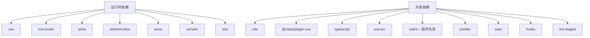

# 项目配置

<cite>
**本文引用的文件**
- [package.json](file://webapp/package.json)
- [vite.config.ts](file://webapp/vite.config.ts)
- [tsconfig.json](file://webapp/tsconfig.json)
- [tsconfig.node.json](file://webapp/tsconfig.node.json)
- [eslint.config.js](file://webapp/eslint.config.js)
- [prettier.config.js](file://webapp/prettier.config.js)
- [main.ts](file://webapp/src/main.ts)
- [router/index.ts](file://webapp/src/router/index.ts)
- [stores/app.ts](file://webapp/src/stores/app.ts)
- [stores/user.ts](file://webapp/src/stores/user.ts)
- [env.d.ts](file://webapp/src/env.d.ts)
- [App.vue](file://webapp/src/App.vue)
- [layouts/DefaultLayout.vue](file://webapp/src/layouts/DefaultLayout.vue)
</cite>

## 目录
1. [简介](#简介)
2. [项目结构](#项目结构)
3. [核心组件](#核心组件)
4. [架构总览](#架构总览)
5. [详细组件分析](#详细组件分析)
6. [依赖分析](#依赖分析)
7. [性能考虑](#性能考虑)
8. [故障排查指南](#故障排查指南)
9. [结论](#结论)
10. [附录](#附录)

## 简介
本文件面向 Web 管理后台的项目配置，基于 Vue 3 + TypeScript + Element Plus 技术栈，系统性梳理从初始化到开发与构建的完整配置流程。重点覆盖应用入口 main.ts 的初始化步骤（含 Pinia 状态管理、路由配置、Element Plus 国际化与图标全局注册）、Vite 构建工具配置（别名、CSS 预处理、开发服务器与代理）、TypeScript 类型检查配置、ESLint 与 Prettier 规范配置，并提供开发与生产构建的实用指南、依赖管理与版本兼容性说明以及常见问题的解决方案。

## 项目结构
前端工程位于 webapp 目录，采用 Vite + Vue 3 + TypeScript + Pinia + Element Plus 的现代前端组合。核心目录与文件如下：
- 根脚本与依赖：通过 package.json 统一管理运行脚本、依赖与 lint-staged 配置
- 构建配置：vite.config.ts 定义插件、路径别名、CSS 预处理注入、开发服务器与代理
- 类型系统：tsconfig.json 与 tsconfig.node.json 分别约束浏览器端与 Node 端编译选项
- 规范配置：eslint.config.js 与 prettier.config.js 提供 ESLint 与 Prettier 的统一规则
- 应用入口：main.ts 创建应用实例，挂载 Pinia、路由与 Element Plus
- 路由与状态：router/index.ts 定义路由表与前置守卫；stores 下定义 Pinia Store
- 环境类型：env.d.ts 声明 import.meta.env 的可用变量
- 布局与视图：layouts/DefaultLayout.vue 作为默认布局，App.vue 承载 RouterView

图表来源
- [package.json:1-53](file://webapp/package.json#L1-L53)
- [vite.config.ts:1-33](file://webapp/vite.config.ts#L1-L33)
- [main.ts:1-28](file://webapp/src/main.ts#L1-L28)
- [router/index.ts:1-77](file://webapp/src/router/index.ts#L1-L77)
- [stores/app.ts:1-30](file://webapp/src/stores/app.ts#L1-L30)
- [stores/user.ts:1-54](file://webapp/src/stores/user.ts#L1-L54)
- [tsconfig.json:1-26](file://webapp/tsconfig.json#L1-L26)
- [tsconfig.node.json:1-12](file://webapp/tsconfig.node.json#L1-L12)
- [eslint.config.js:1-38](file://webapp/eslint.config.js#L1-L38)
- [prettier.config.js:1-9](file://webapp/prettier.config.js#L1-L9)
- [layouts/DefaultLayout.vue:1-54](file://webapp/src/layouts/DefaultLayout.vue#L1-L54)
- [App.vue:1-11](file://webapp/src/App.vue#L1-L11)

章节来源
- [package.json:1-53](file://webapp/package.json#L1-L53)
- [vite.config.ts:1-33](file://webapp/vite.config.ts#L1-L33)
- [tsconfig.json:1-26](file://webapp/tsconfig.json#L1-L26)
- [tsconfig.node.json:1-12](file://webapp/tsconfig.node.json#L1-L12)
- [eslint.config.js:1-38](file://webapp/eslint.config.js#L1-L38)
- [prettier.config.js:1-9](file://webapp/prettier.config.js#L1-L9)

## 核心组件
- 应用入口与插件安装：在 main.ts 中完成 Vue 应用创建、Pinia、路由与 Element Plus 的安装，并进行图标全局注册与全局样式引入
- 路由与守卫：router/index.ts 使用 history 模式，定义登录页与受保护页面的路由，实现前置守卫以拦截未登录访问
- 状态管理：stores/app.ts 管理侧边栏折叠与移动端状态；stores/user.ts 管理 token、用户信息、登录态与权限判断
- 构建与开发：vite.config.ts 配置路径别名、SCSS 变量注入、开发服务器端口与本地代理；package.json 提供 dev/build/preview/lint/format/type-check 等脚本
- 类型系统：tsconfig.json 与 tsconfig.node.json 分别约束浏览器端与 Node 端编译行为；env.d.ts 声明 import.meta.env 的可用键
- 代码规范：eslint.config.js 采用 flat 配置，集成 JS/TS/Vue 推荐规则与自定义规则；prettier.config.js 统一格式化风格

章节来源
- [main.ts:1-28](file://webapp/src/main.ts#L1-L28)
- [router/index.ts:1-77](file://webapp/src/router/index.ts#L1-L77)
- [stores/app.ts:1-30](file://webapp/src/stores/app.ts#L1-L30)
- [stores/user.ts:1-54](file://webapp/src/stores/user.ts#L1-L54)
- [vite.config.ts:1-33](file://webapp/vite.config.ts#L1-L33)
- [package.json:6-14](file://webapp/package.json#L6-L14)
- [tsconfig.json:1-26](file://webapp/tsconfig.json#L1-L26)
- [tsconfig.node.json:1-12](file://webapp/tsconfig.node.json#L1-L12)
- [env.d.ts:9-17](file://webapp/src/env.d.ts#L9-L17)
- [eslint.config.js:1-38](file://webapp/eslint.config.js#L1-L38)
- [prettier.config.js:1-9](file://webapp/prettier.config.js#L1-L9)

## 架构总览
下图展示从入口到插件安装、路由守卫与状态管理的整体交互关系：

图表来源
- [main.ts:16-27](file://webapp/src/main.ts#L16-L27)
- [router/index.ts:60-74](file://webapp/src/router/index.ts#L60-L74)
- [stores/user.ts:13-53](file://webapp/src/stores/user.ts#L13-L53)

## 详细组件分析

### 应用入口 main.ts 初始化流程
- 创建应用实例并挂载根组件
- 全局注册 Element Plus 图标，确保在模板中可直接使用
- 安装 Pinia、路由与 Element Plus（含中文语言包）
- 引入全局样式，保证主题与通用样式一致

图表来源
- [main.ts:16-27](file://webapp/src/main.ts#L16-L27)

章节来源
- [main.ts:1-28](file://webapp/src/main.ts#L1-L28)

### 路由配置与守卫
- 使用 history 模式，基于 BASE_URL
- 登录页标记为公共路由，无需登录即可访问
- 子路由嵌套在默认布局下，包含仪表盘、用户管理、审批管理、日报管理、项目管理等
- 前置守卫逻辑：若目标路由为公共路由则放行；否则检查用户 token，无 token 则重定向至登录页

图表来源
- [router/index.ts:60-74](file://webapp/src/router/index.ts#L60-L74)

章节来源
- [router/index.ts:1-77](file://webapp/src/router/index.ts#L1-L77)

### 状态管理（Pinia）
- 应用状态 stores/app.ts：维护侧边栏折叠状态与移动端标识，提供切换与设置方法
- 用户状态 stores/user.ts：维护 token 与用户信息，提供登录态、管理员态、登出与权限校验方法；token 自动同步到 localStorage

图表来源
- [stores/app.ts:4-29](file://webapp/src/stores/app.ts#L4-L29)
- [stores/user.ts:13-53](file://webapp/src/stores/user.ts#L13-L53)

章节来源
- [stores/app.ts:1-30](file://webapp/src/stores/app.ts#L1-L30)
- [stores/user.ts:1-54](file://webapp/src/stores/user.ts#L1-L54)

### 构建与开发配置（Vite）
- 插件：启用 @vitejs/plugin-vue
- 路径别名：@ 指向 src 目录
- CSS 预处理：SCSS 注入全局变量文件，便于统一主题变量
- 开发服务器：端口 5173，自动打开浏览器，开启代理
- 代理规则：将 /api 前缀转发到指定后端域名，允许跨域与自签证书

图表来源
- [vite.config.ts:7-32](file://webapp/vite.config.ts#L7-L32)

章节来源
- [vite.config.ts:1-33](file://webapp/vite.config.ts#L1-L33)

### TypeScript 类型检查配置
- 浏览器端 tsconfig.json：严格模式、模块解析 bundler、路径映射 @/*，并引用 node 端配置
- Node 端 tsconfig.node.json：仅包含 Vite 配置文件，用于 Vite 插件与配置文件的类型检查
- 环境类型 env.d.ts：声明 import.meta.env 的键值，如 VITE_API_BASE_URL、VITE_APP_TITLE、VITE_USE_MOCK

章节来源
- [tsconfig.json:1-26](file://webapp/tsconfig.json#L1-L26)
- [tsconfig.node.json:1-12](file://webapp/tsconfig.node.json#L1-L12)
- [env.d.ts:9-17](file://webapp/src/env.d.ts#L9-L17)

### 代码规范（ESLint 与 Prettier）
- ESLint：采用 flat 配置，集成 JS/TS/Vue 推荐规则，关闭多词组件名限制，放宽显式 any 与未使用变量规则（支持下划线前缀忽略）
- Prettier：半角分号关闭、单引号、无尾随逗号、行长 100、制表宽 2、按平台换行

章节来源
- [eslint.config.js:1-38](file://webapp/eslint.config.js#L1-L38)
- [prettier.config.js:1-9](file://webapp/prettier.config.js#L1-L9)

### 布局与视图
- DefaultLayout.vue：固定侧边栏与主内容区，根据侧边栏折叠状态动态调整主内容区左边距；包含头部与内容区域
- App.vue：承载 RouterView，作为路由视图的根容器

章节来源
- [layouts/DefaultLayout.vue:1-54](file://webapp/src/layouts/DefaultLayout.vue#L1-L54)
- [App.vue:1-11](file://webapp/src/App.vue#L1-L11)

## 依赖分析
- 运行时依赖：Vue 3、Vue Router、Pinia、Element Plus、Axios、ECharts、XLSX 等
- 开发依赖：Vite、@vitejs/plugin-vue、TypeScript、vue-tsc、ESLint 生态、Prettier、Sass、Husky、lint-staged 等
- 脚本命令：dev、build、preview、lint、format、type-check、prepare（husky）

图表来源
- [package.json:15-45](file://webapp/package.json#L15-L45)

章节来源
- [package.json:1-53](file://webapp/package.json#L1-L53)

## 性能考虑
- 路由懒加载：通过动态 import 将页面组件按需加载，减少首屏体积
- 图标全局注册：一次性注册所有 Element Plus 图标，避免重复导入导致的包体膨胀
- SCSS 变量注入：集中管理主题变量，避免重复定义带来的样式冗余
- 代理与缓存：开发阶段合理利用浏览器缓存与后端接口缓存，减少重复请求

## 故障排查指南
- 开发服务器无法访问或端口占用
  - 检查 vite.config.ts 中 server.port 是否被占用，必要时修改为其他端口
  - 确认 open 配置是否需要自动打开浏览器
- 跨域与代理失效
  - 确认 /api 代理规则是否正确指向后端地址
  - 若后端使用自签证书，secure 设置为 false 并允许 changeOrigin
- ESLint/Prettier 报错
  - 使用 npm run lint 或 npm run format 修复常见问题
  - 检查 eslint.config.js 与 prettier.config.js 的规则是否与团队约定一致
- TypeScript 类型错误
  - 使用 npm run type-check 进行全量类型检查
  - 确保 env.d.ts 中声明的 import.meta.env 键与实际使用一致
- Element Plus 图标不可用
  - 确认 main.ts 中是否完成图标的全局注册
  - 检查图标名称大小写与导入路径

章节来源
- [vite.config.ts:21-31](file://webapp/vite.config.ts#L21-L31)
- [eslint.config.js:20-36](file://webapp/eslint.config.js#L20-L36)
- [prettier.config.js:1-9](file://webapp/prettier.config.js#L1-L9)
- [env.d.ts:9-17](file://webapp/src/env.d.ts#L9-L17)
- [main.ts:18-21](file://webapp/src/main.ts#L18-L21)

## 结论
本项目以 Vite 为核心构建工具，结合 Vue 3 + TypeScript + Pinia + Element Plus 形成现代化前端架构。通过合理的入口初始化、路由守卫与状态管理设计，以及完善的构建与规范配置，能够高效支撑管理后台的开发与交付。建议在后续迭代中持续完善环境变量与代理配置，强化权限与鉴权策略，并保持依赖与工具链的版本更新与安全扫描。

## 附录
- 开发环境启动
  - 安装依赖后执行 npm run dev，访问 http://localhost:5173
- 生产环境构建
  - 执行 npm run build，产物输出至 dist 目录
- 预览构建结果
  - 执行 npm run preview，在本地预览生产打包效果
- 代码规范
  - 提交前可通过 lint-staged 自动执行 ESLint 与 Prettier 修复
- 环境变量
  - 在 env.d.ts 中声明 import.meta.env 的键，确保类型安全与 IDE 提示

章节来源
- [package.json:6-14](file://webapp/package.json#L6-L14)
- [env.d.ts:9-17](file://webapp/src/env.d.ts#L9-L17)