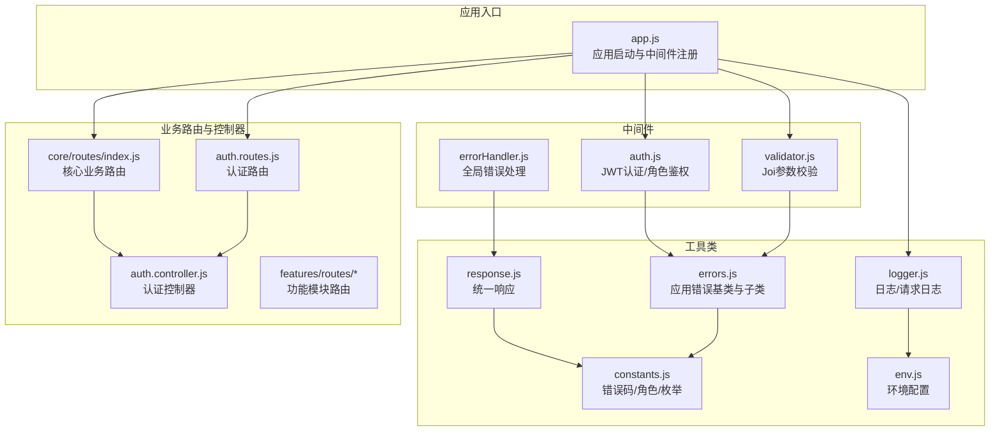
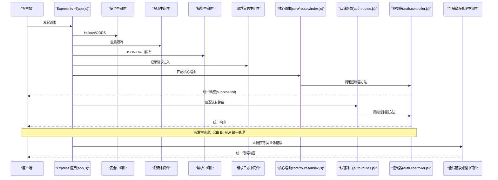
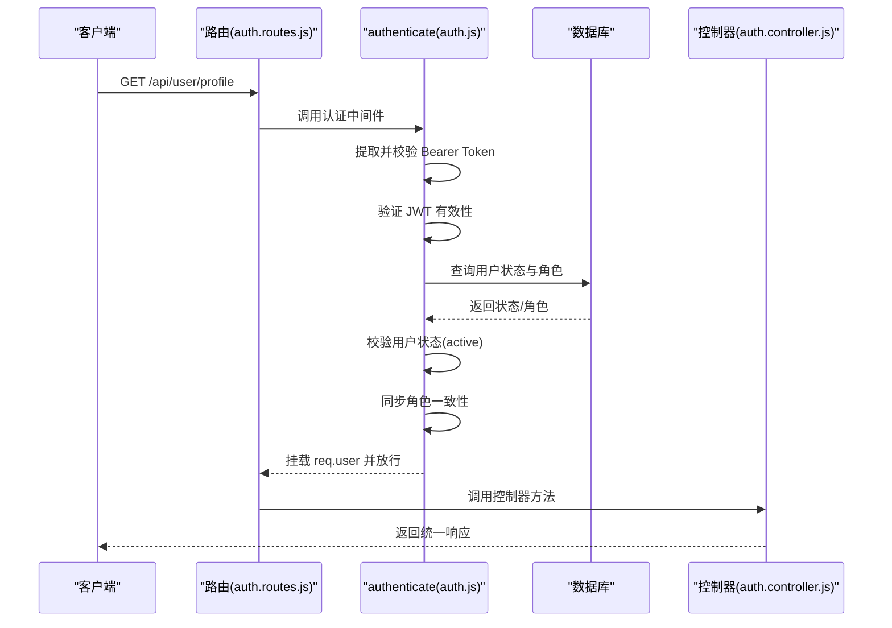
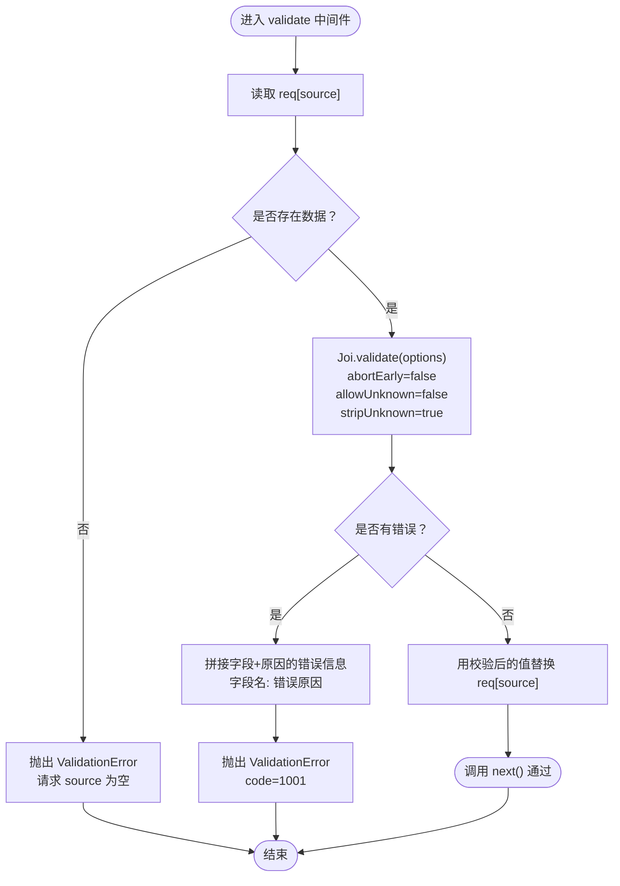
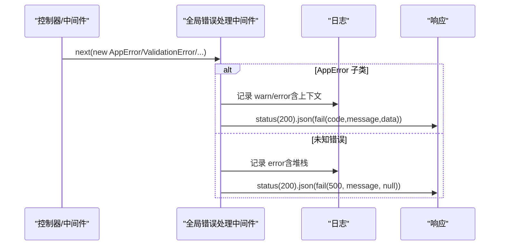
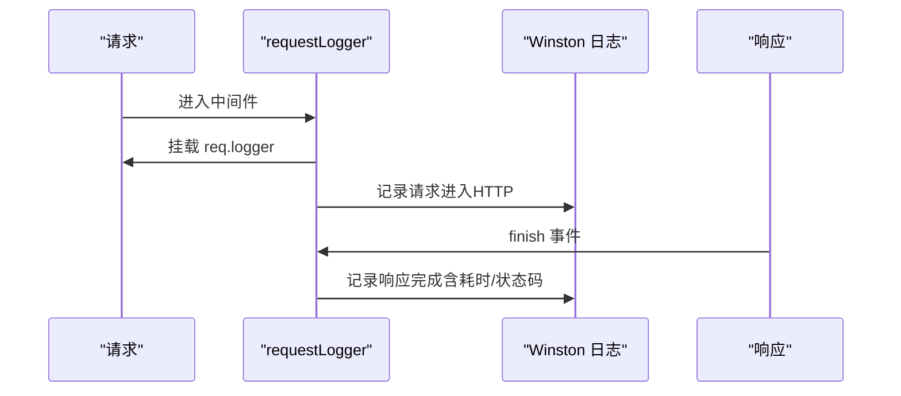
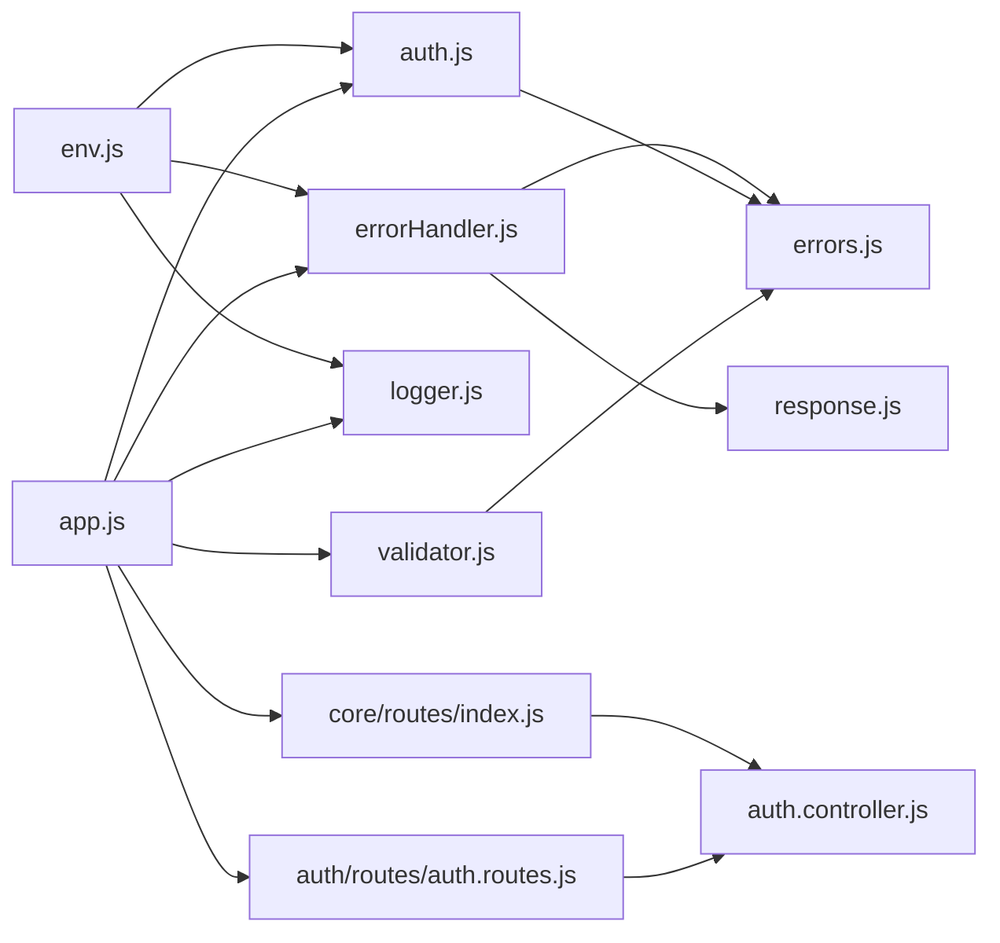

# 中间件与工具类

<cite>
**本文引用的文件**
- [backend/src/app.js](file://backend/src/app.js)
- [backend/src/common/middleware/auth.js](file://backend/src/common/middleware/auth.js)
- [backend/src/common/middleware/errorHandler.js](file://backend/src/common/middleware/errorHandler.js)
- [backend/src/common/middleware/validator.js](file://backend/src/common/middleware/validator.js)
- [backend/src/common/utils/logger.js](file://backend/src/common/utils/logger.js)
- [backend/src/common/utils/response.js](file://backend/src/common/utils/response.js)
- [backend/src/common/utils/errors.js](file://backend/src/common/utils/errors.js)
- [backend/src/common/utils/constants.js](file://backend/src/common/utils/constants.js)
- [backend/src/common/config/env.js](file://backend/src/common/config/env.js)
- [backend/src/auth/routes/auth.routes.js](file://backend/src/auth/routes/auth.routes.js)
- [backend/src/auth/controllers/auth.controller.js](file://backend/src/auth/controllers/auth.controller.js)
- [backend/src/core/routes/index.js](file://backend/src/core/routes/index.js)
</cite>

## 更新摘要
**所做更改**
- 更新了认证中间件的实现细节，包括 JWT 验证流程和角色校验机制
- 修订了错误处理中间件的错误分类和日志记录策略
- 完善了参数验证中间件的 Joi 校验配置和错误信息格式化
- 优化了日志记录工具的请求追踪和性能监控功能
- 更新了响应格式化工具的分页处理和错误码映射
- 扩展了常量定义的业务枚举和配置常量
- 完善了环境配置的数据库连接池和企业微信集成

## 目录
1. [简介](#简介)
2. [项目结构](#项目结构)
3. [核心组件](#核心组件)
4. [架构总览](#架构总览)
5. [详细组件分析](#详细组件分析)
6. [依赖关系分析](#依赖关系分析)
7. [性能考量](#性能考量)
8. [故障排查指南](#故障排查指南)
9. [结论](#结论)
10. [附录](#附录)

## 简介
本文档面向"智慧办公助手 OA 系统"的后端中间件与工具类，系统性梳理认证中间件、错误处理中间件、参数验证中间件的工作原理与使用方法，并深入解析日志记录工具、响应格式化工具、错误处理工具等通用工具类的功能与实现细节。文档覆盖配置项、使用场景、最佳实践、自定义扩展方法，并通过序列图与流程图展示中间件执行顺序、错误处理策略与性能优化要点。

## 项目结构
后端采用 Express 应用，中间件与工具类集中于 common 目录，按职责划分为 middleware 与 utils；应用入口 app.js 统一注册安全中间件、限流、解析中间件、请求日志、路由与全局错误处理；认证相关控制器与路由位于 auth 子模块，核心业务路由分布在 core 和 features 模块。

**图表来源**
- [backend/src/app.js:1-207](file://backend/src/app.js#L1-L207)
- [backend/src/common/middleware/auth.js:1-83](file://backend/src/common/middleware/auth.js#L1-L83)
- [backend/src/common/middleware/errorHandler.js:1-28](file://backend/src/common/middleware/errorHandler.js#L1-L28)
- [backend/src/common/middleware/validator.js:1-60](file://backend/src/common/middleware/validator.js#L1-L60)
- [backend/src/common/utils/logger.js:1-100](file://backend/src/common/utils/logger.js#L1-L100)
- [backend/src/common/utils/response.js:1-49](file://backend/src/common/utils/response.js#L1-L49)
- [backend/src/common/utils/errors.js:1-99](file://backend/src/common/utils/errors.js#L1-L99)
- [backend/src/common/utils/constants.js:1-106](file://backend/src/common/utils/constants.js#L1-L106)
- [backend/src/common/config/env.js:1-118](file://backend/src/common/config/env.js#L1-L118)
- [backend/src/auth/routes/auth.routes.js:1-34](file://backend/src/auth/routes/auth.routes.js#L1-L34)
- [backend/src/auth/controllers/auth.controller.js:1-137](file://backend/src/auth/controllers/auth.controller.js#L1-L137)
- [backend/src/core/routes/index.js:1-21](file://backend/src/core/routes/index.js#L1-L21)

**章节来源**
- [backend/src/app.js:1-207](file://backend/src/app.js#L1-L207)
- [backend/src/common/middleware/auth.js:1-83](file://backend/src/common/middleware/auth.js#L1-L83)
- [backend/src/common/middleware/errorHandler.js:1-28](file://backend/src/common/middleware/errorHandler.js#L1-L28)
- [backend/src/common/middleware/validator.js:1-60](file://backend/src/common/middleware/validator.js#L1-L60)
- [backend/src/common/utils/logger.js:1-100](file://backend/src/common/utils/logger.js#L1-L100)
- [backend/src/common/utils/response.js:1-49](file://backend/src/common/utils/response.js#L1-L49)
- [backend/src/common/utils/errors.js:1-99](file://backend/src/common/utils/errors.js#L1-L99)
- [backend/src/common/utils/constants.js:1-106](file://backend/src/common/utils/constants.js#L1-L106)
- [backend/src/common/config/env.js:1-118](file://backend/src/common/config/env.js#L1-L118)
- [backend/src/auth/routes/auth.routes.js:1-34](file://backend/src/auth/routes/auth.routes.js#L1-L34)
- [backend/src/auth/controllers/auth.controller.js:1-137](file://backend/src/auth/controllers/auth.controller.js#L1-L137)
- [backend/src/core/routes/index.js:1-21](file://backend/src/core/routes/index.js#L1-L21)

## 核心组件
- **认证中间件**：负责从请求头提取并验证 JWT，校验用户状态与角色一致性，将解码后的用户信息挂载至 req.user，并提供 requireRole 角色过滤。
- **参数验证中间件**：基于 Joi 的 validate 工厂，支持对 body/query/params 的数据校验，自动清洗未知字段并友好化错误信息。
- **全局错误处理中间件**：统一捕获 AppError 子类与未知错误，按级别记录日志，返回统一响应结构，生产环境隐藏敏感错误详情。
- **日志工具**：封装 winston，提供控制台与文件输出、请求上下文注入、HTTP 请求进入/完成日志。
- **响应格式化工具**：提供 success/fail/paginated 三种统一响应结构，配合错误码常量。
- **错误处理工具**：AppError 基类与 ValidationError/AuthError/ForbiddenError/NotFoundError/BusinessError 子类，统一承载 httpStatus/code/message/data。
- **配置工具**：集中管理数据库、Redis、JWT、微信/企业微信、日志等级与目录、Swagger 开关等。

**章节来源**
- [backend/src/common/middleware/auth.js:14-82](file://backend/src/common/middleware/auth.js#L14-L82)
- [backend/src/common/middleware/validator.js:28-57](file://backend/src/common/middleware/validator.js#L28-L57)
- [backend/src/common/middleware/errorHandler.js:12-25](file://backend/src/common/middleware/errorHandler.js#L12-L25)
- [backend/src/common/utils/logger.js:22-96](file://backend/src/common/utils/logger.js#L22-L96)
- [backend/src/common/utils/response.js:11-46](file://backend/src/common/utils/response.js#L11-L46)
- [backend/src/common/utils/errors.js:9-89](file://backend/src/common/utils/errors.js#L9-L89)
- [backend/src/common/utils/constants.js:8-105](file://backend/src/common/utils/constants.js#L8-L105)
- [backend/src/common/config/env.js:50-115](file://backend/src/common/config/env.js#L50-L115)

## 架构总览
应用启动时加载环境变量与配置，初始化日志、数据库与 Redis；注册安全中间件（CORS、Helmet）、全局限流与登录端点限流；解析 JSON/URL 编码请求体；挂载请求日志中间件；注册核心业务路由、认证路由和功能模块路由；最后挂载全局错误处理中间件与 404 处理。

**图表来源**
- [backend/src/app.js:29-140](file://backend/src/app.js#L29-L140)
- [backend/src/core/routes/index.js:12-18](file://backend/src/core/routes/index.js#L12-L18)
- [backend/src/auth/routes/auth.routes.js:17-31](file://backend/src/auth/routes/auth.routes.js#L17-L31)
- [backend/src/auth/controllers/auth.controller.js:16-134](file://backend/src/auth/controllers/auth.controller.js#L16-L134)
- [backend/src/common/middleware/errorHandler.js:12-25](file://backend/src/common/middleware/errorHandler.js#L12-L25)

**章节来源**
- [backend/src/app.js:1-207](file://backend/src/app.js#L1-L207)
- [backend/src/core/routes/index.js:1-21](file://backend/src/core/routes/index.js#L1-L21)
- [backend/src/auth/routes/auth.routes.js:1-34](file://backend/src/auth/routes/auth.routes.js#L1-L34)
- [backend/src/auth/controllers/auth.controller.js:1-137](file://backend/src/auth/controllers/auth.controller.js#L1-L137)
- [backend/src/common/middleware/errorHandler.js:1-28](file://backend/src/common/middleware/errorHandler.js#L1-L28)

## 详细组件分析

### 认证中间件（JWT + 角色）
**更新** 重构了 JWT 验证流程，增强了错误处理和数据库校验机制

- **功能概述**
  - 从 Authorization 头提取 Bearer Token，使用配置中的 JWT Secret 验证；
  - 校验通过后查询用户状态与角色，若状态非 active 或角色变化则拒绝；
  - 将解码后的用户信息挂载到 req.user，必要时以数据库最新角色为准；
  - 提供 requireRole 工厂，用于限制可访问角色集合。
- **关键实现要点**
  - Token 解析失败或过期分别抛出不同错误类型，便于统一处理；
  - DB 校验确保用户仍处于 active 状态，增强安全性；
  - 角色不一致时以 DB 最新角色覆盖，避免缓存/篡改风险。
- **使用场景**
  - 所有需要身份认证的接口（如获取/更新用户资料）；
  - 管理员专属接口（如关联企业微信账号、TOTP 管理）。
- **最佳实践**
  - 在路由层组合 authenticate 与 requireRole，明确声明所需角色；
  - 对高危操作使用更严格的 requireRole（如 superadmin）；
  - 定期轮换 JWT Secret，确保过期策略合理。
- **自定义扩展**
  - 可在 authenticate 中增加黑名单校验、设备指纹校验等；
  - 可扩展 requireRole 支持动态权限矩阵或细粒度资源权限。

**图表来源**
- [backend/src/auth/routes/auth.routes.js:27-31](file://backend/src/auth/routes/auth.routes.js#L27-L31)
- [backend/src/common/middleware/auth.js:14-56](file://backend/src/common/middleware/auth.js#L14-L56)
- [backend/src/auth/controllers/auth.controller.js:35-42](file://backend/src/auth/controllers/auth.controller.js#L35-L42)

**章节来源**
- [backend/src/common/middleware/auth.js:14-82](file://backend/src/common/middleware/auth.js#L14-L82)
- [backend/src/auth/routes/auth.routes.js:17-31](file://backend/src/auth/routes/auth.routes.js#L17-L31)
- [backend/src/auth/controllers/auth.controller.js:16-58](file://backend/src/auth/controllers/auth.controller.js#L16-L58)

### 参数验证中间件（Joi）
**更新** 完善了 Joi 校验配置和错误信息格式化机制

- **功能概述**
  - validate(schema, source='body') 工厂返回 Express 中间件；
  - 支持对 body/query/params 的数据进行校验；
  - 自动 stripUnknown 清洗多余字段，友好化错误信息（字段名+原因）。
- **关键实现要点**
  - 使用 abortEarly=false、allowUnknown=false、stripUnknown=true；
  - 校验失败抛出 ValidationError（code=1001），由全局错误处理统一返回。
- **使用场景**
  - 所有对外接口的输入参数校验，尤其是分页查询、创建/更新接口。
- **最佳实践**
  - 为每个路由定义独立 Joi Schema，保持校验规则清晰；
  - 对查询参数与路径参数分别使用 validate(schema, 'query')/validate(schema, 'params')。
- **自定义扩展**
  - 可扩展为支持自定义校验器或条件校验；
  - 可增加 schema 缓存以减少重复构建开销。

**图表来源**
- [backend/src/common/middleware/validator.js:28-57](file://backend/src/common/middleware/validator.js#L28-L57)

**章节来源**
- [backend/src/common/middleware/validator.js:1-60](file://backend/src/common/middleware/validator.js#L1-L60)

### 全局错误处理中间件
**更新** 优化了错误分类和日志记录策略

- **功能概述**
  - 捕获所有错误，区分 AppError 子类与未知错误；
  - 对 4xx 错误记录 warn，5xx 错误记录 error（含堆栈）；
  - 统一返回 HTTP 200，通过 code 字段区分成功/失败。
- **关键实现要点**
  - 生产环境隐藏未知错误详情，仅返回通用提示；
  - AppError 的 httpStatus 与 code 语义清晰，便于前端识别。
- **使用场景**
  - 所有控制器与中间件抛出的错误均通过该中间件统一处理。
- **最佳实践**
  - 优先使用 AppError 子类表达业务错误，避免直接抛出原生 Error；
  - 对敏感错误（如数据库连接失败）设置较高 httpStatus，便于监控告警。
- **自定义扩展**
  - 可扩展支持错误上报平台（如 Sentry）；
  - 可增加错误去重与统计指标。

**图表来源**
- [backend/src/common/middleware/errorHandler.js:12-25](file://backend/src/common/middleware/errorHandler.js#L12-L25)
- [backend/src/common/utils/errors.js:9-89](file://backend/src/common/utils/errors.js#L9-L89)
- [backend/src/common/utils/response.js:22-24](file://backend/src/common/utils/response.js#L22-L24)

**章节来源**
- [backend/src/common/middleware/errorHandler.js:1-28](file://backend/src/common/middleware/errorHandler.js#L1-L28)

### 日志记录工具（Winston + 请求日志）
**更新** 增强了请求追踪和性能监控功能

- **功能概述**
  - Winston 日志实例：控制台输出（开发带颜色）、error.log、combined.log；
  - requestLogger 中间件：在每个请求上挂载带请求追踪信息的 req.logger；
  - 记录请求进入与完成（含耗时、状态码）。
- **关键实现要点**
  - 日志格式包含时间戳、级别、模块、消息与元数据；
  - 请求日志注入 requestId/url/method/ip 等上下文，便于问题定位。
- **使用场景**
  - 所有业务模块均可通过 req.logger 输出带上下文的日志；
  - 生产环境建议调整 LOG_LEVEL 与 LOG_DIR。
- **最佳实践**
  - 重要业务事件使用 info/warn/error，调试使用 debug；
  - 避免在日志中打印敏感信息（如密码、Token）。
- **自定义扩展**
  - 可增加采样日志、异步写入、日志聚合（如 ELK）。

**图表来源**
- [backend/src/common/utils/logger.js:67-96](file://backend/src/common/utils/logger.js#L67-L96)

**章节来源**
- [backend/src/common/utils/logger.js:1-100](file://backend/src/common/utils/logger.js#L1-L100)

### 响应格式化工具
**更新** 完善了分页处理和错误码映射

- **功能概述**
  - success(data, message)：统一成功响应；
  - fail(code, message, data)：统一失败/错误响应；
  - paginated(list, total, page, pageSize)：统一分页响应。
- **关键实现要点**
  - 与 ErrorCode 常量配合，保证前后端约定一致；
  - 分页计算 totalPages，便于前端渲染。
- **使用场景**
  - 所有控制器返回值均通过该工具标准化。
- **最佳实践**
  - 成功响应 data 为 null 时显式传入，避免空对象歧义；
  - 分页接口务必提供 total/page/pageSize。
- **自定义扩展**
  - 可增加响应压缩、ETag 支持。

**章节来源**
- [backend/src/common/utils/response.js:1-49](file://backend/src/common/utils/response.js#L1-L49)
- [backend/src/common/utils/constants.js:8-15](file://backend/src/common/utils/constants.js#L8-L15)

### 错误处理工具（AppError 体系）
**更新** 扩展了错误类型和业务常量

- **功能概述**
  - AppError 基类：承载 httpStatus/code/message/data；
  - 子类：ValidationError（400）、AuthError（401）、ForbiddenError（403）、NotFoundError（404）、BusinessError（200）。
- **关键实现要点**
  - 统一构造函数签名，便于全局错误处理识别；
  - BusinessError 使用 200 状态码承载业务失败，配合 code 区分。
- **使用场景**
  - 参数校验失败使用 ValidationError；
  - 未认证/权限不足分别使用 AuthError/ForbiddenError；
  - 资源不存在使用 NotFoundError。
- **最佳实践**
  - 明确错误语义，避免混用；
  - 为复杂错误提供 data 以便前端展示。
- **自定义扩展**
  - 可扩展更多业务错误类型（如 RateLimitError）。

**章节来源**
- [backend/src/common/utils/errors.js:1-99](file://backend/src/common/utils/errors.js#L1-L99)
- [backend/src/common/utils/constants.js:8-15](file://backend/src/common/utils/constants.js#L8-L15)

### 配置工具（环境变量与常量）
**更新** 完善了数据库连接池和企业微信集成

- **功能概述**
  - env.js：集中加载 .env、校验必需变量、提供统一配置对象（数据库、Redis、JWT、微信/企业微信、日志、Swagger）；
  - constants.js：ErrorCode、Role/UserStatus/ApprovalType/ApprovalStatus/MessageType/Pagination/Business 常量。
- **关键实现要点**
  - 启动时强制校验必需变量，避免运行期缺参；
  - 配置项含默认值，降低部署复杂度。
- **使用场景**
  - 中间件/工具类/控制器均通过 env.js 读取配置；
  - 常量统一用于响应码与业务枚举。
- **最佳实践**
  - 生产环境务必补齐 .env；
  - 修改常量时同步更新前端与文档。
- **自定义扩展**
  - 可增加配置热更新或只读配置快照。

**章节来源**
- [backend/src/common/config/env.js:13-44](file://backend/src/common/config/env.js#L13-L44)
- [backend/src/common/config/env.js:50-115](file://backend/src/common/config/env.js#L50-L115)
- [backend/src/common/utils/constants.js:1-106](file://backend/src/common/utils/constants.js#L1-L106)

## 依赖关系分析
**更新** 重构了中间件与工具类的耦合关系

- **中间件与工具类耦合**
  - 认证中间件依赖 env（JWT Secret）、errors（Auth/Forbidden）、database（DB 校验）；
  - 参数验证中间件依赖 errors（ValidationError）；
  - 全局错误处理中间件依赖 logger、response、errors。
- **应用入口集成**
  - app.js 依次注册安全中间件、限流、解析、请求日志、核心路由、认证路由、功能路由、404、全局错误处理；
  - 认证路由在 /api/auth 下挂载，部分端点应用登录限流。
- **模块化架构**
  - 核心业务路由集中在 core/routes/index.js；
  - 认证路由位于 auth/routes/auth.routes.js；
  - 功能模块路由分布于 features/routes/ 目录。

**图表来源**
- [backend/src/app.js:102-140](file://backend/src/app.js#L102-L140)
- [backend/src/common/middleware/auth.js:3-6](file://backend/src/common/middleware/auth.js#L3-L6)
- [backend/src/common/middleware/errorHandler.js:3-6](file://backend/src/common/middleware/errorHandler.js#L3-L6)
- [backend/src/common/middleware/validator.js:3-4](file://backend/src/common/middleware/validator.js#L3-L4)
- [backend/src/common/utils/logger.js:3-5](file://backend/src/common/utils/logger.js#L3-L5)
- [backend/src/auth/routes/auth.routes.js:5](file://backend/src/auth/routes/auth.routes.js#L5)

**章节来源**
- [backend/src/app.js:1-207](file://backend/src/app.js#L1-L207)
- [backend/src/common/middleware/auth.js:1-83](file://backend/src/common/middleware/auth.js#L1-L83)
- [backend/src/common/middleware/errorHandler.js:1-28](file://backend/src/common/middleware/errorHandler.js#L1-L28)
- [backend/src/common/middleware/validator.js:1-60](file://backend/src/common/middleware/validator.js#L1-L60)
- [backend/src/common/utils/logger.js:1-100](file://backend/src/common/utils/logger.js#L1-L100)
- [backend/src/auth/routes/auth.routes.js:1-34](file://backend/src/auth/routes/auth.routes.js#L1-L34)

## 性能考量
**更新** 优化了中间件顺序与性能监控

- **中间件顺序与开销**
  - 安全中间件（Helmet/CORS）与限流（rateLimit）应尽量前置，减少后续处理成本；
  - JSON/URL 解析错误拦截在解析中间件之后尽早返回，避免进入业务逻辑。
- **日志性能**
  - 生产环境建议提升 LOG_LEVEL 至 warn/error，减少 info/debug 写盘；
  - 控制台彩色输出仅开发环境启用，避免影响性能。
- **数据库与缓存**
  - 认证中间件的 DB 查询应尽量走索引（id），避免慢查询；
  - Redis 连接延迟初始化，首次使用时建立，减少启动阻塞。
- **响应与序列化**
  - 统一响应结构简单明了，利于前端处理与网络传输；
  - 分页响应包含 totalPages，便于前端做边界判断。
- **监控与追踪**
  - 请求日志中间件提供完整的请求追踪信息；
  - 错误处理中间件记录详细的错误上下文和堆栈信息。

## 故障排查指南
**更新** 完善了故障排查流程和定位方法

- **认证失败**
  - **症状**：401 未认证或 403 无权限；
  - **排查**：确认 Authorization 头格式、Token 是否过期、用户状态是否 active、角色是否变更；
  - **定位**：检查 JWT_SECRET 配置、数据库用户状态、角色权限。
- **参数校验失败**
  - **症状**：400 参数校验失败，message 包含字段与原因；
  - **排查**：检查 Joi Schema、source 类型（body/query/params）、stripUnknown 行为；
  - **定位**：查看 validate 中间件的错误信息格式化。
- **服务器内部错误**
  - **症状**：500 未知错误或 AppError 5xx；
  - **排查**：查看日志 error 级别与堆栈，确认生产环境是否隐藏详情；
  - **定位**：检查 errorHandler 中间件的错误分类和日志记录。
- **请求日志与追踪**
  - **症状**：无法定位请求来源；
  - **排查**：确认 requestLogger 是否挂载、LOG_LEVEL 设置、日志文件位置；
  - **定位**：检查请求追踪信息的注入和记录。

**章节来源**
- [backend/src/common/middleware/auth.js:14-82](file://backend/src/common/middleware/auth.js#L14-L82)
- [backend/src/common/middleware/validator.js:28-57](file://backend/src/common/middleware/validator.js#L28-L57)
- [backend/src/common/middleware/errorHandler.js:12-25](file://backend/src/common/middleware/errorHandler.js#L12-L25)
- [backend/src/common/utils/logger.js:67-96](file://backend/src/common/utils/logger.js#L67-L96)

## 结论
本系统的中间件与工具类围绕"统一认证、参数校验、错误处理、日志与响应"五大主题构建，形成清晰的职责边界与稳定的执行链路。通过严格的中间件顺序、统一的错误模型与响应结构，以及可扩展的配置与日志体系，系统在安全性、可观测性与可维护性方面具备良好基础。

**更新** 本次重构进一步优化了 JWT 验证流程、错误处理策略、参数校验机制和日志追踪功能，提升了系统的整体性能和可靠性。建议在生产环境中进一步完善限流策略、错误上报与日志归档，并持续优化认证与参数校验的性能表现。

## 附录
- **在控制器中使用中间件与工具类的参考路径**
  - 认证与角色控制：[auth.routes.js:17-31](file://backend/src/auth/routes/auth.routes.js#L17-L31)
  - 统一响应返回：[auth.controller.js:25-55](file://backend/src/auth/controllers/auth.controller.js#L25-L55)
  - 参数校验使用：结合路由与控制器参数处理
  - 日志使用：通过 req.logger 输出带上下文日志
- **配置项一览（节选）**
  - 环境变量校验：[env.js:13-44](file://backend/src/common/config/env.js#L13-L44)
  - JWT 配置：[env.js:89-93](file://backend/src/common/config/env.js#L89-L93)
  - 日志配置：[env.js:109-111](file://backend/src/common/config/env.js#L109-L111)
  - 常量定义：[constants.js:8-105](file://backend/src/common/utils/constants.js#L8-L105)
- **新增功能**
  - 企业微信集成：支持 QYWX_ADMIN_USERIDS 白名单配置
  - 数据库连接池：OA_DB 和 OLD_DB 双数据库配置
  - 业务常量：MAX_LOGIN_ATTEMPTS、LOGIN_LOCK_DURATION 等
  - 审批状态：完整的审批类型和状态枚举