# 合规管理模块

<cite>
**本文档引用的文件**
- [compliance.controller.js](file://backend/src/features/compliance/controllers/compliance.controller.js)
- [compliance.service.js](file://backend/src/features/compliance/services/compliance.service.js)
- [compliance.routes.js](file://backend/src/features/compliance/routes/compliance.routes.js)
- [compliance.task.js](file://backend/src/common/tasks/compliance.task.js)
- [reminder.service.js](file://backend/src/features/compliance/services/reminder.service.js)
- [stats.service.js](file://backend/src/features/compliance/services/stats.service.js)
- [migration_create_compliance_tables.sql](file://backend/scripts/migration_create_compliance_tables.sql)
- [migration_alter_daily_reports_compliance.sql](file://backend/scripts/migration_alter_daily_reports_compliance.sql)
- [run-compliance-migration.js](file://backend/scripts/run-compliance-migration.js)
- [scheduler.js](file://backend/src/common/tasks/scheduler.js)
- [index.vue](file://miniapp/src/pages/compliance/my-compliance/index.vue)
- [compliance.js](file://miniapp/src/services/modules/compliance.js)
- [Dashboard.vue](file://webapp/src/views/compliance/Dashboard.vue)
- [auth.js](file://backend/src/common/middleware/auth.js)
- [template.service.js](file://backend/src/system/wechat/template.service.js)
- [compliance.test.js](file://backend/tests/integration/compliance.test.js)
</cite>

## 目录
1. [简介](#简介)
2. [项目结构](#项目结构)
3. [核心组件](#核心组件)
4. [架构概览](#架构概览)
5. [详细组件分析](#详细组件分析)
6. [依赖关系分析](#依赖关系分析)
7. [性能考虑](#性能考虑)
8. [故障排除指南](#故障排除指南)
9. [结论](#结论)

## 简介

合规管理模块是智慧办公助手OA系统的核心功能模块，主要负责员工日报提交的合规性管理和监控。该模块通过自动化流程确保员工按时提交工作日报，提供实时提醒机制，并生成详细的合规统计报表。

模块的主要功能包括：
- 出差状态管理（记录和跟踪员工出差期间的日志提交）
- 日报合规性检查（自动检测和标记日报提交的及时性）
- 缺失报告审核（管理员审核未按时提交的日志）
- 合规统计看板（提供整体和部门级的合规数据分析）
- 智能提醒系统（通过微信模板消息提醒员工提交日志）

## 项目结构

合规管理模块采用前后端分离的架构设计，包含以下主要组成部分：

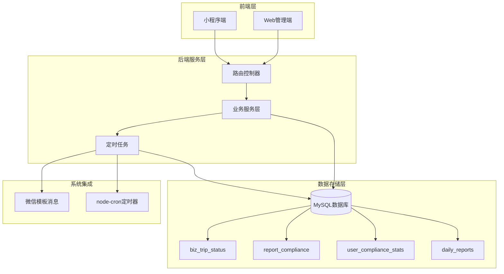

**图表来源**
- [compliance.controller.js:1-273](file://backend/src/features/compliance/controllers/compliance.controller.js#L1-L273)
- [compliance.routes.js:1-30](file://backend/src/features/compliance/routes/compliance.routes.js#L1-L30)

**章节来源**
- [compliance.controller.js:1-273](file://backend/src/features/compliance/controllers/compliance.controller.js#L1-L273)
- [compliance.routes.js:1-30](file://backend/src/features/compliance/routes/compliance.routes.js#L1-L30)

## 核心组件

### 数据模型设计

合规管理模块基于以下核心数据表构建：

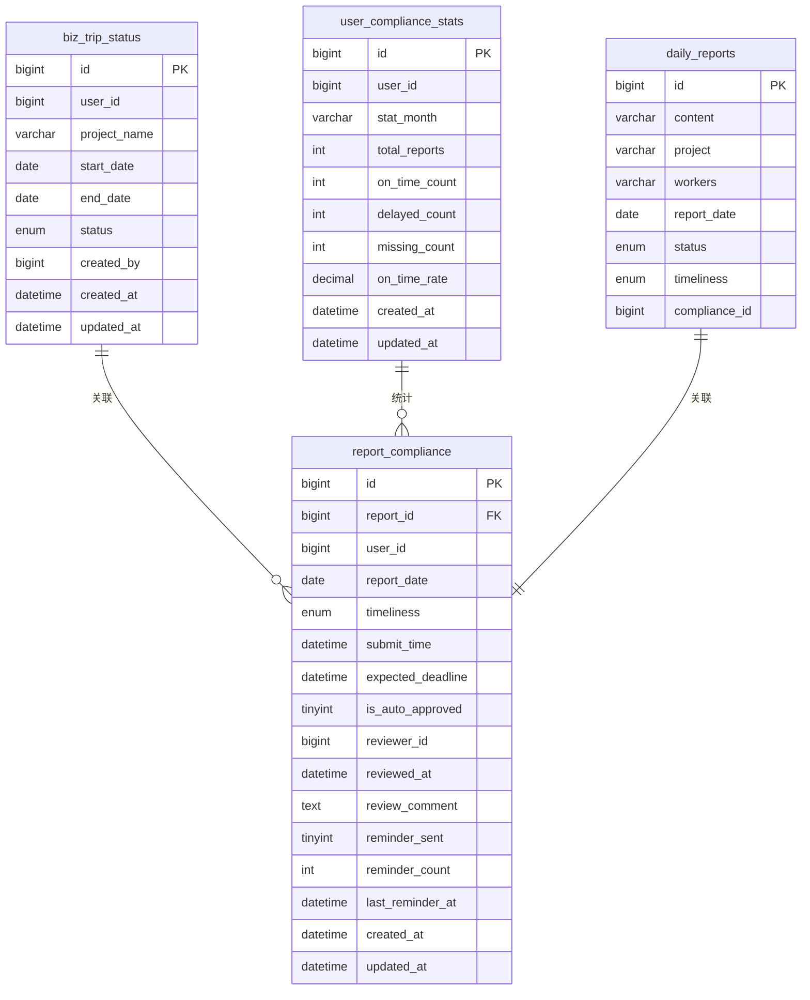

**图表来源**
- [migration_create_compliance_tables.sql:14-82](file://backend/scripts/migration_create_compliance_tables.sql#L14-L82)
- [migration_alter_daily_reports_compliance.sql:17-47](file://backend/scripts/migration_alter_daily_reports_compliance.sql#L17-L47)

### 授权与角色管理

系统采用基于角色的访问控制（RBAC）机制：

| 角色 | 权限范围 | 可访问的API |
|------|----------|-------------|
| 普通员工 | 个人合规记录查看 | `/api/compliance/my-compliance` `/api/compliance/biz-trip/check-status` |
| 管理员 | 完整合规管理功能 | `/api/compliance/biz-trip` `/api/compliance/missing-reports` `/api/compliance/stats/dashboard` |
| 超级管理员 | 系统最高权限 | 所有合规相关API |

**章节来源**
- [auth.js:64-80](file://backend/src/common/middleware/auth.js#L64-L80)
- [compliance.routes.js:8-27](file://backend/src/features/compliance/routes/compliance.routes.js#L8-L27)

## 架构概览

合规管理模块采用分层架构设计，确保职责清晰和可维护性：

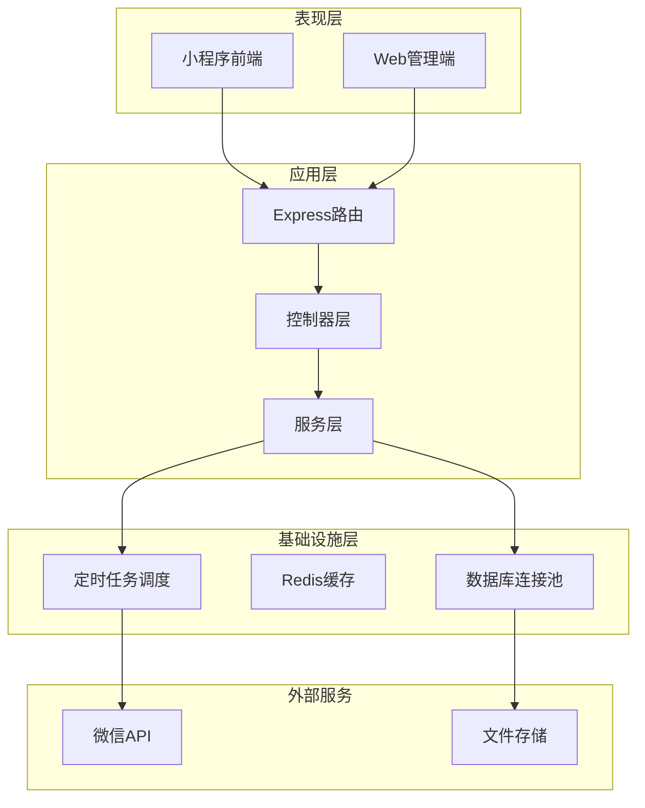

**图表来源**
- [compliance.controller.js:1-273](file://backend/src/features/compliance/controllers/compliance.controller.js#L1-L273)
- [compliance.service.js:1-229](file://backend/src/features/compliance/services/compliance.service.js#L1-L229)

## 详细组件分析

### 出差状态管理系统

出差状态管理是合规检查的重要前置条件，通过跟踪员工的出差状态来决定是否需要强制提交日志。

#### 核心功能流程

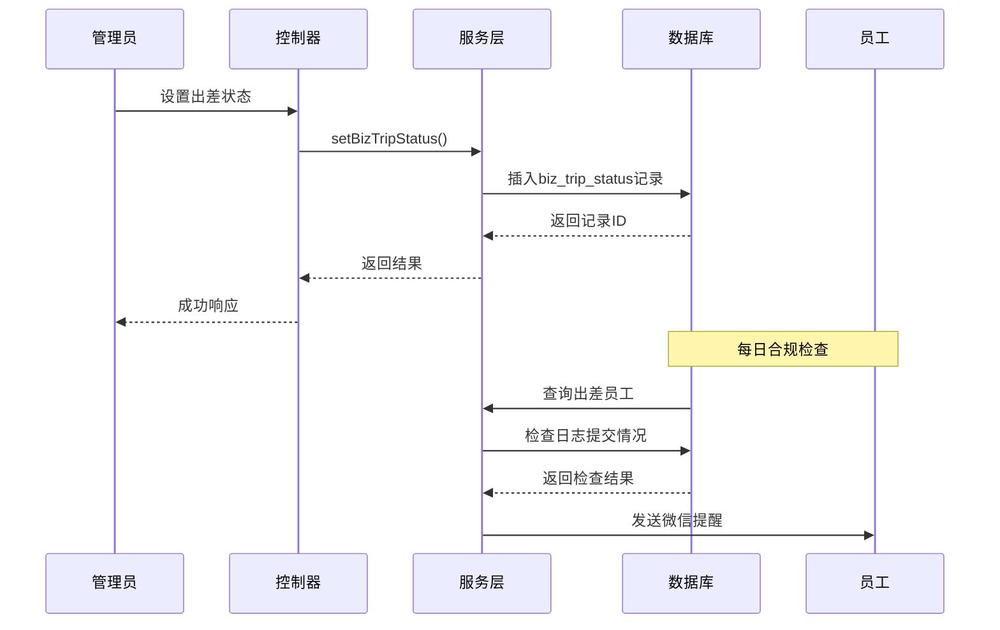

**图表来源**
- [compliance.controller.js:11-53](file://backend/src/features/compliance/controllers/compliance.controller.js#L11-L53)
- [compliance.service.js:32-75](file://backend/src/features/compliance/services/compliance.service.js#L32-L75)

#### 出差状态生命周期

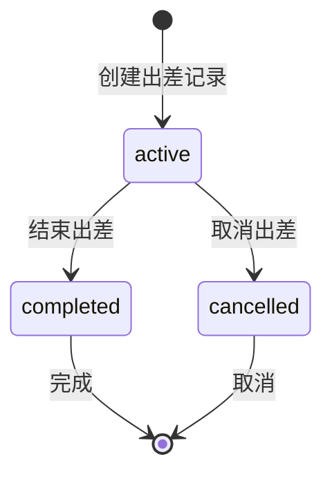

**图表来源**
- [migration_create_compliance_tables.sql:20-23](file://backend/scripts/migration_create_compliance_tables.sql#L20-L23)

**章节来源**
- [compliance.controller.js:11-53](file://backend/src/features/compliance/controllers/compliance.controller.js#L11-L53)
- [compliance.service.js:32-75](file://backend/src/features/compliance/services/compliance.service.js#L32-L75)

### 日报合规性检查系统

系统通过定时任务自动检查每日的日报提交情况，并根据提交时间标记及时性状态。

#### 合规检查算法

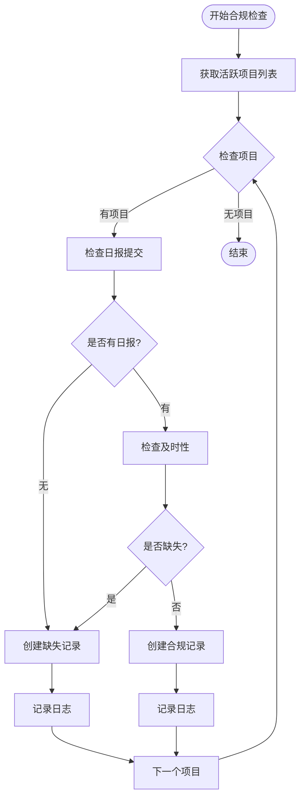

**图表来源**
- [compliance.task.js:17-117](file://backend/src/common/tasks/compliance.task.js#L17-L117)

#### 及时性判定规则

| 时间间隔 | 状态 | 描述 |
|----------|------|------|
| 0天 | on_time | 准时提交 |
| 1天 | delayed | 延迟提交 |
| >1天 | missing | 缺失报告 |

**章节来源**
- [compliance.task.js:17-117](file://backend/src/common/tasks/compliance.task.js#L17-L117)
- [compliance.service.js:11-18](file://backend/src/features/compliance/services/compliance.service.js#L11-L18)

### 缺失报告审核系统

管理员可以审核员工未按时提交的日志，并决定是否自动批准。

#### 审核流程

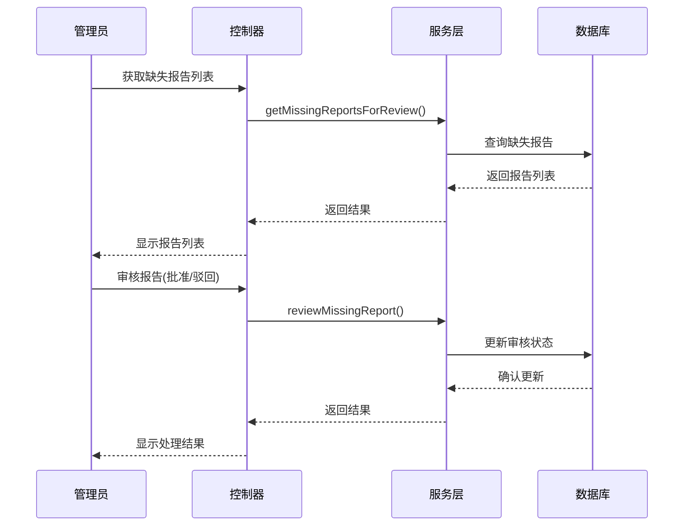

**图表来源**
- [compliance.controller.js:96-137](file://backend/src/features/compliance/controllers/compliance.controller.js#L96-L137)
- [compliance.service.js:134-172](file://backend/src/features/compliance/services/compliance.service.js#L134-L172)

**章节来源**
- [compliance.controller.js:96-137](file://backend/src/features/compliance/controllers/compliance.controller.js#L96-L137)
- [compliance.service.js:134-172](file://backend/src/features/compliance/services/compliance.service.js#L134-L172)

### 合规统计分析系统

系统提供多层次的统计分析功能，帮助管理层了解整体合规状况。

#### 统计指标体系

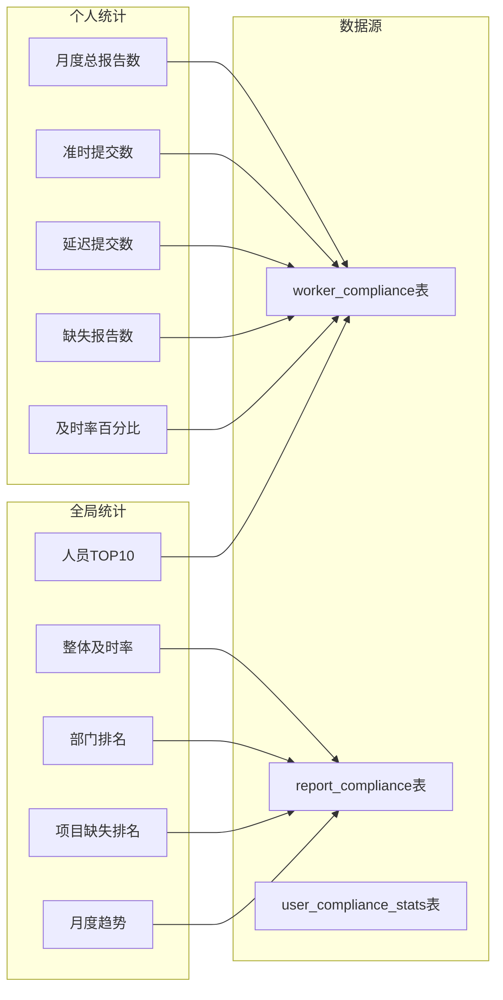

**图表来源**
- [stats.service.js:11-212](file://backend/src/features/compliance/services/stats.service.js#L11-L212)

**章节来源**
- [stats.service.js:62-122](file://backend/src/features/compliance/services/stats.service.js#L62-L122)

### 智能提醒系统

系统通过微信模板消息向未按时提交日志的员工发送提醒。

#### 提醒策略

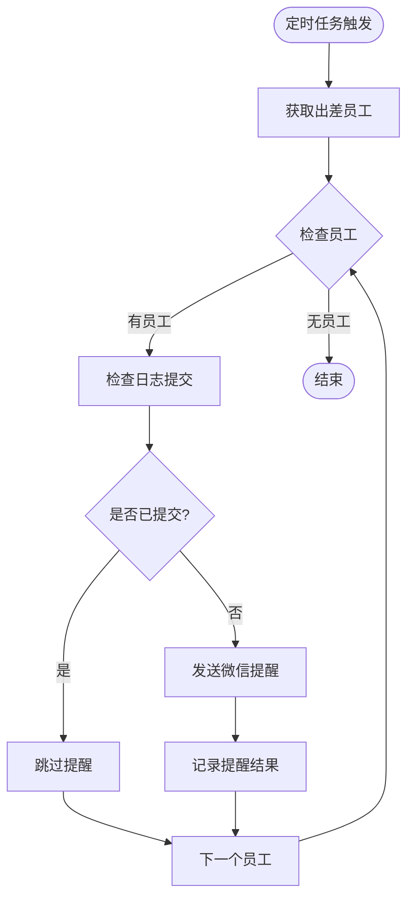

**图表来源**
- [reminder.service.js:11-71](file://backend/src/features/compliance/services/reminder.service.js#L11-L71)

**章节来源**
- [reminder.service.js:11-71](file://backend/src/features/compliance/services/reminder.service.js#L11-L71)
- [template.service.js:38-73](file://backend/src/system/wechat/template.service.js#L38-L73)

## 依赖关系分析

合规管理模块的依赖关系呈现清晰的分层结构：

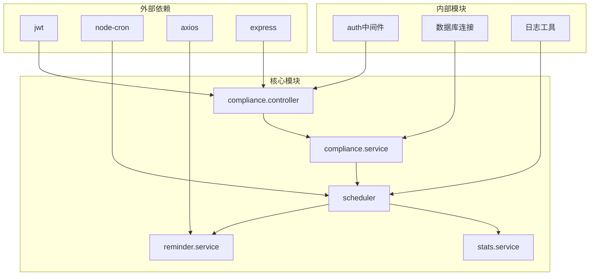

**图表来源**
- [compliance.controller.js:1-10](file://backend/src/features/compliance/controllers/compliance.controller.js#L1-L10)
- [scheduler.js:1-8](file://backend/src/common/tasks/scheduler.js#L1-L8)

### 数据流分析

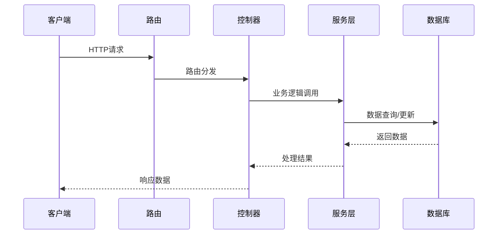

**图表来源**
- [compliance.controller.js:1-273](file://backend/src/features/compliance/controllers/compliance.controller.js#L1-L273)

**章节来源**
- [compliance.controller.js:1-273](file://backend/src/features/compliance/controllers/compliance.controller.js#L1-L273)
- [compliance.service.js:1-229](file://backend/src/features/compliance/services/compliance.service.js#L1-L229)

## 性能考虑

### 数据库优化策略

1. **索引优化**
   - 在 `report_date` 和 `timeliness` 字段建立复合索引
   - 为 `user_id` 和 `report_date` 建立索引以优化统计查询

2. **查询优化**
   - 使用 LIMIT 和 OFFSET 实现分页查询
   - 避免 N+1 查询问题，批量处理数据

3. **缓存策略**
   - 使用 Redis 缓存频繁访问的统计数据
   - 实现权限缓存减少数据库查询

### 定时任务优化

1. **任务调度**
   - 使用 node-cron 实现精确的时间调度
   - 支持多个时区配置

2. **并发控制**
   - 避免任务重叠执行
   - 实现任务状态监控

## 故障排除指南

### 常见问题及解决方案

#### 1. 出差状态设置失败

**症状**: 设置出差状态返回错误
**可能原因**:
- 缺少必要参数
- 用户ID不存在
- 数据库连接异常

**解决步骤**:
1. 检查请求参数格式
2. 验证用户是否存在
3. 查看数据库连接日志

#### 2. 合规检查任务失败

**症状**: 定时任务执行失败
**可能原因**:
- 数据库查询超时
- 外部API调用失败
- 权限不足

**解决步骤**:
1. 检查数据库连接状态
2. 验证外部服务可用性
3. 查看任务执行日志

#### 3. 微信提醒发送失败

**症状**: 员工未收到提醒消息
**可能原因**:
- 用户未绑定微信OpenID
- 微信API调用失败
- 模板消息配置错误

**解决步骤**:
1. 检查用户微信绑定状态
2. 验证微信API配置
3. 查看模板消息发送日志

**章节来源**
- [compliance.controller.js:16-18](file://backend/src/features/compliance/controllers/compliance.controller.js#L16-L18)
- [compliance.task.js:96-98](file://backend/src/common/tasks/compliance.task.js#L96-L98)
- [reminder.service.js:44-46](file://backend/src/features/compliance/services/reminder.service.js#L44-L46)

## 结论

合规管理模块通过自动化流程有效提升了企业日志管理的效率和规范性。模块设计具有以下优势：

1. **完整的合规闭环**: 从出差状态管理到日志提交提醒，再到统计分析，形成完整的合规管理体系

2. **智能化提醒机制**: 通过微信模板消息实现精准的提醒推送，提高员工日志提交的及时性

3. **多层次统计分析**: 提供个人、部门和全局三个层面的统计分析，帮助管理层做出数据驱动的决策

4. **可扩展的架构设计**: 清晰的分层架构和模块化设计便于功能扩展和维护

5. **完善的权限控制**: 基于角色的访问控制确保系统安全性和数据隐私

未来可以考虑的功能增强包括：
- 移动端推送通知支持
- 更丰富的统计图表和报表
- 自定义提醒策略配置
- 与其他业务系统的集成