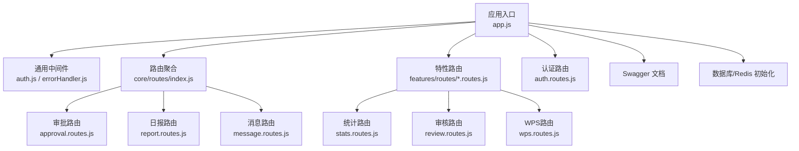
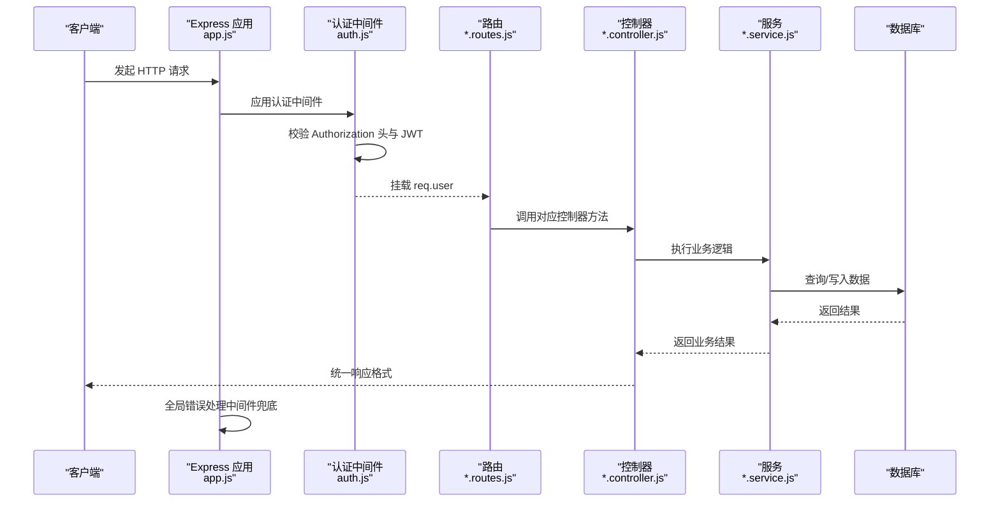
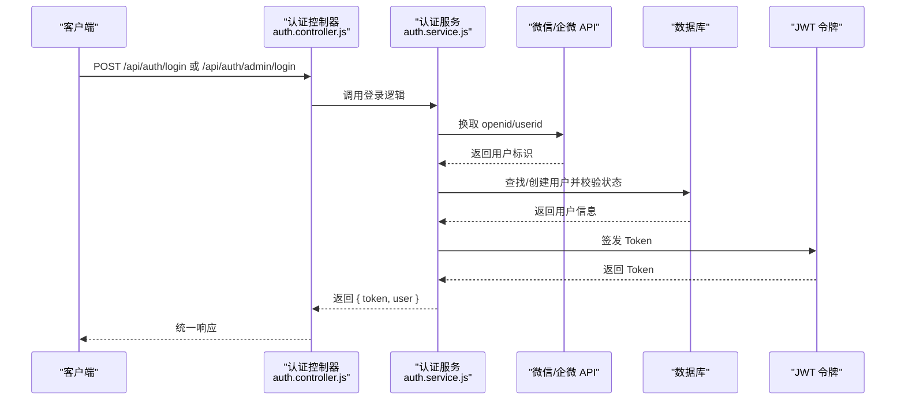
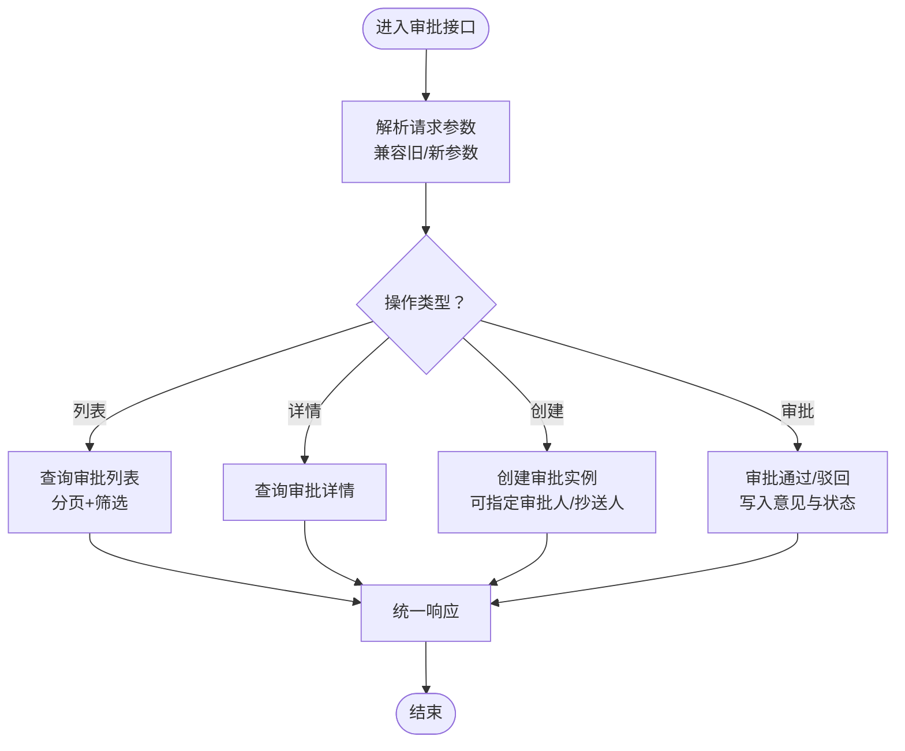
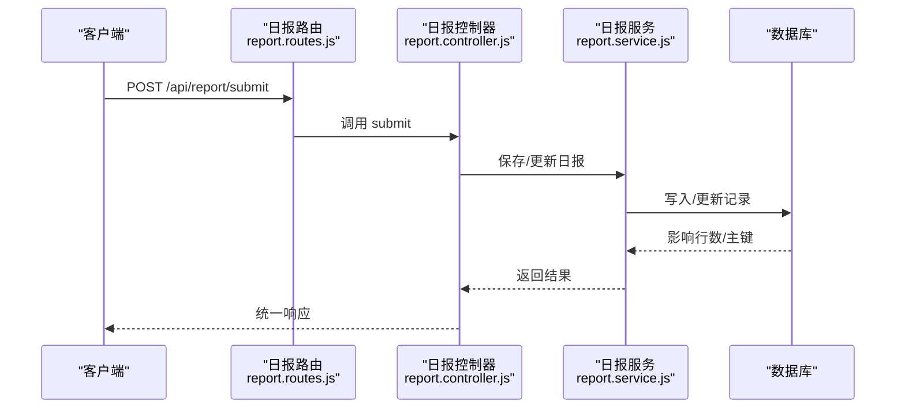
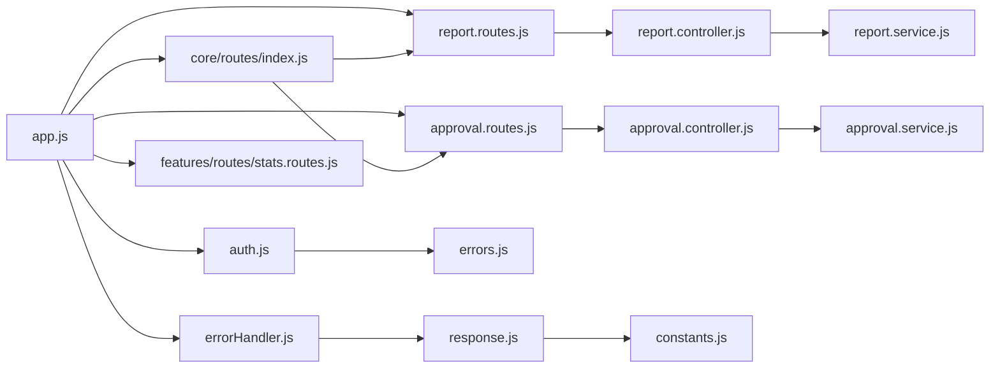

# 后端 API 服务

<cite>
**本文引用的文件**
- [backend/src/app.js](file://backend/src/app.js)
- [backend/package.json](file://backend/package.json)
- [backend/src/common/middleware/auth.js](file://backend/src/common/middleware/auth.js)
- [backend/src/common/middleware/errorHandler.js](file://backend/src/common/middleware/errorHandler.js)
- [backend/src/common/utils/response.js](file://backend/src/common/utils/response.js)
- [backend/src/common/utils/constants.js](file://backend/src/common/utils/constants.js)
- [backend/src/common/utils/errors.js](file://backend/src/common/utils/errors.js)
- [backend/src/auth/controllers/auth.controller.js](file://backend/src/auth/controllers/auth.controller.js)
- [backend/src/auth/services/auth.service.js](file://backend/src/auth/services/auth.service.js)
- [backend/src/auth/routes/auth.routes.js](file://backend/src/auth/routes/auth.routes.js)
- [backend/src/core/routes/index.js](file://backend/src/core/routes/index.js)
- [backend/src/core/routes/report.routes.js](file://backend/src/core/routes/report.routes.js)
- [backend/src/core/controllers/report.controller.js](file://backend/src/core/controllers/report.controller.js)
- [backend/src/core/routes/approval.routes.js](file://backend/src/core/routes/approval.routes.js)
- [backend/src/core/controllers/approval.controller.js](file://backend/src/core/controllers/approval.controller.js)
- [backend/src/features/routes/stats.routes.js](file://backend/src/features/routes/stats.routes.js)
- [backend/src/features/routes/review.routes.js](file://backend/src/features/routes/review.routes.js)
- [backend/src/features/routes/wps.routes.js](file://backend/src/features/routes/wps.routes.js)
</cite>

## 更新摘要
**所做更改**
- 重构了认证授权模块，新增完整的 Express.js 架构
- 新增审批管理模块的完整实现
- 新增日报管理模块的完整实现
- 新增消息通知模块的路由组织
- 新增统计分析模块的路由实现
- 新增审核管理模块的路由实现
- 重构中间件与工具类，统一响应格式和错误处理机制
- 完善了 Swagger 文档集成和路由组织结构

## 目录
1. [简介](#简介)
2. [项目结构](#项目结构)
3. [核心组件](#核心组件)
4. [架构总览](#架构总览)
5. [详细组件分析](#详细组件分析)
6. [依赖关系分析](#依赖关系分析)
7. [性能考虑](#性能考虑)
8. [故障排查指南](#故障排查指南)
9. [结论](#结论)
10. [附录](#附录)

## 简介
本文档面向"智慧办公助手 OA 系统"的后端 API 服务，采用 Node.js + Express 构建 RESTful API。系统围绕认证授权、审批管理、日报管理、消息通知、统计分析、审核管理等核心业务模块进行组织，提供统一的响应格式、完善的中间件体系与错误处理机制。经过重大重构后，系统采用了全新的 Express.js 架构，实现了模块化的路由组织和清晰的业务分层。

## 项目结构
后端采用"按功能域分层 + 路由聚合"的组织方式，经过重构后形成了更加清晰的架构：

- **应用入口与中间件**：在应用入口集中注册安全中间件、CORS、限流、日志、Swagger 文档、路由挂载与全局错误处理
- **通用工具与中间件**：认证中间件、错误处理中间件、统一响应格式、常量与错误类型
- **功能域模块**：
  - 认证域：auth 控制器与服务，支持微信/企业微信登录、Web 管理员登录、TOTP 二次验证、账号关联等
  - 核心域：core 路由聚合，包含审批、日报、消息、客户端错误、管理员、项目等子路由
  - 特性域：features 路由聚合，包含统计分析、审核管理、WPS 数据接口等
- **配置管理**：独立的配置文件管理数据库连接、Redis、环境变量和 Swagger 设置
- **测试与脚本**：Jest 单元/集成测试、数据库初始化与迁移脚本

**图表来源**
- [backend/src/app.js:102-127](file://backend/src/app.js#L102-L127)
- [backend/src/core/routes/index.js:1-21](file://backend/src/core/routes/index.js#L1-L21)
- [backend/src/features/routes/stats.routes.js:1-26](file://backend/src/features/routes/stats.routes.js#L1-L26)

**章节来源**
- [backend/src/app.js:1-207](file://backend/src/app.js#L1-L207)
- [backend/src/core/routes/index.js:1-21](file://backend/src/core/routes/index.js#L1-L21)

## 核心组件
重构后的系统包含以下核心组件：

### 应用入口与中间件
- **安全中间件**：Helmet（关闭部分策略以适配小程序）、CORS（开发环境放开）
- **限流机制**：全局限流与登录端点限流（失败请求计数）
- **请求解析**：JSON/URL 编码解析，捕获 JSON 解析错误
- **请求日志**：统一请求日志中间件
- **Swagger 集成**：条件挂载 API 文档
- **路由挂载**：核心路由、认证路由、特性路由、消息路由
- **404 与全局错误处理**：统一 404 与全局错误中间件

### 通用中间件
- **认证中间件**：从 Authorization 头解析 Bearer Token，校验 JWT 有效性与用户状态，挂载用户信息
- **角色中间件**：基于用户角色进行权限校验
- **错误处理中间件**：统一返回 HTTP 200，通过 body.code 区分成功/失败

### 统一响应与常量
- **统一响应**：success/fail/paginated，统一 code/message/data 结构
- **常量定义**：ErrorCode、Role、UserStatus、ApprovalType/Status、MessageType、分页默认值、业务常量
- **错误类型**：AppError 及其派生类（ValidationError、AuthError、ForbiddenError、NotFoundError、BusinessError）

**章节来源**
- [backend/src/app.js:29-140](file://backend/src/app.js#L29-L140)
- [backend/src/common/middleware/auth.js:1-83](file://backend/src/common/middleware/auth.js#L1-L83)
- [backend/src/common/middleware/errorHandler.js:1-28](file://backend/src/common/middleware/errorHandler.js#L1-L28)
- [backend/src/common/utils/response.js:1-49](file://backend/src/common/utils/response.js#L1-L49)
- [backend/src/common/utils/constants.js:1-106](file://backend/src/common/utils/constants.js#L1-L106)
- [backend/src/common/utils/errors.js:1-99](file://backend/src/common/utils/errors.js#L1-L99)

## 架构总览
系统采用"入口 -> 中间件 -> 路由 -> 控制器 -> 服务 -> 数据库/外部服务"的标准 Express 架构。经过重构后，认证中间件贯穿核心业务，确保所有受保护接口均需有效 Token；错误处理中间件保证统一响应格式与日志记录；Swagger 文档辅助前后端协作。

**图表来源**
- [backend/src/app.js:102-140](file://backend/src/app.js#L102-L140)
- [backend/src/common/middleware/auth.js:14-56](file://backend/src/common/middleware/auth.js#L14-L56)
- [backend/src/core/routes/report.routes.js:13-38](file://backend/src/core/routes/report.routes.js#L13-L38)
- [backend/src/core/controllers/report.controller.js:14-34](file://backend/src/core/controllers/report.controller.js#L14-L34)

## 详细组件分析

### 认证与授权模块
重构后的认证模块提供了完整的用户身份验证和权限管理功能：

#### 认证流程
- 从 Authorization 头提取 Bearer Token，验证签名与有效期
- 校验用户状态为 active，若角色变化则以数据库为准
- 将解码后的用户信息挂载到 req.user，供后续中间件与控制器使用

#### 角色控制
- requireRole(...) 工厂函数根据所需角色进行权限校验
- 支持多种角色组合，如 requireRole('admin', 'superadmin')

#### Web 管理员登录
- 支持用户名/邮箱 + 密码登录，限制 admin/superadmin 可登录
- 登录失败次数限制与 TOTP 二次验证可选

#### 企业微信与微信登录
- 自动注册与状态激活逻辑，白名单用户可自动提升为管理员
- 支持关联微信与企业微信账号

#### TOTP 二次验证
- 生成密钥与二维码，启用/禁用 TOTP

**图表来源**
- [backend/src/auth/controllers/auth.controller.js:12-74](file://backend/src/auth/controllers/auth.controller.js#L12-L74)
- [backend/src/auth/services/auth.service.js:22-87](file://backend/src/auth/services/auth.service.js#L22-L87)
- [backend/src/auth/services/auth.service.js:268-364](file://backend/src/auth/services/auth.service.js#L268-L364)

**章节来源**
- [backend/src/common/middleware/auth.js:14-80](file://backend/src/common/middleware/auth.js#L14-L80)
- [backend/src/auth/controllers/auth.controller.js:12-161](file://backend/src/auth/controllers/auth.controller.js#L12-L161)
- [backend/src/auth/services/auth.service.js:22-414](file://backend/src/auth/services/auth.service.js#L22-L414)

### 审批管理模块
审批模块提供了完整的审批流程管理功能：

#### 路由与控制器
- 列表/详情/创建/审批（通过/驳回）四个核心接口，均需登录认证
- 参数兼容：tab/status、type/approvalTypeId、action/评论字段等

#### 业务要点
- 列表支持分页与筛选，tab 与 mine 语义在服务层处理
- 创建审批支持指定审批人与抄送人
- 审批动作映射 approve/reject -> approved/rejected

**图表来源**
- [backend/src/core/routes/approval.routes.js:13-24](file://backend/src/core/routes/approval.routes.js#L13-L24)
- [backend/src/core/controllers/approval.controller.js:15-122](file://backend/src/core/controllers/approval.controller.js#L15-L122)

**章节来源**
- [backend/src/core/routes/approval.routes.js:1-26](file://backend/src/core/routes/approval.routes.js#L1-L26)
- [backend/src/core/controllers/approval.controller.js:1-138](file://backend/src/core/controllers/approval.controller.js#L1-L138)

### 日报管理模块
日报模块提供了完整的日报管理功能：

#### 路由与控制器
- 列表、详情、提交、草稿保存/获取、删除、作业人员名单、人员统计看板、导出 CSV
- 管理员可见全部，普通用户仅见自身数据

#### 业务要点
- 提交/草稿保存支持两种参数形式（formData 与直接 body）
- 删除仅允许草稿或已驳回状态
- 导出 CSV 写入 BOM 以适配 Excel 中文显示

**图表来源**
- [backend/src/core/routes/report.routes.js:13-38](file://backend/src/core/routes/report.routes.js#L13-L38)
- [backend/src/core/controllers/report.controller.js:56-72](file://backend/src/core/controllers/report.controller.js#L56-L72)

**章节来源**
- [backend/src/core/routes/report.routes.js:1-41](file://backend/src/core/routes/report.routes.js#L1-L41)
- [backend/src/core/controllers/report.controller.js:1-172](file://backend/src/core/controllers/report.controller.js#L1-L172)

### 统计分析模块
统计模块提供了多维度的数据统计功能：

#### 路由与控制器
- 首页统计、最近动态、个人中心统计、日报统计看板
- 所有接口均需登录认证

#### 业务要点
- 通过服务层聚合多维度指标，返回统一结构

**章节来源**
- [backend/src/features/routes/stats.routes.js:1-26](file://backend/src/features/routes/stats.routes.js#L1-L26)

### 消息通知模块
消息模块负责系统消息的推送和管理：

#### 路由与控制器
- 消息路由位于 core 路由聚合中，具体实现位于 core/routes/message.routes.js 与对应控制器

#### 业务要点
- 与审批/日报等业务联动，推送审批状态变更、系统公告等消息

**章节来源**
- [backend/src/core/routes/index.js:7-18](file://backend/src/core/routes/index.js#L7-L18)

### 审核管理模块
审核模块提供了管理员对异常数据的复核功能：

#### 路由与控制器
- 审核相关路由位于 features 路由聚合中，具体实现位于 features/routes/review.routes.js 与对应控制器

#### 业务要点
- 管理员对异常数据、违规行为进行复核与处理

**章节来源**
- [backend/src/app.js:117-119](file://backend/src/app.js#L117-L119)

### WPS 数据接口模块
WPS 模块提供了与企业微信相关的数据接口：

#### 路由与控制器
- WPS 数据接口路由位于 features 路由聚合中，具体实现位于 features/routes/wps.routes.js 与对应控制器

#### 业务要点
- 使用 API Key 鉴权，对接企业微信相关数据

**章节来源**
- [backend/src/app.js:125-127](file://backend/src/app.js#L125-L127)

## 依赖关系分析
重构后的系统具有清晰的依赖关系：

### 应用入口依赖
- 中间件：安全、CORS、限流、解析、日志
- 路由：核心路由聚合、认证路由、特性路由、消息路由
- 错误处理：全局错误处理中间件

### 通用模块依赖
- 认证中间件依赖 JWT、数据库查询与错误类型
- 错误处理中间件依赖日志、统一响应与错误类型
- 统一响应依赖常量与错误码

### 功能域依赖
- 控制器依赖服务与统一响应
- 服务依赖数据库、外部 API（微信/企业微信）与日志

**图表来源**
- [backend/src/app.js:102-140](file://backend/src/app.js#L102-L140)
- [backend/src/common/middleware/auth.js:1-83](file://backend/src/common/middleware/auth.js#L1-L83)
- [backend/src/common/middleware/errorHandler.js:1-28](file://backend/src/common/middleware/errorHandler.js#L1-L28)
- [backend/src/core/routes/index.js:1-21](file://backend/src/core/routes/index.js#L1-L21)
- [backend/src/core/routes/report.routes.js:1-41](file://backend/src/core/routes/report.routes.js#L1-L41)
- [backend/src/core/controllers/report.controller.js:1-172](file://backend/src/core/controllers/report.controller.js#L1-L172)
- [backend/src/core/routes/approval.routes.js:1-26](file://backend/src/core/routes/approval.routes.js#L1-L26)
- [backend/src/core/controllers/approval.controller.js:1-138](file://backend/src/core/controllers/approval.controller.js#L1-L138)
- [backend/src/common/utils/response.js:1-49](file://backend/src/common/utils/response.js#L1-L49)
- [backend/src/common/utils/constants.js:1-106](file://backend/src/common/utils/constants.js#L1-L106)
- [backend/src/common/utils/errors.js:1-99](file://backend/src/common/utils/errors.js#L1-L99)

## 性能考虑
重构后的系统在性能方面进行了多项优化：

### 限流策略
- 全局限流与登录端点限流分别针对一般请求与暴力破解防护，避免误伤正常用户并发场景

### 请求体大小
- JSON/URL 编码解析限制为 10MB，满足富文本/附件上传场景

### 数据库连接
- 数据库连接池延迟初始化，避免启动阻塞；Redis 连接按需初始化并在优雅退出时关闭

### 响应格式
- 统一响应减少前端判断成本，分页响应包含 totalPages，便于前端渲染优化

**章节来源**
- [backend/src/app.js:47-81](file://backend/src/app.js#L47-L81)
- [backend/src/app.js:155-165](file://backend/src/app.js#L155-L165)
- [backend/src/common/utils/response.js:26-46](file://backend/src/common/utils/response.js#L26-L46)

## 故障排查指南
重构后的系统提供了完善的故障排查机制：

### 认证失败
- 检查 Authorization 头是否以 Bearer 开头，Token 是否过期或无效
- 确认用户状态为 active，角色未被降级

### 权限不足
- 管理员接口需 admin/superadmin 角色，检查角色中间件是否正确应用

### 参数校验失败
- 校验错误返回统一的业务错误码，检查必填字段与数据类型

### 资源不存在
- 404 错误通常表示请求对象不存在或已被删除

### 服务器内部错误
- 生产环境统一返回"服务器内部错误"，开发环境返回具体堆栈信息，便于定位问题

### 登录频繁限制
- 登录端点限流触发时，等待 15 分钟后重试

**章节来源**
- [backend/src/common/middleware/auth.js:14-56](file://backend/src/common/middleware/auth.js#L14-L56)
- [backend/src/common/middleware/errorHandler.js:12-25](file://backend/src/common/middleware/errorHandler.js#L12-L25)
- [backend/src/common/utils/errors.js:29-89](file://backend/src/common/utils/errors.js#L29-L89)

## 结论
经过重大重构后，本系统以更加清晰的模块划分与中间件体系为基础，结合统一响应与错误处理机制，实现了认证授权、审批管理、日报管理、消息通知、统计分析、审核管理等核心业务的 RESTful API。新的架构不仅保持了原有的功能完整性，还在以下方面得到了显著提升：

- **架构清晰度**：模块化设计使得各功能域职责明确，便于维护和扩展
- **安全性增强**：完善的认证授权机制和权限控制
- **可维护性**：统一的响应格式和错误处理机制
- **可扩展性**：灵活的路由组织和中间件体系
- **开发体验**：集成 Swagger 文档和完善的测试覆盖

建议在后续迭代中持续完善单元测试覆盖率与接口契约文档，保障跨端协同效率。

## 附录

### API 设计原则与路由组织
重构后的系统遵循以下设计原则：

#### 设计原则
- **统一响应格式**：所有接口返回 { code, message, data }
- **统一错误处理**：错误通过业务 code 区分，HTTP 状态码统一为 200
- **参数兼容**：对历史参数进行映射，保证平滑升级
- **权限最小化**：受保护接口均需登录认证，管理员接口额外校验角色

#### 路由组织
- **核心域**：/api 下的 report/approval/message/client-error/admin/project
- **认证域**：/api/auth/* 与 /api/user/profile
- **特性域**：/api/stats/* 与 /api/review/*、/api/wps/*
- **消息域**：/api/message/*

**章节来源**
- [backend/src/app.js:102-127](file://backend/src/app.js#L102-L127)
- [backend/src/core/routes/index.js:1-21](file://backend/src/core/routes/index.js#L1-L21)

### 常用错误码定义
重构后的错误码体系：

- **成功**：0
- **认证错误**：401
- **权限不足**：403
- **参数校验失败**：1001
- **资源不存在**：1002
- **业务逻辑错误**：2001

**章节来源**
- [backend/src/common/utils/constants.js:8-15](file://backend/src/common/utils/constants.js#L8-L15)

### 关键实现细节
重构后的关键实现细节：

#### 认证流程
- 从 Authorization 头提取 Token 并验证，校验用户状态与角色一致性

#### 数据验证
- 控制器层进行基础参数校验，服务层进行业务规则校验

#### 权限控制
- requireRole(...) 中间件按角色放行，管理员可见全部数据

#### 错误处理
- 全局错误中间件统一记录日志并返回统一格式

**章节来源**
- [backend/src/common/middleware/auth.js:14-80](file://backend/src/common/middleware/auth.js#L14-L80)
- [backend/src/common/middleware/errorHandler.js:12-25](file://backend/src/common/middleware/errorHandler.js#L12-L25)
- [backend/src/common/utils/errors.js:9-89](file://backend/src/common/utils/errors.js#L9-L89)