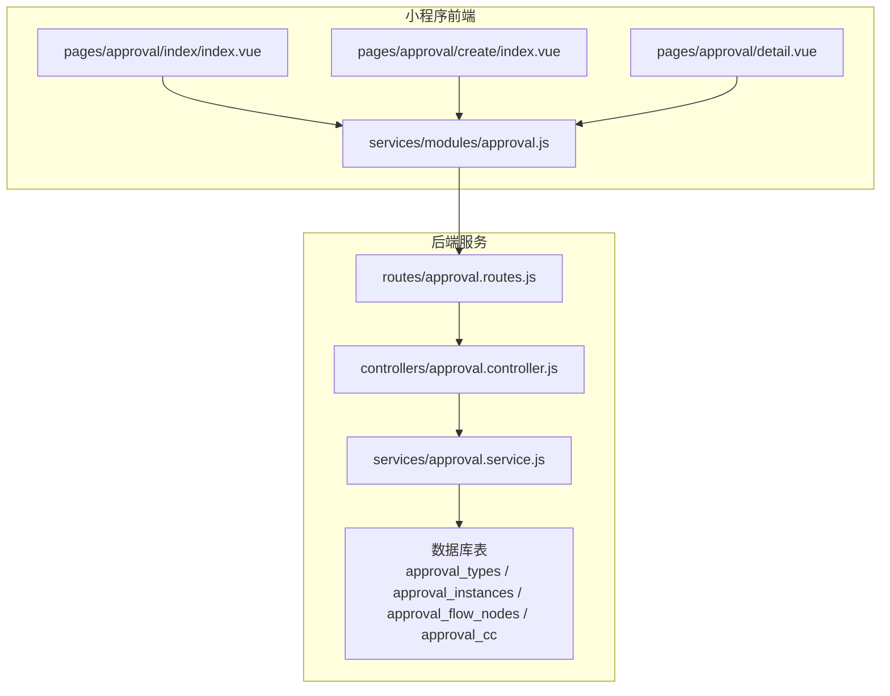
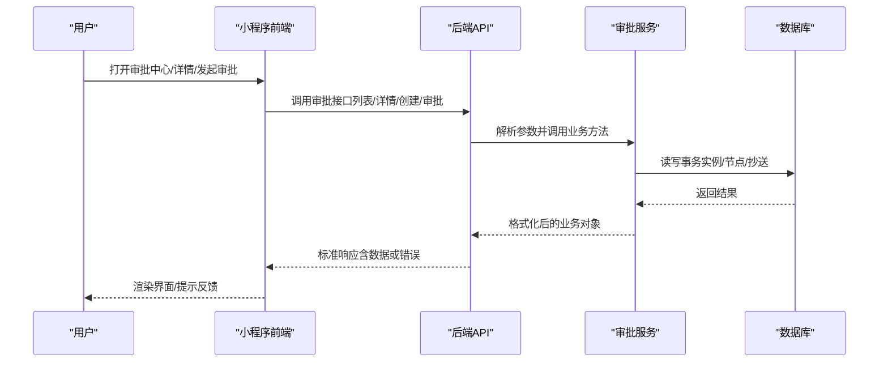
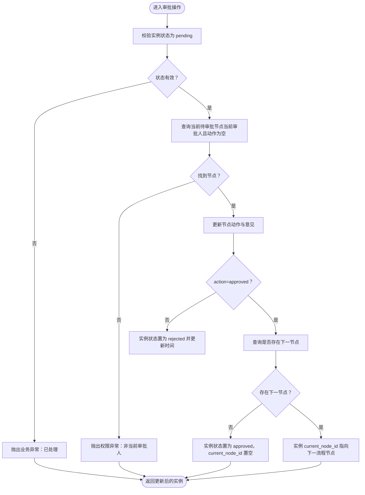
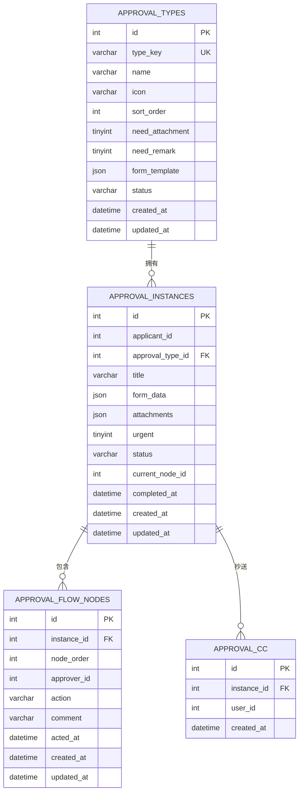

# 审批管理模块

<cite>
**本文引用的文件**
- [approval.controller.js](file://backend/src/core/controllers/approval.controller.js)
- [approval.service.js](file://backend/src/core/services/approval.service.js)
- [approval.routes.js](file://backend/src/core/routes/approval.routes.js)
- [approval.js](file://miniapp/src/services/modules/approval.js)
- [approval.index.vue](file://miniapp/src/pages/approval/index/index.vue)
- [approval.create.index.vue](file://miniapp/src/pages/approval/create/index.vue)
- [approval.detail.vue](file://miniapp/src/pages/approval/detail.vue)
- [approval_cc.sql](file://backend/scripts/approval_cc.sql)
- [init-db.js](file://backend/scripts/init-db.js)
- [Design-Interaction-Spec.md](file://miniapp/docs/Design-Interaction-Spec.md)
- [PRD.md](file://miniapp/docs/PRD.md)
</cite>

## 更新摘要
**变更内容**
- 完全重写审批流程引擎架构
- 新增审批类型表、审批实例表、审批流程节点表、审批抄送表
- 实现动态表单模板和多节点审批流程
- 增强审批路由和CC关系管理功能
- 优化前端审批交互体验

## 目录
1. [简介](#简介)
2. [项目结构](#项目结构)
3. [核心组件](#核心组件)
4. [架构总览](#架构总览)
5. [详细组件分析](#详细组件分析)
6. [依赖分析](#依赖分析)
7. [性能考虑](#性能考虑)
8. [故障排查指南](#故障排查指南)
9. [结论](#结论)
10. [附录](#附录)

## 简介
本文件面向"智慧办公助手 OA 系统"的审批管理模块，系统性阐述全新的审批流程设计与实现。模块采用基于审批类型表、审批实例表、审批流程节点表的三层架构，支持请假、出差、采购、费用报销等多类型审批的动态配置与运行机制；详解多节点审批流程、审批状态流转、审批人分配策略、抄送功能、审批历史追踪；并提供完整的 API 接口清单与调用示例路径，帮助开发者快速集成与扩展复杂审批场景（如并行审批、串行审批、条件审批等）。

## 项目结构
审批模块在后端采用经典的三层架构：路由层负责请求接入与鉴权，控制器层负责参数解析与响应封装，服务层负责业务逻辑与数据库事务；前端小程序提供审批中心、发起审批、审批详情三大页面，配合统一的审批 API 模块进行交互。

**图表来源**
- [approval.routes.js:1-26](file://backend/src/core/routes/approval.routes.js#L1-L26)
- [approval.controller.js:1-138](file://backend/src/core/controllers/approval.controller.js#L1-L138)
- [approval.service.js:1-359](file://backend/src/core/services/approval.service.js#L1-L359)
- [approval.js:1-24](file://miniapp/src/services/modules/approval.js#L1-L24)

## 核心组件
- **路由层**：定义审批相关接口，统一鉴权中间件，暴露列表、详情、创建、审批操作等端点。
- **控制器层**：解析请求参数，兼容旧版/新版字段，调用服务层并返回标准响应。
- **服务层**：封装数据库事务、状态机流转、审批节点推进、抄送关系写入、详情聚合等核心逻辑。
- **前端页面**：审批中心（列表+筛选）、发起审批（动态表单+审批人/抄送人选择）、审批详情（表单字段+时间线+审批操作）。
- **数据模型**：审批类型表、审批实例表、审批流程节点表、抄送关系四张核心表，支撑动态表单与多节点审批流程。

**章节来源**
- [approval.routes.js:13-23](file://backend/src/core/routes/approval.routes.js#L13-L23)
- [approval.controller.js:15-122](file://backend/src/core/controllers/approval.controller.js#L15-L122)
- [approval.service.js:84-356](file://backend/src/core/services/approval.service.js#L84-L356)
- [approval_cc.sql:1-16](file://backend/scripts/approval_cc.sql#L1-L16)
- [init-db.js:69-132](file://backend/scripts/init-db.js#L69-L132)

## 架构总览
审批模块遵循"请求-控制-服务-数据"的清晰分层，前后端通过统一 API 协议交互。服务层以事务保证审批原子性，状态机驱动审批节点流转，时间线记录审批历史，抄送表保障信息触达。

**图表来源**
- [approval.controller.js:15-122](file://backend/src/core/controllers/approval.controller.js#L15-L122)
- [approval.service.js:84-356](file://backend/src/core/services/approval.service.js#L84-L356)
- [approval.js:4-18](file://miniapp/src/services/modules/approval.js#L4-L18)

## 详细组件分析

### 审批控制器（参数兼容与响应封装）
- **列表接口**：支持旧参数 status/typeId 与新参数 tab/type 的兼容映射，透传 tab 给服务层以支持"我发起的"过滤。
- **详情接口**：校验用户对实例的可见权限（申请人或当前节点审批人）。
- **创建接口**：支持新参数 type/approverId/ccIds，并在事务内写入实例、初始节点、抄送关系。
- **审批接口**：支持 action 的新旧映射（approve/reject 与 approved/rejected），并兼容 comment/opinion。

**章节来源**
- [approval.controller.js:15-135](file://backend/src/core/controllers/approval.controller.js#L15-L135)

### 审批服务（状态机与事务）
- **列表**：根据 tab 精准过滤（mine 仅申请人，其他包含当前审批人），支持按状态与类型过滤，分页查询并映射字段。
- **详情**：聚合实例基础信息、申请人信息、审批节点历史（含审批人姓名），解析 form_data 与附件。
- **创建**：事务内插入实例、创建初始节点（node_order=1），可选写入抄送关系；返回格式化后的实例。
- **审批**：校验实例状态与当前审批人，更新当前节点动作与意见；若驳回则实例置为 rejected，若通过则判断是否存在下一节点，存在则流转到下一节点，否则完成并清空 current_node_id。

**图表来源**
- [approval.service.js:267-356](file://backend/src/core/services/approval.service.js#L267-L356)

**章节来源**
- [approval.service.js:84-356](file://backend/src/core/services/approval.service.js#L84-L356)

### 数据模型与表结构
- **审批类型表**：定义审批类型 key、名称、图标、排序、表单模板等，支撑前端动态表单渲染与后端创建时的类型绑定。
- **审批实例表**：保存申请人、类型、标题、表单数据、附件、紧急标记、状态、当前节点等。
- **审批流程节点表**：记录每个节点的实例、顺序、审批人、动作、意见、时间等，构成审批时间线。
- **抄送关系表**：记录审批实例与抄送人的关联，便于信息触达与历史追踪。

**图表来源**
- [init-db.js:69-132](file://backend/scripts/init-db.js#L69-L132)
- [approval_cc.sql:7-15](file://backend/scripts/approval_cc.sql#L7-L15)

**章节来源**
- [init-db.js:69-132](file://backend/scripts/init-db.js#L69-L132)
- [approval_cc.sql:1-16](file://backend/scripts/approval_cc.sql#L1-L16)

### 前端页面与交互
- **审批中心**：支持"待审批/我发起的/已处理"三类 Tab 与"全部/请假/报销/售后"类型筛选；分页加载与下拉刷新。
- **发起审批**：动态表单随类型切换，支持日期区间、人员选择（审批人/抄送人）、文本输入与字数统计；提交前校验必填。
- **审批详情**：展示表单字段、申请人/部门/时间、状态、时间线；待审批状态下提供"通过/驳回"操作。

**章节来源**
- [approval.index.vue:124-254](file://miniapp/src/pages/approval/index/index.vue#L124-L254)
- [approval.create.index.vue:137-339](file://miniapp/src/pages/approval/create/index.vue#L137-L339)
- [approval.detail.vue:96-340](file://miniapp/src/pages/approval/detail.vue#L96-L340)
- [approval.js:4-18](file://miniapp/src/services/modules/approval.js#L4-L18)
- [Design-Interaction-Spec.md:455-482](file://miniapp/docs/Design-Interaction-Spec.md#L455-L482)
- [PRD.md:281-288](file://miniapp/docs/PRD.md#L281-L288)

## 依赖分析
- **控制器依赖服务层提供的业务方法**，统一响应封装工具。
- **服务层依赖数据库连接与事务封装**，严格约束状态机与节点推进。
- **前端 API 模块集中封装审批相关请求**，页面通过服务模块调用后端接口。
- **数据库层由初始化脚本统一创建审批类型、实例、节点、抄送等表**，索引提升查询性能。

**图表来源**
- [approval.controller.js:1-138](file://backend/src/core/controllers/approval.controller.js#L1-L138)
- [approval.service.js:1-359](file://backend/src/core/services/approval.service.js#L1-L359)
- [approval.routes.js:1-26](file://backend/src/core/routes/approval.routes.js#L1-L26)
- [approval.js:1-24](file://miniapp/src/services/modules/approval.js#L1-L24)

**章节来源**
- [approval.controller.js:1-138](file://backend/src/core/controllers/approval.controller.js#L1-L138)
- [approval.service.js:1-359](file://backend/src/core/services/approval.service.js#L1-L359)
- [approval.routes.js:1-26](file://backend/src/core/routes/approval.routes.js#L1-L26)
- [approval.js:1-24](file://miniapp/src/services/modules/approval.js#L1-L24)

## 性能考虑
- **分页与筛选**：列表接口支持按状态与类型过滤，避免一次性加载全量数据；建议前端分页加载与下拉刷新结合。
- **索引优化**：实例表按申请人、类型、状态、创建时间建立索引；节点表按实例、审批人、动作建立索引；抄送表按实例与用户建立索引。
- **事务边界**：创建与审批均在事务内执行，确保一致性与原子性，减少并发冲突带来的脏读风险。
- **前端缓存**：详情页在加载完成后可做本地缓存，减少重复请求；列表页在切换 Tab 与筛选时复用缓存数据。

## 故障排查指南
- **审批不存在**：当详情或审批操作的目标实例不存在时，服务层抛出"审批不存在"错误。
- **非当前审批人**：若用户非当前节点审批人，审批接口会拒绝操作并提示权限不足。
- **重复审批**：若实例状态非 pending，审批接口会提示"已处理，请勿重复操作"。
- **参数不合法**：审批 action 仅支持 approved/rejected，非法值会被拒绝。
- **前端常见问题**：提交前表单校验失败会弹出提示；提交中显示 loading；提交失败会提示错误信息。

**章节来源**
- [approval.service.js:281-289](file://backend/src/core/services/approval.service.js#L281-L289)
- [approval.controller.js:101-122](file://backend/src/core/controllers/approval.controller.js#L101-L122)
- [approval.detail.vue:299-340](file://miniapp/src/pages/approval/detail.vue#L299-L340)

## 结论
审批管理模块以清晰的三层架构与严谨的状态机设计，实现了从"发起-流转-完成/驳回-历史追踪"的闭环流程。通过动态表单模板与抄送机制，满足多类型审批场景；通过事务与索引优化，保障高并发下的稳定性与性能。建议后续在"并行审批、条件审批、会签/或签"等高级能力上，基于现有节点模型与状态机进行扩展。

## 附录

### 审批相关 API 接口清单
- **列表查询**
  - 方法：POST
  - 路径：/api/approval/list
  - 功能：分页+筛选（支持 tab/pending/mine/done 与 type/请假/报销/售后 等）
  - 请求参数：page、pageSize、status（旧）、typeId（旧）、tab（新）、type（新）
  - 响应：分页列表与总数
  - 示例路径：[approval.controller.js:15-36](file://backend/src/core/controllers/approval.controller.js#L15-L36)、[approval.js:4-6](file://miniapp/src/services/modules/approval.js#L4-L6)

- **审批详情**
  - 方法：POST
  - 路径：/api/approval/detail
  - 功能：获取审批实例详情（含表单数据、附件、时间线）
  - 请求参数：id
  - 响应：实例详情对象
  - 示例路径：[approval.controller.js:56-67](file://backend/src/core/controllers/approval.controller.js#L56-L67)、[approval.js:8-10](file://miniapp/src/services/modules/approval.js#L8-L10)

- **创建审批**
  - 方法：POST
  - 路径：/api/approval/create
  - 功能：创建审批实例并生成初始节点，可选抄送人
  - 请求参数：type/approvalTypeId、title、formData、attachments、urgent、approverId、ccIds
  - 响应：创建后的实例对象
  - 示例路径：[approval.controller.js:74-94](file://backend/src/core/controllers/approval.controller.js#L74-L94)、[approval.js:12-14](file://miniapp/src/services/modules/approval.js#L12-L14)

- **审批通过/驳回**
  - 方法：POST
  - 路径：/api/approval/approve
  - 功能：审批人对当前节点进行审批，支持 approve/reject 与 approved/rejected 的兼容映射
  - 请求参数：id、action（approve/reject 或 approved/rejected）、comment/opinion
  - 响应：更新后的实例对象
  - 示例路径：[approval.controller.js:101-122](file://backend/src/core/controllers/approval.controller.js#L101-L122)、[approval.js:16-18](file://miniapp/src/services/modules/approval.js#L16-L18)

### 审批状态流转与节点推进
- **状态机**：pending → approved 或 rejected；通过时若存在下一节点则流转，否则完成。
- **当前节点**：由实例的 current_node_id 指向流程节点；只有当前节点审批人可操作。
- **时间线**：按 node_order 升序排列，记录每个节点的动作、审批人、意见与时间。

**章节来源**
- [approval.service.js:267-356](file://backend/src/core/services/approval.service.js#L267-L356)

### 抄送功能实现
- **创建审批时可传入 ccIds**，服务层在事务内批量写入 approval_cc 表。
- **前端在"发起审批"页面支持抄送人选择**，提交时将 ccIds 一并传给后端。

**章节来源**
- [approval.service.js:233-241](file://backend/src/core/services/approval.service.js#L233-L241)
- [approval_cc.sql:7-15](file://backend/scripts/approval_cc.sql#L7-L15)
- [approval.create.index.vue:96-115](file://miniapp/src/pages/approval/create/index.vue#L96-L115)

### 复杂审批场景实现要点（设计建议）
- **并行审批**：在节点表中为同一 node_order 维护多个 approver_id，审批完成条件可按"全部通过/至少 N 人通过"配置。
- **条件审批**：在节点表增加条件字段（如金额阈值、部门限制），流转前由服务层判定是否进入该节点。
- **会签/或签**：通过节点顺序与条件组合实现，或在节点表引入"会签/或签"标志位，配合服务层决策。
- **动态表单**：利用 approval_types 的 form_template 字段，前端按类型渲染动态表单，后端以 JSON 存储 form_data。

**章节来源**
- [init-db.js:69-88](file://backend/scripts/init-db.js#L69-L88)
- [approval.service.js:49-53](file://backend/src/core/services/approval.service.js#L49-L53)