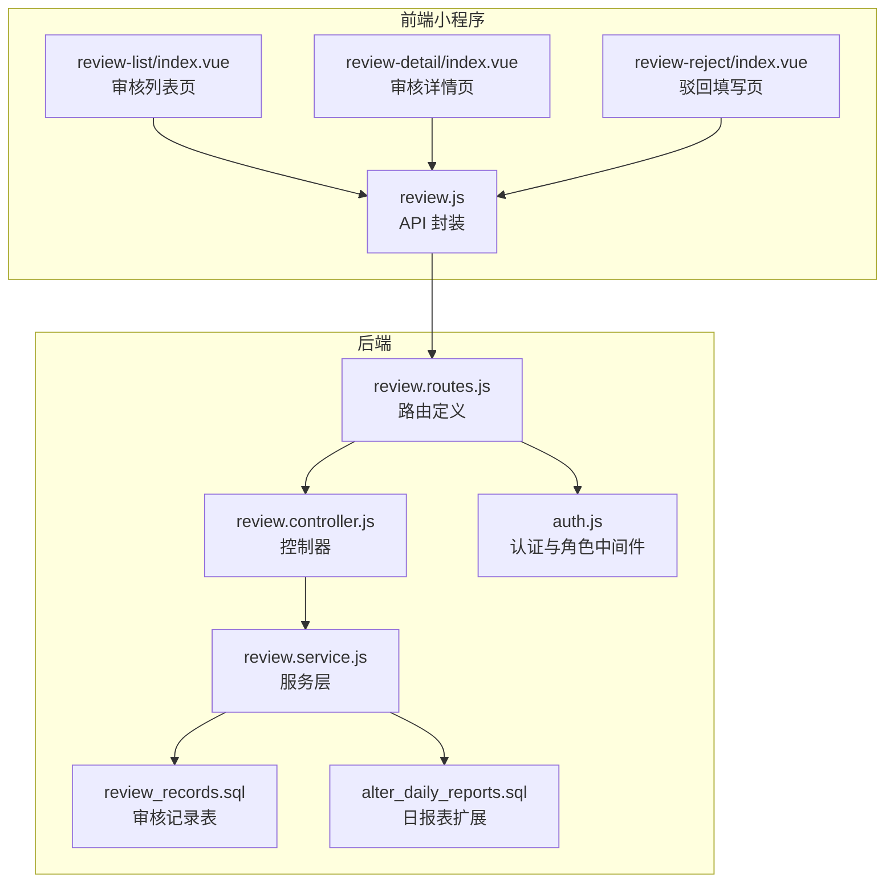
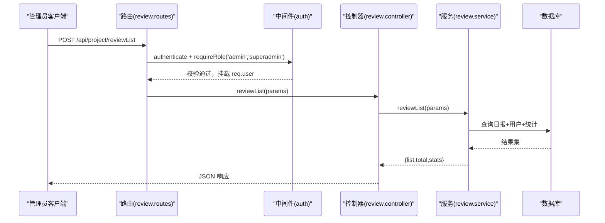
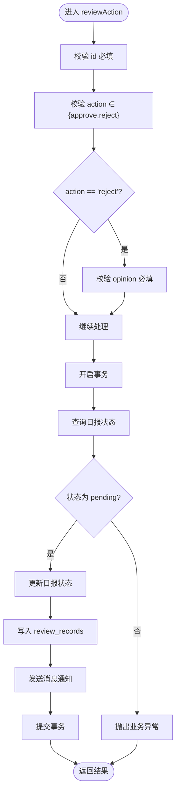
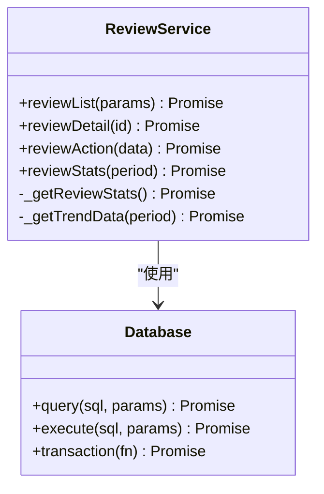
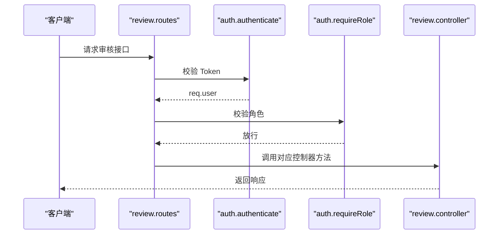
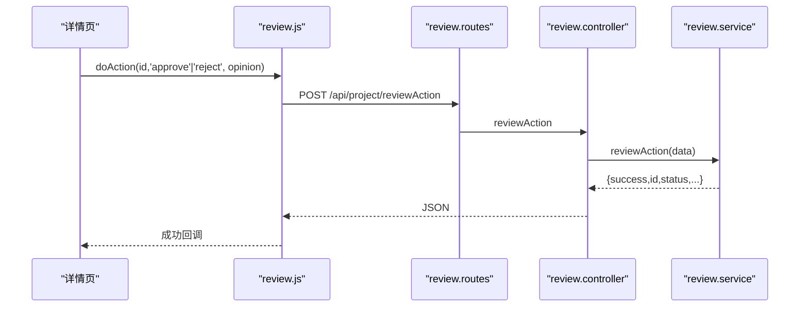
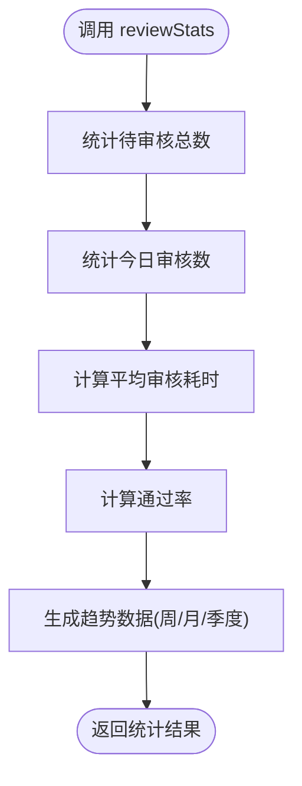
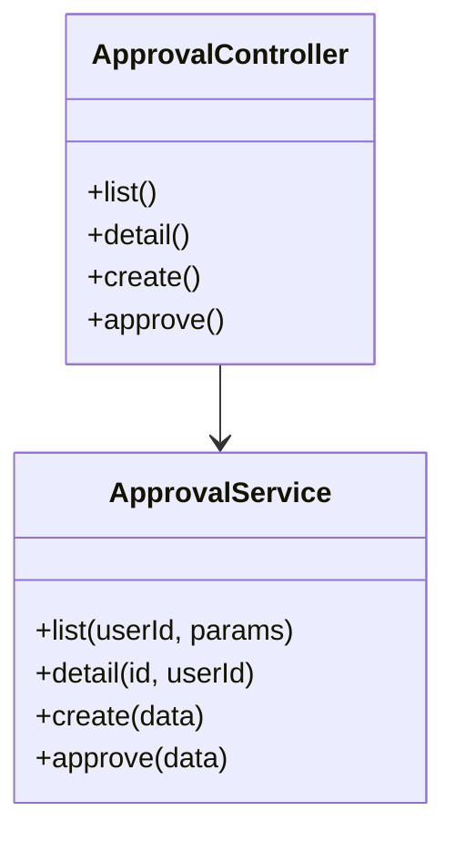
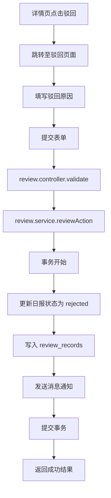
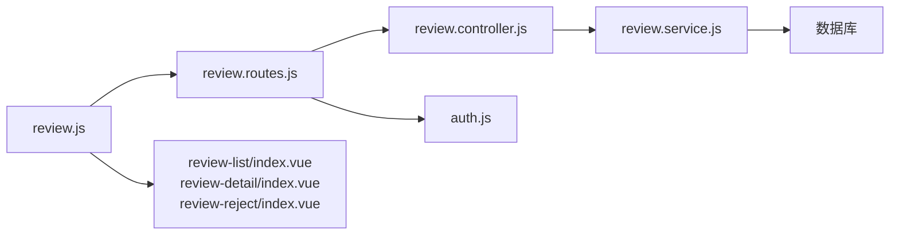

# 审核管理模块

<cite>
**本文引用的文件**
- [review.controller.js](file://backend/src/features/controllers/review.controller.js)
- [review.service.js](file://backend/src/features/services/review.service.js)
- [review.routes.js](file://backend/src/features/routes/review.routes.js)
- [auth.js](file://backend/src/common/middleware/auth.js)
- [review_records.sql](file://backend/scripts/review_records.sql)
- [alter_daily_reports.sql](file://backend/scripts/alter_daily_reports.sql)
- [review.js](file://miniapp/src/services/modules/review.js)
- [review-list/index.vue](file://miniapp/src/pages/admin/review-list/index.vue)
- [review-detail/index.vue](file://miniapp/src/pages/admin/review-detail/index.vue)
- [review-reject/index.vue](file://miniapp/src/pages/admin/review-reject/index.vue)
- [stats.controller.js](file://backend/src/features/controllers/stats.controller.js)
- [stats.service.js](file://backend/src/features/services/stats.service.js)
- [approval.controller.js](file://backend/src/core/controllers/approval.controller.js)
- [approval.service.js](file://backend/src/core/services/approval.service.js)
</cite>

## 更新摘要
**所做更改**
- 新增审核服务、审核控制器、审核路由的完整实现分析
- 详细说明拒绝处理功能的完整流程和实现细节
- 更新前端页面交互，包括驳回页面的完整实现
- 增强审核统计功能的技术实现说明
- 完善审批流程与审核流程的区别说明

## 目录
1. [简介](#简介)
2. [项目结构](#项目结构)
3. [核心组件](#核心组件)
4. [架构概览](#架构概览)
5. [详细组件分析](#详细组件分析)
6. [依赖分析](#依赖分析)
7. [性能考虑](#性能考虑)
8. [故障排查指南](#故障排查指南)
9. [结论](#结论)
10. [附录](#附录)

## 简介
本文件面向"智慧办公助手 OA 系统"的审核管理模块，系统性梳理管理员审核功能的完整实现，包括：
- 审核列表管理：分页、筛选、统计信息
- 审核详情查看：日报详情与审核记录
- 审核操作处理：通过/驳回、意见校验、消息通知
- 权限控制：基于 JWT 的登录认证与管理员/超级管理员角色校验
- 流程配置与历史：review_records 审核记录表支撑流程可追溯
- 统计分析：待审核数、今日审核数、平均审核耗时、通过率与趋势

同时覆盖前后端对接 API、前端页面交互与工作流实现要点，并提供可复用的代码片段路径，便于二次开发与扩展。

## 项目结构
审核管理模块由后端控制器、服务层、路由与中间件，以及前端页面与 API 封装组成，遵循"控制器-服务-数据访问-中间件"的分层设计。

**图表来源**
- [review.routes.js:13-23](file://backend/src/features/routes/review.routes.js#L13-L23)
- [review.controller.js:15-127](file://backend/src/features/controllers/review.controller.js#L15-L127)
- [review.service.js:33-137](file://backend/src/features/services/review.service.js#L33-L137)
- [auth.js:14-80](file://backend/src/common/middleware/auth.js#L14-L80)
- [review_records.sql:8-19](file://backend/scripts/review_records.sql#L8-L19)
- [alter_daily_reports.sql:7-28](file://backend/scripts/alter_daily_reports.sql#L7-L28)

**章节来源**
- [review.routes.js:13-23](file://backend/src/features/routes/review.routes.js#L13-L23)
- [review.controller.js:15-127](file://backend/src/features/controllers/review.controller.js#L15-L127)
- [review.service.js:33-137](file://backend/src/features/services/review.service.js#L33-L137)
- [auth.js:14-80](file://backend/src/common/middleware/auth.js#L14-L80)
- [review_records.sql:8-19](file://backend/scripts/review_records.sql#L8-L19)
- [alter_daily_reports.sql:7-28](file://backend/scripts/alter_daily_reports.sql#L7-L28)

## 核心组件
- 审核控制器：提供列表、详情、操作、统计接口，负责参数校验与响应封装
- 审核服务：封装 SQL 查询、事务处理、统计计算与消息通知
- 审核路由：绑定控制器方法，应用认证与角色中间件
- 认证与角色中间件：JWT 解析、用户状态校验、角色授权
- 审核记录表：持久化管理员审核动作与意见
- 前端 API 封装与页面：列表、详情、驳回流程的交互实现

关键职责与边界清晰，服务层承担业务规则与数据一致性，控制器仅做参数与响应处理，路由集中管理权限。

**章节来源**
- [review.controller.js:15-127](file://backend/src/features/controllers/review.controller.js#L15-L127)
- [review.service.js:33-137](file://backend/src/features/services/review.service.js#L33-L137)
- [review.routes.js:13-23](file://backend/src/features/routes/review.routes.js#L13-L23)
- [auth.js:14-80](file://backend/src/common/middleware/auth.js#L14-L80)

## 架构概览
审核管理采用"请求-路由-中间件-控制器-服务-数据库"的标准 Express 架构，管理员通过 JWT 登录后，经 requireRole 校验 admin/superadmin 角色，方可访问审核相关接口。

**图表来源**
- [review.routes.js:13-23](file://backend/src/features/routes/review.routes.js#L13-L23)
- [auth.js:14-80](file://backend/src/common/middleware/auth.js#L14-L80)
- [review.controller.js:15-43](file://backend/src/features/controllers/review.controller.js#L15-L43)
- [review.service.js:33-106](file://backend/src/features/services/review.service.js#L33-L106)

## 详细组件分析

### 审核控制器（review.controller.js）
- 审核列表：接收分页、状态、关键词、日期范围，调用服务层返回列表与统计
- 审核详情：校验 id，返回日报详情与最近审核记录
- 审核操作：校验 action（approve/reject）、驳回时校验 opinion，调用服务执行事务
- 审核统计：返回待审核、今日审核、平均耗时、通过率与趋势

**图表来源**
- [review.controller.js:73-105](file://backend/src/features/controllers/review.controller.js#L73-L105)
- [review.service.js:244-314](file://backend/src/features/services/review.service.js#L244-L314)

**章节来源**
- [review.controller.js:15-127](file://backend/src/features/controllers/review.controller.js#L15-L127)

### 审核服务（review.service.js）
- 审核列表：动态拼接 where 条件，LEFT JOIN users 获取用户信息，LIMIT/OFFSET 分页，统计 pending/todayReviewed/avgTime
- 审核详情：查询日报与用户信息，查询 review_records 获取最近审核记录，组装返回
- 审核操作：事务内更新 daily_reports.status，写入 review_records，向提交人发送消息
- 审核统计：计算 totalPending、todayReviewed、avgReviewTime、approvalRate、趋势数据

**图表来源**
- [review.service.js:33-137](file://backend/src/features/services/review.service.js#L33-L137)
- [review.service.js:244-314](file://backend/src/features/services/review.service.js#L244-L314)
- [review.service.js:322-368](file://backend/src/features/services/review.service.js#L322-L368)

**章节来源**
- [review.service.js:33-137](file://backend/src/features/services/review.service.js#L33-L137)
- [review.service.js:244-314](file://backend/src/features/services/review.service.js#L244-L314)
- [review.service.js:322-368](file://backend/src/features/services/review.service.js#L322-L368)

### 审核路由与权限（review.routes.js + auth.js）
- 路由：/api/project/reviewList、/api/project/reviewDetail、/api/project/reviewAction、/api/project/reviewStats
- 中间件：authenticate 提取并校验 JWT，requireRole 校验 admin/superadmin

**图表来源**
- [review.routes.js:13-23](file://backend/src/features/routes/review.routes.js#L13-L23)
- [auth.js:14-80](file://backend/src/common/middleware/auth.js#L14-L80)

**章节来源**
- [review.routes.js:13-23](file://backend/src/features/routes/review.routes.js#L13-L23)
- [auth.js:14-80](file://backend/src/common/middleware/auth.js#L14-L80)

### 前端交互（小程序）
- API 封装：review.js 对应 reviewList/reviewDetail/reviewAction/reviewStats
- 列表页：支持 tab 切换（待审核/已通过/已驳回）、下拉刷新、上拉加载
- 详情页：显示日报内容与审核记录；待审核时提供通过/驳回操作
- 驳回页：输入驳回原因并提交

**图表来源**
- [review.js:4-28](file://miniapp/src/services/modules/review.js#L4-L28)
- [review.routes.js:19-20](file://backend/src/features/routes/review.routes.js#L19-L20)
- [review.controller.js:73-105](file://backend/src/features/controllers/review.controller.js#L73-L105)
- [review.service.js:244-314](file://backend/src/features/services/review.service.js#L244-L314)

**章节来源**
- [review.js:4-28](file://miniapp/src/services/modules/review.js#L4-L28)
- [review-list/index.vue:133-163](file://miniapp/src/pages/admin/review-list/index.vue#L133-L163)
- [review-detail/index.vue:111-158](file://miniapp/src/pages/admin/review-detail/index.vue#L111-L158)
- [review-reject/index.vue:74-89](file://miniapp/src/pages/admin/review-reject/index.vue#L74-L89)

### 审核统计与报表（stats.controller.js + stats.service.js）
- 审核统计：返回 totalPending、todayReviewed、avgReviewTime、approvalRate、trendList
- 首页统计：admin 返回 reviewCount（待审核日报数），employee 返回 submitCount（待提交日报数）

**图表来源**
- [stats.controller.js:68-73](file://backend/src/features/controllers/stats.controller.js#L68-L73)
- [stats.service.js:276-301](file://backend/src/features/services/stats.service.js#L276-L301)
- [review.service.js:322-368](file://backend/src/features/services/review.service.js#L322-L368)

**章节来源**
- [stats.controller.js:68-73](file://backend/src/features/controllers/stats.controller.js#L68-L73)
- [stats.service.js:276-301](file://backend/src/features/services/stats.service.js#L276-L301)

### 与审批流程的关系（approval.controller.js + approval.service.js）
- 审批流程（approval.*）与审核（review.*）分别独立，前者面向多节点审批流，后者面向日报的管理员审核
- 审批服务提供创建、审批、详情、列表等能力，支持紧急、抄送、节点流转等特性

**图表来源**
- [approval.controller.js:15-122](file://backend/src/core/controllers/approval.controller.js#L15-L122)
- [approval.service.js:84-132](file://backend/src/core/services/approval.service.js#L84-L132)
- [approval.service.js:267-356](file://backend/src/core/services/approval.service.js#L267-L356)

**章节来源**
- [approval.controller.js:15-122](file://backend/src/core/controllers/approval.controller.js#L15-L122)
- [approval.service.js:84-132](file://backend/src/core/services/approval.service.js#L84-L132)
- [approval.service.js:267-356](file://backend/src/core/services/approval.service.js#L267-L356)

### 拒绝处理功能详解
审核模块的拒绝处理功能实现了完整的驳回流程，包括前端页面交互和后端服务处理：

#### 前端实现
- **驳回页面**：review-reject/index.vue 提供专门的驳回填写界面
- **表单验证**：限制最大字符数 500，实时显示字数统计
- **导航集成**：从详情页跳转至驳回页面，传递目标用户和项目信息

#### 后端实现
- **参数校验**：reject 操作必须提供 opinion 参数
- **事务处理**：确保状态更新和记录写入的一致性
- **消息通知**：自动发送通知给日报提交者

**图表来源**
- [review.controller.js:73-105](file://backend/src/features/controllers/review.controller.js#L73-L105)
- [review.service.js:244-314](file://backend/src/features/services/review.service.js#L244-L314)
- [review-reject/index.vue:74-89](file://miniapp/src/pages/admin/review-reject/index.vue#L74-L89)

**章节来源**
- [review.controller.js:73-105](file://backend/src/features/controllers/review.controller.js#L73-L105)
- [review.service.js:244-314](file://backend/src/features/services/review.service.js#L244-L314)
- [review-reject/index.vue:74-89](file://miniapp/src/pages/admin/review-reject/index.vue#L74-L89)

## 依赖分析
- 控制器依赖服务层，服务层依赖数据库连接与错误类型
- 路由依赖中间件（认证与角色），控制器依赖响应工具
- 前端 API 封装依赖通用请求模块，页面依赖用户状态与导航

**图表来源**
- [review.controller.js:15-127](file://backend/src/features/controllers/review.controller.js#L15-L127)
- [review.service.js:33-137](file://backend/src/features/services/review.service.js#L33-L137)
- [review.routes.js:13-23](file://backend/src/features/routes/review.routes.js#L13-L23)
- [auth.js:14-80](file://backend/src/common/middleware/auth.js#L14-L80)
- [review.js:4-28](file://miniapp/src/services/modules/review.js#L4-L28)

**章节来源**
- [review.controller.js:15-127](file://backend/src/features/controllers/review.controller.js#L15-L127)
- [review.service.js:33-137](file://backend/src/features/services/review.service.js#L33-L137)
- [review.routes.js:13-23](file://backend/src/features/routes/review.routes.js#L13-L23)
- [auth.js:14-80](file://backend/src/common/middleware/auth.js#L14-L80)
- [review.js:4-28](file://miniapp/src/services/modules/review.js#L4-L28)

## 性能考虑
- 分页与索引：列表查询使用 LIMIT/OFFSET，建议确保 daily_reports 的 status、report_date、user_id+report_date 等索引生效
- 统计查询：统计接口涉及多表聚合，建议在 review_records 上建立 idx_created_at、idx_report_id 等索引
- 事务与锁：审核操作使用事务保证一致性，避免并发重复审核
- 前端缓存：列表页支持下拉刷新与上拉加载，减少重复请求

## 故障排查指南
- 认证失败：检查 Authorization 头是否以 Bearer 开头，Token 是否过期或无效
- 权限不足：确认用户角色为 admin 或 superadmin
- 参数校验：id/action/opinion 缺失或非法会触发业务异常
- 重复审核：日报状态非 pending 时拒绝操作
- 数据不存在：查询不到日报或记录时抛出 NotFoundError
- 驳回失败：检查 opinion 参数是否为空，确保提供详细的驳回原因

**章节来源**
- [auth.js:14-56](file://backend/src/common/middleware/auth.js#L14-L56)
- [review.controller.js:78-92](file://backend/src/features/controllers/review.controller.js#L78-L92)
- [review.service.js:263-272](file://backend/src/features/services/review.service.js#L263-L272)

## 结论
审核管理模块围绕管理员审核工作流，提供了从列表、详情到操作、统计的完整闭环。通过严格的权限控制、事务保障与消息通知机制，确保审核过程可追踪、可审计。前后端协作清晰，接口与页面职责明确，具备良好的扩展性与维护性。新增的拒绝处理功能进一步完善了审核流程，为用户提供完整的审核体验。

## 附录

### API 接口清单（管理员）
- 审核列表
  - 方法：POST
  - 路径：/api/project/reviewList
  - 权限：admin/superadmin
  - 参数：page、pageSize、status、keyword、startDate、endDate
  - 返回：list、total、page、pageSize、totalPages、stats
  - 实现参考：[review.controller.js:15-43](file://backend/src/features/controllers/review.controller.js#L15-L43)、[review.service.js:33-106](file://backend/src/features/services/review.service.js#L33-L106)

- 审核详情
  - 方法：POST
  - 路径：/api/project/reviewDetail
  - 权限：admin/superadmin
  - 参数：id
  - 返回：日报详情与最近审核记录
  - 实现参考：[review.controller.js:49-67](file://backend/src/features/controllers/review.controller.js#L49-L67)、[review.service.js:148-230](file://backend/src/features/services/review.service.js#L148-L230)

- 审核操作（通过/驳回）
  - 方法：POST
  - 路径：/api/project/reviewAction
  - 权限：admin/superadmin
  - 参数：id、action（approve/reject）、opinion（驳回时必填）
  - 返回：操作结果与状态
  - 实现参考：[review.controller.js:73-105](file://backend/src/features/controllers/review.controller.js#L73-L105)、[review.service.js:244-314](file://backend/src/features/services/review.service.js#L244-L314)

- 审核统计
  - 方法：POST
  - 路径：/api/project/reviewStats
  - 权限：admin/superadmin
  - 参数：period（week/month/quarter，默认 week）
  - 返回：totalPending、todayReviewed、avgReviewTime、approvalRate、trendList
  - 实现参考：[review.controller.js:111-121](file://backend/src/features/controllers/review.controller.js#L111-L121)、[review.service.js:322-368](file://backend/src/features/services/review.service.js#L322-L368)

### 数据模型与索引
- 审核记录表 review_records
  - 主键：id
  - 关联：report_id → daily_reports.id，reviewer_id → users.id
  - 索引：idx_report_id、idx_reviewer_id、idx_created_at
  - 参考：[review_records.sql:8-19](file://backend/scripts/review_records.sql#L8-L19)

- 日报表扩展（daily_reports）
  - 新增字段：project、area、today_work_type、tomorrow_work_type、work_content、workers、machine_model、worker_count、required_qty、completed_qty、remark、entry_date、initial_biz_trip_date、related_party、personal_biz_trip_days、files、updated_at
  - 索引：idx_status、idx_report_date、idx_user_date
  - 参考：[alter_daily_reports.sql:7-28](file://backend/scripts/alter_daily_reports.sql#L7-L28)

### 前端页面与交互
- 审核列表页：tab 切换、分页加载、统计联动
  - 参考：[review-list/index.vue:133-163](file://miniapp/src/pages/admin/review-list/index.vue#L133-L163)
- 审核详情页：显示日报与审核记录，提供通过/驳回入口
  - 参考：[review-detail/index.vue:111-158](file://miniapp/src/pages/admin/review-detail/index.vue#L111-L158)
- 驳回页：输入原因并提交
  - 参考：[review-reject/index.vue:74-89](file://miniapp/src/pages/admin/review-reject/index.vue#L74-L89)
- API 封装
  - 参考：[review.js:4-28](file://miniapp/src/services/modules/review.js#L4-L28)

### 批量审核与撤销（扩展建议）
- 批量审核：可在前端收集多个 id，后端增加批量 reviewAction 接口，服务层循环执行并返回汇总结果
- 审核撤销：若需支持撤销，可在 review_records 中新增撤销记录，并在 daily_reports 回滚状态，同时发送撤销通知

### 拒绝处理功能详细实现
- **前端实现**：驳回页面提供详细的表单验证和用户反馈
- **后端实现**：严格的参数校验和事务处理确保数据一致性
- **用户体验**：完整的审核流程，包括通过和驳回两种操作选项

**章节来源**
- [review-reject/index.vue:74-89](file://miniapp/src/pages/admin/review-reject/index.vue#L74-L89)
- [review.service.js:244-314](file://backend/src/features/services/review.service.js#L244-L314)