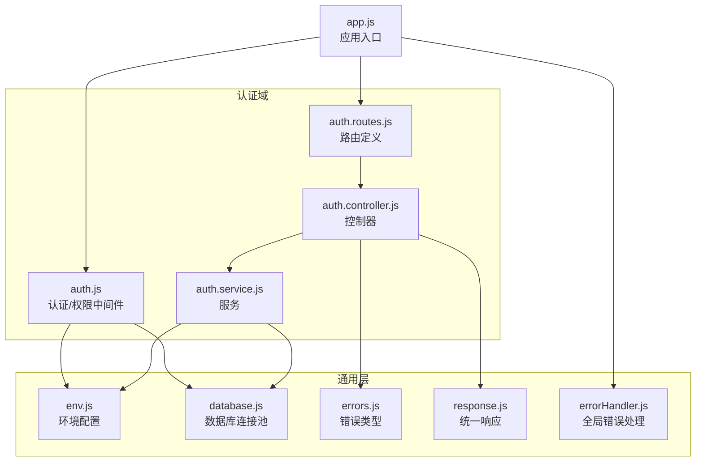
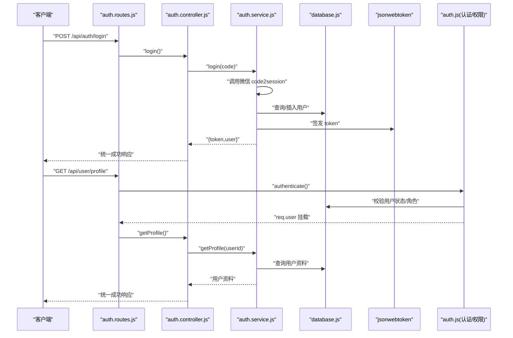
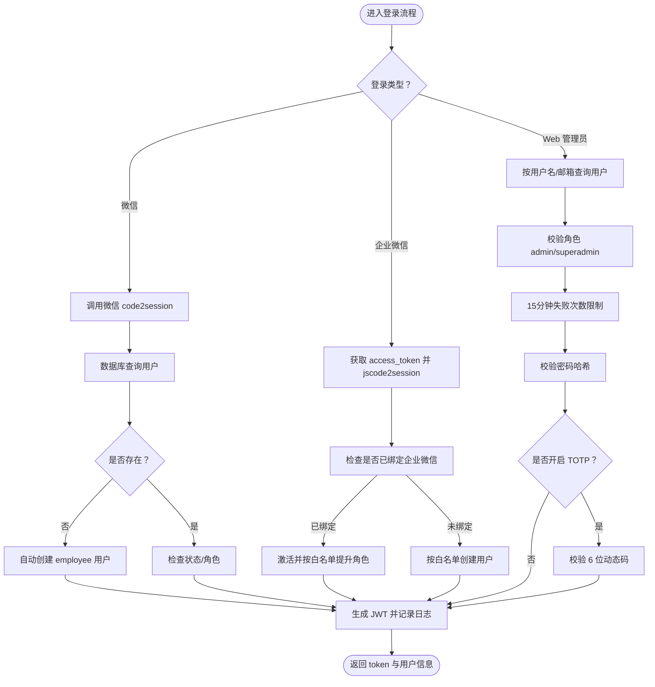
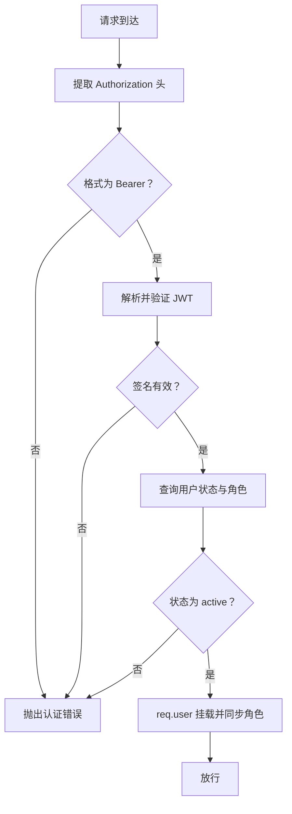
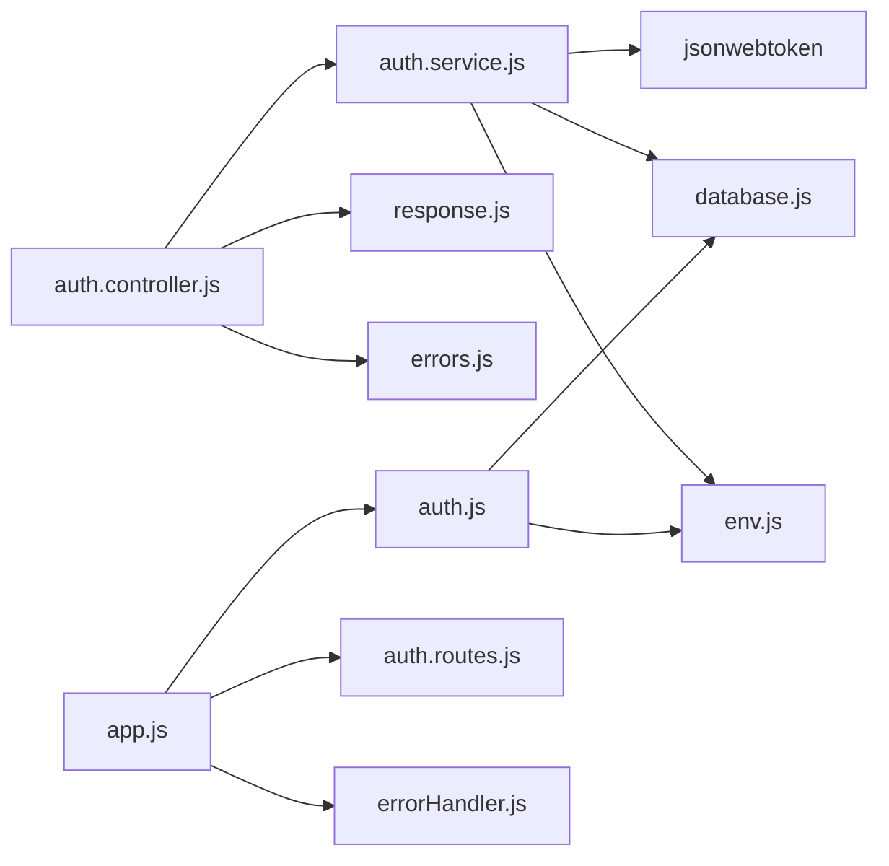

# 认证授权模块

<cite>
**本文引用的文件**
- [backend/src/auth/auth.controller.js](file://backend/src/auth/auth.controller.js)
- [backend/src/auth/auth.service.js](file://backend/src/auth/auth.service.js)
- [backend/src/auth/auth.routes.js](file://backend/src/auth/auth.routes.js)
- [backend/src/common/middleware/auth.js](file://backend/src/common/middleware/auth.js)
- [backend/src/common/config/env.js](file://backend/src/common/config/env.js)
- [backend/src/common/config/database.js](file://backend/src/common/config/database.js)
- [backend/src/common/utils/errors.js](file://backend/src/common/utils/errors.js)
- [backend/src/common/utils/response.js](file://backend/src/common/utils/response.js)
- [backend/src/common/middleware/errorHandler.js](file://backend/src/common/middleware/errorHandler.js)
- [backend/src/app.js](file://backend/src/app.js)
- [backend/package.json](file://backend/package.json)
</cite>

## 目录
1. [简介](#简介)
2. [项目结构](#项目结构)
3. [核心组件](#核心组件)
4. [架构总览](#架构总览)
5. [详细组件分析](#详细组件分析)
6. [依赖关系分析](#依赖关系分析)
7. [性能考量](#性能考量)
8. [故障排查指南](#故障排查指南)
9. [结论](#结论)
10. [附录](#附录)

## 简介
本文件为"智慧办公助手 OA 系统"的认证授权模块提供系统化、可操作的技术文档。内容覆盖基于 JWT 的多用户认证机制，包括微信小程序登录、企业微信登录、Web 管理员登录等多入口登录方式；认证中间件工作流程、Token 生成与验证机制、权限控制策略与安全配置；以及认证相关 API 的端点、请求参数、响应格式与错误处理。同时给出面向前端与后端开发者的最佳实践与排障建议。

## 项目结构
认证授权模块位于后端工程的独立子域中，采用"控制器-服务-中间件-配置-工具"分层组织，路由集中于 auth 路由文件，认证中间件与权限中间件在通用中间件目录中实现，配置与数据库连接在公共配置模块中集中管理。

**图表来源**
- [backend/src/auth/auth.routes.js:1-38](file://backend/src/auth/auth.routes.js#L1-L38)
- [backend/src/auth/auth.controller.js:1-162](file://backend/src/auth/auth.controller.js#L1-L162)
- [backend/src/auth/auth.service.js:1-414](file://backend/src/auth/auth.service.js#L1-L414)
- [backend/src/common/middleware/auth.js:1-83](file://backend/src/common/middleware/auth.js#L1-L83)
- [backend/src/common/config/env.js:1-118](file://backend/src/common/config/env.js#L1-L118)
- [backend/src/common/config/database.js:1-222](file://backend/src/common/config/database.js#L1-L222)
- [backend/src/common/utils/errors.js:1-99](file://backend/src/common/utils/errors.js#L1-L99)
- [backend/src/common/utils/response.js:1-49](file://backend/src/common/utils/response.js#L1-L49)
- [backend/src/common/middleware/errorHandler.js:1-28](file://backend/src/common/middleware/errorHandler.js#L1-L28)
- [backend/src/app.js:1-207](file://backend/src/app.js#L1-L207)

**章节来源**
- [backend/src/auth/auth.routes.js:1-38](file://backend/src/auth/auth.routes.js#L1-L38)
- [backend/src/auth/auth.controller.js:1-162](file://backend/src/auth/auth.controller.js#L1-L162)
- [backend/src/auth/auth.service.js:1-414](file://backend/src/auth/auth.service.js#L1-L414)
- [backend/src/common/middleware/auth.js:1-83](file://backend/src/common/middleware/auth.js#L1-L83)
- [backend/src/app.js:102-124](file://backend/src/app.js#L102-L124)

## 核心组件
- 路由层：集中定义认证相关端点，包含微信登录、企业微信登录、Web 管理员登录、用户资料查询与更新、TOTP 二次验证管理、企业微信 OAuth 配置与回调等。
- 控制器层：负责参数校验、调用服务层、封装统一响应与错误处理。
- 服务层：实现具体业务逻辑，包括第三方登录（微信/企业微信）、管理员登录（含密码与 TOTP 校验）、用户资料查询与更新、账号关联与 TOTP 管理。
- 中间件层：提供 JWT 认证与角色鉴权能力，并在每次请求时校验用户状态与角色一致性。
- 配置层：集中管理 JWT 密钥、过期时间、微信与企业微信参数、数据库与 Redis 连接等。
- 工具层：统一错误类型、统一响应格式、全局错误处理中间件。

**章节来源**
- [backend/src/auth/auth.routes.js:7-35](file://backend/src/auth/auth.routes.js#L7-L35)
- [backend/src/auth/auth.controller.js:11-161](file://backend/src/auth/auth.controller.js#L11-L161)
- [backend/src/auth/auth.service.js:11-414](file://backend/src/auth/auth.service.js#L11-L414)
- [backend/src/common/middleware/auth.js:8-82](file://backend/src/common/middleware/auth.js#L8-L82)
- [backend/src/common/config/env.js:89-107](file://backend/src/common/config/env.js#L89-L107)
- [backend/src/common/utils/errors.js:5-89](file://backend/src/common/utils/errors.js#L5-L89)
- [backend/src/common/utils/response.js:5-46](file://backend/src/common/utils/response.js#L5-L46)
- [backend/src/common/middleware/errorHandler.js:8-25](file://backend/src/common/middleware/errorHandler.js#L8-L25)

## 架构总览
认证授权整体流程如下：客户端发起登录请求，控制器进行参数校验并调用服务层；服务层完成第三方平台交互或数据库校验，签发 JWT 并记录日志；后续请求由认证中间件解析并验证 Token，同时校验用户状态与角色；权限中间件根据角色限制访问。

**图表来源**
- [backend/src/auth/auth.routes.js:17-35](file://backend/src/auth/auth.routes.js#L17-L35)
- [backend/src/auth/auth.controller.js:16-43](file://backend/src/auth/auth.controller.js#L16-L43)
- [backend/src/auth/auth.service.js:22-87](file://backend/src/auth/auth.service.js#L22-L87)
- [backend/src/common/middleware/auth.js:14-56](file://backend/src/common/middleware/auth.js#L14-L56)
- [backend/src/common/config/database.js:65-109](file://backend/src/common/config/database.js#L65-L109)

## 详细组件分析

### 认证控制器（Controllers）
- 职责：接收请求、参数校验、调用服务、封装统一响应、传递错误给全局中间件。
- 关键端点：
  - 微信登录：POST /api/auth/login（code 必填）
  - 企业微信登录：POST /api/auth/qywx-login（code 必填）
  - Web 管理员登录：POST /api/auth/admin/login（account/password 必填，可选 totp）
  - 管理员关联微信与企业微信账号：POST /api/auth/link-qywx（需管理员角色）
  - 用户资料查询：GET /api/user/profile（需认证）
  - 用户资料更新：PUT /api/user/profile（需认证）
  - TOTP 二次验证管理：POST /api/auth/totp-setup、/api/auth/totp-enable、/api/auth/totp-disable（需管理员角色）
  - 企业微信 OAuth：GET /api/auth/qywx-config（获取 corpid）、GET /api/auth/qywx-callback（OAuth 回调）

**章节来源**
- [backend/src/auth/auth.controller.js:13-159](file://backend/src/auth/auth.controller.js#L13-L159)

### 认证服务（Services）
- 微信登录流程要点：
  - 使用 code 调用微信 jscode2session 获取 openid。
  - 若用户不存在则自动创建为 employee 且状态 active。
  - 对 pending 状态自动激活，disabled 状态禁止登录。
  - 生成 JWT 并记录登录日志。
- 企业微信登录流程要点：
  - 优先从配置读取 corpId/secret，否则报错提示使用微信登录。
  - 获取 access_token 后调用 jscode2session 获取 userid。
  - 若已有绑定则激活并按白名单自动提升为 admin。
  - 新用户按白名单决定初始角色为 admin 或 employee。
  - 生成 JWT 并记录日志。
- 管理员登录流程要点：
  - 支持用户名/邮箱登录，仅 admin/superadmin 可登录管理后台。
  - 校验账号状态（pending/disabled）。
  - 15 分钟内最多 5 次失败尝试，超过则锁定。
  - 校验密码哈希。
  - 若开启 TOTP，则要求提供 6 位动态码。
  - 生成 JWT 并记录日志。
- 用户资料：
  - 查询与更新均排除敏感字段（如 openid）。
  - 更新字段白名单：昵称、头像、手机、邮箱、部门、职位；昵称同步更新 user_name。
- 账号关联与 TOTP：
  - 管理员将微信 openid 与企业微信 userid 关联。
  - 生成 TOTP 密钥、生成二维码链接；启用/禁用 TOTP。

**图表来源**
- [backend/src/auth/auth.service.js:22-364](file://backend/src/auth/auth.service.js#L22-L364)

**章节来源**
- [backend/src/auth/auth.service.js:16-364](file://backend/src/auth/auth.service.js#L16-L364)

### 认证中间件（Middleware）
- authenticate：
  - 从 Authorization 头提取 Bearer Token。
  - 使用 JWT 密钥验证签名与有效期。
  - 二次校验：用户必须仍为 active，若角色变化则以数据库为准。
  - 通过后将用户信息挂载到 req.user。
- requireRole：
  - 校验 req.user 是否存在且具备所需角色之一，否则返回 403。

**图表来源**
- [backend/src/common/middleware/auth.js:14-56](file://backend/src/common/middleware/auth.js#L14-L56)

**章节来源**
- [backend/src/common/middleware/auth.js:8-82](file://backend/src/common/middleware/auth.js#L8-L82)

### 路由与权限控制
- 路由集中定义在 auth.routes.js，对需要认证的端点统一挂载 authenticate 中间件；对管理员专属功能挂载 requireRole('admin','superadmin')。
- 企业微信 OAuth 配置与回调无需认证，便于前端初始化与回调处理。

**章节来源**
- [backend/src/auth/auth.routes.js:7-35](file://backend/src/auth/auth.routes.js#L7-L35)

### 配置与安全
- JWT 配置：密钥与过期时间来自环境变量，默认 7 天。
- 微信与企业微信参数：appid、secret、corpid、adminUserIds 白名单。
- 安全中间件：Helmet、CORS、全局限流与登录端点限流。
- 全局错误处理：统一返回 HTTP 200，通过 body.code 区分业务成功/失败。

**章节来源**
- [backend/src/common/config/env.js:89-107](file://backend/src/common/config/env.js#L89-L107)
- [backend/src/app.js:29-65](file://backend/src/app.js#L29-L65)
- [backend/src/common/middleware/errorHandler.js:8-25](file://backend/src/common/middleware/errorHandler.js#L8-L25)

## 依赖关系分析
- 认证控制器依赖认证服务与统一响应工具。
- 认证服务依赖 JWT、数据库连接池、环境配置、第三方 HTTP 客户端与日志工具。
- 认证中间件依赖 JWT 与数据库连接池。
- 应用入口集中注册路由、安全中间件、限流与全局错误处理。

**图表来源**
- [backend/src/auth/auth.controller.js:3-5](file://backend/src/auth/auth.controller.js#L3-L5)
- [backend/src/auth/auth.service.js:3-9](file://backend/src/auth/auth.service.js#L3-L9)
- [backend/src/common/middleware/auth.js:3-6](file://backend/src/common/middleware/auth.js#L3-L6)
- [backend/src/app.js:102-140](file://backend/src/app.js#L102-L140)

**章节来源**
- [backend/src/app.js:102-140](file://backend/src/app.js#L102-L140)
- [backend/package.json:16-35](file://backend/package.json#L16-L35)

## 性能考量
- 数据库连接池：OA 主库与旧库分别配置连接池，参数化查询与执行减少 SQL 注入风险并提升性能。
- 限流策略：全局限流与登录端点限流结合，避免恶意爆破与资源滥用。
- Token 过期：合理设置过期时间，建议前端在过期前进行静默刷新或引导重新登录。
- 日志与监控：统一日志输出，便于定位性能瓶颈与异常。

## 故障排查指南
- 认证失败（401）：检查 Authorization 头格式、Token 是否过期、用户状态是否 active。
- 权限不足（403）：确认用户角色是否满足 requireRole 要求。
- 登录失败频繁（429）：登录端点限流触发，等待 15 分钟或降低请求频率。
- 业务错误（200 + code）：查看错误码与消息，常见如参数缺失、账号状态异常、第三方平台返回错误等。
- 数据库连接问题：检查数据库连接池配置与网络连通性。
- 环境变量缺失：启动前校验必需环境变量，确保 JWT_SECRET、微信/企业微信参数齐全。

**章节来源**
- [backend/src/common/utils/errors.js:26-89](file://backend/src/common/utils/errors.js#L26-L89)
- [backend/src/common/middleware/errorHandler.js:8-25](file://backend/src/common/middleware/errorHandler.js#L8-L25)
- [backend/src/common/config/env.js:13-41](file://backend/src/common/config/env.js#L13-L41)
- [backend/src/common/config/database.js:65-109](file://backend/src/common/config/database.js#L65-L109)
- [backend/src/app.js:47-65](file://backend/src/app.js#L47-L65)

## 结论
本认证授权模块以 JWT 为核心，结合微信与企业微信第三方登录、Web 管理员登录与 TOTP 二次验证，形成多入口、强安全、可扩展的认证体系。通过统一的中间件与错误处理机制，保证了系统的安全性与可观测性。建议在生产环境中强化 Token 刷新策略、完善审计日志与告警机制，并持续优化限流与防爆破策略。

## 附录

### API 接口清单与说明
- 微信登录
  - 方法与路径：POST /api/auth/login
  - 请求参数：code（必填）
  - 响应：token、user（不含敏感字段）
  - 错误：参数缺失、第三方调用失败、业务错误
- 企业微信登录
  - 方法与路径：POST /api/auth/qywx-login
  - 请求参数：code（必填）
  - 响应：token、user（按白名单自动提升角色）
  - 错误：未配置企业微信、第三方调用失败、业务错误
- Web 管理员登录
  - 方法与路径：POST /api/auth/admin/login
  - 请求参数：account（用户名/邮箱，必填）、password（必填）、totp（可选，若启用 TOTP）
  - 响应：token、user（管理员信息）
  - 错误：账户不存在/密码错误、非管理员角色、账号状态异常、频繁失败、TOTP 校验失败
- 获取用户资料
  - 方法与路径：GET /api/user/profile
  - 请求头：Authorization: Bearer <token>
  - 响应：用户资料（不含敏感字段）
  - 错误：未认证、用户不存在
- 更新用户资料
  - 方法与路径：PUT /api/user/profile
  - 请求头：Authorization: Bearer <token>
  - 请求体：允许字段（昵称、头像、手机、邮箱、部门、职位），昵称可同步更新 user_name
  - 响应：更新后的用户资料
  - 错误：未认证、无更新字段、用户不存在
- 管理员关联微信与企业微信账号
  - 方法与路径：POST /api/auth/link-qywx
  - 请求头：Authorization: Bearer <token>
  - 请求体：openid（必填）、qywxUserId（必填）
  - 响应：关联结果
  - 错误：微信用户不存在、企业微信账号已被绑定、业务错误
- TOTP 二次验证管理
  - 设置密钥与二维码：POST /api/auth/totp-setup（需管理员）
  - 启用 TOTP：POST /api/auth/totp-enable（需管理员，校验验证码）
  - 关闭 TOTP：POST /api/auth/totp-disable（需管理员）
- 企业微信 OAuth
  - 获取 corpid：GET /api/auth/qywx-config
  - 回调处理：GET /api/auth/qywx-callback（前端重定向带 token 或错误信息）

**章节来源**
- [backend/src/auth/auth.controller.js:13-159](file://backend/src/auth/auth.controller.js#L13-L159)
- [backend/src/auth/auth.routes.js:9-29](file://backend/src/auth/auth.routes.js#L9-L29)

### 安全配置要点
- JWT 密钥与过期时间：通过环境变量配置，避免硬编码。
- CORS 与 Helmet：生产环境谨慎放行来源，启用安全头部。
- 登录限流：针对登录端点单独限流，区分成功与失败请求。
- 角色与状态校验：中间件在每次请求校验用户状态与角色一致性。
- 日志与审计：记录登录、失败、资料变更等关键操作，便于追踪。

**章节来源**
- [backend/src/common/config/env.js:89-107](file://backend/src/common/config/env.js#L89-L107)
- [backend/src/app.js:29-65](file://backend/src/app.js#L29-L65)
- [backend/src/common/middleware/auth.js:14-56](file://backend/src/common/middleware/auth.js#L14-L56)