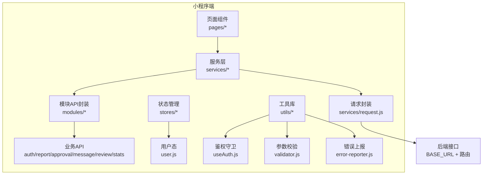
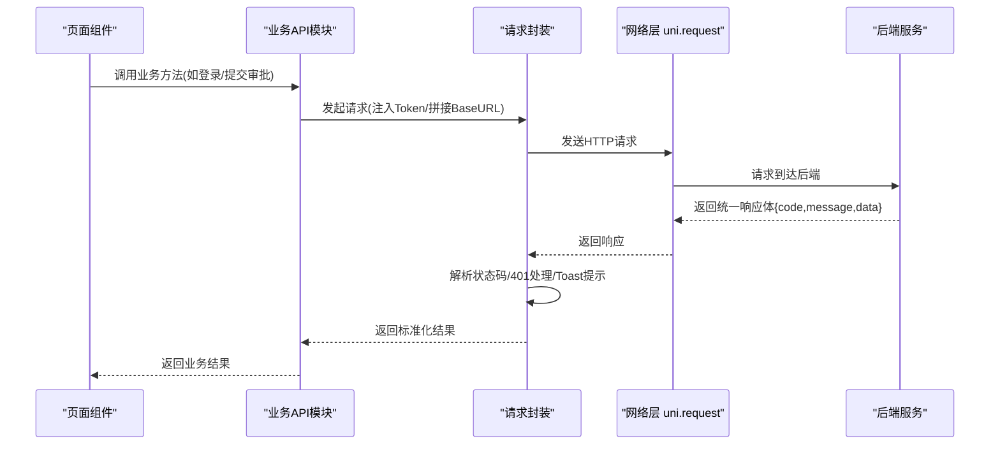
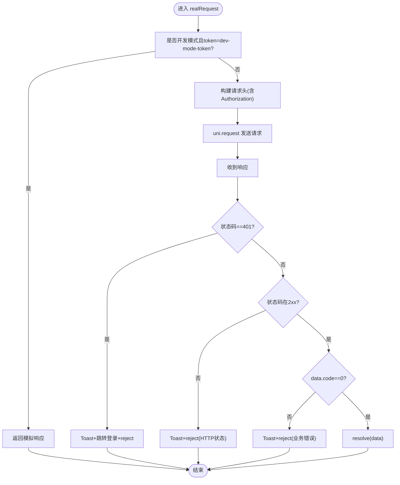
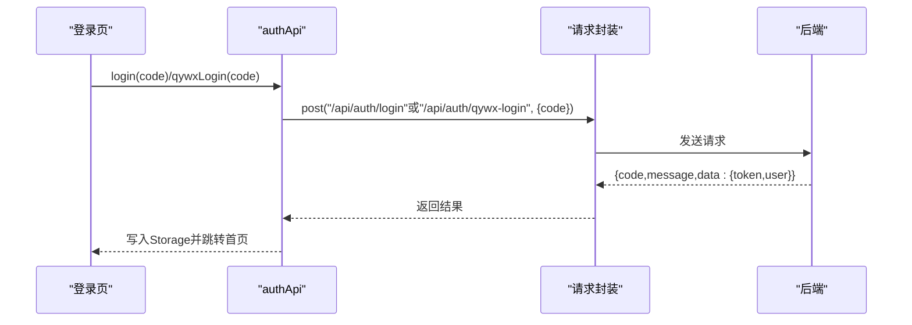
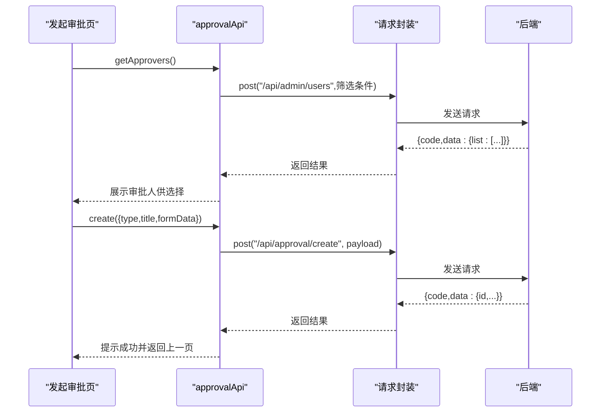
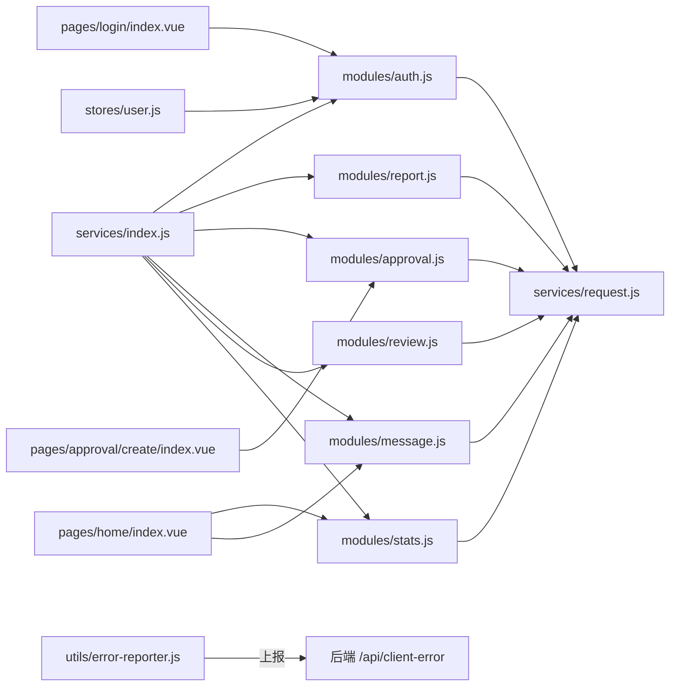

# API 集成

<cite>
**本文引用的文件**
- [miniapp/API-Integration-Guide.md](file://miniapp/API-Integration-Guide.md)
- [miniapp/src/services/request.js](file://miniapp/src/services/request.js)
- [miniapp/src/services/index.js](file://miniapp/src/services/index.js)
- [miniapp/src/services/modules/auth.js](file://miniapp/src/services/modules/auth.js)
- [miniapp/src/services/modules/report.js](file://miniapp/src/services/modules/report.js)
- [miniapp/src/services/modules/approval.js](file://miniapp/src/services/modules/approval.js)
- [miniapp/src/services/modules/message.js](file://miniapp/src/services/modules/message.js)
- [miniapp/src/services/modules/review.js](file://miniapp/src/services/modules/review.js)
- [miniapp/src/services/modules/stats.js](file://miniapp/src/services/modules/stats.js)
- [miniapp/src/stores/user.js](file://miniapp/src/stores/user.js)
- [miniapp/src/composables/useAuth.js](file://miniapp/src/composables/useAuth.js)
- [miniapp/src/utils/error-reporter.js](file://miniapp/src/utils/error-reporter.js)
- [miniapp/src/utils/validator.js](file://miniapp/src/utils/validator.js)
- [miniapp/src/stores/app.js](file://miniapp/src/stores/app.js)
- [miniapp/src/pages/login/index.vue](file://miniapp/src/pages/login/index.vue)
- [miniapp/src/pages/home/index.vue](file://miniapp/src/pages/home/index.vue)
- [miniapp/src/pages/approval/create/index.vue](file://miniapp/src/pages/approval/create/index.vue)
</cite>

## 目录
1. [简介](#简介)
2. [项目结构](#项目结构)
3. [核心组件](#核心组件)
4. [架构总览](#架构总览)
5. [详细组件分析](#详细组件分析)
6. [依赖关系分析](#依赖关系分析)
7. [性能考量](#性能考量)
8. [故障排查指南](#故障排查指南)
9. [结论](#结论)
10. [附录](#附录)

## 简介
本文件面向“智慧办公助手 OA 系统”小程序的前端开发者，系统化梳理 API 集成的设计与实现，覆盖认证服务、审批服务、日报服务、消息与评审统计等模块的接口封装、请求处理机制、响应管理、错误处理与最佳实践。文档同时给出调用示例路径与开发指导，帮助快速、稳定地完成各模块的集成。

## 项目结构
小程序端采用“服务层封装 + 页面组件调用”的分层设计：
- 服务层：统一的请求封装与各业务模块 API 封装
- 状态层：Pinia Store 管理用户态与应用态
- 工具层：鉴权守卫、参数校验、错误上报
- 页面层：业务页面直接消费服务层与状态层

图表来源
- [miniapp/src/services/request.js:1-127](file://miniapp/src/services/request.js#L1-L127)
- [miniapp/src/services/modules/auth.js:1-20](file://miniapp/src/services/modules/auth.js#L1-L20)
- [miniapp/src/services/modules/report.js:1-32](file://miniapp/src/services/modules/report.js#L1-L32)
- [miniapp/src/services/modules/approval.js:1-24](file://miniapp/src/services/modules/approval.js#L1-L24)
- [miniapp/src/services/modules/message.js:1-24](file://miniapp/src/services/modules/message.js#L1-L24)
- [miniapp/src/services/modules/review.js:1-29](file://miniapp/src/services/modules/review.js#L1-L29)
- [miniapp/src/services/modules/stats.js:1-35](file://miniapp/src/services/modules/stats.js#L1-L35)
- [miniapp/src/stores/user.js:1-78](file://miniapp/src/stores/user.js#L1-L78)
- [miniapp/src/composables/useAuth.js:1-26](file://miniapp/src/composables/useAuth.js#L1-L26)
- [miniapp/src/utils/validator.js:1-24](file://miniapp/src/utils/validator.js#L1-L24)
- [miniapp/src/utils/error-reporter.js:1-59](file://miniapp/src/utils/error-reporter.js#L1-L59)

章节来源
- [miniapp/src/services/request.js:1-127](file://miniapp/src/services/request.js#L1-L127)
- [miniapp/src/services/index.js:1-7](file://miniapp/src/services/index.js#L1-L7)

## 核心组件
- 请求封装层：统一处理 BaseURL、Token 注入、401 自动跳转、响应体结构解析与错误提示
- 业务模块 API：按领域拆分，提供语义化方法名，隐藏具体路由细节
- 状态管理：用户信息、角色权限、未读计数等
- 鉴权守卫：页面访问前置校验
- 参数校验：基础字段必填、手机、邮箱、长度校验
- 错误上报：全局错误捕获与上报

章节来源
- [miniapp/src/services/request.js:1-127](file://miniapp/src/services/request.js#L1-L127)
- [miniapp/src/services/modules/auth.js:1-20](file://miniapp/src/services/modules/auth.js#L1-L20)
- [miniapp/src/services/modules/report.js:1-32](file://miniapp/src/services/modules/report.js#L1-L32)
- [miniapp/src/services/modules/approval.js:1-24](file://miniapp/src/services/modules/approval.js#L1-L24)
- [miniapp/src/services/modules/message.js:1-24](file://miniapp/src/services/modules/message.js#L1-L24)
- [miniapp/src/services/modules/review.js:1-29](file://miniapp/src/services/modules/review.js#L1-L29)
- [miniapp/src/services/modules/stats.js:1-35](file://miniapp/src/services/modules/stats.js#L1-L35)
- [miniapp/src/stores/user.js:1-78](file://miniapp/src/stores/user.js#L1-L78)
- [miniapp/src/composables/useAuth.js:1-26](file://miniapp/src/composables/useAuth.js#L1-L26)
- [miniapp/src/utils/validator.js:1-24](file://miniapp/src/utils/validator.js#L1-L24)
- [miniapp/src/utils/error-reporter.js:1-59](file://miniapp/src/utils/error-reporter.js#L1-L59)

## 架构总览
小程序端通过统一请求封装向后端发起 HTTP 请求，后端以统一响应体返回业务结果。页面组件通过服务层 API 与状态层交互，实现认证、审批、日报、消息、评审统计等功能。

图表来源
- [miniapp/src/services/request.js:17-65](file://miniapp/src/services/request.js#L17-L65)
- [miniapp/src/services/modules/auth.js:4-18](file://miniapp/src/services/modules/auth.js#L4-L18)
- [miniapp/src/services/modules/approval.js:12-18](file://miniapp/src/services/modules/approval.js#L12-L18)
- [miniapp/src/services/modules/report.js:12-14](file://miniapp/src/services/modules/report.js#L12-L14)
- [miniapp/src/services/modules/message.js:12-18](file://miniapp/src/services/modules/message.js#L12-L18)
- [miniapp/src/services/modules/review.js:12-14](file://miniapp/src/services/modules/review.js#L12-L14)
- [miniapp/src/services/modules/stats.js:12-14](file://miniapp/src/services/modules/stats.js#L12-L14)

## 详细组件分析

### 请求封装与统一响应处理
- 基础配置：固定 BaseURL，自动注入 Authorization 头（存在 token 时），统一 JSON Content-Type
- 开发模式：支持 dev-mode-token 的本地开发直连与模拟响应映射
- 统一响应体：约定 { code, message, data }，2xx 且 code=0 视为成功，否则 Toast 并 reject
- 401 处理：自动提示并跳转登录页
- 网络异常：Toast 并 reject
- 支持 GET/POST/PUT/DELETE 方法别名

图表来源
- [miniapp/src/services/request.js:17-106](file://miniapp/src/services/request.js#L17-L106)

章节来源
- [miniapp/src/services/request.js:1-127](file://miniapp/src/services/request.js#L1-L127)

### 认证服务
- 登录：支持微信登录与企业微信登录两种场景，返回 token 与 user
- 用户资料：获取与更新当前用户资料
- 集成要点：登录成功后持久化 token 与 userInfo；后续请求自动带 Authorization

图表来源
- [miniapp/src/services/modules/auth.js:4-18](file://miniapp/src/services/modules/auth.js#L4-L18)
- [miniapp/src/pages/login/index.vue:91-119](file://miniapp/src/pages/login/index.vue#L91-L119)

章节来源
- [miniapp/src/services/modules/auth.js:1-20](file://miniapp/src/services/modules/auth.js#L1-L20)
- [miniapp/src/pages/login/index.vue:1-196](file://miniapp/src/pages/login/index.vue#L1-L196)
- [miniapp/src/stores/user.js:37-51](file://miniapp/src/stores/user.js#L37-L51)

### 审批服务
- 列表/详情：分页查询与详情获取
- 创建：提交审批表单（含类型、标题、表单数据）
- 审批操作：通过/驳回
- 审批人选择：拉取可选审批人列表

图表来源
- [miniapp/src/services/modules/approval.js:12-22](file://miniapp/src/services/modules/approval.js#L12-L22)
- [miniapp/src/pages/approval/create/index.vue:266-339](file://miniapp/src/pages/approval/create/index.vue#L266-L339)

章节来源
- [miniapp/src/services/modules/approval.js:1-24](file://miniapp/src/services/modules/approval.js#L1-L24)
- [miniapp/src/pages/approval/create/index.vue:1-517](file://miniapp/src/pages/approval/create/index.vue#L1-L517)

### 日报服务
- 列表/详情/提交/草稿/删除/工人列表
- 集成要点：分页参数透传，提交前进行字段校验

章节来源
- [miniapp/src/services/modules/report.js:1-32](file://miniapp/src/services/modules/report.js#L1-L32)

### 消息服务
- 列表/详情/未读数/标记已读/删除
- 集成要点：未读数用于首页徽标展示

章节来源
- [miniapp/src/services/modules/message.js:1-24](file://miniapp/src/services/modules/message.js#L1-L24)
- [miniapp/src/pages/home/index.vue:115-119](file://miniapp/src/pages/home/index.vue#L115-L119)

### 评审统计服务
- 首页统计/最近动态/个人中心统计
- 集成要点：首页并发加载统计、动态分页加载

章节来源
- [miniapp/src/services/modules/stats.js:1-35](file://miniapp/src/services/modules/stats.js#L1-L35)
- [miniapp/src/pages/home/index.vue:115-144](file://miniapp/src/pages/home/index.vue#L115-L144)

### 页面与服务的协同
- 首页：并发获取统计、动态与未读数，映射为 UI 所需字段
- 登录页：根据平台差异选择登录方式，登录成功后写入存储并跳转

章节来源
- [miniapp/src/pages/home/index.vue:110-164](file://miniapp/src/pages/home/index.vue#L110-L164)
- [miniapp/src/pages/login/index.vue:91-119](file://miniapp/src/pages/login/index.vue#L91-L119)

## 依赖关系分析
- 服务层聚合导出：通过 index.js 汇总导出各模块 API，便于页面统一导入
- 页面对服务层的依赖：页面组件直接依赖对应模块 API
- 服务层对请求封装的依赖：所有模块 API 通过 request.js 发起请求
- 状态层对服务层的依赖：用户信息刷新依赖 authApi
- 工具层对服务层的依赖：错误上报独立于业务 API

图表来源
- [miniapp/src/services/index.js:1-7](file://miniapp/src/services/index.js#L1-L7)
- [miniapp/src/services/modules/auth.js:1-20](file://miniapp/src/services/modules/auth.js#L1-L20)
- [miniapp/src/services/modules/report.js:1-32](file://miniapp/src/services/modules/report.js#L1-L32)
- [miniapp/src/services/modules/approval.js:1-24](file://miniapp/src/services/modules/approval.js#L1-L24)
- [miniapp/src/services/modules/message.js:1-24](file://miniapp/src/services/modules/message.js#L1-L24)
- [miniapp/src/services/modules/review.js:1-29](file://miniapp/src/services/modules/review.js#L1-L29)
- [miniapp/src/services/modules/stats.js:1-35](file://miniapp/src/services/modules/stats.js#L1-L35)
- [miniapp/src/stores/user.js:38-50](file://miniapp/src/stores/user.js#L38-L50)
- [miniapp/src/utils/error-reporter.js:13-34](file://miniapp/src/utils/error-reporter.js#L13-L34)

章节来源
- [miniapp/src/services/index.js:1-7](file://miniapp/src/services/index.js#L1-L7)
- [miniapp/src/stores/user.js:1-78](file://miniapp/src/stores/user.js#L1-L78)
- [miniapp/src/utils/error-reporter.js:1-59](file://miniapp/src/utils/error-reporter.js#L1-L59)

## 性能考量
- 并发请求：首页使用 Promise.all 并发获取统计、动态与未读数，减少首屏等待
- 分页加载：动态列表采用分页增量加载，避免一次性渲染大量数据
- 缓存策略：用户信息与 Token 存储在本地，启动时刷新用户资料，降低重复请求
- 体积控制：模块化导出，按需引入，避免冗余代码

章节来源
- [miniapp/src/pages/home/index.vue:115-119](file://miniapp/src/pages/home/index.vue#L115-L119)
- [miniapp/src/pages/home/index.vue:149-164](file://miniapp/src/pages/home/index.vue#L149-L164)
- [miniapp/src/stores/user.js:37-51](file://miniapp/src/stores/user.js#L37-L51)

## 故障排查指南
- 401 未授权/Token 过期
  - 现象：出现“登录已过期，请重新登录”，自动跳转登录页
  - 处理：前端无需手动处理，请求封装已内置处理
- 业务错误
  - 现象：data.code 非 0，Toast 显示 message
  - 处理：根据 message 提示用户或重试
- 网络异常
  - 现象：Toast 提示“网络异常，请检查网络连接”
  - 处理：检查网络与域名配置
- 开发模式直连
  - 现象：开发环境使用 dev-mode-token 可直连并返回模拟数据
  - 处理：确保开发环境变量与本地存储一致
- 全局错误上报
  - 说明：捕获全局 JS 错误与未处理 Promise 拒绝，并上报到后端
  - 注意：Mock 模式下不上报

章节来源
- [miniapp/src/services/request.js:41-62](file://miniapp/src/services/request.js#L41-L62)
- [miniapp/src/utils/error-reporter.js:13-56](file://miniapp/src/utils/error-reporter.js#L13-L56)

## 结论
本项目通过统一的请求封装与模块化的 API 设计，实现了认证、审批、日报、消息与统计等核心能力的稳定集成。配合状态管理、鉴权守卫与参数校验，前端在保证一致性的同时提升了开发效率与可维护性。建议在后续迭代中持续完善错误上报与埋点，增强可观测性与用户体验。

## 附录

### API 对接指南摘要
- 基础信息
  - BaseURL：https://warblood.online
  - 认证方式：Bearer Token（JWT）
  - 响应格式：{ code, message, data }
- 认证流程
  - 小程序 wx.login 获取 code
  - POST /api/auth/login { code } → 返回 { token, user }
  - 存储 token，后续请求在 Authorization 头携带 Bearer token
- API 列表（节选）
  - 认证：POST /api/auth/login、GET/PUT /api/user/profile
  - 日报：POST /api/report/list、POST /api/report/detail、POST /api/report/submit
  - 审批：POST /api/approval/list、POST /api/approval/detail、POST /api/approval/create、POST /api/approval/approve
  - 消息：POST /api/message/list、POST /api/message/detail、POST /api/message/unread、POST /api/message/markRead
  - 健康检查：GET /api/health、GET /api-docs
- 错误码
  - 0：成功
  - 401：未授权/Token 过期
  - 403：无权限
  - 1001：参数校验失败
  - 1002：资源不存在
  - 2001：业务逻辑错误

章节来源
- [miniapp/API-Integration-Guide.md:1-83](file://miniapp/API-Integration-Guide.md#L1-L83)

### 最佳实践
- 参数校验：在提交前使用 validator 工具进行必填、手机、邮箱、长度校验
- 错误处理：统一通过请求封装处理 401 与业务错误；页面层只做 UI 反馈
- 并发优化：首页等场景使用 Promise.all 并发请求
- 权限控制：通过 useAuth 与 Pinia Store 的权限集合控制 UI 与行为
- 开发调试：使用 dev-mode-token 快速联调；生产环境严格校验域名

章节来源
- [miniapp/src/utils/validator.js:1-24](file://miniapp/src/utils/validator.js#L1-L24)
- [miniapp/src/composables/useAuth.js:11-17](file://miniapp/src/composables/useAuth.js#L11-L17)
- [miniapp/src/pages/home/index.vue:115-119](file://miniapp/src/pages/home/index.vue#L115-L119)