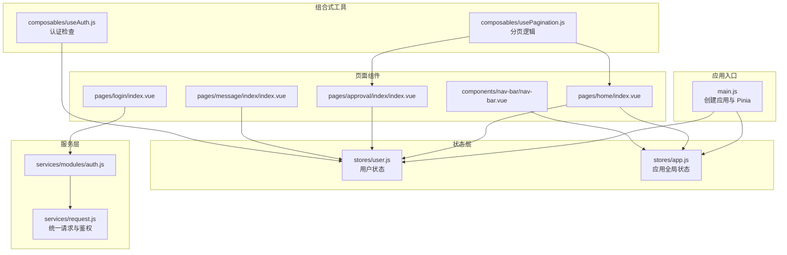
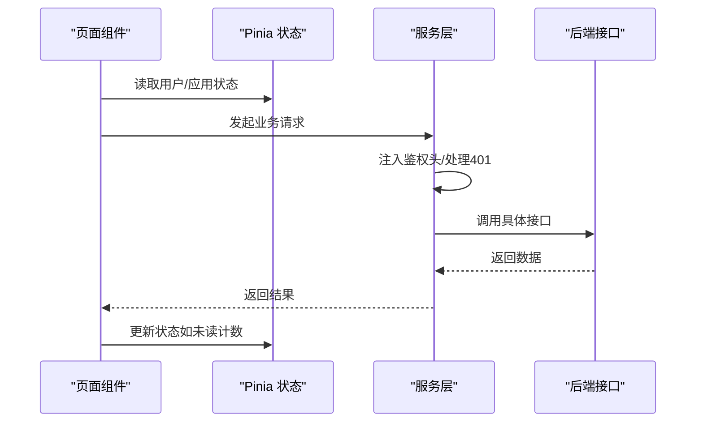
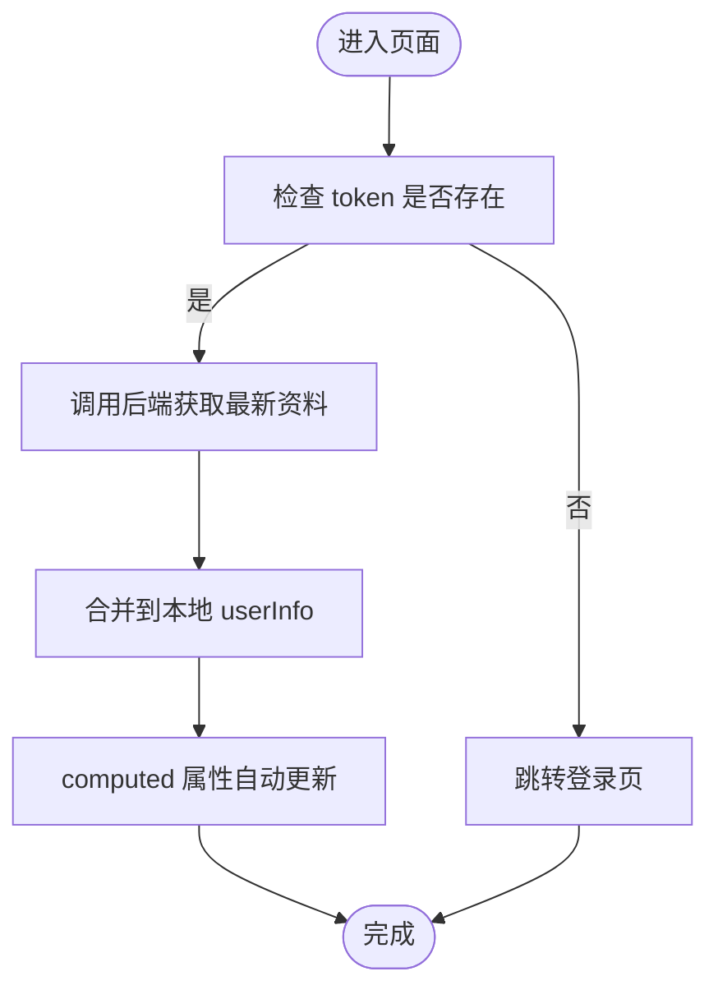
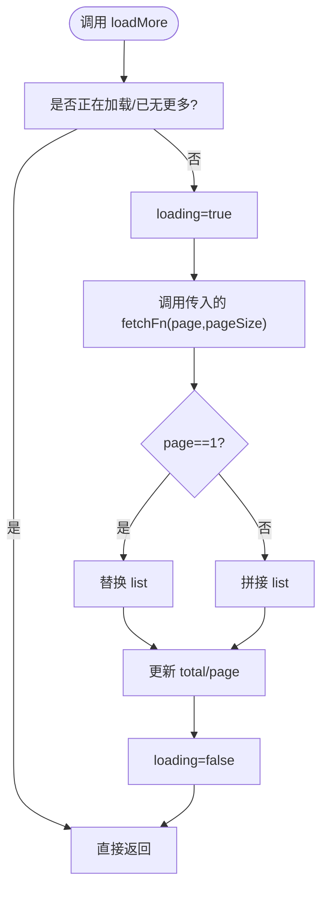
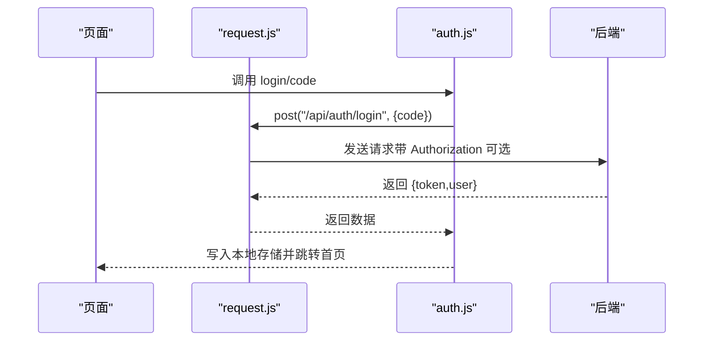
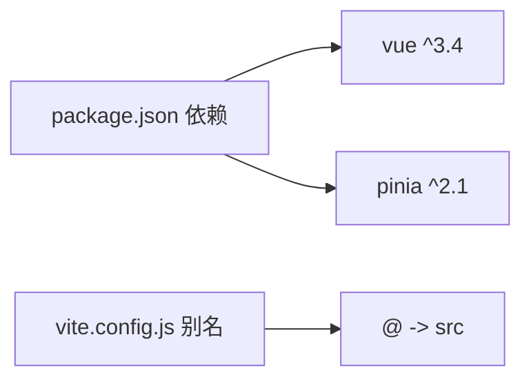

# 状态管理

<cite>
**本文引用的文件**
- [miniapp/src/stores/app.js](file://miniapp/src/stores/app.js)
- [miniapp/src/stores/user.js](file://miniapp/src/stores/user.js)
- [miniapp/src/composables/useAuth.js](file://miniapp/src/composables/useAuth.js)
- [miniapp/src/composables/usePagination.js](file://miniapp/src/composables/usePagination.js)
- [miniapp/src/main.js](file://miniapp/src/main.js)
- [miniapp/src/services/request.js](file://miniapp/src/services/request.js)
- [miniapp/src/services/modules/auth.js](file://miniapp/src/services/modules/auth.js)
- [miniapp/src/pages/home/index.vue](file://miniapp/src/pages/home/index.vue)
- [miniapp/src/pages/login/index.vue](file://miniapp/src/pages/login/index.vue)
- [miniapp/src/pages/approval/index/index.vue](file://miniapp/src/pages/approval/index/index.vue)
- [miniapp/src/pages/message/index/index.vue](file://miniapp/src/pages/message/index/index.vue)
- [miniapp/src/components/nav-bar/nav-bar.vue](file://miniapp/src/components/nav-bar/nav-bar.vue)
- [miniapp/package.json](file://miniapp/package.json)
- [miniapp/vite.config.js](file://miniapp/vite.config.js)
</cite>

## 目录
1. [简介](#简介)
2. [项目结构](#项目结构)
3. [核心组件](#核心组件)
4. [架构总览](#架构总览)
5. [详细组件分析](#详细组件分析)
6. [依赖分析](#依赖分析)
7. [性能考虑](#性能考虑)
8. [故障排查指南](#故障排查指南)
9. [结论](#结论)
10. [附录](#附录)

## 简介
本文件面向“智慧办公助手 OA 系统”的小程序端，系统性梳理基于 Pinia 的状态管理方案，覆盖用户态、全局应用态、认证态、分页态等核心模块的设计与使用，解释状态定义、动作函数、计算属性、持久化策略，并给出最佳实践、性能优化与调试建议。目标是帮助开发者快速理解并正确使用状态管理系统。

## 项目结构
小程序端采用 Vue 3 + Pinia 架构，状态集中在 stores 目录，通过 Composables 封装通用逻辑，页面组件按功能分页组织，服务层统一请求封装与鉴权处理。

图表来源
- [miniapp/src/main.js:1-11](file://miniapp/src/main.js#L1-L11)
- [miniapp/src/stores/user.js:1-78](file://miniapp/src/stores/user.js#L1-L78)
- [miniapp/src/stores/app.js:1-23](file://miniapp/src/stores/app.js#L1-L23)
- [miniapp/src/composables/useAuth.js:1-26](file://miniapp/src/composables/useAuth.js#L1-L26)
- [miniapp/src/composables/usePagination.js:1-63](file://miniapp/src/composables/usePagination.js#L1-L63)
- [miniapp/src/services/request.js:1-127](file://miniapp/src/services/request.js#L1-L127)
- [miniapp/src/services/modules/auth.js:1-20](file://miniapp/src/services/modules/auth.js#L1-L20)
- [miniapp/src/pages/home/index.vue:1-227](file://miniapp/src/pages/home/index.vue#L1-L227)
- [miniapp/src/pages/approval/index/index.vue:1-478](file://miniapp/src/pages/approval/index/index.vue#L1-L478)
- [miniapp/src/pages/message/index/index.vue:1-187](file://miniapp/src/pages/message/index/index.vue#L1-L187)
- [miniapp/src/pages/login/index.vue:1-196](file://miniapp/src/pages/login/index.vue#L1-L196)
- [miniapp/src/components/nav-bar/nav-bar.vue:1-171](file://miniapp/src/components/nav-bar/nav-bar.vue#L1-L171)

章节来源
- [miniapp/src/main.js:1-11](file://miniapp/src/main.js#L1-L11)
- [miniapp/package.json:1-29](file://miniapp/package.json#L1-L29)
- [miniapp/vite.config.js:1-13](file://miniapp/vite.config.js#L1-L13)

## 核心组件
- 用户状态（user）：集中存储 token、用户信息、角色与权限、登录态等，提供刷新资料、登出、权限判断等动作。
- 应用全局状态（app）：维护未读计数、通知列表等全局可见状态，提供设置与增量更新方法。
- 认证工具（useAuth）：对用户状态进行二次封装，提供认证检查与派生值。
- 分页工具（usePagination）：抽象列表加载、刷新、重置、防抖加载等通用逻辑，支持本地分页参数与远程数据合并。
- 请求层（request）：统一处理鉴权头、401 跳转、错误提示与开发模式 Mock。

章节来源
- [miniapp/src/stores/user.js:1-78](file://miniapp/src/stores/user.js#L1-L78)
- [miniapp/src/stores/app.js:1-23](file://miniapp/src/stores/app.js#L1-L23)
- [miniapp/src/composables/useAuth.js:1-26](file://miniapp/src/composables/useAuth.js#L1-L26)
- [miniapp/src/composables/usePagination.js:1-63](file://miniapp/src/composables/usePagination.js#L1-L63)
- [miniapp/src/services/request.js:1-127](file://miniapp/src/services/request.js#L1-L127)

## 架构总览
Pinia 在应用启动时被注入到 Vue 实例，页面组件通过组合式 API 获取状态与动作，服务层负责网络请求与鉴权处理，导航栏组件消费全局未读计数等应用态。

图表来源
- [miniapp/src/main.js:1-11](file://miniapp/src/main.js#L1-L11)
- [miniapp/src/services/request.js:1-127](file://miniapp/src/services/request.js#L1-L127)
- [miniapp/src/stores/app.js:1-23](file://miniapp/src/stores/app.js#L1-L23)
- [miniapp/src/stores/user.js:1-78](file://miniapp/src/stores/user.js#L1-L78)

## 详细组件分析

### 用户状态（user）
- 状态定义
  - token：本地存储键为 token，用于鉴权头携带。
  - userInfo：本地存储键为 userInfo，包含昵称、头像、部门、角色等。
- 计算属性
  - isLoggedIn：基于 token 是否存在。
  - userName/userAvatar/department/role/isAdmin：派生用户展示信息与角色判定。
  - permissions：根据角色映射权限集合。
- 动作函数
  - setUserInfo/setToken：写入本地存储并更新响应式状态。
  - refreshProfile：拉取后端最新资料并合并到本地缓存。
  - logout：清空本地存储并跳转登录。
  - hasPermission：权限判断。
- 持久化策略
  - 使用 uni 存储 API 进行本地持久化，启动时从本地恢复初始状态。

图表来源
- [miniapp/src/stores/user.js:38-51](file://miniapp/src/stores/user.js#L38-L51)

章节来源
- [miniapp/src/stores/user.js:1-78](file://miniapp/src/stores/user.js#L1-L78)

### 应用全局状态（app）
- 状态定义
  - unreadCount：未读消息计数。
  - notifications：通知列表。
- 动作函数
  - setUnreadCount/incrementUnread：设置或增量更新未读计数。
- 典型使用
  - 导航栏右侧徽标显示未读数。
  - 首页统计区联动更新。

章节来源
- [miniapp/src/stores/app.js:1-23](file://miniapp/src/stores/app.js#L1-L23)
- [miniapp/src/components/nav-bar/nav-bar.vue:31-33](file://miniapp/src/components/nav-bar/nav-bar.vue#L31-L33)

### 认证工具（useAuth）
- 作用
  - 对用户状态进行二次封装，暴露 isLoggedIn、userInfo、token 与 checkAuth。
- 使用场景
  - 页面访问前统一校验是否登录，未登录则跳转登录页。

章节来源
- [miniapp/src/composables/useAuth.js:1-26](file://miniapp/src/composables/useAuth.js#L1-L26)

### 分页工具（usePagination）
- 状态
  - list/loading/page/pageSize/total/hasMore。
- 动作
  - loadMore：加载下一页，支持首次替换与追加合并。
  - refresh：重置页码并重新加载。
  - reset：清空列表与页码。
  - debouncedLoadMore：防抖触发加载。
- 适用页面
  - 首页活动列表、审批列表、消息列表等。

图表来源
- [miniapp/src/composables/usePagination.js:13-34](file://miniapp/src/composables/usePagination.js#L13-L34)

章节来源
- [miniapp/src/composables/usePagination.js:1-63](file://miniapp/src/composables/usePagination.js#L1-L63)

### 请求层（request）与认证服务（auth）
- 统一请求
  - 自动注入 Authorization 头（当存在 token）。
  - 401 统一跳转登录并提示。
  - 成功/失败统一处理与错误提示。
  - 开发模式支持 dev-mode-token 与 Mock 数据映射。
- 认证服务
  - 提供登录、企业微信登录、获取资料、更新资料等接口封装。

图表来源
- [miniapp/src/services/modules/auth.js:1-20](file://miniapp/src/services/modules/auth.js#L1-L20)
- [miniapp/src/services/request.js:17-65](file://miniapp/src/services/request.js#L17-L65)

章节来源
- [miniapp/src/services/request.js:1-127](file://miniapp/src/services/request.js#L1-L127)
- [miniapp/src/services/modules/auth.js:1-20](file://miniapp/src/services/modules/auth.js#L1-L20)

### 页面使用示例

#### 首页（home）
- 读取用户角色与权限，异步加载统计数据、活动列表与未读数。
- 使用 app.unreadCount 更新导航栏徽标。
- 使用 usePagination 抽象活动列表的分页加载。

章节来源
- [miniapp/src/pages/home/index.vue:110-145](file://miniapp/src/pages/home/index.vue#L110-L145)
- [miniapp/src/pages/home/index.vue:149-164](file://miniapp/src/pages/home/index.vue#L149-L164)
- [miniapp/src/components/nav-bar/nav-bar.vue:31-33](file://miniapp/src/components/nav-bar/nav-bar.vue#L31-L33)

#### 审批中心（approval/index）
- 根据用户 isAdmin 动态显示“审核”标签页。
- 使用 usePagination 加载审批/审核列表，支持筛选与上拉加载。

章节来源
- [miniapp/src/pages/approval/index/index.vue:127-138](file://miniapp/src/pages/approval/index/index.vue#L127-L138)
- [miniapp/src/pages/approval/index/index.vue:200-235](file://miniapp/src/pages/approval/index/index.vue#L200-L235)
- [miniapp/src/pages/approval/index/index.vue:241-247](file://miniapp/src/pages/approval/index/index.vue#L241-L247)

#### 消息中心（message/index）
- 切换标签过滤消息类型，支持刷新与标记已读。
- 使用分页加载消息列表。

章节来源
- [miniapp/src/pages/message/index/index.vue:62-69](file://miniapp/src/pages/message/index/index.vue#L62-L69)
- [miniapp/src/pages/message/index/index.vue:73-90](file://miniapp/src/pages/message/index/index.vue#L73-L90)

#### 登录页（login）
- 根据平台差异选择登录方式（微信或企业微信）。
- 登录成功后写入本地存储并跳转首页。

章节来源
- [miniapp/src/pages/login/index.vue:91-119](file://miniapp/src/pages/login/index.vue#L91-L119)

## 依赖分析
- 运行时依赖
  - vue：3.x
  - pinia：2.x
- 构建与别名
  - @dcloudio/uni-app 等生态插件，@ 作为 src 别名。

图表来源
- [miniapp/package.json:11-14](file://miniapp/package.json#L11-L14)
- [miniapp/vite.config.js:7-11](file://miniapp/vite.config.js#L7-L11)

章节来源
- [miniapp/package.json:1-29](file://miniapp/package.json#L1-L29)
- [miniapp/vite.config.js:1-13](file://miniapp/vite.config.js#L1-L13)

## 性能考虑
- 状态粒度
  - 将用户态与应用态拆分，避免无关渲染。
  - 计算属性只依赖必要响应式数据，减少重算。
- 网络与分页
  - 使用防抖加载（debouncedLoadMore）降低频繁请求。
  - 首屏仅加载必要数据，后续懒加载。
- 本地存储
  - 重要状态（token、userInfo）持久化，减少重复登录成本。
- 渲染优化
  - 列表使用虚拟滚动或合理分页，避免一次性渲染过多节点。
  - 图标与图片资源按需加载，避免阻塞主线程。

## 故障排查指南
- 登录态失效
  - 现象：接口返回 401。
  - 处理：统一跳转登录页并提示“登录已过期，请重新登录”。
  - 排查：确认本地 token 是否存在、是否被意外清除。
  
  章节来源
  - [miniapp/src/services/request.js:41-46](file://miniapp/src/services/request.js#L41-L46)

- 开发模式 Mock
  - 现象：使用 dev-mode-token 时返回预设数据。
  - 排查：确认 NODE_ENV 与 token 值。
  
  章节来源
  - [miniapp/src/services/request.js:22-24](file://miniapp/src/services/request.js#L22-L24)
  - [miniapp/src/services/request.js:67-106](file://miniapp/src/services/request.js#L67-L106)

- 权限不足
  - 现象：某些功能不可见或不可用。
  - 处理：通过 hasPermission 判断，动态控制 UI 与交互。
  
  章节来源
  - [miniapp/src/stores/user.js:23-25](file://miniapp/src/stores/user.js#L23-L25)

- 分页异常
  - 现象：重复数据、总数不一致或无法加载更多。
  - 处理：确保首次加载替换 list，后续加载拼接；检查 total 与 pageSize 一致性。
  
  章节来源
  - [miniapp/src/composables/usePagination.js:19-26](file://miniapp/src/composables/usePagination.js#L19-L26)

## 结论
本项目采用 Pinia 实现清晰的状态分层：用户态、应用态、认证态与分页态相互解耦，结合统一请求层与本地存储，形成稳定可维护的状态管理方案。通过计算属性与动作函数的合理设计，配合分页与鉴权策略，能够有效支撑复杂业务场景下的数据流与组件通信。

## 附录
- 最佳实践清单
  - 将鉴权与权限判断下沉至组合式工具，页面仅做渲染与调度。
  - 对高频状态使用计算属性，避免重复派生。
  - 分页场景统一使用 usePagination，保持交互一致性。
  - 本地存储仅存放必要字段，避免污染与泄露。
- 调试建议
  - 使用浏览器/开发者工具观察响应式变化与网络请求。
  - 在开发模式下利用 Mock 数据快速验证 UI 与交互。
  - 对关键流程（登录、刷新资料、分页加载）添加日志与错误提示。