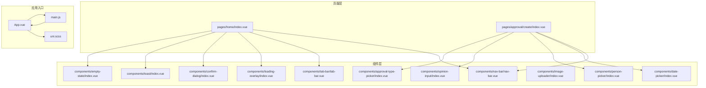
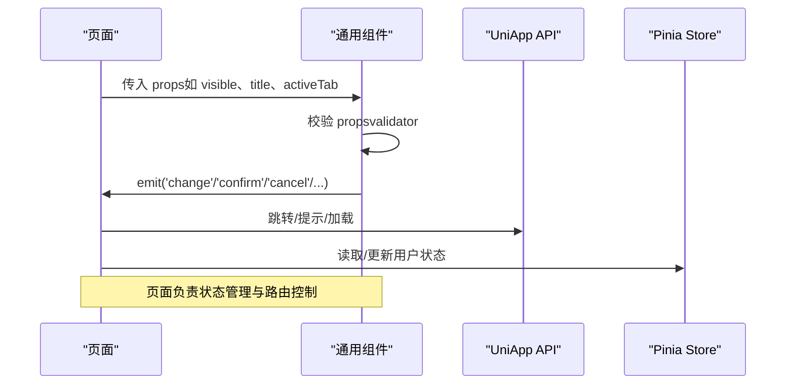
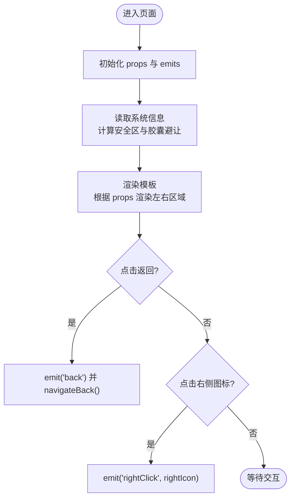
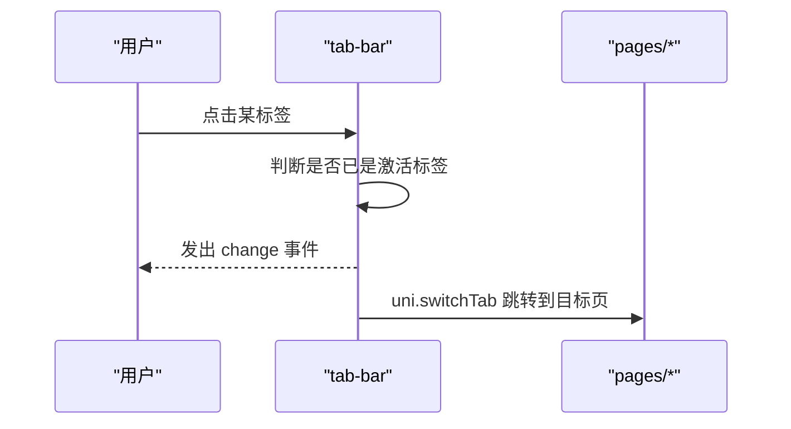
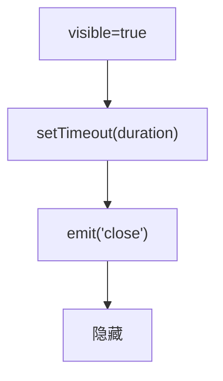
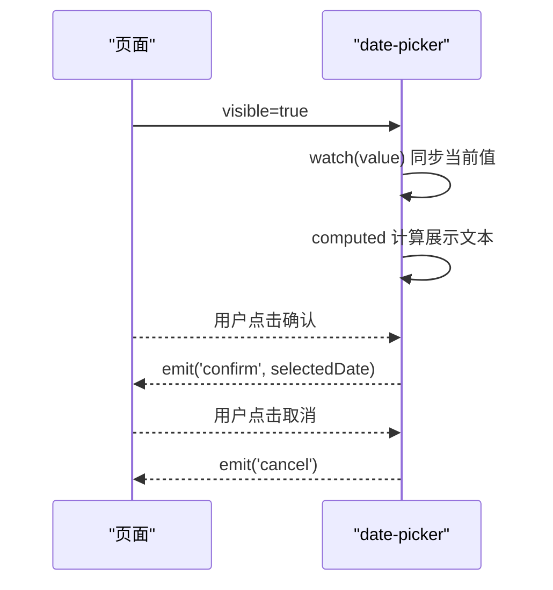
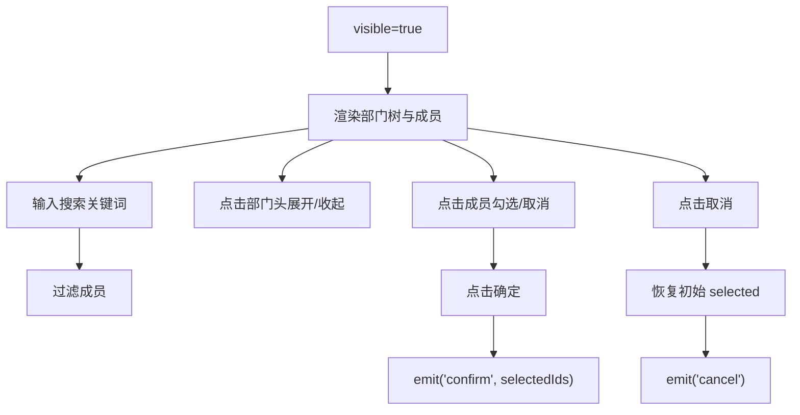
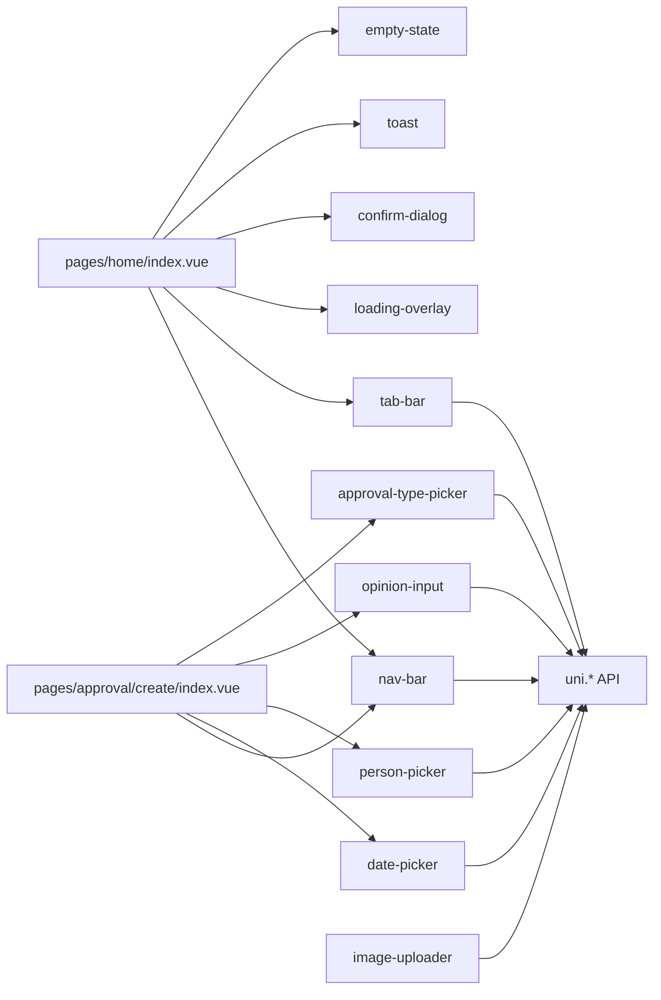

# 通用组件

<cite>
**本文引用的文件**
- [nav-bar.vue](file://miniapp/src/components/nav-bar/nav-bar.vue)
- [tab-bar.vue](file://miniapp/src/components/tab-bar/tab-bar.vue)
- [loading-overlay/index.vue](file://miniapp/src/components/loading-overlay/index.vue)
- [confirm-dialog/index.vue](file://miniapp/src/components/confirm-dialog/index.vue)
- [toast/index.vue](file://miniapp/src/components/toast/index.vue)
- [empty-state/index.vue](file://miniapp/src/components/empty-state/index.vue)
- [date-picker/index.vue](file://miniapp/src/components/date-picker/index.vue)
- [person-picker/index.vue](file://miniapp/src/components/person-picker/index.vue)
- [image-uploader/index.vue](file://miniapp/src/components/image-uploader/index.vue)
- [opinion-input/index.vue](file://miniapp/src/components/opinion-input/index.vue)
- [approval-type-picker/index.vue](file://miniapp/src/components/approval-type-picker/index.vue)
- [home/index.vue](file://miniapp/src/pages/home/index.vue)
- [create/index.vue](file://miniapp/src/pages/approval/create/index.vue)
- [App.vue](file://miniapp/src/App.vue)
- [main.js](file://miniapp/src/main.js)
- [uni.scss](file://miniapp/src/uni.scss)
</cite>

## 更新摘要
**所做更改**
- 新增 approval-type-picker 组件的完整文档说明
- 扩展组件库架构图以包含所有新增组件
- 更新组件详解章节，补充新增组件的技术实现细节
- 增强依赖关系分析，涵盖完整的组件生态系统
- 完善故障排查指南，包含新增组件的常见问题解决方案

## 目录
1. [简介](#简介)
2. [项目结构](#项目结构)
3. [核心组件](#核心组件)
4. [架构总览](#架构总览)
5. [组件详解](#组件详解)
6. [依赖关系分析](#依赖关系分析)
7. [性能考量](#性能考量)
8. [故障排查指南](#故障排查指南)
9. [结论](#结论)
10. [附录](#附录)

## 简介
本文件面向"智慧办公助手 OA 系统"的小程序前端，系统性梳理并说明通用 UI 组件的设计理念、使用方式与配置项，覆盖导航栏、标签栏、加载遮罩、确认对话框、消息提示、空态、日期选择器、人员选择器、图片上传器、意见输入、审批类型选择器等组件。文档从代码级视角解析组件的属性、事件、插槽、样式定制、生命周期与状态管理，并结合页面使用示例给出最佳实践与扩展建议。

## 项目结构
通用组件集中于 miniapp/src/components 下，采用按功能分目录的组织方式；页面位于 miniapp/src/pages 下，通过 import 引入并组合使用组件。全局样式与主题变量位于 uni.scss，应用入口在 App.vue 与 main.js。

**图表来源**
- [home/index.vue:1-78](file://miniapp/src/pages/home/index.vue#L1-L78)
- [create/index.vue:1-130](file://miniapp/src/pages/approval/create/index.vue#L1-L130)
- [nav-bar.vue:1-171](file://miniapp/src/components/nav-bar/nav-bar.vue#L1-L171)
- [tab-bar.vue:1-67](file://miniapp/src/components/tab-bar/tab-bar.vue#L1-L67)
- [loading-overlay/index.vue:1-61](file://miniapp/src/components/loading-overlay/index.vue#L1-L61)
- [confirm-dialog/index.vue:1-132](file://miniapp/src/components/confirm-dialog/index.vue#L1-L132)
- [toast/index.vue:1-87](file://miniapp/src/components/toast/index.vue#L1-L87)
- [empty-state/index.vue:1-36](file://miniapp/src/components/empty-state/index.vue#L1-L36)
- [date-picker/index.vue:1-77](file://miniapp/src/components/date-picker/index.vue#L1-L77)
- [person-picker/index.vue:1-135](file://miniapp/src/components/person-picker/index.vue#L1-L135)
- [image-uploader/index.vue:1-76](file://miniapp/src/components/image-uploader/index.vue#L1-L76)
- [opinion-input/index.vue:1-81](file://miniapp/src/components/opinion-input/index.vue#L1-L81)
- [approval-type-picker/index.vue:1-120](file://miniapp/src/components/approval-type-picker/index.vue#L1-L120)
- [App.vue:11-30](file://miniapp/src/App.vue#L11-L30)
- [main.js:1-11](file://miniapp/src/main.js#L1-L11)
- [uni.scss:1-65](file://miniapp/src/uni.scss#L1-L65)

**章节来源**
- [home/index.vue:1-78](file://miniapp/src/pages/home/index.vue#L1-L78)
- [create/index.vue:1-130](file://miniapp/src/pages/approval/create/index.vue#L1-L130)
- [App.vue:11-30](file://miniapp/src/App.vue#L11-L30)
- [main.js:1-11](file://miniapp/src/main.js#L1-L11)
- [uni.scss:1-65](file://miniapp/src/uni.scss#L1-L65)

## 核心组件
- 导航栏：支持标题、返回按钮、右侧图标（通知/搜索/设置/筛选）与徽标、左侧自定义区域与品牌标识。
- 标签栏：底部导航，支持切换事件与页面跳转。
- 加载遮罩：固定层显示旋转指示与文本，常用于异步提交。
- 确认对话框：弹层卡片，支持图标、标题、描述、确认/取消按钮与回调。
- 消息提示：顶部浮层提示，内置多种类型与自动关闭。
- 空态：展示图标、标题、描述与可选操作按钮。
- 日期选择器：底部弹层，日期选择面板与确认/取消交互。
- 人员选择器：部门树形展开、搜索过滤、单选/多选。
- 图片上传器：网格布局，支持预览、长按删除、添加图片。
- 意见输入：底部弹层，快捷标签、字数统计与提交。
- 审批类型选择器：审批流程类型选择，支持下拉展开与选项切换。

**章节来源**
- [nav-bar.vue:67-79](file://miniapp/src/components/nav-bar/nav-bar.vue#L67-L79)
- [tab-bar.vue:17-42](file://miniapp/src/components/tab-bar/tab-bar.vue#L17-L42)
- [loading-overlay/index.vue:10-15](file://miniapp/src/components/loading-overlay/index.vue#L10-L15)
- [confirm-dialog/index.vue:23-46](file://miniapp/src/components/confirm-dialog/index.vue#L23-L46)
- [toast/index.vue:12-44](file://miniapp/src/components/toast/index.vue#L12-L44)
- [empty-state/index.vue:14-35](file://miniapp/src/components/empty-state/index.vue#L14-L35)
- [date-picker/index.vue:26-77](file://miniapp/src/components/date-picker/index.vue#L26-L77)
- [person-picker/index.vue:59-135](file://miniapp/src/components/person-picker/index.vue#L59-L135)
- [image-uploader/index.vue:26-76](file://miniapp/src/components/image-uploader/index.vue#L26-L76)
- [opinion-input/index.vue:39-81](file://miniapp/src/components/opinion-input/index.vue#L39-L81)
- [approval-type-picker/index.vue:20-120](file://miniapp/src/components/approval-type-picker/index.vue#L20-L120)

## 架构总览
通用组件遵循"声明式属性 + 事件发射"的设计模式，页面通过 props 控制外观与行为，通过事件回调完成状态同步与页面跳转。全局样式通过 uni.scss 提供主题色、字号、间距与圆角等变量，确保视觉一致性。

**图表来源**
- [home/index.vue:166-175](file://miniapp/src/pages/home/index.vue#L166-L175)
- [tab-bar.vue:37-42](file://miniapp/src/components/tab-bar/tab-bar.vue#L37-L42)
- [confirm-dialog/index.vue:40-46](file://miniapp/src/components/confirm-dialog/index.vue#L40-L46)
- [toast/index.vue:38-44](file://miniapp/src/components/toast/index.vue#L38-L44)
- [App.vue:14-29](file://miniapp/src/App.vue#L14-L29)

## 组件详解

### 导航栏组件（nav-bar）
- 设计理念
  - 适配安全区与胶囊菜单按钮避让，自动计算状态栏高度与右侧内边距。
  - 支持左侧品牌标识与标题、右侧图标按钮与未读徽标，插槽扩展灵活。
- 关键属性
  - title：标题文本
  - showLogo：是否显示品牌徽标
  - showBack：是否显示返回按钮
  - rightIcon：右侧图标类型（空字符串/""search""/""notification""/""settings""/""filter""）
  - leftCustom：是否启用左侧自定义插槽
  - unreadCount：未读数，大于 0 显示徽标
- 事件
  - back：点击返回触发
  - rightClick：点击右侧图标触发，携带图标类型
- 插槽
  - 左侧插槽：优先级高于默认品牌标识
  - 右侧插槽：优先级高于默认图标按钮
- 生命周期与平台适配
  - onMounted 中读取系统信息与胶囊按钮位置，动态设置内边距与状态栏高度
- 使用示例
  - 在首页使用 leftCustom 展示品牌标识与标题
  - 在审批页使用 showBack 返回上一页

**图表来源**
- [nav-bar.vue:47-79](file://miniapp/src/components/nav-bar/nav-bar.vue#L47-L79)

**章节来源**
- [nav-bar.vue:67-79](file://miniapp/src/components/nav-bar/nav-bar.vue#L67-L79)
- [home/index.vue:3-6](file://miniapp/src/pages/home/index.vue#L3-L6)
- [create/index.vue](file://miniapp/src/pages/approval/create/index.vue#L3)

### 标签栏组件（tab-bar）
- 设计理念
  - 固定底部，提供首页/功能页/个人中心三类标签，动态切换图标与页面跳转
- 关键属性
  - activeTab：当前激活标签（校验仅允许 home/features/profile）
- 事件
  - change：标签切换时发出新 key
- 行为
  - 根据 activeTab 动态拼接图标路径，点击后触发 uni.switchTab 并发出 change
- 使用示例
  - 首页使用 activeTab="home"，监听 change 后跳转对应页面

**图表来源**
- [tab-bar.vue:37-42](file://miniapp/src/components/tab-bar/tab-bar.vue#L37-L42)

**章节来源**
- [tab-bar.vue:17-42](file://miniapp/src/components/tab-bar/tab-bar.vue#L17-L42)
- [home/index.vue](file://miniapp/src/pages/home/index.vue#L76)

### 加载遮罩（loading-overlay）
- 设计理念
  - 全屏半透明背景，中央卡片显示旋转动画与提示文本
- 关键属性
  - visible：是否显示
  - text：提示文本，默认"提交中..."
- 使用场景
  - 表单提交、接口请求期间阻塞交互

**章节来源**
- [loading-overlay/index.vue:10-15](file://miniapp/src/components/loading-overlay/index.vue#L10-L15)

### 确认对话框（confirm-dialog）
- 设计理念
  - 弹层卡片，支持自定义图标、颜色、按钮文案与背景
- 关键属性
  - visible、title、description、icon、iconBg、iconColor、iconSize、cancelText、confirmText、confirmBg、type
- 事件
  - confirm、cancel
- 使用场景
  - 删除、提交、危险操作前的二次确认

**章节来源**
- [confirm-dialog/index.vue:23-46](file://miniapp/src/components/confirm-dialog/index.vue#L23-L46)

### 消息提示（toast）
- 设计理念
  - 顶部浮层提示，内置多种类型（success/error/warning/info），自动定时关闭
- 关键属性
  - visible、type、message、duration
- 事件
  - close：自动关闭时发出
- 使用场景
  - 成功/失败/警告/信息提示

**图表来源**
- [toast/index.vue:38-44](file://miniapp/src/components/toast/index.vue#L38-L44)

**章节来源**
- [toast/index.vue:12-44](file://miniapp/src/components/toast/index.vue#L12-L44)

### 空态（empty-state）
- 设计理念
  - 数据为空时的占位视图，支持图标、标题、描述与可选操作按钮
- 关键属性
  - icon、iconBg、iconColor、iconSize、title、description、showAction、actionText
- 事件
  - action：点击"重新加载"等操作按钮
- 使用场景
  - 列表/表格无数据时引导刷新或执行动作

**章节来源**
- [empty-state/index.vue:14-35](file://miniapp/src/components/empty-state/index.vue#L14-L35)

### 日期选择器（date-picker）
- 设计理念
  - 底部弹层，日期选择器与确认/取消交互，支持最小/最大日期限制
- 关键属性
  - visible、value、maxDate、minDate
- 事件
  - confirm、cancel
- 行为
  - watch 同步外部 value，computed 计算展示文本，点击确定发出选中值

**图表来源**
- [date-picker/index.vue:52-77](file://miniapp/src/components/date-picker/index.vue#L52-L77)

**章节来源**
- [date-picker/index.vue:26-77](file://miniapp/src/components/date-picker/index.vue#L26-L77)
- [create/index.vue:253-264](file://miniapp/src/pages/approval/create/index.vue#L253-L264)

### 人员选择器（person-picker）
- 设计理念
  - 底部弹层，部门树形展开/收起，搜索过滤成员，支持单选/多选
- 关键属性
  - visible、multiple、selected
- 事件
  - confirm、cancel
- 行为
  - 内置演示数据（技术部/财务部/行政部），toggle 切换部门展开，搜索过滤成员，确认发出选中 ID 数组

**图表来源**
- [person-picker/index.vue:100-135](file://miniapp/src/components/person-picker/index.vue#L100-L135)

**章节来源**
- [person-picker/index.vue:59-135](file://miniapp/src/components/person-picker/index.vue#L59-L135)
- [create/index.vue:266-286](file://miniapp/src/pages/approval/create/index.vue#L266-L286)

### 图片上传器（image-uploader）
- 设计理念
  - 网格布局，支持预览、长按删除、添加图片；受 maxCount 限制
- 关键属性
  - list、maxCount
- 事件
  - add、remove、preview
- 行为
  - watch 深度监听 list，chooseImage 选择文件，预览与删除均发出对应事件

**章节来源**
- [image-uploader/index.vue:26-76](file://miniapp/src/components/image-uploader/index.vue#L26-L76)

### 意见输入（opinion-input）
- 设计理念
  - 底部弹层，快捷标签、字数统计与提交；支持必填校验
- 关键属性
  - visible、required、title
- 事件
  - confirm、cancel
- 行为
  - 选择快捷标签即填充意见文本，输入长度限制 200，提交时校验必填

**章节来源**
- [opinion-input/index.vue:39-81](file://miniapp/src/components/opinion-input/index.vue#L39-L81)
- [create/index.vue:266-286](file://miniapp/src/pages/approval/create/index.vue#L266-L286)

### 审批类型选择器（approval-type-picker）
- 设计理念
  - 底部弹层，审批类型下拉选择器，支持选项展开与切换
- 关键属性
  - visible、value、options
- 事件
  - confirm、cancel
- 行为
  - options 支持多级审批类型配置，点击选项发出选中值，支持默认值绑定

**章节来源**
- [approval-type-picker/index.vue:20-120](file://miniapp/src/components/approval-type-picker/index.vue#L20-L120)

## 依赖关系分析
- 页面对组件的依赖
  - 首页依赖导航栏与标签栏，配合全局样式与 Pinia 状态管理
  - 审批页依赖导航栏、日期选择器、人员选择器、意见输入与审批类型选择器
- 组件间耦合
  - 组件之间低耦合，通过 props 与事件进行通信
- 外部依赖
  - 组件依赖 uni-app API（navigateBack/switchTab/showModal/chooseImage/previewImage 等）
  - 页面依赖 Pinia（用户状态）与服务模块（API）

**图表来源**
- [home/index.vue:83-84](file://miniapp/src/pages/home/index.vue#L83-L84)
- [create/index.vue:134-135](file://miniapp/src/pages/approval/create/index.vue#L134-L135)
- [nav-bar.vue:76-79](file://miniapp/src/components/nav-bar/nav-bar.vue#L76-L79)
- [tab-bar.vue:25-42](file://miniapp/src/components/tab-bar/tab-bar.vue#L25-L42)
- [date-picker/index.vue:36-77](file://miniapp/src/components/date-picker/index.vue#L36-L77)
- [person-picker/index.vue:68-135](file://miniapp/src/components/person-picker/index.vue#L68-L135)
- [opinion-input/index.vue:48-81](file://miniapp/src/components/opinion-input/index.vue#L48-L81)
- [approval-type-picker/index.vue:20-120](file://miniapp/src/components/approval-type-picker/index.vue#L20-L120)
- [image-uploader/index.vue:34-76](file://miniapp/src/components/image-uploader/index.vue#L34-L76)

**章节来源**
- [home/index.vue:80-84](file://miniapp/src/pages/home/index.vue#L80-L84)
- [create/index.vue:132-135](file://miniapp/src/pages/approval/create/index.vue#L132-L135)

## 性能考量
- 渲染与计算
  - 使用 computed 生成图标路径与展示文本，减少重复计算
  - watch 深度监听数组型 props，避免不必要的重渲染
- 交互体验
  - 底部弹层组件通过 fixed 布局与 z-index 管理层级，避免阻塞主内容
  - toast 自动关闭，避免长时间占用用户注意力
- 主题与样式
  - 通过 uni.scss 的变量统一字号、间距、圆角与主色，降低样式维护成本

## 故障排查指南
- 导航栏图标不显示
  - 检查 rightIcon 是否为受支持的枚举值
  - 确认资源路径与图标存在
- 标签栏点击无效
  - 确认 activeTab 与目标页面映射一致
  - 检查 uni.switchTab 权限与页面路径
- 日期选择器无法确认
  - 检查 visible 与 value 的双向绑定
  - 确认 min/max 日期范围合理
- 人员选择器无数据
  - 确认 selected 与 multiple 的初始值
  - 检查 mock 数据或真实 API 返回
- 图片上传器无法删除
  - 确认长按事件与阻止冒泡逻辑
- 消息提示不消失
  - 检查 visible 与 duration 的联动
- 审批类型选择器选项不显示
  - 确认 options 数组格式正确
  - 检查 visible 属性绑定
- 应用启动鉴权
  - App.vue 在 onLaunch/onShow 中处理 token 与页面跳转

**章节来源**
- [nav-bar.vue:67-74](file://miniapp/src/components/nav-bar/nav-bar.vue#L67-L74)
- [tab-bar.vue:17-23](file://miniapp/src/components/tab-bar/tab-bar.vue#L17-L23)
- [date-picker/index.vue:52-57](file://miniapp/src/components/date-picker/index.vue#L52-L57)
- [person-picker/index.vue:100-103](file://miniapp/src/components/person-picker/index.vue#L100-L103)
- [image-uploader/index.vue:55-67](file://miniapp/src/components/image-uploader/index.vue#L55-L67)
- [toast/index.vue:38-44](file://miniapp/src/components/toast/index.vue#L38-L44)
- [approval-type-picker/index.vue:20-120](file://miniapp/src/components/approval-type-picker/index.vue#L20-L120)
- [App.vue:14-29](file://miniapp/src/App.vue#L14-L29)

## 结论
本项目的通用组件以"声明式 + 事件驱动"为核心，具备良好的可复用性与扩展性。通过 props 校验、computed 与 watch 的合理使用，以及与 uni-app API 的紧密集成，组件在不同页面中保持一致的交互与视觉体验。新增的审批类型选择器进一步完善了审批流程的组件生态，建议在业务页面中统一引入并遵循组件命名与事件约定，持续沉淀主题变量与样式规范，提升整体开发效率与一致性。

## 附录
- 最佳实践
  - 统一使用 uni.scss 变量，避免硬编码颜色与尺寸
  - 对外部传入的 props 进行 validator 校验，保证运行时稳定
  - 将复杂交互拆分为多个小组件，降低单组件职责
  - 为每个组件编写简要使用说明与示例，便于团队协作
- 扩展建议
  - 为常用组件增加插槽，提升可定制性
  - 将部分交互封装为 Composables，复用逻辑而非复制代码
  - 增加单元测试与可视化测试用例，保障质量