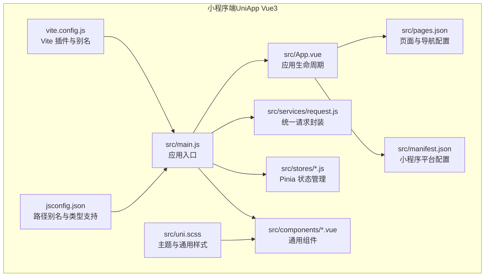
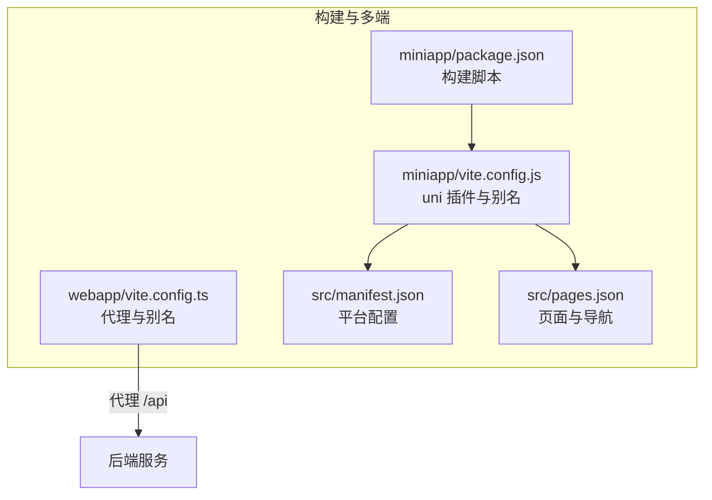
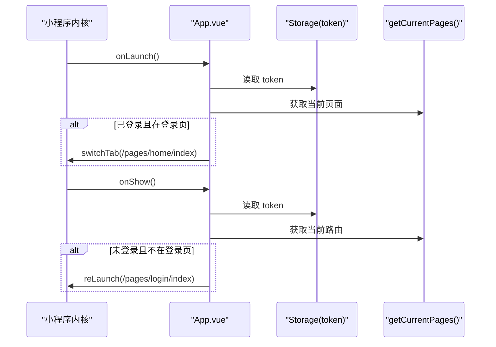
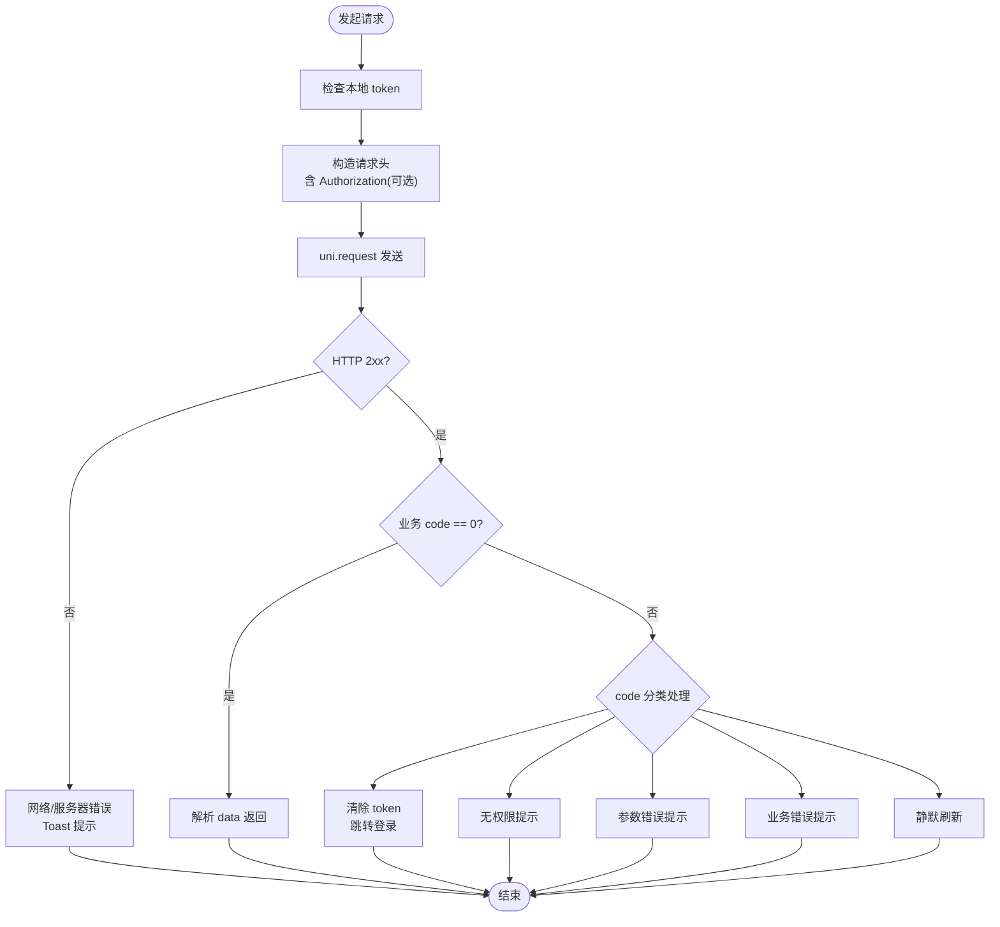
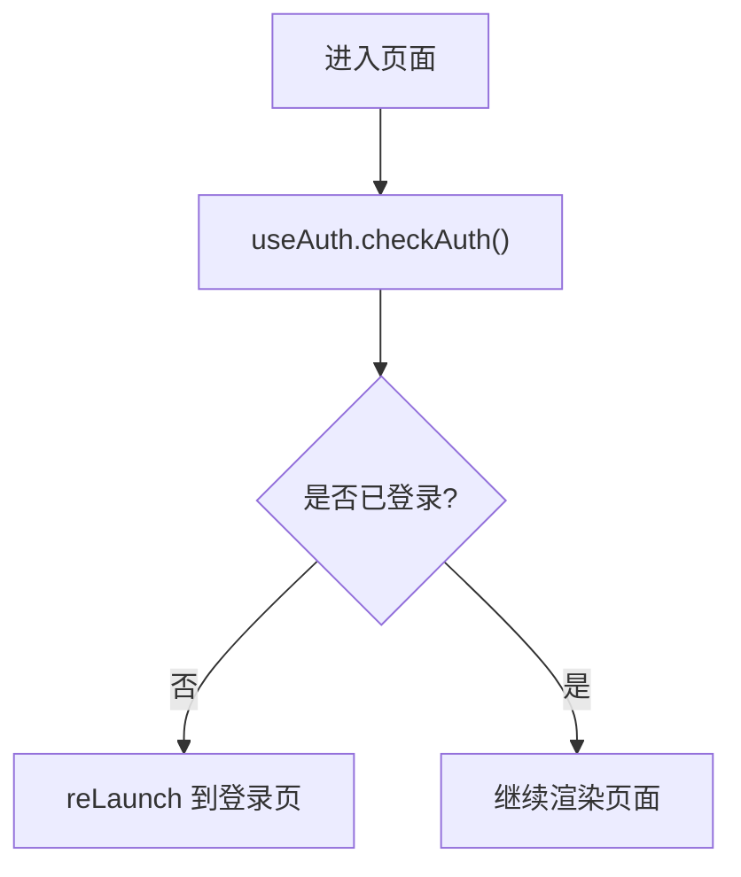
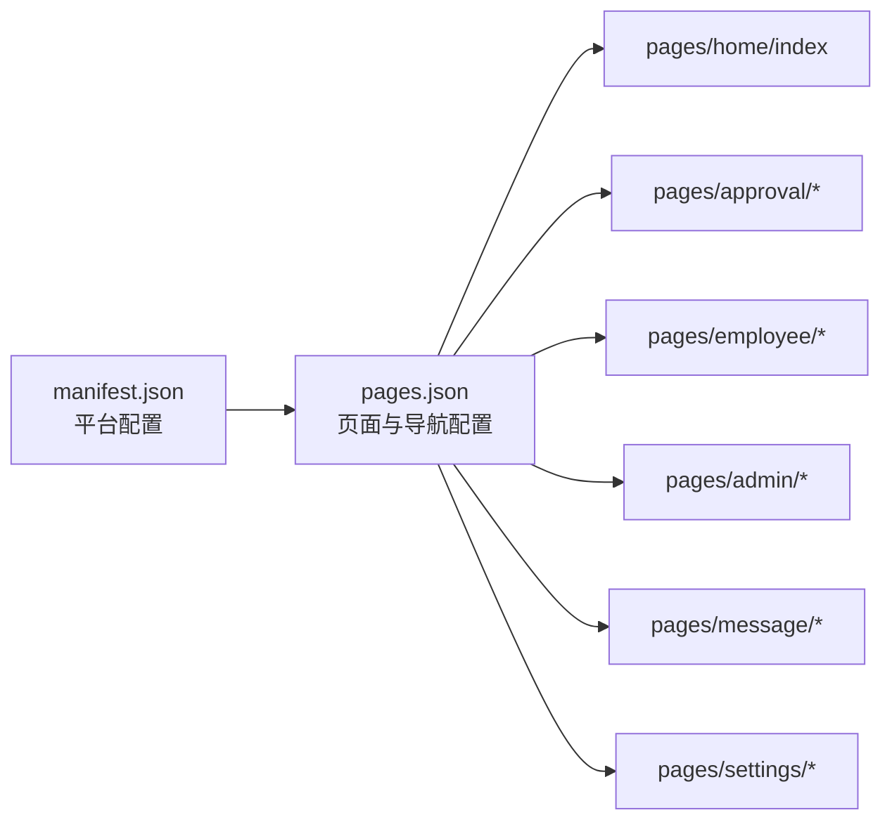
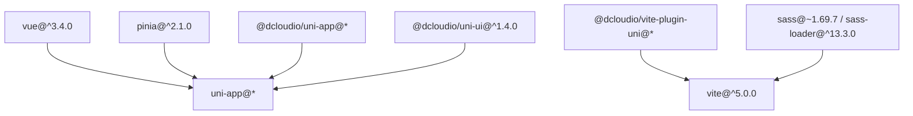

# 项目结构

<cite>
**本文引用的文件**
- [package.json](file://miniapp/package.json)
- [vite.config.js](file://miniapp/vite.config.js)
- [main.js](file://miniapp/src/main.js)
- [App.vue](file://miniapp/src/App.vue)
- [manifest.json](file://miniapp/src/manifest.json)
- [pages.json](file://miniapp/src/pages.json)
- [uni.scss](file://miniapp/src/uni.scss)
- [jsconfig.json](file://miniapp/jsconfig.json)
- [request.js](file://miniapp/src/services/request.js)
- [useAuth.js](file://miniapp/src/composables/useAuth.js)
- [app.js（小程序应用级 Store）](file://miniapp/src/stores/app.js)
- [前端技术开发指导及规范.md](file://shared-docs/前端技术开发指导及规范.md)
- [API-Integration-Guide.md](file://miniapp/API-Integration-Guide.md)
- [package.json（Web 应用）](file://webapp/package.json)
- [vite.config.ts（Web 应用）](file://webapp/vite.config.ts)
</cite>

## 目录
1. [简介](#简介)
2. [项目结构](#项目结构)
3. [核心组件](#核心组件)
4. [架构总览](#架构总览)
5. [详细组件分析](#详细组件分析)
6. [依赖分析](#依赖分析)
7. [性能考虑](#性能考虑)
8. [故障排查指南](#故障排查指南)
9. [结论](#结论)
10. [附录](#附录)

## 简介
本文件面向“智慧办公助手 OA”系统的小程序端（基于 Vue 3 + UniApp），系统性梳理项目整体架构、目录组织原则、文件命名规范、多端编译与差异化处理策略、应用入口与路由系统、构建工具与环境变量管理、初始化流程、插件注册机制以及全局配置选项。文档同时提供与后端 API 的对接规范、错误码处理策略与最佳实践，帮助开发者快速理解并高效开发。

## 项目结构
- 项目采用“多端同构 + 差异化适配”的架构：以 Vue 3 + UniApp 为核心，统一业务逻辑，通过 manifest.json 与 pages.json 实现小程序端的页面与导航配置；通过 Vite 插件体系实现多端构建（小程序、H5）。
- 目录组织遵循“功能域 + 层次化”的原则：
  - 组件层：src/components 提供可复用 UI 组件与业务通用组件（如导航栏、标签栏、选择器、对话框等）。
  - 页面层：src/pages 下按功能域划分页面，如 home、approval、employee、admin、message、settings 等。
  - 服务层：src/services 封装请求与模块化 API 调用，统一错误处理与鉴权头注入。
  - 状态层：src/stores 使用 Pinia 管理应用与用户状态。
  - 工具层：src/utils 提供日期、校验、错误上报等工具函数。
  - 样式层：src/uni.scss 定义主题变量与通用样式类，配合 uni-ui 变量体系。
  - 构建层：根目录下 vite.config.js（小程序）、webapp/vite.config.ts（Web 应用）分别配置各自构建与开发服务器。
  - 配置层：manifest.json、pages.json、jsconfig.json、package.json 等提供多端编译与开发工具链配置。

图表来源
- [main.js:1-11](file://miniapp/src/main.js#L1-L11)
- [App.vue:1-42](file://miniapp/src/App.vue#L1-L42)
- [pages.json:1-220](file://miniapp/src/pages.json#L1-L220)
- [manifest.json:1-25](file://miniapp/src/manifest.json#L1-L25)
- [request.js:1-127](file://miniapp/src/services/request.js#L1-L127)
- [app.js（小程序应用级 Store）:1-23](file://miniapp/src/stores/app.js#L1-L23)
- [uni.scss:1-65](file://miniapp/src/uni.scss#L1-L65)
- [vite.config.js:1-13](file://miniapp/vite.config.js#L1-L13)
- [jsconfig.json:1-14](file://miniapp/jsconfig.json#L1-L14)

章节来源
- [package.json:1-29](file://miniapp/package.json#L1-L29)
- [vite.config.js:1-13](file://miniapp/vite.config.js#L1-L13)
- [jsconfig.json:1-14](file://miniapp/jsconfig.json#L1-L14)
- [uni.scss:1-65](file://miniapp/src/uni.scss#L1-L65)

## 核心组件
- 应用入口与初始化
  - 应用入口在 main.js 中导出 createApp 工厂函数，创建 SSR App 实例并挂载 Pinia，确保多端一致的初始化流程。
  - App.vue 在 onLaunch/onShow 生命周期中进行登录态校验与页面跳转，保障用户体验与安全性。
- 统一请求封装
  - request.js 封装了基础请求方法与统一错误处理，支持开发模式下的本地 Mock，便于联调与测试。
  - 支持在开发环境使用特定开发 Token 触发 Mock 数据，减少对后端的依赖。
- 鉴权与权限
  - useAuth.js 提供鉴权检查与用户状态计算属性，统一在页面逻辑中进行登录态判断与引导跳转。
- 页面与导航
  - pages.json 定义页面路径、导航标题、自定义导航与 TabBar 列表，并声明各页面所需的组件占位，提升渲染性能与可维护性。
  - manifest.json 配置小程序 AppId、平台设置、WeUI 扩展库启用等，确保编译与运行一致性。
- 样式与主题
  - uni.scss 定义主色、语义色、字号、间距、圆角等变量，结合 uni-ui 变量体系，形成统一的设计语言与通用卡片样式类。

章节来源
- [main.js:1-11](file://miniapp/src/main.js#L1-L11)
- [App.vue:1-42](file://miniapp/src/App.vue#L1-L42)
- [request.js:1-127](file://miniapp/src/services/request.js#L1-L127)
- [useAuth.js:1-26](file://miniapp/src/composables/useAuth.js#L1-L26)
- [pages.json:1-220](file://miniapp/src/pages.json#L1-L220)
- [manifest.json:1-25](file://miniapp/src/manifest.json#L1-L25)
- [uni.scss:1-65](file://miniapp/src/uni.scss#L1-L65)

## 架构总览
- 多端编译与差异化处理
  - 通过 @dcloudio/vite-plugin-uni 与 @dcloudio/uni-app 生态，在同一套 Vue 代码基础上生成小程序与 H5 产物。
  - 小程序端通过 manifest.json 与 pages.json 控制页面、导航与组件占位，H5 端由 pages.json 的页面映射与 Vite 代理配置提供开发体验。
- 构建工具与脚本
  - 小程序端：package.json 提供 dev:mp-weixin/build:mp-weixin、dev:h5/build:h5 等脚本，vite.config.js 配置 uni 插件与路径别名。
  - Web 端：webapp/package.json 与 vite.config.ts 提供独立的开发与构建配置，包含代理到后端服务的配置。
- 全局配置与环境变量
  - request.js 中的 BASE_URL 与开发模式下的 dev-mode-token 体现了环境区分与本地 Mock 的能力。
  - Web 端通过 Vite 代理将 /api 前缀转发到后端服务，便于前后端联调。

图表来源
- [package.json:5-10](file://miniapp/package.json#L5-L10)
- [vite.config.js:1-13](file://miniapp/vite.config.js#L1-L13)
- [vite.config.ts（Web 应用）:1-33](file://webapp/vite.config.ts#L1-L33)
- [manifest.json:1-25](file://miniapp/src/manifest.json#L1-L25)
- [pages.json:1-220](file://miniapp/src/pages.json#L1-L220)

章节来源
- [package.json:1-29](file://miniapp/package.json#L1-L29)
- [vite.config.js:1-13](file://miniapp/vite.config.js#L1-L13)
- [package.json（Web 应用）:1-53](file://webapp/package.json#L1-L53)
- [vite.config.ts（Web 应用）:1-33](file://webapp/vite.config.ts#L1-L33)

## 详细组件分析

### 应用入口与初始化流程
- 初始化步骤
  - main.js 导出 createApp，创建 SSR App 并安装 Pinia，返回 { app }，满足多端统一挂载。
  - App.vue 在 onLaunch/onShow 中读取本地 token，根据登录态与当前路由决定跳转，保证首屏与切前台的安全性。
- 最佳实践
  - 将初始化逻辑集中在 createApp，避免在页面中重复初始化状态。
  - 在 App.vue 中集中处理登录态校验，减少页面分散逻辑。

图表来源
- [App.vue:14-29](file://miniapp/src/App.vue#L14-L29)

章节来源
- [main.js:1-11](file://miniapp/src/main.js#L1-L11)
- [App.vue:1-42](file://miniapp/src/App.vue#L1-L42)

### 统一请求封装与错误处理
- 设计要点
  - request.js 统一封装 GET/POST/PUT/DELETE 方法，自动注入 Authorization 头（若存在 token）。
  - 对 401 统一处理：提示、清除 token、跳转登录页；对业务错误码进行分类处理；对网络异常进行统一提示。
  - 开发模式支持 dev-mode-token 触发 Mock 数据，提升联调效率。
- 错误码与响应格式
  - 响应统一为 { code, message, data }，其中 code=0 表示成功，其他值参考规范进行处理。
  - 401 强制登出，403 权限不足，1001 参数校验失败，2001 业务逻辑错误，2002/2003 冲突类业务（静默刷新）。

图表来源
- [request.js:17-65](file://miniapp/src/services/request.js#L17-L65)
- [前端技术开发指导及规范.md:136-220](file://shared-docs/前端技术开发指导及规范.md#L136-L220)

章节来源
- [request.js:1-127](file://miniapp/src/services/request.js#L1-L127)
- [API-Integration-Guide.md:1-83](file://miniapp/API-Integration-Guide.md#L1-L83)
- [前端技术开发指导及规范.md:45-134](file://shared-docs/前端技术开发指导及规范.md#L45-L134)

### 鉴权与权限控制
- useAuth.js 提供 isLoggedIn、userInfo、token 等计算属性，checkAuth 用于在页面进入前进行登录态校验。
- 与 App.vue 生命周期配合，形成“全局 + 页面级”的双重保护。

图表来源
- [useAuth.js:11-17](file://miniapp/src/composables/useAuth.js#L11-L17)
- [App.vue:22-29](file://miniapp/src/App.vue#L22-L29)

章节来源
- [useAuth.js:1-26](file://miniapp/src/composables/useAuth.js#L1-L26)
- [App.vue:1-42](file://miniapp/src/App.vue#L1-L42)

### 页面与导航系统
- pages.json
  - 定义所有页面路径与导航样式，支持自定义导航与 TabBar。
  - 通过 componentPlaceholder 声明页面所需组件占位，减少冗余渲染，提升性能。
- manifest.json
  - 配置小程序 AppId、WeUI 扩展库、组件化开关、编译设置等，确保平台兼容性。

图表来源
- [pages.json:1-220](file://miniapp/src/pages.json#L1-L220)
- [manifest.json:1-25](file://miniapp/src/manifest.json#L1-L25)

章节来源
- [pages.json:1-220](file://miniapp/src/pages.json#L1-L220)
- [manifest.json:1-25](file://miniapp/src/manifest.json#L1-L25)

### 样式与主题体系
- uni.scss 定义主色、语义色、字号、间距、圆角等变量，提供 card 等通用样式类，统一设计语言。
- 与 uni-ui 变量体系协同，确保组件样式一致性。

章节来源
- [uni.scss:1-65](file://miniapp/src/uni.scss#L1-L65)

### 构建工具与脚本
- 小程序端
  - package.json 提供 dev:mp-weixin/build:mp-weixin、dev:h5/build:h5 等脚本，一键启动多端开发与构建。
  - vite.config.js 配置 uni 插件与 @ 别名，简化导入路径。
- Web 端
  - webapp/package.json 与 vite.config.ts 提供独立的开发与构建配置，包含代理到后端服务的配置，便于前后端联调。

章节来源
- [package.json:1-29](file://miniapp/package.json#L1-L29)
- [vite.config.js:1-13](file://miniapp/vite.config.js#L1-L13)
- [package.json（Web 应用）:1-53](file://webapp/package.json#L1-L53)
- [vite.config.ts（Web 应用）:1-33](file://webapp/vite.config.ts#L1-L33)

## 依赖分析
- 核心依赖
  - Vue 3 与 Pinia：提供响应式与状态管理能力。
  - uni-app 生态：@dcloudio/uni-app、@dcloudio/uni-ui、@dcloudio/vite-plugin-uni，支撑多端编译与 UI 组件。
  - Vite：提供快速开发与构建能力。
- 依赖关系图

图表来源
- [package.json:11-26](file://miniapp/package.json#L11-L26)

章节来源
- [package.json:1-29](file://miniapp/package.json#L1-L29)

## 性能考虑
- 组件占位与懒加载
  - 通过 pages.json 的 componentPlaceholder 声明页面所需组件占位，减少不必要的组件渲染与首屏体积。
  - 使用 lazyCodeLoading 与扩展库（如 WeUI）按需加载，降低包体与首屏阻塞。
- 请求与缓存
  - 统一请求封装中对 401 的处理与本地 token 清理，避免无效请求与重复错误提示。
  - 开发模式下的 Mock 数据可显著缩短联调等待时间。
- 样式与资源
  - 使用 uni.scss 统一变量与通用类，减少重复样式与样式冲突。
  - 图标与静态资源按需引入，避免打包无关资源。

## 故障排查指南
- 常见问题与处理
  - 401 未授权/Token 过期：清除本地 token 并跳转登录页；检查后端签发与前端存储逻辑。
  - 403 无权限：确认用户角色与接口权限；必要时联系管理员。
  - 1001 参数校验失败：检查请求参数与格式；参考接口文档。
  - 500 服务器错误：查看后端日志与接口状态；前端提示“服务器繁忙，请稍后重试”。
  - CORS 与跨域：确保域名已在小程序后台配置白名单；Web 端通过 Vite 代理解决跨域。
- 开发调试
  - 使用 dev-mode-token 触发展开 Mock 数据，快速验证 UI 与交互。
  - Web 端通过 /api 代理直连后端服务，便于联调。

章节来源
- [前端技术开发指导及规范.md:136-220](file://shared-docs/前端技术开发指导及规范.md#L136-L220)
- [API-Integration-Guide.md:78-83](file://miniapp/API-Integration-Guide.md#L78-L83)
- [request.js:22-24](file://miniapp/src/services/request.js#L22-L24)

## 结论
本项目以 Vue 3 + UniApp 为基础，通过统一的入口、请求封装、鉴权与状态管理、页面与导航配置以及样式体系，实现了小程序与 H5 的高复用与低差异化的多端架构。配合完善的 API 规范与错误码处理策略，能够有效提升开发效率与系统稳定性。建议在后续迭代中持续完善 Mock 与自动化测试，强化跨端一致性与可维护性。

## 附录
- API 基础信息与对接流程
  - 基础地址、认证方式、响应格式与常见接口列表详见对接指南。
- 开发注意事项
  - 小程序域名白名单、Cookie 限制、文件上传方式等注意事项详见对接指南与规范文档。

章节来源
- [API-Integration-Guide.md:1-83](file://miniapp/API-Integration-Guide.md#L1-L83)
- [前端技术开发指导及规范.md:505-543](file://shared-docs/前端技术开发指导及规范.md#L505-L543)