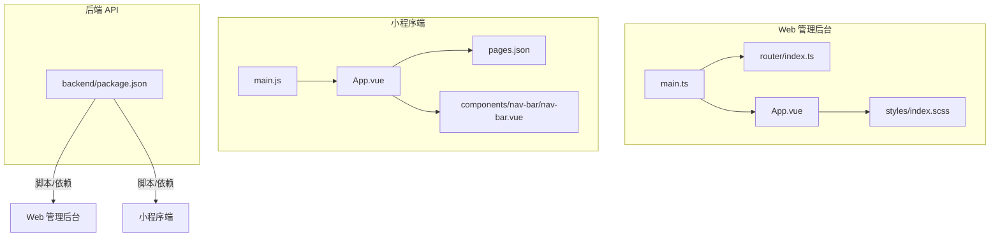
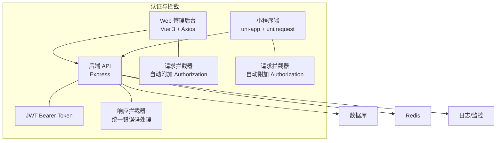
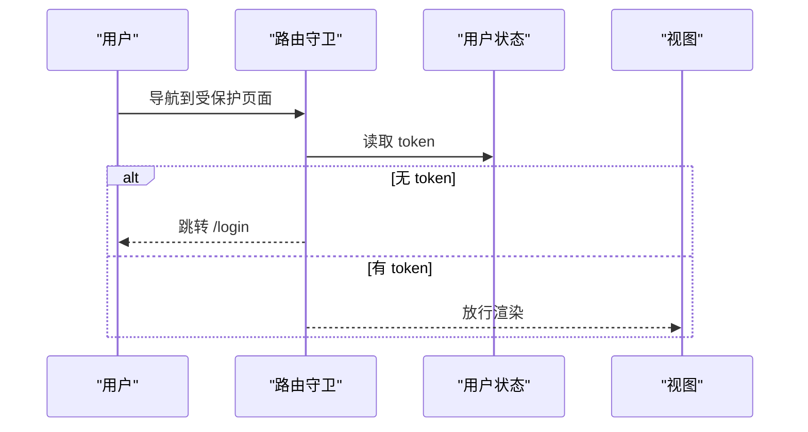
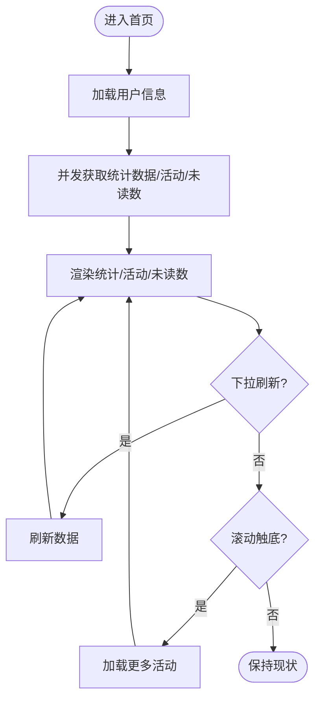
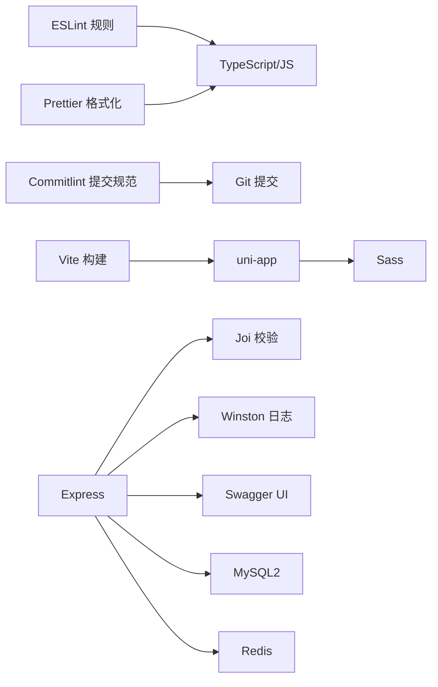

# 代码规范

<cite>
**本文引用的文件**
- [前端技术开发指导及规范.md](file://shared-docs/前端技术开发指导及规范.md)
- [eslint.config.js](file://webapp/eslint.config.js)
- [prettier.config.js](file://webapp/prettier.config.js)
- [commitlint.config.js](file://webapp/commitlint.config.js)
- [package.json](file://backend/package.json)
- [package.json](file://miniapp/package.json)
- [main.ts](file://webapp/src/main.ts)
- [main.js](file://miniapp/src/main.js)
- [App.vue](file://webapp/src/App.vue)
- [App.vue](file://miniapp/src/App.vue)
- [router/index.ts](file://webapp/src/router/index.ts)
- [pages.json](file://miniapp/src/pages.json)
- [AppHeader/index.vue](file://webapp/src/components/AppHeader/index.vue)
- [nav-bar/nav-bar.vue](file://miniapp/src/components/nav-bar/nav-bar.vue)
- [styles/index.scss](file://webapp/src/styles/index.scss)
- [uni.scss](file://miniapp/src/uni.scss)
- [approval/index.vue](file://webapp/src/views/approval/index.vue)
- [home/index.vue](file://miniapp/src/pages/home/index.vue)
</cite>

## 目录
1. 引言
2. 项目结构
3. 核心组件
4. 架构总览
5. 详细组件分析
6. 依赖关系分析
7. 性能考量
8. 故障排查指南
9. 结论
10. 附录

## 引言
本文件为“智慧办公助手 OA 系统”的代码规范文档，覆盖 JavaScript/Node.js 后端、Vue.js 前端（Web 管理后台与 uni-app 小程序）、CSS/SCSS 样式以及 Git 提交规范。内容基于仓库现有配置与代码样例进行提炼与总结，旨在统一开发行为、提升代码质量与协作效率。

## 项目结构
系统由三大子工程组成：
- Web 管理后台（Vue 3 + TypeScript + Vite + Element Plus）
- 微信小程序端（uni-app + Vue 3 + Pinia + uni-ui）
- 后端 API（Node.js + Express + ESLint/Jest）

图表来源
- [main.ts:1-28](file://webapp/src/main.ts#L1-L28)
- [router/index.ts:1-77](file://webapp/src/router/index.ts#L1-L77)
- [App.vue:1-11](file://webapp/src/App.vue#L1-L11)
- [styles/index.scss:1-4](file://webapp/src/styles/index.scss#L1-L4)
- [main.js:1-11](file://miniapp/src/main.js#L1-L11)
- [App.vue:1-42](file://miniapp/src/App.vue#L1-L42)
- [pages.json:1-220](file://miniapp/src/pages.json#L1-L220)
- [nav-bar/nav-bar.vue:1-171](file://miniapp/src/components/nav-bar/nav-bar.vue#L1-L171)
- [package.json:1-58](file://backend/package.json#L1-L58)

章节来源
- [main.ts:1-28](file://webapp/src/main.ts#L1-L28)
- [router/index.ts:1-77](file://webapp/src/router/index.ts#L1-L77)
- [App.vue:1-11](file://webapp/src/App.vue#L1-L11)
- [styles/index.scss:1-4](file://webapp/src/styles/index.scss#L1-L4)
- [main.js:1-11](file://miniapp/src/main.js#L1-L11)
- [App.vue:1-42](file://miniapp/src/App.vue#L1-L42)
- [pages.json:1-220](file://miniapp/src/pages.json#L1-L220)
- [nav-bar/nav-bar.vue:1-171](file://miniapp/src/components/nav-bar/nav-bar.vue#L1-L171)
- [package.json:1-58](file://backend/package.json#L1-L58)

## 核心组件
- Web 应用入口与全局依赖注入：应用初始化、Pinia、路由、Element Plus 国际化与图标注册、全局样式引入。
- 小程序应用入口：SSR 应用创建、Pinia 注册。
- 路由守卫：区分公开路由与受保护路由，基于用户状态控制访问。
- 页面配置：小程序页面与 TabBar 的统一配置，导航栏与底部栏组件化。
- 样式体系：Web 使用 SCSS 变量与公共样式；小程序使用 uni.scss 定义主题变量与通用卡片样式。

章节来源
- [main.ts:1-28](file://webapp/src/main.ts#L1-L28)
- [main.js:1-11](file://miniapp/src/main.js#L1-L11)
- [router/index.ts:1-77](file://webapp/src/router/index.ts#L1-L77)
- [pages.json:1-220](file://miniapp/src/pages.json#L1-L220)
- [styles/index.scss:1-4](file://webapp/src/styles/index.scss#L1-L4)
- [uni.scss:1-65](file://miniapp/src/uni.scss#L1-L65)

## 架构总览
前后端分离架构，Web 管理后台与小程序端均通过统一 API 协议与错误码交互。认证采用 JWT Bearer Token，请求拦截器自动附加 Authorization 头；响应拦截器统一处理业务错误码与网络异常。

图表来源
- [frontend guide:222-294](file://shared-docs/前端技术开发指导及规范.md#L222-L294)
- [frontend guide:443-501](file://shared-docs/前端技术开发指导及规范.md#L443-L501)
- [frontend guide:373-501](file://shared-docs/前端技术开发指导及规范.md#L373-L501)

章节来源
- [前端技术开发指导及规范.md:222-294](file://shared-docs/前端技术开发指导及规范.md#L222-L294)
- [前端技术开发指导及规范.md:443-501](file://shared-docs/前端技术开发指导及规范.md#L443-L501)
- [前端技术开发指导及规范.md:373-501](file://shared-docs/前端技术开发指导及规范.md#L373-L501)

## 详细组件分析

### Web 管理后台：应用入口与路由守卫
- 应用入口负责全局依赖注入与挂载，包含 Element Plus、国际化、图标注册与全局样式。
- 路由守卫根据 meta.public 区分公开与受保护页面，未登录用户跳转登录页。
- 组件示例：头部下拉菜单、面包屑、用户信息展示。

图表来源
- [router/index.ts:59-74](file://webapp/src/router/index.ts#L59-L74)
- [AppHeader/index.vue:1-89](file://webapp/src/components/AppHeader/index.vue#L1-L89)

章节来源
- [main.ts:1-28](file://webapp/src/main.ts#L1-L28)
- [router/index.ts:1-77](file://webapp/src/router/index.ts#L1-L77)
- [AppHeader/index.vue:1-89](file://webapp/src/components/AppHeader/index.vue#L1-L89)

### 小程序端：页面与组件
- 页面配置集中于 pages.json，统一导航栏标题、自定义导航与 TabBar。
- 导航栏组件支持左侧返回、品牌标识、右侧图标与徽标；支持胶囊按钮避让。
- 首页模板包含统计区、快捷操作网格、活动列表与上拉加载/下拉刷新。

图表来源
- [pages.json:1-220](file://miniapp/src/pages.json#L1-L220)
- [nav-bar/nav-bar.vue:1-171](file://miniapp/src/components/nav-bar/nav-bar.vue#L1-L171)
- [home/index.vue:1-227](file://miniapp/src/pages/home/index.vue#L1-L227)

章节来源
- [pages.json:1-220](file://miniapp/src/pages.json#L1-L220)
- [nav-bar/nav-bar.vue:1-171](file://miniapp/src/components/nav-bar/nav-bar.vue#L1-L171)
- [home/index.vue:1-227](file://miniapp/src/pages/home/index.vue#L1-L227)

### 样式规范与组织
- Web 端：通过 styles/index.scss 组织变量与公共样式，组件内使用 scoped SCSS。
- 小程序端：通过 uni.scss 定义主题色、间距、字号、圆角等变量，并提供通用卡片样式类。

章节来源
- [styles/index.scss:1-4](file://webapp/src/styles/index.scss#L1-L4)
- [uni.scss:1-65](file://miniapp/src/uni.scss#L1-L65)

### API 规范与错误处理
- 统一响应结构与业务错误码；401 清除本地 Token 并跳转登录；403 提示无权限；其他错误码按 message 展示。
- 请求拦截器自动附加 Authorization 头；响应拦截器统一处理业务错误与网络异常。
- 列表接口统一使用 POST 以支持复杂查询参数；分页参数 page/pageSize 与响应结构统一。

章节来源
- [前端技术开发指导及规范.md:45-133](file://shared-docs/前端技术开发指导及规范.md#L45-L133)
- [前端技术开发指导及规范.md:136-220](file://shared-docs/前端技术开发指导及规范.md#L136-L220)
- [前端技术开发指导及规范.md:297-371](file://shared-docs/前端技术开发指导及规范.md#L297-L371)
- [前端技术开发指导及规范.md:373-501](file://shared-docs/前端技术开发指导及规范.md#L373-L501)

## 依赖关系分析
- Web 管理后台：ESLint + TypeScript + Vue 插件；Prettier 统一格式；Commitlint 约束提交信息。
- 小程序端：uni-app 生态、Sass 支持、Vite 构建。
- 后端：Express、Joi 校验、Winston 日志、Swagger 文档、MySQL/Redis、速率限制与 Helmet 安全中间件。

图表来源
- [eslint.config.js:1-38](file://webapp/eslint.config.js#L1-L38)
- [prettier.config.js:1-9](file://webapp/prettier.config.js#L1-L9)
- [commitlint.config.js:1-4](file://webapp/commitlint.config.js#L1-L4)
- [package.json:1-29](file://miniapp/package.json#L1-L29)
- [package.json:1-58](file://backend/package.json#L1-L58)

章节来源
- [eslint.config.js:1-38](file://webapp/eslint.config.js#L1-L38)
- [prettier.config.js:1-9](file://webapp/prettier.config.js#L1-L9)
- [commitlint.config.js:1-4](file://webapp/commitlint.config.js#L1-L4)
- [package.json:1-29](file://miniapp/package.json#L1-L29)
- [package.json:1-58](file://backend/package.json#L1-L58)

## 性能考量
- 列表加载：使用分页参数与并发请求减少首屏压力；上拉加载与下拉刷新避免全量刷新。
- 资源懒加载：路由级异步组件按需加载；图片与图标使用合适尺寸与格式。
- 样式优化：组件作用域样式避免全局污染；合理使用变量与混合减少重复计算。
- 网络层：设置合理超时时间；对上传类接口适当延长超时；统一错误提示降低重试风暴。

## 故障排查指南
- 401 未授权：检查本地 Token 是否存在与过期；确认请求拦截器是否正确附加 Authorization 头。
- 403 无权限：确认用户角色与接口权限；查看后端权限策略。
- 1001 参数校验失败：核对必填字段与类型；关注后端返回 message 的具体提示。
- 500 服务器异常：查看后端日志与监控；必要时降级前端提示。
- CORS 跨域：确认后端 CORS 白名单配置；开发环境域名需在小程序后台配置。

章节来源
- [前端技术开发指导及规范.md:136-220](file://shared-docs/前端技术开发指导及规范.md#L136-L220)
- [前端技术开发指导及规范.md:505-543](file://shared-docs/前端技术开发指导及规范.md#L505-L543)

## 结论
本规范以现有配置与代码为依据，明确了前后端交互协议、组件开发约定、样式组织方式与 Git 提交标准。建议在后续迭代中持续完善测试覆盖率与自动化检查，确保规范落地与一致性。

## 附录

### JavaScript/Node.js 编码规范要点
- 使用 ESLint + TypeScript 推荐规则；忽略测试与构建产物目录。
- 禁止显式 any；未使用变量以下划线前缀忽略；严格未使用变量规则。
- 后端脚本包含启动、开发、测试、单元测试、集成测试、代码检查与数据库初始化/迁移命令。

章节来源
- [eslint.config.js:1-38](file://webapp/eslint.config.js#L1-L38)
- [package.json:6-14](file://backend/package.json#L6-L14)

### Vue.js 组件开发规范要点
- 组件命名：使用 PascalCase；页面组件与功能组件清晰区分。
- Props 定义：明确类型、默认值与校验器；事件发射命名语义化。
- 生命周期：在 onMounted 中发起数据加载；在 onUnmounted 中清理副作用。
- 样式：组件内使用 scoped；优先使用变量与公共类名；避免深层选择器。

章节来源
- [nav-bar/nav-bar.vue:67-79](file://miniapp/src/components/nav-bar/nav-bar.vue#L67-L79)
- [home/index.vue:80-176](file://miniapp/src/pages/home/index.vue#L80-L176)
- [AppHeader/index.vue:1-89](file://webapp/src/components/AppHeader/index.vue#L1-L89)

### CSS/SCSS 样式编写规范要点
- 变量与混入：统一在 uni.scss 定义主题色、间距、字号、圆角；Web 端通过 index.scss 组织。
- 选择器命名：语义化类名；避免过深嵌套；组件内样式使用 scoped。
- 响应式：小程序端使用 rpx；Web 端使用 rem/em 或媒体查询；保持一致的断点策略。

章节来源
- [uni.scss:1-65](file://miniapp/src/uni.scss#L1-L65)
- [styles/index.scss:1-4](file://webapp/src/styles/index.scss#L1-L4)

### Git 提交规范与分支管理
- 提交信息：采用 Conventional Commits；通过 commitlint 校验。
- 分支策略：主干保护；特性分支以 feature/ 开头；修复分支以 fix/ 开头；热修复以 hotfix/ 开头。
- 代码审查：PR 必须通过 CI 与至少一名 reviewer 通过；提交前运行 Lint 与格式化工具。

章节来源
- [commitlint.config.js:1-4](file://webapp/commitlint.config.js#L1-L4)