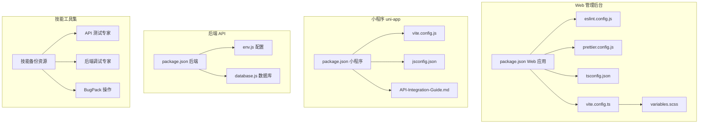
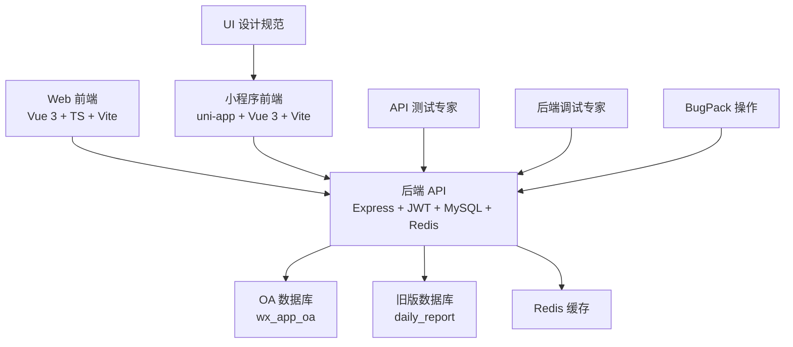
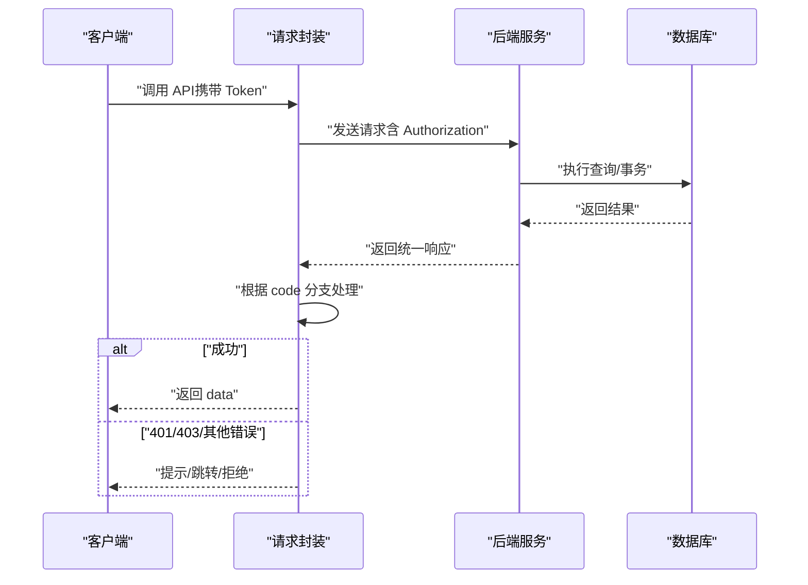
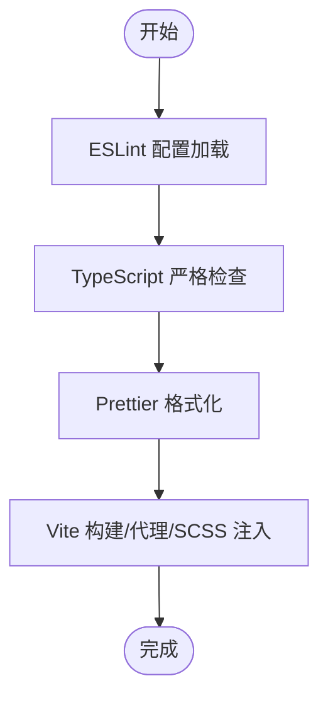
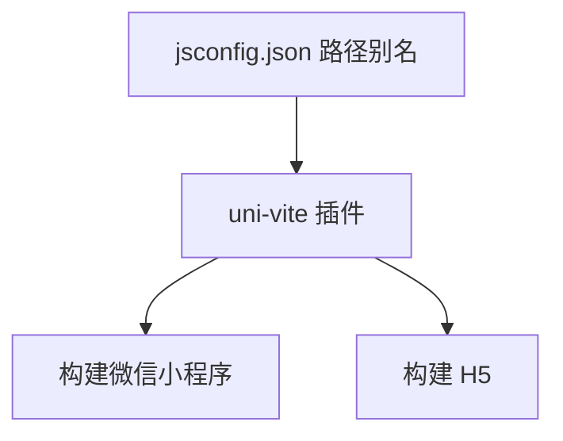
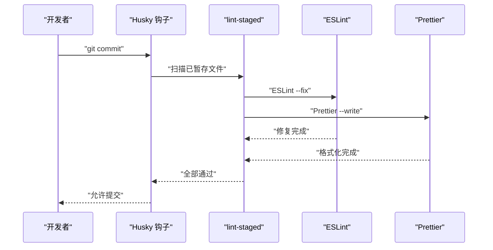
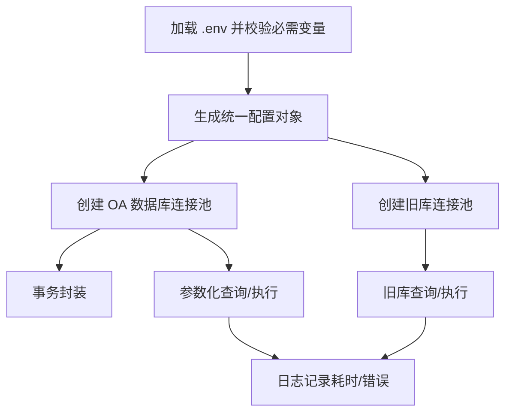
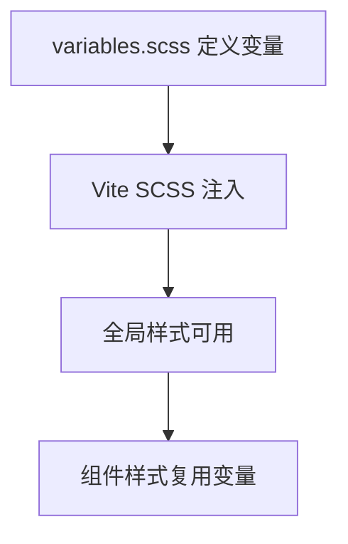
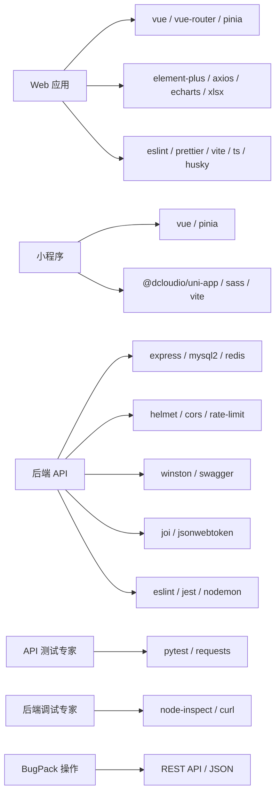

# 开发规范

<cite>
**本文引用的文件**
- [前端技术开发指导及规范.md](file://shared-docs/前端技术开发指导及规范.md)
- [Tech-Plan.md](file://shared-docs/Tech-Plan.md)
- [overview.md](file://shared-docs/overview.md)
- [HANDOVER.md](file://shared-docs/HANDOVER.md)
- [SKILL.md](file://skill-backup/SKILL.md)
- [colors.md](file://skill-backup/references/colors.md)
- [SKILL.md](file://skill/api-testing-expert/SKILL.md)
- [SKILL.md](file://skill/backend-debug/SKILL.md)
- [SKILL.md](file://skill/bugpack-operations/SKILL.md)
- [eslint.config.js](file://webapp/eslint.config.js)
- [prettier.config.js](file://webapp/prettier.config.js)
- [tsconfig.json](file://webapp/tsconfig.json)
- [jsconfig.json](file://miniapp/jsconfig.json)
- [package.json（Web 应用）](file://webapp/package.json)
- [package.json（小程序）](file://miniapp/package.json)
- [commitlint.config.js](file://webapp/commitlint.config.js)
- [vite.config.ts（Web 应用）](file://webapp/vite.config.ts)
- [vite.config.js（小程序）](file://miniapp/vite.config.js)
- [env.js（后端配置）](file://backend/src/common/config/env.js)
- [database.js（后端数据库）](file://backend/src/common/config/database.js)
- [variables.scss（Web 样式变量）](file://webapp/src/styles/variables.scss)
- [API-Integration-Guide.md（小程序）](file://miniapp/API-Integration-Guide.md)
</cite>

## 更新摘要
**所做更改**
- 新增完整的前端技术开发指导规范，涵盖 API 接入、错误码处理、认证头传递等核心规范
- 新增技能备份资源，包括微信小程序设计规范和色彩系统详细说明
- 新增技术规划文档，提供完整的后端模块设计和前端对接方案
- 新增技能工具集，包括 API 测试专家、后端调试专家、BugPack 操作技能
- 完善项目交接文档，提供详细的架构说明和部署指导

## 目录
1. [引言](#引言)
2. [项目结构](#项目结构)
3. [核心组件](#核心组件)
4. [架构总览](#架构总览)
5. [详细组件分析](#详细组件分析)
6. [依赖分析](#依赖分析)
7. [性能考虑](#性能考虑)
8. [故障排查指南](#故障排查指南)
9. [结论](#结论)
10. [附录](#附录)

## 引言
本开发规范面向"智慧办公助手 OA"系统的前端与后端团队，覆盖 JavaScript/Node.js 编码规范、Vue.js 组件开发规范、CSS/SCSS 样式规范、Git 提交规范、设计规范与工程化配置。文档同时总结了项目的技术决策与架构约束，包括模块划分原则、命名约定、文件组织结构、注释规范、代码审查标准、性能优化与安全实践，并给出开发工具配置与团队协作流程的最佳实践。

**更新** 本次更新完全重构了前端开发指导规范，新增了详细的 API 接入规范、错误码处理规范和认证头传递规范，完善了工程化配置标准。同时新增了技能备份资源、技术规划文档和技能工具集，为团队提供了更全面的开发指导和技术支持。

## 项目结构
项目由四大子系统构成：
- Web 管理后台（Vue 3 + TypeScript + Vite + Element Plus）
- 微信小程序（uni-app + Vue 3 + Vite 插件）
- 后端 API（Node.js + Express + MySQL + Redis + JWT）
- 技能工具集（API 测试、后端调试、Bug 管理）

**图表来源**
- [package.json（Web 应用）:1-53](file://webapp/package.json#L1-L53)
- [package.json（小程序）:1-29](file://miniapp/package.json#L1-L29)
- [package.json（后端）:1-60](file://backend/package.json#L1-L60)
- [SKILL.md:1-334](file://skill-backup/SKILL.md#L1-L334)
- [SKILL.md:1-160](file://skill/api-testing-expert/SKILL.md#L1-L160)
- [SKILL.md:1-388](file://skill/backend-debug/SKILL.md#L1-L388)
- [SKILL.md:1-316](file://skill/bugpack-operations/SKILL.md#L1-L316)

**章节来源**
- [package.json（Web 应用）:1-53](file://webapp/package.json#L1-L53)
- [package.json（小程序）:1-29](file://miniapp/package.json#L1-L29)
- [package.json（后端）:1-60](file://backend/package.json#L1-L60)

## 核心组件
本节聚焦前后端关键配置与规范，形成统一的工程化基线。

- **统一 API 规范与错误码处理（前端）**
  - 统一响应结构、HTTP 方法使用、分页请求/响应、认证头传递、错误码映射与处理策略详见共享文档。
- **ESLint + Prettier + TypeScript（Web）**
  - 使用 flat 配置，启用 Vue/TS 推荐规则；禁用多词组件名强制、宽松未使用变量规则；TypeScript 严格模式与路径别名配置。
- **Git 提交规范（Web）**
  - 使用 Conventional Commits，结合 Husky 与 lint-staged 在提交前进行 ESLint 与 Prettier 校验。
- **构建与代理（Web/小程序）**
  - Web 使用 Vite，配置 SCSS 变量注入与 API 代理；小程序使用 uni-vite 插件，统一路径别名。
- **后端配置与数据库**
  - 环境变量集中校验与读取，支持 OA 与旧库双连接池、事务封装、日志记录与健康探测。
- **技能备份资源**
  - 微信小程序设计规范、色彩系统详细说明、图标规范等完整 UI 设计资源。
- **技术规划与实施**
  - 完整的技术方案、模块设计、接口定义和实施路线图。

**更新** 新增了完整的前端技术开发指导规范，包括 API 接入、错误码处理、认证头传递等详细规范。同时新增了技能备份资源和完整的技术规划文档。

**章节来源**
- [前端技术开发指导及规范.md:1-548](file://shared-docs/前端技术开发指导及规范.md#L1-L548)
- [Tech-Plan.md:1-800](file://shared-docs/Tech-Plan.md#L1-L800)
- [SKILL.md:1-334](file://skill-backup/SKILL.md#L1-L334)
- [colors.md:1-90](file://skill-backup/references/colors.md#L1-L90)

## 架构总览
系统采用"前端（Web + 小程序）+ 后端 API + 数据库/缓存 + 技能工具集"的四层架构。前端通过统一 API 约定与认证头访问后端，后端通过配置模块加载环境变量，数据库连接池与事务封装保证数据一致性与性能。技能工具集提供测试、调试和项目管理支持。

**图表来源**
- [package.json（Web 应用）:1-53](file://webapp/package.json#L1-L53)
- [package.json（小程序）:1-29](file://miniapp/package.json#L1-L29)
- [package.json（后端）:1-60](file://backend/package.json#L1-L60)
- [SKILL.md:1-160](file://skill/api-testing-expert/SKILL.md#L1-L160)
- [SKILL.md:1-388](file://skill/backend-debug/SKILL.md#L1-L388)
- [SKILL.md:1-316](file://skill/bugpack-operations/SKILL.md#L1-L316)
- [SKILL.md:1-334](file://skill-backup/SKILL.md#L1-L334)

## 详细组件分析

### 前端统一 API 与错误码规范（Web + 小程序）
- **统一响应结构与业务状态码**
  - 成功/失败/列表/空数据等典型响应形态与字段含义明确。
- **HTTP 方法与参数传递**
  - 列表查询统一使用 POST，支持复杂筛选；请求头统一 JSON 与 Accept。
- **认证与 Token 管理**
  - JWT Bearer Token，拦截器自动附加；401 清理 Token 并跳转登录。
- **分页与超时**
  - 统一分页参数与响应结构；不同接口类型设置合理超时。
- **数据格式约定**
  - 日期、金额、百分比、状态枚举等统一格式。

**图表来源**
- [前端技术开发指导及规范.md:47-206](file://shared-docs/前端技术开发指导及规范.md#L47-L206)

**章节来源**
- [前端技术开发指导及规范.md:45-548](file://shared-docs/前端技术开发指导及规范.md#L45-L548)

### Web 工程化配置（ESLint + Prettier + TypeScript + Vite）
- **ESLint**
  - 使用 flat 配置，启用 Vue/TS 推荐规则；忽略 dist/coverage/node_modules；对未使用变量放宽规则（支持下划线前缀）。
- **Prettier**
  - 关闭分号、单引号、尾随逗号、设定打印宽度与缩进、按平台换行。
- **TypeScript**
  - 严格模式、路径别名 @/* 指向 src；noUnusedLocals/Parameters、noFallthroughCasesInSwitch 等严格选项。
- **Vite**
  - 别名 @；SCSS 注入 variables.scss；开发服务器端口与代理 /api 指向生产后端。

**图表来源**
- [eslint.config.js:1-38](file://webapp/eslint.config.js#L1-L38)
- [prettier.config.js:1-9](file://webapp/prettier.config.js#L1-L9)
- [tsconfig.json:1-26](file://webapp/tsconfig.json#L1-L26)
- [vite.config.ts（Web 应用）:1-33](file://webapp/vite.config.ts#L1-L33)

**章节来源**
- [eslint.config.js:1-38](file://webapp/eslint.config.js#L1-L38)
- [prettier.config.js:1-9](file://webapp/prettier.config.js#L1-L9)
- [tsconfig.json:1-26](file://webapp/tsconfig.json#L1-L26)
- [vite.config.ts（Web 应用）:1-33](file://webapp/vite.config.ts#L1-L33)

### 小程序工程化配置（uni-app + Vite）
- **路径别名**
  - jsconfig.json 配置 baseUrl 与 @/* 路径映射，类型声明包含 uni 类型。
- **构建脚本**
  - 支持微信小程序与 H5 双端构建；依赖 @dcloudio/uni-app 生态。
- **Vite 插件**
  - 使用 uni 插件，统一别名与构建流程。

**图表来源**
- [jsconfig.json:1-14](file://miniapp/jsconfig.json#L1-L14)
- [vite.config.js（小程序）:1-13](file://miniapp/vite.config.js#L1-L13)
- [package.json（小程序）:1-29](file://miniapp/package.json#L1-L29)

**章节来源**
- [jsconfig.json:1-14](file://miniapp/jsconfig.json#L1-L14)
- [vite.config.js（小程序）:1-13](file://miniapp/vite.config.js#L1-L13)
- [package.json（小程序）:1-29](file://miniapp/package.json#L1-L29)

### Git 提交规范与代码审查
- **提交信息规范**
  - 使用 Conventional Commits，结合 commitlint 与 husky 在提交前校验。
- **提交前检查**
  - lint-staged 对 staged 文件执行 ESLint 修复与 Prettier 写入，避免污染历史。
- **代码审查要点**
  - 优先关注：API 约定一致性、错误码处理、认证头传递、分页实现、样式变量复用、数据库事务边界、环境变量完整性与安全性。

**图表来源**
- [commitlint.config.js:1-4](file://webapp/commitlint.config.js#L1-L4)
- [package.json（Web 应用）:46-51](file://webapp/package.json#L46-L51)

**章节来源**
- [commitlint.config.js:1-4](file://webapp/commitlint.config.js#L1-L4)
- [package.json（Web 应用）:1-53](file://webapp/package.json#L1-L53)

### 后端配置与数据库
- **环境变量**
  - 启动时校验必需变量（数据库、Redis、JWT、微信等），统一导出配置对象，含默认值兜底。
- **数据库连接池**
  - OA 与旧库双连接池，参数化查询与执行，日志记录耗时与错误；事务封装 begin/commit/rollback；健康探测。
- **安全与中间件**
  - 依赖 helmet、cors、rate-limit 等增强安全与稳定性（参考后端依赖）。

**图表来源**
- [env.js（后端配置）:1-118](file://backend/src/common/config/env.js#L1-L118)
- [database.js（后端数据库）:1-222](file://backend/src/common/config/database.js#L1-L222)

**章节来源**
- [env.js（后端配置）:1-118](file://backend/src/common/config/env.js#L1-L118)
- [database.js（后端数据库）:1-222](file://backend/src/common/config/database.js#L1-L222)

### 样式与设计规范
- **主题与功能色**
  - 定义高效蓝为主色，辅以成功/警告/危险/信息色；文字、边框、背景、字号、间距、圆角、阴影等变量集中管理。
- **CSS 变量注入**
  - Web 通过 Vite 的 SCSS additionalData 注入变量，确保全局可用。
- **组件设计原则**
  - 保持视觉一致、语义清晰、交互可预期；复用样式变量，避免硬编码颜色与尺寸。

**图表来源**
- [variables.scss（Web 样式变量）:1-83](file://webapp/src/styles/variables.scss#L1-L83)
- [vite.config.ts（Web 应用）:14-20](file://webapp/vite.config.ts#L14-L20)

**章节来源**
- [variables.scss（Web 样式变量）:1-83](file://webapp/src/styles/variables.scss#L1-L83)
- [vite.config.ts（Web 应用）:1-33](file://webapp/vite.config.ts#L1-L33)

### 前端技术开发指导规范
**更新** 新增完整的前端技术开发指导规范，涵盖 API 接入、错误码处理、认证头传递等核心规范。

- **API 接入规范**
  - 统一响应格式：{ code, message, data }
  - HTTP 方法使用：GET 查询、POST 创建/复杂查询、PUT 更新、DELETE 删除
  - 请求参数传递：URL Path、Request Body、Query String、Header
- **错误码处理规范**
  - 成功：code=0，message="success"
  - 认证错误：401 Token 过期，清除本地 Token 跳转登录
  - 权限错误：403 无权限访问
  - 参数错误：1001 参数校验失败
  - 业务错误：2001 业务逻辑错误
  - 服务器错误：500 服务器内部错误
- **认证头传递规范**
  - JWT Bearer Token 格式：Authorization: Bearer <token>
  - Token 存储：小程序使用 uni.setStorageSync，Web 使用 localStorage
  - 免认证接口：/api/auth/login、/api/health、/api-docs
- **分页请求与响应规范**
  - 请求参数：page（默认1）、pageSize（默认20，最大100）
  - 响应格式：{ code, message, data: { total, list } }

**章节来源**
- [前端技术开发指导及规范.md:1-548](file://shared-docs/前端技术开发指导及规范.md#L1-L548)

### 技术规划与实施
**更新** 新增完整的技术规划文档，提供详细的模块设计和实施路线图。

- **技术可行性分析**
  - 全部使用现有技术栈（Node.js + Express + MySQL + uni-app），无新技术引入
  - 后端模块化分层（controller/service/route），前端 API 层统一封装
  - 数据兼容性需注意，daily_reports 表字段少于前端表单字段
- **后端新增模块设计**
  - Stats 模块：首页统计、最近动态、个人中心统计
  - Review 模块：审核列表、详情、操作、统计
  - 参数映射：tab→status、type→typeId、approve→approved
- **前端对接方案**
  - 移除 mock 逻辑，替换为 dev-mode-token 统一处理
  - 首页改造：stats/activities/unread → API 调用
  - 页面改造：全部 14 个页面已对接后端，零假数据

**章节来源**
- [Tech-Plan.md:1-800](file://shared-docs/Tech-Plan.md#L1-L800)

### 技能备份资源
**更新** 新增完整的技能备份资源，包括微信小程序设计规范和色彩系统详细说明。

- **微信小程序设计规范**
  - 弹性盒子优先（Flex-First），所有容器必须使用弹性盒子布局
  - 页面布局：首页（含 TabBar）、列表页（无 TabBar）、详情/编辑页（含底部操作栏）
  - 导航栏 NavBar：高度 44px，背景 #FFFFFF，标题 17px SemiBold #333333
  - 底部导航栏 TabBar：高度 50px，等宽分布，图标 28px SVG
- **色彩系统详细说明**
  - 主色：高效蓝 #2B6DE8，成功绿 #22C55E，警告橙 #F59E0B
  - 中性色：标题文字 #333333，次要文字 #666666，辅助文字 #999999
  - 图标背景色板：功能中心 9 色，NavBar 按钮背景 #F5F5F5

**章节来源**
- [SKILL.md:1-334](file://skill-backup/SKILL.md#L1-L334)
- [colors.md:1-90](file://skill-backup/references/colors.md#L1-L90)

### 技能工具集
**更新** 新增完整的技能工具集，提供测试、调试和项目管理支持。

- **API 测试专家**
  - 文档优先原则：API 文档是测试的唯一真相
  - 测试脚本共享：phase{N}_test/tests/ 共享脚本跨轮次复用
  - Bug 生命周期管理：Fully fixed → Close bug，Partially fixed → Reopen Original Bug
- **后端调试专家**
  - DEBUG 工作流：信息收集 → 根因分析 → 修复实现 → 验证 → 文档
  - 常见问题模式：配置问题、数据库问题、API 问题、服务问题
  - 调试技巧：添加日志、使用调试器、隔离问题
- **BugPack 操作技能**
  - Bug 管理：提交新 Bug、查看 Bug 列表、更新 Bug 状态
  - 状态流转：pending → fixed → closed
  - 项目管理：获取项目列表、查看项目详情

**章节来源**
- [SKILL.md:1-160](file://skill/api-testing-expert/SKILL.md#L1-L160)
- [SKILL.md:1-388](file://skill/backend-debug/SKILL.md#L1-L388)
- [SKILL.md:1-316](file://skill/bugpack-operations/SKILL.md#L1-L316)

## 依赖分析
- **Web 应用**
  - 依赖：vue、vue-router、pinia、element-plus、axios、echarts、xlsx；开发依赖：eslint、prettier、vite、typescript、husky、lint-staged 等。
- **小程序**
  - 依赖：vue、pinia；开发依赖：@dcloudio/uni-app 生态、sass、vite。
- **后端**
  - 依赖：express、mysql2、redis、helmet、cors、joi、jsonwebtoken、winston、swagger 等；开发依赖：eslint、jest、nodemon。
- **技能工具**
  - API 测试：pytest、requests、markdown
  - 后端调试：node-inspect、curl、docker
  - Bug 管理：REST API、JSON 格式

**图表来源**
- [package.json（Web 应用）:1-53](file://webapp/package.json#L1-L53)
- [package.json（小程序）:1-29](file://miniapp/package.json#L1-L29)
- [package.json（后端）:1-60](file://backend/package.json#L1-L60)
- [SKILL.md:1-160](file://skill/api-testing-expert/SKILL.md#L1-L160)
- [SKILL.md:1-388](file://skill/backend-debug/SKILL.md#L1-L388)
- [SKILL.md:1-316](file://skill/bugpack-operations/SKILL.md#L1-L316)

**章节来源**
- [package.json（Web 应用）:1-53](file://webapp/package.json#L1-L53)
- [package.json（小程序）:1-29](file://miniapp/package.json#L1-L29)
- [package.json（后端）:1-60](file://backend/package.json#L1-L60)

## 性能考虑
- **前端**
  - 合理设置请求超时；分页加载与懒加载；避免重复渲染；使用 Pinia 精准状态管理；Element Plus 按需引入减少体积。
- **后端**
  - 连接池参数与队列限制；参数化 SQL 防注入与提升缓存命中；事务最小化；日志分级与采样。
- **构建**
  - Vite 快速冷启动与热更新；按需引入与 Tree Shaking；TypeScript 编译优化。
- **技能工具**
  - API 测试并发执行；后端调试最小化影响；Bug 管理自动化流程。

## 故障排查指南
- **常见错误码与处理**
  - 401：清理 Token 并跳转登录；403：提示无权限；1001：参数校验失败；2001：业务逻辑错误；2002/2003：业务冲突（静默刷新）；500：服务器繁忙。
- **网络层异常**
  - 网络不可用、请求超时、服务不可用、限流等场景的统一提示与降级策略。
- **数据库问题**
  - 连接池耗尽、SQL 执行失败、事务回滚；检查环境变量、连接池配置与日志。
- **构建与代理**
  - Vite 代理 /api 到生产后端；路径别名与类型声明是否正确；ESLint/Prettier 是否通过。
- **技能工具问题**
  - API 测试脚本版本控制；后端调试权限配置；Bug 管理接口连通性。

**章节来源**
- [前端技术开发指导及规范.md:136-220](file://shared-docs/前端技术开发指导及规范.md#L136-L220)
- [database.js（后端数据库）:65-109](file://backend/src/common/config/database.js#L65-L109)

## 结论
本规范以统一 API 约定、严格的前端工程化配置、完善的后端配置与数据库封装为基础，结合 Git 提交规范与代码审查标准，形成可落地的开发流程与质量保障体系。新增的技能备份资源、技术规划文档和技能工具集进一步完善了开发支持体系，为团队提供了更全面的技术指导和工具支持。建议团队在日常开发中严格遵循，持续优化与演进。

**更新** 本次更新完全重构了前端开发指导规范，新增了详细的 API 接入、错误码处理、认证头传递等核心规范，完善了工程化配置标准。同时新增了技能备份资源、技术规划文档和技能工具集，为团队提供了更全面的开发指导和技术支持。

## 附录
- **团队协作流程建议**
  - 分支策略：主干保护、Feature 分支、PR 审查、CI 校验（ESLint/Prettier/测试）。
  - 版本与发布：语义化版本、变更日志、灰度发布。
  - 文档与知识沉淀：接口契约、设计文档、FAQ、交接文档。
  - 技能工具使用：API 测试专家、后端调试专家、BugPack 操作。
- **开发工具配置建议**
  - VS Code 扩展：ESLint、Prettier、Vue Language Features、SCSS IntelliSense
  - IDE 设置：启用 ESLint 自动修复、保存时格式化、TypeScript 严格模式
  - Git 配置：配置用户信息、提交模板、分支命名规范
  - 技能工具配置：API 测试环境、后端调试权限、Bug 管理接口
- **项目交接与维护**
  - 交接文档：完整的架构说明、部署指导、注意事项
  - 维护流程：新旧数据库分离、JWT 配置、Redis 连接降级
  - 后续开发：公告模块、项目管理模块、用户管理模块、Web 管理后台