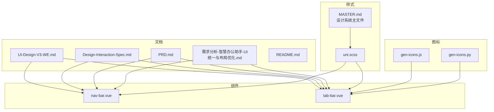
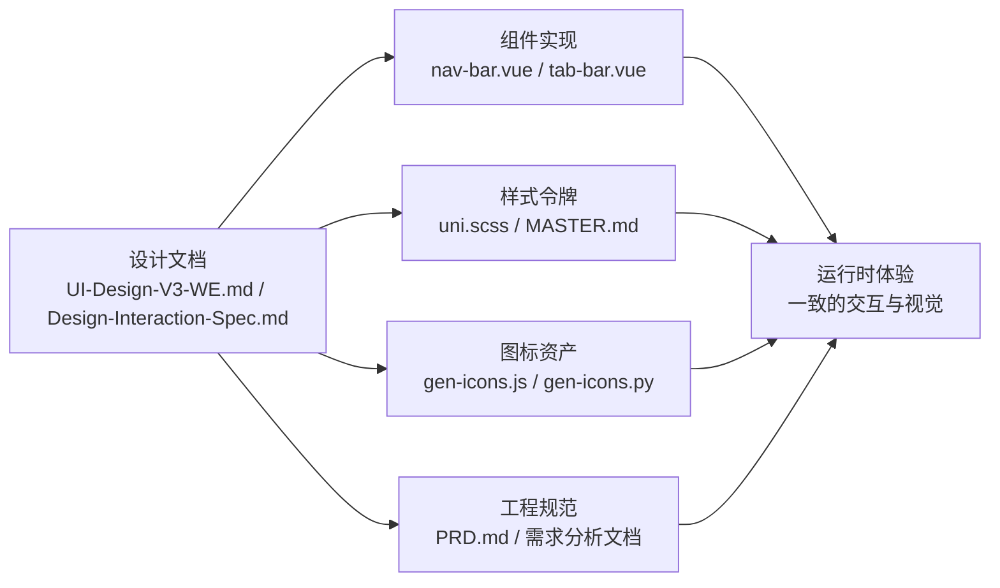
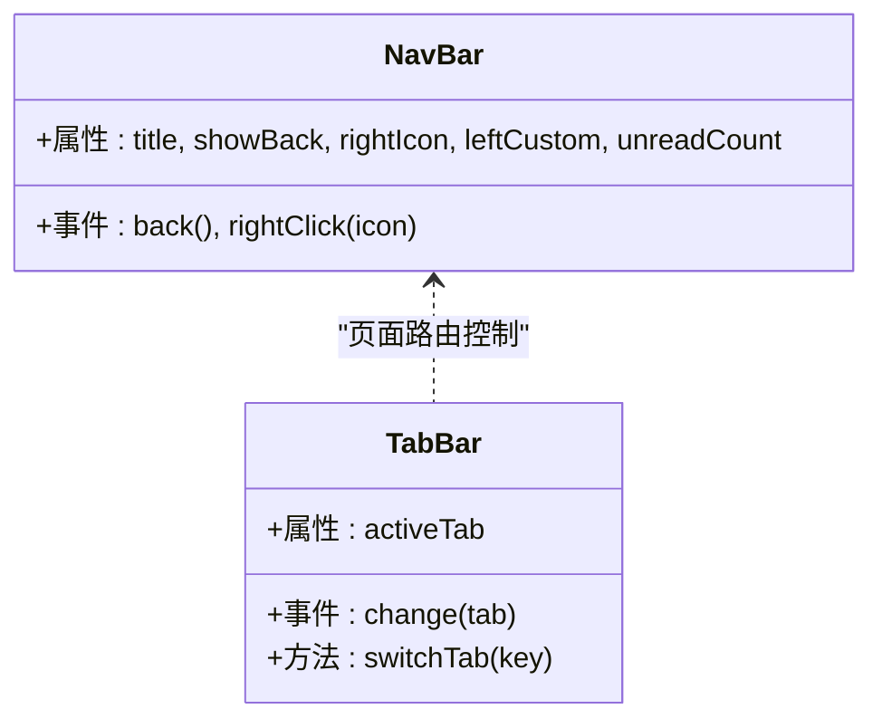
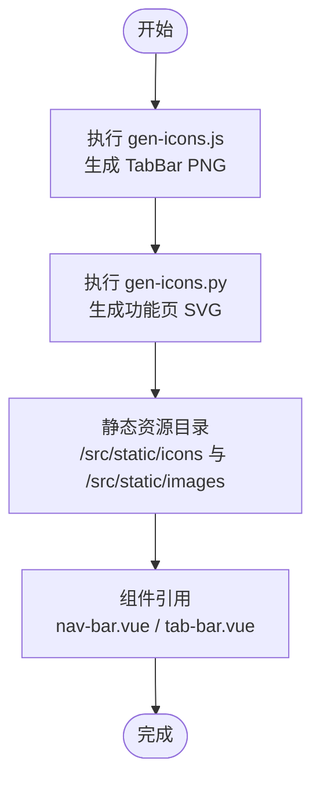
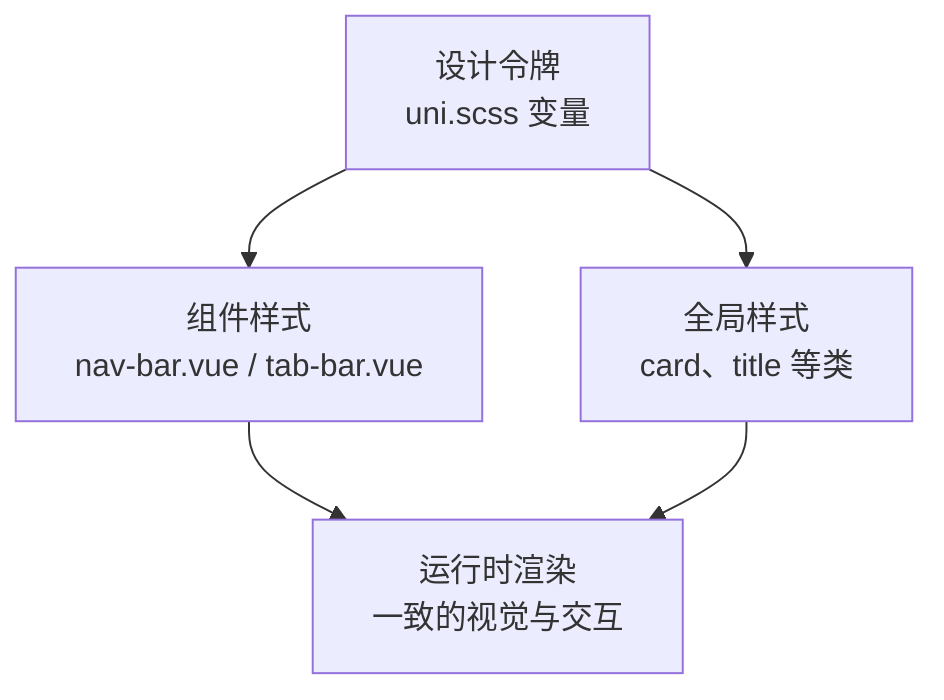
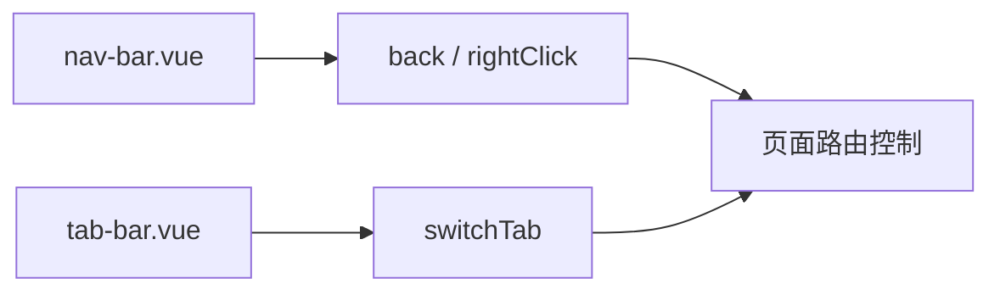

# 设计规范

<cite>
**本文档引用的文件**
- [UI-Design-V3-WE.md](file://miniapp/docs/UI-Design-V3-WE.md)
- [Design-Interaction-Spec.md](file://miniapp/docs/Design-Interaction-Spec.md)
- [PRD.md](file://miniapp/docs/PRD.md)
- [需求分析-智慧办公助手-UI统一与布局优化.md](file://miniapp/docs/需求分析-智慧办公助手-UI统一与布局优化.md)
- [README.md](file://miniapp/docs/README.md)
- [MASTER.md](file://miniapp/design-system/智慧办公助手-oa-小程序/MASTER.md)
- [uni.scss](file://miniapp/src/uni.scss)
- [nav-bar.vue](file://miniapp/src/components/nav-bar/nav-bar.vue)
- [tab-bar.vue](file://miniapp/src/components/tab-bar/tab-bar.vue)
- [gen-icons.js](file://miniapp/scripts/gen-icons.js)
- [gen-icons.py](file://miniapp/scripts/gen-icons.py)
</cite>

## 目录
1. [简介](#简介)
2. [项目结构](#项目结构)
3. [核心组件](#核心组件)
4. [架构总览](#架构总览)
5. [详细组件分析](#详细组件分析)
6. [依赖分析](#依赖分析)
7. [性能考虑](#性能考虑)
8. [故障排查指南](#故障排查指南)
9. [结论](#结论)
10. [附录](#附录)

## 简介
本设计规范面向"智慧办公助手 OA 系统"小程序端（uni-app/Vue3），旨在统一视觉语言、组件规范、交互行为与设计系统落地，确保跨页面一致的用户体验与开发效率。文档以 WE UI 浅色设计语言为基础，结合现有页面与组件实现，给出可执行的设计令牌、主题定制与组件库使用指南，并提供最佳实践与排障建议。

**更新** 本版本反映了设计系统的重大演进：删除了旧的UI设计文档，新增了UI-Design-V3-WE.md和Design-Interaction-Spec.md，以及需求分析文档，同时移除了icon-park和oa-icon组件的使用。

## 项目结构
- 文档层：UI 设计文档与交互规范文档共同构成设计基线，页面层级与组件交互关系明确。
- 组件层：顶部导航栏、底部 TabBar、图标组件等核心可复用组件已实现，具备统一的 Props/Events 与状态管理契约。
- 样式层：SCSS 变量与 uni.scss 全局样式定义了设计令牌（颜色、字体、间距、圆角、阴影等）。
- 图标层：TabBar 与功能页图标通过脚本自动生成 PNG/SVG，保证一致性与可维护性。
- 规范层：前后端对接规范、错误码处理、认证头传递、分页请求等工程规范保障设计与实现协同。

**图表来源**
- [UI-Design-V3-WE.md](file://miniapp/docs/UI-Design-V3-WE.md)
- [Design-Interaction-Spec.md](file://miniapp/docs/Design-Interaction-Spec.md)
- [PRD.md](file://miniapp/docs/PRD.md)
- [需求分析-智慧办公助手-UI统一与布局优化.md](file://miniapp/docs/需求分析-智慧办公助手-UI统一与布局优化.md)
- [README.md](file://miniapp/docs/README.md)
- [MASTER.md](file://miniapp/design-system/智慧办公助手-oa-小程序/MASTER.md)
- [uni.scss](file://miniapp/src/uni.scss)
- [nav-bar.vue](file://miniapp/src/components/nav-bar/nav-bar.vue)
- [tab-bar.vue](file://miniapp/src/components/tab-bar/tab-bar.vue)
- [gen-icons.js](file://miniapp/scripts/gen-icons.js)
- [gen-icons.py](file://miniapp/scripts/gen-icons.py)

**章节来源**
- [README.md](file://miniapp/docs/README.md)
- [UI-Design-V3-WE.md](file://miniapp/docs/UI-Design-V3-WE.md)
- [Design-Interaction-Spec.md](file://miniapp/docs/Design-Interaction-Spec.md)
- [PRD.md](file://miniapp/docs/PRD.md)

## 核心组件
- 顶部导航栏（NavBar）
  - 统一高度与布局，支持左侧品牌徽标、标题、右侧操作按钮（通知、搜索、设置、筛选）。
  - 支持返回事件与右侧图标点击事件，胶囊按钮避让与状态栏高度自适应。
- 底部 TabBar
  - 三宫格等宽布局，图标资源按激活/非激活状态切换，支持安全区底部内边距。
- 图标系统
  - TabBar 图标通过 JS/PNG 生成脚本产出；功能页图标通过 Python/SVG 生成脚本产出，确保色板与尺寸一致。
- 卡片与按钮
  - 卡片圆角、阴影、内边距与背景遵循设计令牌；按钮类型与尺寸在交互规范中明确。

**章节来源**
- [nav-bar.vue](file://miniapp/src/components/nav-bar/nav-bar.vue)
- [tab-bar.vue](file://miniapp/src/components/tab-bar/tab-bar.vue)
- [gen-icons.js](file://miniapp/scripts/gen-icons.js)
- [gen-icons.py](file://miniapp/scripts/gen-icons.py)
- [UI-Design-V3-WE.md](file://miniapp/docs/UI-Design-V3-WE.md)
- [Design-Interaction-Spec.md](file://miniapp/docs/Design-Interaction-Spec.md)

## 架构总览
设计系统以"设计文档—组件实现—样式令牌—图标资产—工程规范"为主线，形成闭环：

**图表来源**
- [UI-Design-V3-WE.md](file://miniapp/docs/UI-Design-V3-WE.md)
- [Design-Interaction-Spec.md](file://miniapp/docs/Design-Interaction-Spec.md)
- [MASTER.md](file://miniapp/design-system/智慧办公助手-oa-小程序/MASTER.md)
- [uni.scss](file://miniapp/src/uni.scss)
- [nav-bar.vue](file://miniapp/src/components/nav-bar/nav-bar.vue)
- [tab-bar.vue](file://miniapp/src/components/tab-bar/tab-bar.vue)
- [gen-icons.js](file://miniapp/scripts/gen-icons.js)
- [gen-icons.py](file://miniapp/scripts/gen-icons.py)
- [PRD.md](file://miniapp/docs/PRD.md)

## 详细组件分析

### 视觉设计系统（色彩、字体、间距、圆角、阴影）
- 色彩系统
  - 主色：高效蓝（#2B6DE8）用于按钮、Tab 激活、链接、选中态与统计数字。
  - 语义色：成功绿、警告橙、危险红、信息紫，分别对应不同业务状态。
  - 中性色：文字主色、次色、浅色、禁用色、页面背景、卡片背景、分割线、悬停背景。
  - 图标背景色板：功能中心与首页快捷入口分别提供多色背景，保持视觉节奏。
- 字体层级
  - Hero、XXL、XL、LG、Base、SM、XS、Mini 等层级，覆盖登录页、导航栏、卡片、按钮、徽标等场景。
- 间距体系
  - 从 XXS 到 XXL 的多级间距令牌，覆盖标签内边距、列表项间距、页面边距、卡片内边距等。
- 圆角规范
  - 从 XS 到 Round 的圆角令牌，覆盖标签、图标、卡片、Logo、按钮等。
- 阴影规范
  - 标准卡片阴影、登录页亮点卡片阴影、微信登录按钮阴影、Logo 阴影等。
- 过渡动画
  - 快速与常规过渡，用于 hover、缩放与 Tab 切换。

**章节来源**
- [UI-Design-V3-WE.md](file://miniapp/docs/UI-Design-V3-WE.md)

### 组件设计规范（命名、属性、事件、状态）
- 组件命名约定
  - 组件目录与文件名采用 kebab-case，如 nav-bar、tab-bar。
- 属性定义
  - nav-bar：title、showBack、rightIcon、leftCustom、unreadCount。
  - tab-bar：activeTab（home/features/profile）。
- 事件处理
  - nav-bar：back、rightClick。
  - tab-bar：change。
- 状态管理
  - 页面通过路由与 props 控制 activeTab；nav-bar 通过 emits 与父组件通信；TabBar 通过 switchTab 触发 uni.switchTab。

**图表来源**
- [nav-bar.vue](file://miniapp/src/components/nav-bar/nav-bar.vue)
- [tab-bar.vue](file://miniapp/src/components/tab-bar/tab-bar.vue)

**章节来源**
- [nav-bar.vue](file://miniapp/src/components/nav-bar/nav-bar.vue)
- [tab-bar.vue](file://miniapp/src/components/tab-bar/tab-bar.vue)
- [Design-Interaction-Spec.md](file://miniapp/docs/Design-Interaction-Spec.md)

### 图标规范（图标设计标准、使用场景、尺寸）
- 设计标准
  - TabBar 图标：28×28，线条描边，stroke-width=2，未激活#999，激活#2B6DE8。
  - 功能页图标：24×24，按功能分组设定色板，保持统一视觉密度。
- 使用场景
  - TabBar：首页、功能、我的三类 Tab。
  - 功能页：审批管理、日报、项目、资产、通知公告、数据统计、通讯录、文档中心、个人设置、安全中心、操作日志、更多。
- 尺寸规范
  - TabBar 图标：56rpx（容器）；功能页图标：24×24（SVG）；首页快捷入口图标：24×24（SVG）。
- 生成策略
  - JS 脚本生成 PNG（用于 TabBar 激活/非激活）；Python 脚本生成 SVG（功能页与设置页图标）。

**图表来源**
- [gen-icons.js](file://miniapp/scripts/gen-icons.js)
- [gen-icons.py](file://miniapp/scripts/gen-icons.py)
- [nav-bar.vue](file://miniapp/src/components/nav-bar/nav-bar.vue)
- [tab-bar.vue](file://miniapp/src/components/tab-bar/tab-bar.vue)

**章节来源**
- [gen-icons.js](file://miniapp/scripts/gen-icons.js)
- [gen-icons.py](file://miniapp/scripts/gen-icons.py)
- [UI-Design-V3-WE.md](file://miniapp/docs/UI-Design-V3-WE.md)

### 页面布局规范（响应式、断点、适配）
- 画板与适配
  - 设计稿 375×812（iPhone X 标准），rpx 换算 1px=2rpx。
  - 状态栏、NavBar、TabBar 高度与安全区底部内边距已内置。
- 页面布局公式
  - L1（含 TabBar）：Status + NavBar + Content(layoutGrow:1,FIXED) + TabBar。
  - L2（列表页）：Status + NavBar + Content(layoutGrow:1,FIXED)。
  - L3（详情/编辑页）：Status + NavBar + Content + 底部操作栏（固定高度）。
- 适配策略
  - 容器高度通过 flex 与 layoutGrow 填充，避免固定像素导致的溢出。
  - 安全区通过 env(safe-area-inset-bottom) 与胶囊按钮避让计算，确保视觉与交互安全。

**章节来源**
- [Design-Interaction-Spec.md](file://miniapp/docs/Design-Interaction-Spec.md)
- [UI-Design-V3-WE.md](file://miniapp/docs/UI-Design-V3-WE.md)

### 设计系统实现指南（设计令牌、主题定制、组件库使用）
- 设计令牌管理
  - uni.scss 定义颜色、字体、间距、圆角、阴影等 SCSS 变量，作为全局样式基础。
  - MASTER.md 提供暗色主题的全局规则（对比本项目使用的浅色 WE UI），可作为扩展参考。
- 主题定制
  - 通过修改 uni.scss 中的变量即可实现主题切换（如主色、语义色、背景与文字色）。
  - 组件样式遵循令牌命名，避免硬编码色值与尺寸。
- 组件库使用
  - 项目采用 uni-ui（官方组件库），结合自定义组件（nav-bar、tab-bar）与图标系统，形成统一组件库。
  - 图标组件：nav-bar 内置 SVG 图标与 PNG 图标；功能页图标通过 SVG 资源引用。

**图表来源**
- [uni.scss](file://miniapp/src/uni.scss)
- [MASTER.md](file://miniapp/design-system/智慧办公助手-oa-小程序/MASTER.md)
- [nav-bar.vue](file://miniapp/src/components/nav-bar/nav-bar.vue)
- [tab-bar.vue](file://miniapp/src/components/tab-bar/tab-bar.vue)

**章节来源**
- [uni.scss](file://miniapp/src/uni.scss)
- [MASTER.md](file://miniapp/design-system/智慧办公助手-oa-小程序/MASTER.md)
- [README.md](file://miniapp/docs/README.md)

## 依赖分析
- 组件耦合
  - nav-bar 与页面路由解耦，通过 emits 与父组件通信；tab-bar 通过 switchTab 触发 uni.switchTab，降低页面对组件的直接依赖。
- 外部依赖
  - uni-ui（官方组件库）提供基础 UI 能力；图标系统依赖自研脚本生成 PNG/SVG。
- 规范约束
  - 交互规范与设计文档对组件 Props/Events 与数据流进行约束，确保跨页面一致性。

**图表来源**
- [nav-bar.vue](file://miniapp/src/components/nav-bar/nav-bar.vue)
- [tab-bar.vue](file://miniapp/src/components/tab-bar/tab-bar.vue)

**章节来源**
- [Design-Interaction-Spec.md](file://miniapp/docs/Design-Interaction-Spec.md)

## 性能考虑
- 图标体积与加载
  - PNG 与 SVG 图标按需加载，避免一次性引入过多资源；SVG 可通过 sprite 或按需渲染优化。
- 样式体积
  - 通过 SCSS 变量集中管理，减少重复样式与冗余类名。
- 交互反馈
  - 过渡动画时长与缓动函数统一，避免过度动画影响性能。

## 故障排查指南
- 登录与认证
  - Token 缺失或过期：统一 401 处理，清除本地 Token 并跳转登录页。
  - 参数校验失败：显示后端返回的具体错误信息。
  - 网络异常：统一提示"网络异常，请稍后重试"，并记录错误码。
- 列表与分页
  - 分页请求参数 page/pageSize 与后端约定一致；上拉加载与下拉刷新需避免重复请求。
- 图标与资源
  - TabBar 图标缺失：检查 gen-icons.js 生成是否成功；确认静态资源路径正确。
  - 功能页图标缺失：检查 gen-icons.py 生成是否成功；确认 SVG 资源存在且路径正确。

**章节来源**
- [PRD.md](file://miniapp/docs/PRD.md)

## 结论
本设计规范以 WE UI 浅色设计语言为核心，结合现有组件与样式实现，提供了从视觉令牌到组件契约、从图标资产到工程规范的完整落地路径。建议在后续页面与组件扩展中严格遵循 Props/Events 约定与数据流设计，确保设计一致性与开发效率。

## 附录
- 设计资产清单
  - 组件：nav-bar、tab-bar、toast、confirm-dialog、empty-state、loading-overlay、image-uploader、opinion-input、person-picker、date-picker、approval-type-picker。
  - 页面：登录页、首页（工作台）、功能中心、个人中心、审批中心等。
- 交付检查清单
  - 色彩系统、字体层级、间距体系、圆角规范、阴影规范、组件规范、卡片规范、按钮规范、页面交互、页面层级地图、通用交互规范。

**章节来源**
- [README.md](file://miniapp/docs/README.md)
- [UI-Design-V3-WE.md](file://miniapp/docs/UI-Design-V3-WE.md)
- [PRD.md](file://miniapp/docs/PRD.md)