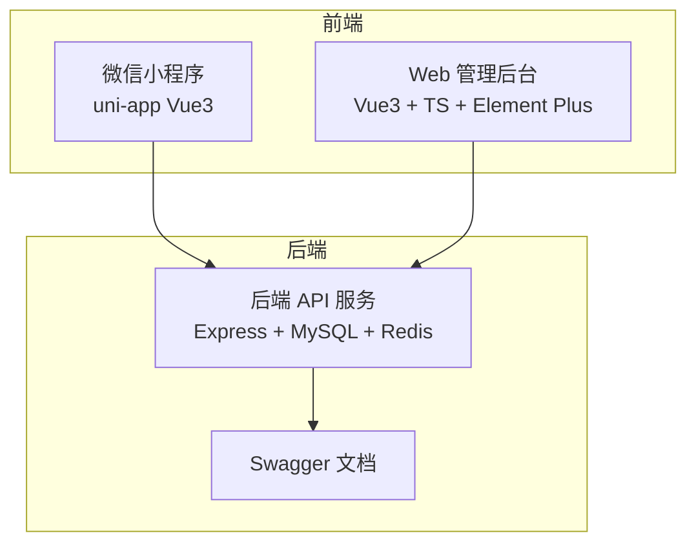
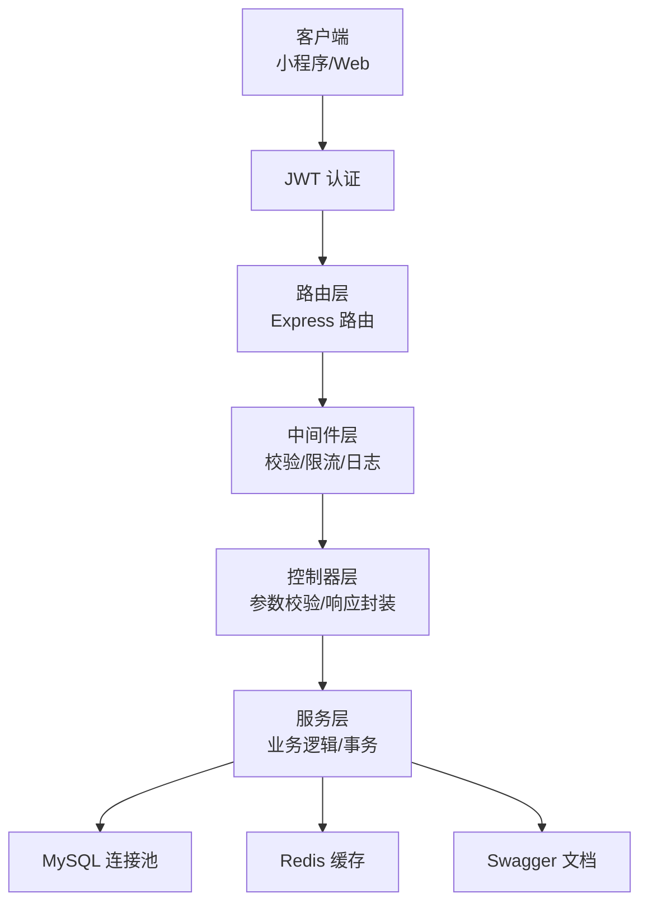
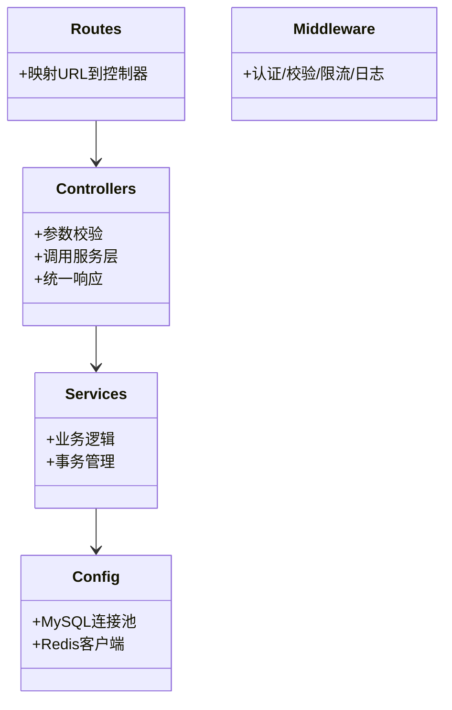
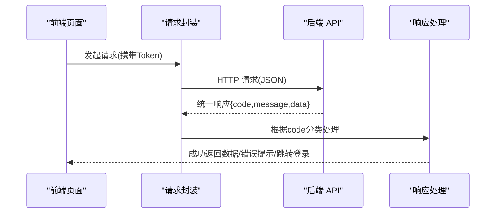
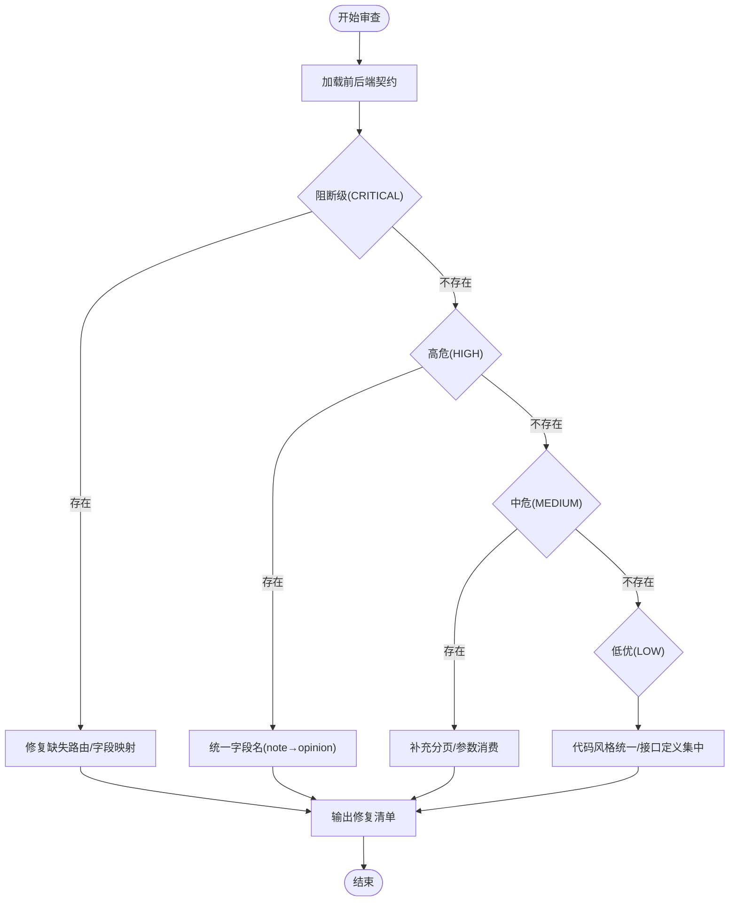
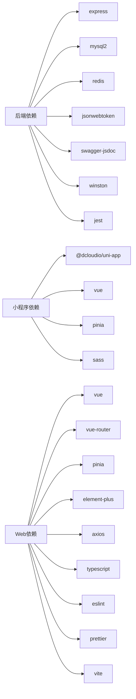

# 项目管理规范

<cite>
**本文引用的文件**
- [overview.md](file://shared-docs/overview.md)
- [HANDOVER.md](file://shared-docs/HANDOVER.md)
- [Tech-Plan.md](file://shared-docs/Tech-Plan.md)
- [api-contract-review.md](file://shared-docs/api-contract-review.md)
- [后端技术开发指导及规范.md](file://backend/docs/后端技术开发指导及规范.md)
- [后端接口文档.md](file://backend/docs/后端接口文档.md)
- [README.md（后端文档索引）](file://backend/docs/README.md)
- [README.md（小程序文档索引）](file://miniapp/docs/README.md)
- [README.md（Web文档索引）](file://webapp/docs/README.md)
- [前端技术开发指导及规范.md](file://shared-docs/前端技术开发指导及规范.md)
- [package.json（后端）](file://backend/package.json)
- [package.json（小程序）](file://miniapp/package.json)
- [package.json（Web）](file://webapp/package.json)
- [setup.js（测试配置）](file://backend/tests/setup.js)
</cite>

## 目录
1. [简介](#简介)
2. [项目结构](#项目结构)
3. [核心组件](#核心组件)
4. [架构总览](#架构总览)
5. [详细组件分析](#详细组件分析)
6. [依赖分析](#依赖分析)
7. [性能考虑](#性能考虑)
8. [故障排查指南](#故障排查指南)
9. [结论](#结论)
10. [附录](#附录)

## 简介
本文件为“智慧办公助手 OA 系统”的项目管理规范，旨在建立统一的技术决策与架构约束、模块划分原则、技术选型标准、文档管理规范、开发流程规范、变更管理流程与项目协作规范，并配套流程图与模板，帮助团队高效协作与项目推进。  
本项目采用三层架构（小程序前端 + Web 管理后台 + 后端 API 服务），技术栈稳定、文档齐全，具备完善的开发规范与测试基线。

## 项目结构
项目由三大子系统构成：
- 后端 API 服务（Node.js + Express + MySQL + Redis + Swagger）
- 微信小程序前端（uni-app Vue3）
- Web 管理后台（Vue3 + TypeScript + Element Plus）

图表来源
- [README.md（后端文档索引）:17-53](file://backend/docs/README.md#L17-L53)
- [README.md（小程序文档索引）:29-44](file://miniapp/docs/README.md#L29-L44)
- [README.md（Web文档索引）:16-31](file://webapp/docs/README.md#L16-L31)

章节来源
- [README.md（后端文档索引）:7-53](file://backend/docs/README.md#L7-L53)
- [README.md（小程序文档索引）:7-44](file://miniapp/docs/README.md#L7-L44)
- [README.md（Web文档索引）:7-31](file://webapp/docs/README.md#L7-L31)

## 核心组件
- 后端分层架构：路由层 → 中间件层 → 控制器层 → 服务层 → 数据层（MySQL/Redis）
- 前端统一请求封装：小程序端基于 uni.request，Web 端基于 Axios，统一响应格式与错误处理
- 文档体系：后端接口文档、技术开发规范、共享文档（API 接口契约审查、交接文档、技术方案）、各端文档索引

章节来源
- [后端技术开发指导及规范.md:24-181](file://backend/docs/后端技术开发指导及规范.md#L24-L181)
- [后端接口文档.md:11-54](file://backend/docs/后端接口文档.md#L11-L54)
- [README.md（后端文档索引）:7-91](file://backend/docs/README.md#L7-L91)
- [README.md（小程序文档索引）:7-134](file://miniapp/docs/README.md#L7-L134)
- [README.md（Web文档索引）:7-106](file://webapp/docs/README.md#L7-L106)

## 架构总览
- 技术栈与版本：Node.js 18.x、Express 4.x、MySQL 8.0、Redis 6.x、JWT、Swagger、Jest、ESLint/Prettier/Vite 等
- 认证与授权：JWT Bearer Token + 角色权限（employee/admin/superadmin）
- 数据库：双库策略（wx_app_oa 新库 + daily_report 旧库），跨库查询通过 oldQuery/query 组合
- 部署与运维：PM2 + Nginx（生产环境），Swagger 文档在线浏览

图表来源
- [后端技术开发指导及规范.md:28-48](file://backend/docs/后端技术开发指导及规范.md#L28-L48)
- [后端技术开发指导及规范.md:50-181](file://backend/docs/后端技术开发指导及规范.md#L50-L181)
- [后端接口文档.md:23-39](file://backend/docs/后端接口文档.md#L23-L39)

章节来源
- [后端技术开发指导及规范.md:575-617](file://backend/docs/后端技术开发指导及规范.md#L575-L617)
- [后端接口文档.md:7-72](file://backend/docs/后端接口文档.md#L7-L72)

## 详细组件分析

### 后端模块划分与职责
- 路由层：仅负责 URL 到控制器的映射，不包含业务逻辑
- 中间件层：认证、参数校验、全局错误处理、限流、CORS、Helmet
- 控制器层：参数校验、调用服务层、统一响应封装
- 服务层：业务编排、事务管理、跨模块调用
- 数据层：MySQL 连接池、Redis 客户端

图表来源
- [后端技术开发指导及规范.md:52-181](file://backend/docs/后端技术开发指导及规范.md#L52-L181)

章节来源
- [后端技术开发指导及规范.md:24-181](file://backend/docs/后端技术开发指导及规范.md#L24-L181)

### 前端统一请求与错误处理
- 统一响应格式：{ code, message, data }
- 错误码分类与前端处理策略：401 清除 Token 并跳转登录；403 无权限提示；1001 参数校验失败；2001 业务错误；500 服务器异常
- 认证头传递：Authorization: Bearer <token>
- 分页请求：统一 page/pageSize 参数；响应 data 包含 total/list

图表来源
- [前端技术开发指导及规范.md:47-124](file://shared-docs/前端技术开发指导及规范.md#L47-L124)
- [前端技术开发指导及规范.md:136-220](file://shared-docs/前端技术开发指导及规范.md#L136-L220)
- [前端技术开发指导及规范.md:222-295](file://shared-docs/前端技术开发指导及规范.md#L222-L295)

章节来源
- [前端技术开发指导及规范.md:45-295](file://shared-docs/前端技术开发指导及规范.md#L45-L295)

### API 接口契约一致性审查
- 阻断级问题：webapp 调用但后端缺失的端点（如 /api/project/list、/api/project/detail、/api/project/stats）
- 高危问题：前端字段名与后端读取字段不一致（如 reviewAction 的 note → opinion）
- 中危问题：参数未消费（如 report/list 的 keyword）、响应格式不统一（admin/users、reviewList）
- 建议修复优先级：H1 优先修复 → C1/C2/C3 新增路由 → camelCase 字段映射 → 统一分页工具

图表来源
- [api-contract-review.md:21-186](file://shared-docs/api-contract-review.md#L21-L186)

章节来源
- [api-contract-review.md:10-186](file://shared-docs/api-contract-review.md#L10-L186)

### 技术方案与模块设计
- 新增模块：Stats（首页统计/最近动态/个人中心统计）、Review（审核列表/详情/操作/统计）
- 改造模块：Approval（参数映射/抄送支持）、Report（完整字段映射/草稿/删除）、Message（字段映射）
- 前端对接：移除 mock 分支、dev-mode-token 处理、API 模块化导出

章节来源
- [Tech-Plan.md:55-280](file://shared-docs/Tech-Plan.md#L55-L280)
- [Tech-Plan.md:318-684](file://shared-docs/Tech-Plan.md#L318-L684)
- [Tech-Plan.md:687-746](file://shared-docs/Tech-Plan.md#L687-L746)

### 交付与验收
- P0 模块：认证、审批、日报、消息、统计、审核等接口完成
- P1 模块：公告、项目、用户管理、Web 管理后台
- 生产部署：PM2 + Nginx，双库分离，Swagger 在线文档

章节来源
- [HANDOVER.md:23-238](file://shared-docs/HANDOVER.md#L23-L238)
- [overview.md:1-108](file://shared-docs/overview.md#L1-L108)

## 依赖分析
- 后端依赖：Express、mysql2、redis、helmet、cors、rate-limit、joi、jsonwebtoken、swagger-jsdoc、winston、jest、eslint
- 小程序依赖：uni-app、vue、pinia、sass
- Web 依赖：vue、vue-router、pinia、element-plus、axios、echarts、typescript、eslint、prettier、vite

图表来源
- [package.json（后端）:16-35](file://backend/package.json#L16-L35)
- [package.json（小程序）:11-26](file://miniapp/package.json#L11-L26)
- [package.json（Web）:15-45](file://webapp/package.json#L15-L45)

章节来源
- [package.json（后端）:1-58](file://backend/package.json#L1-L58)
- [package.json（小程序）:1-29](file://miniapp/package.json#L1-L29)
- [package.json（Web）:1-53](file://webapp/package.json#L1-L53)

## 性能考虑
- 数据库：参数化查询、必要索引、避免 SELECT *、跨库查询使用 oldQuery/query 组合
- 缓存：Redis 可选优化，注意连接失败降级
- 接口：列表查询统一 POST + 分页参数，避免一次性返回大列表
- 日志：生产环境合理设置日志级别与文件轮转，避免磁盘压力

章节来源
- [后端技术开发指导及规范.md:620-668](file://backend/docs/后端技术开发指导及规范.md#L620-L668)
- [后端技术开发指导及规范.md:511-571](file://backend/docs/后端技术开发指导及规范.md#L511-L571)

## 故障排查指南
- 常见问题与解决：401 Token 缺失/过期、403 无权限、1001 参数校验失败、500 服务器异常、CORS 跨域
- 前端错误码处理：统一拦截与提示，401 自动跳转登录
- 后端错误处理：自定义错误类 + 全局错误中间件，区分业务错误与未知错误
- 测试基线：Jest 覆盖率阈值、测试环境变量隔离

章节来源
- [前端技术开发指导及规范.md:505-543](file://shared-docs/前端技术开发指导及规范.md#L505-L543)
- [后端技术开发指导及规范.md:431-507](file://backend/docs/后端技术开发指导及规范.md#L431-L507)
- [setup.js（测试配置）:8-24](file://backend/tests/setup.js#L8-L24)

## 结论
本项目已形成成熟的技术方案与开发规范，具备清晰的模块划分、统一的前后端对接规范与完善的测试基线。建议在后续迭代中持续完善 API 契约一致性、统一分页与响应格式、加强 Web 管理后台页面与接口补齐，并持续推进文档与知识库的维护与沉淀。

## 附录

### 项目文档管理规范
- 文档编写标准：统一格式（标题层级、表格、代码片段路径引用）、版本号与修订记录
- 版本控制策略：Git 分支模型（master/dev/feature/fix）、Commit 规范（feat/fix/docs/refactor/test/chore/perf）
- 知识库维护：共享文档集中管理，后端/前端/平台文档索引清晰，定期回顾与更新

章节来源
- [后端技术开发指导及规范.md:360-427](file://backend/docs/后端技术开发指导及规范.md#L360-L427)
- [README.md（后端文档索引）:67-91](file://backend/docs/README.md#L67-L91)
- [README.md（小程序文档索引）:109-134](file://miniapp/docs/README.md#L109-L134)
- [README.md（Web文档索引）:82-106](file://webapp/docs/README.md#L82-L106)

### 开发流程规范
- 需求评审：PRD 与技术方案对齐，明确验收标准
- 设计评审：接口契约一致性审查，跨端对齐
- 代码审查：统一编码规范、中间件与错误处理、JSDoc 注释
- 测试流程：单元测试 + 集成测试，覆盖率阈值与测试环境隔离

章节来源
- [api-contract-review.md:180-186](file://shared-docs/api-contract-review.md#L180-L186)
- [后端技术开发指导及规范.md:251-356](file://backend/docs/后端技术开发指导及规范.md#L251-L356)
- [后端接口文档.md:11-54](file://backend/docs/后端接口文档.md#L11-L54)

### 变更管理流程
- 需求变更：需求评审 → 技术方案 → 设计评审 → 接口契约审查 → 开发与测试 → 验收
- 技术变更：影响评估 → 风险矩阵 → 降级方案 → 回滚预案 → 发布
- 发布变更：灰度发布（可选）→ 全量发布 → 监控与回滚

章节来源
- [Tech-Plan.md:44-52](file://shared-docs/Tech-Plan.md#L44-L52)
- [HANDOVER.md:204-211](file://shared-docs/HANDOVER.md#L204-L211)

### 项目协作规范
- 团队沟通：每日站会（建议）、评审会议（需求/设计/代码）、问题升级机制
- 任务分配：基于模块职责与能力分工，明确 Owner 与协作者
- 进度跟踪：里程碑与验收清单（P0/P1）、API 覆盖矩阵、缺陷跟踪

章节来源
- [overview.md:64-108](file://shared-docs/overview.md#L64-L108)
- [HANDOVER.md:241-263](file://shared-docs/HANDOVER.md#L241-L263)