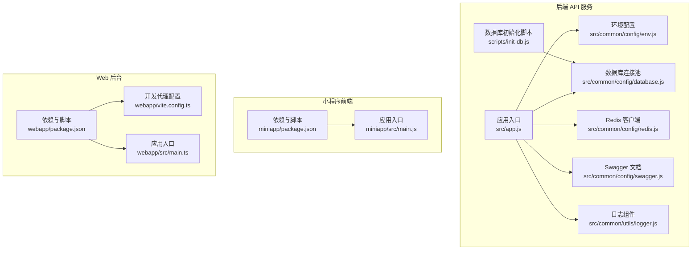
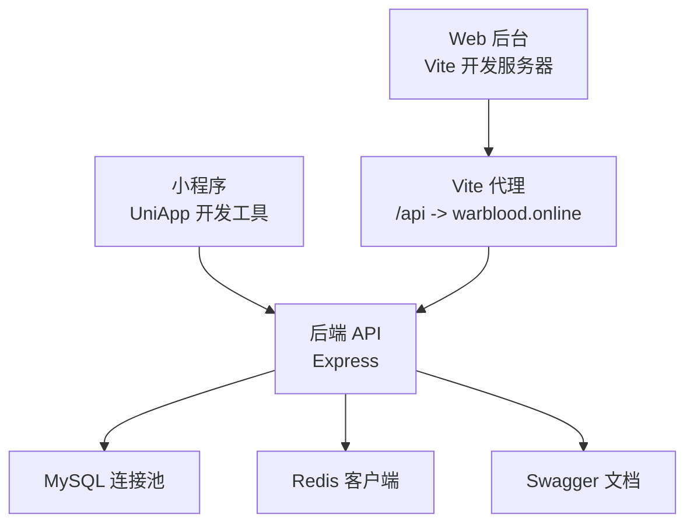
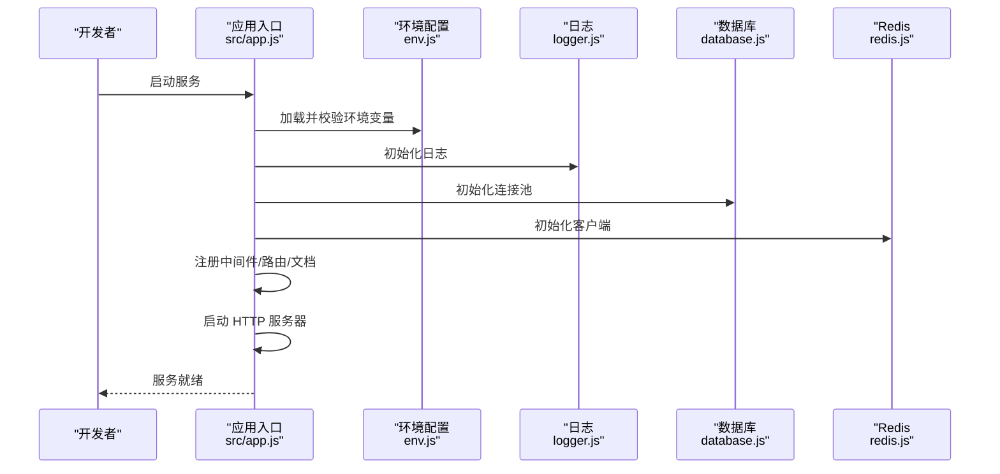
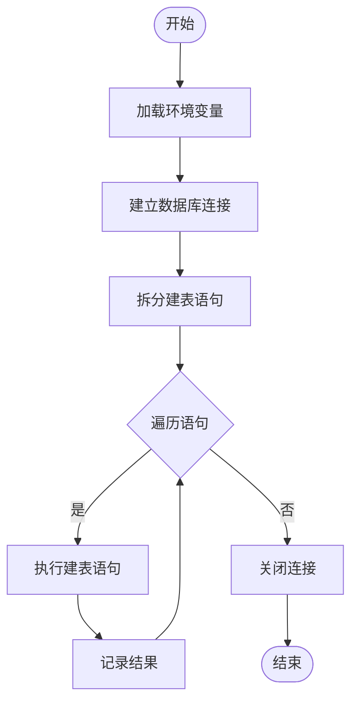
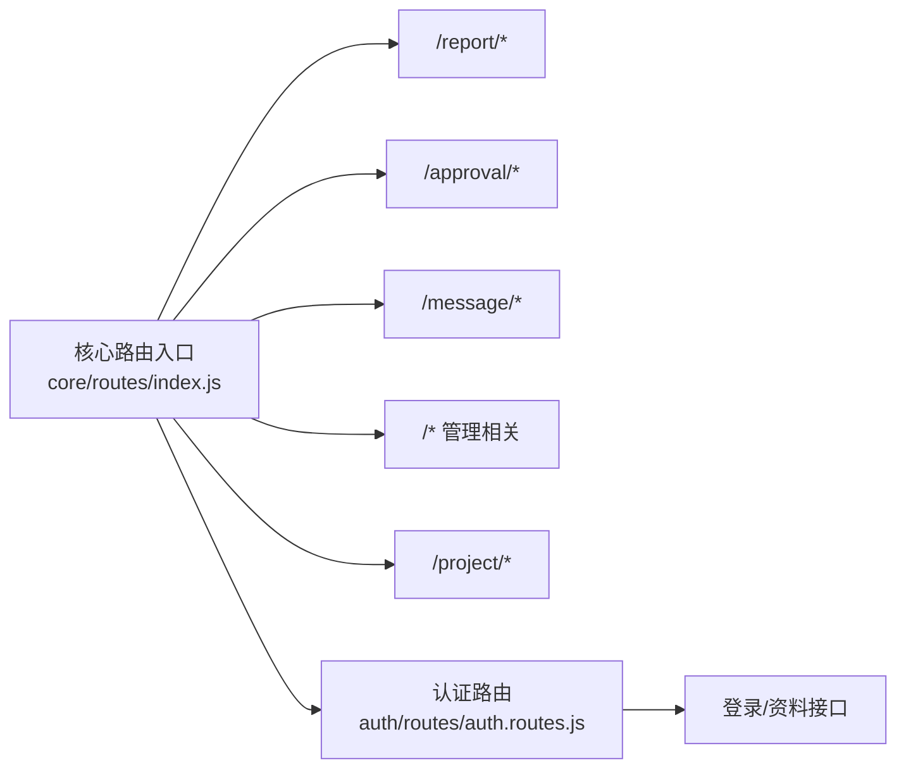
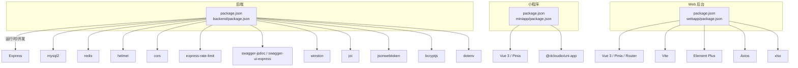

# 快速开始

<cite>
**本文引用的文件**
- [backend/package.json](file://backend/package.json)
- [backend/src/app.js](file://backend/src/app.js)
- [backend/src/common/config/env.js](file://backend/src/common/config/env.js)
- [backend/src/common/config/database.js](file://backend/src/common/config/database.js)
- [backend/src/common/config/redis.js](file://backend/src/common/config/redis.js)
- [backend/src/common/config/swagger.js](file://backend/src/common/config/swagger.js)
- [backend/src/common/utils/logger.js](file://backend/src/common/utils/logger.js)
- [backend/scripts/init-db.js](file://backend/scripts/init-db.js)
- [backend/src/core/routes/index.js](file://backend/src/core/routes/index.js)
- [backend/src/auth/routes/auth.routes.js](file://backend/src/auth/routes/auth.routes.js)
- [miniapp/package.json](file://miniapp/package.json)
- [miniapp/src/main.js](file://miniapp/src/main.js)
- [webapp/package.json](file://webapp/package.json)
- [webapp/vite.config.ts](file://webapp/vite.config.ts)
- [webapp/src/main.ts](file://webapp/src/main.ts)
</cite>

## 目录
1. [简介](#简介)
2. [项目结构](#项目结构)
3. [核心组件](#核心组件)
4. [架构概览](#架构概览)
5. [详细组件分析](#详细组件分析)
6. [依赖关系分析](#依赖关系分析)
7. [性能考虑](#性能考虑)
8. [故障排查指南](#故障排查指南)
9. [结论](#结论)
10. [附录](#附录)

## 简介
本指南面向首次接触“智慧办公助手 OA”系统的开发者，帮助你在本地快速搭建并运行完整的开发环境，涵盖后端 API 服务、微信小程序与 Web 管理后台三部分。你将获得从基础环境安装、数据库初始化、环境变量配置到各子系统启动与验证的全流程步骤，并提供常见问题的解决方案与调试技巧。

## 项目结构
该项目采用多子系统架构：
- 后端 API 服务：基于 Node.js + Express，提供 RESTful API，支持 Swagger 文档、限流、CORS、日志等。
- 小程序前端：基于 Vue 3 + UniApp，支持微信小程序与 H5 构建。
- Web 后台：基于 Vue 3 + Vite + Element Plus，提供管理端界面与开发代理。

图表来源
- [backend/src/app.js:1-207](file://backend/src/app.js#L1-L207)
- [backend/src/common/config/env.js:1-118](file://backend/src/common/config/env.js#L1-L118)
- [backend/src/common/config/database.js:1-222](file://backend/src/common/config/database.js#L1-L222)
- [backend/src/common/config/redis.js:1-101](file://backend/src/common/config/redis.js#L1-L101)
- [backend/src/common/config/swagger.js:1-137](file://backend/src/common/config/swagger.js#L1-L137)
- [backend/src/common/utils/logger.js:1-100](file://backend/src/common/utils/logger.js#L1-L100)
- [backend/scripts/init-db.js:1-374](file://backend/scripts/init-db.js#L1-L374)
- [miniapp/package.json:1-29](file://miniapp/package.json#L1-L29)
- [miniapp/src/main.js:1-11](file://miniapp/src/main.js#L1-L11)
- [webapp/package.json:1-53](file://webapp/package.json#L1-L53)
- [webapp/vite.config.ts:1-33](file://webapp/vite.config.ts#L1-L33)
- [webapp/src/main.ts:1-28](file://webapp/src/main.ts#L1-L28)

章节来源
- [backend/src/app.js:1-207](file://backend/src/app.js#L1-L207)
- [backend/src/common/config/env.js:1-118](file://backend/src/common/config/env.js#L1-L118)
- [backend/src/common/config/database.js:1-222](file://backend/src/common/config/database.js#L1-L222)
- [backend/src/common/config/redis.js:1-101](file://backend/src/common/config/redis.js#L1-L101)
- [backend/src/common/config/swagger.js:1-137](file://backend/src/common/config/swagger.js#L1-L137)
- [backend/src/common/utils/logger.js:1-100](file://backend/src/common/utils/logger.js#L1-L100)
- [backend/scripts/init-db.js:1-374](file://backend/scripts/init-db.js#L1-L374)
- [miniapp/package.json:1-29](file://miniapp/package.json#L1-L29)
- [miniapp/src/main.js:1-11](file://miniapp/src/main.js#L1-L11)
- [webapp/package.json:1-53](file://webapp/package.json#L1-L53)
- [webapp/vite.config.ts:1-33](file://webapp/vite.config.ts#L1-L33)
- [webapp/src/main.ts:1-28](file://webapp/src/main.ts#L1-L28)

## 核心组件
- 应用入口与中间件：负责加载环境变量、初始化日志、注册安全中间件（Helmet/CORS/限流）、解析请求体、挂载路由、全局错误处理与优雅退出。
- 环境配置：集中管理 NODE_ENV、端口、数据库、Redis、JWT、微信与企业微信、日志级别、Swagger 开关等。
- 数据库与连接池：维护 OA 主库与旧版库双连接池，提供查询、执行、事务与连通性检测。
- Redis 客户端：统一初始化、连接状态监听、客户端获取与关闭、连通性检测。
- Swagger 文档：按路由与控制器注释生成 API 文档，开发时可访问文档页面。
- 日志组件：控制台彩色输出与文件落盘，请求级上下文注入，便于定位问题。
- 数据库初始化脚本：一键创建 M2 阶段所需的基础表。

章节来源
- [backend/src/app.js:1-207](file://backend/src/app.js#L1-L207)
- [backend/src/common/config/env.js:1-118](file://backend/src/common/config/env.js#L1-L118)
- [backend/src/common/config/database.js:1-222](file://backend/src/common/config/database.js#L1-L222)
- [backend/src/common/config/redis.js:1-101](file://backend/src/common/config/redis.js#L1-L101)
- [backend/src/common/config/swagger.js:1-137](file://backend/src/common/config/swagger.js#L1-L137)
- [backend/src/common/utils/logger.js:1-100](file://backend/src/common/utils/logger.js#L1-L100)
- [backend/scripts/init-db.js:1-374](file://backend/scripts/init-db.js#L1-L374)

## 架构概览
后端服务通过 Express 提供统一 API 基础路径，路由按功能模块划分；小程序与 Web 后台分别独立开发，Web 后台在开发时通过 Vite 代理转发至后端或线上服务。

图表来源
- [backend/src/app.js:102-127](file://backend/src/app.js#L102-L127)
- [webapp/vite.config.ts:24-30](file://webapp/vite.config.ts#L24-L30)

章节来源
- [backend/src/app.js:102-127](file://backend/src/app.js#L102-L127)
- [webapp/vite.config.ts:24-30](file://webapp/vite.config.ts#L24-L30)

## 详细组件分析

### 后端 API 服务启动流程
- 加载环境变量并校验必需项。
- 初始化日志、数据库连接池与 Redis 客户端。
- 注册安全中间件、限流策略、请求体解析与请求日志。
- 条件挂载 Swagger 文档。
- 注册核心与特性路由。
- 注册全局 404 与错误处理。
- 启动 HTTP 服务器并设置优雅退出与未捕获异常处理。

图表来源
- [backend/src/app.js:1-207](file://backend/src/app.js#L1-L207)
- [backend/src/common/config/env.js:1-118](file://backend/src/common/config/env.js#L1-L118)
- [backend/src/common/utils/logger.js:1-100](file://backend/src/common/utils/logger.js#L1-L100)
- [backend/src/common/config/database.js:1-222](file://backend/src/common/config/database.js#L1-L222)
- [backend/src/common/config/redis.js:1-101](file://backend/src/common/config/redis.js#L1-L101)

章节来源
- [backend/src/app.js:1-207](file://backend/src/app.js#L1-L207)
- [backend/src/common/config/env.js:1-118](file://backend/src/common/config/env.js#L1-L118)
- [backend/src/common/utils/logger.js:1-100](file://backend/src/common/utils/logger.js#L1-L100)
- [backend/src/common/config/database.js:1-222](file://backend/src/common/config/database.js#L1-L222)
- [backend/src/common/config/redis.js:1-101](file://backend/src/common/config/redis.js#L1-L101)

### 数据库初始化流程
- 读取环境变量中的数据库连接信息。
- 建立一次性连接，逐条执行建表 SQL。
- 输出每张表的创建结果，最终关闭连接。

图表来源
- [backend/scripts/init-db.js:327-374](file://backend/scripts/init-db.js#L327-L374)
- [backend/src/common/config/env.js:1-118](file://backend/src/common/config/env.js#L1-L118)

章节来源
- [backend/scripts/init-db.js:1-374](file://backend/scripts/init-db.js#L1-L374)
- [backend/src/common/config/env.js:1-118](file://backend/src/common/config/env.js#L1-L118)

### API 路由与鉴权
- 核心路由聚合于统一入口，按模块挂载。
- 认证路由包含微信登录、企业微信登录、管理员登录、用户资料读写等。
- 部分路由具备基于角色的权限校验。

图表来源
- [backend/src/core/routes/index.js:1-21](file://backend/src/core/routes/index.js#L1-L21)
- [backend/src/auth/routes/auth.routes.js:1-38](file://backend/src/auth/routes/auth.routes.js#L1-L38)

章节来源
- [backend/src/core/routes/index.js:1-21](file://backend/src/core/routes/index.js#L1-L21)
- [backend/src/auth/routes/auth.routes.js:1-38](file://backend/src/auth/routes/auth.routes.js#L1-L38)

### 小程序与 Web 后台开发环境
- 小程序：使用 UniApp 脚手架，支持微信小程序与 H5 构建。
- Web 后台：使用 Vite 开发服务器，默认端口 5173，配置了 /api 代理到线上服务，便于联调。

章节来源
- [miniapp/package.json:1-29](file://miniapp/package.json#L1-L29)
- [miniapp/src/main.js:1-11](file://miniapp/src/main.js#L1-L11)
- [webapp/package.json:1-53](file://webapp/package.json#L1-L53)
- [webapp/vite.config.ts:1-33](file://webapp/vite.config.ts#L1-L33)
- [webapp/src/main.ts:1-28](file://webapp/src/main.ts#L1-L28)

## 依赖关系分析
- 后端依赖：Express、mysql2、redis、helmet、cors、rate-limit、swagger-jsdoc、swagger-ui-express、winston、joi、jsonwebtoken、bcryptjs、dotenv 等。
- 小程序依赖：Vue 3、Pinia、UniApp 生态。
- Web 后台依赖：Vue 3、Vite、Element Plus、Axios、Vue Router、XLSX 等。

图表来源
- [backend/package.json:1-58](file://backend/package.json#L1-L58)
- [miniapp/package.json:1-29](file://miniapp/package.json#L1-L29)
- [webapp/package.json:1-53](file://webapp/package.json#L1-L53)

章节来源
- [backend/package.json:1-58](file://backend/package.json#L1-L58)
- [miniapp/package.json:1-29](file://miniapp/package.json#L1-L29)
- [webapp/package.json:1-53](file://webapp/package.json#L1-L53)

## 性能考虑
- 连接池与字符集：数据库连接池配置了合理的最小/最大连接数与 utf8mb4 字符集与时区，建议根据并发量调整 poolMin/poolMax。
- 限流策略：全局限流与登录端点限流结合，避免滥用与暴力破解；可根据实际流量调优窗口与阈值。
- 请求体大小：JSON/URL 编码解析限制为 10MB，满足大文件上传场景。
- Redis 重连策略：指数退避重连，超过上限会记录错误，建议监控 Redis 连接状态。
- Swagger：仅在开发环境启用，避免生产环境额外开销。

章节来源
- [backend/src/common/config/database.js:11-43](file://backend/src/common/config/database.js#L11-L43)
- [backend/src/app.js:47-65](file://backend/src/app.js#L47-L65)
- [backend/src/app.js:67-81](file://backend/src/app.js#L67-L81)
- [backend/src/common/config/redis.js:25-36](file://backend/src/common/config/redis.js#L25-L36)
- [backend/src/common/config/swagger.js:20-25](file://backend/src/common/config/swagger.js#L20-L25)

## 故障排查指南
- 环境变量缺失：启动时会校验必需变量，若缺失会直接报错。请对照必需变量清单补齐。
- 数据库无法连接：检查主机、端口、用户名、密码与数据库名；可通过连通性函数进行测试。
- Redis 连接失败：确认主机、端口、密码与数据库索引；查看重连日志与错误事件。
- Swagger 文档挂载失败：检查配置与依赖，查看日志警告。
- Web 后台代理无效：确认代理目标地址与变更源开关；确保后端已允许跨域。
- 404/429：检查路由前缀与限流策略；确认请求路径与方法正确。

章节来源
- [backend/src/common/config/env.js:13-44](file://backend/src/common/config/env.js#L13-L44)
- [backend/src/common/config/database.js:187-207](file://backend/src/common/config/database.js#L187-L207)
- [backend/src/common/config/redis.js:16-57](file://backend/src/common/config/redis.js#L16-L57)
- [backend/src/app.js:88-100](file://backend/src/app.js#L88-L100)
- [webapp/vite.config.ts:24-30](file://webapp/vite.config.ts#L24-L30)
- [backend/src/app.js:129-140](file://backend/src/app.js#L129-L140)

## 结论
通过本指南，你可以完成 Node.js、MySQL、Redis 的基础环境准备，正确配置环境变量，初始化数据库表，启动后端 API 服务，并分别运行小程序与 Web 后台的开发环境。遇到问题时，可依据故障排查章节快速定位与修复。建议在开发过程中开启 Swagger 文档与日志，以便更高效地联调与排障。

## 附录

### 环境搭建与启动步骤
- 安装 Node.js 与包管理器（推荐使用稳定 LTS 版本）
- 安装 MySQL 与 Redis，并确保服务可用
- 在后端根目录安装依赖
- 在小程序与 Web 后台分别安装依赖
- 配置环境变量文件（见下一节）
- 初始化数据库表
- 启动后端 API 服务
- 启动小程序与 Web 后台开发服务器

章节来源
- [backend/package.json:6-14](file://backend/package.json#L6-L14)
- [miniapp/package.json:5-10](file://miniapp/package.json#L5-L10)
- [webapp/package.json:6-13](file://webapp/package.json#L6-L13)

### 环境变量配置清单
- 必需变量（启动时校验）：
  - NODE_ENV、PORT
  - OA_DB_HOST、OA_DB_USER、OA_DB_PASSWORD、OA_DB_NAME、OA_DB_PORT（默认 3306）
  - OLD_DB_HOST、OLD_DB_USER、OLD_DB_PASSWORD、OLD_DB_NAME、OLD_DB_PORT（默认 3306）
  - REDIS_HOST、REDIS_PORT、REDIS_PASSWORD、REDIS_DB、REDIS_KEY_PREFIX
  - JWT_SECRET
  - WX_APPID
- 可选变量（影响行为）：
  - LOG_LEVEL、LOG_DIR、SWAGGER_ENABLED、QYWX_CORPID、QYWX_SECRET、QYWX_ADMIN_USERIDS

章节来源
- [backend/src/common/config/env.js:13-44](file://backend/src/common/config/env.js#L13-L44)
- [backend/src/common/config/env.js:50-115](file://backend/src/common/config/env.js#L50-L115)

### 数据库初始化脚本执行
- 使用提供的脚本创建 M2 阶段基础表
- 执行前确保数据库连接信息正确
- 查看控制台输出确认每张表创建结果

章节来源
- [backend/scripts/init-db.js:327-374](file://backend/scripts/init-db.js#L327-L374)

### 首次运行验证清单
- 后端服务启动日志与端口
- Swagger 文档页面可访问（如启用）
- 数据库与 Redis 连接状态日志
- Web 后台代理是否将 /api 请求转发到线上服务
- 小程序开发工具是否可编译并预览

章节来源
- [backend/src/app.js:145-166](file://backend/src/app.js#L145-L166)
- [backend/src/common/config/swagger.js:20-25](file://backend/src/common/config/swagger.js#L20-L25)
- [backend/src/common/config/redis.js:38-56](file://backend/src/common/config/redis.js#L38-L56)
- [webapp/vite.config.ts:24-30](file://webapp/vite.config.ts#L24-L30)