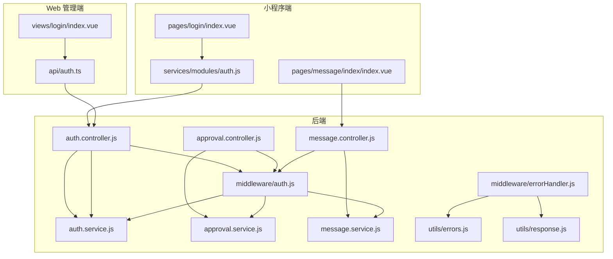
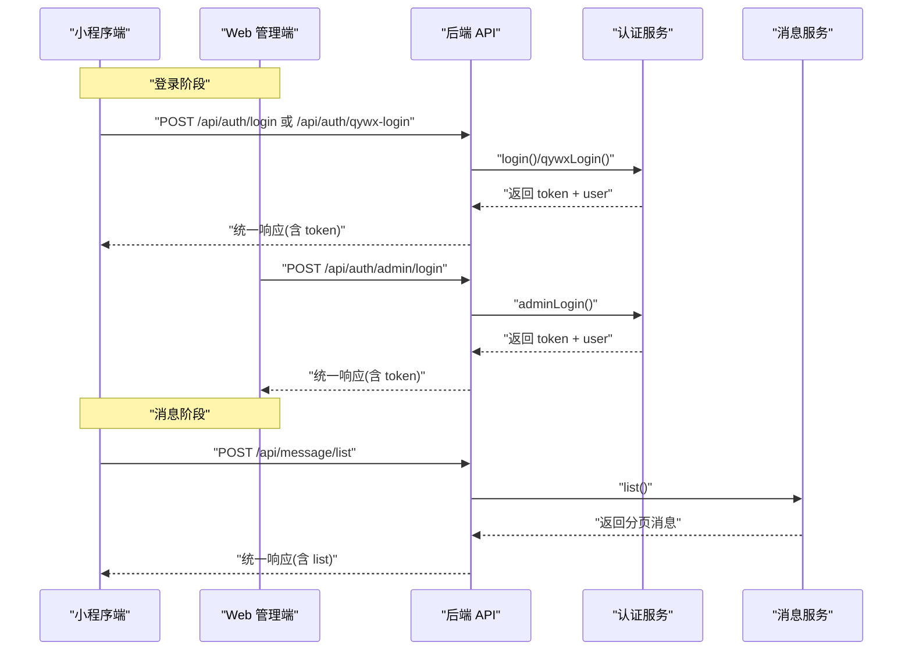
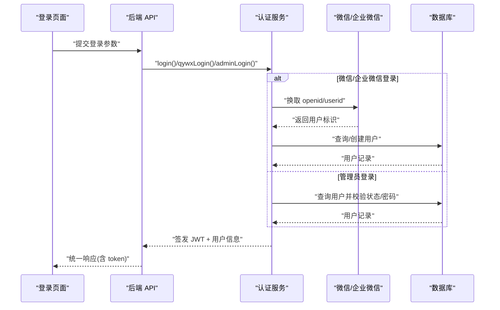
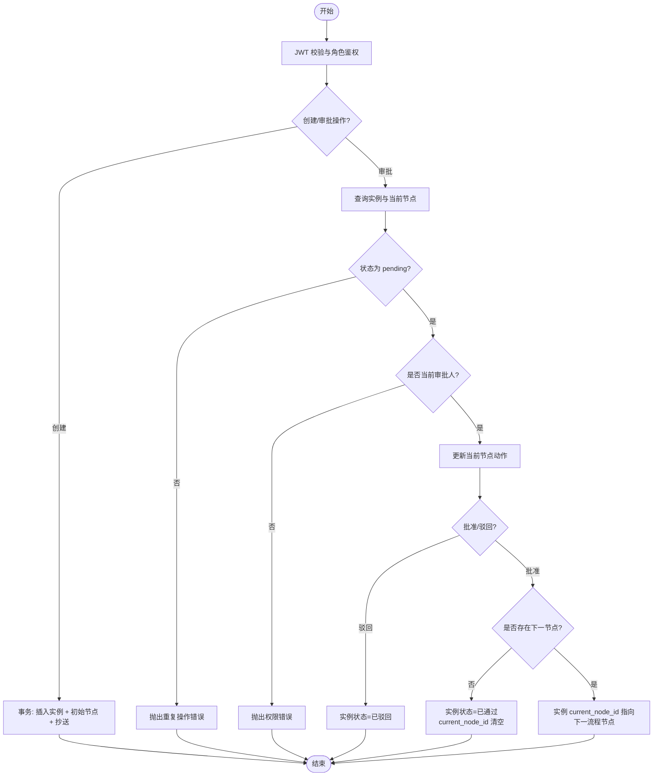
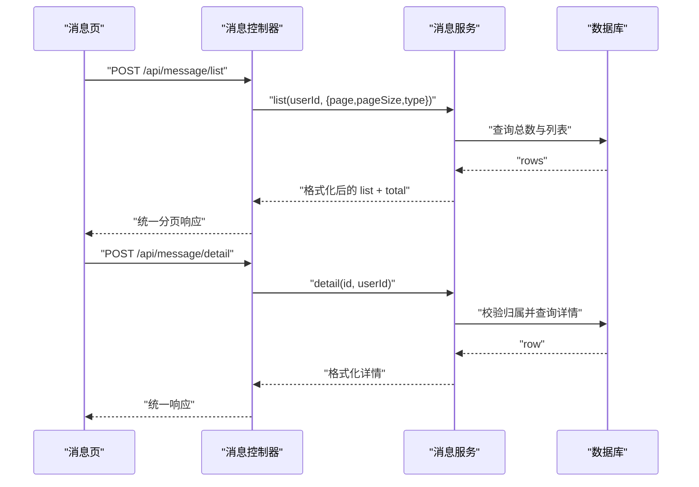
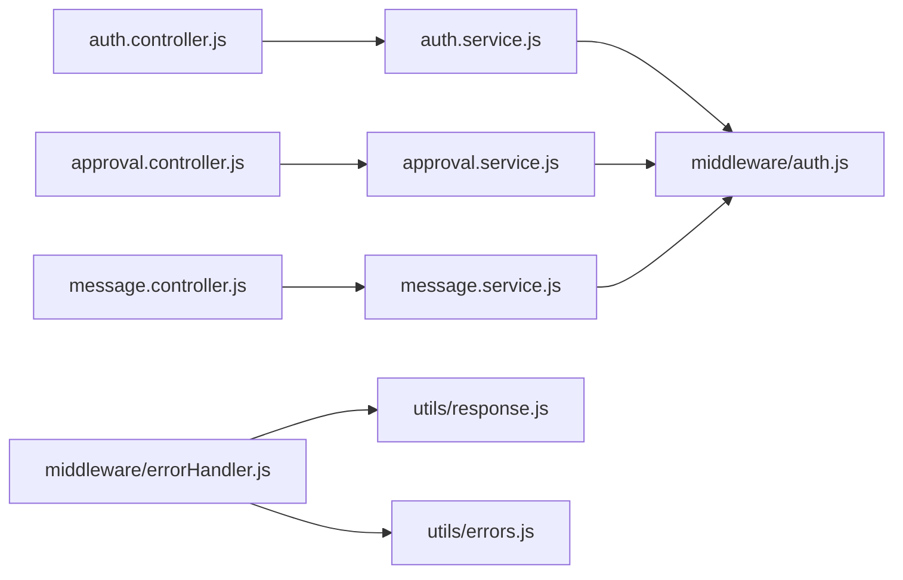

# 常见问题

<cite>
**本文引用的文件**
- [backend/src/auth/controllers/auth.controller.js](file://backend/src/auth/controllers/auth.controller.js)
- [backend/src/auth/services/auth.service.js](file://backend/src/auth/services/auth.service.js)
- [backend/src/common/middleware/auth.js](file://backend/src/common/middleware/auth.js)
- [backend/src/common/middleware/errorHandler.js](file://backend/src/common/middleware/errorHandler.js)
- [backend/src/common/utils/errors.js](file://backend/src/common/utils/errors.js)
- [backend/src/common/utils/response.js](file://backend/src/common/utils/response.js)
- [backend/src/core/controllers/approval.controller.js](file://backend/src/core/controllers/approval.controller.js)
- [backend/src/core/services/approval.service.js](file://backend/src/core/services/approval.service.js)
- [backend/src/core/controllers/message.controller.js](file://backend/src/core/controllers/message.controller.js)
- [backend/src/core/services/message.service.js](file://backend/src/core/services/message.service.js)
- [miniapp/src/pages/login/index.vue](file://miniapp/src/pages/login/index.vue)
- [miniapp/src/services/modules/auth.js](file://miniapp/src/services/modules/auth.js)
- [miniapp/src/pages/message/index/index.vue](file://miniapp/src/pages/message/index/index.vue)
- [webapp/src/views/login/index.vue](file://webapp/src/views/login/index.vue)
- [webapp/src/api/auth.ts](file://webapp/src/api/auth.ts)
</cite>

## 目录
1. [简介](#简介)
2. [项目结构](#项目结构)
3. [核心组件](#核心组件)
4. [架构总览](#架构总览)
5. [详细组件分析](#详细组件分析)
6. [依赖分析](#依赖分析)
7. [性能考虑](#性能考虑)
8. [故障排查指南](#故障排查指南)
9. [结论](#结论)
10. [附录](#附录)

## 简介
本文件面向“智慧办公助手 OA 系统”的使用者与开发者，聚焦系统中最常见的问题场景，提供可操作的自检清单与快速修复步骤。覆盖范围包括：
- 用户登录失败（小程序端与 Web 端）
- 验证码错误（TOTP 动态码）
- 权限不足（角色与会话失效）
- 数据提交失败（审批、消息等接口）
- 审批流程异常（重复审批、越权操作）
- 消息推送/展示异常
- 小程序端与 Web 端差异问题与跨平台兼容性建议

## 项目结构
系统采用前后端分离架构：
- 后端基于 Node.js + Express，提供 REST API，包含认证、审批、消息等模块。
- 小程序端基于 uni-app/Vue3，负责微信/企业微信一键登录、消息展示等。
- Web 管理端基于 Vue3 + TypeScript + Element Plus，负责管理员登录与企业微信 OAuth。

图表来源
- [backend/src/auth/controllers/auth.controller.js:16-161](file://backend/src/auth/controllers/auth.controller.js#L16-L161)
- [backend/src/auth/services/auth.service.js:22-414](file://backend/src/auth/services/auth.service.js#L22-L414)
- [backend/src/common/middleware/auth.js:14-82](file://backend/src/common/middleware/auth.js#L14-L82)
- [backend/src/common/middleware/errorHandler.js:12-27](file://backend/src/common/middleware/errorHandler.js#L12-L27)
- [backend/src/common/utils/errors.js:9-98](file://backend/src/common/utils/errors.js#L9-L98)
- [backend/src/common/utils/response.js:11-46](file://backend/src/common/utils/response.js#L11-L46)
- [backend/src/core/controllers/approval.controller.js:15-137](file://backend/src/core/controllers/approval.controller.js#L15-L137)
- [backend/src/core/services/approval.service.js:84-356](file://backend/src/core/services/approval.service.js#L84-L356)
- [backend/src/core/controllers/message.controller.js:10-76](file://backend/src/core/controllers/message.controller.js#L10-L76)
- [backend/src/core/services/message.service.js:83-165](file://backend/src/core/services/message.service.js#L83-L165)
- [miniapp/src/pages/login/index.vue:91-119](file://miniapp/src/pages/login/index.vue#L91-L119)
- [miniapp/src/services/modules/auth.js:4-18](file://miniapp/src/services/modules/auth.js#L4-L18)
- [miniapp/src/pages/message/index/index.vue:73-90](file://miniapp/src/pages/message/index/index.vue#L73-L90)
- [webapp/src/views/login/index.vue:37-80](file://webapp/src/views/login/index.vue#L37-L80)
- [webapp/src/api/auth.ts:23-30](file://webapp/src/api/auth.ts#L23-L30)

章节来源
- [backend/src/auth/controllers/auth.controller.js:16-161](file://backend/src/auth/controllers/auth.controller.js#L16-L161)
- [backend/src/auth/services/auth.service.js:22-414](file://backend/src/auth/services/auth.service.js#L22-L414)
- [backend/src/common/middleware/auth.js:14-82](file://backend/src/common/middleware/auth.js#L14-L82)
- [backend/src/common/middleware/errorHandler.js:12-27](file://backend/src/common/middleware/errorHandler.js#L12-L27)
- [backend/src/common/utils/errors.js:9-98](file://backend/src/common/utils/errors.js#L9-L98)
- [backend/src/common/utils/response.js:11-46](file://backend/src/common/utils/response.js#L11-L46)
- [backend/src/core/controllers/approval.controller.js:15-137](file://backend/src/core/controllers/approval.controller.js#L15-L137)
- [backend/src/core/services/approval.service.js:84-356](file://backend/src/core/services/approval.service.js#L84-L356)
- [backend/src/core/controllers/message.controller.js:10-76](file://backend/src/core/controllers/message.controller.js#L10-L76)
- [backend/src/core/services/message.service.js:83-165](file://backend/src/core/services/message.service.js#L83-L165)
- [miniapp/src/pages/login/index.vue:91-119](file://miniapp/src/pages/login/index.vue#L91-L119)
- [miniapp/src/services/modules/auth.js:4-18](file://miniapp/src/services/modules/auth.js#L4-L18)
- [miniapp/src/pages/message/index/index.vue:73-90](file://miniapp/src/pages/message/index/index.vue#L73-L90)
- [webapp/src/views/login/index.vue:37-80](file://webapp/src/views/login/index.vue#L37-L80)
- [webapp/src/api/auth.ts:23-30](file://webapp/src/api/auth.ts#L23-L30)

## 核心组件
- 认证与会话
  - 控制器：处理微信/企业微信登录、Web 管理员登录、资料查询与更新、TOTP 设置/启用/禁用、企业微信配置与回调。
  - 服务层：封装微信/企业微信 API 调用、数据库用户查询/创建/更新、JWT 签发、登录日志与操作日志。
  - 中间件：JWT 校验、角色鉴权、全局错误处理。
- 审批流程
  - 控制器：列表/详情/创建/审批（兼容新旧参数）。
  - 服务层：事务处理、状态机推进、节点流转、抄送关系写入。
- 消息中心
  - 控制器：列表/详情/未读计数/标记已读/删除。
  - 服务层：消息格式化、时间友好化、权限校验。

章节来源
- [backend/src/auth/controllers/auth.controller.js:16-161](file://backend/src/auth/controllers/auth.controller.js#L16-L161)
- [backend/src/auth/services/auth.service.js:22-414](file://backend/src/auth/services/auth.service.js#L22-L414)
- [backend/src/common/middleware/auth.js:14-82](file://backend/src/common/middleware/auth.js#L14-L82)
- [backend/src/common/middleware/errorHandler.js:12-27](file://backend/src/common/middleware/errorHandler.js#L12-L27)
- [backend/src/core/controllers/approval.controller.js:15-137](file://backend/src/core/controllers/approval.controller.js#L15-L137)
- [backend/src/core/services/approval.service.js:84-356](file://backend/src/core/services/approval.service.js#L84-L356)
- [backend/src/core/controllers/message.controller.js:10-76](file://backend/src/core/controllers/message.controller.js#L10-L76)
- [backend/src/core/services/message.service.js:83-165](file://backend/src/core/services/message.service.js#L83-L165)

## 架构总览
下图展示典型登录与消息流程在各端的调用链路与关键错误点。

图表来源
- [backend/src/auth/controllers/auth.controller.js:16-161](file://backend/src/auth/controllers/auth.controller.js#L16-L161)
- [backend/src/auth/services/auth.service.js:22-414](file://backend/src/auth/services/auth.service.js#L22-L414)
- [backend/src/core/controllers/message.controller.js:10-76](file://backend/src/core/controllers/message.controller.js#L10-L76)
- [backend/src/core/services/message.service.js:83-165](file://backend/src/core/services/message.service.js#L83-L165)
- [miniapp/src/services/modules/auth.js:4-18](file://miniapp/src/services/modules/auth.js#L4-L18)
- [webapp/src/api/auth.ts:23-30](file://webapp/src/api/auth.ts#L23-L30)

## 详细组件分析

### 登录与会话（小程序端/ Web 端）
- 小程序端登录流程
  - 选择登录方式：若检测到企业微信环境则走企业微信登录，否则走微信登录。
  - 登录成功后写入本地存储 token 与用户信息，进入首页。
  - 首次登录无昵称时弹窗引导设置。
- Web 管理端登录流程
  - 支持用户名/邮箱 + 密码登录，可选输入 6 位动态验证码（TOTP）。
  - 企业微信 OAuth 登录需后端提供 corpid，前端跳转授权页。
- 关键错误点
  - 缺少登录凭证/参数校验失败
  - 微信/企业微信接口调用失败
  - 用户状态异常（禁用/未激活）
  - 管理员登录失败次数限制
  - TOTP 未开启/验证码错误
  - Token 过期或无效

图表来源
- [miniapp/src/pages/login/index.vue:91-119](file://miniapp/src/pages/login/index.vue#L91-L119)
- [webapp/src/views/login/index.vue:37-80](file://webapp/src/views/login/index.vue#L37-L80)
- [backend/src/auth/controllers/auth.controller.js:16-161](file://backend/src/auth/controllers/auth.controller.js#L16-L161)
- [backend/src/auth/services/auth.service.js:22-414](file://backend/src/auth/services/auth.service.js#L22-L414)

章节来源
- [miniapp/src/pages/login/index.vue:91-119](file://miniapp/src/pages/login/index.vue#L91-L119)
- [webapp/src/views/login/index.vue:37-80](file://webapp/src/views/login/index.vue#L37-L80)
- [backend/src/auth/controllers/auth.controller.js:16-161](file://backend/src/auth/controllers/auth.controller.js#L16-L161)
- [backend/src/auth/services/auth.service.js:22-414](file://backend/src/auth/services/auth.service.js#L22-L414)
- [backend/src/common/middleware/auth.js:14-82](file://backend/src/common/middleware/auth.js#L14-L82)
- [backend/src/common/utils/errors.js:9-98](file://backend/src/common/utils/errors.js#L9-L98)
- [backend/src/common/utils/response.js:11-46](file://backend/src/common/utils/response.js#L11-L46)

### 审批流程（创建/审批/查看）
- 列表/详情/创建/审批接口均受 JWT 与角色中间件保护。
- 服务层使用事务保证审批实例与节点的一致性，支持加急、抄送、节点流转与最终状态推进。
- 关键错误点
  - 非当前审批人操作
  - 审批实例不存在或状态非“待处理”
  - 重复审批
  - 参数不兼容导致的字段映射问题

图表来源
- [backend/src/core/controllers/approval.controller.js:15-137](file://backend/src/core/controllers/approval.controller.js#L15-L137)
- [backend/src/core/services/approval.service.js:267-356](file://backend/src/core/services/approval.service.js#L267-L356)
- [backend/src/common/middleware/auth.js:14-82](file://backend/src/common/middleware/auth.js#L14-L82)

章节来源
- [backend/src/core/controllers/approval.controller.js:15-137](file://backend/src/core/controllers/approval.controller.js#L15-L137)
- [backend/src/core/services/approval.service.js:84-356](file://backend/src/core/services/approval.service.js#L84-L356)

### 消息中心（列表/详情/未读/标记已读/删除）
- 列表按接收人过滤，支持按类型筛选，分页返回。
- 详情校验消息归属，未读消息标记已读后返回。
- 删除仅允许删除自己的消息。
- 关键错误点
  - 消息不存在
  - 非消息接收人访问
  - 网络异常导致加载失败

图表来源
- [backend/src/core/controllers/message.controller.js:10-76](file://backend/src/core/controllers/message.controller.js#L10-L76)
- [backend/src/core/services/message.service.js:83-165](file://backend/src/core/services/message.service.js#L83-L165)
- [miniapp/src/pages/message/index/index.vue:73-90](file://miniapp/src/pages/message/index/index.vue#L73-L90)

章节来源
- [backend/src/core/controllers/message.controller.js:10-76](file://backend/src/core/controllers/message.controller.js#L10-L76)
- [backend/src/core/services/message.service.js:83-165](file://backend/src/core/services/message.service.js#L83-L165)
- [miniapp/src/pages/message/index/index.vue:73-90](file://miniapp/src/pages/message/index/index.vue#L73-L90)

## 依赖分析
- 认证链路
  - 控制器依赖服务层实现业务逻辑。
  - 服务层依赖外部微信/企业微信接口与数据库。
  - 中间件负责统一鉴权与错误处理。
- 审批与消息链路
  - 控制器依赖服务层，服务层依赖数据库与事务。
  - 统一响应与错误处理贯穿所有接口。

图表来源
- [backend/src/auth/controllers/auth.controller.js:16-161](file://backend/src/auth/controllers/auth.controller.js#L16-L161)
- [backend/src/auth/services/auth.service.js:22-414](file://backend/src/auth/services/auth.service.js#L22-L414)
- [backend/src/core/controllers/approval.controller.js:15-137](file://backend/src/core/controllers/approval.controller.js#L15-L137)
- [backend/src/core/services/approval.service.js:84-356](file://backend/src/core/services/approval.service.js#L84-L356)
- [backend/src/core/controllers/message.controller.js:10-76](file://backend/src/core/controllers/message.controller.js#L10-L76)
- [backend/src/core/services/message.service.js:83-165](file://backend/src/core/services/message.service.js#L83-L165)
- [backend/src/common/middleware/auth.js:14-82](file://backend/src/common/middleware/auth.js#L14-L82)
- [backend/src/common/middleware/errorHandler.js:12-27](file://backend/src/common/middleware/errorHandler.js#L12-L27)
- [backend/src/common/utils/response.js:11-46](file://backend/src/common/utils/response.js#L11-L46)
- [backend/src/common/utils/errors.js:9-98](file://backend/src/common/utils/errors.js#L9-L98)

章节来源
- [backend/src/auth/controllers/auth.controller.js:16-161](file://backend/src/auth/controllers/auth.controller.js#L16-L161)
- [backend/src/auth/services/auth.service.js:22-414](file://backend/src/auth/services/auth.service.js#L22-L414)
- [backend/src/core/controllers/approval.controller.js:15-137](file://backend/src/core/controllers/approval.controller.js#L15-L137)
- [backend/src/core/services/approval.service.js:84-356](file://backend/src/core/services/approval.service.js#L84-L356)
- [backend/src/core/controllers/message.controller.js:10-76](file://backend/src/core/controllers/message.controller.js#L10-L76)
- [backend/src/core/services/message.service.js:83-165](file://backend/src/core/services/message.service.js#L83-L165)
- [backend/src/common/middleware/auth.js:14-82](file://backend/src/common/middleware/auth.js#L14-L82)
- [backend/src/common/middleware/errorHandler.js:12-27](file://backend/src/common/middleware/errorHandler.js#L12-L27)
- [backend/src/common/utils/response.js:11-46](file://backend/src/common/utils/response.js#L11-L46)
- [backend/src/common/utils/errors.js:9-98](file://backend/src/common/utils/errors.js#L9-L98)

## 性能考虑
- 登录与审批接口涉及数据库查询与外部 API 调用，建议：
  - 合理设置超时与重试策略（如微信/企业微信接口）。
  - 对高频接口增加缓存（如用户资料、审批类型字典）。
  - 审批列表与消息列表使用分页与索引优化。
  - 控制事务范围，避免长事务阻塞。

## 故障排查指南

### 1. 用户登录失败
- 小程序端
  - 症状：点击“微信一键登录”无响应或报错。
  - 可能原因
    - 未勾选同意协议，阻止登录。
    - 企业微信环境检测失败或企业微信登录失败。
    - 微信/企业微信接口调用超时或返回错误。
    - 用户状态异常（禁用/未激活）。
  - 解决步骤
    - 确认已勾选同意协议。
    - 若为企业微信环境，确保后端已正确配置企业微信参数；否则切换至微信登录。
    - 检查网络与微信/企业微信服务可用性；重试登录。
    - 若提示账号状态异常，联系管理员。
  - 小程序端差异
    - 企业微信登录通过 wx.qy.login 获取 code；若不可用则回退到 uni.login。
    - 首次登录无昵称会弹窗引导设置。
- Web 管理端
  - 症状：账号登录失败或提示“无管理后台访问权限”。
  - 可能原因
    - 账号不存在或密码错误。
    - 账号状态非“active”。
    - 非管理员角色（admin/superadmin）。
    - 登录失败次数过多被临时锁定。
    - 开启了 TOTP 但未提供或验证码错误。
  - 解决步骤
    - 确认用户名/邮箱与密码正确。
    - 确保账号状态为“active”，且角色为管理员。
    - 若频繁失败，等待 15 分钟后再试。
    - 若开启 TOTP，确保输入正确的 6 位动态码。
  - 企业微信 OAuth 登录
    - 确保后端已配置 corpid 与 secret；前端会根据后端返回的 corpid 构造授权链接。

章节来源
- [miniapp/src/pages/login/index.vue:91-119](file://miniapp/src/pages/login/index.vue#L91-L119)
- [webapp/src/views/login/index.vue:37-80](file://webapp/src/views/login/index.vue#L37-L80)
- [backend/src/auth/controllers/auth.controller.js:16-161](file://backend/src/auth/controllers/auth.controller.js#L16-L161)
- [backend/src/auth/services/auth.service.js:22-414](file://backend/src/auth/services/auth.service.js#L22-L414)
- [backend/src/common/middleware/auth.js:14-82](file://backend/src/common/middleware/auth.js#L14-L82)

### 2. 验证码错误（TOTP 动态码）
- 症状：管理员登录时报“动态验证码错误”。
- 可能原因
  - 未开启 TOTP 却未填写验证码。
  - 输入的验证码不正确或已过期。
- 解决步骤
  - 在移动端或 PC 端开启 TOTP，并使用认证器应用生成 6 位动态码。
  - 确保时间同步，避免因设备时间偏差导致验证码不匹配。

章节来源
- [backend/src/auth/services/auth.service.js:322-331](file://backend/src/auth/services/auth.service.js#L322-L331)
- [backend/src/auth/controllers/auth.controller.js:107-134](file://backend/src/auth/controllers/auth.controller.js#L107-L134)

### 3. 权限不足
- 症状：提示“无权限执行此操作”或“未认证，请先登录”。
- 可能原因
  - 未携带有效 Token 或 Token 已过期。
  - 用户状态变为非 active。
  - 角色不满足接口要求。
- 解决步骤
  - 重新登录获取新 Token。
  - 检查账号状态是否为“active”。
  - 确认当前用户具备所需角色（如 admin/superadmin）。

章节来源
- [backend/src/common/middleware/auth.js:14-82](file://backend/src/common/middleware/auth.js#L14-L82)
- [backend/src/common/utils/errors.js:42-63](file://backend/src/common/utils/errors.js#L42-L63)

### 4. 数据提交失败（审批/消息）
- 审批创建/审批
  - 症状：创建失败或审批时报“审批不存在/重复操作/无权操作”。
  - 可能原因
    - 实例状态非“pending”。
    - 非当前审批人操作。
    - 参数映射不兼容（action/tab/type 等）。
  - 解决步骤
    - 确认审批实例仍处于“待处理”状态。
    - 确认当前用户为当前节点审批人。
    - 检查参数命名与版本兼容性（新旧参数映射）。
- 消息相关
  - 症状：消息列表为空或详情报“消息不存在”。
  - 可能原因
    - 非消息接收人访问。
    - 消息已被删除或不存在。
  - 解决步骤
    - 确认当前用户为消息接收人。
    - 刷新页面或检查网络后重试。

章节来源
- [backend/src/core/controllers/approval.controller.js:15-137](file://backend/src/core/controllers/approval.controller.js#L15-L137)
- [backend/src/core/services/approval.service.js:267-356](file://backend/src/core/services/approval.service.js#L267-L356)
- [backend/src/core/controllers/message.controller.js:10-76](file://backend/src/core/controllers/message.controller.js#L10-L76)
- [backend/src/core/services/message.service.js:116-127](file://backend/src/core/services/message.service.js#L116-L127)

### 5. 审批流程异常
- 症状：审批已处理、重复审批、无法流转到下一节点。
- 可能原因
  - 实例状态已非“pending”。
  - 当前节点未找到或审批人不匹配。
  - 流程设计缺失下一节点。
- 解决步骤
  - 检查审批实例状态与当前节点信息。
  - 确认流程模板配置正确，存在后续节点。
  - 如需人工干预，联系管理员修正流程。

章节来源
- [backend/src/core/services/approval.service.js:274-356](file://backend/src/core/services/approval.service.js#L274-L356)

### 6. 消息推送/展示失败
- 症状：消息中心空白、无法标记已读、删除失败。
- 可能原因
  - 网络异常导致请求失败。
  - 非消息接收人访问详情。
  - 数据库异常或权限不足。
- 解决步骤
  - 刷新页面或重试请求。
  - 确认消息归属与权限。
  - 检查后端日志与数据库连接状态。

章节来源
- [backend/src/core/controllers/message.controller.js:10-76](file://backend/src/core/controllers/message.controller.js#L10-L76)
- [backend/src/core/services/message.service.js:116-165](file://backend/src/core/services/message.service.js#L116-L165)
- [miniapp/src/pages/message/index/index.vue:73-90](file://miniapp/src/pages/message/index/index.vue#L73-L90)

### 7. 小程序端与 Web 端差异化问题
- 企业微信登录
  - 小程序端通过 wx.qy.login 获取 code；若不可用则回退到微信登录。
  - Web 端通过后端返回的 corpid 构造企业微信 OAuth 授权链接。
- Token 与用户信息
  - 小程序端将 token 与用户信息写入本地存储；Web 端写入 Pinia 状态与本地存储。
- 跨平台兼容性
  - 小程序端条件编译区分 MP-WEIXIN 与非微信平台。
  - Web 端需确保浏览器支持现代特性（如 fetch、Promise）。

章节来源
- [miniapp/src/pages/login/index.vue:44-49](file://miniapp/src/pages/login/index.vue#L44-L49)
- [webapp/src/views/login/index.vue:68-80](file://webapp/src/views/login/index.vue#L68-L80)

## 结论
本排查文档围绕登录、验证码、权限、数据提交、审批流程与消息展示六大类问题，结合代码中的控制器、服务层与中间件实现，提供了可落地的自检清单与修复步骤。建议在日常运维中：
- 建立统一的错误日志与监控告警。
- 对高频接口进行缓存与限流。
- 定期检查企业微信与微信接口配置。
- 强化前端参数校验与错误提示。

## 附录

### 问题自检清单
- 登录类
  - 是否勾选同意协议？
  - 企业微信环境是否可用？后端是否配置 corpid/secret？
  - 账号状态是否为“active”，角色是否为管理员？
  - 是否频繁登录失败被临时锁定？
  - 是否开启 TOTP 且验证码正确？
- 权限类
  - 是否携带有效 Token 且未过期？
  - 用户状态是否仍为“active”？
  - 当前角色是否满足接口要求？
- 数据提交类
  - 审批实例状态是否仍为“pending”？
  - 是否为当前节点审批人？
  - 参数命名与版本是否兼容？
- 消息类
  - 是否为消息接收人？
  - 网络是否稳定？
  - 数据库连接是否正常？

### 快速修复指南
- 登录失败
  - 重新登录，必要时切换登录方式（微信/企业微信）。
  - 管理员登录时补齐 TOTP 动态码。
- 权限不足
  - 重新登录获取新 Token；联系管理员恢复账号状态与角色。
- 审批异常
  - 检查流程模板与节点配置；确认当前审批人身份。
- 消息异常
  - 刷新页面或重试；确认消息归属与权限。