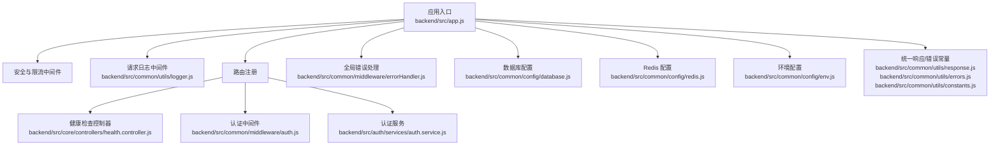
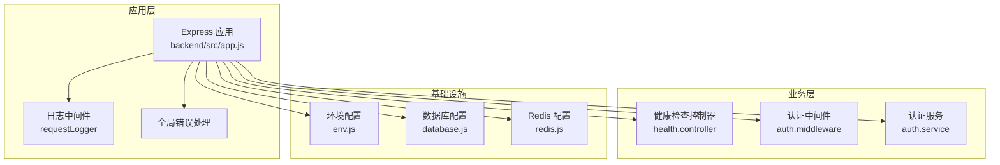
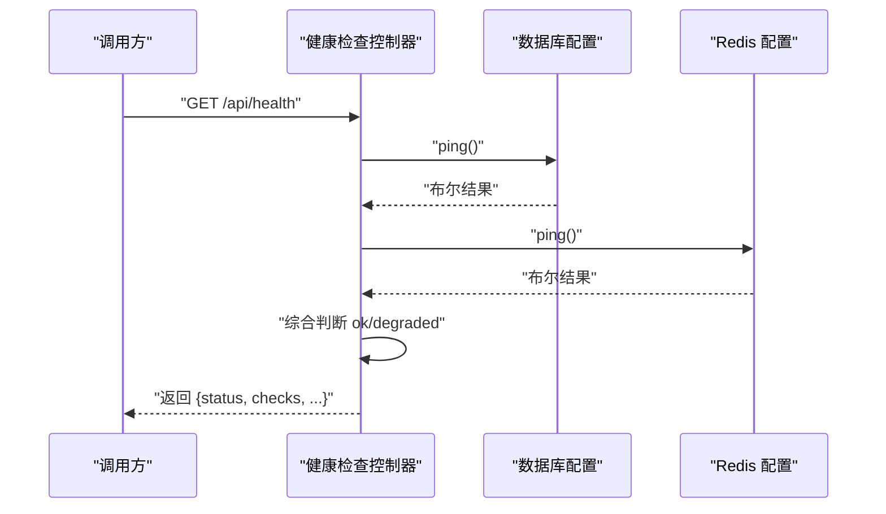
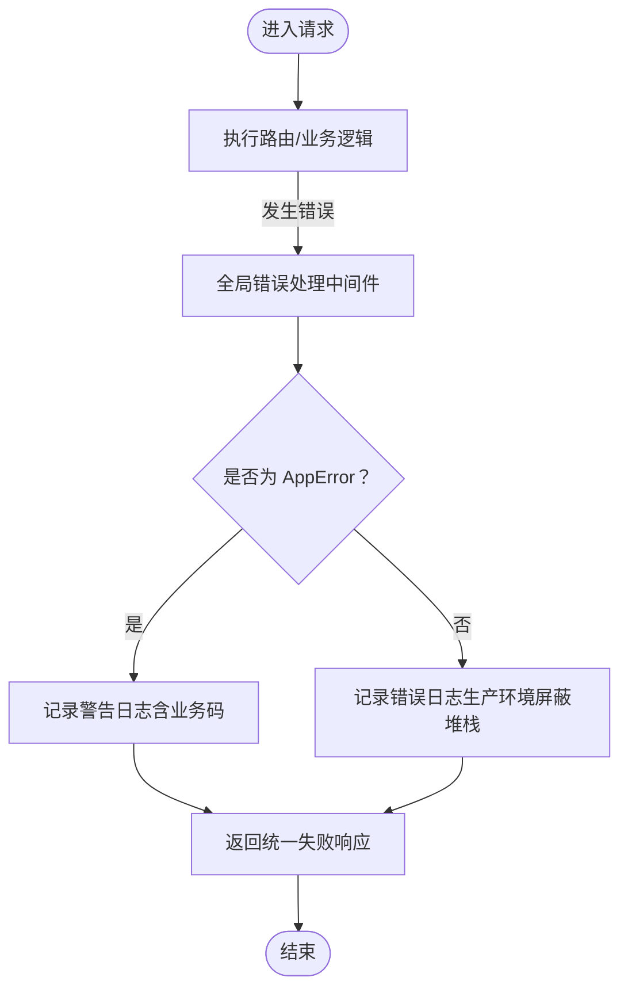
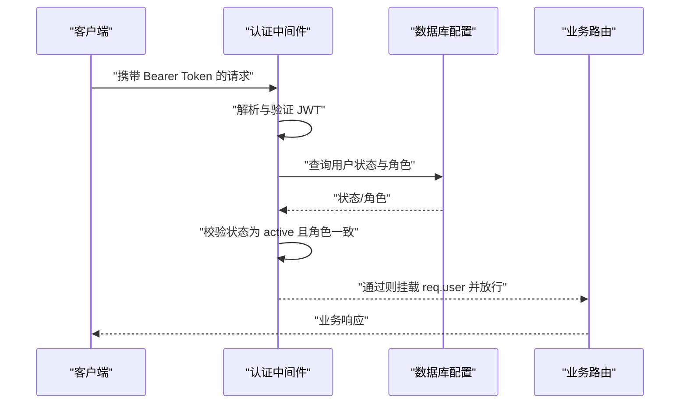
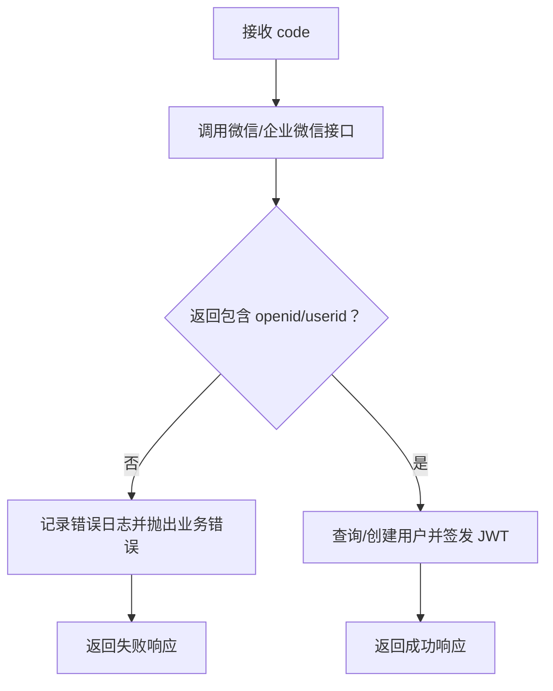
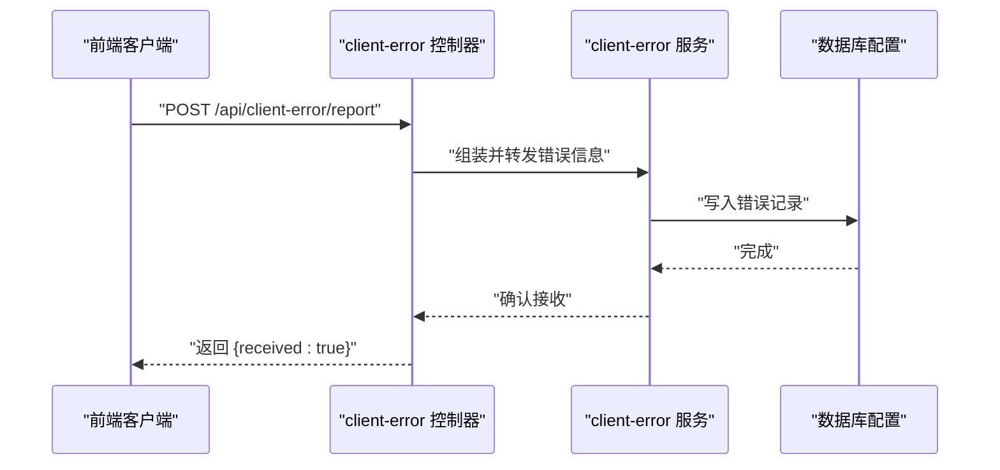
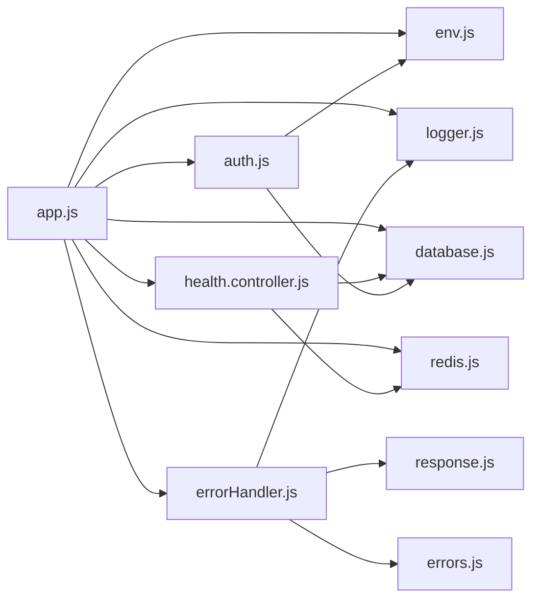

# 应急响应

<cite>
**本文引用的文件**
- [backend/src/app.js](file://backend/src/app.js)
- [backend/src/common/config/env.js](file://backend/src/common/config/env.js)
- [backend/src/common/config/database.js](file://backend/src/common/config/database.js)
- [backend/src/common/config/redis.js](file://backend/src/common/config/redis.js)
- [backend/src/common/middleware/errorHandler.js](file://backend/src/common/middleware/errorHandler.js)
- [backend/src/common/middleware/auth.js](file://backend/src/common/middleware/auth.js)
- [backend/src/common/utils/logger.js](file://backend/src/common/utils/logger.js)
- [backend/src/common/utils/errors.js](file://backend/src/common/utils/errors.js)
- [backend/src/common/utils/constants.js](file://backend/src/common/utils/constants.js)
- [backend/src/common/utils/response.js](file://backend/src/common/utils/response.js)
- [backend/src/core/controllers/health.controller.js](file://backend/src/core/controllers/health.controller.js)
- [backend/src/core/controllers/client-error.controller.js](file://backend/src/core/controllers/client-error.controller.js)
- [backend/src/auth/services/auth.service.js](file://backend/src/auth/services/auth.service.js)
- [backend/package.json](file://backend/package.json)
</cite>

## 目录
1. [简介](#简介)
2. [项目结构](#项目结构)
3. [核心组件](#核心组件)
4. [架构总览](#架构总览)
5. [详细组件分析](#详细组件分析)
6. [依赖关系分析](#依赖关系分析)
7. [性能考量](#性能考量)
8. [故障排查指南](#故障排查指南)
9. [结论](#结论)
10. [附录](#附录)

## 简介
本文件面向“智慧办公助手 OA 系统”的应急响应与故障处理，基于现有代码实现，梳理系统在紧急故障（如系统宕机、数据库连接失败、第三方服务异常、安全事件）下的分类分级、处置流程、升级机制与责任分工，并配套预防性维护与风险控制建议。文档同时给出可落地的操作步骤与可视化流程图，帮助团队建立标准化的应急响应体系。

## 项目结构
后端采用 Express 应用入口集中装配安全中间件、限流、日志、路由与全局错误处理；数据库与 Redis 通过独立配置模块提供连接池与连通性检测；统一错误模型与响应格式确保对外输出一致性；健康检查控制器对数据库与缓存进行联合探测。

图表来源
- [backend/src/app.js:1-207](file://backend/src/app.js#L1-L207)
- [backend/src/common/config/env.js:1-118](file://backend/src/common/config/env.js#L1-L118)
- [backend/src/common/config/database.js:1-222](file://backend/src/common/config/database.js#L1-L222)
- [backend/src/common/config/redis.js:1-101](file://backend/src/common/config/redis.js#L1-L101)
- [backend/src/common/middleware/errorHandler.js:1-28](file://backend/src/common/middleware/errorHandler.js#L1-L28)
- [backend/src/common/middleware/auth.js:1-83](file://backend/src/common/middleware/auth.js#L1-L83)
- [backend/src/common/utils/logger.js:1-100](file://backend/src/common/utils/logger.js#L1-L100)
- [backend/src/common/utils/response.js:1-49](file://backend/src/common/utils/response.js#L1-L49)
- [backend/src/common/utils/errors.js:1-99](file://backend/src/common/utils/errors.js#L1-L99)
- [backend/src/common/utils/constants.js:1-106](file://backend/src/common/utils/constants.js#L1-L106)
- [backend/src/core/controllers/health.controller.js:1-55](file://backend/src/core/controllers/health.controller.js#L1-L55)
- [backend/src/auth/services/auth.service.js:1-415](file://backend/src/auth/services/auth.service.js#L1-L415)

章节来源
- [backend/src/app.js:1-207](file://backend/src/app.js#L1-L207)
- [backend/src/common/config/env.js:1-118](file://backend/src/common/config/env.js#L1-L118)

## 核心组件
- 应用入口与生命周期：负责环境加载、日志初始化、中间件注册、路由挂载、优雅退出与未捕获异常处理。
- 健康检查：联合检测数据库与 Redis 连通性，返回服务状态与降级提示。
- 错误与日志：统一错误模型、响应格式与日志结构，支持请求级追踪。
- 认证与鉴权：JWT 校验、角色校验与用户状态校验。
- 数据库与缓存：连接池、事务、参数化查询、连通性探测。
- 第三方服务：微信/企业微信登录与会话换取，超时与错误处理。

章节来源
- [backend/src/app.js:1-207](file://backend/src/app.js#L1-L207)
- [backend/src/core/controllers/health.controller.js:1-55](file://backend/src/core/controllers/health.controller.js#L1-L55)
- [backend/src/common/middleware/errorHandler.js:1-28](file://backend/src/common/middleware/errorHandler.js#L1-L28)
- [backend/src/common/utils/logger.js:1-100](file://backend/src/common/utils/logger.js#L1-L100)
- [backend/src/common/utils/errors.js:1-99](file://backend/src/common/utils/errors.js#L1-L99)
- [backend/src/common/utils/response.js:1-49](file://backend/src/common/utils/response.js#L1-L49)
- [backend/src/common/middleware/auth.js:1-83](file://backend/src/common/middleware/auth.js#L1-L83)
- [backend/src/common/config/database.js:1-222](file://backend/src/common/config/database.js#L1-L222)
- [backend/src/common/config/redis.js:1-101](file://backend/src/common/config/redis.js#L1-L101)
- [backend/src/auth/services/auth.service.js:1-415](file://backend/src/auth/services/auth.service.js#L1-L415)

## 架构总览
系统采用“入口集中装配 + 统一中间件 + 服务化控制器”的分层设计。健康检查作为基础设施监控的关键节点，贯穿数据库与缓存两大外部依赖。

图表来源
- [backend/src/app.js:1-207](file://backend/src/app.js#L1-L207)
- [backend/src/core/controllers/health.controller.js:1-55](file://backend/src/core/controllers/health.controller.js#L1-L55)
- [backend/src/common/middleware/auth.js:1-83](file://backend/src/common/middleware/auth.js#L1-L83)
- [backend/src/auth/services/auth.service.js:1-415](file://backend/src/auth/services/auth.service.js#L1-L415)
- [backend/src/common/config/env.js:1-118](file://backend/src/common/config/env.js#L1-L118)
- [backend/src/common/config/database.js:1-222](file://backend/src/common/config/database.js#L1-L222)
- [backend/src/common/config/redis.js:1-101](file://backend/src/common/config/redis.js#L1-L101)

## 详细组件分析

### 健康检查与降级判定
健康检查控制器对数据库与 Redis 进行连通性探测，并统计响应时间，综合判断整体服务状态。当任一依赖异常时返回降级状态并设置相应 HTTP 状态码，便于上游负载均衡或监控系统识别。

图表来源
- [backend/src/core/controllers/health.controller.js:13-52](file://backend/src/core/controllers/health.controller.js#L13-L52)
- [backend/src/common/config/database.js:187-194](file://backend/src/common/config/database.js#L187-L194)
- [backend/src/common/config/redis.js:85-93](file://backend/src/common/config/redis.js#L85-L93)

章节来源
- [backend/src/core/controllers/health.controller.js:1-55](file://backend/src/core/controllers/health.controller.js#L1-L55)
- [backend/src/common/config/database.js:1-222](file://backend/src/common/config/database.js#L1-L222)
- [backend/src/common/config/redis.js:1-101](file://backend/src/common/config/redis.js#L1-L101)

### 全局错误处理与日志
全局错误处理中间件将所有错误规范化为统一响应格式，并区分业务错误与未捕获异常，分别记录警告与错误日志。请求日志中间件为每次请求注入带追踪信息的日志器，便于问题回溯。

图表来源
- [backend/src/common/middleware/errorHandler.js:12-25](file://backend/src/common/middleware/errorHandler.js#L12-L25)
- [backend/src/common/utils/logger.js:67-96](file://backend/src/common/utils/logger.js#L67-L96)
- [backend/src/common/utils/errors.js:9-24](file://backend/src/common/utils/errors.js#L9-L24)
- [backend/src/common/utils/response.js:22-24](file://backend/src/common/utils/response.js#L22-L24)

章节来源
- [backend/src/common/middleware/errorHandler.js:1-28](file://backend/src/common/middleware/errorHandler.js#L1-L28)
- [backend/src/common/utils/logger.js:1-100](file://backend/src/common/utils/logger.js#L1-L100)
- [backend/src/common/utils/errors.js:1-99](file://backend/src/common/utils/errors.js#L1-L99)
- [backend/src/common/utils/response.js:1-49](file://backend/src/common/utils/response.js#L1-L49)

### 认证与鉴权
认证中间件从请求头解析 JWT，验证签名与有效期，并二次校验用户状态与角色一致性；角色中间件按允许角色集合进行权限拦截。

图表来源
- [backend/src/common/middleware/auth.js:14-56](file://backend/src/common/middleware/auth.js#L14-L56)
- [backend/src/common/config/database.js:48-50](file://backend/src/common/config/database.js#L48-L50)
- [backend/src/common/config/env.js:90-93](file://backend/src/common/config/env.js#L90-L93)

章节来源
- [backend/src/common/middleware/auth.js:1-83](file://backend/src/common/middleware/auth.js#L1-L83)
- [backend/src/common/config/database.js:1-222](file://backend/src/common/config/database.js#L1-L222)
- [backend/src/common/config/env.js:1-118](file://backend/src/common/config/env.js#L1-L118)

### 第三方服务异常处理（微信/企业微信登录）
认证服务在调用微信/企业微信接口时设置超时与错误分支处理，失败时抛出业务错误并记录日志，避免阻塞主线程。

图表来源
- [backend/src/auth/services/auth.service.js:22-87](file://backend/src/auth/services/auth.service.js#L22-L87)
- [backend/src/auth/services/auth.service.js:94-164](file://backend/src/auth/services/auth.service.js#L94-L164)

章节来源
- [backend/src/auth/services/auth.service.js:1-415](file://backend/src/auth/services/auth.service.js#L1-L415)

### 客户端错误上报
客户端可通过专用接口上报前端错误，服务端记录必要元信息并返回确认，便于后续归档与分析。

图表来源
- [backend/src/core/controllers/client-error.controller.js:6-23](file://backend/src/core/controllers/client-error.controller.js#L6-L23)
- [backend/src/common/config/database.js:65-109](file://backend/src/common/config/database.js#L65-L109)

章节来源
- [backend/src/core/controllers/client-error.controller.js:1-24](file://backend/src/core/controllers/client-error.controller.js#L1-L24)
- [backend/src/common/config/database.js:1-222](file://backend/src/common/config/database.js#L1-L222)

## 依赖关系分析
- 应用入口依赖环境配置、日志、数据库与 Redis 配置、路由与中间件。
- 健康检查依赖数据库与 Redis 的连通性探测。
- 认证中间件依赖 JWT 密钥与数据库用户状态。
- 认证服务依赖数据库与第三方接口。
- 全局错误处理依赖错误模型与响应格式。

图表来源
- [backend/src/app.js:1-207](file://backend/src/app.js#L1-L207)
- [backend/src/common/config/env.js:1-118](file://backend/src/common/config/env.js#L1-L118)
- [backend/src/common/config/database.js:1-222](file://backend/src/common/config/database.js#L1-L222)
- [backend/src/common/config/redis.js:1-101](file://backend/src/common/config/redis.js#L1-L101)
- [backend/src/common/middleware/errorHandler.js:1-28](file://backend/src/common/middleware/errorHandler.js#L1-L28)
- [backend/src/common/middleware/auth.js:1-83](file://backend/src/common/middleware/auth.js#L1-L83)
- [backend/src/common/utils/logger.js:1-100](file://backend/src/common/utils/logger.js#L1-L100)
- [backend/src/common/utils/response.js:1-49](file://backend/src/common/utils/response.js#L1-L49)
- [backend/src/common/utils/errors.js:1-99](file://backend/src/common/utils/errors.js#L1-L99)
- [backend/src/core/controllers/health.controller.js:1-55](file://backend/src/core/controllers/health.controller.js#L1-L55)

章节来源
- [backend/src/app.js:1-207](file://backend/src/app.js#L1-L207)
- [backend/src/common/config/env.js:1-118](file://backend/src/common/config/env.js#L1-L118)
- [backend/src/common/config/database.js:1-222](file://backend/src/common/config/database.js#L1-L222)
- [backend/src/common/config/redis.js:1-101](file://backend/src/common/config/redis.js#L1-L101)
- [backend/src/common/middleware/errorHandler.js:1-28](file://backend/src/common/middleware/errorHandler.js#L1-L28)
- [backend/src/common/middleware/auth.js:1-83](file://backend/src/common/middleware/auth.js#L1-L83)
- [backend/src/common/utils/logger.js:1-100](file://backend/src/common/utils/logger.js#L1-L100)
- [backend/src/common/utils/response.js:1-49](file://backend/src/common/utils/response.js#L1-L49)
- [backend/src/common/utils/errors.js:1-99](file://backend/src/common/utils/errors.js#L1-L99)
- [backend/src/core/controllers/health.controller.js:1-55](file://backend/src/core/controllers/health.controller.js#L1-L55)

## 性能考量
- 连接池与参数化：数据库连接池与参数化查询减少连接开销与 SQL 注入风险。
- 限流与安全：全局限流与登录端点限流降低恶意请求与资源消耗。
- 日志级别与文件轮转：按级别输出与文件大小限制避免磁盘膨胀。
- 健康检查：定期探测数据库与缓存，提前发现依赖异常。

章节来源
- [backend/src/common/config/database.js:11-24](file://backend/src/common/config/database.js#L11-L24)
- [backend/src/common/config/database.js:65-109](file://backend/src/common/config/database.js#L65-L109)
- [backend/src/app.js:48-65](file://backend/src/app.js#L48-L65)
- [backend/src/common/utils/logger.js:31-60](file://backend/src/common/utils/logger.js#L31-L60)
- [backend/src/core/controllers/health.controller.js:13-52](file://backend/src/core/controllers/health.controller.js#L13-L52)

## 故障排查指南

### 1. 系统宕机/不可达
- 快速定位
  - 使用健康检查接口确认服务状态与依赖连通性。
  - 检查应用进程日志与错误日志文件。
- 临时方案
  - 若依赖异常，优先隔离故障模块（如禁用相关路由或降级接口）。
  - 启动备用实例或回滚至稳定版本。
- 正式修复
  - 修复依赖配置与网络连通，恢复数据库/缓存服务。
  - 重启应用并验证健康检查。
- 事后总结
  - 输出故障报告，记录根因、影响面与改进项。

章节来源
- [backend/src/core/controllers/health.controller.js:13-52](file://backend/src/core/controllers/health.controller.js#L13-L52)
- [backend/src/common/utils/logger.js:31-60](file://backend/src/common/utils/logger.js#L31-L60)
- [backend/src/app.js:145-204](file://backend/src/app.js#L145-L204)

### 2. 数据库连接失败
- 快速定位
  - 健康检查中的数据库状态与响应时间。
  - 数据库配置与连接池参数（主机、端口、账号、密码、池大小）。
  - 数据库日志与慢查询。
- 临时方案
  - 临时切换到只读接口，避免写入。
  - 降低并发或限流。
- 正式修复
  - 修复网络/权限/配置，扩容连接池或优化 SQL。
  - 回归健康检查与压力测试。
- 事后总结
  - 输出数据库变更与容量评估报告。

章节来源
- [backend/src/common/config/database.js:11-24](file://backend/src/common/config/database.js#L11-L24)
- [backend/src/common/config/database.js:65-109](file://backend/src/common/config/database.js#L65-L109)
- [backend/src/core/controllers/health.controller.js:17-31](file://backend/src/core/controllers/health.controller.js#L17-L31)
- [backend/src/common/config/env.js:58-78](file://backend/src/common/config/env.js#L58-L78)

### 3. Redis 连接失败
- 快速定位
  - 健康检查中的 Redis 状态与响应时间。
  - Redis 配置与重连策略日志。
- 临时方案
  - 降级使用数据库存储或本地缓存。
  - 临时关闭依赖 Redis 的功能。
- 正式修复
  - 修复网络/认证/配置，验证重连策略。
  - 回归健康检查。
- 事后总结
  - 输出缓存可用性与容量评估报告。

章节来源
- [backend/src/common/config/redis.js:16-57](file://backend/src/common/config/redis.js#L16-L57)
- [backend/src/common/config/redis.js:85-93](file://backend/src/common/config/redis.js#L85-L93)
- [backend/src/core/controllers/health.controller.js:25-31](file://backend/src/core/controllers/health.controller.js#L25-L31)

### 4. 第三方服务异常（微信/企业微信）
- 快速定位
  - 认证服务日志与错误码。
  - 接口超时与返回结构。
- 临时方案
  - 提供本地测试账号或降级登录方式。
  - 限流与熔断，避免雪崩。
- 正式修复
  - 修复接口配置与超时策略，补充重试与降级。
  - 回归测试与压测。
- 事后总结
  - 输出第三方依赖 SLA 与应急预案。

章节来源
- [backend/src/auth/services/auth.service.js:22-87](file://backend/src/auth/services/auth.service.js#L22-L87)
- [backend/src/auth/services/auth.service.js:94-164](file://backend/src/auth/services/auth.service.js#L94-L164)

### 5. 安全事件（越权/暴力破解/未授权）
- 快速定位
  - 认证中间件与鉴权日志。
  - 全局错误处理对 401/403 的记录。
- 临时方案
  - 临时封禁高危 IP 或账号。
  - 强制要求二次验证（TOTP）。
- 正式修复
  - 修复鉴权逻辑与权限边界，完善审计日志。
  - 回归安全测试。
- 事后总结
  - 输出安全事件报告与加固清单。

章节来源
- [backend/src/common/middleware/auth.js:14-56](file://backend/src/common/middleware/auth.js#L14-L56)
- [backend/src/common/middleware/errorHandler.js:12-25](file://backend/src/common/middleware/errorHandler.js#L12-L25)
- [backend/src/auth/services/auth.service.js:268-364](file://backend/src/auth/services/auth.service.js#L268-L364)

### 6. 客户端错误（前端崩溃/报错）
- 快速定位
  - 客户端错误上报接口与数据库记录。
  - 前端错误栈与页面路径。
- 临时方案
  - 发布热修复或回滚问题版本。
- 正式修复
  - 修复前端逻辑与边界条件。
- 事后总结
  - 输出前端错误趋势与修复闭环。

章节来源
- [backend/src/core/controllers/client-error.controller.js:6-23](file://backend/src/core/controllers/client-error.controller.js#L6-L23)
- [backend/src/common/config/database.js:65-109](file://backend/src/common/config/database.js#L65-L109)

## 应急响应流程与分级

### 分类与分级
- 一级故障：系统完全不可用/核心链路中断/大规模数据丢失/严重安全事件
- 二级故障：部分功能不可用/性能严重下降/重要接口异常
- 三级故障：局部功能异常/偶发错误/非关键接口异常

### 处置流程（通用）
- 发现与上报
  - 监控告警/用户反馈/健康检查异常
  - 按级别在即时通讯群/工单系统上报
- 快速定位
  - 查看应用日志、错误日志、健康检查状态
  - 结合数据库/缓存连通性与第三方接口状态
- 临时方案
  - 降级/熔断/限流/回滚/隔离
- 正式修复
  - 修复根因、回归测试、恢复全量功能
- 事后总结
  - 形成故障报告、复盘会议、改进计划

### 升级机制与责任分工
- 一级故障
  - 责任人：技术负责人/值班负责人
  - 处置时限：立即响应，15 分钟内启动应急小组
  - 上报：全员即时通讯群、管理层
- 二级故障
  - 责任人：模块负责人
  - 处置时限：1 小时内成立修复小组
- 三级故障
  - 责任人：开发工程师
  - 处置时限：4 小时内闭环

### 预防性维护与风险控制
- 健康检查常态化：定时巡检数据库与缓存连通性
- 日志与告警：完善日志级别与阈值告警
- 限流与熔断：对第三方接口与热点接口实施保护
- 容量规划：数据库/缓存/应用实例容量评估与扩容演练
- 回滚与蓝绿：发布策略与快速回滚机制
- 安全加固：强制二次验证、最小权限、审计日志

## 结论
通过统一的错误模型、日志与健康检查机制，结合明确的分级与升级流程，OA 系统可在故障发生时快速定位、有效隔离并尽快恢复服务。配合预防性维护与风险控制，可显著降低故障频率与影响范围，提升系统稳定性与用户体验。

## 附录

### 常用命令与脚本
- 启动服务：参考应用入口脚本与依赖安装说明
- 初始化数据库：参考脚本入口与数据库配置
- 测试与覆盖率：参考测试脚本与 Jest 配置

章节来源
- [backend/package.json:6-14](file://backend/package.json#L6-L14)
- [backend/src/common/config/env.js:13-41](file://backend/src/common/config/env.js#L13-L41)
- [backend/src/common/config/database.js:11-24](file://backend/src/common/config/database.js#L11-L24)