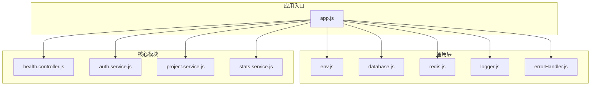
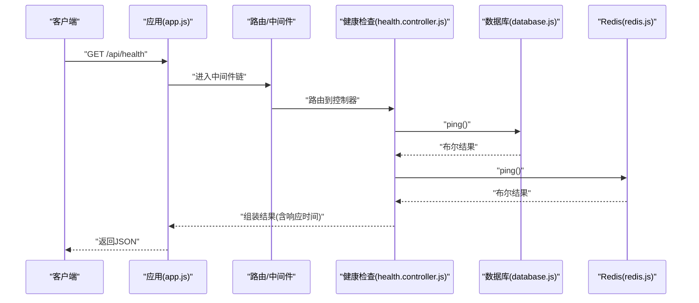
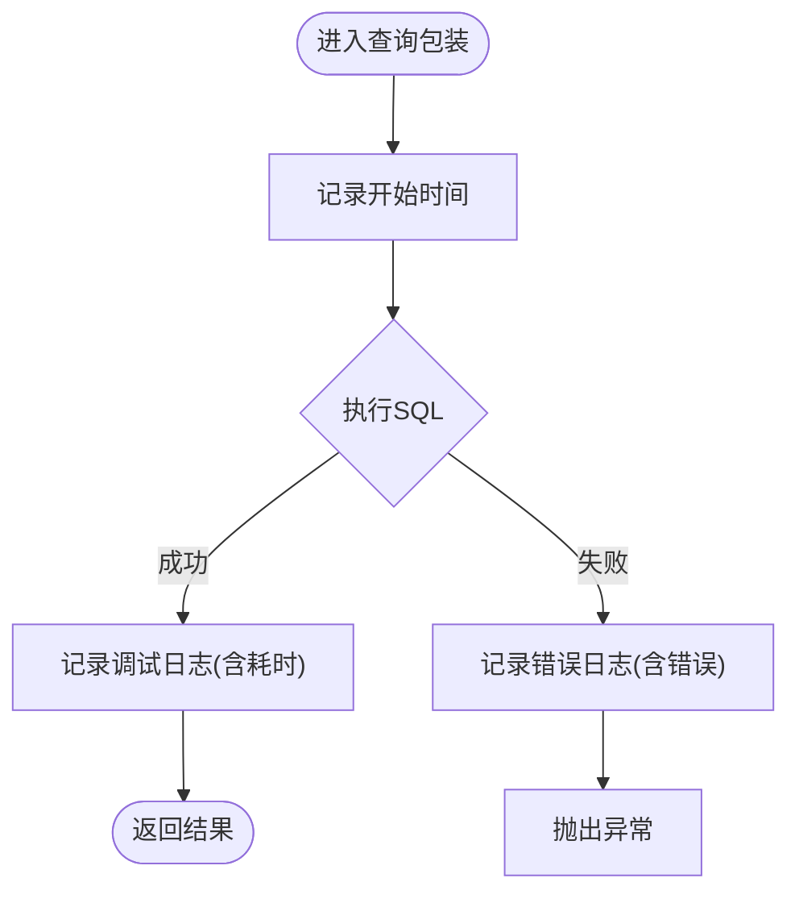
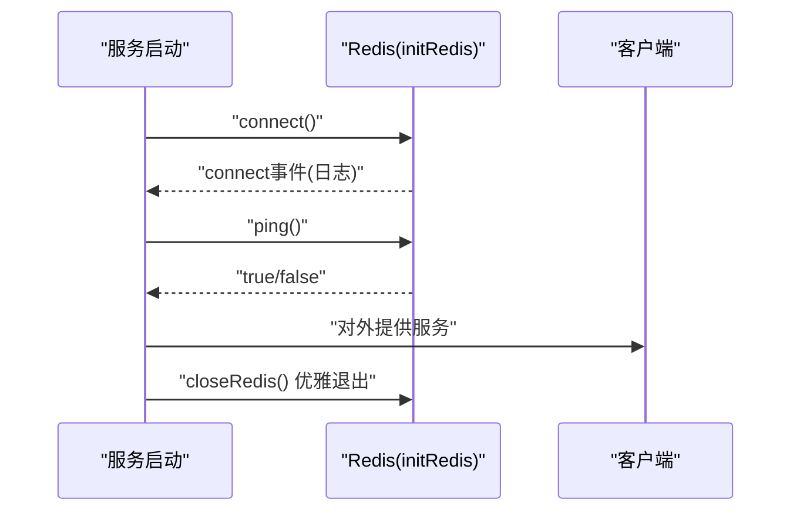
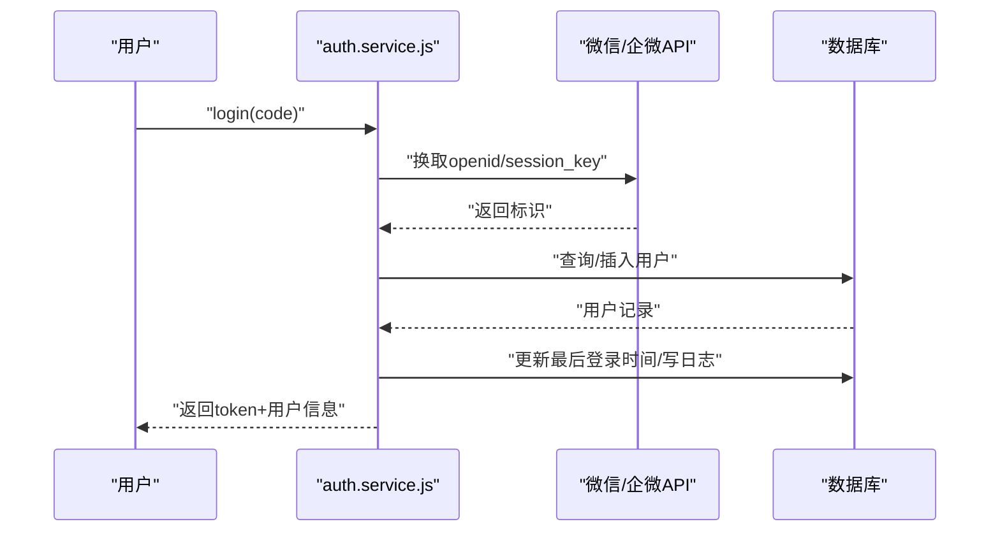
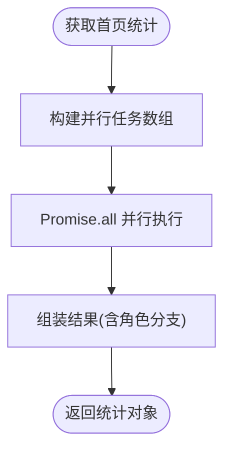
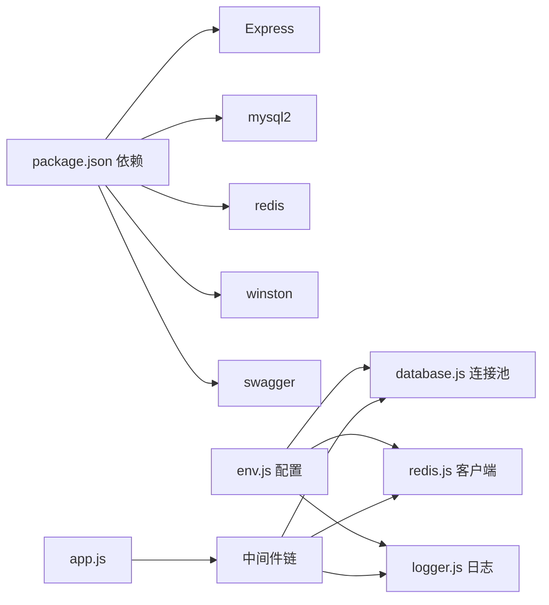

# 性能分析

<cite>
**本文引用的文件**
- [package.json](file://backend/package.json)
- [env.js](file://backend/src/common/config/env.js)
- [database.js](file://backend/src/common/config/database.js)
- [redis.js](file://backend/src/common/config/redis.js)
- [app.js](file://backend/src/app.js)
- [logger.js](file://backend/src/common/utils/logger.js)
- [errorHandler.js](file://backend/src/common/middleware/errorHandler.js)
- [health.controller.js](file://backend/src/core/controllers/health.controller.js)
- [auth.service.js](file://backend/src/auth/services/auth.service.js)
- [project.service.js](file://backend/src/core/services/project.service.js)
- [stats.service.js](file://backend/src/features/services/stats.service.js)
- [response.js](file://backend/src/common/utils/response.js)
</cite>

## 目录
1. [简介](#简介)
2. [项目结构](#项目结构)
3. [核心组件](#核心组件)
4. [架构总览](#架构总览)
5. [详细组件分析](#详细组件分析)
6. [依赖分析](#依赖分析)
7. [性能考量](#性能考量)
8. [故障排查指南](#故障排查指南)
9. [结论](#结论)
10. [附录](#附录)

## 简介
本文件面向“智慧办公助手 OA 系统”的性能分析与优化，聚焦后端 API 服务在响应时间、内存占用、数据库查询效率与并发处理能力方面的瓶颈识别与优化策略。文档结合现有代码实现，给出可落地的监控指标、阈值建议、优化手段与测试方法，帮助团队在开发与运维阶段持续提升系统性能与稳定性。

## 项目结构
后端采用 Express + MySQL + Redis 的经典组合，核心目录与职责概览如下：
- common：通用配置、中间件与工具
  - config：环境变量、数据库与 Redis 配置
  - middleware：全局错误处理、安全与限流中间件
  - utils：日志、响应封装、常量与错误类型
- core：核心业务模块（路由、控制器、服务）
- features：功能模块（统计、WPS 等）
- auth：认证模块（登录、用户资料）
- tests：单元与集成测试

**图示来源**
- [app.js:1-207](file://backend/src/app.js#L1-L207)
- [env.js:1-118](file://backend/src/common/config/env.js#L1-L118)
- [database.js:1-222](file://backend/src/common/config/database.js#L1-L222)
- [redis.js:1-101](file://backend/src/common/config/redis.js#L1-L101)
- [logger.js:1-100](file://backend/src/common/utils/logger.js#L1-L100)
- [errorHandler.js:1-28](file://backend/src/common/middleware/errorHandler.js#L1-L28)
- [health.controller.js:1-55](file://backend/src/core/controllers/health.controller.js#L1-L55)
- [auth.service.js:1-415](file://backend/src/auth/services/auth.service.js#L1-L415)
- [project.service.js:1-255](file://backend/src/core/services/project.service.js#L1-L255)
- [stats.service.js:1-309](file://backend/src/features/services/stats.service.js#L1-L309)

**章节来源**
- [app.js:1-207](file://backend/src/app.js#L1-L207)
- [env.js:1-118](file://backend/src/common/config/env.js#L1-L118)

## 核心组件
- 应用入口与中间件
  - 安全中间件（Helmet/CORS）、全局限流（express-rate-limit）、请求体解析、请求日志中间件、Swagger 文档挂载、全局错误处理。
- 配置层
  - 环境变量校验与默认值、数据库连接池配置（OA 与旧库双池）、Redis 连接与重连策略、日志级别与输出目标。
- 数据访问层
  - 数据库查询/执行包装、事务、连通性检测；旧库兼容查询。
- 缓存层
  - Redis 客户端初始化、连接状态检测、优雅关闭。
- 业务服务
  - 认证服务（微信/企微登录、管理员登录、TOTP）、项目统计与趋势、首页活动与统计、健康检查控制器。

**章节来源**
- [app.js:29-141](file://backend/src/app.js#L29-L141)
- [env.js:50-115](file://backend/src/common/config/env.js#L50-L115)
- [database.js:11-221](file://backend/src/common/config/database.js#L11-L221)
- [redis.js:16-93](file://backend/src/common/config/redis.js#L16-L93)
- [auth.service.js:22-197](file://backend/src/auth/services/auth.service.js#L22-L197)
- [project.service.js:29-76](file://backend/src/core/services/project.service.js#L29-L76)
- [stats.service.js:23-82](file://backend/src/features/services/stats.service.js#L23-L82)
- [health.controller.js:13-52](file://backend/src/core/controllers/health.controller.js#L13-L52)

## 架构总览
系统采用“请求-路由-控制器-服务-数据源”链路，数据库与 Redis 作为外部依赖，健康检查同时探测两者连通性与响应时间。

**图示来源**
- [app.js:102-128](file://backend/src/app.js#L102-L128)
- [health.controller.js:13-52](file://backend/src/core/controllers/health.controller.js#L13-L52)
- [database.js:187-207](file://backend/src/common/config/database.js#L187-L207)
- [redis.js:85-93](file://backend/src/common/config/redis.js#L85-L93)

## 详细组件分析

### 数据库层（MySQL 连接池与查询包装）
- 连接池配置
  - OA 主库池：最小/最大连接数、等待队列、keep-alive、字符集与时区。
  - 旧库池：用于兼容与迁移，独立池配置。
- 查询与执行
  - 包装 query/execute，统一记录 SQL 片段与耗时，便于定位慢查询。
  - 事务封装，确保一致性与资源释放。
- 健康检查
  - 提供 ping 方法，用于健康端点快速判断连通性与响应时间。

**图示来源**
- [database.js:65-109](file://backend/src/common/config/database.js#L65-L109)
- [database.js:168-181](file://backend/src/common/config/database.js#L168-L181)

**章节来源**
- [database.js:11-221](file://backend/src/common/config/database.js#L11-L221)

### 缓存层（Redis 客户端与健康检查）
- 初始化与重连
  - 支持带密码 URL 构造、指数退避重连策略、连接事件监听。
- 连接状态
  - 提供 ping 方法，健康检查端点使用。
- 优雅关闭
  - 服务停止时主动关闭连接，避免资源泄露。

**图示来源**
- [redis.js:16-57](file://backend/src/common/config/redis.js#L16-L57)
- [redis.js:85-93](file://backend/src/common/config/redis.js#L85-L93)
- [app.js:174-180](file://backend/src/app.js#L174-L180)

**章节来源**
- [redis.js:16-93](file://backend/src/common/config/redis.js#L16-L93)
- [health.controller.js:17-31](file://backend/src/core/controllers/health.controller.js#L17-L31)

### 认证服务（登录与资料）
- 微信/企微登录
  - 调用微信/企微接口换取标识，数据库查询/插入用户，签发 JWT，记录操作日志。
- 管理员登录
  - 角色校验、状态检查、失败次数限制、密码校验、TOTP 校验。
- 资料查询与更新
  - 过滤允许字段、动态构造 SQL、返回更新后资料。

**图示来源**
- [auth.service.js:22-87](file://backend/src/auth/services/auth.service.js#L22-L87)
- [auth.service.js:268-364](file://backend/src/auth/services/auth.service.js#L268-L364)

**章节来源**
- [auth.service.js:22-415](file://backend/src/auth/services/auth.service.js#L22-L415)

### 统计与首页数据（并行查询与聚合）
- 首页统计
  - 并行查询待审批、已处理、未读消息，管理员额外查询待审核日报数；员工补充“待提交”计算。
- 活动动态
  - 使用 UNION ALL 聚合审批、日报、系统消息，按时间排序并分页。
- 个人统计
  - 并行统计累计日报、审批、待审批，并计算连续提交天数。

**图示来源**
- [stats.service.js:23-82](file://backend/src/features/services/stats.service.js#L23-L82)
- [stats.service.js:92-195](file://backend/src/features/services/stats.service.js#L92-L195)
- [stats.service.js:206-270](file://backend/src/features/services/stats.service.js#L206-L270)

**章节来源**
- [stats.service.js:23-309](file://backend/src/features/services/stats.service.js#L23-L309)

### 项目统计与趋势
- 项目列表
  - 关键词搜索、DISTINCT 去重、GROUP BY 聚合、分页与总数。
- 项目详情
  - 日报列表、成员去重、统计计算（通过率、平均工作天数）。
- 趋势数据
  - 按周/月/季度聚合日报数量，支持指定项目过滤。

**章节来源**
- [project.service.js:29-255](file://backend/src/core/services/project.service.js#L29-L255)

### 健康检查控制器
- 同时检查数据库与 Redis 连通性，并记录各自响应时间；整体状态根据两者结果判定，必要时返回 503。

**章节来源**
- [health.controller.js:13-52](file://backend/src/core/controllers/health.controller.js#L13-L52)

## 依赖分析
- 运行时依赖
  - Express、mysql2、redis、helmet、cors、express-rate-limit、winston、swagger 等。
- 环境变量与配置
  - 数据库主机/端口/账号/池大小、Redis 主机/端口/密码/库/前缀、JWT 密钥、日志级别与目录、Swagger 开关。
- 中间件耦合
  - 安全中间件与限流中间件位于请求处理链前端，影响后续路由与控制器的性能表现。

**图示来源**
- [package.json:16-35](file://backend/package.json#L16-L35)
- [env.js:50-115](file://backend/src/common/config/env.js#L50-L115)
- [database.js:11-43](file://backend/src/common/config/database.js#L11-L43)
- [redis.js:21-57](file://backend/src/common/config/redis.js#L21-L57)
- [logger.js:23-61](file://backend/src/common/utils/logger.js#L23-L61)
- [app.js:29-141](file://backend/src/app.js#L29-L141)

**章节来源**
- [package.json:16-35](file://backend/package.json#L16-L35)
- [env.js:50-115](file://backend/src/common/config/env.js#L50-L115)

## 性能考量

### 1. 响应时间慢
- 可能原因
  - 数据库慢查询：未命中索引、大表全表扫描、复杂 JOIN/UNION。
  - Redis 不可用或延迟高：网络抖动、连接池耗尽、键值过大。
  - 控制器内串行调用：可并行的任务未并行化。
  - 中间件开销：日志、限流、CORS 等叠加。
- 诊断方法
  - 健康检查端点观察数据库/Redis 响应时间；查看日志中 SQL 耗时与请求耗时。
  - 对热点接口（如首页统计、活动动态）进行压测，定位瓶颈。
- 优化策略
  - 为高频查询字段建立合适索引；对 GROUP BY/ORDER BY 字段评估覆盖索引。
  - 将可并行的数据库查询改为 Promise.all；减少不必要的跨服务调用。
  - 优化日志级别与输出目标，避免在生产环境记录过多 JSON 结构。
  - 适当提高限流窗口与阈值，避免误伤正常流量。

**章节来源**
- [health.controller.js:17-31](file://backend/src/core/controllers/health.controller.js#L17-L31)
- [database.js:65-109](file://backend/src/common/config/database.js#L65-L109)
- [logger.js:67-96](file://backend/src/common/utils/logger.js#L67-L96)
- [stats.service.js:27-55](file://backend/src/features/services/stats.service.js#L27-L55)

### 2. 内存占用高
- 可能原因
  - 大对象序列化/反序列化（JSON）、日志文件过大、未及时释放资源。
  - Redis 内存增长：键值过多、未设置 maxmemory 策略。
- 诊断方法
  - 通过进程内存快照与日志文件大小监控定位；检查 Redis 内存使用情况。
- 优化策略
  - 控制日志 JSON 字段规模，避免冗余元数据；定期轮转与清理日志文件。
  - 为 Redis 设置 maxmemory 与淘汰策略；对热键设置 TTL；拆分业务键空间。
  - 优化大查询结果集，分页或投影只取必要字段。

**章节来源**
- [logger.js:40-59](file://backend/src/common/utils/logger.js#L40-L59)
- [redis.js:25-36](file://backend/src/common/config/redis.js#L25-L36)

### 3. 数据库查询效率低
- 可能原因
  - 缺少索引、LIKE “%xxx%”、JOIN 字段未建立索引、UNION ALL 未去重或排序成本高。
- 诊断方法
  - 使用 EXPLAIN 分析慢查询；关注 database.js 中记录的 SQL 片段与耗时。
- 优化策略
  - 为搜索/过滤字段建立索引；避免前缀模糊匹配；必要时引入全文索引或搜索引擎。
  - 减少不必要的字段选择（SELECT *），使用投影字段；对聚合查询使用合适的索引覆盖。
  - 将复杂统计拆分为物化视图或定时任务预计算，接口直接读取结果。

**章节来源**
- [database.js:65-109](file://backend/src/common/config/database.js#L65-L109)
- [project.service.js:41-64](file://backend/src/core/services/project.service.js#L41-L64)
- [stats.service.js:96-195](file://backend/src/features/services/stats.service.js#L96-L195)

### 4. 并发处理能力不足
- 可能原因
  - 数据库连接池过小、Redis 连接未复用、限流策略过于保守。
- 诊断方法
  - 压测观察数据库排队时间、Redis 命令延迟、限流触发频率。
- 优化策略
  - 根据峰值 QPS 与数据库承载能力调整连接池上限；启用 keep-alive 降低握手开销。
  - 优化限流规则，区分登录等敏感端点与普通接口；对静态资源与只读接口放宽限制。
  - 引入异步任务队列处理非实时任务（如报表导出、图片处理）。

**章节来源**
- [env.js:59-87](file://backend/src/common/config/env.js#L59-L87)
- [app.js:48-65](file://backend/src/app.js#L48-L65)

### 5. 性能监控指标与阈值建议
- CPU 使用率
  - 建议阈值：单核使用率长期高于 80% 视为偏高；突发可达 95%，但需缩短峰值持续时间。
- 内存使用量
  - 建议阈值：RSS 长期接近系统可用内存 70% 视为预警；持续上升需排查泄漏。
- 数据库连接数
  - 建议阈值：活跃连接数不超过连接池上限的 70%；排队等待时间超过 100ms 视为紧张。
- Redis 连接与内存
  - 议阈值：连接数不超过 Redis 连接上限；used_memory 峰值不超过 maxmemory 的 80%。
- API 响应时间
  - 建议阈值：P95 ≤ 200ms（首页统计类）、P99 ≤ 500ms；慢查询占比 < 1%。
- 健康检查
  - 建议阈值：数据库/Redis 响应时间均 ≤ 100ms；整体状态“ok”。

**章节来源**
- [health.controller.js:17-31](file://backend/src/core/controllers/health.controller.js#L17-L31)

### 6. 性能优化具体措施
- 数据库优化
  - 为高频查询字段建立索引；优化 LIKE 前缀匹配；使用覆盖索引减少回表。
  - 将复杂统计拆分为定时任务与物化表，接口直读。
- 缓存策略优化
  - 对热点数据设置 TTL；使用多级缓存（本地 LRU + Redis）；对写多读少场景采用写穿透/失效策略。
  - 为 Redis 设置 maxmemory 与淘汰策略，避免 OOM。
- 代码性能优化
  - 将串行数据库调用改为 Promise.all 并行；减少不必要的对象拷贝与字符串拼接。
  - 控制日志 JSON 字段规模，避免在高频路径打印大对象。
- 资源加载优化
  - 对静态资源启用 CDN 与压缩；对图片进行尺寸与格式优化；合理设置缓存头。

**章节来源**
- [stats.service.js:27-55](file://backend/src/features/services/stats.service.js#L27-L55)
- [logger.js:67-96](file://backend/src/common/utils/logger.js#L67-L96)
- [redis.js:25-36](file://backend/src/common/config/redis.js#L25-L36)

### 7. 性能测试工具与基准测试
- 工具建议
  - 压测：k6/JMeter；探活：curl/health endpoint；日志分析：ELK/本地日志轮转。
- 基准测试步骤
  - 明确场景：首页统计、活动动态、登录、项目列表等。
  - 设定负载：逐步提升并发与吞吐，观察 P95/P99 响应时间与错误率。
  - 关键指标：每秒请求数、响应时间分布、错误率、数据库/Redis 资源使用。
  - 回归对比：每次优化后重复测试，对比优化效果。

[本节为通用实践指导，无需特定文件引用]

## 故障排查指南
- 健康检查返回降级
  - 检查数据库与 Redis 连通性；查看健康端点响应时间；确认连接池配置与网络状况。
- 登录/认证异常
  - 检查微信/企微接口可用性与超时；确认数据库用户表与日志表状态；查看认证服务日志。
- 统计接口缓慢
  - 分析并行任务是否真正并行；检查聚合查询是否命中索引；考虑分页与投影优化。
- 日志风暴
  - 降低日志级别或调整输出目标；避免在高频路径打印大对象；定期轮转与清理。

**章节来源**
- [health.controller.js:13-52](file://backend/src/core/controllers/health.controller.js#L13-L52)
- [auth.service.js:22-87](file://backend/src/auth/services/auth.service.js#L22-L87)
- [stats.service.js:23-82](file://backend/src/features/services/stats.service.js#L23-L82)
- [logger.js:23-61](file://backend/src/common/utils/logger.js#L23-L61)

## 结论
本系统基于 Express + MySQL + Redis 的成熟方案，具备良好的扩展性与可观测性。通过合理的数据库索引、缓存策略、并行化与资源治理，可在保证用户体验的同时显著提升系统性能与稳定性。建议持续开展压测与监控，形成闭环优化机制。

## 附录
- 环境变量与配置要点
  - 数据库池大小、Redis 连接参数、日志级别与目录、Swagger 开关。
- 响应格式
  - 统一成功/失败响应封装，便于前端与监控系统解析。

**章节来源**
- [env.js:50-115](file://backend/src/common/config/env.js#L50-L115)
- [response.js:11-46](file://backend/src/common/utils/response.js#L11-L46)