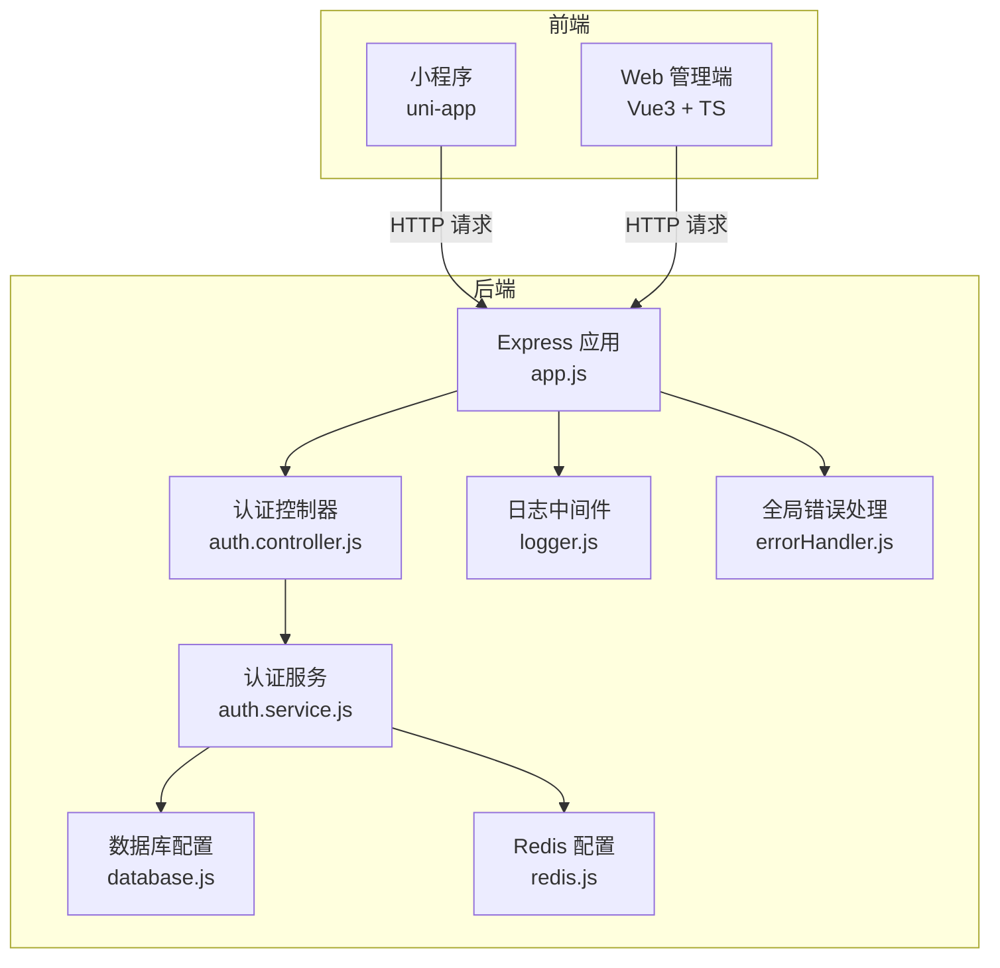
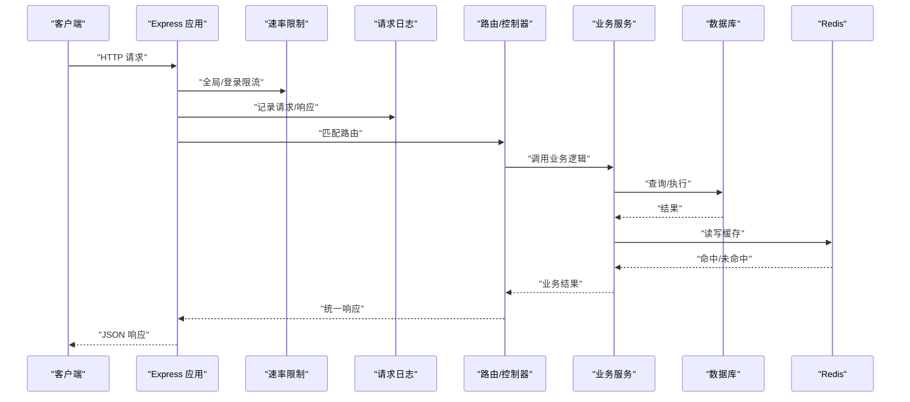
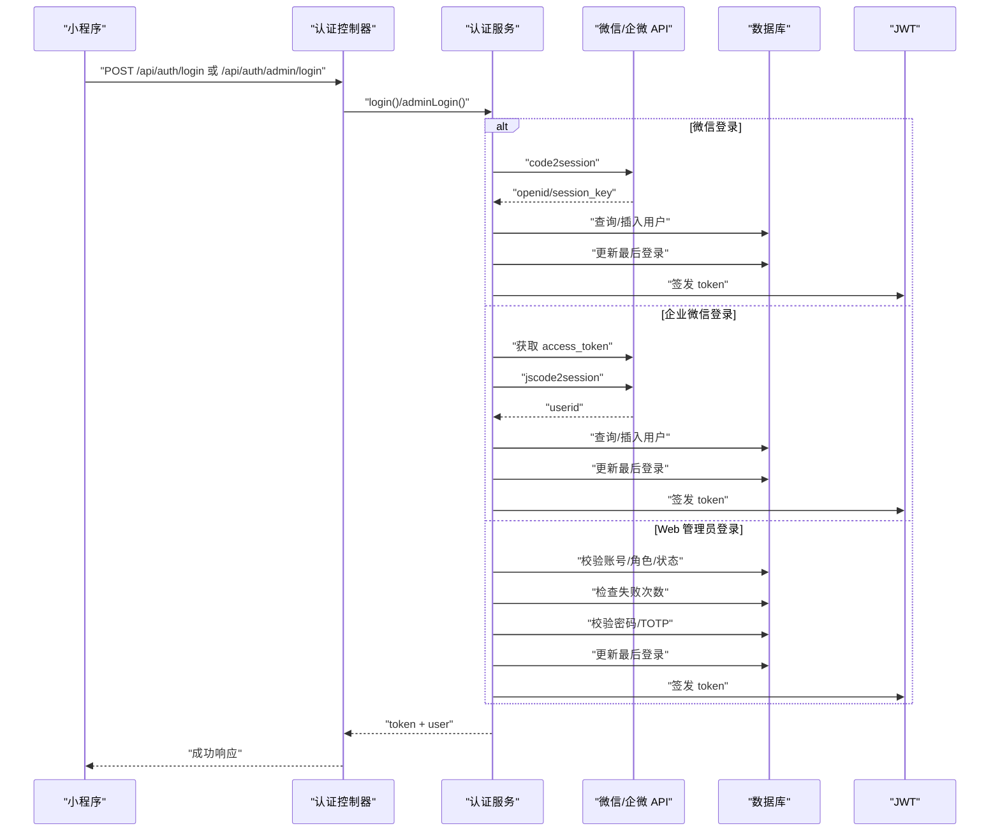
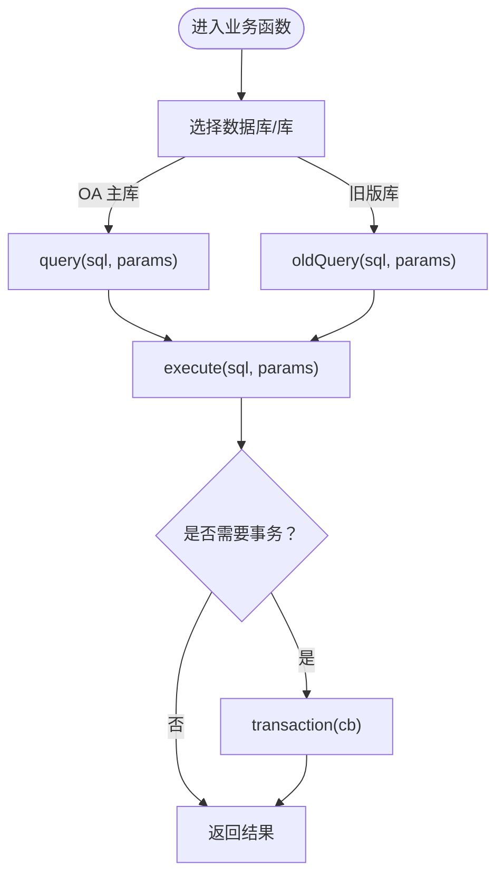
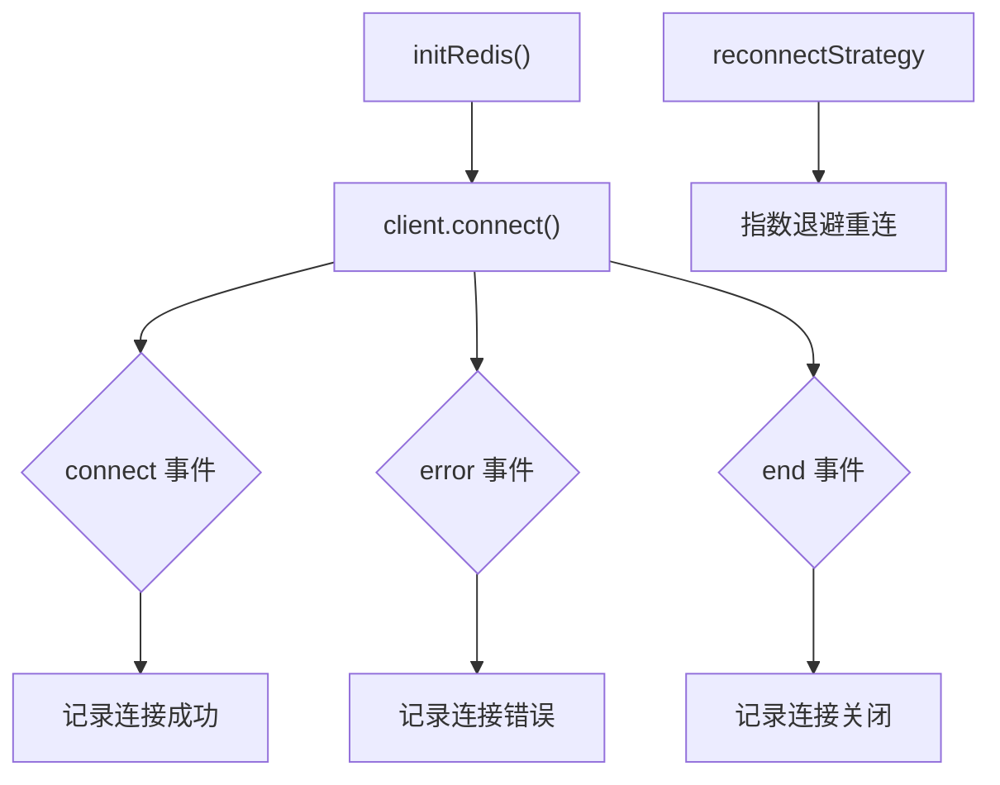
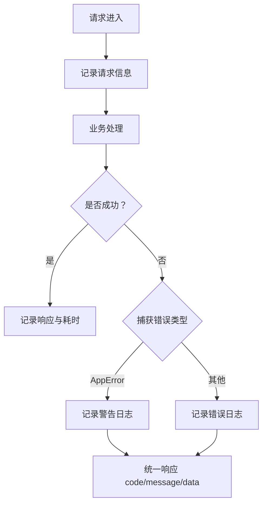
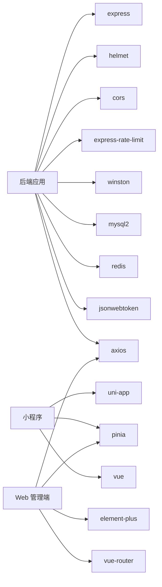

# 故障排查

<cite>
**本文引用的文件**   
- [backend/src/app.js](file://backend/src/app.js)
- [backend/src/common/utils/logger.js](file://backend/src/common/utils/logger.js)
- [backend/src/common/middleware/errorHandler.js](file://backend/src/common/middleware/errorHandler.js)
- [backend/src/auth/controllers/auth.controller.js](file://backend/src/auth/controllers/auth.controller.js)
- [backend/src/auth/services/auth.service.js](file://backend/src/auth/services/auth.service.js)
- [backend/src/common/config/env.js](file://backend/src/common/config/env.js)
- [backend/src/common/config/database.js](file://backend/src/common/config/database.js)
- [backend/src/common/config/redis.js](file://backend/src/common/config/redis.js)
- [backend/src/common/utils/errors.js](file://backend/src/common/utils/errors.js)
- [backend/package.json](file://backend/package.json)
- [miniapp/src/services/request.js](file://miniapp/src/services/request.js)
- [miniapp/src/utils/error-reporter.js](file://miniapp/src/utils/error-reporter.js)
- [webapp/src/utils/request.ts](file://webapp/src/utils/request.ts)
- [miniapp/package.json](file://miniapp/package.json)
- [webapp/package.json](file://webapp/package.json)
</cite>

## 目录
1. [简介](#简介)
2. [项目结构](#项目结构)
3. [核心组件](#核心组件)
4. [架构总览](#架构总览)
5. [详细组件分析](#详细组件分析)
6. [依赖分析](#依赖分析)
7. [性能考虑](#性能考虑)
8. [故障排查指南](#故障排查指南)
9. [结论](#结论)
10. [附录](#附录)

## 简介
本文件面向“智慧办公助手 OA 系统”的运维与开发人员，提供系统级故障排查手册。内容覆盖登录认证问题、数据同步异常、性能瓶颈与部署故障等典型场景，并结合后端日志结构、前端错误追踪、数据库查询优化与网络问题诊断方法，给出可操作的排查步骤与优化建议。同时提供调试工具使用指南与紧急故障处理流程，帮助快速定位与恢复。

## 项目结构
系统采用前后端分离架构：
- 后端：基于 Express 的 REST API 服务，负责认证、业务与数据访问。
- 小程序前端：uni-app + Vue3，通过封装的请求层与后端交互。
- Web 管理端：Vue3 + TypeScript，通过 Axios 封装进行请求与鉴权。
- 基础设施：MySQL 连接池、Redis 客户端、Winston 日志、Helmet/CORS 安全中间件、速率限制与 Swagger 文档。

图表来源
- [backend/src/app.js:1-207](file://backend/src/app.js#L1-L207)
- [backend/src/auth/controllers/auth.controller.js:1-162](file://backend/src/auth/controllers/auth.controller.js#L1-L162)
- [backend/src/auth/services/auth.service.js:1-415](file://backend/src/auth/services/auth.service.js#L1-L415)
- [backend/src/common/config/database.js:1-222](file://backend/src/common/config/database.js#L1-L222)
- [backend/src/common/config/redis.js:1-101](file://backend/src/common/config/redis.js#L1-L101)
- [backend/src/common/utils/logger.js:1-100](file://backend/src/common/utils/logger.js#L1-L100)
- [backend/src/common/middleware/errorHandler.js:1-28](file://backend/src/common/middleware/errorHandler.js#L1-L28)

章节来源
- [backend/src/app.js:1-207](file://backend/src/app.js#L1-L207)
- [backend/src/common/config/env.js:1-118](file://backend/src/common/config/env.js#L1-L118)

## 核心组件
- 应用入口与中间件
  - 安全中间件：Helmet、CORS、速率限制（全局与登录端点）。
  - 请求解析与 JSON 错误捕获。
  - 请求日志中间件与全局错误处理。
  - Swagger 文档挂载与优雅退出。
- 认证与用户态
  - 支持微信 code 登录、企业微信登录、Web 管理员登录（含 TOTP）。
  - 用户资料查询与更新。
- 数据访问
  - OA 主库与旧版库双连接池，提供 query/execute/oldQuery/oldExecute 与事务封装。
- 缓存与会话
  - Redis 客户端延迟初始化与重连策略。
- 日志与错误
  - Winston 控制台与文件输出，请求上下文注入（请求 ID、URL、方法、耗时）。
  - 统一错误响应结构与错误分类（业务/参数/认证/权限/未捕获）。

章节来源
- [backend/src/app.js:29-140](file://backend/src/app.js#L29-L140)
- [backend/src/auth/controllers/auth.controller.js:12-161](file://backend/src/auth/controllers/auth.controller.js#L12-L161)
- [backend/src/auth/services/auth.service.js:16-414](file://backend/src/auth/services/auth.service.js#L16-L414)
- [backend/src/common/config/database.js:65-181](file://backend/src/common/config/database.js#L65-L181)
- [backend/src/common/config/redis.js:16-79](file://backend/src/common/config/redis.js#L16-L79)
- [backend/src/common/utils/logger.js:10-99](file://backend/src/common/utils/logger.js#L10-L99)
- [backend/src/common/middleware/errorHandler.js:12-25](file://backend/src/common/middleware/errorHandler.js#L12-L25)

## 架构总览
系统请求链路概览如下：

图表来源
- [backend/src/app.js:47-140](file://backend/src/app.js#L47-L140)
- [backend/src/common/utils/logger.js:67-96](file://backend/src/common/utils/logger.js#L67-L96)
- [backend/src/auth/controllers/auth.controller.js:16-88](file://backend/src/auth/controllers/auth.controller.js#L16-L88)
- [backend/src/auth/services/auth.service.js:22-87](file://backend/src/auth/services/auth.service.js#L22-L87)
- [backend/src/common/config/database.js:65-109](file://backend/src/common/config/database.js#L65-L109)
- [backend/src/common/config/redis.js:16-57](file://backend/src/common/config/redis.js#L16-L57)

## 详细组件分析

### 认证与登录流程
- 小程序登录：使用微信 code 换取 openid，自动注册/激活用户，签发 JWT。
- 企业微信登录：通过 access_token 换取 userid，自动注册/提升角色，签发 JWT。
- Web 管理员登录：用户名/邮箱 + 密码校验，支持 TOTP 二次验证，记录登录日志。
- 登录失败风控：Web 管理员登录失败次数限制，防止暴力破解。

图表来源
- [backend/src/auth/controllers/auth.controller.js:16-88](file://backend/src/auth/controllers/auth.controller.js#L16-L88)
- [backend/src/auth/services/auth.service.js:22-364](file://backend/src/auth/services/auth.service.js#L22-L364)

章节来源
- [backend/src/auth/controllers/auth.controller.js:12-161](file://backend/src/auth/controllers/auth.controller.js#L12-L161)
- [backend/src/auth/services/auth.service.js:16-414](file://backend/src/auth/services/auth.service.js#L16-L414)

### 数据库访问与事务
- 提供 OA 主库与旧版库双连接池，支持参数化查询与事务。
- 统一日志记录 SQL 片段与耗时，便于定位慢查询。
- 提供 ping/oldPing 健康检查方法。

图表来源
- [backend/src/common/config/database.js:65-181](file://backend/src/common/config/database.js#L65-L181)

章节来源
- [backend/src/common/config/database.js:11-222](file://backend/src/common/config/database.js#L11-L222)

### Redis 缓存与重连
- 延迟初始化客户端，支持密码与 DB 选择。
- 事件监听：connect/error/end，重连策略指数退避。
- 提供 ping/close 方法用于健康检查与优雅关闭。

图表来源
- [backend/src/common/config/redis.js:16-57](file://backend/src/common/config/redis.js#L16-L57)

章节来源
- [backend/src/common/config/redis.js:1-101](file://backend/src/common/config/redis.js#L1-L101)

### 日志与错误处理
- 请求日志：在每个请求上挂载带上下文的日志器，记录进入/完成与耗时。
- 全局错误处理：区分业务错误与未捕获错误，统一返回结构。
- 错误分类：参数校验、认证、权限、资源不存在、业务逻辑与应用错误。

图表来源
- [backend/src/common/utils/logger.js:67-96](file://backend/src/common/utils/logger.js#L67-L96)
- [backend/src/common/middleware/errorHandler.js:12-25](file://backend/src/common/middleware/errorHandler.js#L12-L25)
- [backend/src/common/utils/errors.js:9-98](file://backend/src/common/utils/errors.js#L9-L98)

章节来源
- [backend/src/common/utils/logger.js:1-100](file://backend/src/common/utils/logger.js#L1-100)
- [backend/src/common/middleware/errorHandler.js:1-28](file://backend/src/common/middleware/errorHandler.js#L1-L28)
- [backend/src/common/utils/errors.js:1-99](file://backend/src/common/utils/errors.js#L1-L99)

## 依赖分析
- 后端依赖
  - Express、Helmet、CORS、速率限制、Winston、mysql2、redis、jsonwebtoken、axios、swagger-ui-express 等。
- 前端依赖
  - 小程序：uni-app、pinia、vue。
  - Web 管理端：axios、element-plus、vue、vue-router、pinia、xlsx 等。

图表来源
- [backend/package.json:16-34](file://backend/package.json#L16-L34)
- [miniapp/package.json:11-26](file://miniapp/package.json#L11-L26)
- [webapp/package.json:15-22](file://webapp/package.json#L15-L22)

章节来源
- [backend/package.json:1-58](file://backend/package.json#L1-L58)
- [miniapp/package.json:1-29](file://miniapp/package.json#L1-L29)
- [webapp/package.json:1-53](file://webapp/package.json#L1-L53)

## 性能考虑
- 连接池与队列
  - OA/旧版库均配置了连接上限与排队策略，避免瞬时高并发导致队列积压。
  - 建议根据峰值 QPS 与慢查询比例调整 poolMax，观察等待请求数与超时情况。
- 事务与批量
  - 对于批量写入，优先使用事务减少往返与锁竞争。
- Redis 缓存
  - 利用延迟初始化与重连策略降低冷启动风险；对热点数据设置 TTL，避免内存膨胀。
- 日志与监控
  - 请求日志包含耗时与状态码，可用于识别慢端点与异常路径。
  - 生产环境建议开启文件日志轮转与集中采集。

章节来源
- [backend/src/common/config/database.js:11-43](file://backend/src/common/config/database.js#L11-L43)
- [backend/src/common/config/redis.js:25-36](file://backend/src/common/config/redis.js#L25-L36)
- [backend/src/common/utils/logger.js:67-96](file://backend/src/common/utils/logger.js#L67-L96)

## 故障排查指南

### 一、登录认证问题
常见症状
- 小程序登录失败或提示“获取 openid 失败”。
- 企业微信登录失败或“无法获取用户信息”。
- Web 管理员登录频繁失败被限制。
- JWT 无效或 Token 过期导致 401。

排查步骤
- 检查必要环境变量是否齐全（数据库、Redis、JWT、微信/企业微信配置）。
- 查看后端日志中认证模块的错误记录与耗时。
- 验证微信/企业微信接口连通性与超时设置。
- 确认用户状态（pending/disabled）与角色权限。
- 若启用 TOTP，确认验证码校验与密钥绑定。

定位要点
- 认证控制器与服务的调用链与错误分支。
- 登录失败次数限制与 TOTP 校验逻辑。
- JWT 签发与过期时间配置。

章节来源
- [backend/src/common/config/env.js:13-44](file://backend/src/common/config/env.js#L13-L44)
- [backend/src/auth/controllers/auth.controller.js:16-88](file://backend/src/auth/controllers/auth.controller.js#L16-L88)
- [backend/src/auth/services/auth.service.js:22-364](file://backend/src/auth/services/auth.service.js#L22-L364)
- [backend/src/common/utils/logger.js:10-14](file://backend/src/common/utils/logger.js#L10-L14)

### 二、数据同步异常
常见症状
- 新用户自动注册后未产生操作日志。
- 企业微信用户未正确关联或角色未提升。
- 更新用户资料返回“用户不存在”。

排查步骤
- 核对 users 表与 operation_logs 表的数据一致性。
- 检查企业微信 userid 与 openid 的唯一性约束。
- 确认更新字段白名单与动态 SQL 构造。
- 观察数据库日志中的 SQL 片段与耗时。

定位要点
- 自动注册与日志插入顺序。
- 企业微信登录的白名单与角色提升逻辑。
- 资料更新的字段过滤与 affectedRows 判断。

章节来源
- [backend/src/auth/services/auth.service.js:44-87](file://backend/src/auth/services/auth.service.js#L44-L87)
- [backend/src/auth/services/auth.service.js:130-163](file://backend/src/auth/services/auth.service.js#L130-L163)
- [backend/src/auth/services/auth.service.js:223-259](file://backend/src/auth/services/auth.service.js#L223-L259)
- [backend/src/common/config/database.js:65-109](file://backend/src/common/config/database.js#L65-L109)

### 三、性能瓶颈
常见症状
- 接口响应缓慢或超时。
- 数据库连接池排队过多。
- Redis 连接抖动或断开。

排查步骤
- 查看请求日志中的耗时分布与错误码占比。
- 使用数据库 ping/oldPing 检查连通性。
- 观察 Redis 事件日志与重连次数。
- 评估慢查询与索引缺失情况。

定位要点
- 请求日志中间件的耗时统计。
- 数据库 query/execute 的耗时记录。
- Redis 重连策略与错误事件。

章节来源
- [backend/src/common/utils/logger.js:67-96](file://backend/src/common/utils/logger.js#L67-L96)
- [backend/src/common/config/database.js:187-207](file://backend/src/common/config/database.js#L187-L207)
- [backend/src/common/config/redis.js:25-57](file://backend/src/common/config/redis.js#L25-L57)

### 四、部署与网络问题
常见症状
- Swagger 文档挂载失败。
- CORS 配置导致跨域失败。
- 速率限制误伤正常用户。
- 404 资源不存在。

排查步骤
- 检查 Swagger 开关与挂载路径。
- 校验 CORS 源、方法与头部配置。
- 验证速率限制窗口与阈值。
- 确认路由挂载顺序与 404 处理。

章节来源
- [backend/src/app.js:88-136](file://backend/src/app.js#L88-L136)
- [backend/src/app.js:36-65](file://backend/src/app.js#L36-L65)

### 五、日志分析方法与技巧
- 后端日志结构
  - 时间戳、级别、模块、消息、元数据（请求 ID、URL、方法、状态码、耗时）。
  - 错误日志包含堆栈，便于回溯。
- 前端错误追踪
  - 小程序：全局错误与未处理 Promise 拒绝捕获并上报至后端。
  - Web 管理端：Axios 响应拦截器统一处理业务错误与 HTTP 状态码。
- 数据库查询优化
  - 关注日志中的 SQL 片段与耗时，定位慢查询。
  - 使用 EXPLAIN 分析执行计划，补充索引。
- 网络问题诊断
  - 检查 CORS、代理头（trust proxy）、速率限制与 429/404。

章节来源
- [backend/src/common/utils/logger.js:10-99](file://backend/src/common/utils/logger.js#L10-L99)
- [miniapp/src/utils/error-reporter.js:13-58](file://miniapp/src/utils/error-reporter.js#L13-L58)
- [webapp/src/utils/request.ts:15-74](file://webapp/src/utils/request.ts#L15-L74)

### 六、调试工具使用指南
- 浏览器开发者工具
  - Network 面板查看请求/响应、状态码、Headers 与 Body。
  - Console 查看前端错误与控制台输出。
- Node.js 调试器
  - 使用 --inspect 启动，配合 VS Code/Chrome DevTools 断点调试。
  - 在 app.js、控制器与服务层设置断点，逐步跟踪。
- 数据库客户端
  - 使用 MySQL 客户端连接 OA/旧版库，执行相同 SQL 复现问题。
  - 结合 EXPLAIN 与 SHOW PROFILE 分析慢查询。
- 系统监控工具
  - 使用 top/htop、iostat、iftop 观察 CPU、IO、网络。
  - 结合容器/进程监控（如 PM2）查看内存与重启频率。

章节来源
- [backend/src/app.js:145-204](file://backend/src/app.js#L145-L204)
- [backend/src/common/config/database.js:187-207](file://backend/src/common/config/database.js#L187-L207)

### 七、紧急故障处理流程
- 快速隔离
  - 临时关闭 Swagger、降级非关键接口、限制速率。
- 信息收集
  - 截取近 10 分钟日志、数据库慢查询、Redis 连接状态。
- 修复与验证
  - 修复后在测试环境验证，再灰度到生产。
- 复盘与预防
  - 输出故障报告，完善监控告警与预案。

章节来源
- [backend/src/app.js:167-204](file://backend/src/app.js#L167-L204)
- [backend/src/common/middleware/errorHandler.js:12-25](file://backend/src/common/middleware/errorHandler.js#L12-L25)

### 八、预防性维护策略
- 环境变量与配置
  - 启动前校验必需变量，定期审计配置项。
- 连接池与缓存
  - 监控连接池排队数与活跃连接，按需扩容。
  - 设置 Redis 过期策略与淘汰机制。
- 日志与告警
  - 设置日志级别与轮转，接入集中日志平台。
  - 针对 5xx、慢请求、DB/Redis 异常设置告警。
- 安全加固
  - 定期更新依赖，启用 Helmet/CORS/速率限制。
  - 审计操作日志与登录日志。

章节来源
- [backend/src/common/config/env.js:34-44](file://backend/src/common/config/env.js#L34-L44)
- [backend/src/common/config/database.js:11-43](file://backend/src/common/config/database.js#L11-L43)
- [backend/src/common/config/redis.js:25-57](file://backend/src/common/config/redis.js#L25-L57)

## 结论
通过明确的组件边界、完善的日志与错误处理、严格的速率限制与安全中间件，以及前后端一致的错误响应规范，系统具备较强的可观测性与可维护性。按照本文提供的排查步骤与工具使用指南，可快速定位并解决登录认证、数据同步、性能与部署等典型问题，并建立长效的预防性维护机制。

## 附录
- 常用命令与脚本
  - 后端启动/开发/测试：参见后端 package.json scripts。
  - 小程序开发/构建：参见 miniapp package.json scripts。
  - Web 管理端开发/构建：参见 webapp package.json scripts。
- 关键配置项
  - 环境变量校验与默认值：参见 env.js。
  - 数据库连接池参数：参见 database.js。
  - Redis 连接参数：参见 redis.js。

章节来源
- [backend/package.json:6-14](file://backend/package.json#L6-L14)
- [miniapp/package.json:5-9](file://miniapp/package.json#L5-L9)
- [webapp/package.json:6-13](file://webapp/package.json#L6-L13)
- [backend/src/common/config/env.js:50-115](file://backend/src/common/config/env.js#L50-L115)
- [backend/src/common/config/database.js:11-43](file://backend/src/common/config/database.js#L11-L43)
- [backend/src/common/config/redis.js:21-89](file://backend/src/common/config/redis.js#L21-L89)