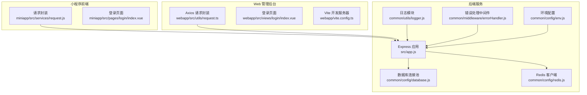
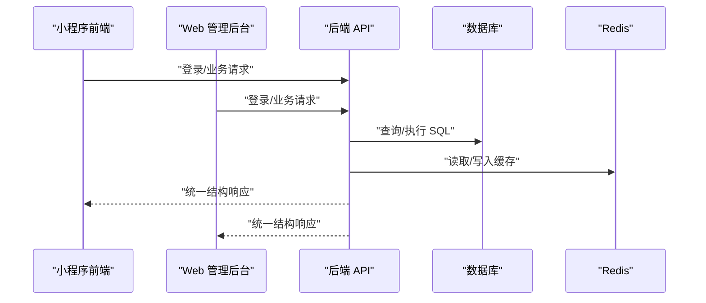
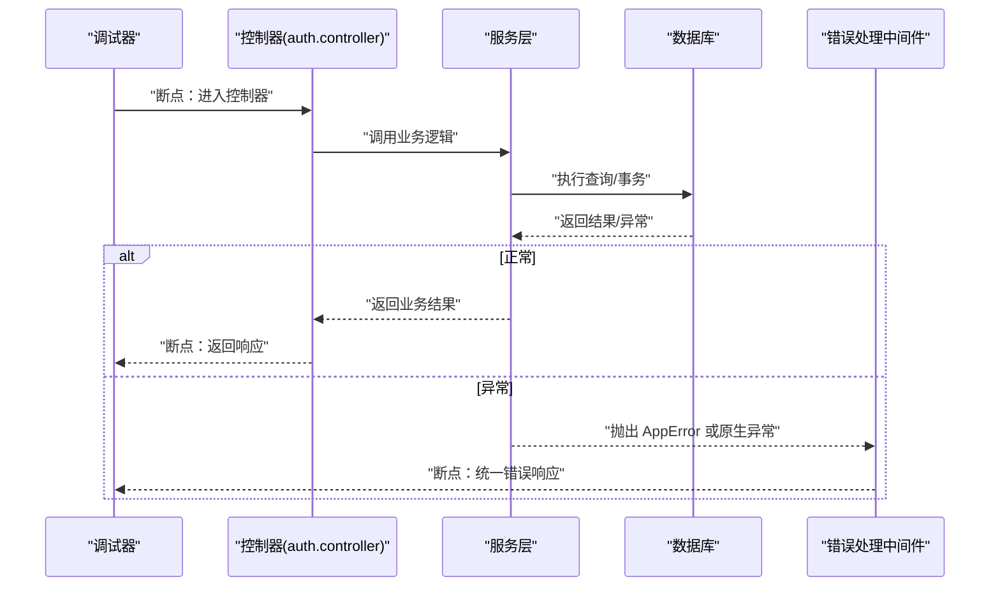
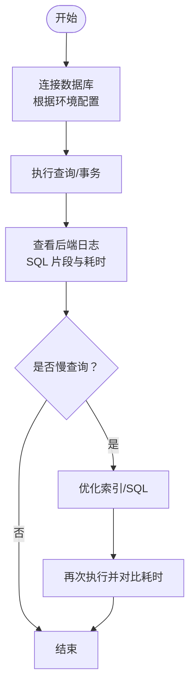
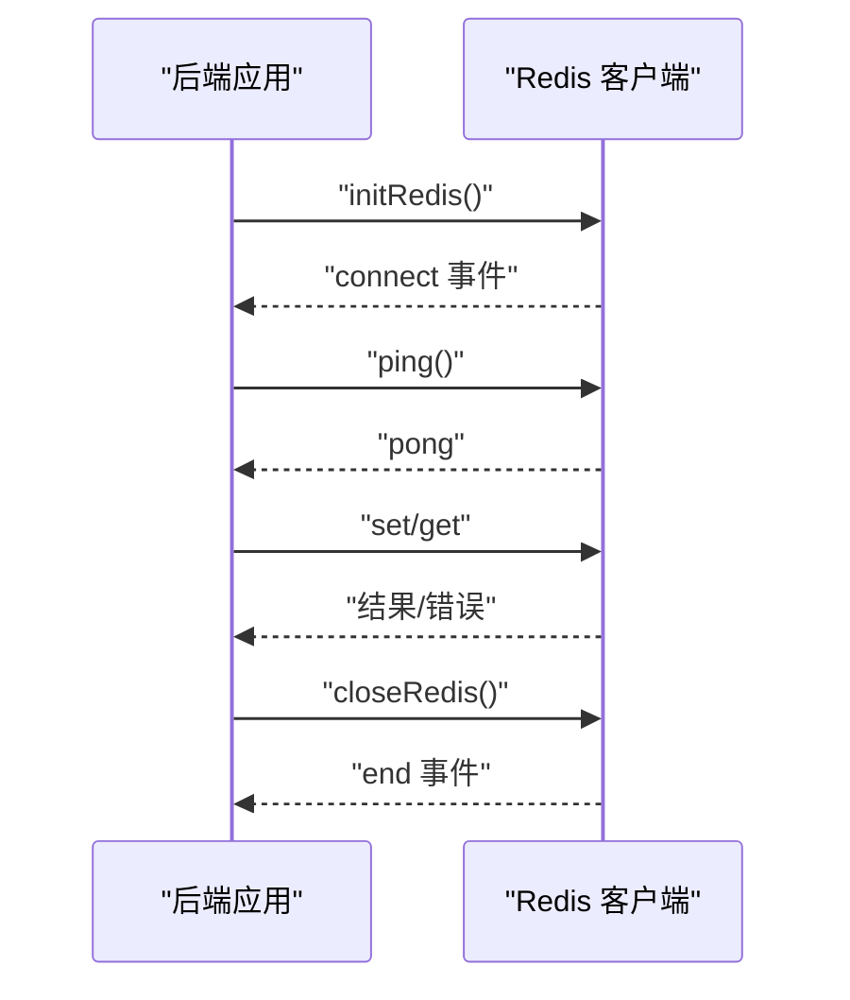
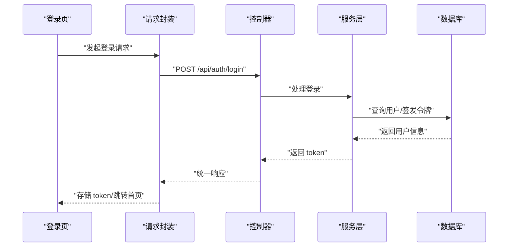
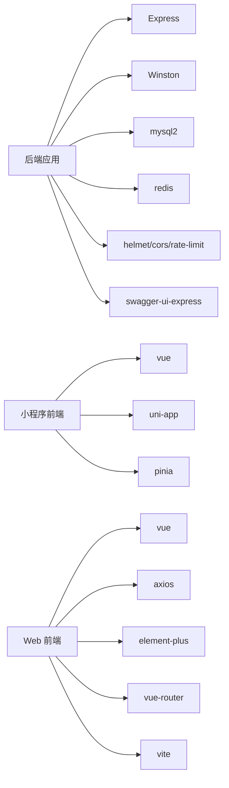

# 调试工具

<cite>
**本文引用的文件**
- [backend/src/app.js](file://backend/src/app.js)
- [backend/src/common/utils/logger.js](file://backend/src/common/utils/logger.js)
- [backend/src/common/middleware/errorHandler.js](file://backend/src/common/middleware/errorHandler.js)
- [backend/src/common/config/env.js](file://backend/src/common/config/env.js)
- [backend/src/common/config/database.js](file://backend/src/common/config/database.js)
- [backend/src/common/config/redis.js](file://backend/src/common/config/redis.js)
- [backend/src/common/utils/errors.js](file://backend/src/common/utils/errors.js)
- [backend/src/auth/controllers/auth.controller.js](file://backend/src/auth/controllers/auth.controller.js)
- [backend/package.json](file://backend/package.json)
- [backend/logs/combined.log](file://backend/logs/combined.log)
- [backend/logs/error.log](file://backend/logs/error.log)
- [miniapp/src/services/request.js](file://miniapp/src/services/request.js)
- [miniapp/src/pages/login/index.vue](file://miniapp/src/pages/login/index.vue)
- [miniapp/.hbuilderx/launch.json](file://miniapp/.hbuilderx/launch.json)
- [miniapp/package.json](file://miniapp/package.json)
- [webapp/src/utils/request.ts](file://webapp/src/utils/request.ts)
- [webapp/src/views/login/index.vue](file://webapp/src/views/login/index.vue)
- [webapp/vite.config.ts](file://webapp/vite.config.ts)
- [webapp/package.json](file://webapp/package.json)
</cite>

## 目录
1. [简介](#简介)
2. [项目结构](#项目结构)
3. [核心组件](#核心组件)
4. [架构总览](#架构总览)
5. [详细组件分析](#详细组件分析)
6. [依赖分析](#依赖分析)
7. [性能考虑](#性能考虑)
8. [故障排查指南](#故障排查指南)
9. [结论](#结论)
10. [附录](#附录)

## 简介
本指南面向“智慧办公助手 OA 系统”的开发者与运维人员，围绕浏览器开发者工具、Node.js 调试器、数据库客户端工具与系统监控工具，提供系统化的调试流程与实操建议。文档覆盖 API 接口调试、前端组件调试、数据库查询调试与网络请求调试等典型场景，并给出日志查看与分析、错误堆栈解读、性能问题定位与常用工具使用方法。

## 项目结构
该仓库包含三部分：
- 后端服务（Node.js + Express）：提供 REST API，负责认证、审批、统计、消息等功能。
- 小程序前端（Vue 3 + UniApp）：提供移动端与微信生态登录体验。
- Web 管理后台（Vue 3 + Vite + Element Plus）：提供管理员登录与企业微信登录能力。

图表来源
- [backend/src/app.js:1-207](file://backend/src/app.js#L1-L207)
- [backend/src/common/utils/logger.js:1-100](file://backend/src/common/utils/logger.js#L1-L100)
- [backend/src/common/middleware/errorHandler.js:1-28](file://backend/src/common/middleware/errorHandler.js#L1-L28)
- [backend/src/common/config/env.js:1-118](file://backend/src/common/config/env.js#L1-L118)
- [backend/src/common/config/database.js:1-222](file://backend/src/common/config/database.js#L1-L222)
- [backend/src/common/config/redis.js:1-101](file://backend/src/common/config/redis.js#L1-L101)
- [miniapp/src/services/request.js:1-127](file://miniapp/src/services/request.js#L1-L127)
- [miniapp/src/pages/login/index.vue:1-196](file://miniapp/src/pages/login/index.vue#L1-L196)
- [webapp/src/utils/request.ts:1-77](file://webapp/src/utils/request.ts#L1-L77)
- [webapp/src/views/login/index.vue:1-211](file://webapp/src/views/login/index.vue#L1-L211)
- [webapp/vite.config.ts:1-33](file://webapp/vite.config.ts#L1-L33)

章节来源
- [backend/src/app.js:1-207](file://backend/src/app.js#L1-L207)
- [webapp/vite.config.ts:1-33](file://webapp/vite.config.ts#L1-L33)

## 核心组件
- 应用入口与中间件：负责安全头、CORS、速率限制、请求解析、请求日志、Swagger 文档、路由注册、全局 404 与错误处理。
- 日志系统：基于 winston 输出到控制台与文件，支持请求级上下文（请求 ID、URL、方法、耗时、状态码）。
- 错误体系：统一 AppError 基类与业务错误码，错误处理中间件集中返回统一结构。
- 数据库层：MySQL 连接池封装，提供查询、执行、事务、连通性检测与日志埋点。
- 缓存层：Redis 客户端封装，连接事件监听与重连策略。
- 前端请求封装：小程序与 Web 前端分别封装了统一的请求与响应拦截逻辑，便于调试与联调。

章节来源
- [backend/src/app.js:1-207](file://backend/src/app.js#L1-L207)
- [backend/src/common/utils/logger.js:1-100](file://backend/src/common/utils/logger.js#L1-L100)
- [backend/src/common/middleware/errorHandler.js:1-28](file://backend/src/common/middleware/errorHandler.js#L1-L28)
- [backend/src/common/config/database.js:1-222](file://backend/src/common/config/database.js#L1-L222)
- [backend/src/common/config/redis.js:1-101](file://backend/src/common/config/redis.js#L1-L101)
- [miniapp/src/services/request.js:1-127](file://miniapp/src/services/request.js#L1-L127)
- [webapp/src/utils/request.ts:1-77](file://webapp/src/utils/request.ts#L1-L77)

## 架构总览
后端采用模块化路由组织，前端通过各自请求封装与后端 API 对接。开发时可利用 Vite 的代理将 /api 请求转发至线上域名，便于本地联调。

图表来源
- [backend/src/app.js:102-140](file://backend/src/app.js#L102-L140)
- [backend/src/common/config/database.js:65-109](file://backend/src/common/config/database.js#L65-L109)
- [backend/src/common/config/redis.js:16-57](file://backend/src/common/config/redis.js#L16-L57)
- [miniapp/src/services/request.js:17-65](file://miniapp/src/services/request.js#L17-L65)
- [webapp/src/utils/request.ts:15-74](file://webapp/src/utils/request.ts#L15-L74)

## 详细组件分析

### 浏览器开发者工具调试（Network/Console/Sources）
- Network 面板
  - 使用 Vite 代理：将 /api 请求代理到线上域名，便于本地调试线上接口。
  - 关注请求头 Authorization、Content-Type，观察响应状态码与响应体结构（统一为 { code, message, data }）。
  - 结合后端请求日志中间件，记录请求 URL、方法、耗时与状态码，快速定位慢请求与异常。
- Console 面板
  - 查看前端请求封装中的错误提示与拦截器行为（如 401、403、404、500 的统一处理）。
  - 在登录页与业务页打断点，检查 token 存储、用户信息同步与跳转逻辑。
- Sources 面板
  - 设置断点于请求发起处与响应拦截处，逐步跟踪异步流程。
  - 利用条件断点在特定状态（如 code 非 0、token 缺失）时暂停，辅助定位业务错误。

章节来源
- [webapp/vite.config.ts:21-30](file://webapp/vite.config.ts#L21-L30)
- [webapp/src/utils/request.ts:15-74](file://webapp/src/utils/request.ts#L15-L74)
- [webapp/src/views/login/index.vue:37-65](file://webapp/src/views/login/index.vue#L37-L65)
- [backend/src/common/utils/logger.js:67-96](file://backend/src/common/utils/logger.js#L67-L96)

### Node.js 调试器（后端）
- 启动与断点
  - 使用开发脚本启动后端服务，便于 attach 断点进行单步调试。
  - 在控制器层（如登录）与服务层关键节点设置断点，观察参数、分支与异常路径。
- 常见断点位置
  - 控制器入口：接收请求参数、鉴权信息与调用服务层。
  - 服务层：数据库事务、缓存读写、外部接口调用。
  - 中间件：请求日志、错误处理、速率限制与 CORS。
- 优雅退出与未捕获异常
  - 关注进程信号处理与未捕获异常/拒绝日志，确保调试时能正确复现崩溃场景。

图表来源
- [backend/src/auth/controllers/auth.controller.js:16-29](file://backend/src/auth/controllers/auth.controller.js#L16-L29)
- [backend/src/common/utils/errors.js:9-24](file://backend/src/common/utils/errors.js#L9-L24)
- [backend/src/common/middleware/errorHandler.js:12-25](file://backend/src/common/middleware/errorHandler.js#L12-L25)
- [backend/src/common/config/database.js:168-181](file://backend/src/common/config/database.js#L168-L181)

章节来源
- [backend/package.json:6-14](file://backend/package.json#L6-L14)
- [backend/src/auth/controllers/auth.controller.js:1-162](file://backend/src/auth/controllers/auth.controller.js#L1-L162)
- [backend/src/common/utils/errors.js:1-99](file://backend/src/common/utils/errors.js#L1-L99)
- [backend/src/common/middleware/errorHandler.js:1-28](file://backend/src/common/middleware/errorHandler.js#L1-L28)

### 数据库客户端工具（MySQL）
- 连接配置
  - 使用后端环境配置中的数据库主机、端口、账号、密码与库名，建立连接。
  - 可同时连接新业务库与旧版库，便于数据迁移与兼容性验证。
- 查询与性能分析
  - 使用 EXPLAIN 分析慢查询，关注索引使用、扫描行数与临时表。
  - 结合后端日志中的 SQL 片段与耗时，定位热点 SQL 并优化。
- 事务与一致性
  - 在事务边界设置回滚点，验证提交/回滚后的数据一致性。
  - 使用连接池参数（最大连接、队列限制、保活）观察并发下的稳定性。

图表来源
- [backend/src/common/config/env.js:58-78](file://backend/src/common/config/env.js#L58-L78)
- [backend/src/common/config/database.js:11-43](file://backend/src/common/config/database.js#L11-L43)
- [backend/src/common/config/database.js:65-109](file://backend/src/common/config/database.js#L65-L109)

章节来源
- [backend/src/common/config/env.js:1-118](file://backend/src/common/config/env.js#L1-L118)
- [backend/src/common/config/database.js:1-222](file://backend/src/common/config/database.js#L1-L222)

### 系统监控工具（Redis）
- 连接与健康
  - 使用 Redis 客户端封装提供的 ping 方法与连接事件，验证连通性与重连策略。
  - 关注日志中的连接成功、错误与关闭事件，定位网络波动与配置问题。
- 缓存命中与键空间
  - 通过 INFO/KEYS/SCAN 等命令观察键空间变化与内存占用。
  - 结合业务逻辑（如登录态、会话、限流令牌）验证缓存生命周期与一致性。

图表来源
- [backend/src/common/config/redis.js:16-57](file://backend/src/common/config/redis.js#L16-L57)
- [backend/src/common/config/redis.js:85-93](file://backend/src/common/config/redis.js#L85-L93)

章节来源
- [backend/src/common/config/redis.js:1-101](file://backend/src/common/config/redis.js#L1-L101)

### 调试场景示例

#### API 接口调试（以登录为例）
- 小程序登录
  - 触发登录流程，断言前端请求封装按预期携带 Authorization 与正确 URL。
  - 后端控制器接收 code，服务层处理登录逻辑，错误处理中间件统一返回。
- Web 管理后台登录
  - 输入账号密码与 TOTP（如启用），Axios 请求拦截器注入 token。
  - 登录页处理 401/403/500 等状态码，统一提示与路由跳转。

图表来源
- [miniapp/src/pages/login/index.vue:91-119](file://miniapp/src/pages/login/index.vue#L91-L119)
- [miniapp/src/services/request.js:17-65](file://miniapp/src/services/request.js#L17-L65)
- [backend/src/auth/controllers/auth.controller.js:16-29](file://backend/src/auth/controllers/auth.controller.js#L16-L29)
- [webapp/src/views/login/index.vue:37-65](file://webapp/src/views/login/index.vue#L37-L65)
- [webapp/src/utils/request.ts:15-74](file://webapp/src/utils/request.ts#L15-L74)

章节来源
- [miniapp/src/pages/login/index.vue:1-196](file://miniapp/src/pages/login/index.vue#L1-L196)
- [miniapp/src/services/request.js:1-127](file://miniapp/src/services/request.js#L1-L127)
- [backend/src/auth/controllers/auth.controller.js:1-162](file://backend/src/auth/controllers/auth.controller.js#L1-L162)
- [webapp/src/views/login/index.vue:1-211](file://webapp/src/views/login/index.vue#L1-L211)
- [webapp/src/utils/request.ts:1-77](file://webapp/src/utils/request.ts#L1-L77)

#### 前端组件调试（登录页）
- 小程序登录页
  - 断点于登录按钮点击、wx.qy 登录与 uni.login 流程，检查 code 获取与后续请求。
  - 开发模式下可使用 dev-mode-token 进行模拟登录，便于无后端环境联调。
- Web 登录页
  - 断点于表单校验、TOTP 输入与 Axios 请求，观察响应拦截器对错误的统一处理。

章节来源
- [miniapp/src/pages/login/index.vue:91-119](file://miniapp/src/pages/login/index.vue#L91-L119)
- [miniapp/src/services/request.js:67-106](file://miniapp/src/services/request.js#L67-L106)
- [webapp/src/views/login/index.vue:37-65](file://webapp/src/views/login/index.vue#L37-L65)

#### 数据库查询调试
- 使用后端封装的 query/execute 与事务函数，结合日志中的 SQL 片段与耗时字段，定位慢查询。
- 在事务边界设置断点，验证提交/回滚后的数据一致性。

章节来源
- [backend/src/common/config/database.js:65-109](file://backend/src/common/config/database.js#L65-L109)
- [backend/src/common/config/database.js:168-181](file://backend/src/common/config/database.js#L168-L181)
- [backend/src/common/utils/logger.js:67-96](file://backend/src/common/utils/logger.js#L67-L96)

#### 网络请求调试
- 小程序端
  - 断点于 realRequest，检查 401 重定向登录、业务错误码与网络异常处理。
- Web 端
  - 断点于 Axios 请求/响应拦截器，观察统一错误提示与路由跳转。

章节来源
- [miniapp/src/services/request.js:17-65](file://miniapp/src/services/request.js#L17-L65)
- [webapp/src/utils/request.ts:15-74](file://webapp/src/utils/request.ts#L15-L74)

## 依赖分析
- 后端依赖
  - Express、Winston、MySQL2、Redis、Helmet、CORS、Rate Limit、Swagger UI 等。
- 前端依赖
  - 小程序：Vue 3、UniApp、Pinia。
  - Web：Vue 3、Element Plus、Axios、Vite、Vue Router、ECharts、XLSX 等。

图表来源
- [backend/package.json:16-34](file://backend/package.json#L16-L34)
- [miniapp/package.json:11-26](file://miniapp/package.json#L11-L26)
- [webapp/package.json:15-44](file://webapp/package.json#L15-L44)

章节来源
- [backend/package.json:1-58](file://backend/package.json#L1-L58)
- [miniapp/package.json:1-29](file://miniapp/package.json#L1-L29)
- [webapp/package.json:1-53](file://webapp/package.json#L1-L53)

## 性能考虑
- 请求日志与耗时
  - 后端在请求进入与完成时记录耗时与状态码，便于识别慢请求与异常路径。
- 数据库与缓存
  - 使用连接池与事务，结合 EXPLAIN 与后端日志耗时字段，定位热点 SQL。
  - Redis 提供重连策略与连接事件日志，保障高可用。
- 前端请求拦截
  - Web/Ajax 统一处理错误与超时，减少重复逻辑与提升用户体验。

章节来源
- [backend/src/common/utils/logger.js:67-96](file://backend/src/common/utils/logger.js#L67-L96)
- [backend/src/common/config/database.js:65-109](file://backend/src/common/config/database.js#L65-L109)
- [backend/src/common/config/redis.js:16-57](file://backend/src/common/config/redis.js#L16-L57)
- [webapp/src/utils/request.ts:15-74](file://webapp/src/utils/request.ts#L15-L74)

## 故障排查指南
- 日志查看与分析
  - 控制台：开发环境彩色输出，快速定位错误级别与模块。
  - 文件：error.log 与 combined.log 分别记录错误与综合日志，按时间与模块筛选。
- 错误堆栈解读
  - AppError 子类（认证、权限、业务、参数等）统一返回结构，优先查看 code 与 message。
  - 未捕获异常/拒绝：关注进程信号处理与日志中的错误堆栈，定位崩溃点。
- 常见问题定位
  - 登录失败：检查前端请求封装中的 401 处理、后端控制器参数校验与服务层错误。
  - 数据库异常：结合 SQL 日志与耗时字段，使用 EXPLAIN 分析并优化。
  - 缓存不可用：检查 Redis 连接事件与 ping 结果，确认配置与网络。

章节来源
- [backend/src/common/utils/logger.js:1-100](file://backend/src/common/utils/logger.js#L1-L100)
- [backend/src/common/middleware/errorHandler.js:1-28](file://backend/src/common/middleware/errorHandler.js#L1-L28)
- [backend/src/common/utils/errors.js:1-99](file://backend/src/common/utils/errors.js#L1-L99)
- [backend/src/common/config/redis.js:85-93](file://backend/src/common/config/redis.js#L85-L93)
- [backend/logs/combined.log](file://backend/logs/combined.log)
- [backend/logs/error.log](file://backend/logs/error.log)

## 结论
通过浏览器开发者工具、Node.js 调试器、数据库与 Redis 工具，配合后端统一的日志与错误处理机制，可以高效完成 API、前端组件、数据库与网络层面的调试工作。建议在日常开发中充分利用请求日志、错误码与拦截器，形成标准化的调试流程与问题定位方法。

## 附录
- 开发与调试建议
  - 使用 Vite 代理与后端 Swagger 文档，提升联调效率。
  - 在小程序端利用开发模式模拟登录，减少对后端的依赖。
  - 对关键路径设置断点与日志埋点，形成闭环验证。