# RBAC 权限系统

<cite>
**本文档引用的文件**
- [auth.controller.js](file://backend/src/auth/controllers/auth.controller.js)
- [auth.service.js](file://backend/src/auth/services/auth.service.js)
- [auth.middleware.js](file://backend/src/common/middleware/auth.js)
- [auth.routes.js](file://backend/src/auth/routes/auth.routes.js)
- [admin.routes.js](file://backend/src/core/routes/admin.routes.js)
- [compliance.routes.js](file://backend/src/features/compliance/routes/compliance.routes.js)
- [migration_v1_rbac.sql](file://sql/migration_v1_rbac.sql)
- [errors.js](file://backend/src/common/utils/errors.js)
- [env.js](file://backend/src/common/config/env.js)
- [database.js](file://backend/src/common/config/database.js)
- [response.js](file://backend/src/common/utils/response.js)
- [constants.js](file://backend/src/common/utils/constants.js)
- [app.js](file://backend/src/app.js)
- [package.json](file://backend/package.json)
</cite>

## 目录
1. [简介](#简介)
2. [项目结构](#项目结构)
3. [核心组件](#核心组件)
4. [架构概览](#架构概览)
5. [详细组件分析](#详细组件分析)
6. [依赖关系分析](#依赖关系分析)
7. [性能考虑](#性能考虑)
8. [故障排除指南](#故障排除指南)
9. [结论](#结论)

## 简介

智慧办公助手 OA 系统采用基于角色的访问控制（RBAC）权限管理系统，为微信小程序和 Web 管理后台提供细粒度的权限控制。该系统实现了完整的用户认证、授权和权限管理功能，支持多种登录方式和安全机制。

RBAC 系统的核心特点包括：
- 多层次权限控制（角色级别和权限级别）
- 支持微信小程序和企业微信双重认证
- 二次验证（TOTP）安全机制
- 动态权限缓存优化
- 统一的错误处理和响应格式

## 项目结构

后端采用模块化的三层架构设计，主要目录结构如下：

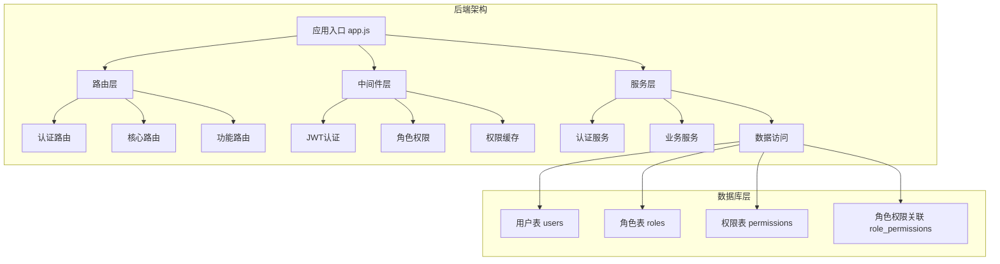

**图表来源**
- [app.js:1-214](file://backend/src/app.js#L1-L214)
- [auth.routes.js:1-38](file://backend/src/auth/routes/auth.routes.js#L1-L38)
- [admin.routes.js:1-70](file://backend/src/core/routes/admin.routes.js#L1-L70)

**章节来源**
- [app.js:102-131](file://backend/src/app.js#L102-L131)
- [auth.routes.js:17-35](file://backend/src/auth/routes/auth.routes.js#L17-L35)

## 核心组件

### 认证系统

RBAC 权限系统的核心认证组件包括：

#### 用户认证流程
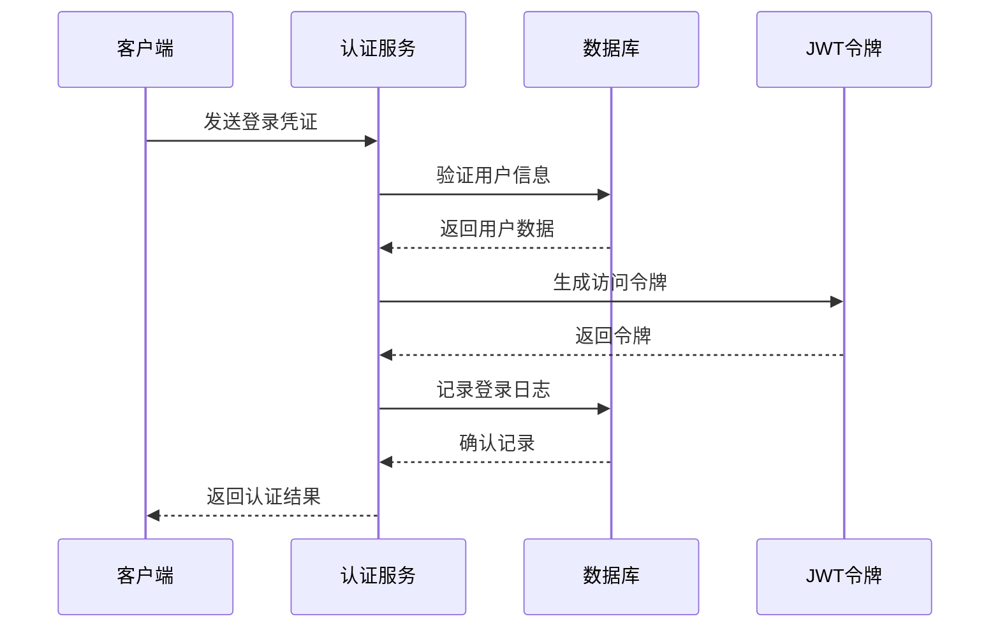

**图表来源**
- [auth.service.js:22-86](file://backend/src/auth/services/auth.service.js#L22-L86)
- [auth.controller.js:16-28](file://backend/src/auth/controllers/auth.controller.js#L16-L28)

#### 权限控制机制
系统实现了多层次的权限控制：

1. **角色权限控制**：基于用户角色的粗粒度控制
2. **权限细粒度控制**：基于具体权限标识的精确控制
3. **动态权限缓存**：5分钟TTL的权限缓存优化

**章节来源**
- [auth.middleware.js:14-56](file://backend/src/common/middleware/auth.js#L14-L56)
- [auth.middleware.js:99-151](file://backend/src/common/middleware/auth.js#L99-L151)

### 数据模型

RBAC 系统的核心数据模型包括四个主要表：

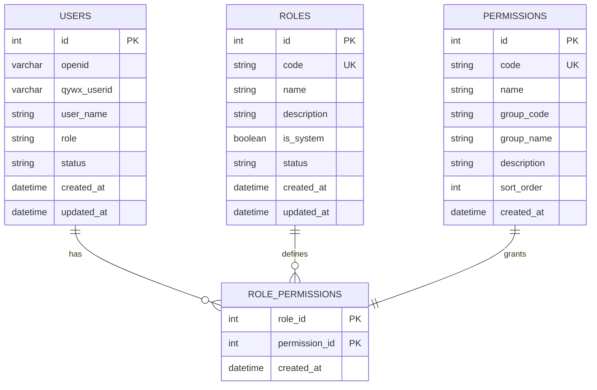

**图表来源**
- [migration_v1_rbac.sql:12-54](file://sql/migration_v1_rbac.sql#L12-L54)

**章节来源**
- [migration_v1_rbac.sql:59-149](file://sql/migration_v1_rbac.sql#L59-L149)

## 架构概览

### 整体架构设计

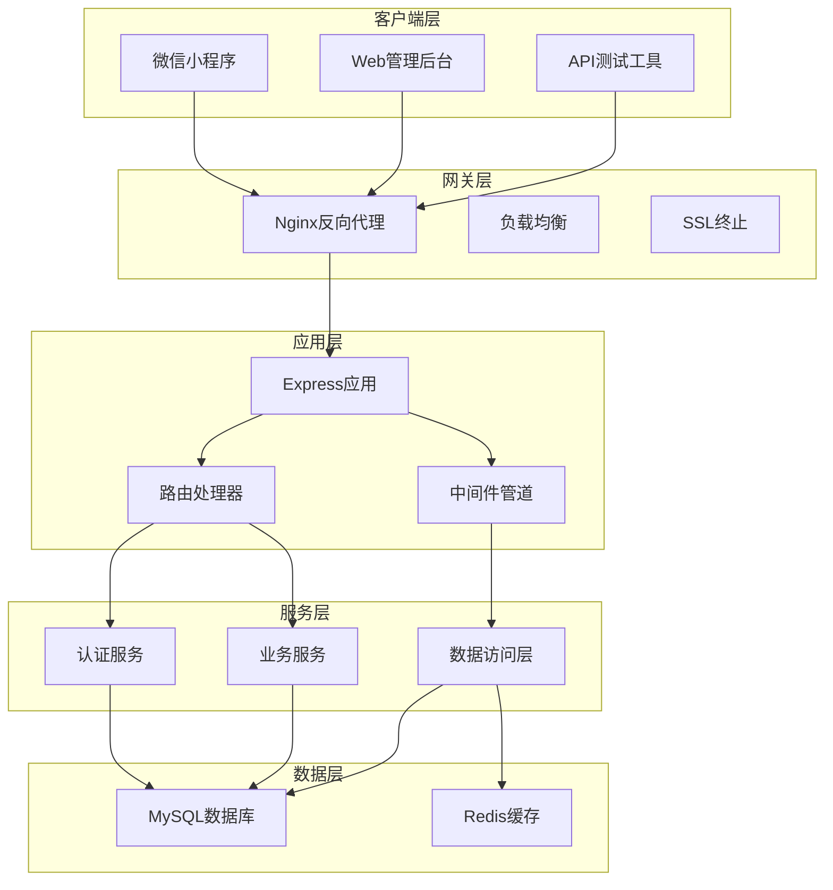

**图表来源**
- [app.js:19-24](file://backend/src/app.js#L19-L24)
- [env.js:50-115](file://backend/src/common/config/env.js#L50-L115)

### 权限控制流程

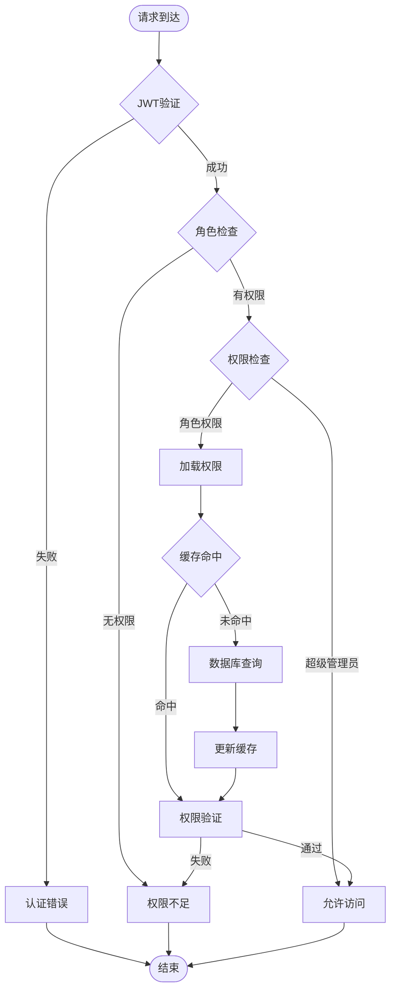

**图表来源**
- [auth.middleware.js:14-56](file://backend/src/common/middleware/auth.js#L14-L56)
- [auth.middleware.js:128-151](file://backend/src/common/middleware/auth.js#L128-L151)

## 详细组件分析

### 认证控制器

认证控制器负责处理所有用户认证相关的HTTP请求：

#### 登录流程分析
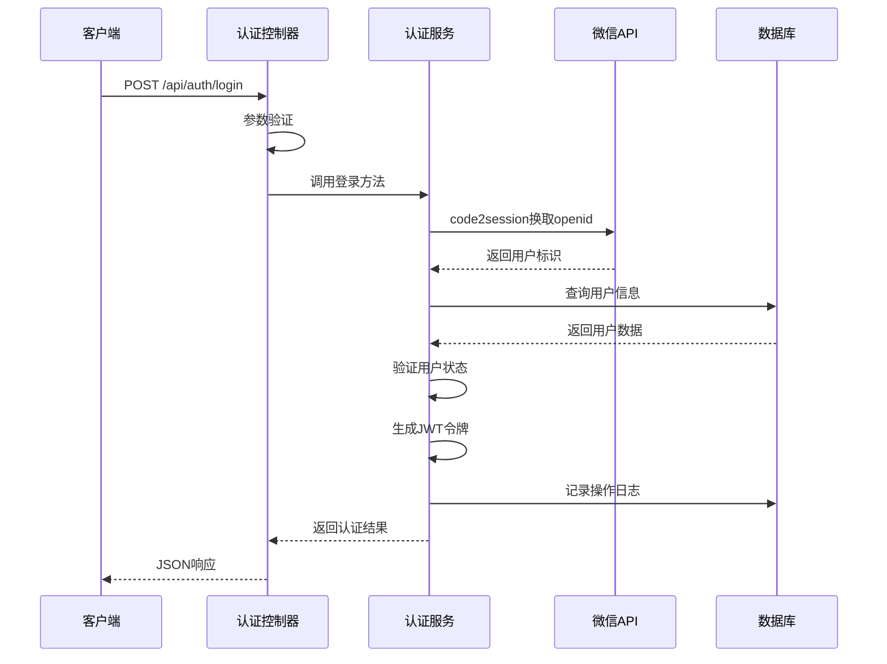

**图表来源**
- [auth.controller.js:16-28](file://backend/src/auth/controllers/auth.controller.js#L16-L28)
- [auth.service.js:22-86](file://backend/src/auth/services/auth.service.js#L22-L86)

#### 用户资料管理
认证控制器还提供了用户资料的查询和更新功能：

**章节来源**
- [auth.controller.js:35-58](file://backend/src/auth/controllers/auth.controller.js#L35-L58)
- [auth.service.js:203-258](file://backend/src/auth/services/auth.service.js#L203-L258)

### 认证服务

认证服务是RBAC系统的核心业务逻辑实现：

#### 多重认证支持
系统支持三种认证方式：

1. **微信小程序认证**：使用微信code换取openid
2. **企业微信认证**：支持企业微信用户直接登录
3. **Web管理员认证**：基于用户名/邮箱和密码的认证

#### TOTP二次验证
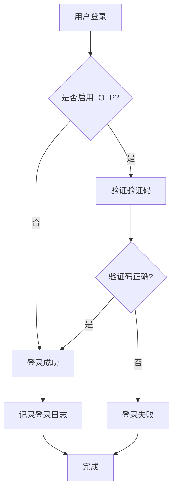

**图表来源**
- [auth.service.js:321-330](file://backend/src/auth/services/auth.service.js#L321-L330)

**章节来源**
- [auth.service.js:22-196](file://backend/src/auth/services/auth.service.js#L22-L196)
- [auth.service.js:267-363](file://backend/src/auth/services/auth.service.js#L267-L363)

### 权限中间件

权限中间件提供了灵活的权限控制机制：

#### 角色权限控制
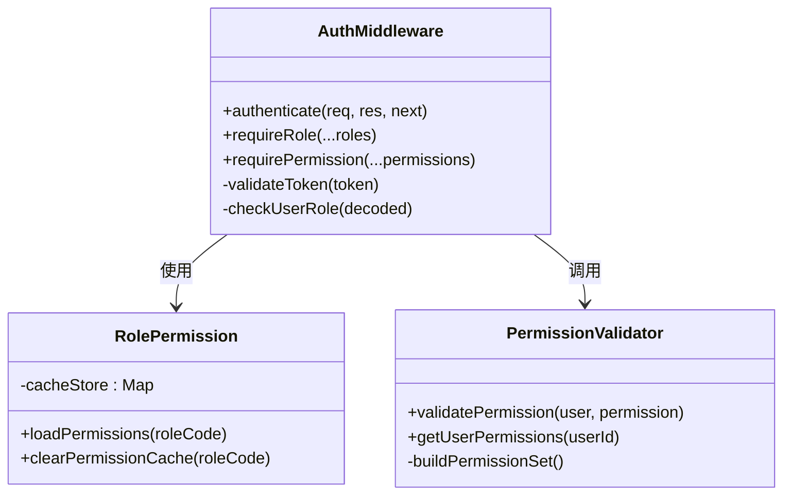

**图表来源**
- [auth.middleware.js:14-56](file://backend/src/common/middleware/auth.js#L14-L56)
- [auth.middleware.js:99-151](file://backend/src/common/middleware/auth.js#L99-L151)

#### 权限缓存机制
系统实现了高效的权限缓存策略：

**章节来源**
- [auth.middleware.js:86-118](file://backend/src/common/middleware/auth.js#L86-L118)
- [auth.middleware.js:128-151](file://backend/src/common/middleware/auth.js#L128-L151)

### 路由配置

系统采用模块化的路由设计，每个功能模块都有独立的路由配置：

#### 认证路由
认证路由提供了完整的用户认证功能：

**章节来源**
- [auth.routes.js:17-35](file://backend/src/auth/routes/auth.routes.js#L17-L35)
- [admin.routes.js:15-67](file://backend/src/core/routes/admin.routes.js#L15-L67)

#### 功能路由
各功能模块的路由都集成了权限控制：

**章节来源**
- [compliance.routes.js:8-27](file://backend/src/features/compliance/routes/compliance.routes.js#L8-L27)

## 依赖关系分析

### 核心依赖关系

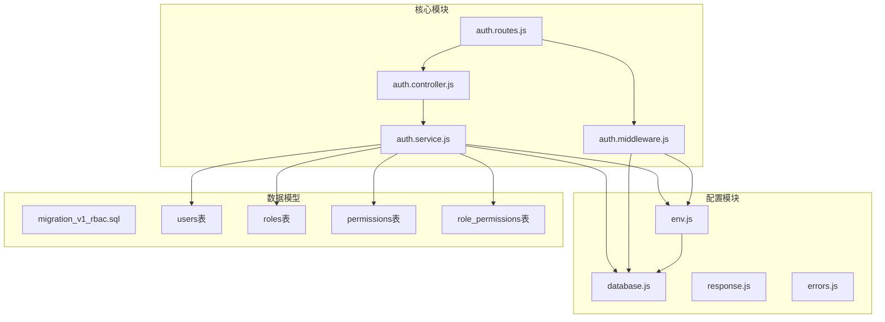

**图表来源**
- [auth.controller.js:1-137](file://backend/src/auth/controllers/auth.controller.js#L1-L137)
- [auth.service.js:1-414](file://backend/src/auth/services/auth.service.js#L1-L414)
- [auth.middleware.js:1-154](file://backend/src/common/middleware/auth.js#L1-L154)

### 外部依赖

系统的主要外部依赖包括：

**章节来源**
- [package.json:16-37](file://backend/package.json#L16-L37)
- [env.js:13-44](file://backend/src/common/config/env.js#L13-L44)

## 性能考虑

### 缓存策略

RBAC系统采用了多层缓存策略来提升性能：

1. **权限缓存**：角色权限集合缓存5分钟
2. **数据库连接池**：MySQL连接池优化
3. **Redis集成**：用于会话存储和缓存

### 性能优化措施

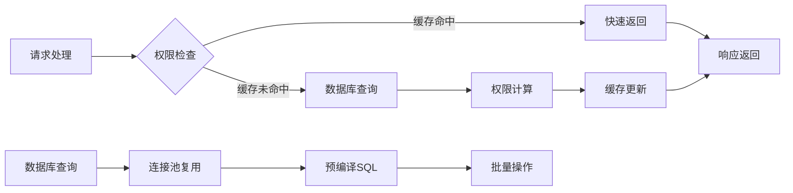

**图表来源**
- [auth.middleware.js:86-118](file://backend/src/common/middleware/auth.js#L86-L118)
- [database.js:11-43](file://backend/src/common/config/database.js#L11-L43)

## 故障排除指南

### 常见错误类型

系统定义了多种错误类型来处理不同的异常情况：

#### 错误分类
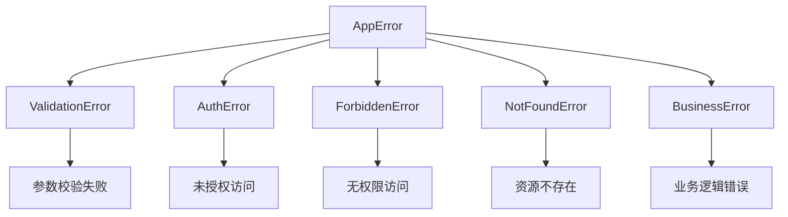

**图表来源**
- [errors.js:9-89](file://backend/src/common/utils/errors.js#L9-L89)

#### 错误处理流程
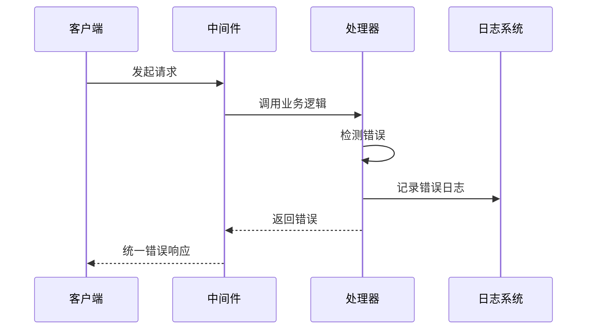

**图表来源**
- [errors.js:29-89](file://backend/src/common/utils/errors.js#L29-L89)

**章节来源**
- [errors.js:29-89](file://backend/src/common/utils/errors.js#L29-L89)
- [response.js:11-24](file://backend/src/common/utils/response.js#L11-L24)

### 调试建议

1. **检查JWT配置**：确保JWT密钥正确设置
2. **验证数据库连接**：确认数据库连接池配置
3. **权限验证**：检查角色权限映射关系
4. **缓存清理**：必要时清理权限缓存

**章节来源**
- [env.js:89-93](file://backend/src/common/config/env.js#L89-L93)
- [database.js:65-109](file://backend/src/common/config/database.js#L65-L109)

## 结论

智慧办公助手 OA 系统的 RBAC 权限系统是一个设计完善的权限管理解决方案。系统具有以下优势：

1. **安全性**：支持多种认证方式和二次验证机制
2. **灵活性**：可扩展的角色和权限体系
3. **性能**：多层缓存和优化的数据库访问
4. **可维护性**：模块化的设计和清晰的职责分离

该系统为企业的数字化转型提供了坚实的权限管理基础，能够有效保障系统的安全性和数据的完整性。