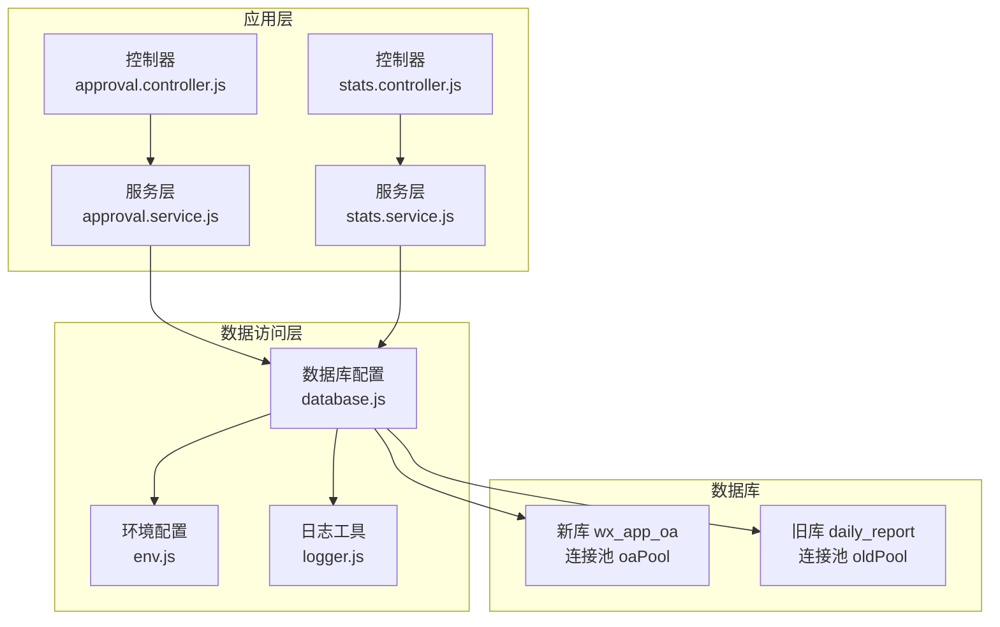
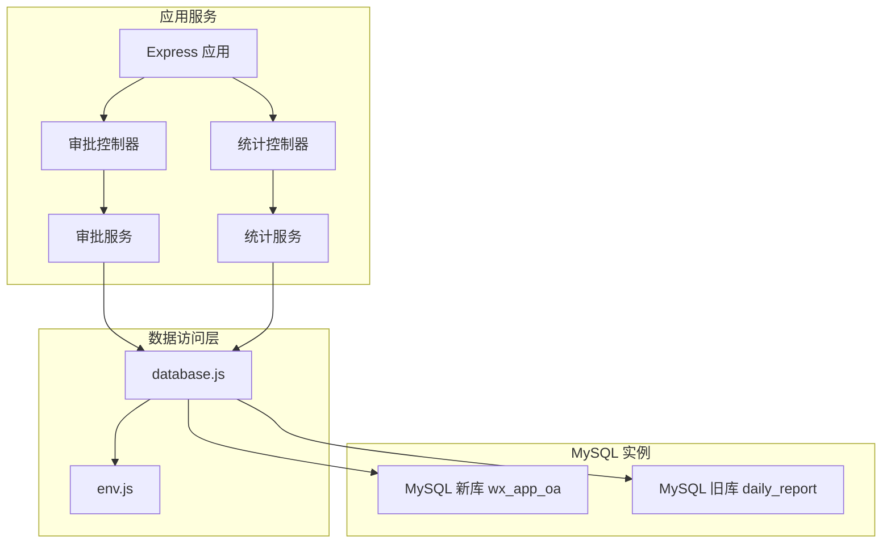
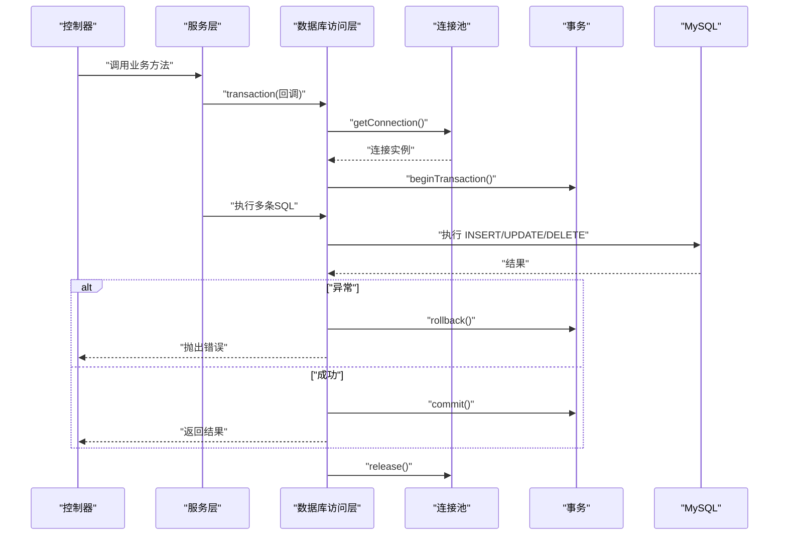
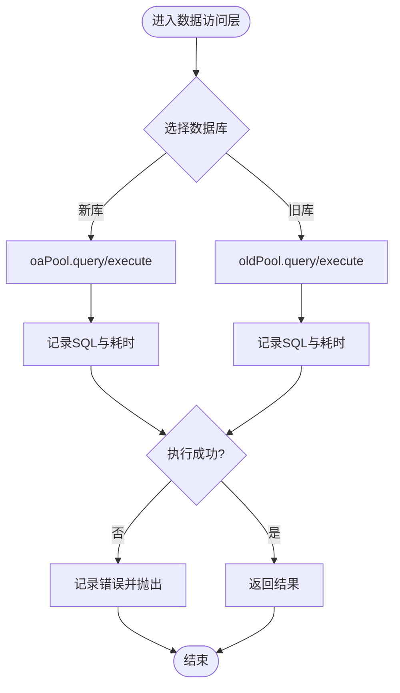
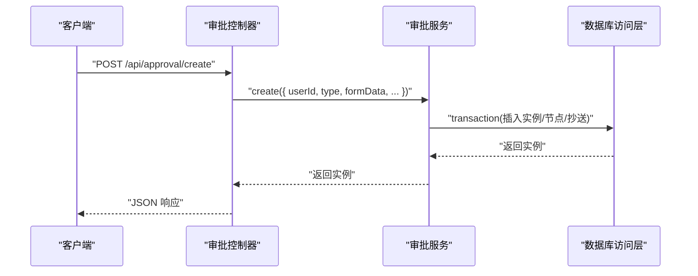
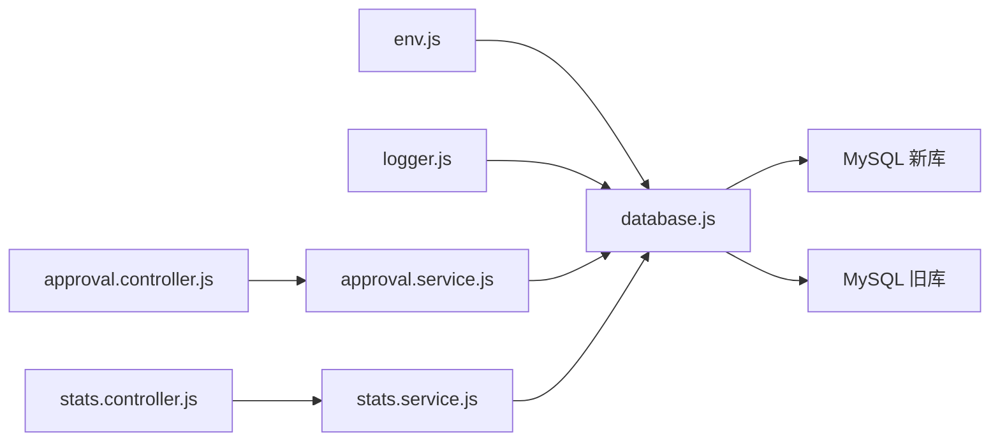

# 数据库架构设计

<cite>
**本文引用的文件**   
- [database.js](file://backend/src/common/config/database.js)
- [database.js](file://backend/src/config/database.js)
- [env.js](file://backend/src/common/config/env.js)
- [env.js](file://backend/src/config/env.js)
- [logger.js](file://backend/src/common/utils/logger.js)
- [init-db.js](file://backend/scripts/init-db.js)
- [alter_daily_reports.sql](file://backend/scripts/alter_daily_reports.sql)
- [alter_daily_reports_safe.sql](file://backend/scripts/alter_daily_reports_safe.sql)
- [approval_cc.sql](file://backend/scripts/approval_cc.sql)
- [review_records.sql](file://backend/scripts/review_records.sql)
- [approval.service.js](file://backend/src/core/services/approval.service.js)
- [stats.service.js](file://backend/src/features/services/stats.service.js)
- [approval.controller.js](file://backend/src/core/controllers/approval.controller.js)
- [stats.controller.js](file://backend/src/features/controllers/stats.controller.js)
- [技术可行性分析报告.md](file://backend/docs/技术可行性分析报告.md)
</cite>

## 更新摘要
**变更内容**   
- 更新双数据库架构设计，明确新OA系统与遗留系统的分离策略
- 新增连接池配置参数详解和最佳实践
- 完善事务管理机制说明，包括自动回滚和连接释放
- 增强查询日志功能描述，包含SQL执行时间和模块追踪
- 补充健康检查机制和故障恢复策略
- 优化架构图表，更好地反映实际代码结构

## 目录
1. [简介](#简介)
2. [项目结构](#项目结构)
3. [核心组件](#核心组件)
4. [架构总览](#架构总览)
5. [详细组件分析](#详细组件分析)
6. [依赖分析](#依赖分析)
7. [性能考虑](#性能考虑)
8. [故障排查指南](#故障排查指南)
9. [结论](#结论)
10. [附录](#附录)

## 简介
本文件面向"智慧办公助手 OA 系统"，围绕基于 MySQL 8.0 的现代化数据库架构进行系统化设计说明。重点覆盖：
- 双数据库架构设计：新OA系统与遗留日报系统的分离与协同
- 连接池配置与事务管理策略
- 数据访问层设计与查询日志机制
- 主从复制与高可用配置建议
- 性能优化、索引策略与查询优化方案
- 连接参数、字符集与时区最佳实践
- 安全配置、备份策略与监控方案

## 项目结构
后端采用 Node.js + Express 架构，数据库访问通过统一的数据访问层封装，支持双数据库（新库 wx_app_oa 与旧库 daily_report）并行使用，满足新旧系统过渡与兼容。



**图示来源**
- [database.js:1-222](file://backend/src/common/config/database.js#L1-L222)
- [env.js:1-118](file://backend/src/common/config/env.js#L1-L118)
- [approval.controller.js:1-138](file://backend/src/core/controllers/approval.controller.js#L1-L138)
- [stats.controller.js:1-81](file://backend/src/features/controllers/stats.controller.js#L1-L81)
- [approval.service.js:1-359](file://backend/src/core/services/approval.service.js#L1-L359)
- [stats.service.js:1-309](file://backend/src/features/services/stats.service.js#L1-L309)

**章节来源**
- [database.js:1-222](file://backend/src/common/config/database.js#L1-L222)
- [env.js:1-118](file://backend/src/common/config/env.js#L1-L118)
- [approval.controller.js:1-138](file://backend/src/core/controllers/approval.controller.js#L1-L138)
- [stats.controller.js:1-81](file://backend/src/features/controllers/stats.controller.js#L1-L81)
- [approval.service.js:1-359](file://backend/src/core/services/approval.service.js#L1-L359)
- [stats.service.js:1-309](file://backend/src/features/services/stats.service.js#L1-L309)

## 核心组件
- **双数据库连接池与访问层**
  - 新库连接池：wx_app_oa（oaPool），支持参数化查询、执行与事务。
  - 旧库连接池：daily_report（oldPool），用于兼容与迁移场景。
  - 统一封装：query/execute、oldQuery/oldExecute、transaction、ping/oldPing。
- **环境配置**
  - 通过 .env 注入数据库主机、端口、账号、密码、库名、连接池大小等。
  - 必需变量校验，启动即验证。
- **服务与控制器**
  - 服务层集中调用数据库访问层，控制器负责参数映射与响应封装。
- **初始化与迁移**
  - 提供建表脚本与旧库扩展脚本，支持安全迁移与增量演进。

**章节来源**
- [database.js:1-222](file://backend/src/common/config/database.js#L1-L222)
- [env.js:1-118](file://backend/src/common/config/env.js#L1-L118)
- [init-db.js:1-374](file://backend/scripts/init-db.js#L1-L374)
- [alter_daily_reports.sql:1-29](file://backend/scripts/alter_daily_reports.sql#L1-L29)
- [alter_daily_reports_safe.sql:1-87](file://backend/scripts/alter_daily_reports_safe.sql#L1-L87)
- [approval_cc.sql:1-16](file://backend/scripts/approval_cc.sql#L1-L16)
- [review_records.sql:1-20](file://backend/scripts/review_records.sql#L1-L20)

## 架构总览
系统采用"双数据库 + 统一数据访问层"的现代化架构：
- **新库 wx_app_oa**：承载新业务的读写操作，使用连接池与事务保障一致性。
- **旧库 daily_report**：复用用户表与部分历史数据，通过独立连接池访问。
- **读写分离与高可用**：当前代码未实现自动读写分离，建议在 MySQL 层面通过主从复制与路由中间件实现。



**图示来源**
- [database.js:1-222](file://backend/src/common/config/database.js#L1-L222)
- [env.js:1-118](file://backend/src/common/config/env.js#L1-L118)
- [approval.controller.js:1-138](file://backend/src/core/controllers/approval.controller.js#L1-L138)
- [stats.controller.js:1-81](file://backend/src/features/controllers/stats.controller.js#L1-L81)
- [approval.service.js:1-359](file://backend/src/core/services/approval.service.js#L1-L359)
- [stats.service.js:1-309](file://backend/src/features/services/stats.service.js#L1-L309)

## 详细组件分析

### 双数据库架构设计
系统采用双数据库架构，实现新旧系统的平滑过渡：

- **新库 wx_app_oa（主库）**
  - 承载所有新业务功能：用户管理、审批流程、项目管理、资产管理等
  - 支持完整的读写操作和事务处理
  - 使用独立的连接池配置，最大连接数可根据业务需求调整
  
- **旧库 daily_report（兼容库）**
  - 仅复用用户表，其他表保持原有结构
  - 主要用于历史数据查询和兼容性支持
  - 连接池配置相对较小，避免过度占用资源

```mermaid
graph LR
subgraph "新OA系统 (wx_app_oa)"
NEW_USERS["users 表"]
NEW_DEPTS["departments 表"]
NEW_APPROVAL["approval_* 表"]
NEW_REPORTS["daily_reports 表"]
NEW_PROJECTS["projects 表"]
END
subgraph "旧系统兼容 (daily_report)"
OLD_USERS["users 表 ← 复用"]
OLD_HISTORY["历史数据表"]
END
NEW_USERS -.->|用户信息复用| OLD_USERS
```

**图示来源**
- [database.js:11-43](file://backend/src/common/config/database.js#L11-L43)
- [env.js:58-78](file://backend/src/common/config/env.js#L58-L78)

**章节来源**
- [database.js:7-43](file://backend/src/common/config/database.js#L7-L43)
- [env.js:58-78](file://backend/src/common/config/env.js#L58-L78)
- [技术可行性分析报告.md:124-144](file://backend/docs/技术可行性分析报告.md#L124-L144)

### 数据库连接池与事务管理
- **连接池参数配置**
  - 新库与旧库均启用 keep-alive，避免长连接空闲断开
  - 字符集统一为 utf8mb4，时区设定为 +08:00，保证中文与时间一致性
  - 支持队列上限（queueLimit: 0 表示不限制），在高并发下提升吞吐
  - 新库默认最大连接数为10，旧库为5，可根据实际负载调整

- **事务管理机制**
  - 提供 transaction 回调，自动 begin/commit/rollback，并在 finally 中释放连接
  - 适合跨多表写入的一致性操作（如审批创建流程）
  - 审批服务中的 create 方法使用事务确保数据一致性

- **健康检查功能**
  - 提供 ping/oldPing，便于启动与运行期探测数据库连通性
  - 统一的连接池状态监控，便于运维管理



**图示来源**
- [database.js:168-181](file://backend/src/common/config/database.js#L168-L181)
- [approval.service.js:195-256](file://backend/src/core/services/approval.service.js#L195-L256)

**章节来源**
- [database.js:11-24](file://backend/src/common/config/database.js#L11-L24)
- [database.js:30-43](file://backend/src/common/config/database.js#L30-L43)
- [database.js:168-181](file://backend/src/common/config/database.js#L168-L181)
- [approval.service.js:195-256](file://backend/src/core/services/approval.service.js#L195-L256)

### 数据访问层设计
- **统一接口设计**
  - query/execute：新库参数化查询与执行，包含详细的SQL执行日志
  - oldQuery/oldExecute：旧库参数化查询与执行，支持历史数据兼容
  - getConnection/getOldConnection：按需获取连接，支持连接池管理
  - transaction：事务执行，确保跨表操作的一致性

- **日志与可观测性**
  - 记录 SQL 与耗时，便于定位慢查询与异常
  - 日志包含模块标识、SQL片段、执行时间等详细信息
  - 支持结构化日志输出，便于监控和分析

- **错误处理机制**
  - 包装错误并记录，向上抛出，由中间件统一处理
  - 查询失败时记录详细错误信息，便于调试和故障排查



**图示来源**
- [database.js:65-109](file://backend/src/common/config/database.js#L65-L109)
- [database.js:117-161](file://backend/src/common/config/database.js#L117-L161)
- [logger.js:1-100](file://backend/src/common/utils/logger.js#L1-L100)

**章节来源**
- [database.js:65-109](file://backend/src/common/config/database.js#L65-L109)
- [database.js:117-161](file://backend/src/common/config/database.js#L117-L161)
- [logger.js:1-100](file://backend/src/common/utils/logger.js#L1-L100)

### 服务与控制器交互
- **控制器职责**
  - 负责参数映射与响应封装，调用服务层处理业务逻辑
  - 审批控制器处理审批相关的HTTP请求

- **服务层设计**
  - 审批服务使用事务保证创建流程的原子性
  - 统计服务并行查询多个指标，减少往返延迟
  - 服务层专注业务与数据库交互，保持代码清晰

- **事务应用场景**
  - 审批创建：插入审批实例 + 创建初始审批节点 + 写入抄送关系
  - 确保跨表操作的一致性和完整性



**图示来源**
- [approval.controller.js:74-94](file://backend/src/core/controllers/approval.controller.js#L74-L94)
- [approval.service.js:195-256](file://backend/src/core/services/approval.service.js#L195-L256)
- [database.js:168-181](file://backend/src/common/config/database.js#L168-L181)

**章节来源**
- [approval.controller.js:1-138](file://backend/src/core/controllers/approval.controller.js#L1-L138)
- [approval.service.js:1-359](file://backend/src/core/services/approval.service.js#L1-L359)
- [stats.controller.js:1-81](file://backend/src/features/controllers/stats.controller.js#L1-L81)
- [stats.service.js:1-309](file://backend/src/features/services/stats.service.js#L1-L309)

### 数据模型与索引策略
- **核心表设计**
  - 用户、部门、审批类型、审批实例、审批节点、日报、消息、公告、项目、任务、资产、操作日志、系统配置等核心表均已建模
  - 支持JSON字段存储灵活表单与附件信息

- **索引策略**
  - 常用查询字段建立索引（如用户 openid、部门 status、审批状态、创建时间等）
  - 支持复合索引覆盖常见 WHERE 条件组合
  - 对JSON字段中的常用键，考虑虚拟列 + 索引的方式加速查询

- **查询优化**
  - 为高频过滤字段建立索引
  - 使用参数化查询防止注入，避免字符串拼接
  - 对复杂统计使用并行查询与 LIMIT 分页

**章节来源**
- [init-db.js:18-322](file://backend/scripts/init-db.js#L18-L322)

### 旧库迁移与扩展
- **旧库扩展策略**
  - 旧库 daily_report 的 daily_reports 表通过扩展脚本补齐字段与索引
  - 支持新表单数据存储，包括JSON格式的表单数据和附件信息
  - 提供安全版本脚本，跳过已存在列与索引，降低重复执行风险

- **兼容性设计**
  - 用户表完全复用，确保用户认证和权限体系的一致性
  - 其他表保持原有结构，避免影响现有业务流程

**章节来源**
- [alter_daily_reports.sql:1-29](file://backend/scripts/alter_daily_reports.sql#L1-L29)
- [alter_daily_reports_safe.sql:1-87](file://backend/scripts/alter_daily_reports_safe.sql#L1-L87)

### 新增关联表
- **审批抄送表 approval_cc**
  - 记录审批实例与抄送人关系
  - 支持多级抄送和动态抄送人员管理

- **审核记录表 review_records**
  - 记录管理员对日报的审核操作
  - 支持审核状态跟踪和历史记录查询

**章节来源**
- [approval_cc.sql:1-16](file://backend/scripts/approval_cc.sql#L1-L16)
- [review_records.sql:1-20](file://backend/scripts/review_records.sql#L1-L20)

## 依赖分析
- **组件耦合关系**
  - 服务层依赖数据访问层，控制器依赖服务层，形成清晰的单向依赖
  - 数据访问层依赖环境配置与日志工具，保持低耦合

- **外部依赖**
  - mysql2/promise：提供 Promise 化的异步接口
  - dotenv：加载 .env 环境变量
  - winston：结构化日志输出



**图示来源**
- [env.js:1-118](file://backend/src/common/config/env.js#L1-L118)
- [database.js:1-222](file://backend/src/common/config/database.js#L1-L222)
- [logger.js:1-100](file://backend/src/common/utils/logger.js#L1-L100)
- [approval.controller.js:1-138](file://backend/src/core/controllers/approval.controller.js#L1-L138)
- [stats.controller.js:1-81](file://backend/src/features/controllers/stats.controller.js#L1-L81)
- [approval.service.js:1-359](file://backend/src/core/services/approval.service.js#L1-L359)
- [stats.service.js:1-309](file://backend/src/features/services/stats.service.js#L1-L309)

**章节来源**
- [env.js:1-118](file://backend/src/common/config/env.js#L1-L118)
- [database.js:1-222](file://backend/src/common/config/database.js#L1-L222)
- [logger.js:1-100](file://backend/src/common/utils/logger.js#L1-L100)
- [approval.controller.js:1-138](file://backend/src/core/controllers/approval.controller.js#L1-L138)
- [stats.controller.js:1-81](file://backend/src/features/controllers/stats.controller.js#L1-L81)
- [approval.service.js:1-359](file://backend/src/core/services/approval.service.js#L1-L359)
- [stats.service.js:1-309](file://backend/src/features/services/stats.service.js#L1-L309)

## 性能考虑
- **连接池优化**
  - waitForConnections: true，避免请求被拒绝
  - queueLimit: 0，允许无限排队，结合合理的 poolMax 限制峰值
  - keepAliveInitialDelay: 10000，减少频繁断连带来的握手开销

- **字符集与时区配置**
  - 字符集 utf8mb4，支持四字节表情与多语言
  - 时区 +08:00，统一前后端时间显示

- **查询性能优化**
  - 为高频过滤字段建立索引（如 status、created_at、report_date 等）
  - 使用参数化查询防止注入，避免字符串拼接
  - 对复杂统计使用并行查询与 LIMIT 分页，控制单次结果规模

- **事务与锁管理**
  - 将跨表写入放入事务，缩短锁持有时间，减少死锁概率
  - 合理拆分长事务，避免长时间占用连接

- **索引策略**
  - 复合索引覆盖常见 WHERE 条件组合
  - 对 JSON 字段中的常用键，考虑虚拟列 + 索引的方式加速查询

**章节来源**
- [database.js:11-24](file://backend/src/common/config/database.js#L11-L24)
- [database.js:30-43](file://backend/src/common/config/database.js#L30-L43)
- [init-db.js:18-322](file://backend/scripts/init-db.js#L18-L322)
- [stats.service.js:23-82](file://backend/src/features/services/stats.service.js#L23-L82)

## 故障排查指南
- **连接失败诊断**
  - 使用 ping/oldPing 检查数据库连通性
  - 核对 .env 中主机、端口、账号、密码与库名
  - 检查连接池配置是否合理

- **慢查询定位**
  - 查看日志中 SQL 与耗时，定位热点查询
  - 为高频字段补充索引，必要时拆分复杂查询
  - 监控连接池使用情况，避免连接泄漏

- **事务异常处理**
  - 确认事务边界合理，避免在事务中执行耗时操作
  - 发生异常时自动回滚，确保数据一致性
  - 检查连接池连接释放机制

- **旧库兼容性**
  - 若旧库不可用，统计与活动聚合会降级为空列表，不影响新库功能
  - 检查用户表复用是否正常
  - 验证历史数据查询功能

**章节来源**
- [database.js:187-207](file://backend/src/common/config/database.js#L187-L207)
- [logger.js:1-100](file://backend/src/common/utils/logger.js#L1-L100)
- [stats.service.js:107-114](file://backend/src/features/services/stats.service.js#L107-L114)

## 结论
本架构以"双数据库 + 统一数据访问层"为核心，实现了新旧系统的平滑过渡与性能优化。通过完善的连接池、事务管理和查询日志机制，保障了高并发下的可靠性与可观测性。建议在 MySQL 层引入主从复制与读写分离中间件，进一步提升可用性与扩展性。

## 附录

### MySQL 8.0 连接参数与字符集、时区最佳实践
- **连接参数配置**
  - waitForConnections: true（避免请求被拒绝）
  - connectionLimit: 根据并发峰值与资源情况设置（新库10，旧库5）
  - queueLimit: 0（不限制排队）
  - enableKeepAlive: true（保持连接活跃）
  - keepAliveInitialDelay: 10000（10秒后开始保活）

- **字符集与排序规则**
  - 建议使用 utf8mb4 与对应排序规则，确保多语言与表情支持

- **时区配置**
  - 统一设置为 +08:00，避免跨时区显示问题

**章节来源**
- [database.js:11-24](file://backend/src/common/config/database.js#L11-L24)
- [database.js:30-43](file://backend/src/common/config/database.js#L30-L43)

### 读写分离与高可用配置建议
- **主从复制配置**
  - 配置主库 binlog 与从库 relay log，确保延迟可控
  - 建议使用半同步复制确保数据一致性

- **读写分离中间件**
  - 使用中间件将只读请求路由至从库，写请求路由至主库
  - 支持故障转移和负载均衡

- **健康检查与故障转移**
  - 定期探测主从健康状态，异常时自动切换与恢复
  - 实现自动化的故障检测和恢复机制

- **事务一致性**
  - 对跨库事务，采用分布式事务或最终一致策略
  - 确保跨库操作的数据一致性

（本节为概念性建议，不直接对应具体源文件）

### 备份策略与监控方案
- **备份策略**
  - 全量 + 增量 + binlog 归档，定期校验恢复
  - 建议使用 Percona XtraBackup 进行在线热备

- **监控方案**
  - 连接池状态（活跃/空闲/等待）、慢查询、QPS/TPS、错误率
  - 告警阈值与自动化处置流程
  - 实时监控数据库性能指标和连接使用情况

（本节为通用实践，不直接对应具体源文件）

### 环境变量配置示例
```env
# OA 新库配置
OA_DB_HOST=<YOUR_SERVER_IP>
OA_DB_PORT=3306
OA_DB_USER=<YOUR_DB_USER>
OA_DB_PASSWORD=<YOUR_DB_PASSWORD>
OA_DB_NAME=wx_app_oa
OA_DB_POOL_MIN=2
OA_DB_POOL_MAX=10

# 旧版 daily_report 数据库配置
OLD_DB_HOST=<YOUR_SERVER_IP>
OLD_DB_PORT=3306
OLD_DB_USER=<YOUR_DB_USER>
OLD_DB_PASSWORD=<YOUR_DB_PASSWORD>
OLD_DB_NAME=daily_report
OLD_DB_POOL_MIN=1
OLD_DB_POOL_MAX=5
```

**章节来源**
- [env.js:13-28](file://backend/src/common/config/env.js#L13-L28)
- [env.js:58-78](file://backend/src/common/config/env.js#L58-L78)
- [技术可行性分析报告.md:146-166](file://backend/docs/技术可行性分析报告.md#L146-L166)