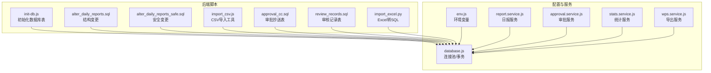
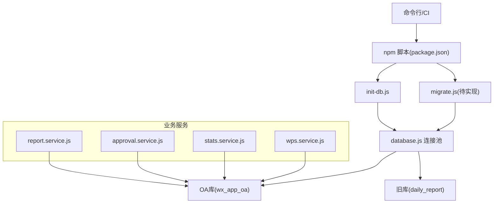
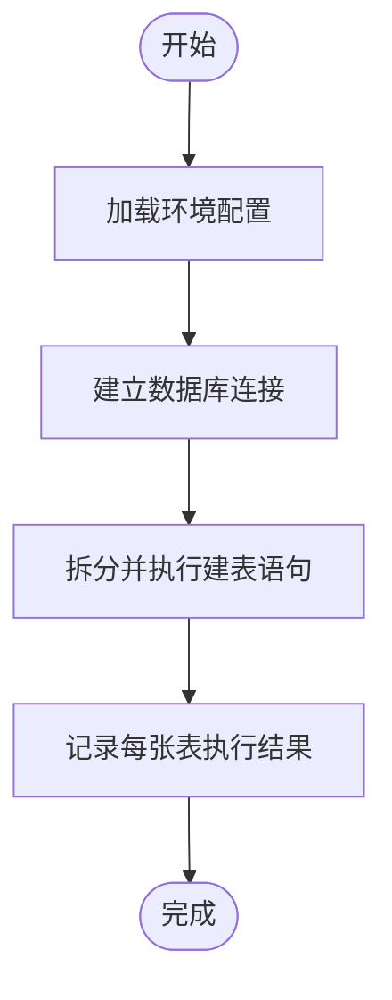
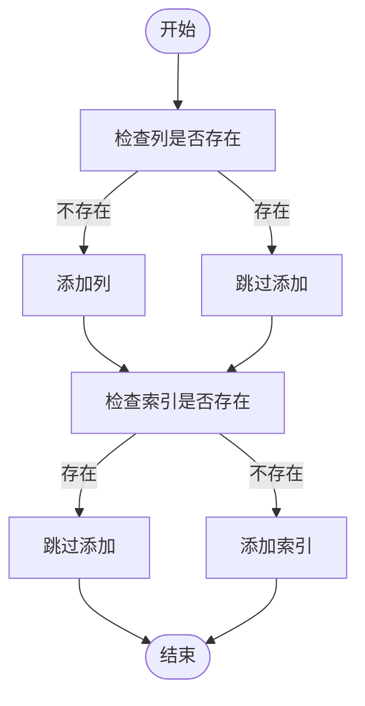
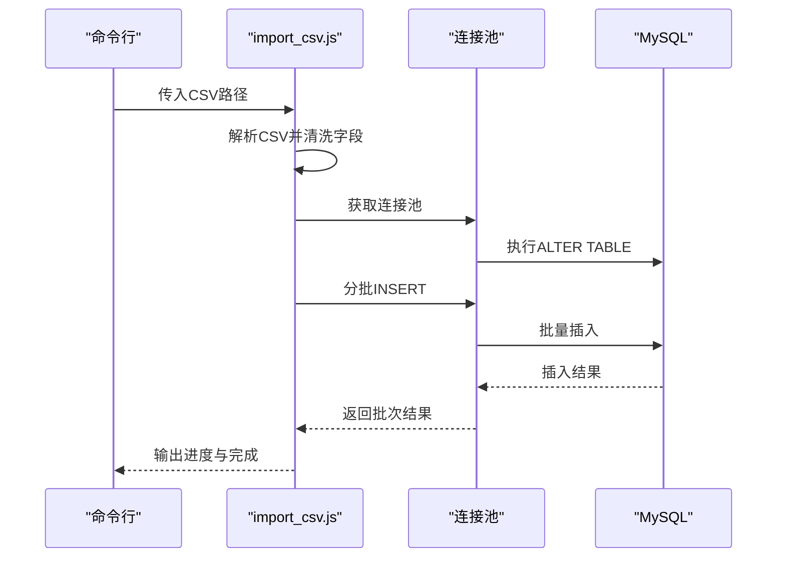
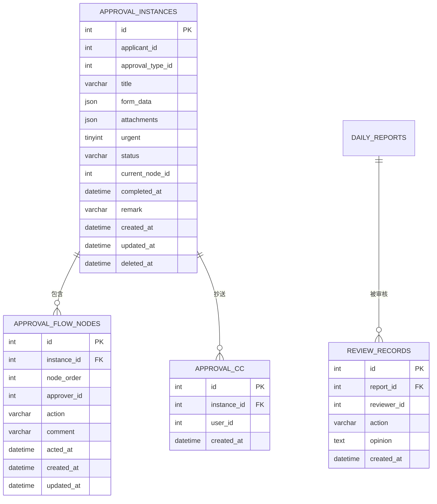
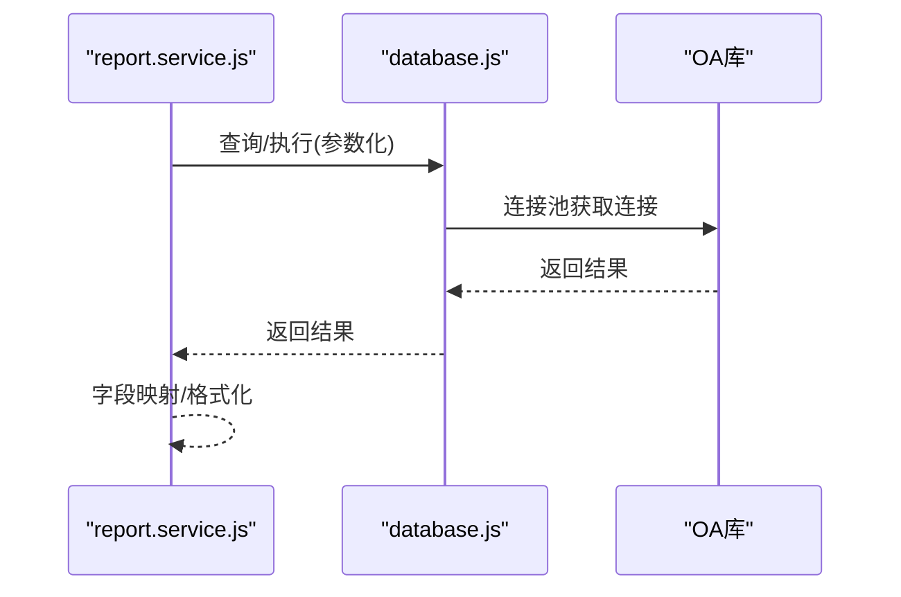
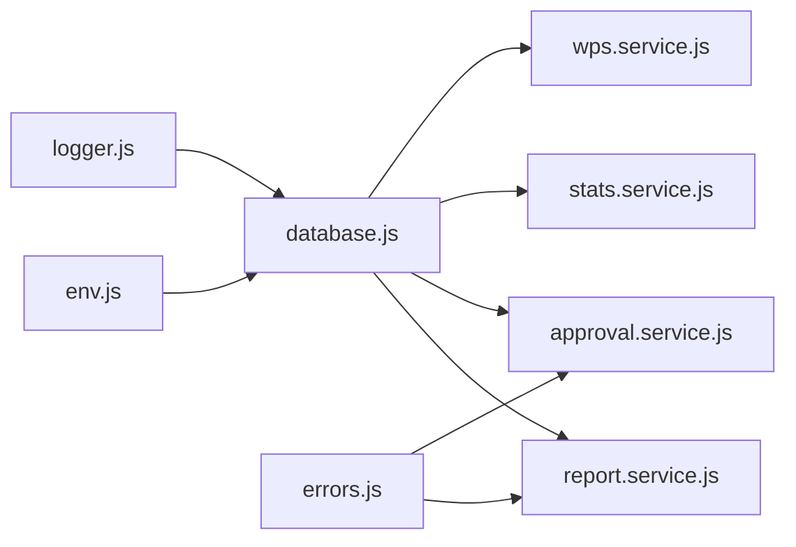

# 数据迁移与同步

<cite>
**本文引用的文件**
- [init-db.js](file://backend/scripts/init-db.js)
- [alter_daily_reports.sql](file://backend/scripts/alter_daily_reports.sql)
- [alter_daily_reports_safe.sql](file://backend/scripts/alter_daily_reports_safe.sql)
- [import_csv.js](file://backend/scripts/import_csv.js)
- [approval_cc.sql](file://backend/scripts/approval_cc.sql)
- [review_records.sql](file://backend/scripts/review_records.sql)
- [database.js](file://backend/src/common/config/database.js)
- [env.js](file://backend/src/common/config/env.js)
- [report.service.js](file://backend/src/core/services/report.service.js)
- [approval.service.js](file://backend/src/core/services/approval.service.js)
- [stats.service.js](file://backend/src/features/services/stats.service.js)
- [wps.service.js](file://backend/src/features/services/wps.service.js)
- [import_excel.py](file://scripts/import_excel.py)
- [package.json](file://backend/package.json)
- [logger.js](file://backend/src/common/utils/logger.js)
- [errors.js](file://backend/src/common/utils/errors.js)
</cite>

## 目录
1. [简介](#简介)
2. [项目结构](#项目结构)
3. [核心组件](#核心组件)
4. [架构总览](#架构总览)
5. [详细组件分析](#详细组件分析)
6. [依赖分析](#依赖分析)
7. [性能考虑](#性能考虑)
8. [故障排查指南](#故障排查指南)
9. [结论](#结论)
10. [附录](#附录)

## 简介
本文件面向“智慧办公助手 OA 系统”的数据迁移与同步场景，系统性阐述数据库迁移脚本的设计理念、执行策略与版本升级流程；解释安全迁移脚本如何保障完整性与一致性；覆盖数据同步机制、增量更新策略与冲突解决方案；提供迁移脚本的执行顺序、回滚策略与错误处理机制，并给出数据备份、恢复与迁移验证的完整流程。

## 项目结构
围绕数据迁移与同步的关键目录与文件如下：
- backend/scripts：数据库初始化与表结构变更脚本、CSV 导入工具、SQL 表定义
- backend/src/common/config：数据库连接池与环境变量配置
- backend/src/core/services 与 backend/src/features/services：涉及日报、审批、统计等核心业务服务
- scripts：Python 导入脚本（生成 SQL）
- backend/package.json：脚本命令入口

**图表来源**
- [init-db.js:1-374](file://backend/scripts/init-db.js#L1-L374)
- [alter_daily_reports.sql:1-29](file://backend/scripts/alter_daily_reports.sql#L1-L29)
- [alter_daily_reports_safe.sql:1-87](file://backend/scripts/alter_daily_reports_safe.sql#L1-L87)
- [import_csv.js:1-319](file://backend/scripts/import_csv.js#L1-L319)
- [approval_cc.sql:1-16](file://backend/scripts/approval_cc.sql#L1-L16)
- [review_records.sql:1-20](file://backend/scripts/review_records.sql#L1-L20)
- [import_excel.py:1-84](file://scripts/import_excel.py#L1-L84)
- [env.js:1-118](file://backend/src/common/config/env.js#L1-L118)
- [database.js:1-222](file://backend/src/common/config/database.js#L1-L222)
- [report.service.js:1-414](file://backend/src/core/services/report.service.js#L1-L414)
- [approval.service.js:1-359](file://backend/src/core/services/approval.service.js#L1-L359)
- [stats.service.js:1-309](file://backend/src/features/services/stats.service.js#L1-L309)
- [wps.service.js:1-85](file://backend/src/features/services/wps.service.js#L1-L85)

**章节来源**
- [init-db.js:1-374](file://backend/scripts/init-db.js#L1-L374)
- [env.js:1-118](file://backend/src/common/config/env.js#L1-L118)
- [database.js:1-222](file://backend/src/common/config/database.js#L1-L222)

## 核心组件
- 数据库初始化与连接池：提供新老两套数据库连接池、事务封装、查询/执行日志与连通性检测。
- 表结构变更脚本：提供一次性结构变更与安全变更两种策略，确保幂等与可回滚。
- 数据导入工具：支持 CSV/Excel 到数据库的批量导入，包含字段清洗、批量插入与错误处理。
- 业务服务：日报、审批、统计与导出服务，体现数据一致性与查询优化策略。

**章节来源**
- [database.js:1-222](file://backend/src/common/config/database.js#L1-L222)
- [alter_daily_reports.sql:1-29](file://backend/scripts/alter_daily_reports.sql#L1-L29)
- [alter_daily_reports_safe.sql:1-87](file://backend/scripts/alter_daily_reports_safe.sql#L1-L87)
- [import_csv.js:1-319](file://backend/scripts/import_csv.js#L1-L319)
- [import_excel.py:1-84](file://scripts/import_excel.py#L1-L84)
- [report.service.js:1-414](file://backend/src/core/services/report.service.js#L1-L414)
- [approval.service.js:1-359](file://backend/src/core/services/approval.service.js#L1-L359)
- [stats.service.js:1-309](file://backend/src/features/services/stats.service.js#L1-L309)
- [wps.service.js:1-85](file://backend/src/features/services/wps.service.js#L1-L85)

## 架构总览
整体迁移与同步架构分为三层：
- 脚本层：初始化表、结构变更、导入工具
- 服务层：业务服务负责数据一致性、事务与查询
- 配置层：环境变量与连接池，保障跨库访问与事务隔离

**图表来源**
- [package.json:6-14](file://backend/package.json#L6-L14)
- [database.js:11-43](file://backend/src/common/config/database.js#L11-L43)
- [report.service.js:1-414](file://backend/src/core/services/report.service.js#L1-L414)
- [approval.service.js:1-359](file://backend/src/core/services/approval.service.js#L1-L359)
- [stats.service.js:1-309](file://backend/src/features/services/stats.service.js#L1-L309)
- [wps.service.js:1-85](file://backend/src/features/services/wps.service.js#L1-L85)

## 详细组件分析

### 初始化数据库与表结构
- 设计理念：集中式建表脚本，按模块分段注释，便于版本演进与回溯。
- 执行策略：支持多语句执行，逐条建表并打印状态；失败时退出进程，避免半成品。
- 版本升级：通过新增表或结构变更脚本进行增量升级，配合安全脚本保证幂等。

**图表来源**
- [init-db.js:327-370](file://backend/scripts/init-db.js#L327-L370)

**章节来源**
- [init-db.js:1-374](file://backend/scripts/init-db.js#L1-L374)

### 表结构变更与安全迁移
- 结构变更脚本：一次性添加列与索引，适合全新部署或可控环境。
- 安全迁移脚本：基于信息表判断列/索引是否存在，逐条添加，避免重复与冲突，适合生产回滚与幂等升级。
- 冲突解决：通过“存在即跳过”策略，确保多次执行的安全性；必要时结合回滚脚本清理异常状态。

**图表来源**
- [alter_daily_reports_safe.sql:8-86](file://backend/scripts/alter_daily_reports_safe.sql#L8-L86)

**章节来源**
- [alter_daily_reports.sql:1-29](file://backend/scripts/alter_daily_reports.sql#L1-L29)
- [alter_daily_reports_safe.sql:1-87](file://backend/scripts/alter_daily_reports_safe.sql#L1-L87)

### 数据导入工具（CSV/Excel）
- CSV 导入：解析 CSV、清洗字段、批量插入，支持断点续传与错误定位。
- Excel 导入：Python 脚本生成 SQL，支持 ON DUPLICATE KEY UPDATE，便于快速导入大量数据。
- 增量更新：通过唯一键或日期维度进行去重与更新，避免重复数据。

**图表来源**
- [import_csv.js:287-319](file://backend/scripts/import_csv.js#L287-L319)

**章节来源**
- [import_csv.js:1-319](file://backend/scripts/import_csv.js#L1-L319)
- [import_excel.py:1-84](file://scripts/import_excel.py#L1-L84)

### 审批抄送与审核记录表
- 审批抄送表：维护审批实例与抄送人的关系，支持查询与通知。
- 审核记录表：记录管理员对日报的审核动作，便于审计与追溯。

**图表来源**
- [approval_cc.sql:7-15](file://backend/scripts/approval_cc.sql#L7-L15)
- [review_records.sql:8-19](file://backend/scripts/review_records.sql#L8-L19)
- [report.service.js:1-414](file://backend/src/core/services/report.service.js#L1-L414)
- [approval.service.js:1-359](file://backend/src/core/services/approval.service.js#L1-L359)

**章节来源**
- [approval_cc.sql:1-16](file://backend/scripts/approval_cc.sql#L1-L16)
- [review_records.sql:1-20](file://backend/scripts/review_records.sql#L1-L20)

### 业务服务与数据一致性
- 日报服务：提交/保存/删除/导出，支持草稿与重复提交保护，字段映射与 JSON 解析。
- 审批服务：事务封装创建与审批操作，严格校验当前节点与权限。
- 统计服务：首页统计、活动聚合、个人统计与看板趋势，兼顾旧库兼容。
- 导出服务：报表导出与 CSV 生成，统一字段与格式。

**图表来源**
- [report.service.js:105-153](file://backend/src/core/services/report.service.js#L105-L153)
- [database.js:65-109](file://backend/src/common/config/database.js#L65-L109)

**章节来源**
- [report.service.js:1-414](file://backend/src/core/services/report.service.js#L1-L414)
- [approval.service.js:195-256](file://backend/src/core/services/approval.service.js#L195-L256)
- [stats.service.js:23-82](file://backend/src/features/services/stats.service.js#L23-L82)
- [wps.service.js:18-56](file://backend/src/features/services/wps.service.js#L18-L56)

## 依赖分析
- 环境变量：OA 与旧库地址、账号、连接池大小、Redis、JWT、日志级别等。
- 连接池：分别指向新旧数据库，支持事务与超时控制。
- 服务依赖：业务服务依赖数据库配置与错误处理模块。

**图表来源**
- [env.js:50-118](file://backend/src/common/config/env.js#L50-L118)
- [database.js:1-222](file://backend/src/common/config/database.js#L1-L222)
- [report.service.js:1-414](file://backend/src/core/services/report.service.js#L1-L414)
- [approval.service.js:1-359](file://backend/src/core/services/approval.service.js#L1-L359)
- [stats.service.js:1-309](file://backend/src/features/services/stats.service.js#L1-L309)
- [wps.service.js:1-85](file://backend/src/features/services/wps.service.js#L1-L85)
- [errors.js:1-99](file://backend/src/common/utils/errors.js#L1-L99)
- [logger.js:1-100](file://backend/src/common/utils/logger.js#L1-L100)

**章节来源**
- [env.js:1-118](file://backend/src/common/config/env.js#L1-L118)
- [database.js:1-222](file://backend/src/common/config/database.js#L1-L222)

## 性能考虑
- 连接池与并发：合理设置连接上限与等待队列，避免阻塞；启用 keep-alive 降低握手开销。
- 查询优化：为高频查询字段建立索引；避免 SELECT *，按需投影；分页查询使用 LIMIT/OFFSET。
- 批量导入：分批插入，控制批次大小；使用参数化 SQL 防注入并提升执行效率。
- 事务边界：将相关写操作放入事务，减少锁竞争与回滚成本。

## 故障排查指南
- 环境变量缺失：启动前校验必需变量，缺失时报错并停止。
- 数据库连通性：提供 ping 方法检测 OA 与旧库可用性。
- 日志与错误：统一日志格式与级别；业务错误抛出自定义异常，便于定位。
- 导入失败：CSV 导入逐批输出进度与错误；Excel 导入生成 SQL 文件便于人工核对。

**章节来源**
- [env.js:34-44](file://backend/src/common/config/env.js#L34-L44)
- [database.js:187-207](file://backend/src/common/config/database.js#L187-L207)
- [logger.js:22-61](file://backend/src/common/utils/logger.js#L22-L61)
- [errors.js:9-24](file://backend/src/common/utils/errors.js#L9-L24)
- [import_csv.js:312-315](file://backend/scripts/import_csv.js#L312-L315)

## 结论
通过集中化的初始化与结构变更脚本、安全幂等的迁移策略、完善的业务服务与日志监控，本系统实现了从旧库到新库的平滑迁移与稳定运行。建议在生产环境中遵循“先安全脚本、再业务导入、最后切换流量”的流程，并配套备份与回滚预案。

## 附录

### 迁移脚本执行顺序与回滚策略
- 执行顺序
  1) 初始化数据库：创建基础表
  2) 结构变更：先执行一次性变更，再执行安全变更以确保幂等
  3) 数据导入：CSV/Excel 导入，分批插入并校验
  4) 业务切换：验证数据一致性后切换流量
- 回滚策略
  - 结构变更：使用逆向 SQL 或安全脚本“删除列/索引”（需谨慎评估影响）
  - 数据导入：基于唯一键或时间戳进行去重；若出现脏数据，采用备份恢复或增量修复

**章节来源**
- [init-db.js:342-362](file://backend/scripts/init-db.js#L342-L362)
- [alter_daily_reports.sql:7-28](file://backend/scripts/alter_daily_reports.sql#L7-L28)
- [alter_daily_reports_safe.sql:8-86](file://backend/scripts/alter_daily_reports_safe.sql#L8-L86)
- [import_csv.js:196-252](file://backend/scripts/import_csv.js#L196-L252)

### 数据备份、恢复与迁移验证
- 备份
  - 逻辑备份：mysqldump 导出结构与数据，保留注释与索引
  - 物理备份：LVM/快照或 Percona XtraBackup（需停机窗口）
- 恢复
  - 选择性恢复：按表粒度恢复；注意外键与索引重建
  - 恢复验证：对比关键指标（总量、唯一键计数、时间范围分布）
- 迁移验证
  - 结构核对：列名、类型、默认值、索引
  - 数据核对：抽样比对、全量校验（哈希/分组计数）
  - 业务核对：功能回归测试、报表与统计一致性

### 增量更新策略与冲突解决方案
- 增量更新
  - 基于时间戳或版本号的增量导入
  - 使用 ON DUPLICATE KEY UPDATE 或 UPSERT 语句
- 冲突解决
  - 唯一键冲突：保留最新或合并字段
  - 字段冲突：采用“新值覆盖旧值”或“字段级合并”
  - 业务冲突：引入状态机与事务，确保原子性