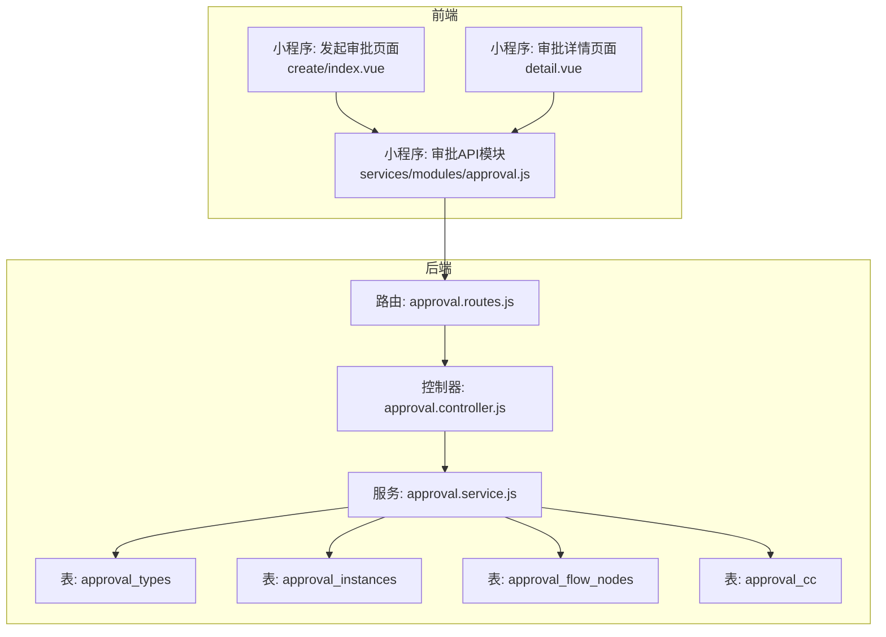
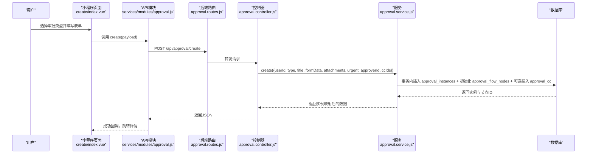
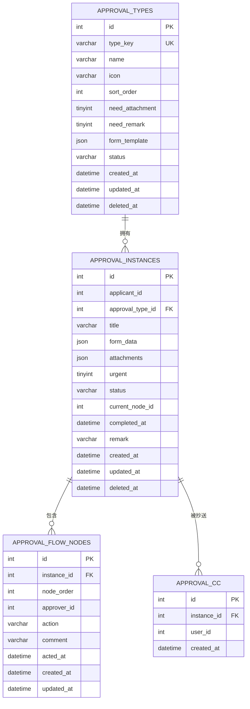
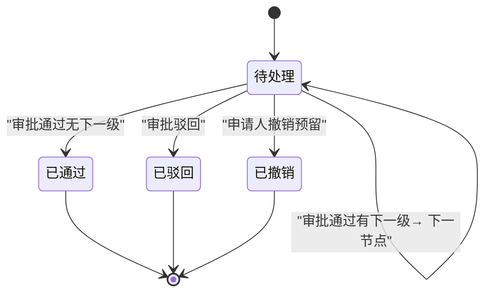
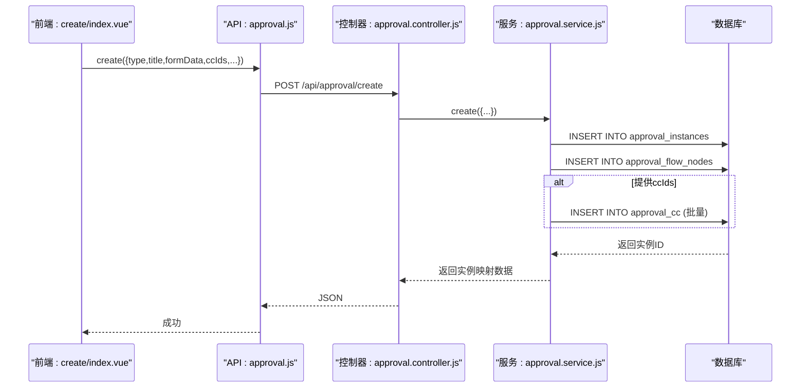
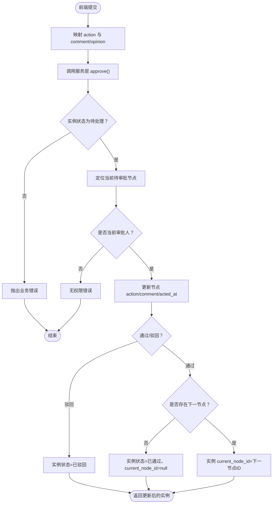
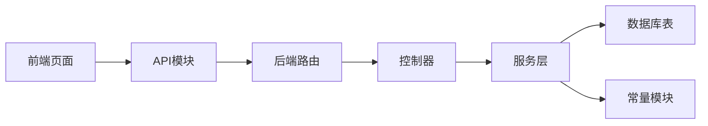

# 审批表设计

<cite>
**本文引用的文件**   
- [approval.controller.js](file://backend/src/core/controllers/approval.controller.js)
- [approval.service.js](file://backend/src/core/services/approval.service.js)
- [approval.routes.js](file://backend/src/core/routes/approval.routes.js)
- [approval.js](file://miniapp/src/services/modules/approval.js)
- [create/index.vue](file://miniapp/src/pages/approval/create/index.vue)
- [detail.vue](file://miniapp/src/pages/approval/detail.vue)
- [approval_cc.sql](file://backend/scripts/approval_cc.sql)
- [init-db.js](file://backend/scripts/init-db.js)
- [constants.js](file://backend/src/common/utils/constants.js)
</cite>

## 目录
1. [简介](#简介)
2. [项目结构](#项目结构)
3. [核心组件](#核心组件)
4. [架构总览](#架构总览)
5. [详细组件分析](#详细组件分析)
6. [依赖分析](#依赖分析)
7. [性能考量](#性能考量)
8. [故障排查指南](#故障排查指南)
9. [结论](#结论)
10. [附录](#附录)

## 简介
本文件面向“审批表”的数据库设计与业务实现，围绕审批流程的关键字段、状态机、层级与会签机制、抄送功能、历史追踪与审计日志进行系统化梳理，并结合前后端代码路径给出可落地的实现依据与扩展建议。

## 项目结构
审批相关能力由后端控制器/服务层与前端页面/接口模块共同构成，数据库层面以审批类型、审批实例、审批流程节点、抄送关系为核心表，配合常量与路由配置形成闭环。

**图表来源**
- [approval.routes.js:1-26](file://backend/src/core/routes/approval.routes.js#L1-L26)
- [approval.controller.js:1-138](file://backend/src/core/controllers/approval.controller.js#L1-L138)
- [approval.service.js:1-359](file://backend/src/core/services/approval.service.js#L1-L359)
- [approval.js:1-24](file://miniapp/src/services/modules/approval.js#L1-L24)
- [create/index.vue:1-517](file://miniapp/src/pages/approval/create/index.vue#L1-L517)
- [detail.vue:1-603](file://miniapp/src/pages/approval/detail.vue#L1-L603)
- [init-db.js:69-132](file://backend/scripts/init-db.js#L69-L132)
- [approval_cc.sql:1-16](file://backend/scripts/approval_cc.sql#L1-L16)

**章节来源**
- [approval.routes.js:1-26](file://backend/src/core/routes/approval.routes.js#L1-L26)
- [approval.controller.js:1-138](file://backend/src/core/controllers/approval.controller.js#L1-L138)
- [approval.service.js:1-359](file://backend/src/core/services/approval.service.js#L1-L359)
- [approval.js:1-24](file://miniapp/src/services/modules/approval.js#L1-L24)
- [create/index.vue:1-517](file://miniapp/src/pages/approval/create/index.vue#L1-L517)
- [detail.vue:1-603](file://miniapp/src/pages/approval/detail.vue#L1-L603)
- [init-db.js:69-132](file://backend/scripts/init-db.js#L69-L132)
- [approval_cc.sql:1-16](file://backend/scripts/approval_cc.sql#L1-L16)

## 核心组件
- 审批类型表：定义审批类型、图标、排序、是否需要附件/备注、表单模板等元数据。
- 审批实例表：记录一次审批的主体信息（申请人、类型、标题、表单数据、附件、加急标记、状态、当前节点、完成时间、备注等）。
- 审批流程节点表：按顺序记录每个审批节点（实例ID、节点序号、审批人、动作、意见、操作时间）。
- 抄送关系表：记录审批实例的抄送人列表。

上述四张表构成了审批表设计的核心数据模型，支撑从“发起—流转—完成/驳回—历史追踪”的全流程。

**章节来源**
- [init-db.js:69-132](file://backend/scripts/init-db.js#L69-L132)
- [approval_cc.sql:1-16](file://backend/scripts/approval_cc.sql#L1-L16)

## 架构总览
审批请求从前端页面触发，经由API模块调用后端路由，控制器解析参数并委派给服务层；服务层在事务内完成实例与节点的创建或状态更新，并返回标准化响应；前端接收后渲染列表与详情，支持通过/驳回操作与抄送展示。

**图表来源**
- [create/index.vue:288-339](file://miniapp/src/pages/approval/create/index.vue#L288-L339)
- [approval.js:12-14](file://miniapp/src/services/modules/approval.js#L12-L14)
- [approval.routes.js:19-21](file://backend/src/core/routes/approval.routes.js#L19-L21)
- [approval.controller.js:74-94](file://backend/src/core/controllers/approval.controller.js#L74-L94)
- [approval.service.js:195-256](file://backend/src/core/services/approval.service.js#L195-L256)

**章节来源**
- [create/index.vue:1-517](file://miniapp/src/pages/approval/create/index.vue#L1-L517)
- [approval.js:1-24](file://miniapp/src/services/modules/approval.js#L1-L24)
- [approval.routes.js:1-26](file://backend/src/core/routes/approval.routes.js#L1-L26)
- [approval.controller.js:1-138](file://backend/src/core/controllers/approval.controller.js#L1-L138)
- [approval.service.js:1-359](file://backend/src/core/services/approval.service.js#L1-L359)

## 详细组件分析

### 数据模型与字段设计
- 审批类型表（approval_types）
  - 关键字段：type_key（唯一）、name、icon、sort_order、need_attachment、need_remark、form_template（JSON）、status、created_at、updated_at、deleted_at
  - 设计要点：通过type_key唯一标识审批类型，form_template承载动态表单定义；need_attachment/need_remark控制必填约束；status用于启用/禁用

- 审批实例表（approval_instances）
  - 关键字段：applicant_id、approval_type_id、title、form_data（JSON）、attachments（JSON）、urgent、status、current_node_id、completed_at、remark、created_at、updated_at、deleted_at
  - 设计要点：status取值包含待处理、已通过、已驳回、已撤销（预留字段），current_node_id指向当前节点；urgent用于加急标记；form_data/attachments以JSON存储动态内容

- 审批流程节点表（approval_flow_nodes）
  - 关键字段：instance_id、node_order、approver_id、action、comment、acted_at、created_at、updated_at
  - 设计要点：按node_order顺序推进；action为空表示未处理；acted_at记录实际操作时间

- 抄送关系表（approval_cc）
  - 关键字段：instance_id、user_id、created_at
  - 设计要点：一对多关联实例与抄送人；便于查询某实例的所有抄送人

**图表来源**
- [init-db.js:69-132](file://backend/scripts/init-db.js#L69-L132)
- [approval_cc.sql:1-16](file://backend/scripts/approval_cc.sql#L1-L16)

**章节来源**
- [init-db.js:69-132](file://backend/scripts/init-db.js#L69-L132)
- [approval_cc.sql:1-16](file://backend/scripts/approval_cc.sql#L1-L16)

### 审批状态机与业务规则
- 状态集合：待处理（pending）、已通过（approved）、已驳回（rejected）、已撤销（cancelled）
- 规则要点：
  - 通过：若无下一节点，则实例状态置为已通过且清空current_node_id；否则流转至下一节点
  - 驳回：实例状态置为已驳回
  - 重复操作校验：非待处理状态禁止再次审批
  - 当前节点校验：仅当前节点审批人可操作

**图表来源**
- [approval.service.js:287-336](file://backend/src/core/services/approval.service.js#L287-L336)

**章节来源**
- [approval.service.js:267-358](file://backend/src/core/services/approval.service.js#L267-L358)
- [constants.js:52-62](file://backend/src/common/utils/constants.js#L52-L62)

### 审批层级设计与会签机制
- 层级设计：以approval_flow_nodes的node_order递增表达审批层级；current_node_id指向当前待处理节点
- 会签机制：当前实现基于逐级审批（按序号推进）。若需会签（多人并行审批），可在节点表中引入“并行组”字段并在服务层扩展判断逻辑；当前代码未体现会签专用字段，建议在节点表增加group_id或parallel字段以区分串行与并行组

**章节来源**
- [approval.service.js:317-336](file://backend/src/core/services/approval.service.js#L317-L336)
- [init-db.js:115-132](file://backend/scripts/init-db.js#L115-L132)

### 抄送功能实现细节
- 前端：发起页面支持“审批设置”中的审批人与抄送人选择；提交时将ccIds传入后端
- 后端：创建审批时在事务内批量写入approval_cc；查询详情时可拼接抄送人列表（当前详情未展示抄送人，建议在前端详情页补充显示）

**图表来源**
- [create/index.vue:266-339](file://miniapp/src/pages/approval/create/index.vue#L266-L339)
- [approval.js:12-14](file://miniapp/src/services/modules/approval.js#L12-L14)
- [approval.controller.js:74-94](file://backend/src/core/controllers/approval.controller.js#L74-L94)
- [approval.service.js:195-256](file://backend/src/core/services/approval.service.js#L195-L256)
- [approval_cc.sql:7-15](file://backend/scripts/approval_cc.sql#L7-L15)

**章节来源**
- [create/index.vue:193-217](file://miniapp/src/pages/approval/create/index.vue#L193-L217)
- [approval.js:12-14](file://miniapp/src/services/modules/approval.js#L12-L14)
- [approval.controller.js:74-94](file://backend/src/core/controllers/approval.controller.js#L74-L94)
- [approval.service.js:233-241](file://backend/src/core/services/approval.service.js#L233-L241)
- [approval_cc.sql:1-16](file://backend/scripts/approval_cc.sql#L1-L16)

### 审批历史追踪与审计日志
- 历史追踪：通过approval_flow_nodes记录每一步审批动作（action、comment、acted_at），形成审批时间线
- 审计日志：建议在数据库层面增加审计表（如approval_audit_log），记录关键字段变更与敏感操作；或在应用层通过统一中间件收集请求/响应上下文（当前实现未见专门审计表）

**章节来源**
- [init-db.js:115-132](file://backend/scripts/init-db.js#L115-L132)
- [approval.service.js:162-179](file://backend/src/core/services/approval.service.js#L162-L179)

### 前后端交互与字段映射
- 列表/详情：后端将数据库字段映射为驼峰命名（如statusText、applicant、applicantDept等），前端据此渲染
- 审批操作：前端传入action（approve/reject）与opinion（或兼容comment），后端映射为approved/rejected并持久化

**图表来源**
- [approval.controller.js:96-122](file://backend/src/core/controllers/approval.controller.js#L96-L122)
- [approval.service.js:267-358](file://backend/src/core/services/approval.service.js#L267-L358)

**章节来源**
- [approval.controller.js:1-138](file://backend/src/core/controllers/approval.controller.js#L1-L138)
- [approval.service.js:1-359](file://backend/src/core/services/approval.service.js#L1-L359)

## 依赖分析
- 前端依赖后端API，API依赖路由与控制器，控制器依赖服务层，服务层依赖数据库
- 审批类型与实例存在外键关联；实例与节点、实例与抄送之间存在一对多关联
- 常量模块提供审批类型与状态枚举，确保前后端一致性

**图表来源**
- [approval.js:1-24](file://miniapp/src/services/modules/approval.js#L1-L24)
- [approval.routes.js:1-26](file://backend/src/core/routes/approval.routes.js#L1-L26)
- [approval.controller.js:1-138](file://backend/src/core/controllers/approval.controller.js#L1-L138)
- [approval.service.js:1-359](file://backend/src/core/services/approval.service.js#L1-L359)
- [constants.js:38-62](file://backend/src/common/utils/constants.js#L38-L62)

**章节来源**
- [approval.js:1-24](file://miniapp/src/services/modules/approval.js#L1-L24)
- [approval.routes.js:1-26](file://backend/src/core/routes/approval.routes.js#L1-L26)
- [approval.controller.js:1-138](file://backend/src/core/controllers/approval.controller.js#L1-L138)
- [approval.service.js:1-359](file://backend/src/core/services/approval.service.js#L1-L359)
- [constants.js:1-106](file://backend/src/common/utils/constants.js#L1-L106)

## 性能考量
- 索引策略：实例表按applicant_id、approval_type_id、status、created_at建立索引；节点表按instance_id、approver_id、action建立索引；抄送表按instance_id、user_id建立索引
- 查询优化：列表与详情采用JOIN减少往返；分页查询限制offset与limit
- 事务边界：创建与审批均在事务内执行，保证一致性与原子性
- JSON字段：form_data与attachments使用JSON存储，便于扩展但需注意查询与索引局限

[本节为通用性能建议，不直接分析具体文件]

## 故障排查指南
- 审批不存在：查询实例为空时抛出“审批不存在”
- 非待处理状态：已处理实例禁止重复审批
- 非当前审批人：校验失败返回“无权操作”
- 参数兼容：action与comment/opinion的兼容映射避免前端差异导致的错误

**章节来源**
- [approval.service.js:281-299](file://backend/src/core/services/approval.service.js#L281-L299)
- [approval.controller.js:129-135](file://backend/src/core/controllers/approval.controller.js#L129-L135)

## 结论
审批表设计以“类型—实例—节点—抄送”为核心，配合状态机与历史追踪实现完整的审批生命周期管理。当前实现聚焦串行审批与基础抄送，后续可按需扩展会签机制与审计日志，以满足更复杂的组织治理需求。

[本节为总结性内容，不直接分析具体文件]

## 附录

### 字段说明与约束清单
- 审批类型表（approval_types）
  - type_key：唯一键，标识审批类型
  - need_attachment/need_remark：控制表单必填
  - form_template：JSON，动态表单定义
- 审批实例表（approval_instances）
  - status：取值pending/approved/rejected/cancelled
  - urgent：布尔型加急标记
  - form_data/attachments：JSON，动态内容
  - current_node_id：当前节点引用
- 审批流程节点表（approval_flow_nodes）
  - node_order：节点顺序
  - action：approved/rejected/pending
  - comment/acted_at：审批意见与时间
- 抄送关系表（approval_cc）
  - instance_id/user_id：一对多关联

**章节来源**
- [init-db.js:69-132](file://backend/scripts/init-db.js#L69-L132)
- [approval_cc.sql:1-16](file://backend/scripts/approval_cc.sql#L1-L16)