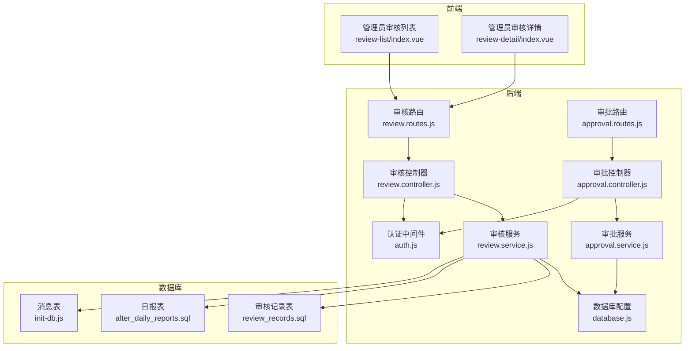
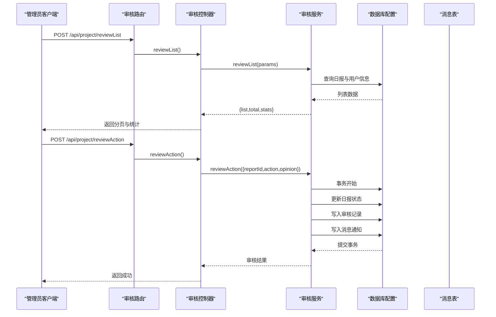
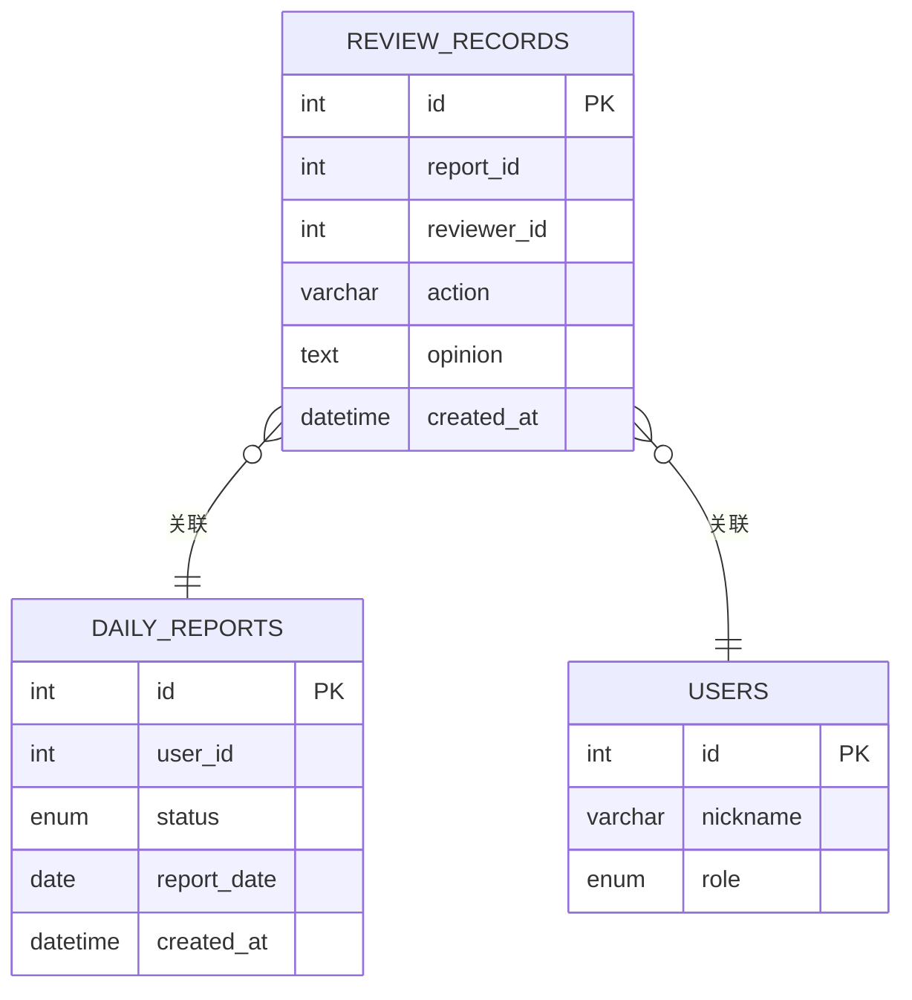
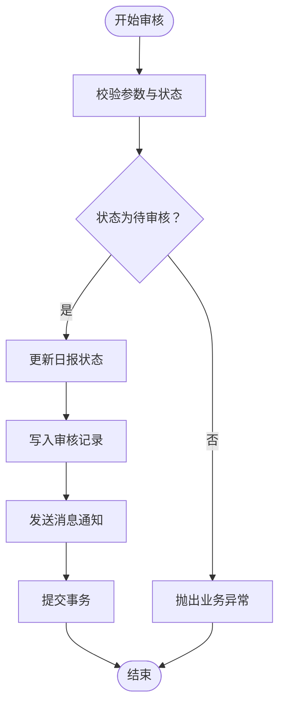
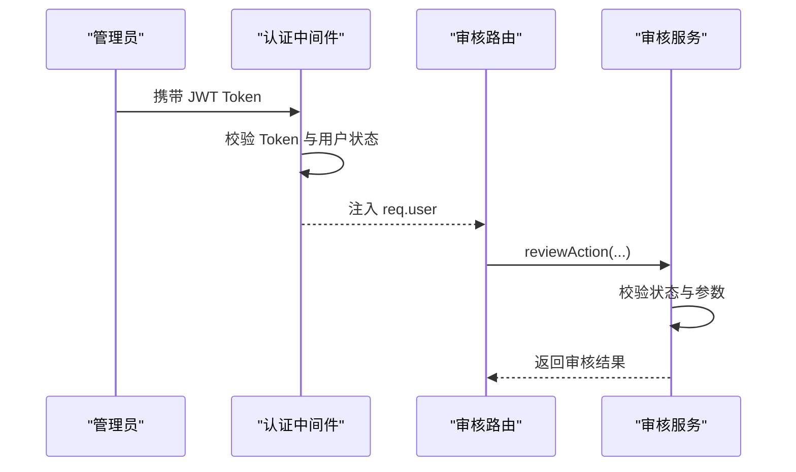
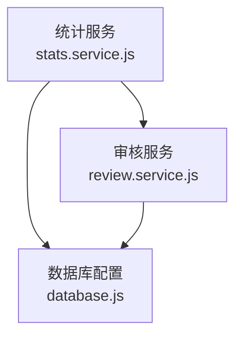
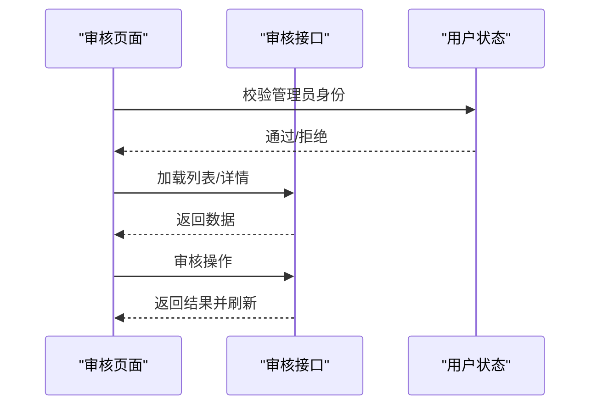
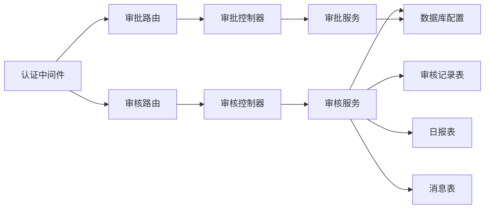

# 审核记录表设计

<cite>
**本文档引用的文件**
- [review_records.sql](file://backend/scripts/review_records.sql)
- [review.controller.js](file://backend/src/features/controllers/review.controller.js)
- [review.service.js](file://backend/src/features/services/review.service.js)
- [review.routes.js](file://backend/src/features/routes/review.routes.js)
- [approval.controller.js](file://backend/src/core/controllers/approval.controller.js)
- [approval.service.js](file://backend/src/core/services/approval.service.js)
- [approval.routes.js](file://backend/src/core/routes/approval.routes.js)
- [auth.js](file://backend/src/common/middleware/auth.js)
- [database.js](file://backend/src/common/config/database.js)
- [alter_daily_reports.sql](file://backend/scripts/alter_daily_reports.sql)
- [alter_daily_reports_safe.sql](file://backend/scripts/alter_daily_reports_safe.sql)
- [Tech-Plan.md](file://shared-docs/Tech-Plan.md)
- [init-db.js](file://backend/scripts/init-db.js)
- [review-list/index.vue](file://miniapp/src/pages/admin/review-list/index.vue)
- [review-detail/index.vue](file://miniapp/src/pages/admin/review-detail/index.vue)
- [stats.service.js](file://backend/src/features/services/stats.service.js)
</cite>

## 目录
1. [简介](#简介)
2. [项目结构](#项目结构)
3. [核心组件](#核心组件)
4. [架构概览](#架构概览)
5. [详细组件分析](#详细组件分析)
6. [依赖关系分析](#依赖关系分析)
7. [性能考量](#性能考量)
8. [故障排除指南](#故障排除指南)
9. [结论](#结论)
10. [附录](#附录)

## 简介
本设计文档围绕审核记录表（review_records）进行系统化梳理，覆盖字段设计、业务规则、权限控制、历史追踪、统计分析与查询优化等方面。通过对后端控制器、服务层、数据库脚本以及前端页面的综合分析，形成完整的审核管理数据模型与实现细节，确保审核流程的可追溯性、可审计性和高效性。

## 项目结构
审核相关功能主要分布在以下模块：
- 后端特性模块（features）：负责日报审核的列表、详情、操作与统计
- 后端核心模块（core）：负责通用审批流程（与日报审核并存）
- 数据库脚本：定义审核记录表结构及与日报表的关联
- 前端页面：管理员端的审核列表与详情界面
- 权限中间件：基于 JWT 的认证与角色控制

**图表来源**
- [review.routes.js:1-26](file://backend/src/features/routes/review.routes.js#L1-L26)
- [review.controller.js:1-129](file://backend/src/features/controllers/review.controller.js#L1-L129)
- [review.service.js:1-421](file://backend/src/features/services/review.service.js#L1-L421)
- [approval.routes.js:1-26](file://backend/src/core/routes/approval.routes.js#L1-L26)
- [approval.controller.js:1-138](file://backend/src/core/controllers/approval.controller.js#L1-L138)
- [approval.service.js:1-359](file://backend/src/core/services/approval.service.js#L1-L359)
- [auth.js:1-83](file://backend/src/common/middleware/auth.js#L1-L83)
- [database.js:1-222](file://backend/src/common/config/database.js#L1-L222)
- [review_records.sql:1-20](file://backend/scripts/review_records.sql#L1-L20)
- [alter_daily_reports.sql:1-24](file://backend/scripts/alter_daily_reports.sql#L1-L24)
- [init-db.js:159-180](file://backend/scripts/init-db.js#L159-L180)

**章节来源**
- [review.routes.js:1-26](file://backend/src/features/routes/review.routes.js#L1-L26)
- [review.controller.js:1-129](file://backend/src/features/controllers/review.controller.js#L1-L129)
- [review.service.js:1-421](file://backend/src/features/services/review.service.js#L1-L421)
- [approval.routes.js:1-26](file://backend/src/core/routes/approval.routes.js#L1-L26)
- [approval.controller.js:1-138](file://backend/src/core/controllers/approval.controller.js#L1-L138)
- [approval.service.js:1-359](file://backend/src/core/services/approval.service.js#L1-L359)
- [auth.js:1-83](file://backend/src/common/middleware/auth.js#L1-L83)
- [database.js:1-222](file://backend/src/common/config/database.js#L1-L222)
- [review_records.sql:1-20](file://backend/scripts/review_records.sql#L1-L20)
- [alter_daily_reports.sql:1-24](file://backend/scripts/alter_daily_reports.sql#L1-L24)
- [init-db.js:159-180](file://backend/scripts/init-db.js#L159-L180)

## 核心组件
- 审核记录表（review_records）：存储管理员对日报的审核操作记录，包含审核类型（通过/驳回）、审核意见、审核人与时间等关键字段，并建立必要的索引以支撑查询与统计。
- 审核服务（review.service）：封装审核列表、详情、操作与统计逻辑，负责状态校验、事务处理、消息通知与统计计算。
- 审核控制器（review.controller）：暴露审核相关的 API 接口，处理请求参数与响应格式。
- 审批服务（approval.service）：提供通用审批流程能力，与日报审核并行存在，满足更复杂的多节点审批场景。
- 认证与权限（auth.js）：基于 JWT 的认证与角色控制，确保只有管理员或超级管理员可以访问审核接口。
- 数据库配置（database.js）：提供连接池、事务与查询执行能力，支撑审核与统计的高性能访问。

**章节来源**
- [review_records.sql:8-19](file://backend/scripts/review_records.sql#L8-L19)
- [review.service.js:33-137](file://backend/src/features/services/review.service.js#L33-L137)
- [review.controller.js:15-121](file://backend/src/features/controllers/review.controller.js#L15-L121)
- [approval.service.js:84-356](file://backend/src/core/services/approval.service.js#L84-L356)
- [auth.js:14-80](file://backend/src/common/middleware/auth.js#L14-L80)
- [database.js:65-181](file://backend/src/common/config/database.js#L65-L181)

## 架构概览
审核管理采用前后端分离架构，前端通过审核路由调用后端控制器，控制器委托审核服务执行业务逻辑，服务层通过数据库配置进行数据持久化与事务控制。同时，系统还提供通用审批流程能力，满足复杂审批场景。

**图表来源**
- [review.routes.js:13-23](file://backend/src/features/routes/review.routes.js#L13-L23)
- [review.controller.js:15-105](file://backend/src/features/controllers/review.controller.js#L15-L105)
- [review.service.js:244-314](file://backend/src/features/services/review.service.js#L244-L314)
- [database.js:168-181](file://backend/src/common/config/database.js#L168-L181)
- [init-db.js:162-180](file://backend/scripts/init-db.js#L162-L180)

## 详细组件分析

### 审核记录表（review_records）设计
- 主键与标识：自增主键 id，唯一标识每条审核记录。
- 关联关系：report_id 关联 daily_reports.id；reviewer_id 关联 users.id。
- 核心字段：
  - report_id：关联被审核的日报记录。
  - reviewer_id：执行审核操作的管理员或超级管理员。
  - action：审核动作类型，支持 approve（通过）与 reject（驳回）。
  - opinion：审核意见，允许为空（通过时通常为空）。
  - created_at：审核记录创建时间，用于统计与排序。
- 索引设计：
  - idx_report_id：加速按日报查询审核历史。
  - idx_reviewer_id：加速按审核人统计。
  - idx_created_at：加速按时间范围统计与趋势分析。

**图表来源**
- [review_records.sql:8-19](file://backend/scripts/review_records.sql#L8-L19)
- [alter_daily_reports.sql:7-24](file://backend/scripts/alter_daily_reports.sql#L7-L24)
- [Tech-Plan.md:1146-1166](file://shared-docs/Tech-Plan.md#L1146-L1166)

**章节来源**
- [review_records.sql:1-20](file://backend/scripts/review_records.sql#L1-L20)
- [alter_daily_reports.sql:1-24](file://backend/scripts/alter_daily_reports.sql#L1-L24)
- [Tech-Plan.md:1139-1167](file://shared-docs/Tech-Plan.md#L1139-L1167)

### 审核业务流程与状态管理
- 审核状态：日报状态由 pending（待审核）流转至 approved（已通过）或 rejected（已驳回）。审核服务在 reviewAction 中严格校验状态，防止重复操作。
- 审核历史追踪：通过 review_records 表记录每次审核动作，包含审核人、动作、意见与时间，支持按日报查询历史。
- 审核统计：
  - 待审核数：统计 status='pending' 的日报数量。
  - 今日已审核数：统计 review_records 中当日创建的记录数。
  - 平均审核耗时：计算从日报提交到审核完成的时间差（小时）。
  - 通过率：统计 approve 次数占总审核次数的比例。
  - 趋势数据：按日统计审核量，支持周/月/季度周期切换。

**图表来源**
- [review.service.js:244-314](file://backend/src/features/services/review.service.js#L244-L314)

**章节来源**
- [review.service.js:113-137](file://backend/src/features/services/review.service.js#L113-L137)
- [review.service.js:322-368](file://backend/src/features/services/review.service.js#L322-L368)
- [review.service.js:376-413](file://backend/src/features/services/review.service.js#L376-L413)

### 审核权限控制与责任追溯
- 认证与授权：所有审核接口均需登录并通过 requireRole('admin', 'superadmin') 校验，确保只有具备管理员角色的用户可执行审核操作。
- 责任追溯：审核记录包含 reviewer_id 与 created_at，结合 users 表的 nickname 可展示审核人姓名与审核时间，实现责任到人。
- 消息通知：审核完成后向日报提交人发送消息通知，便于追溯审核结果与意见。

**图表来源**
- [auth.js:14-80](file://backend/src/common/middleware/auth.js#L14-L80)
- [review.routes.js:14-23](file://backend/src/features/routes/review.routes.js#L14-L23)
- [review.service.js:244-314](file://backend/src/features/services/review.service.js#L244-L314)

**章节来源**
- [auth.js:14-80](file://backend/src/common/middleware/auth.js#L14-L80)
- [review.routes.js:14-23](file://backend/src/features/routes/review.routes.js#L14-L23)
- [review.service.js:284-302](file://backend/src/features/services/review.service.js#L284-L302)

### 审核数据统计与报表设计
- 首页统计：管理员可查看待审核日报数、已处理数、未读消息数等指标。
- 审核统计：支持待审核总数、今日审核数、平均审核耗时、通过率与趋势数据。
- 日报统计看板：提供总量、当月量、待审数、通过数、通过率与近30天趋势。
- 报表生成：基于 review_records 与 daily_reports 的统计查询，支持按日聚合与周期切换。

**图表来源**
- [stats.service.js:23-82](file://backend/src/features/services/stats.service.js#L23-L82)
- [review.service.js:322-368](file://backend/src/features/services/review.service.js#L322-L368)
- [database.js:65-109](file://backend/src/common/config/database.js#L65-L109)

**章节来源**
- [stats.service.js:23-82](file://backend/src/features/services/stats.service.js#L23-L82)
- [review.service.js:322-368](file://backend/src/features/services/review.service.js#L322-L368)

### 前端交互与展示
- 审核列表：管理员可按状态筛选（待审核/已通过/已驳回），支持分页加载与下拉刷新。
- 审核详情：展示日报完整信息与最新的审核记录（含审核人、意见、时间），支持通过/驳回操作。
- 权限拦截：前端在进入页面时校验管理员身份，无权限则提示并返回。

**图表来源**
- [review-list/index.vue:73-163](file://miniapp/src/pages/admin/review-list/index.vue#L73-L163)
- [review-detail/index.vue:90-158](file://miniapp/src/pages/admin/review-detail/index.vue#L90-L158)

**章节来源**
- [review-list/index.vue:73-163](file://miniapp/src/pages/admin/review-list/index.vue#L73-L163)
- [review-detail/index.vue:90-158](file://miniapp/src/pages/admin/review-detail/index.vue#L90-L158)

## 依赖关系分析
- 控制器依赖服务：审核控制器依赖审核服务处理业务逻辑，审批控制器依赖审批服务。
- 服务依赖数据库：审核服务与统计服务通过数据库配置执行查询与事务。
- 权限依赖中间件：审核路由通过 requireRole 中间件限制访问。
- 表间依赖：审核记录表依赖日报表与用户表，消息表用于通知。

**图表来源**
- [review.controller.js:3](file://backend/src/features/controllers/review.controller.js#L3)
- [review.service.js:3](file://backend/src/features/services/review.service.js#L3)
- [approval.controller.js:3](file://backend/src/core/controllers/approval.controller.js#L3)
- [approval.service.js:3](file://backend/src/core/services/approval.service.js#L3)
- [auth.js:64-80](file://backend/src/common/middleware/auth.js#L64-L80)
- [review_records.sql:8-19](file://backend/scripts/review_records.sql#L8-L19)
- [alter_daily_reports.sql:7-24](file://backend/scripts/alter_daily_reports.sql#L7-L24)
- [init-db.js:162-180](file://backend/scripts/init-db.js#L162-L180)

**章节来源**
- [review.controller.js:3](file://backend/src/features/controllers/review.controller.js#L3)
- [review.service.js:3](file://backend/src/features/services/review.service.js#L3)
- [approval.controller.js:3](file://backend/src/core/controllers/approval.controller.js#L3)
- [approval.service.js:3](file://backend/src/core/services/approval.service.js#L3)
- [auth.js:64-80](file://backend/src/common/middleware/auth.js#L64-L80)
- [review_records.sql:8-19](file://backend/scripts/review_records.sql#L8-L19)
- [alter_daily_reports.sql:7-24](file://backend/scripts/alter_daily_reports.sql#L7-L24)
- [init-db.js:162-180](file://backend/scripts/init-db.js#L162-L180)

## 性能考量
- 索引优化：为 review_records 的 report_id、reviewer_id、created_at 建立索引，提升查询与统计性能。
- 分页与筛选：列表接口支持分页与多条件筛选（状态、关键词、日期范围），避免一次性加载大量数据。
- 事务与一致性：审核操作使用事务保证状态更新与记录写入的一致性，减少并发冲突。
- 统计查询：统计接口采用聚合查询与按日分组，避免全表扫描；趋势数据按周期裁剪时间范围。
- 连接池与超时：数据库配置使用连接池与合理的超时设置，保障高并发下的稳定性。

**章节来源**
- [review_records.sql:16-18](file://backend/scripts/review_records.sql#L16-L18)
- [review.controller.js:17-26](file://backend/src/features/controllers/review.controller.js#L17-L26)
- [review.service.js:33-106](file://backend/src/features/services/review.service.js#L33-L106)
- [database.js:11-24](file://backend/src/common/config/database.js#L11-L24)

## 故障排除指南
- 参数校验失败：当缺少必要参数（如 id、action）时，接口返回参数校验错误，需检查前端传参与接口文档。
- 业务异常：当日报状态非 pending 或重复审核时，抛出业务异常，需先确认日报状态再重试。
- 权限不足：未登录或角色不符会导致 403，需确保携带有效 Token 且用户角色为管理员。
- 数据库异常：查询或执行失败会记录日志，可通过日志定位 SQL 与参数问题。
- 消息通知失败：审核完成后若消息写入失败，不影响审核主流程，但需检查消息表结构与权限。

**章节来源**
- [review.controller.js:53-92](file://backend/src/features/controllers/review.controller.js#L53-L92)
- [review.service.js:246-272](file://backend/src/features/services/review.service.js#L246-L272)
- [auth.js:14-56](file://backend/src/common/middleware/auth.js#L14-L56)
- [database.js:65-109](file://backend/src/common/config/database.js#L65-L109)
- [init-db.js:162-180](file://backend/scripts/init-db.js#L162-L180)

## 结论
审核记录表（review_records）通过清晰的字段设计与完善的索引策略，支撑了管理员对日报的审核管理。配合严格的权限控制、完整的事务处理与丰富的统计分析，实现了可追溯、可审计、可优化的审核体系。前端页面与后端接口协同，提供了良好的用户体验与稳定的业务能力。

## 附录

### 审核记录表字段说明
- id：主键，自增整型。
- report_id：关联日报 ID，整型。
- reviewer_id：审核人 ID，整型。
- action：审核动作，字符串（approve/reject）。
- opinion：审核意见，文本。
- created_at：创建时间，日期时间。

**章节来源**
- [review_records.sql:8-19](file://backend/scripts/review_records.sql#L8-L19)

### 审核流程业务规则
- 仅管理员/超级管理员可访问审核接口。
- 仅待审核状态的日报可进行审核操作。
- 驳回时必须填写审核意见。
- 审核完成后向提交人发送消息通知。
- 审核记录永久保存，支持历史查询与统计。

**章节来源**
- [review.routes.js:14-23](file://backend/src/features/routes/review.routes.js#L14-L23)
- [review.service.js:246-253](file://backend/src/features/services/review.service.js#L246-L253)
- [review.service.js:298-302](file://backend/src/features/services/review.service.js#L298-L302)

### 数据约束与索引
- 主键：id。
- 外键：report_id → daily_reports.id；reviewer_id → users.id。
- 索引：idx_report_id、idx_reviewer_id、idx_created_at。
- 约束：action 限定为 approve/reject；opinion 可为空。

**章节来源**
- [review_records.sql:8-19](file://backend/scripts/review_records.sql#L8-L19)
- [alter_daily_reports.sql:7-24](file://backend/scripts/alter_daily_reports.sql#L7-L24)
- [Tech-Plan.md:1146-1166](file://shared-docs/Tech-Plan.md#L1146-L1166)