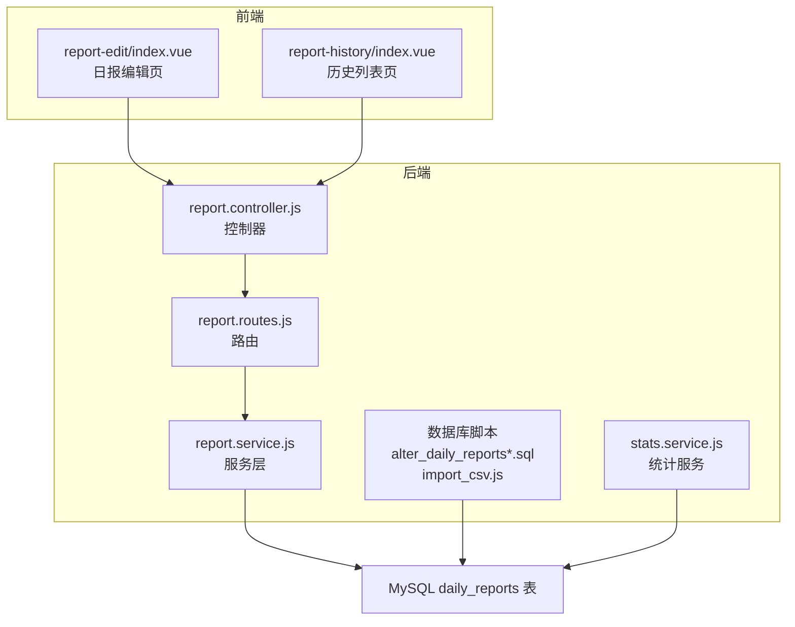
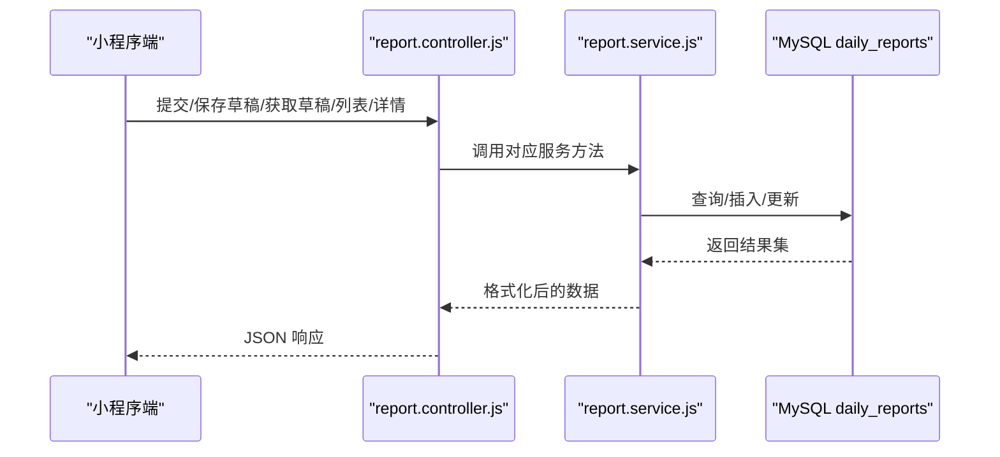
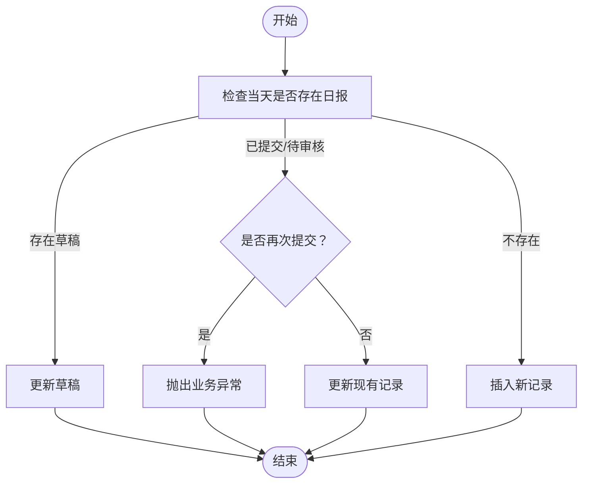
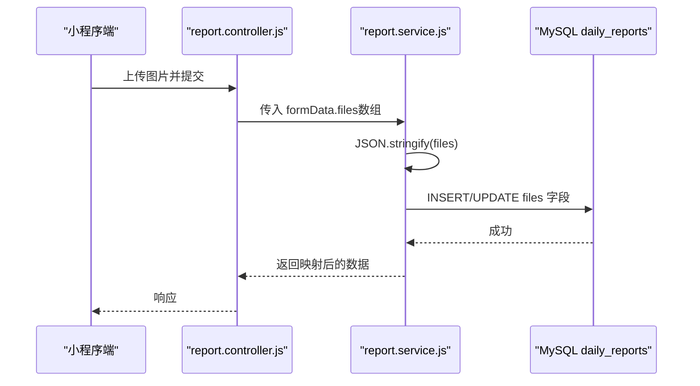
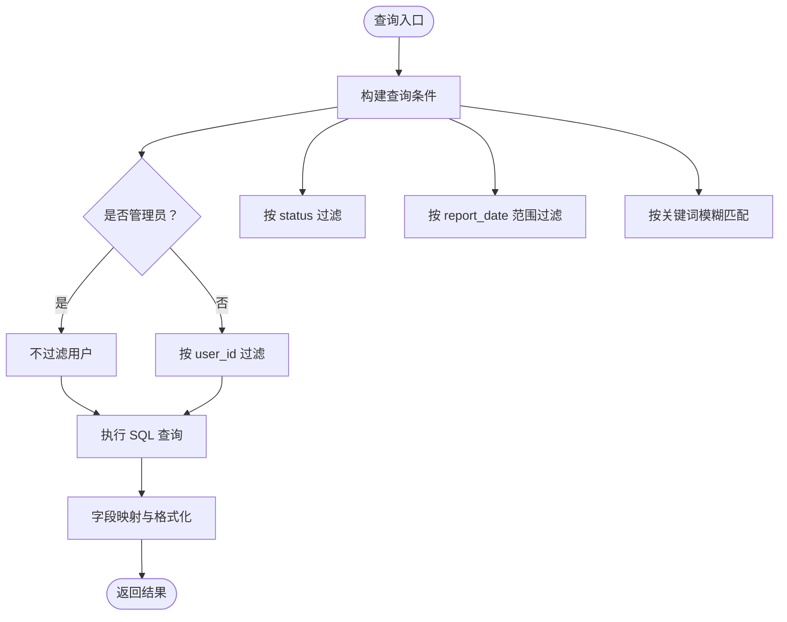
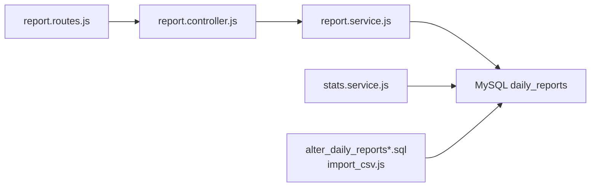

# 日报表设计

<cite>
**本文档引用的文件**
- [alter_daily_reports.sql](file://backend/scripts/alter_daily_reports.sql)
- [alter_daily_reports_safe.sql](file://backend/scripts/alter_daily_reports_safe.sql)
- [import_csv.js](file://backend/scripts/import_csv.js)
- [report.service.js](file://backend/src/core/services/report.service.js)
- [report.controller.js](file://backend/src/core/controllers/report.controller.js)
- [report.routes.js](file://backend/src/core/routes/report.routes.js)
- [stats.service.js](file://backend/src/features/services/stats.service.js)
- [index.vue](file://miniapp/src/pages/employee/report-edit/index.vue)
- [index.vue](file://miniapp/src/pages/employee/report-history/index.vue)
</cite>

## 目录
1. [简介](#简介)
2. [项目结构](#项目结构)
3. [核心组件](#核心组件)
4. [架构概览](#架构概览)
5. [详细组件分析](#详细组件分析)
6. [依赖关系分析](#依赖关系分析)
7. [性能考量](#性能考量)
8. [故障排查指南](#故障排查指南)
9. [结论](#结论)
10. [附录](#附录)

## 简介
本设计文档围绕“日报表”数据库结构与业务流程展开，目标是为日报表提供完整的字段设计说明、索引策略、状态流转、JSON附件存储方案以及查询与性能优化建议。文档同时结合前后端实现，确保数据库设计与实际业务需求一致，并覆盖从表单录入到导出统计的全链路。

## 项目结构
本项目采用前后端分离架构，后端使用 Node.js + Express，数据库采用 MySQL；前端包含小程序端与 Web 端。与日报表直接相关的模块主要分布在后端的 core 层（控制器、服务、路由）与脚本层（数据库迁移与导入），以及小程序端的表单页面。

图表来源
- [report.controller.js:14-72](file://backend/src/core/controllers/report.controller.js#L14-L72)
- [report.service.js:105-153](file://backend/src/core/services/report.service.js#L105-L153)
- [report.routes.js:13-38](file://backend/src/core/routes/report.routes.js#L13-L38)
- [alter_daily_reports.sql:7-28](file://backend/scripts/alter_daily_reports.sql#L7-L28)
- [import_csv.js:199-240](file://backend/scripts/import_csv.js#L199-L240)

章节来源
- [report.controller.js:14-72](file://backend/src/core/controllers/report.controller.js#L14-L72)
- [report.service.js:105-153](file://backend/src/core/services/report.service.js#L105-L153)
- [report.routes.js:13-38](file://backend/src/core/routes/report.routes.js#L13-L38)
- [alter_daily_reports.sql:7-28](file://backend/scripts/alter_daily_reports.sql#L7-L28)
- [import_csv.js:199-240](file://backend/scripts/import_csv.js#L199-L240)

## 核心组件
- 控制器：负责接收前端请求，解析参数，调用服务层并返回响应。
- 服务层：封装数据库访问逻辑，包含列表查询、详情、提交、草稿、删除、人员统计、CSV 导出等功能。
- 路由：定义 API 接口，统一鉴权。
- 数据库脚本：定义表结构扩展、索引与安全迁移策略。
- 小程序页面：提供表单录入、草稿保存、历史查看与导出能力。

章节来源
- [report.controller.js:14-72](file://backend/src/core/controllers/report.controller.js#L14-L72)
- [report.service.js:105-153](file://backend/src/core/services/report.service.js#L105-L153)
- [report.routes.js:13-38](file://backend/src/core/routes/report.routes.js#L13-L38)
- [alter_daily_reports.sql:7-28](file://backend/scripts/alter_daily_reports.sql#L7-L28)
- [alter_daily_reports_safe.sql:81-86](file://backend/scripts/alter_daily_reports_safe.sql#L81-L86)
- [import_csv.js:199-240](file://backend/scripts/import_csv.js#L199-L240)

## 架构概览
后端通过路由将请求转发至控制器，控制器再调用服务层进行数据库操作；服务层将数据库结果映射为前端友好的字段格式；小程序端负责表单交互与数据展示。

图表来源
- [report.controller.js:14-72](file://backend/src/core/controllers/report.controller.js#L14-L72)
- [report.service.js:105-153](file://backend/src/core/services/report.service.js#L105-L153)
- [report.routes.js:13-38](file://backend/src/core/routes/report.routes.js#L13-L38)

## 详细组件分析

### 数据库表结构与字段设计
- 表名：daily_reports
- 设计原则：在现有 daily_report 库中通过 ALTER 扩展字段，避免数据隔离；字段覆盖项目信息、工作信息、统计信息、时间信息、状态与附件等。

字段清单与设计说明
- 项目信息
  - project：varchar(255)，项目名称
  - area：varchar(255)，项目区域
  - related_party：varchar(255)，相关方单位
- 工作信息
  - today_work_type：varchar(50)，今日工作类型（工作/待工/在途）
  - tomorrow_work_type：varchar(50)，明日工作类型
  - work_content：varchar(500)，从事工作内容
  - workers：varchar(255)，作业人员（多个人名，逗号/顿号/空格分隔）
  - machine_model：varchar(100)，机型
  - worker_count：int(11)，人数
  - required_qty：int(11)，需要完成数量
  - completed_qty：int(11)，累计完成数量
  - progress_percent：int(11)，进度百分比
  - issues：varchar(500)，遇到问题/风险
  - remark：text，备注
- 时间信息
  - entry_date：date，入场时间
  - initial_biz_trip_date：date，初始出差时间
  - personal_biz_trip_days：int(11)，个人累计出差天数
- 附件与元数据
  - files：json，附件文件列表（JSON 数组）
  - updated_at：datetime，默认 CURRENT_TIMESTAMP ON UPDATE CURRENT_TIMESTAMP，更新时间
- 状态与关联
  - status：枚举/字符串，状态字段（草稿、已提交、待审核、已通过、已驳回）
  - user_id：外键关联 users.id（由业务层维护）
  - report_date：日期，日报日期（与 user_id 组合唯一性由业务控制）

索引设计
- idx_status：对 status 建立索引，便于按状态筛选与统计
- idx_report_date：对 report_date 建立索引，支持按日期范围查询
- idx_user_date：对 (user_id, report_date) 建立复合索引，支持用户每日唯一性与快速检索

章节来源
- [alter_daily_reports.sql:7-28](file://backend/scripts/alter_daily_reports.sql#L7-L28)
- [alter_daily_reports_safe.sql:81-86](file://backend/scripts/alter_daily_reports_safe.sql#L81-L86)
- [import_csv.js:199-240](file://backend/scripts/import_csv.js#L199-L240)

### 字段数据类型与长度选择
- varchar(n)：用于文本类字段，如项目名称、区域、工作类型、机型、备注等，长度根据业务最大值与展示需求设定
- int(11)：用于整数型统计字段，如人数、数量、天数等
- decimal：在导入脚本中曾出现 decimal(10,2) 的字段（completed_qty），若仍保留可考虑 decimal(10,2) 以支持小数统计
- text：用于较长文本，如备注
- date：用于日期字段，如入场时间、初始出差时间
- json：用于附件列表，便于前端直接渲染与后端序列化/反序列化

章节来源
- [alter_daily_reports.sql:7-28](file://backend/scripts/alter_daily_reports.sql#L7-L28)
- [import_csv.js:30-37](file://backend/scripts/import_csv.js#L30-L37)

### 状态字段与业务流程
状态定义（服务层映射）
- draft：草稿
- submitted：已提交
- pending：待审核
- approved：已通过
- rejected：已驳回

业务流程
- 提交/保存草稿
  - 若当天已有草稿：更新草稿
  - 若已有已提交/待审核：再次提交时报错；草稿保存则更新
  - 其他状态：更新
- 删除：仅允许删除草稿或已驳回
- 列表：支持按状态、日期范围、关键词筛选
- 导出：支持按状态、日期范围、关键词、人员筛选导出 CSV

图表来源
- [report.service.js:189-280](file://backend/src/core/services/report.service.js#L189-L280)

章节来源
- [report.service.js:105-153](file://backend/src/core/services/report.service.js#L105-L153)
- [report.service.js:189-280](file://backend/src/core/services/report.service.js#L189-L280)

### JSON 格式附件存储设计
- 存储方式：files 字段为 JSON 类型，存储附件文件列表（数组）
- 前端上传：小程序端最多支持 9 张图片上传，支持预览、移除与批量上传
- 后端处理：服务层将前端传入的 files 序列化为 JSON 字符串存入数据库；查询时如为字符串则尝试解析为 JSON 对象

图表来源
- [index.vue:453-471](file://miniapp/src/pages/employee/report-edit/index.vue#L453-L471)
- [report.service.js:222-222](file://backend/src/core/services/report.service.js#L222-L222)

章节来源
- [report.service.js:62-62](file://backend/src/core/services/report.service.js#L62-L62)
- [report.service.js:222-222](file://backend/src/core/services/report.service.js#L222-L222)
- [index.vue:453-471](file://miniapp/src/pages/employee/report-edit/index.vue#L453-L471)

### 查询与筛选策略
- 列表查询：支持按用户、状态、日期范围、关键词（项目名/人员/工作内容/当日工作）筛选
- 详情查询：按 id 查询并关联用户昵称与部门
- 人员统计：从 workers 字段拆分去重，统计个人日报总数、当月数与最后提交日期
- CSV 导出：支持按状态、日期范围、关键词、人员筛选导出

图表来源
- [report.service.js:105-153](file://backend/src/core/services/report.service.js#L105-L153)

章节来源
- [report.service.js:105-153](file://backend/src/core/services/report.service.js#L105-L153)

### 前端表单与交互
- 表单字段覆盖：项目信息、作业信息、当日工作、工作量统计、明日工作、其他（问题/备注/出差天数）、附件
- 草稿与历史：支持自动保存草稿、加载上次提交内容、查看历史与状态徽章
- 人员选择：支持搜索与手动添加，多选后以“、”连接存储

章节来源
- [index.vue:48-192](file://miniapp/src/pages/employee/report-edit/index.vue#L48-L192)
- [index.vue:316-383](file://miniapp/src/pages/employee/report-edit/index.vue#L316-L383)
- [index.vue:72-141](file://miniapp/src/pages/employee/report-history/index.vue#L72-L141)

## 依赖关系分析
- 控制器依赖服务层
- 服务层依赖数据库配置与错误处理工具
- 路由依赖认证中间件
- 统计服务依赖 daily_reports 表进行聚合统计
- 数据库脚本与导入脚本共同决定表结构与初始数据

图表来源
- [report.controller.js:14-72](file://backend/src/core/controllers/report.controller.js#L14-L72)
- [report.service.js:105-153](file://backend/src/core/services/report.service.js#L105-L153)
- [report.routes.js:13-38](file://backend/src/core/routes/report.routes.js#L13-L38)
- [stats.service.js:23-82](file://backend/src/features/services/stats.service.js#L23-L82)
- [alter_daily_reports.sql:7-28](file://backend/scripts/alter_daily_reports.sql#L7-L28)
- [import_csv.js:199-240](file://backend/scripts/import_csv.js#L199-L240)

章节来源
- [report.controller.js:14-72](file://backend/src/core/controllers/report.controller.js#L14-L72)
- [report.service.js:105-153](file://backend/src/core/services/report.service.js#L105-L153)
- [report.routes.js:13-38](file://backend/src/core/routes/report.routes.js#L13-L38)
- [stats.service.js:23-82](file://backend/src/features/services/stats.service.js#L23-L82)
- [alter_daily_reports.sql:7-28](file://backend/scripts/alter_daily_reports.sql#L7-L28)
- [import_csv.js:199-240](file://backend/scripts/import_csv.js#L199-L240)

## 性能考量
- 索引策略
  - idx_status：提升按状态筛选与统计效率
  - idx_report_date：提升按日期范围查询效率
  - idx_user_date：提升用户每日唯一性与快速检索效率
- 查询优化
  - 列表查询使用 LIMIT/OFFSET 分页，避免一次性返回大量数据
  - 关键词查询使用 LIKE %keyword%，建议在高频字段上建立合适索引
- 写入优化
  - 批量导入使用批量 INSERT，减少事务开销
  - 草稿保存与更新采用条件判断，避免不必要的写入
- JSON 字段
  - files 为 JSON 字段，建议在查询中尽量避免对 JSON 字段进行复杂运算，必要时可在应用层处理
- 统计查询
  - 统计服务使用并行查询与聚合函数，减少往返次数

章节来源
- [alter_daily_reports.sql:26-28](file://backend/scripts/alter_daily_reports.sql#L26-L28)
- [alter_daily_reports_safe.sql:81-86](file://backend/scripts/alter_daily_reports_safe.sql#L81-L86)
- [report.service.js:105-153](file://backend/src/core/services/report.service.js#L105-L153)
- [import_csv.js:199-252](file://backend/scripts/import_csv.js#L199-L252)
- [stats.service.js:23-82](file://backend/src/features/services/stats.service.js#L23-L82)

## 故障排查指南
- 重复提交
  - 现象：再次提交时报错
  - 原因：当天已有已提交/待审核状态
  - 处理：先删除草稿或等待审核完成后再提交
- 草稿恢复
  - 现象：页面未显示草稿
  - 原因：后端未查询到草稿或本地缓存失效
  - 处理：调用获取草稿接口确认；检查本地存储
- 导出异常
  - 现象：导出 CSV 失败
  - 原因：筛选条件导致 SQL 错误或数据库连接问题
  - 处理：检查筛选参数；确认数据库连通性
- 人员统计异常
  - 现象：统计结果不准确
  - 原因：workers 字段格式不规范（逗号/顿号/空格混用）
  - 处理：统一人员分隔符；清理历史数据格式

章节来源
- [report.service.js:237-241](file://backend/src/core/services/report.service.js#L237-L241)
- [report.service.js:288-297](file://backend/src/core/services/report.service.js#L288-L297)
- [report.controller.js:161-169](file://backend/src/core/controllers/report.controller.js#L161-L169)
- [report.service.js:344-371](file://backend/src/core/services/report.service.js#L344-L371)

## 结论
本设计在现有 daily_report 库基础上通过 ALTER 扩展字段，满足了日报表的完整表单存储需求；配合合理的索引策略与服务层封装，实现了高效的查询、统计与导出能力。JSON 附件存储提升了灵活性，前端表单交互完善，整体满足日常使用场景。后续可根据业务增长进一步优化索引与查询策略。

## 附录
- 数据库迁移脚本
  - [alter_daily_reports.sql:7-28](file://backend/scripts/alter_daily_reports.sql#L7-L28)
  - [alter_daily_reports_safe.sql:8-86](file://backend/scripts/alter_daily_reports_safe.sql#L8-L86)
- 数据导入脚本
  - [import_csv.js:199-240](file://backend/scripts/import_csv.js#L199-L240)
- 后端服务与控制器
  - [report.service.js:105-153](file://backend/src/core/services/report.service.js#L105-L153)
  - [report.controller.js:14-72](file://backend/src/core/controllers/report.controller.js#L14-L72)
  - [report.routes.js:13-38](file://backend/src/core/routes/report.routes.js#L13-L38)
- 前端页面
  - [report-edit/index.vue:48-192](file://miniapp/src/pages/employee/report-edit/index.vue#L48-L192)
  - [report-history/index.vue:72-141](file://miniapp/src/pages/employee/report-history/index.vue#L72-L141)
- 统计服务
  - [stats.service.js:23-82](file://backend/src/features/services/stats.service.js#L23-L82)