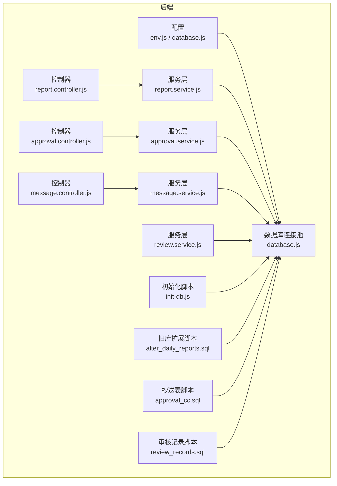
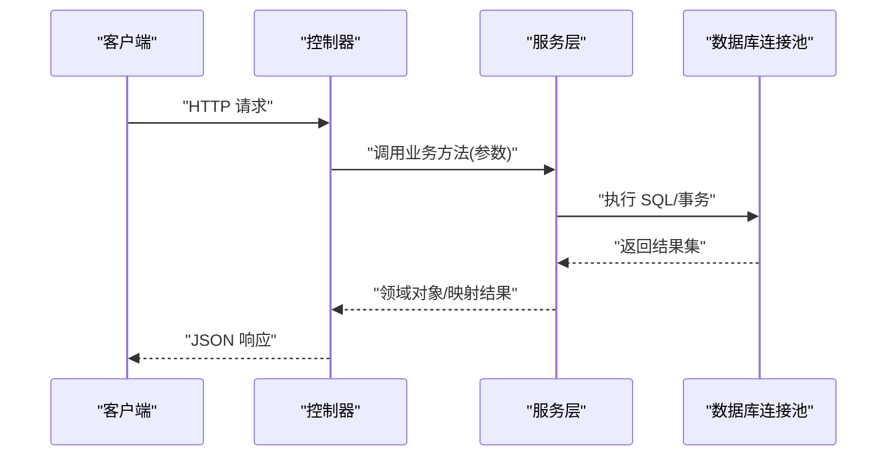
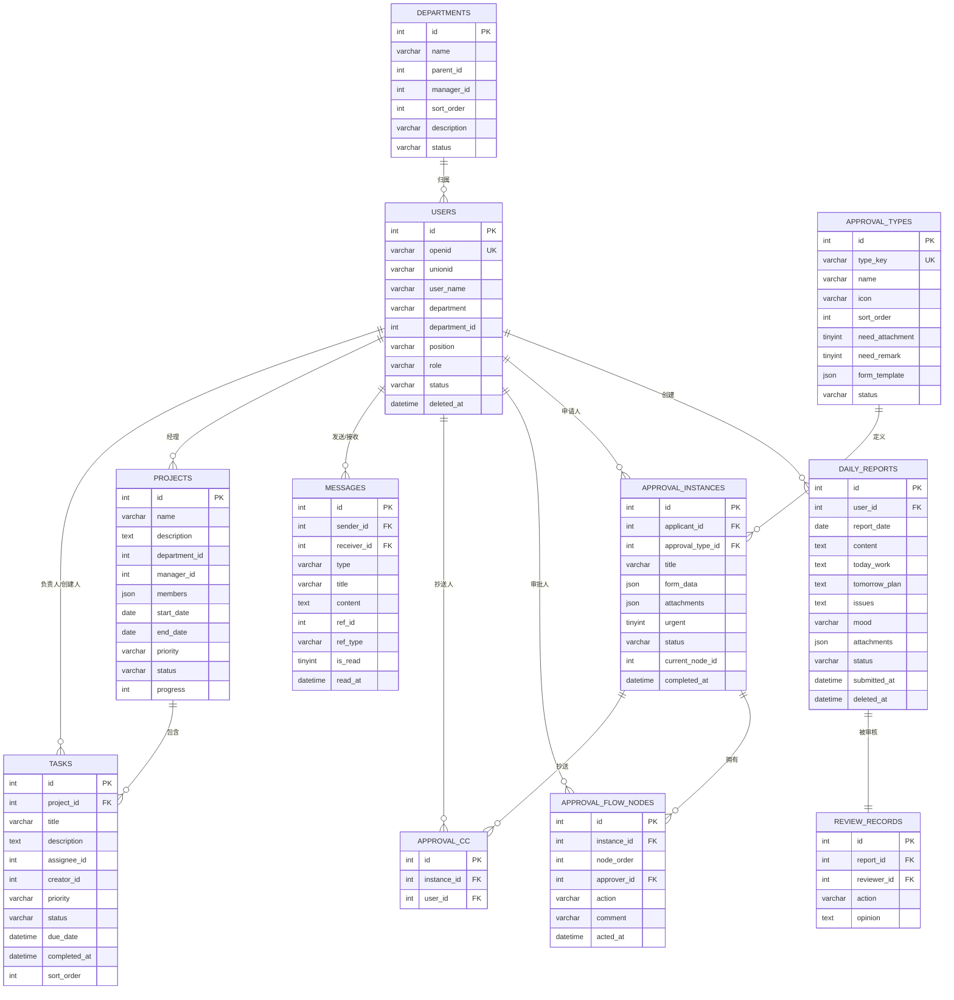

# 核心数据表设计

<cite>
**本文引用的文件**
- [init-db.js](file://backend/scripts/init-db.js)
- [alter_daily_reports.sql](file://backend/scripts/alter_daily_reports.sql)
- [review_records.sql](file://backend/scripts/review_records.sql)
- [approval_cc.sql](file://backend/scripts/approval_cc.sql)
- [report.service.js](file://backend/src/core/services/report.service.js)
- [approval.service.js](file://backend/src/core/services/approval.service.js)
- [message.service.js](file://backend/src/core/services/message.service.js)
- [review.service.js](file://backend/src/features/services/review.service.js)
- [report.controller.js](file://backend/src/core/controllers/report.controller.js)
- [approval.controller.js](file://backend/src/core/controllers/approval.controller.js)
- [message.controller.js](file://backend/src/core/controllers/message.controller.js)
- [database.js](file://backend/src/common/config/database.js)
- [env.js](file://backend/src/common/config/env.js)
</cite>

## 目录
1. [简介](#简介)
2. [项目结构](#项目结构)
3. [核心组件](#核心组件)
4. [架构总览](#架构总览)
5. [详细组件分析](#详细组件分析)
6. [依赖分析](#依赖分析)
7. [性能考虑](#性能考虑)
8. [故障排查指南](#故障排查指南)
9. [结论](#结论)

## 简介
本文件面向“智慧办公助手 OA 系统”，聚焦核心业务数据表的设计与实现，覆盖用户表、日报表、审批表、消息表、审核记录表等关键表。文档从字段定义、数据类型、索引与约束、业务含义与取值范围、完整性约束、触发器与存储过程等方面进行系统化梳理，并结合服务层与控制器层的调用关系，给出可落地的数据库设计方案。

## 项目结构
本项目采用前后端分离架构，后端基于 Node.js + MySQL，数据库初始化与迁移脚本位于 backend/scripts 目录；核心业务服务位于 backend/src/core/services 与 backend/src/features/services；数据库连接池与通用配置位于 backend/src/common/config。

**图表来源**
- [env.js:1-118](file://backend/src/common/config/env.js#L1-L118)
- [database.js:1-222](file://backend/src/common/config/database.js#L1-L222)
- [report.controller.js:1-172](file://backend/src/core/controllers/report.controller.js#L1-L172)
- [approval.controller.js:1-138](file://backend/src/core/controllers/approval.controller.js#L1-L138)
- [message.controller.js:1-77](file://backend/src/core/controllers/message.controller.js#L1-L77)
- [report.service.js:1-414](file://backend/src/core/services/report.service.js#L1-L414)
- [approval.service.js:1-359](file://backend/src/core/services/approval.service.js#L1-L359)
- [message.service.js:1-166](file://backend/src/core/services/message.service.js#L1-L166)
- [review.service.js:1-421](file://backend/src/features/services/review.service.js#L1-L421)
- [init-db.js:18-322](file://backend/scripts/init-db.js#L18-L322)
- [alter_daily_reports.sql:1-29](file://backend/scripts/alter_daily_reports.sql#L1-L29)
- [approval_cc.sql:1-16](file://backend/scripts/approval_cc.sql#L1-L16)
- [review_records.sql:1-20](file://backend/scripts/review_records.sql#L1-L20)

**章节来源**
- [init-db.js:18-322](file://backend/scripts/init-db.js#L18-L322)
- [env.js:58-78](file://backend/src/common/config/env.js#L58-L78)
- [database.js:11-24](file://backend/src/common/config/database.js#L11-L24)

## 核心组件
本节概述核心数据表及其职责边界：
- 用户表 users：承载用户身份、角色、状态与基础属性，支撑认证与授权。
- 日报表 daily_reports：承载员工每日工作填报，支持草稿、提交、审核流程。
- 审批类型 approval_types：定义审批流程模板与字段约束。
- 审批实例 approval_instances：记录一次审批的主体信息与状态。
- 审批流程节点 approval_flow_nodes：记录审批链路中的每一步处理人与动作。
- 审批抄送 approval_cc：记录审批实例的抄送关系。
- 审核记录 review_records：记录管理员对日报的审核动作与意见。
- 消息表 messages：记录站内消息与通知，支持类型化与已读标记。

上述表在初始化脚本中创建，部分表在旧库迁移脚本中扩展字段，服务层通过统一连接池访问数据库并封装业务逻辑。

**章节来源**
- [init-db.js:23-202](file://backend/scripts/init-db.js#L23-L202)
- [alter_daily_reports.sql:7-28](file://backend/scripts/alter_daily_reports.sql#L7-L28)
- [approval_cc.sql:7-15](file://backend/scripts/approval_cc.sql#L7-L15)
- [review_records.sql:8-19](file://backend/scripts/review_records.sql#L8-L19)

## 架构总览
数据库层通过连接池对外提供统一查询与事务能力；服务层负责业务编排与数据映射；控制器层负责请求参数解析与响应封装。

**图表来源**
- [report.controller.js:14-34](file://backend/src/core/controllers/report.controller.js#L14-L34)
- [approval.controller.js:15-36](file://backend/src/core/controllers/approval.controller.js#L15-L36)
- [message.controller.js:10-19](file://backend/src/core/controllers/message.controller.js#L10-L19)
- [report.service.js:105-153](file://backend/src/core/services/report.service.js#L105-L153)
- [approval.service.js:84-132](file://backend/src/core/services/approval.service.js#L84-L132)
- [message.service.js:83-107](file://backend/src/core/services/message.service.js#L83-L107)
- [database.js:65-109](file://backend/src/common/config/database.js#L65-L109)

## 详细组件分析

### 用户表 users
- 主键：id（自增）
- 唯一键：openid（微信唯一标识）
- 索引：department、role、status、created_at
- 关键字段与约束
  - openid、unionid：微信开放平台标识，唯一性保障
  - user_name、nickname、avatar_url、phone、email：用户资料
  - department、department_id、position：组织与岗位
  - role：employee/admin/superadmin，默认 employee
  - status：active/disabled，默认 active
  - soft delete：deleted_at
  - 时间戳：created_at、updated_at（自动维护）

- 业务含义与取值范围
  - 角色 role：限定系统权限边界
  - 状态 status：控制账号启用/禁用
  - 部门 department_id：与部门表建立外键关系（见下文）

- 约束与完整性
  - 唯一性：openid 唯一
  - 默认值：role、status、时间戳默认值
  - 软删除：deleted_at 支持逻辑删除

**章节来源**
- [init-db.js:23-47](file://backend/scripts/init-db.js#L23-L47)

### 日报表 daily_reports
- 主键：id（自增）
- 唯一键：user_id + report_date（确保每人每日仅一条记录）
- 索引：report_date、status、created_at
- 关键字段与约束
  - user_id：外键指向 users.id
  - report_date：日期
  - content、today_work、tomorrow_plan、issues、mood：文本内容
  - attachments：JSON 存储附件列表
  - status：draft/submitted，默认 draft
  - submitted_at：提交时间
  - files：JSON（旧库扩展字段）
  - 其它业务字段：project、area、today_work_type、tomorrow_work_type、work_content、workers、machine_model、worker_count、required_qty、completed_qty、progress_percent、remark、entry_date、initial_biz_trip_date、related_party、personal_biz_trip_days 等（旧库扩展）
  - 时间戳：created_at、updated_at（自动维护）

- 业务含义与取值范围
  - status：草稿/已提交，驱动后续审批流程
  - progress_percent：进度百分比，支持导出与展示
  - files：附件列表，兼容旧库扩展

- 约束与完整性
  - 唯一键：user_id + report_date
  - JSON 字段：form_data/attachments/files 等
  - 软删除：deleted_at（初始化脚本未定义，旧库扩展脚本未涉及）

- 旧库扩展要点
  - 新增 project、area、today_work_type、tomorrow_work_type、work_content、workers、machine_model、worker_count、required_qty、completed_qty、progress_percent、remark、entry_date、initial_biz_trip_date、related_party、personal_biz_trip_days、files 等字段
  - 增加 idx_status、idx_report_date、idx_user_date 索引

**章节来源**
- [init-db.js:137-157](file://backend/scripts/init-db.js#L137-L157)
- [alter_daily_reports.sql:7-28](file://backend/scripts/alter_daily_reports.sql#L7-L28)
- [report.service.js:189-280](file://backend/src/core/services/report.service.js#L189-L280)

### 审批类型 approval_types
- 主键：id（自增）
- 唯一键：type_key（审批类型标识）
- 索引：status
- 关键字段与约束
  - type_key：leave/expense/seal/travel/purchase/general 等
  - name、icon、sort_order、need_attachment、need_remark、form_template（JSON）、status、created_at、updated_at

- 业务含义与取值范围
  - form_template：JSON 定义表单字段结构，支撑动态表单渲染
  - need_attachment/need_remark：控制表单必填约束

**章节来源**
- [init-db.js:72-88](file://backend/scripts/init-db.js#L72-L88)

### 审批实例 approval_instances
- 主键：id（自增）
- 索引：applicant_id、approval_type_id、status、created_at
- 关键字段与约束
  - applicant_id：外键 users.id
  - approval_type_id：外键 approval_types.id
  - title、form_data（JSON）、attachments（JSON）、urgent、status、current_node_id、completed_at、remark
  - 时间戳：created_at、updated_at

- 业务含义与取值范围
  - status：pending/approved/rejected/cancelled
  - urgent：加急标记
  - current_node_id：当前流程节点

**章节来源**
- [init-db.js:93-113](file://backend/scripts/init-db.js#L93-L113)

### 审批流程节点 approval_flow_nodes
- 主键：id（自增）
- 索引：instance_id、approver_id、action
- 关键字段与约束
  - instance_id：外键 approval_instances.id
  - node_order：节点序号
  - approver_id：外键 users.id
  - action：approved/rejected/pending
  - comment、acted_at、created_at、updated_at

- 业务含义与取值范围
  - 节点顺序与审批人对应，action 记录处理结果

**章节来源**
- [init-db.js:118-132](file://backend/scripts/init-db.js#L118-L132)

### 审批抄送 approval_cc
- 主键：id（自增）
- 索引：instance_id、user_id
- 关键字段与约束
  - instance_id：外键 approval_instances.id
  - user_id：外键 users.id
  - created_at

- 业务含义与取值范围
  - 记录审批实例的抄送人集合

**章节来源**
- [approval_cc.sql:7-15](file://backend/scripts/approval_cc.sql#L7-L15)

### 审核记录 review_records
- 主键：id（自增）
- 索引：report_id、reviewer_id、created_at
- 关键字段与约束
  - report_id：外键 daily_reports.id
  - reviewer_id：外键 users.id
  - action：approve/reject
  - opinion：审核意见
  - created_at

- 业务含义与取值范围
  - 记录管理员对日报的审核动作与意见

**章节来源**
- [review_records.sql:8-19](file://backend/scripts/review_records.sql#L8-L19)

### 消息表 messages
- 主键：id（自增）
- 索引：receiver_id、type、is_read、created_at
- 关键字段与约束
  - sender_id（可空）、receiver_id：外键 users.id
  - type：approval/system/announcement 等
  - title、content、ref_id、ref_type
  - is_read：0/1，默认 0
  - read_at：阅读时间
  - created_at、updated_at

- 业务含义与取值范围
  - 支持审批、系统、公告等类型消息
  - is_read 与 read_at 支持消息已读追踪

**章节来源**
- [init-db.js:162-180](file://backend/scripts/init-db.js#L162-L180)

### 部门表 departments
- 主键：id（自增）
- 索引：parent_id、status、created_at
- 关键字段与约束
  - name、parent_id、manager_id（users.id）、sort_order、description、status、created_at、updated_at、deleted_at

- 业务含义与取值范围
  - 支持树形组织结构与负责人管理

**章节来源**
- [init-db.js:52-67](file://backend/scripts/init-db.js#L52-L67)

### 项目表 projects 与任务表 tasks
- 项目表 projects：name、description、department_id、manager_id、members（JSON）、start_date、end_date、priority、status、progress、created_at、updated_at、deleted_at
- 任务表 tasks：project_id、title、description、assignee_id、creator_id、priority、status、due_date、completed_at、sort_order、created_at、updated_at、deleted_at

- 业务含义与取值范围
  - 项目与任务的生命周期管理与进度跟踪

**章节来源**
- [init-db.js:207-227](file://backend/scripts/init-db.js#L207-L227)
- [init-db.js:232-253](file://backend/scripts/init-db.js#L232-L253)

### 操作日志表 operation_logs 与系统配置表 system_config
- 操作日志表 operation_logs：id（BIGINT 自增）、user_id、action、module、target_id、target_type、detail（JSON）、ip_address、user_agent、created_at
- 系统配置表 system_config：id、config_key（唯一）、config_value、config_group、description、created_at、updated_at

- 业务含义与取值范围
  - operation_logs：审计追踪
  - system_config：集中配置管理

**章节来源**
- [init-db.js:288-304](file://backend/scripts/init-db.js#L288-L304)
- [init-db.js:309-320](file://backend/scripts/init-db.js#L309-L320)

## 依赖分析
- 外键关系
  - users.id → daily_reports.user_id、approval_instances.applicant_id、approval_flow_nodes.approver_id、messages.sender_id/receiver_id、projects.manager_id、tasks.assignee_id、tasks.creator_id、review_records.reviewer_id
  - approval_types.id → approval_instances.approval_type_id
  - approval_instances.id → approval_flow_nodes.instance_id、approval_cc.instance_id
  - daily_reports.id → review_records.report_id

- 服务层依赖
  - report.service.js：daily_reports、users
  - approval.service.js：approval_instances、approval_flow_nodes、approval_cc、users
  - message.service.js：messages、users
  - review.service.js：daily_reports、users、review_records

**图表来源**
- [init-db.js:23-202](file://backend/scripts/init-db.js#L23-L202)
- [approval_cc.sql:7-15](file://backend/scripts/approval_cc.sql#L7-L15)
- [review_records.sql:8-19](file://backend/scripts/review_records.sql#L8-L19)

**章节来源**
- [report.service.js:105-153](file://backend/src/core/services/report.service.js#L105-L153)
- [approval.service.js:84-132](file://backend/src/core/services/approval.service.js#L84-L132)
- [message.service.js:83-107](file://backend/src/core/services/message.service.js#L83-L107)
- [review.service.js:33-106](file://backend/src/features/services/review.service.js#L33-L106)

## 性能考虑
- 索引策略
  - users：按 openid 唯一键，以及 department、role、status、created_at 常用过滤字段建立索引
  - daily_reports：按 report_date、status、created_at 建立索引，支持日报查询与状态统计
  - approval_instances：按 applicant_id、approval_type_id、status、created_at 建立索引，支撑审批列表与筛选
  - approval_flow_nodes：按 instance_id、approver_id、action 建立索引，支撑审批流查询
  - messages：按 receiver_id、type、is_read、created_at 建立索引，支撑消息列表与已读统计
  - review_records：按 report_id、reviewer_id、created_at 建立索引，支撑审核记录查询
  - approval_cc：按 instance_id、user_id 建立索引，支撑抄送关系查询

- 连接池与事务
  - database.js 提供连接池与事务封装，建议在高频写入场景（如审批、消息）使用事务保证一致性
  - 对批量写入（如抄送关系）建议使用批量 INSERT 以减少往返

- JSON 字段
  - form_data、attachments、files 等 JSON 字段便于灵活存储，但不利于复杂查询与索引利用，建议仅在必要时使用

**章节来源**
- [database.js:11-24](file://backend/src/common/config/database.js#L11-L24)
- [database.js:168-181](file://backend/src/common/config/database.js#L168-L181)
- [init-db.js:42-46](file://backend/scripts/init-db.js#L42-L46)
- [init-db.js:109-112](file://backend/scripts/init-db.js#L109-L112)
- [init-db.js:129-131](file://backend/scripts/init-db.js#L129-L131)
- [init-db.js:176-179](file://backend/scripts/init-db.js#L176-L179)
- [init-db.js:18-47](file://backend/scripts/init-db.js#L18-L47)

## 故障排查指南
- 常见问题定位
  - 无法连接数据库：检查 env.js 中 OA_DB_* 与 OLD_DB_* 环境变量是否齐全，database.js 的连接池配置是否正确
  - 初始化失败：确认 init-db.js 的 SQL 语句与数据库字符集/时区设置一致
  - 旧库字段缺失：确认 alter_daily_reports.sql 已执行，且索引已创建
  - 审批流程异常：检查 approval_instances.status 与 approval_flow_nodes.action 的一致性，确保 current_node_id 正确流转
  - 审核记录缺失：确认 review_records 表已创建，且 review_action 事务中写入成功

- 事务与一致性
  - 审批创建：使用事务插入 approval_instances、approval_flow_nodes、approval_cc，任一步失败回滚
  - 审核日报：使用事务更新 daily_reports.status、写入 review_records、插入 messages

- 错误处理
  - 服务层对 NotFoundError、BusinessError、ForbiddenError 进行捕获与抛出，控制器层统一转换为标准响应

**章节来源**
- [env.js:13-44](file://backend/src/common/config/env.js#L13-L44)
- [database.js:327-374](file://backend/scripts/init-db.js#L327-L374)
- [alter_daily_reports.sql:26-28](file://backend/scripts/alter_daily_reports.sql#L26-L28)
- [approval.service.js:199-256](file://backend/src/core/services/approval.service.js#L199-L256)
- [review.service.js:256-314](file://backend/src/features/services/review.service.js#L256-L314)

## 结论
本文基于现有代码与脚本，系统梳理了 OA 系统的核心数据表设计，明确了字段定义、数据类型、索引与约束、业务含义与取值范围，并结合服务层与控制器层的调用关系，给出了性能与可靠性方面的建议。对于未来演进，建议：
- 对热点查询字段增加复合索引，减少全表扫描
- 对 JSON 字段的查询需求进行评估，必要时拆分为规范化表
- 引入审计与归档策略，控制表规模增长
- 对关键流程（审批、审核）完善触发器或存储过程，确保状态一致性