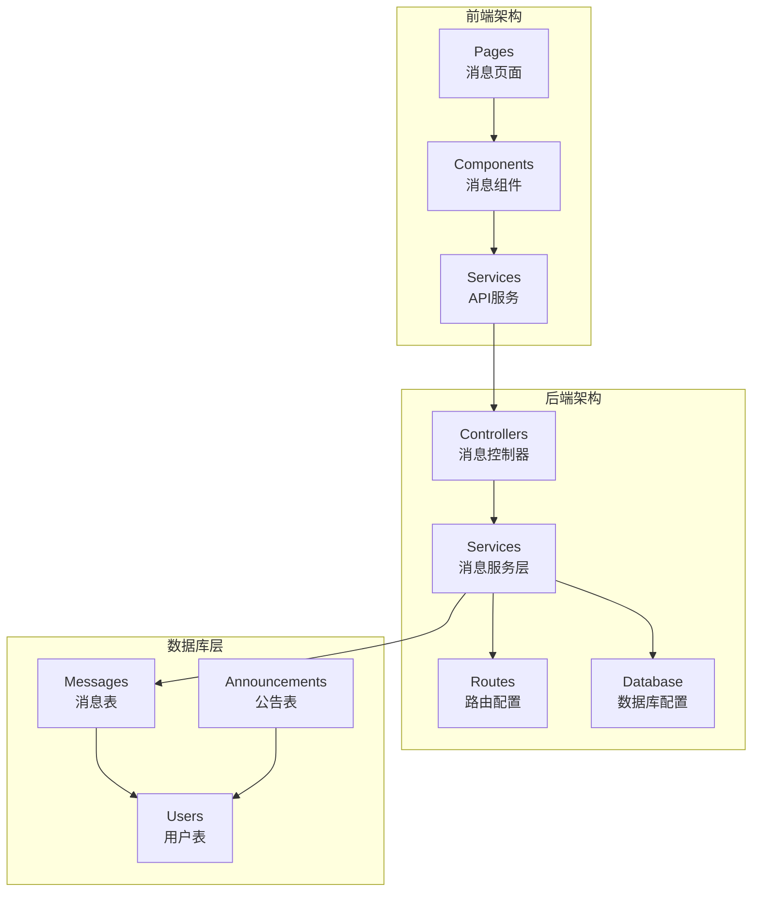
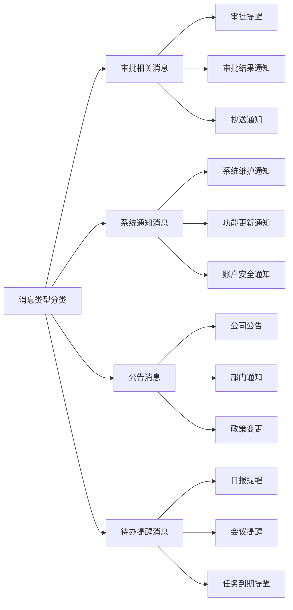
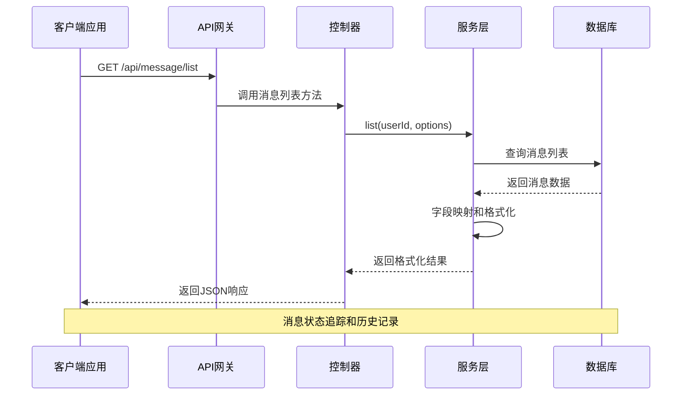
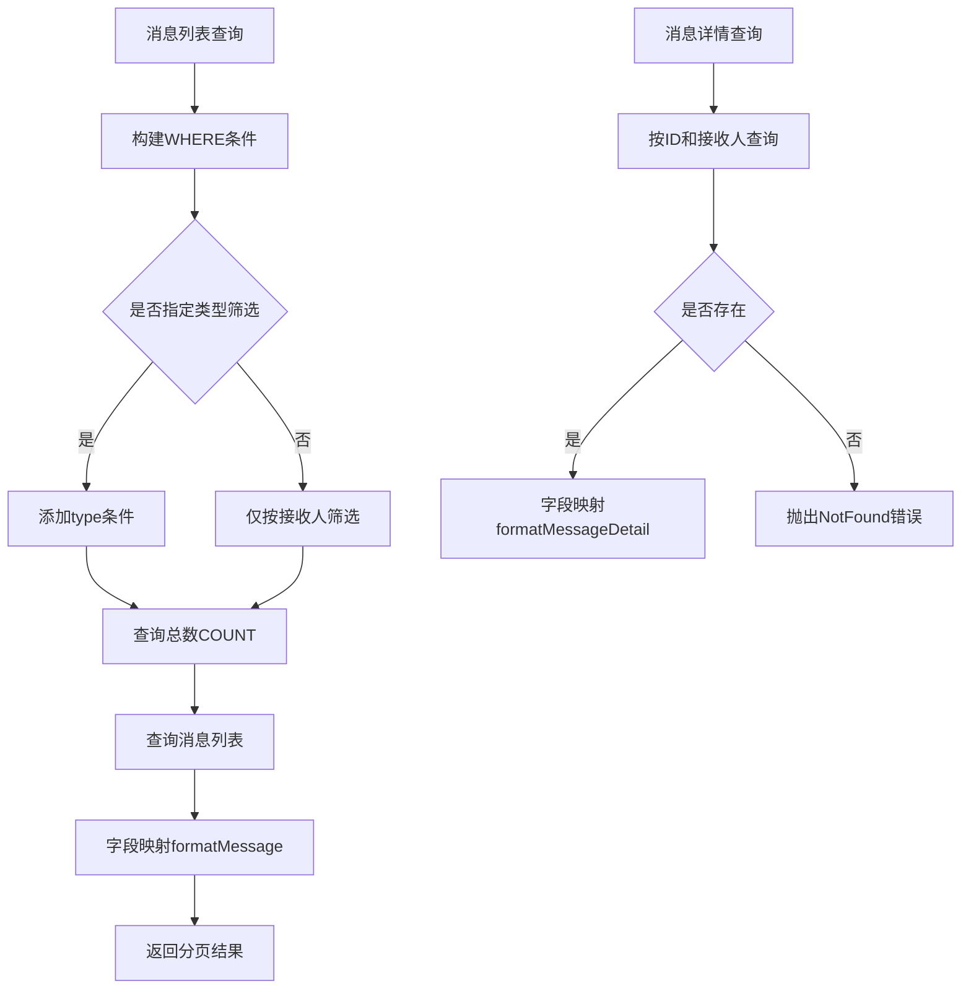
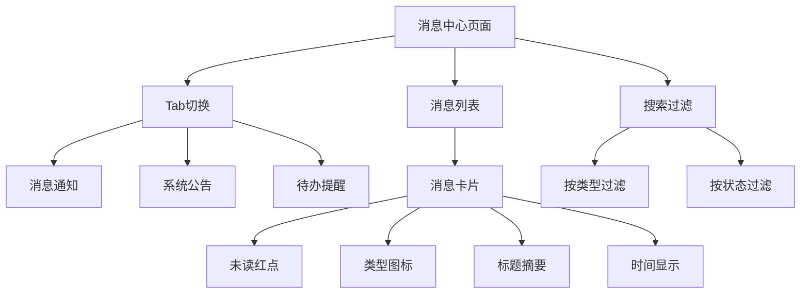
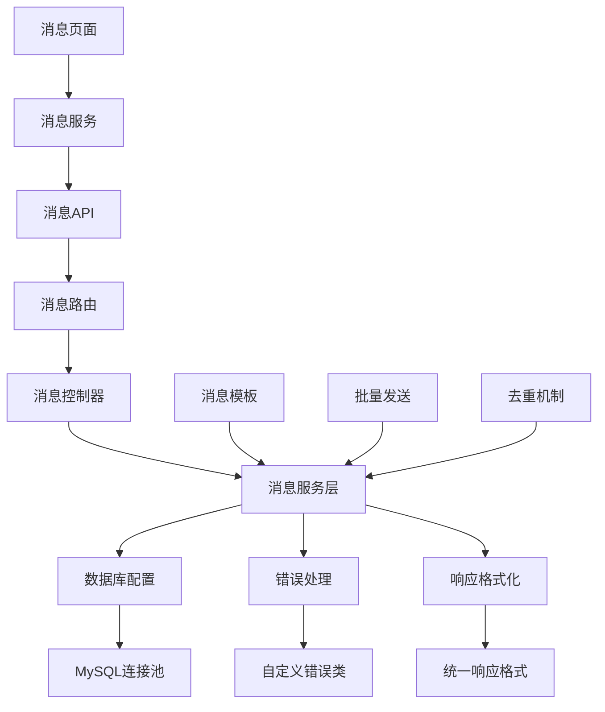
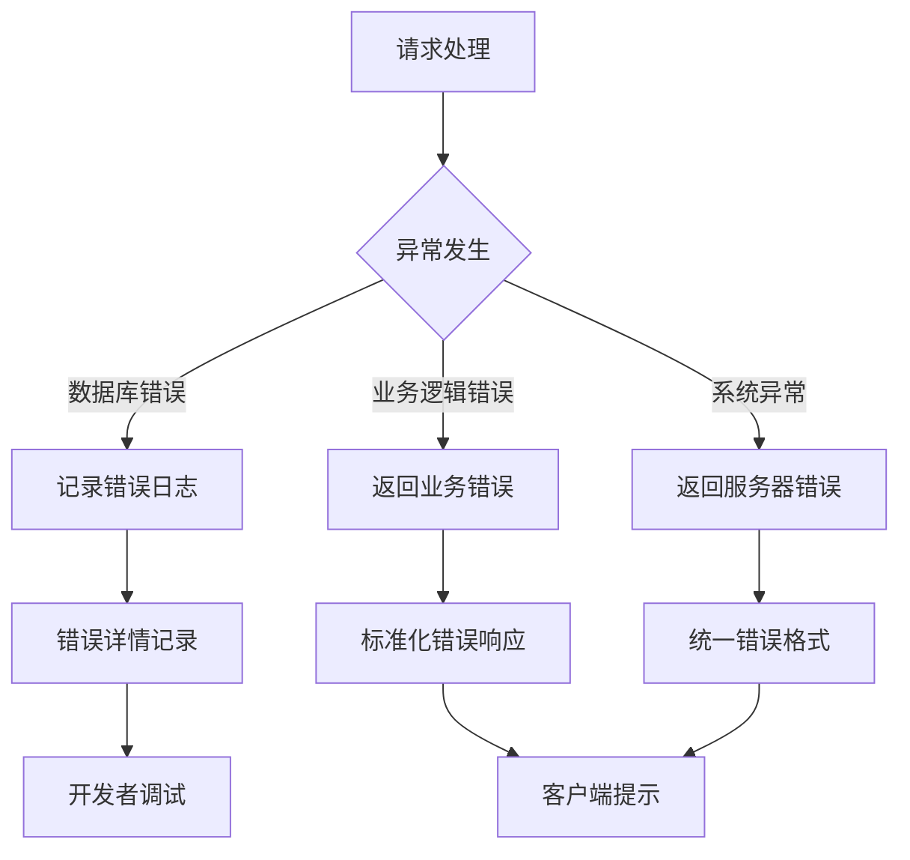

# 消息表设计

<cite>
**本文引用的文件**
- [message.controller.js](file://backend/src/core/controllers/message.controller.js)
- [message.service.js](file://backend/src/core/services/message.service.js)
- [message.routes.js](file://backend/src/core/routes/message.routes.js)
- [database.js](file://backend/src/common/config/database.js)
- [init-db.js](file://backend/scripts/init-db.js)
- [index.vue](file://miniapp/src/pages/message/index/index.vue)
- [detail.vue](file://miniapp/src/pages/message/detail.vue)
- [message.js](file://miniapp/src/services/modules/message.js)
- [Tech-Plan.md](file://shared-docs/Tech-Plan.md)
- [后端技术开发指导及规范.md](file://backend/docs/后端技术开发指导及规范.md)
</cite>

## 目录
1. [引言](#引言)
2. [项目结构](#项目结构)
3. [核心组件](#核心组件)
4. [架构概览](#架构概览)
5. [详细组件分析](#详细组件分析)
6. [依赖关系分析](#依赖关系分析)
7. [性能考虑](#性能考虑)
8. [故障排除指南](#故障排除指南)
9. [结论](#结论)

## 引言

本文档为微信小程序OA系统的消息表设计提供了完整的数据库设计方案。该系统实现了企业级的消息通知功能，支持多种消息类型、状态管理和推送机制。消息表作为系统的核心数据结构，承载着审批提醒、系统通知、公告等多种业务消息的存储和管理。

系统采用前后端分离架构，后端基于Node.js + Express框架，前端基于Vue.js + UniApp框架，通过RESTful API进行数据交互。消息功能涵盖了从消息创建、存储、查询到展示的完整业务流程。

## 项目结构

消息系统在项目中的组织结构如下：

**图表来源**
- [message.controller.js:1-77](file://backend/src/core/controllers/message.controller.js#L1-L77)
- [message.service.js:1-166](file://backend/src/core/services/message.service.js#L1-L166)
- [message.routes.js:1-120](file://backend/src/core/routes/message.routes.js#L1-L120)

**章节来源**
- [message.controller.js:1-77](file://backend/src/core/controllers/message.controller.js#L1-L77)
- [message.service.js:1-166](file://backend/src/core/services/message.service.js#L1-L166)
- [message.routes.js:1-120](file://backend/src/core/routes/message.routes.js#L1-L120)

## 核心组件

### 数据库表结构

消息表(messages)是整个消息系统的核心数据结构，采用InnoDB引擎，UTF8MB4字符集，支持完整的中文字符存储。

**消息表字段设计**

| 字段名 | 数据类型 | 约束条件 | 描述 | 业务含义 |
|--------|----------|----------|------|----------|
| id | INT UNSIGNED | PRIMARY KEY, AUTO_INCREMENT | 自增主键 | 消息唯一标识符 |
| sender_id | INT UNSIGNED | DEFAULT NULL | 发送者用户ID | 系统消息为NULL，普通消息为用户ID |
| receiver_id | INT UNSIGNED | NOT NULL | 接收者用户ID | 消息接收人标识 |
| type | VARCHAR(30) | NOT NULL | 消息类型 | approval/system/announcement等 |
| title | VARCHAR(200) | NOT NULL | 消息标题 | 消息显示标题 |
| content | TEXT | DEFAULT NULL | 消息内容 | 消息正文内容 |
| ref_id | INT UNSIGNED | DEFAULT NULL | 关联业务ID | 关联具体业务实例ID |
| ref_type | VARCHAR(50) | DEFAULT NULL | 关联业务类型 | 关联业务类型标识 |
| is_read | TINYINT(1) | NOT NULL DEFAULT 0 | 是否已读 | 0未读，1已读 |
| read_at | DATETIME | DEFAULT NULL | 阅读时间 | 用户阅读时间戳 |
| created_at | DATETIME | NOT NULL DEFAULT CURRENT_TIMESTAMP | 创建时间 | 消息创建时间 |
| updated_at | DATETIME | NOT NULL DEFAULT CURRENT_TIMESTAMP ON UPDATE CURRENT_TIMESTAMP | 更新时间 | 消息最后更新时间 |

**索引设计**
- 主键索引：PRIMARY KEY (id)
- 接收人索引：KEY idx_receiver_id (receiver_id)
- 类型索引：KEY idx_type (type)
- 已读状态索引：KEY idx_is_read (is_read)
- 创建时间索引：KEY idx_created_at (created_at)

### 消息类型分类

系统支持以下消息类型：

**图表来源**
- [init-db.js:162-180](file://backend/scripts/init-db.js#L162-L180)

**章节来源**
- [init-db.js:162-180](file://backend/scripts/init-db.js#L162-L180)

## 架构概览

消息系统采用分层架构设计，确保了良好的可维护性和扩展性：

**图表来源**
- [message.controller.js:10-19](file://backend/src/core/controllers/message.controller.js#L10-L19)
- [message.service.js:83-107](file://backend/src/core/services/message.service.js#L83-L107)

系统架构特点：
- **分层清晰**：Controller-Service-Database三层架构
- **职责分离**：路由处理、业务逻辑、数据访问职责明确
- **可扩展性**：支持消息模板、批量发送等功能扩展
- **性能优化**：合理的索引设计和查询优化

**章节来源**
- [message.controller.js:1-77](file://backend/src/core/controllers/message.controller.js#L1-L77)
- [message.service.js:1-166](file://backend/src/core/services/message.service.js#L1-L166)

## 详细组件分析

### 消息控制器

消息控制器负责处理HTTP请求和响应，提供标准的RESTful接口：

**主要接口功能**

| 接口路径 | HTTP方法 | 功能描述 | 请求参数 | 响应数据 |
|----------|----------|----------|----------|----------|
| /api/message/list | POST | 消息列表查询 | page, pageSize, type | 分页消息列表 |
| /api/message/detail | POST | 消息详情获取 | id | 消息详情对象 |
| /api/message/unread | POST | 未读消息统计 | - | 未读数量 |
| /api/message/markRead | POST | 标记消息为已读 | id | 操作结果 |
| /api/message/delete | POST | 删除消息 | id | 删除结果 |

**章节来源**
- [message.routes.js:14-119](file://backend/src/core/routes/message.routes.js#L14-L119)
- [message.controller.js:10-74](file://backend/src/core/controllers/message.controller.js#L10-L74)

### 消息服务层

消息服务层实现了核心业务逻辑，包括数据查询、格式化和状态管理：

**数据查询逻辑**

**图表来源**
- [message.service.js:83-127](file://backend/src/core/services/message.service.js#L83-L127)

**字段映射机制**

服务层实现了数据库字段到API字段的映射，包括：
- `content` → `desc`（内容别名映射）
- `is_read` → `isRead`（布尔化处理）
- `created_at` → `time`（时间格式化）
- 类型映射到图标和背景色

**章节来源**
- [message.service.js:39-72](file://backend/src/core/services/message.service.js#L39-L72)
- [Tech-Plan.md:640-686](file://shared-docs/Tech-Plan.md#L640-L686)

### 前端集成

前端消息页面实现了完整的用户交互体验：

**消息页面功能**

**图表来源**
- [index.vue:51-69](file://miniapp/src/pages/message/index/index.vue#L51-L69)

**章节来源**
- [index.vue:1-187](file://miniapp/src/pages/message/index/index.vue#L1-L187)
- [detail.vue:1-102](file://miniapp/src/pages/message/detail.vue#L1-L102)

### 数据库配置

数据库连接采用连接池管理，支持事务处理和查询优化：

**连接池配置**
- 最大连接数：支持高并发访问
- 连接超时：自动断开长时间空闲连接
- 字符集：UTF8MB4支持完整中文字符
- 时区：东八区北京时间

**事务支持**
- 支持MySQL事务处理
- 自动事务提交和回滚
- 连接自动释放

**章节来源**
- [database.js:11-24](file://backend/src/common/config/database.js#L11-L24)
- [database.js:168-181](file://backend/src/common/config/database.js#L168-L181)

## 依赖关系分析

消息系统各组件之间的依赖关系如下：

**图表来源**
- [message.controller.js:3](file://backend/src/core/controllers/message.controller.js#L3)
- [message.service.js:3](file://backend/src/core/services/message.service.js#L3)
- [message.routes.js:4](file://backend/src/core/routes/message.routes.js#L4)

**依赖特点**：
- **低耦合**：各层职责明确，相互依赖程度适中
- **可测试性**：服务层独立于数据库，便于单元测试
- **可扩展性**：支持消息模板、批量发送等扩展功能

**章节来源**
- [message.controller.js:1-77](file://backend/src/core/controllers/message.controller.js#L1-L77)
- [message.service.js:1-166](file://backend/src/core/services/message.service.js#L1-L166)

## 性能考虑

### 查询优化

**索引策略**
- 接收人ID索引：支持按用户快速查询消息
- 类型索引：支持消息类型筛选
- 已读状态索引：支持未读消息统计
- 创建时间索引：支持按时间排序和分页

**查询优化**
- 分页查询：LIMIT + OFFSET实现高效分页
- 条件筛选：动态WHERE条件构建
- 字段选择：避免SELECT *，只查询必要字段

### 缓存策略

**前端缓存**
- 消息列表缓存：减少重复请求
- 用户设置缓存：本地存储通知偏好设置
- 图标资源缓存：静态资源浏览器缓存

**后端缓存**
- 连接池复用：减少数据库连接开销
- 查询结果缓存：热点数据缓存

### 扩展性设计

**消息模板**
- 支持模板化消息生成
- 参数化内容替换
- 多语言支持

**批量发送**
- 支持批量消息创建
- 批量状态更新
- 异步处理机制

**章节来源**
- [init-db.js:175-179](file://backend/scripts/init-db.js#L175-L179)
- [后端技术开发指导及规范.md:325-333](file://backend/docs/后端技术开发指导及规范.md#L325-L333)

## 故障排除指南

### 常见问题诊断

**消息查询异常**
- 检查数据库连接状态
- 验证用户权限和消息归属
- 确认查询参数格式

**消息状态同步问题**
- 检查已读状态更新逻辑
- 验证时间戳字段更新
- 确认事务提交状态

**前端显示异常**
- 检查字段映射配置
- 验证图标和样式资源
- 确认API响应格式

### 错误处理机制

系统实现了完善的错误处理机制：

**章节来源**
- [message.service.js:122-124](file://backend/src/core/services/message.service.js#L122-L124)
- [后端技术开发指导及规范.md:477-507](file://backend/docs/后端技术开发指导及规范.md#L477-L507)

## 结论

消息表设计充分考虑了企业级应用的需求，实现了以下关键特性：

**设计优势**
- **完整性**：支持多种消息类型和业务场景
- **可扩展性**：预留模板、批量、去重等扩展点
- **性能优化**：合理的索引设计和查询优化
- **用户体验**：前后端协同的完整消息体验

**业务价值**
- 提升了企业内部沟通效率
- 支持多样化的消息推送场景
- 提供了完善的消息状态追踪
- 实现了消息历史记录管理

**未来发展方向**
- 消息模板管理系统
- 智能消息推送算法
- 消息分析和统计功能
- 多平台消息同步机制

该消息表设计为企业的数字化转型提供了坚实的数据基础，支持了从简单通知到复杂业务流程的全方位消息管理需求。