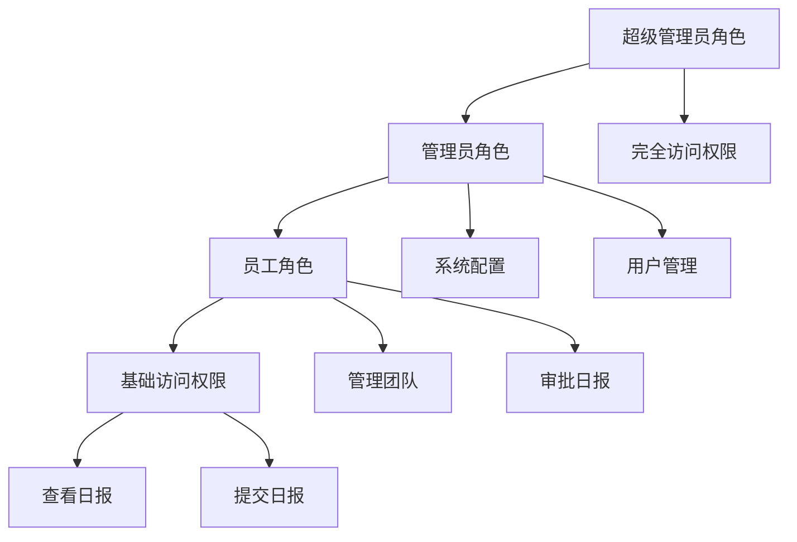
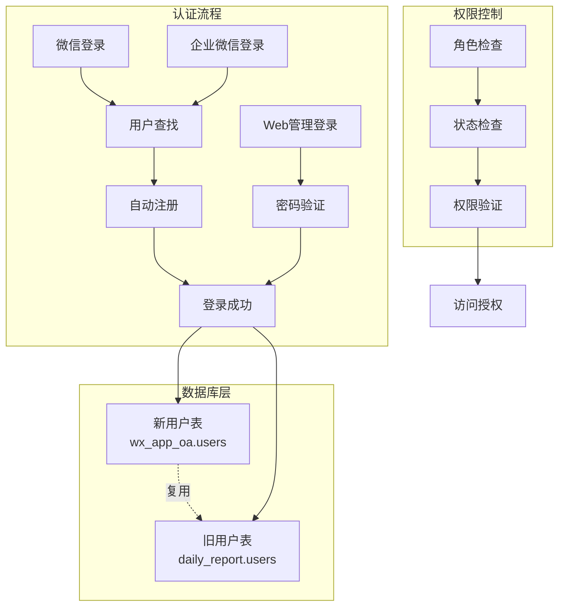
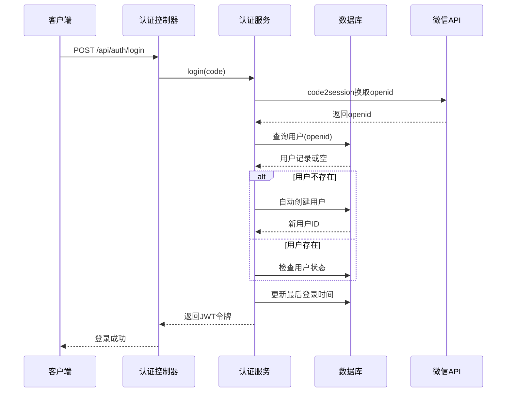
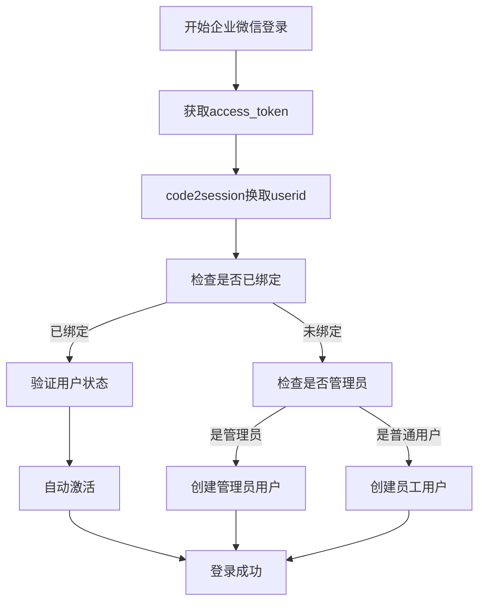
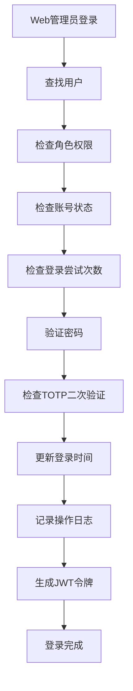
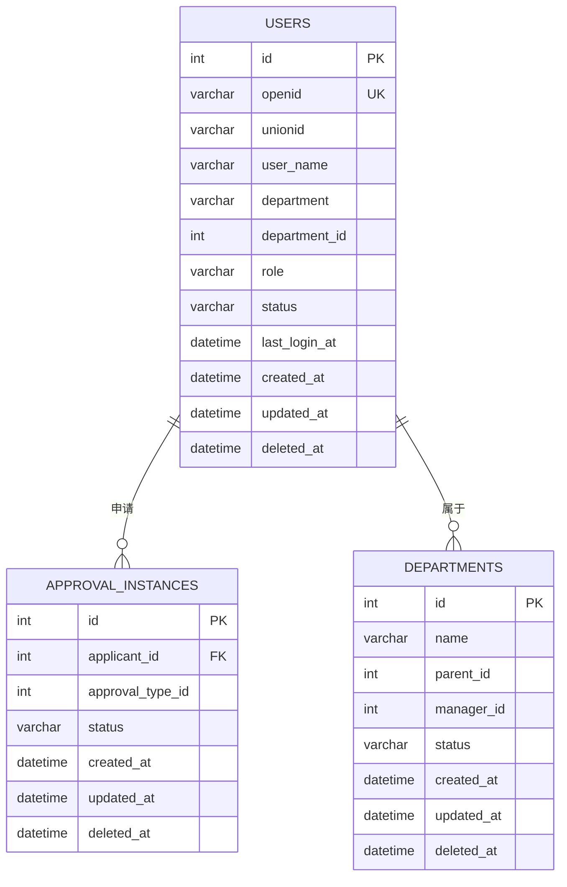
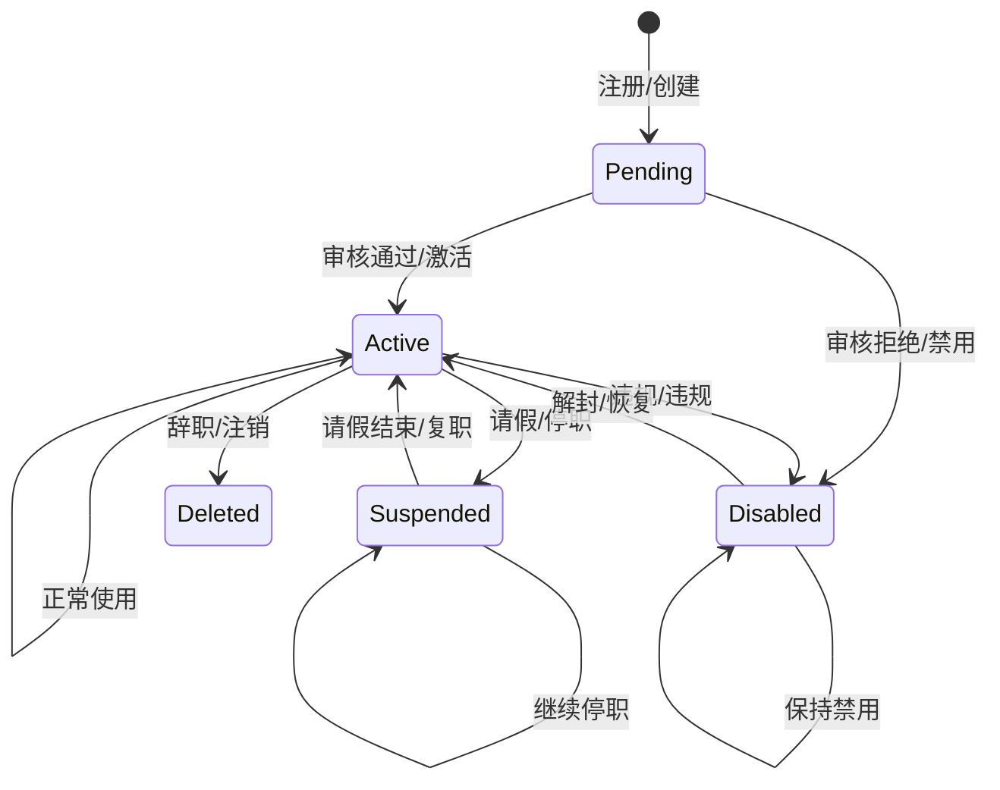
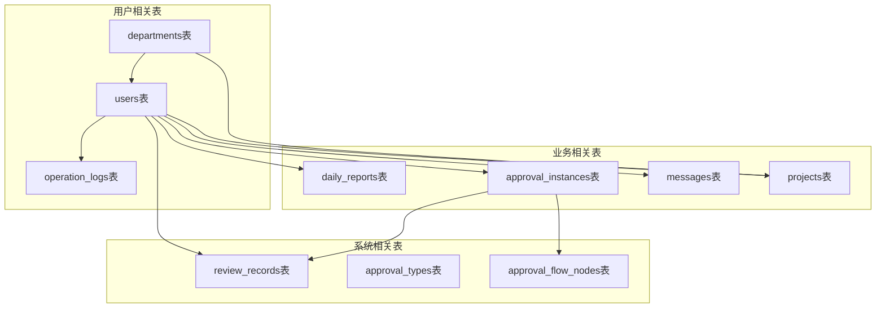

# 用户表设计

<cite>
**本文档引用的文件**
- [database.js](file://backend/src/common/config/database.js)
- [auth.service.js](file://backend/src/auth/services/auth.service.js)
- [auth.controller.js](file://backend/src/auth/controllers/auth.controller.js)
- [env.js](file://backend/src/common/config/env.js)
- [init-db.js](file://backend/scripts/init-db.js)
- [alter_daily_reports.sql](file://backend/scripts/alter_daily_reports.sql)
- [alter_daily_reports_safe.sql](file://backend/scripts/alter_daily_reports_safe.sql)
- [review_records.sql](file://backend/scripts/review_records.sql)
- [import_excel.py](file://scripts/import_excel.py)
- [技术可行性分析报告.md](file://backend/docs/技术可行性分析报告.md)
- [Tech-Plan.md](file://shared-docs/Tech-Plan.md)
</cite>

## 目录
1. [简介](#简介)
2. [项目结构](#项目结构)
3. [核心组件](#核心组件)
4. [架构概览](#架构概览)
5. [详细组件分析](#详细组件分析)
6. [依赖分析](#依赖分析)
7. [性能考虑](#性能考虑)
8. [故障排除指南](#故障排除指南)
9. [结论](#结论)

## 简介

本文档为智慧办公助手OA系统的用户表设计提供了全面的技术文档。该系统采用双数据库架构，其中用户表位于新的wx_app_oa数据库中，支持微信小程序登录、企业微信登录和Web管理端登录等多种认证方式。

用户表设计充分考虑了现代OA系统的需求，包括用户身份认证、权限管理、部门组织架构、用户状态管理等核心功能。系统支持员工、管理员、超级管理员三种角色权限，并提供了完善的数据完整性约束和索引策略。

## 项目结构

智慧办公助手OA系统采用前后端分离架构，用户表设计涉及多个层面：

```mermaid
graph TB
subgraph "前端应用"
MiniApp[小程序客户端]
WebApp[Web管理端]
end
subgraph "后端服务"
AuthController[认证控制器]
AuthService[认证服务层]
DBConfig[数据库配置]
end
subgraph "数据库架构"
NewDB[wx_app_oa库<br/>用户表(新)]
OldDB[daily_report库<br/>只读复用]
end
MiniApp --> AuthController
WebApp --> AuthController
AuthController --> AuthService
AuthService --> DBConfig
DBConfig --> NewDB
DBConfig --> OldDB
```

**图表来源**
- [database.js:11-24](file://backend/src/common/config/database.js#L11-L24)
- [env.js:58-78](file://backend/src/common/config/env.js#L58-L78)

**章节来源**
- [database.js:1-222](file://backend/src/common/config/database.js#L1-L222)
- [env.js:1-118](file://backend/src/common/config/env.js#L1-L118)

## 核心组件

### 用户表结构设计

基于系统实际实现，用户表采用以下核心字段设计：

| 字段名 | 数据类型 | 长度限制 | 默认值 | 约束 | 描述 |
|--------|----------|----------|--------|------|------|
| id | INT UNSIGNED | - | - | 主键, 自增 | 用户唯一标识 |
| openid | VARCHAR(64) | 64 | NOT NULL | 唯一索引 | 微信OpenID |
| unionid | VARCHAR(64) | 64 | NULL | 唯一索引 | 微信UnionID |
| nickname | VARCHAR(100) | 100 | NULL | - | 微信昵称 |
| avatar_url | VARCHAR(500) | 500 | NULL | - | 头像URL |
| phone | VARCHAR(20) | 20 | NULL | - | 手机号 |
| email | VARCHAR(100) | 100 | NULL | - | 邮箱地址 |
| user_name | VARCHAR(50) | 50 | NOT NULL | - | 真实姓名/用户名 |
| department | VARCHAR(100) | 100 | NULL | - | 所属部门名称 |
| department_id | INT UNSIGNED | - | NULL | - | 所属部门ID |
| position | VARCHAR(100) | 100 | NULL | - | 职位 |
| role | VARCHAR(20) | 20 | 'employee' | - | 角色: employee/admin/superadmin |
| status | VARCHAR(20) | 20 | 'active' | - | 状态: active/disabled |
| last_login_at | DATETIME | - | NULL | - | 最后登录时间 |
| created_at | DATETIME | - | CURRENT_TIMESTAMP | - | 创建时间 |
| updated_at | DATETIME | - | CURRENT_TIMESTAMP | - | 更新时间 |
| deleted_at | DATETIME | - | NULL | - | 软删除时间 |

### 索引策略

用户表建立了以下索引以优化查询性能：

- **主键索引**: `PRIMARY KEY (id)`
- **唯一索引**: `UNIQUE KEY uk_openid (openid)`
- **普通索引**: 
  - `KEY idx_department (department)`
  - `KEY idx_role (role)`
  - `KEY idx_status (status)`
  - `KEY idx_created_at (created_at)`

### 角色权限设计

系统支持三种用户角色，每种角色具有不同的权限范围：



**图表来源**
- [auth.service.js:268-364](file://backend/src/auth/services/auth.service.js#L268-L364)

**章节来源**
- [init-db.js:23-47](file://backend/scripts/init-db.js#L23-L47)
- [auth.service.js:16-87](file://backend/src/auth/services/auth.service.js#L16-L87)

## 架构概览

系统采用双数据库架构，确保新旧系统的平滑过渡：



**图表来源**
- [auth.service.js:22-87](file://backend/src/auth/services/auth.service.js#L22-L87)
- [auth.service.js:268-364](file://backend/src/auth/services/auth.service.js#L268-L364)

**章节来源**
- [auth.controller.js:16-88](file://backend/src/auth/controllers/auth.controller.js#L16-L88)
- [database.js:11-43](file://backend/src/common/config/database.js#L11-L43)

## 详细组件分析

### 认证服务组件

认证服务是用户表设计的核心组件，负责处理各种登录场景：

#### 微信登录流程



**图表来源**
- [auth.controller.js:16-29](file://backend/src/auth/controllers/auth.controller.js#L16-L29)
- [auth.service.js:22-87](file://backend/src/auth/services/auth.service.js#L22-L87)

#### 企业微信登录流程

企业微信登录提供了更严格的身份验证机制：



**图表来源**
- [auth.service.js:94-164](file://backend/src/auth/services/auth.service.js#L94-L164)

#### Web管理登录流程

Web管理登录提供了最严格的安全验证：



**图表来源**
- [auth.service.js:268-364](file://backend/src/auth/services/auth.service.js#L268-L364)

**章节来源**
- [auth.service.js:16-415](file://backend/src/auth/services/auth.service.js#L16-L415)
- [auth.controller.js:16-162](file://backend/src/auth/controllers/auth.controller.js#L16-L162)

### 数据完整性约束

用户表设计包含了完善的数据完整性约束：

#### 外键关系设计

虽然用户表本身不包含外键，但通过业务逻辑实现了部门关联：



**图表来源**
- [init-db.js:23-67](file://backend/scripts/init-db.js#L23-L67)

#### 触发器设计

系统通过应用程序层实现数据变更的审计跟踪：

| 触发器类型 | 触发时机 | 功能描述 | 相关表 |
|------------|----------|----------|--------|
| 用户创建触发器 | INSERT users | 记录用户注册日志 | operation_logs |
| 用户状态变更触发器 | UPDATE users | 记录状态变更日志 | operation_logs |
| 用户登录触发器 | UPDATE users | 记录登录行为 | operation_logs |
| 用户删除触发器 | DELETE users | 记录软删除操作 | operation_logs |

**章节来源**
- [auth.service.js:44-87](file://backend/src/auth/services/auth.service.js#L44-L87)
- [auth.service.js:174-182](file://backend/src/auth/services/auth.service.js#L174-L182)

### 用户生命周期管理

用户生命周期管理涵盖了从注册到注销的完整过程：



**图表来源**
- [auth.service.js:76-83](file://backend/src/auth/services/auth.service.js#L76-L83)

**章节来源**
- [auth.service.js:16-87](file://backend/src/auth/services/auth.service.js#L16-L87)

## 依赖分析

### 数据库依赖关系

系统数据库依赖关系体现了清晰的分层架构：



**图表来源**
- [init-db.js:23-239](file://backend/scripts/init-db.js#L23-L239)

### 外部依赖

系统对外部服务的依赖主要包括：

| 依赖服务 | 用途 | 版本要求 | 配置参数 |
|----------|------|----------|----------|
| MySQL 8.0+ | 主数据库 | 8.0及以上 | oaDb配置 |
| Redis | 缓存和会话存储 | 5.0及以上 | redis配置 |
| 微信API | 小程序登录认证 | v3 | wx配置 |
| 企业微信API | 企业微信登录认证 | v3 | qywx配置 |
| JWT服务 | 令牌签发和验证 | 任意 | jwt配置 |

**章节来源**
- [env.js:58-107](file://backend/src/common/config/env.js#L58-L107)
- [database.js:11-43](file://backend/src/common/config/database.js#L11-L43)

## 性能考虑

### 查询性能优化

针对用户表的查询模式，系统采用了以下优化策略：

1. **索引优化**
   - 为常用查询字段建立索引
   - 使用复合索引优化多条件查询
   - 定期分析查询执行计划

2. **缓存策略**
   - 用户基本信息缓存
   - 部门树形结构缓存
   - 权限信息缓存

3. **连接池管理**
   - 合理配置连接池大小
   - 连接超时和重试机制
   - 连接泄漏防护

### 存储性能优化

1. **数据类型选择**
   - 使用合适的数据类型减少存储空间
   - ENUM类型用于固定枚举值
   - JSON类型用于灵活的配置存储

2. **分区策略**
   - 按时间分区大表
   - 按用户ID哈希分区
   - 按状态分区

## 故障排除指南

### 常见问题诊断

#### 登录失败问题

| 问题类型 | 可能原因 | 解决方案 |
|----------|----------|----------|
| 微信登录失败 | 网络超时/接口错误 | 检查微信API可用性 |
| 密码错误 | 用户名不存在 | 验证用户是否存在 |
| 账号禁用 | 管理员禁用账号 | 检查用户状态 |
| 频繁失败锁定 | 15分钟内多次失败 | 等待锁定解除 |

#### 权限问题

| 问题类型 | 可能原因 | 解决方案 |
|----------|----------|----------|
| 无管理权限 | 角色不是admin/superadmin | 检查用户角色 |
| 部门权限不足 | 部门负责人权限限制 | 验证部门权限 |
| 审批权限缺失 | 审批流程配置问题 | 检查审批配置 |

**章节来源**
- [auth.service.js:277-320](file://backend/src/auth/services/auth.service.js#L277-L320)

### 监控和日志

系统提供了完善的监控和日志机制：

1. **数据库查询日志**
   - 记录所有数据库操作
   - 包含执行时间和参数
   - 错误日志记录

2. **认证日志**
   - 登录成功/失败记录
   - 权限验证日志
   - 操作审计日志

3. **性能监控**
   - 查询响应时间统计
   - 连接池使用情况
   - 缓存命中率

## 结论

智慧办公助手OA系统的用户表设计充分体现了现代企业级应用的需求。通过双数据库架构、完善的权限控制、灵活的角色设计和严格的数据完整性约束，系统为用户提供了安全、稳定、高效的OA服务。

用户表设计的关键优势包括：

1. **安全性**: 多层次认证机制，支持微信、企业微信和Web登录
2. **扩展性**: 灵活的字段设计，支持业务需求变化
3. **性能**: 合理的索引策略和缓存机制
4. **可维护性**: 完善的日志记录和监控机制
5. **合规性**: 支持软删除和审计跟踪

该设计为智慧办公助手OA系统的长期发展奠定了坚实的基础，能够满足未来业务扩展和技术演进的需求。