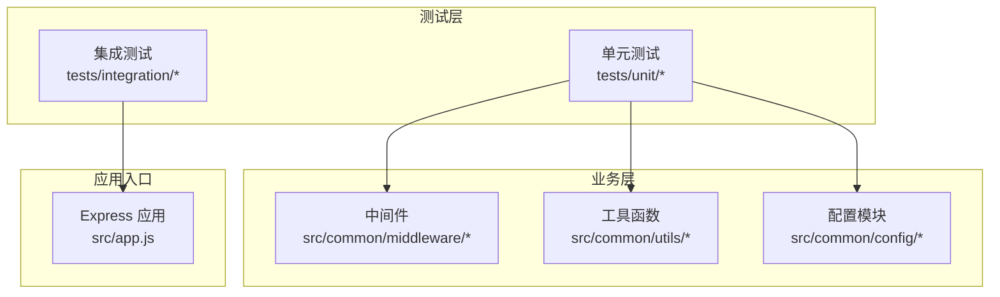
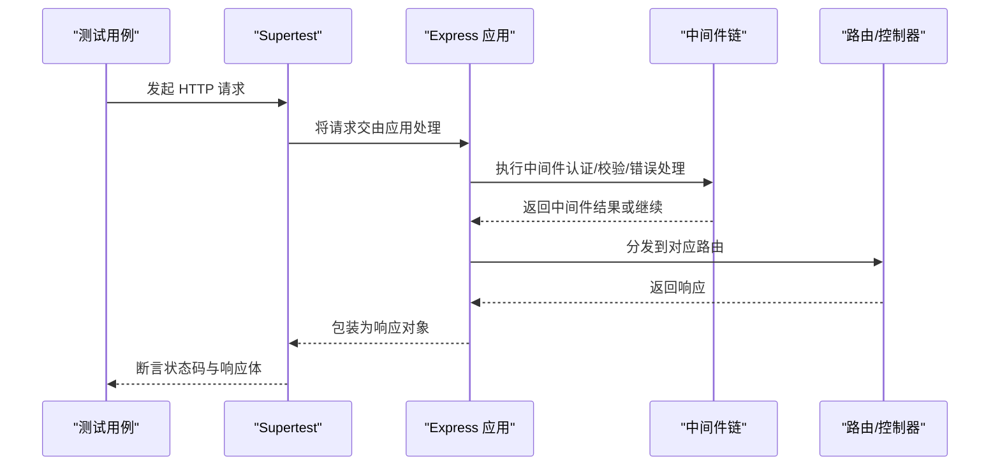
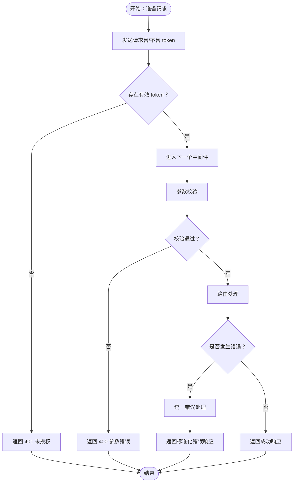
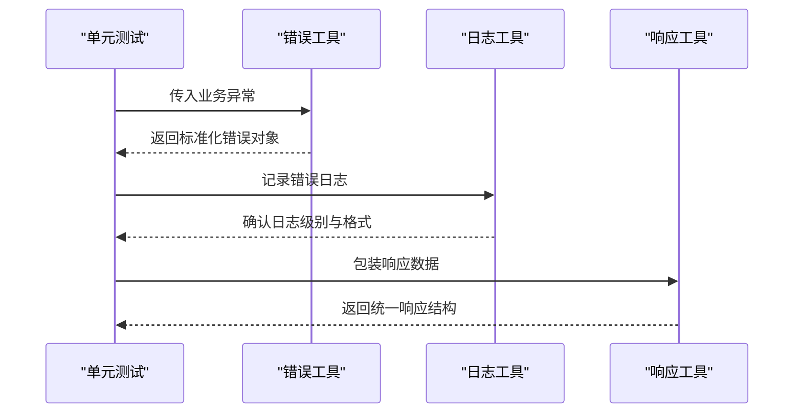
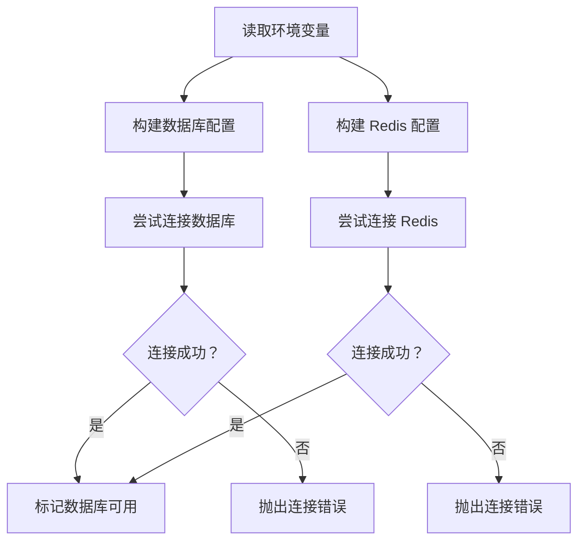
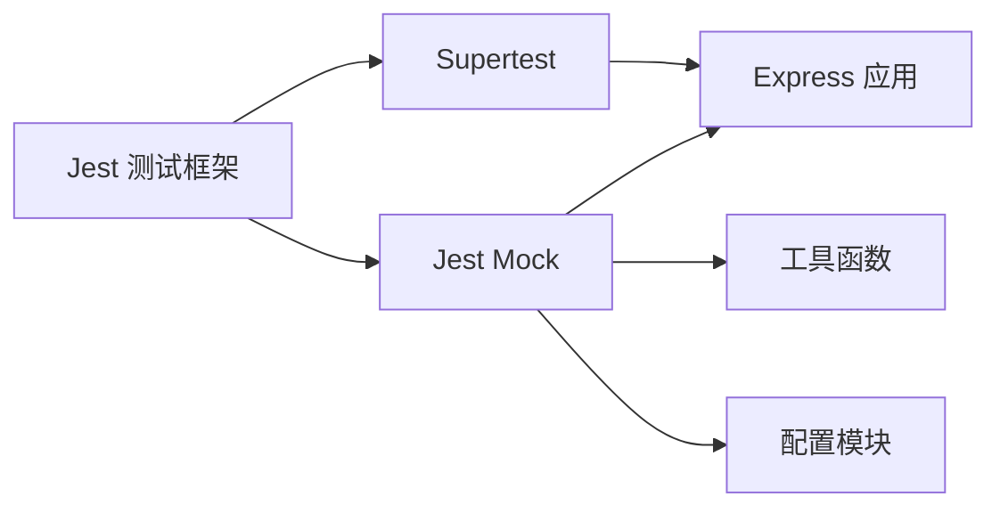

# 单元测试

<cite>
**本文引用的文件**
- [package.json](file://backend/package.json)
- [tests/setup.js](file://backend/tests/setup.js)
- [tests/integration/api.test.js](file://backend/tests/integration/api.test.js)
- [tests/integration/app.test.js](file://backend/tests/integration/app.test.js)
- [tests/integration/health.test.js](file://backend/tests/integration/health.test.js)
- [src/common/middleware/auth.js](file://backend/src/common/middleware/auth.js)
- [src/common/middleware/errorHandler.js](file://backend/src/common/middleware/errorHandler.js)
- [src/common/middleware/validator.js](file://backend/src/common/middleware/validator.js)
- [src/common/utils/errors.js](file://backend/src/common/utils/errors.js)
- [src/common/utils/logger.js](file://backend/src/common/utils/logger.js)
- [src/common/utils/response.js](file://backend/src/common/utils/response.js)
- [src/common/config/env.js](file://backend/src/common/config/env.js)
- [src/common/config/database.js](file://backend/src/common/config/database.js)
- [src/common/config/redis.js](file://backend/src/common/config/redis.js)
</cite>

## 目录
1. [简介](#简介)
2. [项目结构](#项目结构)
3. [核心组件](#核心组件)
4. [架构总览](#架构总览)
5. [详细组件分析](#详细组件分析)
6. [依赖分析](#依赖分析)
7. [性能考虑](#性能考虑)
8. [故障排查指南](#故障排查指南)
9. [结论](#结论)
10. [附录](#附录)

## 简介
本文件面向智慧办公助手 OA 系统后端的单元测试与测试体系，系统性阐述 Jest 测试框架在本项目的配置与使用方式，覆盖测试环境隔离、测试工具链集成、测试覆盖率门槛、以及中间件、工具函数、配置模块等层面的测试用例设计方法。文档同时提供 Mock 数据策略、异步断言与错误处理断言范式，并总结测试数据准备、环境隔离与测试清理的最佳实践，以确保测试的可靠性与可维护性。

## 项目结构
后端采用 Node.js + Express 架构，测试位于 backend/tests 目录，分为集成测试与单元测试两大类：
- tests/integration：基于 supertest 的端到端行为测试，覆盖路由、中间件、CORS、JSON 解析、404 路由与限流等场景
- tests/unit：按功能模块划分的单元测试，覆盖中间件、工具函数与配置模块

Jest 通过 package.json 中的脚本与 jest 配置进行统一管理，测试环境变量在 tests/setup.js 中集中初始化。

图表来源
- [tests/integration/api.test.js:1-34](file://backend/tests/integration/api.test.js#L1-L34)
- [tests/integration/app.test.js:1-101](file://backend/tests/integration/app.test.js#L1-L101)
- [tests/integration/health.test.js:1-57](file://backend/tests/integration/health.test.js#L1-L57)
- [src/common/middleware/auth.js](file://backend/src/common/middleware/auth.js)
- [src/common/middleware/errorHandler.js](file://backend/src/common/middleware/errorHandler.js)
- [src/common/middleware/validator.js](file://backend/src/common/middleware/validator.js)
- [src/common/utils/errors.js](file://backend/src/common/utils/errors.js)
- [src/common/utils/logger.js](file://backend/src/common/utils/logger.js)
- [src/common/utils/response.js](file://backend/src/common/utils/response.js)
- [src/common/config/env.js](file://backend/src/common/config/env.js)
- [src/common/config/database.js](file://backend/src/common/config/database.js)
- [src/common/config/redis.js](file://backend/src/common/config/redis.js)

章节来源
- [package.json:6-14](file://backend/package.json#L6-L14)
- [tests/setup.js:8-24](file://backend/tests/setup.js#L8-L24)

## 核心组件
- 测试框架与脚本
  - Jest 版本与脚本命令：通过 package.json 的 scripts 字段定义了启动、开发、测试、单元测试、集成测试等命令；Jest 配置位于 package.json 的 jest 字段中，指定测试环境为 node，开启覆盖率统计并设置全局覆盖率门槛
  - 覆盖率门槛：分支、函数、行、语句均要求达到 70%
  - 覆盖范围：收集 src 目录下所有 .js 文件的覆盖率，排除主入口文件
- 测试环境隔离
  - tests/setup.js 统一设置 NODE_ENV、PORT、日志级别、数据库与 Redis 连接信息、JWT 秘钥、微信 AppId、Swagger 开关等关键环境变量，确保测试在可控且隔离的环境中执行
  - 集成测试中的单测文件也通过 process.env 方式临时设置测试所需变量，避免污染全局环境
- 工具链集成
  - supertest：用于发起 HTTP 请求，验证路由行为、中间件效果与错误响应
  - Jest：提供断言、Mock、生命周期钩子（beforeAll/afterAll/beforeEach/afterEach）

章节来源
- [package.json:6-14](file://backend/package.json#L6-L14)
- [package.json:42-56](file://backend/package.json#L42-L56)
- [tests/setup.js:8-24](file://backend/tests/setup.js#L8-L24)
- [tests/integration/app.test.js:3-10](file://backend/tests/integration/app.test.js#L3-L10)

## 架构总览
下图展示了测试执行流程与被测对象的关系：测试通过 supertest 发起 HTTP 请求，经由 Express 应用进入中间件与路由层，最终调用控制器与服务；单元测试则直接对中间件、工具函数与配置模块进行隔离验证。

图表来源
- [tests/integration/api.test.js:12-33](file://backend/tests/integration/api.test.js#L12-L33)
- [tests/integration/app.test.js:14-99](file://backend/tests/integration/app.test.js#L14-L99)
- [tests/integration/health.test.js:14-56](file://backend/tests/integration/health.test.js#L14-L56)

## 详细组件分析

### 中间件测试
中间件是系统安全与数据质量的关键防线，单元测试需覆盖认证、参数校验与错误处理三大类。

- 认证中间件
  - 测试目标：验证 token 缺失、无效、过期等场景下的 401 响应；确保携带有效 token 时请求可继续流转
  - 断言要点：状态码、响应体结构、错误码字段
  - Mock 策略：通过 supertest 发送带/不带 token 的请求，必要时对鉴权服务进行 Mock
  - 参考实现路径：[src/common/middleware/auth.js](file://backend/src/common/middleware/auth.js)

- 参数验证器
  - 测试目标：验证 Joi 校验规则对必填字段、类型、长度、格式的约束；覆盖边界值与异常输入
  - 断言要点：校验失败时的 400 响应与错误消息结构
  - Mock 策略：构造多种非法输入组合，确保每条规则被触发
  - 参考实现路径：[src/common/middleware/validator.js](file://backend/src/common/middleware/validator.js)

- 错误处理器
  - 测试目标：验证未捕获异常、业务异常与参数异常的统一错误响应格式；确保日志记录与状态码一致性
  - 断言要点：响应结构、错误码、消息、数据域
  - Mock 策略：抛出同步/异步异常，或在被测函数中注入错误
  - 参考实现路径：[src/common/middleware/errorHandler.js](file://backend/src/common/middleware/errorHandler.js)

图表来源
- [src/common/middleware/auth.js](file://backend/src/common/middleware/auth.js)
- [src/common/middleware/validator.js](file://backend/src/common/middleware/validator.js)
- [src/common/middleware/errorHandler.js](file://backend/src/common/middleware/errorHandler.js)

章节来源
- [tests/integration/api.test.js:12-33](file://backend/tests/integration/api.test.js#L12-L33)
- [tests/integration/app.test.js:14-99](file://backend/tests/integration/app.test.js#L14-L99)

### 工具函数测试
工具函数测试强调纯函数与副作用分离，重点验证错误处理、日志记录与响应格式化。

- 错误处理工具
  - 测试目标：验证业务异常与系统异常的分类、映射与序列化；确保错误栈与上下文信息保留
  - 断言要点：错误类型、错误码、消息、堆栈信息
  - Mock 策略：构造不同类型的异常对象，验证转换逻辑
  - 参考实现路径：[src/common/utils/errors.js](file://backend/src/common/utils/errors.js)

- 日志记录工具
  - 测试目标：验证日志级别过滤、格式化输出、多目标输出（控制台/文件）；确保在测试环境下静默输出
  - 断言要点：日志级别、时间戳格式、消息内容
  - Mock 策略：替换底层日志适配器或输出目标，断言调用次数与参数
  - 参考实现路径：[src/common/utils/logger.js](file://backend/src/common/utils/logger.js)

- 响应格式化工具
  - 测试目标：验证统一响应结构（code/message/data)、分页数据、错误包装与状态码映射
  - 断言要点：响应结构完整性、字段类型与默认值
  - Mock 策略：传入不同数据类型与错误对象，断言输出结构
  - 参考实现路径：[src/common/utils/response.js](file://backend/src/common/utils/response.js)

图表来源
- [src/common/utils/errors.js](file://backend/src/common/utils/errors.js)
- [src/common/utils/logger.js](file://backend/src/common/utils/logger.js)
- [src/common/utils/response.js](file://backend/src/common/utils/response.js)

章节来源
- [tests/integration/health.test.js:14-56](file://backend/tests/integration/health.test.js#L14-L56)

### 配置模块测试
配置模块测试关注数据库连接、环境变量与 Redis 配置的可用性与健壮性。

- 环境变量
  - 测试目标：验证关键环境变量（数据库、Redis、JWT、微信 AppId、Swagger）在测试环境下的加载与默认值回退
  - 断言要点：变量存在性、类型与取值范围
  - Mock 策略：在 tests/setup.js 中设置环境变量，或在单测中临时修改
  - 参考实现路径：[src/common/config/env.js](file://backend/src/common/config/env.js)

- 数据库连接
  - 测试目标：验证连接字符串拼接、连接池参数、连接超时与异常重试策略
  - 断言要点：连接参数正确性、连接失败时的错误传播
  - Mock 策略：使用内存数据库或连接代理，断言连接建立与异常路径
  - 参考实现路径：[src/common/config/database.js](file://backend/src/common/config/database.js)

- Redis 配置
  - 测试目标：验证连接参数、序列化策略、超时与重连机制
  - 断言要点：连接状态、命令执行结果与异常处理
  - Mock 策略：使用本地 Redis 或 Mock 客户端，断言连接与命令
  - 参考实现路径：[src/common/config/redis.js](file://backend/src/common/config/redis.js)

图表来源
- [src/common/config/env.js](file://backend/src/common/config/env.js)
- [src/common/config/database.js](file://backend/src/common/config/database.js)
- [src/common/config/redis.js](file://backend/src/common/config/redis.js)

章节来源
- [tests/setup.js:8-24](file://backend/tests/setup.js#L8-L24)

## 依赖分析
- 测试与被测模块的耦合度
  - 中间件与工具函数相对独立，适合单元测试；配置模块与外部资源耦合较强，建议通过 Mock 与环境隔离降低耦合
- 外部依赖与集成点
  - supertest 作为 HTTP 测试客户端，与 Express 应用紧密耦合；建议在集成测试中使用
  - Winston 日志库与 MySQL/Redis 客户端在测试中可通过 Mock 替换，避免真实 I/O 干扰
- 覆盖率与门槛
  - 全局覆盖率门槛为 70%，需确保核心路径（分支/函数/行/语句）均被覆盖

图表来源
- [package.json:36-41](file://backend/package.json#L36-L41)
- [package.json:42-56](file://backend/package.json#L42-L56)
- [tests/integration/app.test.js:1-101](file://backend/tests/integration/app.test.js#L1-L101)

章节来源
- [package.json:36-41](file://backend/package.json#L36-L41)
- [package.json:42-56](file://backend/package.json#L42-L56)

## 性能考虑
- 测试执行速度
  - 使用 Jest 并行执行能力，合理拆分测试文件，避免共享状态导致的串行化
- I/O 与外部依赖
  - 通过 Mock 减少数据库与 Redis 的真实连接，优先使用内存态或轻量级替代
- 覆盖率与性能平衡
  - 在保证关键路径覆盖率的前提下，避免过度 Mock 导致测试不可靠；优先保证核心分支与异常路径被覆盖

## 故障排查指南
- 常见问题与定位
  - 环境变量未生效：确认 tests/setup.js 与单测文件中的 process.env 设置顺序与作用域
  - 路由 404 与 CORS 异常：检查路由注册与 CORS 中间件顺序，参考集成测试中的断言
  - JWT 认证失败：核对 token 生成与解析逻辑，确保测试中使用的 JWT_SECRET 一致
  - 数据库/Redis 连接失败：检查连接参数与 Mock 策略，确保测试环境具备可用的连接
- 排错步骤
  - 在 tests/setup.js 中设置最小化环境变量集合，逐步增加以定位问题
  - 使用 Jest 的 verbose 输出与断言失败信息，结合 Supertest 的响应体进行定位
  - 对关键中间件与工具函数添加日志断言，辅助定位异常路径

章节来源
- [tests/setup.js:8-24](file://backend/tests/setup.js#L8-L24)
- [tests/integration/app.test.js:14-99](file://backend/tests/integration/app.test.js#L14-L99)
- [tests/integration/health.test.js:14-56](file://backend/tests/integration/health.test.js#L14-L56)

## 结论
本项目的测试体系以 Jest 为核心，结合 supertest 实现端到端行为验证，辅以针对中间件、工具函数与配置模块的单元测试，形成从接口到内部逻辑的完整测试闭环。通过严格的环境隔离、Mock 策略与覆盖率门槛，确保测试的稳定性与可维护性。建议持续完善异常路径与边界条件的覆盖，并在 CI 中强制执行覆盖率检查。

## 附录
- 测试脚本与命令
  - 启动测试：npm run test
  - 仅运行单元测试：npm run test:unit
  - 仅运行集成测试：npm run test:integration
- 覆盖率配置
  - 测试环境：node
  - 全局覆盖率门槛：分支 70%、函数 70%、行 70%、语句 70%
  - 收集范围：src/**/*.js，排除 src/app.js
- 最佳实践清单
  - 测试前设置最小化环境变量，避免全局污染
  - 使用 Mock 替换外部依赖，确保测试可重复
  - 对异步操作使用 async/await 与超时断言
  - 对错误处理进行显式断言，覆盖同步与异步异常
  - 在 tests/setup.js 中集中初始化与清理，保持测试隔离

章节来源
- [package.json:6-14](file://backend/package.json#L6-L14)
- [package.json:42-56](file://backend/package.json#L42-L56)
- [tests/setup.js:26-34](file://backend/tests/setup.js#L26-L34)