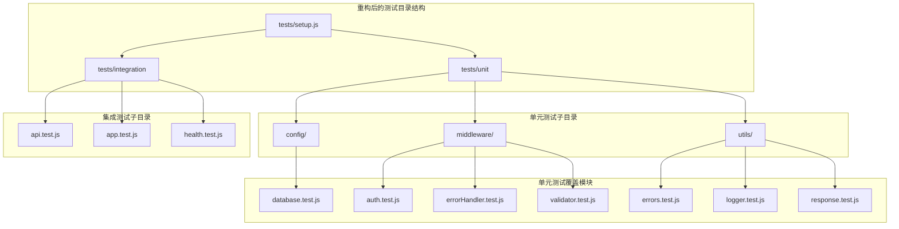
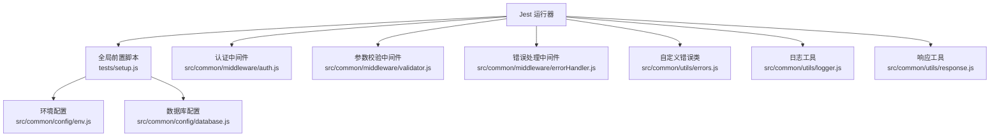
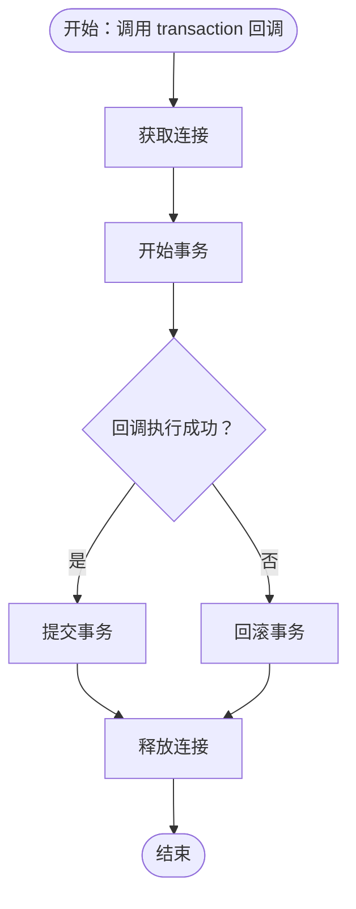
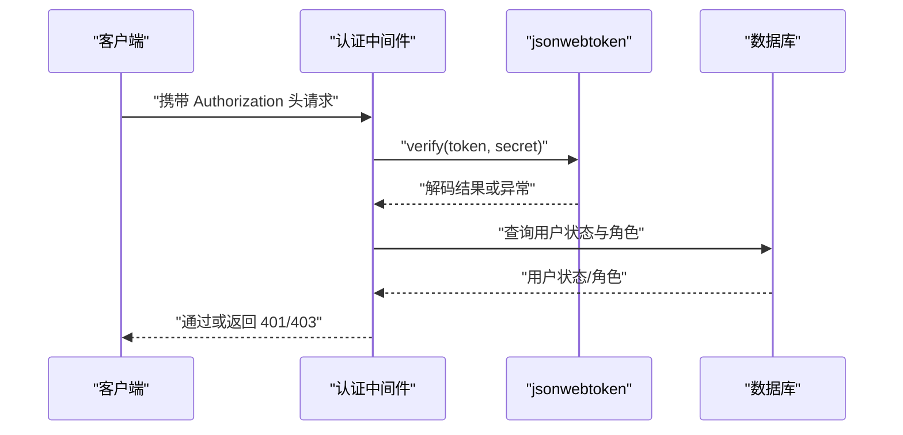
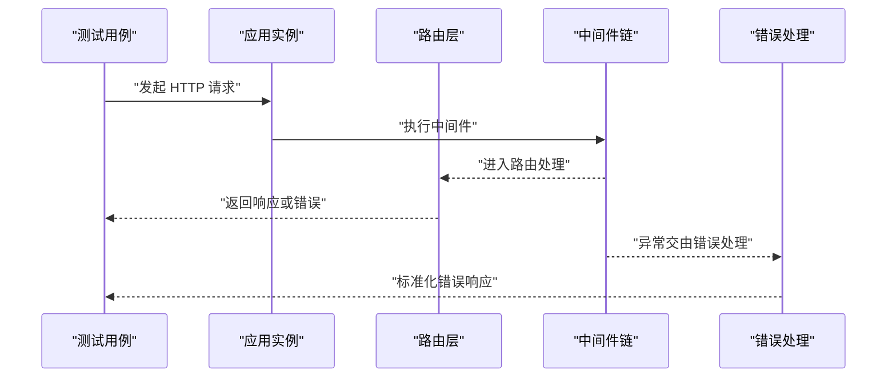
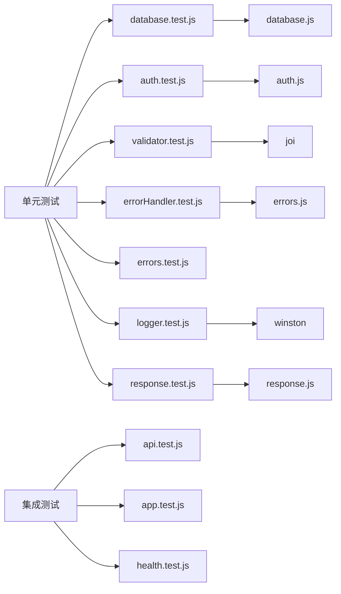

# 测试策略

<cite>
**本文引用的文件**
- [backend/package.json](file://backend/package.json)
- [backend/tests/setup.js](file://backend/tests/setup.js)
- [backend/tests/unit/config/database.test.js](file://backend/tests/unit/config/database.test.js)
- [backend/tests/unit/middleware/auth.test.js](file://backend/tests/unit/middleware/auth.test.js)
- [backend/tests/unit/middleware/errorHandler.test.js](file://backend/tests/unit/middleware/errorHandler.test.js)
- [backend/tests/unit/middleware/validator.test.js](file://backend/tests/unit/middleware/validator.test.js)
- [backend/tests/unit/utils/errors.test.js](file://backend/tests/unit/utils/errors.test.js)
- [backend/tests/unit/utils/logger.test.js](file://backend/tests/unit/utils/logger.test.js)
- [backend/tests/unit/utils/response.test.js](file://backend/tests/unit/utils/response.test.js)
- [backend/tests/integration/api.test.js](file://backend/tests/integration/api.test.js)
- [backend/tests/integration/app.test.js](file://backend/tests/integration/app.test.js)
- [backend/tests/integration/health.test.js](file://backend/tests/integration/health.test.js)
- [backend/src/common/config/env.js](file://backend/src/common/config/env.js)
- [backend/src/common/utils/errors.js](file://backend/src/common/utils/errors.js)
- [backend/src/common/middleware/auth.js](file://backend/src/common/middleware/auth.js)
</cite>

## 更新摘要
**所做更改**
- 新增 Jest 测试框架全面重构的详细说明
- 补充完整的单元测试和集成测试套件架构
- 更新测试覆盖率配置和执行策略
- 完善测试数据管理和 Mock 配置最佳实践
- 增强测试环境隔离和依赖管理策略

## 目录
1. [引言](#引言)
2. [项目结构](#项目结构)
3. [核心组件](#核心组件)
4. [架构总览](#架构总览)
5. [详细组件分析](#详细组件分析)
6. [依赖分析](#依赖分析)
7. [性能考虑](#性能考虑)
8. [故障排查指南](#故障排查指南)
9. [结论](#结论)
10. [附录](#附录)

## 引言
本测试策略文档面向"智慧办公助手 OA 系统"的后端服务，围绕全新重构的 Jest 测试框架、测试工具链与覆盖率要求，系统阐述单元测试、集成测试与端到端测试的编写规范与实施策略；同时给出测试数据管理、Mock 配置、测试环境隔离的最佳实践，并补充性能、安全与兼容性测试建议，确保系统稳定性与可靠性。

**更新** 本次更新反映了测试框架的全面重构，新增了完整的 Jest 单元测试和集成测试套件，建立了更加完善的测试体系。

## 项目结构
后端采用 Node.js + Express 架构，测试目录经过全面重构，按"单元测试"和"集成测试"分层组织，配合 Jest 的全局测试前置脚本与覆盖率阈值配置，形成完整的测试体系。

**章节来源**
- [backend/package.json:1-60](file://backend/package.json#L1-L60)
- [backend/tests/setup.js:1-35](file://backend/tests/setup.js#L1-L35)

## 核心组件
- **测试框架与工具链**
  - Jest 29 作为测试运行器与断言库，结合 supertest 进行 HTTP 请求模拟。
  - 脚本命令覆盖全量测试、单元测试与集成测试，便于 CI/CD 集成。
- **测试覆盖率**
  - 全局覆盖率阈值：分支、函数、行、语句均不低于 70%，确保关键路径被覆盖。
  - 收集范围限定在 src 下的 JS 文件，排除入口文件，聚焦业务逻辑。
- **测试环境隔离**
  - 通过全局前置脚本设置 NODE_ENV=test、随机端口、静默日志、测试专用数据库与 Redis 环境变量，避免污染生产环境。
- **关键模块测试**
  - 配置与环境：env.js 提供统一配置入口与必需变量校验。
  - 自定义错误：errors.js 定义统一错误体系，便于测试断言。
  - 中间件：auth.js、validator.js、errorHandler.js 作为测试重点，覆盖认证、参数校验与错误处理。
  - 工具：logger.js、response.js 提供日志与响应格式化能力，保障测试可观察性与一致性。

**更新** 测试框架重构后，新增了完整的测试套件组织结构，包括专门的 config、middleware、utils 子目录，提升了测试的模块化和可维护性。

**章节来源**
- [backend/package.json:6-14](file://backend/package.json#L6-L14)
- [backend/package.json:42-56](file://backend/package.json#L42-L56)
- [backend/tests/setup.js:8-24](file://backend/tests/setup.js#L8-L24)
- [backend/src/common/config/env.js:13-44](file://backend/src/common/config/env.js#L13-L44)
- [backend/src/common/utils/errors.js:9-98](file://backend/src/common/utils/errors.js#L9-L98)

## 架构总览
下图展示重构后测试执行流程与关键组件交互关系，突出 Jest 运行器、全局前置脚本、被测模块与外部依赖（数据库、Redis、JWT、日志）之间的关系。

**图表来源**
- [backend/tests/setup.js:1-35](file://backend/tests/setup.js#L1-L35)
- [backend/src/common/config/env.js:1-118](file://backend/src/common/config/env.js#L1-L118)
- [backend/src/common/middleware/auth.js:1-83](file://backend/src/common/middleware/auth.js#L1-L83)
- [backend/src/common/middleware/validator.js](file://backend/src/common/middleware/validator.js)
- [backend/src/common/middleware/errorHandler.js](file://backend/src/common/middleware/errorHandler.js)
- [backend/src/common/utils/errors.js:1-99](file://backend/src/common/utils/errors.js#L1-L99)
- [backend/src/common/utils/logger.js](file://backend/src/common/utils/logger.js)
- [backend/src/common/utils/response.js](file://backend/src/common/utils/response.js)

## 详细组件分析

### 单元测试规范与示例
- **测试组织**
  - 使用 describe 分组与 it 描述场景，优先覆盖"正常路径 + 边界条件 + 异常路径"。
  - 使用 beforeEach/jest.clearAllMocks 清理状态，避免用例间相互影响。
- **Mock 策略**
  - 对外部依赖（如数据库、Redis、JWT、日志库）进行模块级 Mock，隔离真实 IO。
  - 对第三方库（如 Joi、jsonwebtoken）通过 jest.mock 重写其行为，便于断言调用与返回值。
- **断言要点**
  - 断言返回值、副作用（如日志调用）、错误类型与状态码。
  - 对于异步函数，使用 await 与 reject 断言错误抛出。

#### 数据库配置与连接池（database.test.js）
- **关注点**
  - 模块加载阶段创建多个连接池并传入正确配置。
  - 运行时方法：getConnection、getOldConnection、query、execute、oldQuery、oldExecute、transaction、ping、oldPing。
  - 事务成功提交与失败回滚的行为。
  - 查询/执行失败时的日志记录与错误抛出。
- **测试要点**
  - 断言 createPool 调用次数与参数。
  - 断言连接释放与事务生命周期。
  - 断言日志级别与上下文字段。

**图表来源**
- [backend/tests/unit/config/database.test.js:199-234](file://backend/tests/unit/config/database.test.js#L199-L234)

**章节来源**
- [backend/tests/unit/config/database.test.js:1-266](file://backend/tests/unit/config/database.test.js#L1-L266)

#### 认证与角色鉴权中间件（auth.test.js）
- **关注点**
  - 无 Authorization 头、非 Bearer 格式、无效/过期 Token 的错误处理。
  - 有效 Token 的解码与 req.user 挂载。
  - 角色校验：支持多角色白名单、superadmin 特权、未认证与权限不足的错误。
- **测试要点**
  - 断言 next 被调用且传入的错误类型与状态码。
  - 断言 jwt.verify 的调用参数与 secret 来源。
  - 断言 req.user 的结构与角色同步逻辑。

**图表来源**
- [backend/tests/unit/middleware/auth.test.js:14-99](file://backend/tests/unit/middleware/auth.test.js#L14-L99)
- [backend/src/common/middleware/auth.js:14-56](file://backend/src/common/middleware/auth.js#L14-L56)

**章节来源**
- [backend/tests/unit/middleware/auth.test.js:1-168](file://backend/tests/unit/middleware/auth.test.js#L1-L168)
- [backend/src/common/middleware/auth.js:1-83](file://backend/src/common/middleware/auth.js#L1-L83)

#### 参数校验中间件（validator.test.js）
- **关注点**
  - 默认从 body 校验，支持从 query/params 校验。
  - 校验通过时替换对应源数据并调用 next。
  - 校验失败时抛出 ValidationError，合并多条错误信息。
- **测试要点**
  - 断言 Joi.validate 的调用参数（stripUnknown 等）。
  - 断言 next 被调用且错误类型与 code。
  - 断言原始数据未被篡改。

**章节来源**
- [backend/tests/unit/middleware/validator.test.js:1-156](file://backend/tests/unit/middleware/validator.test.js#L1-L156)

#### 全局错误处理中间件（errorHandler.test.js）
- **关注点**
  - AppError 子类映射到相应 HTTP 状态码。
  - 非 AppError 的未知错误在不同环境下的行为差异（生产环境不暴露细节）。
  - 日志记录级别与上下文字段。
- **测试要点**
  - 断言 logger 的 warn/error 调用与响应状态码。
  - 断言 fail 工具的调用参数与返回结构。

**章节来源**
- [backend/tests/unit/middleware/errorHandler.test.js:1-160](file://backend/tests/unit/middleware/errorHandler.test.js#L1-L160)

#### 自定义错误类（errors.test.js）
- **关注点**
  - 继承链：每个错误类均继承自 AppError 与 Error。
  - 默认值与可选参数（消息、附加数据）。
- **测试要点**
  - 断言 httpStatus、code、message、data 与 name。
  - 断言 stack 存在。

**章节来源**
- [backend/tests/unit/utils/errors.test.js:1-144](file://backend/tests/unit/utils/errors.test.js#L1-L144)
- [backend/src/common/utils/errors.js:9-98](file://backend/src/common/utils/errors.js#L9-L98)

#### 日志工具（logger.test.js）
- **关注点**
  - 模块加载时创建日志实例与传输器。
  - requestLogger 中间件在请求进入与完成时记录日志。
  - 注入请求上下文（如 requestId、url、method、ip）。
- **测试要点**
  - 断言 createLogger 调用参数与 transport 数量。
  - 断言 finish 事件触发与 duration 记录。

**章节来源**
- [backend/tests/unit/utils/logger.test.js:1-212](file://backend/tests/unit/utils/logger.test.js#L1-L212)

#### 响应工具（response.test.js）
- **关注点**
  - success/fail/paginated 的标准响应结构。
  - 分页计算：total、page、pageSize、totalPages。
- **测试要点**
  - 断言 code/message/data 结构与边界情况（空列表、singlePage、大数量）。

**章节来源**
- [backend/tests/unit/utils/response.test.js:1-128](file://backend/tests/unit/utils/response.test.js#L1-L128)

### 集成测试规范与示例
- **测试目标**
  - 验证应用启动、中间件链路、路由与错误处理的整体行为。
  - 覆盖健康检查、CORS、JSON 解析、404 路由与限流等横切关注点。
- **执行策略**
  - 使用 supertest 发起 HTTP 请求，断言状态码、响应头与响应体结构。
  - 在测试文件顶部设置测试环境变量，确保与全局前置脚本一致。
- **关键场景**
  - API 路由集成：无 token 访问受保护接口应返回 401；无 code 登录应返回 400。
  - 应用启动：基础中间件、CORS、JSON 解析、404 路由与限流。
  - 健康检查：响应结构、时间戳、版本、uptime 与数据库/Redis 检查项。

**图表来源**
- [backend/tests/integration/api.test.js:12-33](file://backend/tests/integration/api.test.js#L12-L33)
- [backend/tests/integration/app.test.js:14-100](file://backend/tests/integration/app.test.js#L14-L100)
- [backend/tests/integration/health.test.js:14-56](file://backend/tests/integration/health.test.js#L14-L56)

**章节来源**
- [backend/tests/integration/api.test.js:1-34](file://backend/tests/integration/api.test.js#L1-L34)
- [backend/tests/integration/app.test.js:1-101](file://backend/tests/integration/app.test.js#L1-L101)
- [backend/tests/integration/health.test.js:1-57](file://backend/tests/integration/health.test.js#L1-L57)

## 依赖分析
- **测试耦合与内聚**
  - 单元测试对被测模块的依赖通过 jest.mock 解耦，提升内聚与可维护性。
  - 集成测试依赖应用实例与外部服务（数据库、Redis），需通过环境隔离降低耦合。
- **外部依赖与集成点**
  - 数据库：通过连接池封装，单元测试 Mock，集成测试使用测试数据库。
  - Redis：通过配置模块集中管理，测试环境使用本地 Redis。
  - JWT：通过中间件与配置模块共同作用，测试中 Mock verify 行为。
  - 日志：通过 winston 封装，测试中 Mock 实例方法。
- **可能的循环依赖**
  - 测试文件与被测模块之间为单向依赖，未见循环导入迹象。

**图表来源**
- [backend/tests/unit/config/database.test.js:1-266](file://backend/tests/unit/config/database.test.js#L1-L266)
- [backend/tests/unit/middleware/auth.test.js:1-168](file://backend/tests/unit/middleware/auth.test.js#L1-L168)
- [backend/tests/unit/middleware/validator.test.js:1-156](file://backend/tests/unit/middleware/validator.test.js#L1-L156)
- [backend/tests/unit/middleware/errorHandler.test.js:1-160](file://backend/tests/unit/middleware/errorHandler.test.js#L1-L160)
- [backend/tests/unit/utils/errors.test.js:1-144](file://backend/tests/unit/utils/errors.test.js#L1-L144)
- [backend/tests/unit/utils/logger.test.js:1-212](file://backend/tests/unit/utils/logger.test.js#L1-L212)
- [backend/tests/unit/utils/response.test.js:1-128](file://backend/tests/unit/utils/response.test.js#L1-L128)
- [backend/tests/integration/api.test.js:1-34](file://backend/tests/integration/api.test.js#L1-L34)
- [backend/tests/integration/app.test.js:1-101](file://backend/tests/integration/app.test.js#L1-L101)
- [backend/tests/integration/health.test.js:1-57](file://backend/tests/integration/health.test.js#L1-L57)

## 性能考虑
- **单元测试**
  - 优先使用 Mock 减少 IO，确保测试快速稳定。
  - 对热点路径（如数据库事务、JWT 解码）进行边界与异常场景覆盖。
- **集成测试**
  - 控制并发与请求数量，避免对数据库与 Redis 造成压力。
  - 使用独立测试数据库与 Redis，避免与业务流量冲突。
- **性能基准**
  - 建议在 CI 中引入轻量级基准测试（如关键接口的平均响应时间），持续监控回归。
- **覆盖率**
  - 保持 70%+ 的全局阈值，逐步提升至更高水平，尤其关注分支与异常路径。

## 故障排查指南
- **环境变量缺失**
  - 症状：应用启动时报错提示缺少必需变量。
  - 排查：确认 env.js 的 REQUIRED_VARS 列表与测试前置脚本中的环境变量一致。
- **认证失败**
  - 症状：401/403 错误频繁出现。
  - 排查：检查 JWT_SECRET、Token 格式与过期时间；核对用户状态与角色。
- **参数校验失败**
  - 症状：400 错误，错误信息包含字段名与校验规则。
  - 排查：核对 Joi schema 与请求源（body/query/params）。
- **错误处理异常**
  - 症状：未知错误未按预期返回或暴露细节。
  - 排查：确认 NODE_ENV 与 errorHandler 的行为差异，检查日志记录。
- **健康检查异常**
  - 症状：/api/health 返回 503 或结构异常。
  - 排查：确认数据库与 Redis 可达性，检查连接池配置与 ping 行为。

**章节来源**
- [backend/src/common/config/env.js:13-44](file://backend/src/common/config/env.js#L13-L44)
- [backend/tests/unit/middleware/auth.test.js:26-99](file://backend/tests/unit/middleware/auth.test.js#L26-L99)
- [backend/tests/unit/middleware/validator.test.js:84-154](file://backend/tests/unit/middleware/validator.test.js#L84-L154)
- [backend/tests/unit/middleware/errorHandler.test.js:126-158](file://backend/tests/unit/middleware/errorHandler.test.js#L126-L158)
- [backend/tests/integration/health.test.js:14-56](file://backend/tests/integration/health.test.js#L14-L56)

## 结论
本测试策略以重构后的 Jest 为核心，结合严格的覆盖率阈值与完善的 Mock 策略，覆盖配置、中间件、工具与路由等关键模块。通过单元测试与集成测试协同，确保系统在功能、安全性与稳定性方面具备高可信度。建议在持续集成中强制执行测试与覆盖率检查，并逐步扩展性能、安全与兼容性专项测试，进一步提升系统质量。

**更新** 测试框架重构后，测试套件更加完善和规范化，为系统的长期维护和发展奠定了坚实的测试基础。

## 附录
- **测试命令**
  - 全量测试：jest --coverage
  - 仅单元测试：jest tests/unit/
  - 仅集成测试：jest tests/integration/
- **覆盖率阈值**
  - 全局：分支、函数、行、语句均 ≥ 70%
  - 收集范围：src/**/*.js（排除入口文件）
- **测试环境配置**
  - NODE_ENV=test：设置测试环境
  - PORT=0：随机端口避免冲突
  - LOG_LEVEL=silent：静默日志输出
  - 测试数据库：OA_DB_* 和 OLD_DB_* 环境变量
  - Redis：REDIS_HOST 和 REDIS_PORT 环境变量
  - JWT：JWT_SECRET 测试密钥

**章节来源**
- [backend/package.json:6-14](file://backend/package.json#L6-L14)
- [backend/package.json:42-56](file://backend/package.json#L42-L56)
- [backend/tests/setup.js:8-24](file://backend/tests/setup.js#L8-L24)