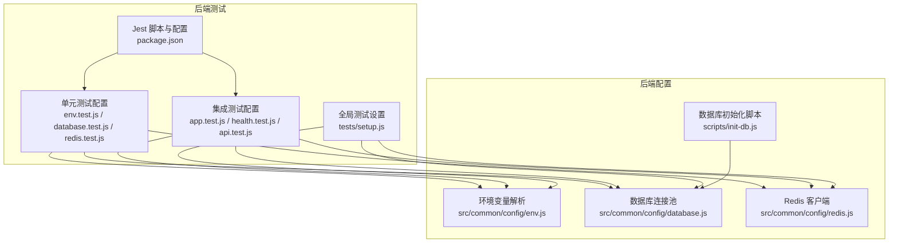
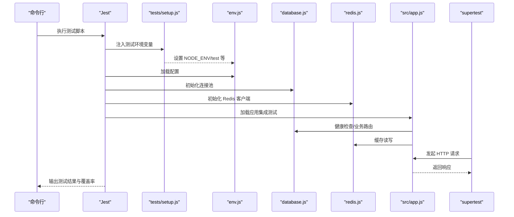
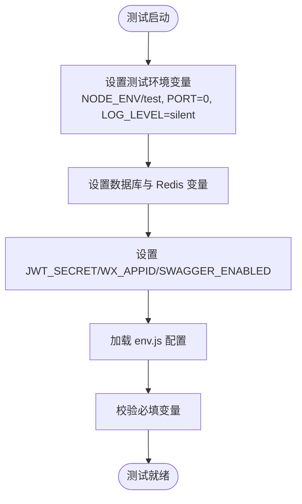
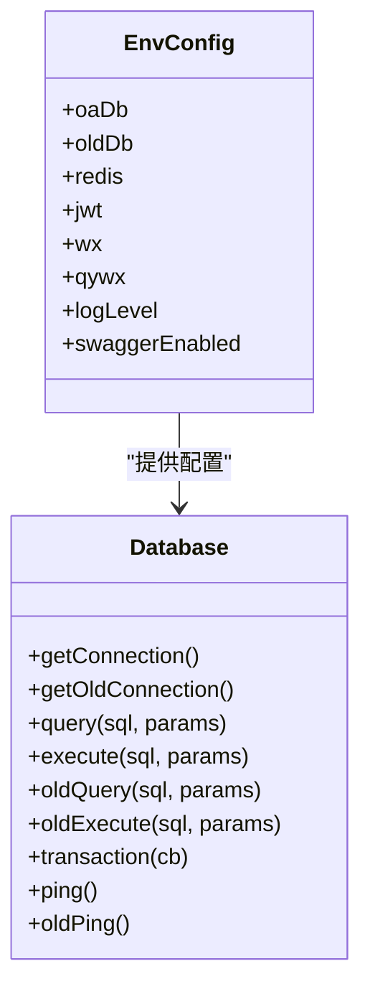
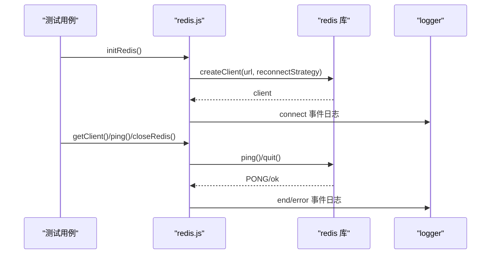
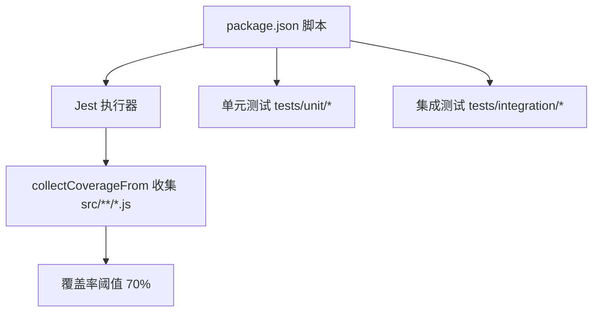
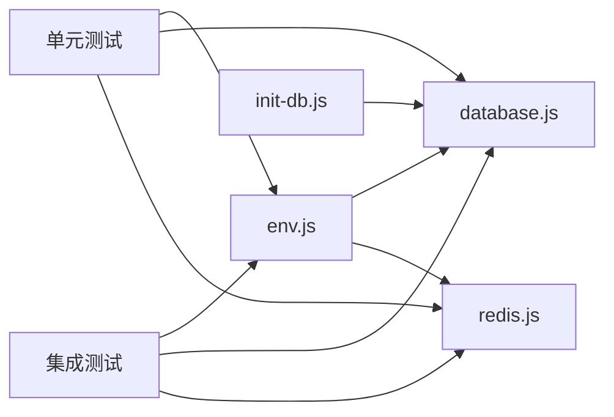

# 测试配置

<cite>
**本文引用的文件**
- [backend/package.json](file://backend/package.json)
- [backend/tests/setup.js](file://backend/tests/setup.js)
- [backend/src/common/config/env.js](file://backend/src/common/config/env.js)
- [backend/src/common/config/database.js](file://backend/src/common/config/database.js)
- [backend/src/common/config/redis.js](file://backend/src/common/config/redis.js)
- [backend/scripts/init-db.js](file://backend/scripts/init-db.js)
- [backend/tests/unit/config/database.test.js](file://backend/tests/unit/config/database.test.js)
- [backend/tests/unit/config/env.test.js](file://backend/tests/unit/config/env.test.js)
- [backend/tests/unit/config/redis.test.js](file://backend/tests/unit/config/redis.test.js)
- [backend/tests/integration/app.test.js](file://backend/tests/integration/app.test.js)
- [backend/tests/integration/health.test.js](file://backend/tests/integration/health.test.js)
- [backend/tests/integration/api.test.js](file://backend/tests/integration/api.test.js)
- [webapp/package.json](file://webapp/package.json)
- [webapp/eslint.config.js](file://webapp/eslint.config.js)
</cite>

## 目录
1. [引言](#引言)
2. [项目结构](#项目结构)
3. [核心组件](#核心组件)
4. [架构总览](#架构总览)
5. [详细组件分析](#详细组件分析)
6. [依赖关系分析](#依赖关系分析)
7. [性能考量](#性能考量)
8. [故障排查指南](#故障排查指南)
9. [结论](#结论)
10. [附录](#附录)

## 引言
本文件面向“智慧办公助手 OA 系统”的测试配置与实施，围绕测试环境变量、数据库与 Redis 的配置、Jest 测试框架配置、测试覆盖率与报告、测试数据管理（创建、种子与清理）、测试环境隔离策略，以及测试工具链（代码质量、静态分析、CI）进行系统化说明，并提供测试执行脚本与结果分析方法。

## 项目结构
后端采用 Node.js + Express 架构，测试位于 backend/tests 下，按单元测试与集成测试分层；配置集中在 backend/src/common/config 下；数据库初始化脚本位于 backend/scripts；前端测试位于 webapp/test（本仓库未包含具体前端测试文件，仅列出可用工具链）。

图表来源
- [backend/tests/unit/config/env.test.js:1-224](file://backend/tests/unit/config/env.test.js#L1-L224)
- [backend/tests/unit/config/database.test.js:1-266](file://backend/tests/unit/config/database.test.js#L1-L266)
- [backend/tests/unit/config/redis.test.js:1-212](file://backend/tests/unit/config/redis.test.js#L1-L212)
- [backend/tests/integration/app.test.js:1-101](file://backend/tests/integration/app.test.js#L1-L101)
- [backend/tests/integration/health.test.js:1-57](file://backend/tests/integration/health.test.js#L1-L57)
- [backend/tests/integration/api.test.js:1-34](file://backend/tests/integration/api.test.js#L1-L34)
- [backend/tests/setup.js:1-35](file://backend/tests/setup.js#L1-L35)
- [backend/package.json:1-58](file://backend/package.json#L1-L58)
- [backend/src/common/config/env.js:1-118](file://backend/src/common/config/env.js#L1-L118)
- [backend/src/common/config/database.js:1-222](file://backend/src/common/config/database.js#L1-L222)
- [backend/src/common/config/redis.js:1-101](file://backend/src/common/config/redis.js#L1-L101)
- [backend/scripts/init-db.js:1-374](file://backend/scripts/init-db.js#L1-L374)

章节来源
- [backend/package.json:1-58](file://backend/package.json#L1-L58)
- [backend/tests/setup.js:1-35](file://backend/tests/setup.js#L1-L35)
- [backend/src/common/config/env.js:1-118](file://backend/src/common/config/env.js#L1-L118)
- [backend/src/common/config/database.js:1-222](file://backend/src/common/config/database.js#L1-L222)
- [backend/src/common/config/redis.js:1-101](file://backend/src/common/config/redis.js#L1-L101)
- [backend/scripts/init-db.js:1-374](file://backend/scripts/init-db.js#L1-L374)

## 核心组件
- 测试环境变量与隔离
  - 通过 tests/setup.js 在所有测试前设置 NODE_ENV=test、端口为 0、日志级别为静默、数据库与 Redis 连接信息、JWT 密钥、微信 AppID、Swagger 开关等，确保测试环境与开发/生产隔离。
- 数据库配置
  - env.js 提供 OA 与旧版数据库的配置项与默认值校验；database.js 基于配置创建连接池、提供查询/执行/事务封装与连通性检测。
- Redis 配置
  - redis.js 基于 env.js 配置创建 Redis 客户端，包含事件监听、重连策略、连通性检测与生命周期管理。
- 测试框架与覆盖率
  - package.json 中配置 Jest 测试命令与覆盖率阈值，收集范围覆盖 src 下的 JS 文件（排除入口 app.js）。
- 数据库初始化与测试数据
  - init-db.js 提供建表脚本，可在测试前或本地初始化基础表；集成测试通过 supertest 访问健康检查与鉴权相关接口，验证安全头、CORS、限流与 404 等行为。

章节来源
- [backend/tests/setup.js:8-25](file://backend/tests/setup.js#L8-L25)
- [backend/src/common/config/env.js:13-44](file://backend/src/common/config/env.js#L13-L44)
- [backend/src/common/config/database.js:11-43](file://backend/src/common/config/database.js#L11-L43)
- [backend/src/common/config/redis.js:16-57](file://backend/src/common/config/redis.js#L16-L57)
- [backend/package.json:42-56](file://backend/package.json#L42-L56)
- [backend/scripts/init-db.js:18-322](file://backend/scripts/init-db.js#L18-L322)

## 架构总览
测试体系围绕“环境隔离 + 配置驱动 + 框架执行 + 工具链保障”展开，单元测试关注配置与组件行为，集成测试关注应用启动与路由行为。

图表来源
- [backend/tests/setup.js:27-34](file://backend/tests/setup.js#L27-L34)
- [backend/src/common/config/env.js:34-44](file://backend/src/common/config/env.js#L34-L44)
- [backend/src/common/config/database.js:11-43](file://backend/src/common/config/database.js#L11-L43)
- [backend/src/common/config/redis.js:16-57](file://backend/src/common/config/redis.js#L16-L57)
- [backend/tests/integration/app.test.js:12-32](file://backend/tests/integration/app.test.js#L12-L32)

## 详细组件分析

### 测试环境变量与隔离
- 全局设置
  - 在 tests/setup.js 中设置 NODE_ENV=test、PORT=0、LOG_LEVEL=silent、OA_DB_*、OLD_DB_*、REDIS_*、JWT_SECRET、WX_APPID、SWAGGER_ENABLED 等，保证测试期间不输出日志、随机端口避免冲突、数据库与缓存指向测试实例。
- 单元测试中的环境变量覆盖
  - env.test.js 通过 mock dotenv.config 并手动注入 REQUIRED_ENV_VARS，验证必填项缺失时抛错、默认值兜底、可选配置覆盖与环境判断逻辑。
- 集成测试中的环境注入
  - app.test.js、health.test.js、api.test.js 在 describe 顶部设置测试环境变量，确保每次测试前环境一致。

图表来源
- [backend/tests/setup.js:8-25](file://backend/tests/setup.js#L8-L25)
- [backend/tests/unit/config/env.test.js:28-32](file://backend/tests/unit/config/env.test.js#L28-L32)
- [backend/tests/integration/app.test.js:5-11](file://backend/tests/integration/app.test.js#L5-L11)

章节来源
- [backend/tests/setup.js:8-25](file://backend/tests/setup.js#L8-L25)
- [backend/tests/unit/config/env.test.js:174-194](file://backend/tests/unit/config/env.test.js#L174-L194)
- [backend/tests/integration/app.test.js:5-11](file://backend/tests/integration/app.test.js#L5-L11)

### 数据库连接与测试数据管理
- 连接池与方法
  - database.js 基于 env.js 的 oaDb/oldDb 配置创建连接池，提供 query/execute/oldQuery/oldExecute/transaction/ping/oldPing 等方法；单元测试通过 mock mysql2/promise 与 logger，验证连接获取、SQL 执行、错误日志与事务提交/回滚。
- 测试数据创建与清理
  - 使用 init-db.js 在测试前创建基础表；建议在 tests/setup.js 中增加事务回滚或 truncate 清理策略，或在每个测试用例后执行清理脚本，确保测试隔离与可重复性。
- 连接池参数
  - 支持自定义池大小与连接超时等参数，默认池大小与字符集、时区等已在配置中设定。

图表来源
- [backend/src/common/config/env.js:50-115](file://backend/src/common/config/env.js#L50-L115)
- [backend/src/common/config/database.js:11-221](file://backend/src/common/config/database.js#L11-L221)

章节来源
- [backend/src/common/config/database.js:11-221](file://backend/src/common/config/database.js#L11-L221)
- [backend/tests/unit/config/database.test.js:25-35](file://backend/tests/unit/config/database.test.js#L25-L35)
- [backend/scripts/init-db.js:18-322](file://backend/scripts/init-db.js#L18-L322)

### Redis 缓存配置与测试
- 客户端初始化
  - redis.js 基于 env.js 的 redis 配置创建客户端，支持带/不带密码的连接 URL、事件监听（connect/error/end）、重连策略（最多 10 次）与 ping 检测。
- 单元测试覆盖
  - redis.test.js 通过 mock redis.createClient 与 logger，验证 initRedis/getClient/closeRedis/ping 的行为与事件日志。

图表来源
- [backend/src/common/config/redis.js:16-99](file://backend/src/common/config/redis.js#L16-L99)
- [backend/tests/unit/config/redis.test.js:60-156](file://backend/tests/unit/config/redis.test.js#L60-L156)

章节来源
- [backend/src/common/config/redis.js:16-99](file://backend/src/common/config/redis.js#L16-L99)
- [backend/tests/unit/config/redis.test.js:60-156](file://backend/tests/unit/config/redis.test.js#L60-L156)

### 测试框架配置与覆盖率
- Jest 脚本
  - package.json 定义 test/test:unit/test:integration/lint 等脚本，其中 test 调用 jest --coverage。
- 覆盖率与收集范围
  - jest 配置 collectCoverageFrom 包含 src/**/*.js 并排除 src/app.js；覆盖率阈值 global 分支/函数/行/语句均为 70%。
- 单元/集成测试组织
  - tests/unit 与 tests/integration 分层清晰，分别验证配置、组件与应用启动、路由行为。

图表来源
- [backend/package.json:6-14](file://backend/package.json#L6-L14)
- [backend/package.json:42-56](file://backend/package.json#L42-L56)

章节来源
- [backend/package.json:6-14](file://backend/package.json#L6-L14)
- [backend/package.json:42-56](file://backend/package.json#L42-L56)

### 测试数据管理实施方案
- 测试数据库创建
  - 使用 init-db.js 在测试前创建基础表，确保测试具备稳定的数据结构。
- 种子数据加载
  - 建议在 tests/setup.js 中增加 seed 数据插入逻辑（如用户、部门、审批类型等），或在数据库层提供 seed 脚本并在测试前执行。
- 测试数据清理
  - 在每个测试用例后执行 truncate 或删除对应表数据；或在事务中执行，结束后回滚，确保测试间无副作用。
- 数据隔离
  - 为测试数据库使用独立库名与账号，避免与开发/生产混用。

章节来源
- [backend/scripts/init-db.js:327-374](file://backend/scripts/init-db.js#L327-L374)
- [backend/tests/setup.js:27-34](file://backend/tests/setup.js#L27-L34)

### 测试环境隔离策略
- 环境变量隔离
  - tests/setup.js 与各测试文件显式设置 NODE_ENV/test、端口、日志级别、数据库与 Redis 连接、JWT 与微信配置，确保与开发/生产环境完全隔离。
- 配置校验
  - env.js 在启动时校验 REQUIRED_VARS，测试环境同样适用，缺失变量会直接报错，防止误用。

章节来源
- [backend/tests/setup.js:8-25](file://backend/tests/setup.js#L8-L25)
- [backend/src/common/config/env.js:13-44](file://backend/src/common/config/env.js#L13-L44)

### 测试工具链与持续集成
- 后端工具链
  - ESLint 与 Jest 已在 backend/package.json 中配置；建议在 CI 中执行 npm run lint 与 npm run test。
- 前端工具链
  - webapp/package.json 提供 lint/format/type-check 等脚本；eslint.config.js 配置了 Vue/TS 规则与忽略目录，可作为前端测试与质量保障参考。

章节来源
- [backend/package.json:6-14](file://backend/package.json#L6-L14)
- [webapp/package.json:6-14](file://webapp/package.json#L6-L14)
- [webapp/eslint.config.js:1-38](file://webapp/eslint.config.js#L1-L38)

### 测试执行脚本与结果分析
- 执行脚本
  - 使用 npm run test 执行全部测试并生成覆盖率；使用 npm run test:unit 与 npm run test:integration 分别执行单元与集成测试。
- 结果分析
  - 关注覆盖率阈值（70%）与未覆盖分支；结合单元测试对配置、数据库与 Redis 的行为验证，集成测试对健康检查、CORS、安全头与鉴权失败场景的验证，定位问题并补充用例。

章节来源
- [backend/package.json:9-11](file://backend/package.json#L9-L11)
- [backend/tests/integration/health.test.js:14-38](file://backend/tests/integration/health.test.js#L14-L38)
- [backend/tests/integration/app.test.js:14-32](file://backend/tests/integration/app.test.js#L14-L32)
- [backend/tests/integration/api.test.js:12-33](file://backend/tests/integration/api.test.js#L12-L33)

## 依赖关系分析
- 测试对配置的依赖
  - 单元测试通过 mock env.js 与数据库/Redis 库，验证配置解析与组件行为；集成测试依赖 env.js 提供的配置加载与数据库/Redis 连接。
- 配置对环境变量的依赖
  - env.js 严格校验 REQUIRED_VARS，database.js/redis.js 依赖 env.js 的配置项；init-db.js 依赖 .env 与 env.js 的数据库配置。

图表来源
- [backend/src/common/config/env.js:34-44](file://backend/src/common/config/env.js#L34-L44)
- [backend/src/common/config/database.js:4-5](file://backend/src/common/config/database.js#L4-L5)
- [backend/src/common/config/redis.js:4-5](file://backend/src/common/config/redis.js#L4-L5)
- [backend/scripts/init-db.js:13-15](file://backend/scripts/init-db.js#L13-L15)
- [backend/tests/unit/config/env.test.js:4-6](file://backend/tests/unit/config/env.test.js#L4-L6)
- [backend/tests/unit/config/database.test.js:25-35](file://backend/tests/unit/config/database.test.js#L25-L35)
- [backend/tests/unit/config/redis.test.js:19-22](file://backend/tests/unit/config/redis.test.js#L19-L22)

章节来源
- [backend/src/common/config/env.js:34-44](file://backend/src/common/config/env.js#L34-L44)
- [backend/src/common/config/database.js:4-5](file://backend/src/common/config/database.js#L4-L5)
- [backend/src/common/config/redis.js:4-5](file://backend/src/common/config/redis.js#L4-L5)
- [backend/scripts/init-db.js:13-15](file://backend/scripts/init-db.js#L13-L15)

## 性能考量
- 测试并发与资源
  - 单元测试通过 mock 减少真实 I/O；集成测试建议控制并发，避免数据库/Redis 连接争用。
- 连接池与重连
  - database.js/redis.js 的连接池与重连策略在测试中保持默认，确保稳定性；如需模拟异常，可通过 mock 或外部服务状态控制。
- 覆盖率与性能平衡
  - 覆盖率阈值 70% 适中，建议优先补齐关键路径与边界条件，避免过度追求覆盖率导致测试执行时间过长。

## 故障排查指南
- 环境变量缺失
  - env.js 在启动时校验 REQUIRED_VARS，若测试中缺失变量会抛错；检查 tests/setup.js 与各测试文件的环境注入是否完整。
- 数据库连接失败
  - database.js 的 query/execute/oldQuery/oldExecute 在异常时记录错误日志；检查 OA_DB_* 与 OLD_DB_* 配置与网络可达性。
- Redis 连接失败
  - redis.js 的 ping 与事件日志可用于诊断；检查 REDIS_* 配置与服务状态。
- 集成测试 404/鉴权失败
  - app.test.js/health.test.js/api.test.js 验证路由与鉴权行为；确认路由是否存在、鉴权中间件是否生效、CORS 与安全头是否正确设置。

章节来源
- [backend/src/common/config/env.js:34-44](file://backend/src/common/config/env.js#L34-L44)
- [backend/src/common/config/database.js:66-83](file://backend/src/common/config/database.js#L66-L83)
- [backend/src/common/config/redis.js:85-93](file://backend/src/common/config/redis.js#L85-L93)
- [backend/tests/integration/app.test.js:14-32](file://backend/tests/integration/app.test.js#L14-L32)
- [backend/tests/integration/health.test.js:14-38](file://backend/tests/integration/health.test.js#L14-L38)
- [backend/tests/integration/api.test.js:12-33](file://backend/tests/integration/api.test.js#L12-L33)

## 结论
本测试配置以环境隔离为核心，通过 env.js 统一配置入口、database.js/redis.js 提供稳定的数据库与缓存能力，并以 Jest 与覆盖率阈值保障质量。配合 init-db.js 的数据库初始化与 tests/setup.js 的环境注入，形成从配置到执行再到清理的闭环。建议在现有基础上完善测试数据的种子与清理策略，并在 CI 中统一执行 lint 与 test，持续提升测试效率与系统稳定性。

## 附录
- 建议的测试数据管理清单
  - 基础表：users、departments、approval_types、approval_instances、approval_flow_nodes、daily_reports、messages、announcements、projects、tasks、assets、operation_logs、system_config
  - 种子数据：管理员、普通用户、部门、审批类型、项目与任务等
  - 清理策略：每个用例后 truncate 对应表或在事务中回滚
- 前端测试工具链参考
  - webapp/package.json 与 eslint.config.js 提供 lint/format/type-check 等脚本与规则，可作为前端测试与质量保障参考

章节来源
- [backend/scripts/init-db.js:18-322](file://backend/scripts/init-db.js#L18-L322)
- [webapp/package.json:6-14](file://webapp/package.json#L6-L14)
- [webapp/eslint.config.js:1-38](file://webapp/eslint.config.js#L1-L38)