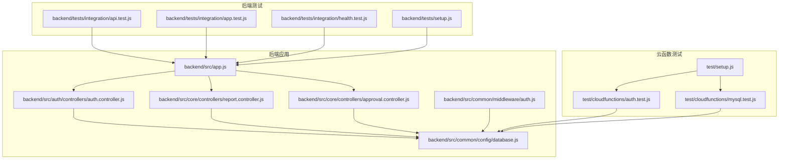
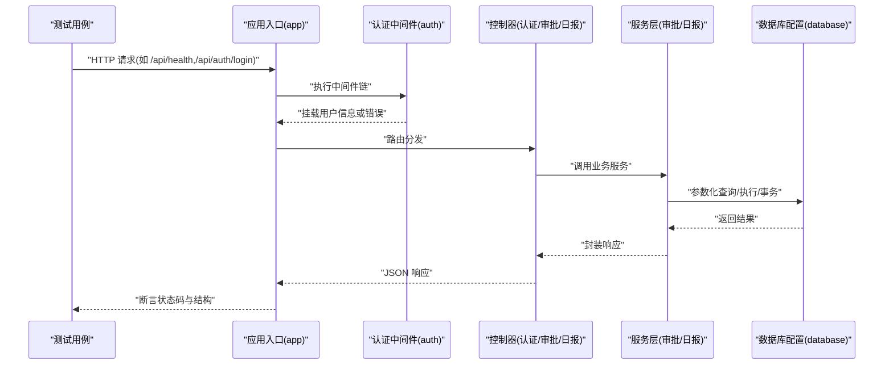
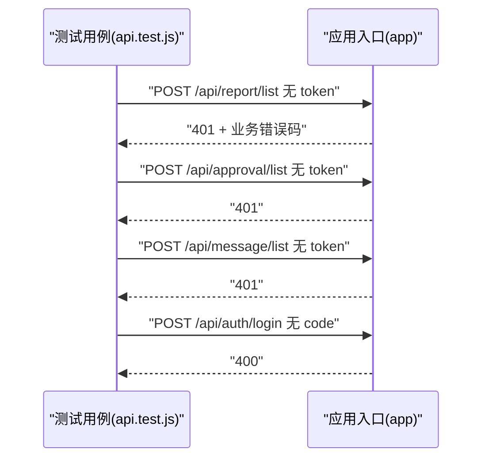
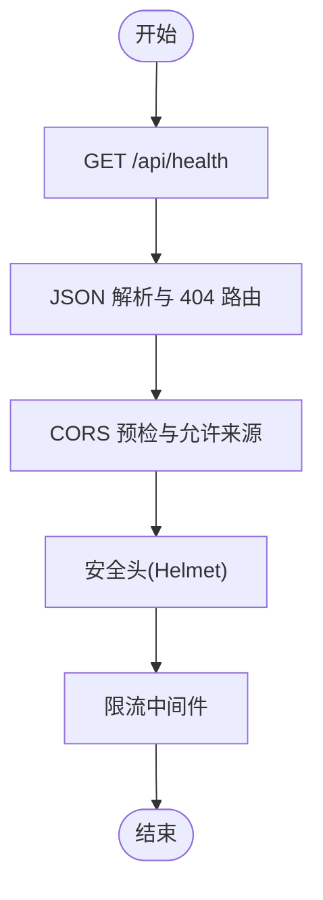
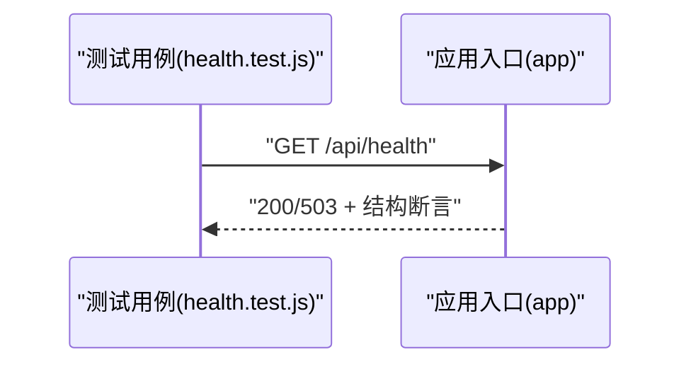
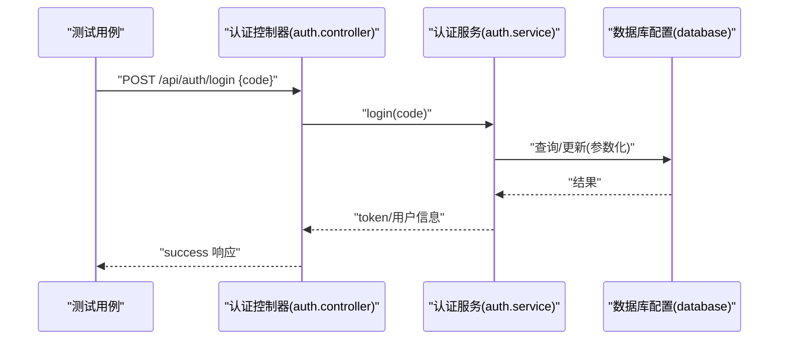
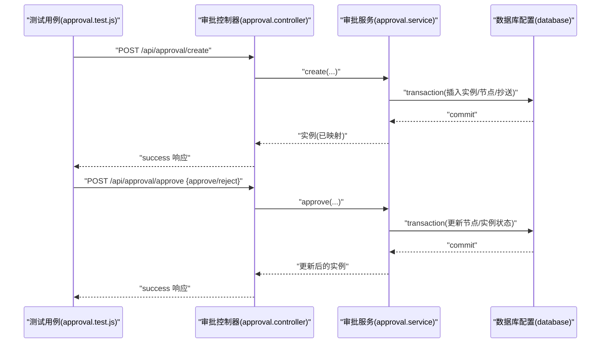
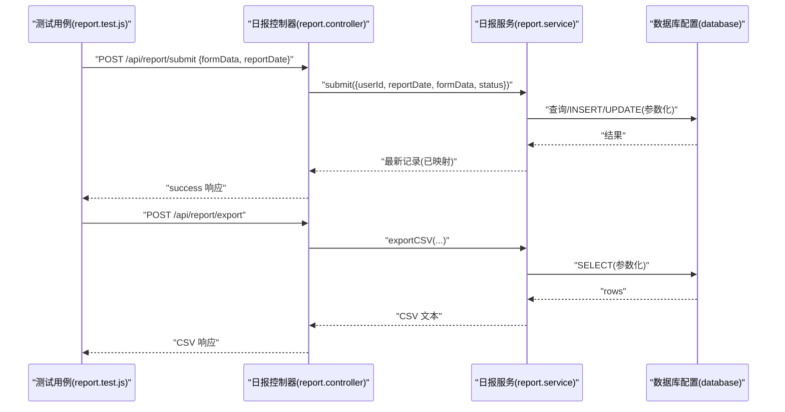
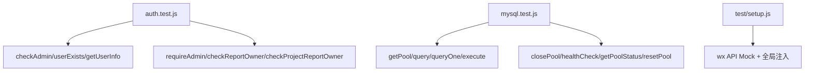
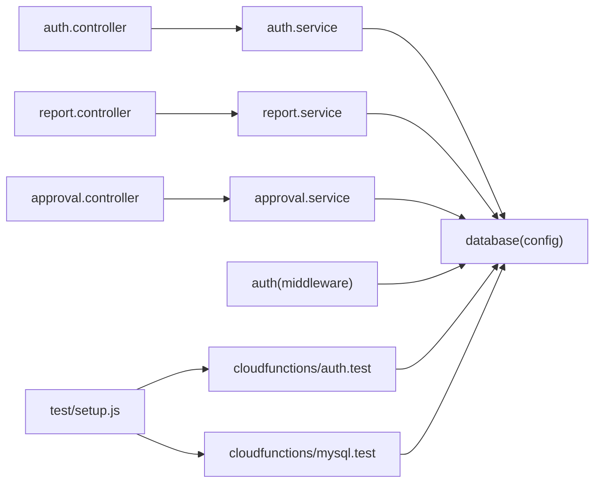

# 集成测试

<cite>
**本文引用的文件**
- [backend/tests/integration/api.test.js](file://backend/tests/integration/api.test.js)
- [backend/tests/integration/app.test.js](file://backend/tests/integration/app.test.js)
- [backend/tests/integration/health.test.js](file://backend/tests/integration/health.test.js)
- [backend/tests/setup.js](file://backend/tests/setup.js)
- [backend/src/app.js](file://backend/src/app.js)
- [backend/src/auth/controllers/auth.controller.js](file://backend/src/auth/controllers/auth.controller.js)
- [backend/src/core/controllers/report.controller.js](file://backend/src/core/controllers/report.controller.js)
- [backend/src/core/controllers/approval.controller.js](file://backend/src/core/controllers/approval.controller.js)
- [backend/src/core/services/report.service.js](file://backend/src/core/services/report.service.js)
- [backend/src/core/services/approval.service.js](file://backend/src/core/services/approval.service.js)
- [backend/src/common/config/database.js](file://backend/src/common/config/database.js)
- [backend/src/common/middleware/auth.js](file://backend/src/common/middleware/auth.js)
- [test/cloudfunctions/auth.test.js](file://test/cloudfunctions/auth.test.js)
- [test/cloudfunctions/mysql.test.js](file://test/cloudfunctions/mysql.test.js)
- [test/setup.js](file://test/setup.js)
</cite>

## 目录
1. [引言](#引言)
2. [项目结构](#项目结构)
3. [核心组件](#核心组件)
4. [架构总览](#架构总览)
5. [详细组件分析](#详细组件分析)
6. [依赖分析](#依赖分析)
7. [性能考虑](#性能考虑)
8. [故障排查指南](#故障排查指南)
9. [结论](#结论)
10. [附录](#附录)

## 引言
本文件面向“智慧办公助手 OA 系统”的集成测试，目标是提供一套可落地的测试策略与实施指南，覆盖：
- API 接口测试：认证、审批、日报等核心业务接口的端到端验证
- 应用启动测试：中间件、CORS、JSON 解析、404 路由、限流等基础设施验证
- 健康检查测试：后端服务与数据库、缓存的连通性与响应结构一致性
- 云函数测试：微信云函数的权限校验与 MySQL 连接池测试
- 测试数据管理与事务处理：数据库事务、隔离与回滚策略
- 测试环境配置最佳实践：环境变量、Mock 与全局初始化
- 故障诊断与调试：常见问题定位与修复建议

## 项目结构
本项目采用前后端分离与多测试套件并行的组织方式：
- 后端 Node.js 应用位于 backend，包含路由、控制器、服务层与通用配置
- 测试分为 backend/tests（后端集成/单元测试）与 test（云函数与小程序测试）
- 云函数相关测试位于 test/cloudfunctions，覆盖权限与数据库连接

**图表来源**
- [backend/tests/integration/api.test.js:1-34](file://backend/tests/integration/api.test.js#L1-L34)
- [backend/tests/integration/app.test.js:1-101](file://backend/tests/integration/app.test.js#L1-L101)
- [backend/tests/integration/health.test.js:1-57](file://backend/tests/integration/health.test.js#L1-L57)
- [backend/tests/setup.js:1-35](file://backend/tests/setup.js#L1-L35)
- [backend/src/app.js](file://backend/src/app.js)
- [backend/src/auth/controllers/auth.controller.js:1-162](file://backend/src/auth/controllers/auth.controller.js#L1-L162)
- [backend/src/core/controllers/report.controller.js:1-172](file://backend/src/core/controllers/report.controller.js#L1-L172)
- [backend/src/core/controllers/approval.controller.js:1-138](file://backend/src/core/controllers/approval.controller.js#L1-L138)
- [backend/src/common/config/database.js:1-222](file://backend/src/common/config/database.js#L1-L222)
- [backend/src/common/middleware/auth.js:1-83](file://backend/src/common/middleware/auth.js#L1-L83)
- [test/cloudfunctions/auth.test.js:1-209](file://test/cloudfunctions/auth.test.js#L1-L209)
- [test/cloudfunctions/mysql.test.js:1-187](file://test/cloudfunctions/mysql.test.js#L1-L187)
- [test/setup.js:1-45](file://test/setup.js#L1-L45)

**章节来源**
- [backend/tests/integration/api.test.js:1-34](file://backend/tests/integration/api.test.js#L1-L34)
- [backend/tests/integration/app.test.js:1-101](file://backend/tests/integration/app.test.js#L1-L101)
- [backend/tests/integration/health.test.js:1-57](file://backend/tests/integration/health.test.js#L1-L57)
- [backend/tests/setup.js:1-35](file://backend/tests/setup.js#L1-L35)
- [test/cloudfunctions/auth.test.js:1-209](file://test/cloudfunctions/auth.test.js#L1-L209)
- [test/cloudfunctions/mysql.test.js:1-187](file://test/cloudfunctions/mysql.test.js#L1-L187)
- [test/setup.js:1-45](file://test/setup.js#L1-L45)

## 核心组件
- 应用启动与中间件：验证安全头、CORS、JSON 解析、404 路由与限流
- 健康检查：统一响应结构、数据库/缓存连通性
- 认证与授权：JWT 校验、用户状态与角色同步
- 核心业务 API：认证登录、审批流程、日报提交/草稿/导出
- 数据库层：连接池、事务、参数化查询与执行
- 云函数权限与数据库：权限校验、连接池查询与健康检查

**章节来源**
- [backend/tests/integration/app.test.js:14-100](file://backend/tests/integration/app.test.js#L14-L100)
- [backend/tests/integration/health.test.js:14-56](file://backend/tests/integration/health.test.js#L14-L56)
- [backend/src/common/middleware/auth.js:14-56](file://backend/src/common/middleware/auth.js#L14-L56)
- [backend/src/auth/controllers/auth.controller.js:16-88](file://backend/src/auth/controllers/auth.controller.js#L16-L88)
- [backend/src/core/controllers/approval.controller.js:15-122](file://backend/src/core/controllers/approval.controller.js#L15-L122)
- [backend/src/core/controllers/report.controller.js:14-169](file://backend/src/core/controllers/report.controller.js#L14-L169)
- [backend/src/common/config/database.js:11-221](file://backend/src/common/config/database.js#L11-L221)
- [test/cloudfunctions/auth.test.js:29-207](file://test/cloudfunctions/auth.test.js#L29-L207)
- [test/cloudfunctions/mysql.test.js:26-185](file://test/cloudfunctions/mysql.test.js#L26-L185)

## 架构总览
下图展示了集成测试的关键交互：测试驱动 Supertest 发起 HTTP 请求，经由应用入口与中间件，到达控制器与服务层，最终访问数据库层。

**图表来源**
- [backend/src/app.js](file://backend/src/app.js)
- [backend/src/common/middleware/auth.js:14-56](file://backend/src/common/middleware/auth.js#L14-L56)
- [backend/src/auth/controllers/auth.controller.js:16-88](file://backend/src/auth/controllers/auth.controller.js#L16-L88)
- [backend/src/core/controllers/approval.controller.js:15-122](file://backend/src/core/controllers/approval.controller.js#L15-L122)
- [backend/src/core/controllers/report.controller.js:14-169](file://backend/src/core/controllers/report.controller.js#L14-L169)
- [backend/src/common/config/database.js:65-109](file://backend/src/common/config/database.js#L65-L109)

## 详细组件分析

### API 接口测试策略
- 目标：验证未登录访问受保护路由返回 401；未提供必要参数返回 400
- 关键点：使用 supertest 直连应用入口，避免外部依赖
- 示例断言：状态码、业务错误码、响应体结构

**图表来源**
- [backend/tests/integration/api.test.js:13-32](file://backend/tests/integration/api.test.js#L13-L32)
- [backend/src/app.js](file://backend/src/app.js)

**章节来源**
- [backend/tests/integration/api.test.js:1-34](file://backend/tests/integration/api.test.js#L1-L34)

### 应用启动与基础设施测试
- 中间件：安全头、CORS、JSON 解析、404 路由、限流
- 断言：Content-Type、CORS 头、无效 JSON 返回 400、未定义路由返回 404 且结构一致

**图表来源**
- [backend/tests/integration/app.test.js:15-99](file://backend/tests/integration/app.test.js#L15-L99)

**章节来源**
- [backend/tests/integration/app.test.js:1-101](file://backend/tests/integration/app.test.js#L1-L101)

### 健康检查测试
- 断言：响应结构、data 字段完整性、checks 子结构、时间戳与版本格式、uptime 正数
- 场景：DB/Redis 未运行时返回 503（降级），均正常时返回 200

**图表来源**
- [backend/tests/integration/health.test.js:15-55](file://backend/tests/integration/health.test.js#L15-L55)
- [backend/src/app.js](file://backend/src/app.js)

**章节来源**
- [backend/tests/integration/health.test.js:1-57](file://backend/tests/integration/health.test.js#L1-L57)

### 认证接口与授权中间件
- 登录：校验必填参数，调用服务层完成登录流程
- 授权：JWT 校验、用户状态与角色同步、角色白名单校验
- 事务：服务层对涉及多表写入的操作使用事务保证一致性

**图表来源**
- [backend/src/auth/controllers/auth.controller.js:16-29](file://backend/src/auth/controllers/auth.controller.js#L16-L29)
- [backend/src/common/config/database.js:65-109](file://backend/src/common/config/database.js#L65-L109)

**章节来源**
- [backend/src/auth/controllers/auth.controller.js:16-88](file://backend/src/auth/controllers/auth.controller.js#L16-L88)
- [backend/src/common/middleware/auth.js:14-56](file://backend/src/common/middleware/auth.js#L14-L56)

### 审批接口端到端测试
- 列表/详情/创建/审批：参数兼容、tab/status 映射、action 映射
- 事务：创建审批与流转、驳回与完成状态更新
- 权限：仅当前审批人可操作，非当前审批人禁止

**图表来源**
- [backend/src/core/controllers/approval.controller.js:74-122](file://backend/src/core/controllers/approval.controller.js#L74-L122)
- [backend/src/core/services/approval.service.js:195-256](file://backend/src/core/services/approval.service.js#L195-L256)
- [backend/src/common/config/database.js:168-181](file://backend/src/common/config/database.js#L168-L181)

**章节来源**
- [backend/src/core/controllers/approval.controller.js:15-122](file://backend/src/core/controllers/approval.controller.js#L15-L122)
- [backend/src/core/services/approval.service.js:195-356](file://backend/src/core/services/approval.service.js#L195-L356)

### 日报接口端到端测试
- 列表/详情/提交/草稿/删除/导出：参数校验、状态约束、字段映射
- 事务：导出 CSV 与统计看板基于查询聚合
- 数据一致性：提交/草稿更新与插入逻辑、删除权限控制

**图表来源**
- [backend/src/core/controllers/report.controller.js:56-169](file://backend/src/core/controllers/report.controller.js#L56-L169)
- [backend/src/core/services/report.service.js:189-280](file://backend/src/core/services/report.service.js#L189-L280)
- [backend/src/common/config/database.js:65-109](file://backend/src/common/config/database.js#L65-L109)

**章节来源**
- [backend/src/core/controllers/report.controller.js:14-169](file://backend/src/core/controllers/report.controller.js#L14-L169)
- [backend/src/core/services/report.service.js:105-280](file://backend/src/core/services/report.service.js#L105-L280)

### 云函数测试指南
- 权限校验：管理员/用户存在/日报/项目日报归属校验，Mock 数据库查询
- MySQL 连接池：getPool/query/execute/closePool/resetPool/healthCheck/getPoolStatus
- 小程序 API Mock：wx.setStorageSync/getStorageSync/removeStorageSync/request 等

**图表来源**
- [test/cloudfunctions/auth.test.js:29-207](file://test/cloudfunctions/auth.test.js#L29-L207)
- [test/cloudfunctions/mysql.test.js:26-185](file://test/cloudfunctions/mysql.test.js#L26-L185)
- [test/setup.js:5-25](file://test/setup.js#L5-L25)

**章节来源**
- [test/cloudfunctions/auth.test.js:1-209](file://test/cloudfunctions/auth.test.js#L1-L209)
- [test/cloudfunctions/mysql.test.js:1-187](file://test/cloudfunctions/mysql.test.js#L1-L187)
- [test/setup.js:1-45](file://test/setup.js#L1-L45)

## 依赖分析
- 控制器依赖服务层，服务层依赖数据库配置与错误类型
- 认证中间件依赖 JWT 与数据库进行用户状态校验
- 云函数测试依赖数据库连接池 Mock 与小程序 API Mock

**图表来源**
- [backend/src/auth/controllers/auth.controller.js:1-162](file://backend/src/auth/controllers/auth.controller.js#L1-L162)
- [backend/src/core/controllers/report.controller.js:1-172](file://backend/src/core/controllers/report.controller.js#L1-L172)
- [backend/src/core/controllers/approval.controller.js:1-138](file://backend/src/core/controllers/approval.controller.js#L1-L138)
- [backend/src/core/services/report.service.js:1-414](file://backend/src/core/services/report.service.js#L1-L414)
- [backend/src/core/services/approval.service.js:1-359](file://backend/src/core/services/approval.service.js#L1-L359)
- [backend/src/common/config/database.js:1-222](file://backend/src/common/config/database.js#L1-L222)
- [backend/src/common/middleware/auth.js:1-83](file://backend/src/common/middleware/auth.js#L1-L83)
- [test/cloudfunctions/auth.test.js:1-209](file://test/cloudfunctions/auth.test.js#L1-L209)
- [test/cloudfunctions/mysql.test.js:1-187](file://test/cloudfunctions/mysql.test.js#L1-L187)
- [test/setup.js:1-45](file://test/setup.js#L1-L45)

**章节来源**
- [backend/src/auth/controllers/auth.controller.js:1-162](file://backend/src/auth/controllers/auth.controller.js#L1-L162)
- [backend/src/core/controllers/report.controller.js:1-172](file://backend/src/core/controllers/report.controller.js#L1-L172)
- [backend/src/core/controllers/approval.controller.js:1-138](file://backend/src/core/controllers/approval.controller.js#L1-L138)
- [backend/src/core/services/report.service.js:1-414](file://backend/src/core/services/report.service.js#L1-L414)
- [backend/src/core/services/approval.service.js:1-359](file://backend/src/core/services/approval.service.js#L1-L359)
- [backend/src/common/config/database.js:1-222](file://backend/src/common/config/database.js#L1-L222)
- [backend/src/common/middleware/auth.js:1-83](file://backend/src/common/middleware/auth.js#L1-L83)
- [test/cloudfunctions/auth.test.js:1-209](file://test/cloudfunctions/auth.test.js#L1-L209)
- [test/cloudfunctions/mysql.test.js:1-187](file://test/cloudfunctions/mysql.test.js#L1-L187)
- [test/setup.js:1-45](file://test/setup.js#L1-L45)

## 性能考虑
- 连接池参数：最大连接数、等待队列、保活与字符集设置
- 查询优化：参数化 SQL、索引覆盖、分页与 LIMIT
- 事务边界：最小化事务持有时间，避免长事务锁竞争
- 健康检查：轻量查询与状态聚合，避免阻塞主业务

[本节为通用指导，无需列出具体文件来源]

## 故障排查指南
- 401 未认证：检查 Authorization 头格式与 JWT 秘钥配置
- 403 权限不足：确认用户角色与 requireRole 白名单
- 400 参数错误：校验必填字段与参数映射（审批 action/tab/status）
- 404 路由：确认路由注册与静态资源处理
- 数据库异常：检查连接池状态、事务回滚与参数化占位符
- 云函数权限失败：核对 Mock 数据库返回值与 openid/用户状态

**章节来源**
- [backend/src/common/middleware/auth.js:14-80](file://backend/src/common/middleware/auth.js#L14-L80)
- [backend/tests/integration/api.test.js:13-32](file://backend/tests/integration/api.test.js#L13-L32)
- [backend/tests/integration/app.test.js:69-92](file://backend/tests/integration/app.test.js#L69-L92)
- [backend/src/common/config/database.js:168-181](file://backend/src/common/config/database.js#L168-L181)
- [test/cloudfunctions/auth.test.js:118-147](file://test/cloudfunctions/auth.test.js#L118-L147)

## 结论
通过上述测试策略与实施指南，可系统性地验证 OA 系统在认证、审批、日报等核心业务上的端到端行为，同时覆盖应用启动、健康检查与云函数场景。配合数据库事务与 Mock 策略，能够在隔离环境中稳定复现并定位问题，保障系统整体功能与性能的可靠性。

[本节为总结性内容，无需列出具体文件来源]

## 附录
- 测试环境变量建议：NODE_ENV=test、LOG_LEVEL=silent、JWT_SECRET、WX_APPID、SWAGGER_ENABLED=false、数据库与 Redis 连接参数
- 数据库事务最佳实践：将多表写入封装在事务中，异常时自动回滚
- 云函数 Mock：使用 jest.mock 替换 mysql2/promise，模拟 execute/end 等方法

**章节来源**
- [backend/tests/setup.js:8-24](file://backend/tests/setup.js#L8-L24)
- [backend/src/common/config/database.js:168-181](file://backend/src/common/config/database.js#L168-L181)
- [test/cloudfunctions/mysql.test.js:14-17](file://test/cloudfunctions/mysql.test.js#L14-L17)