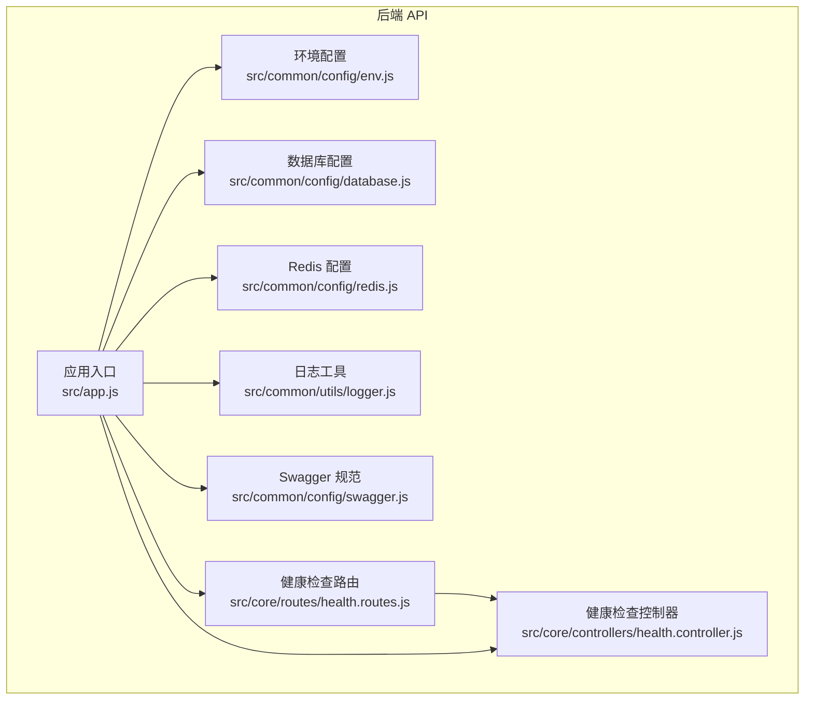
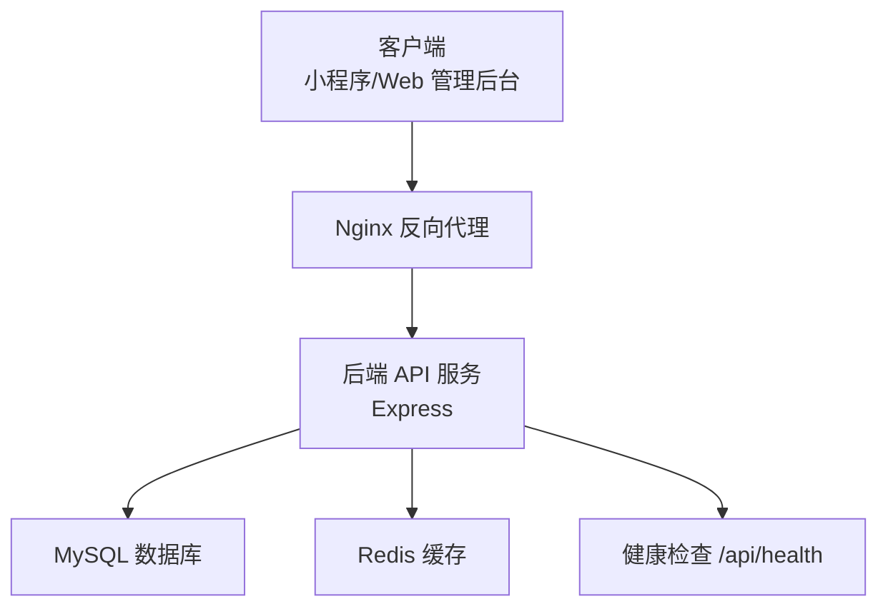
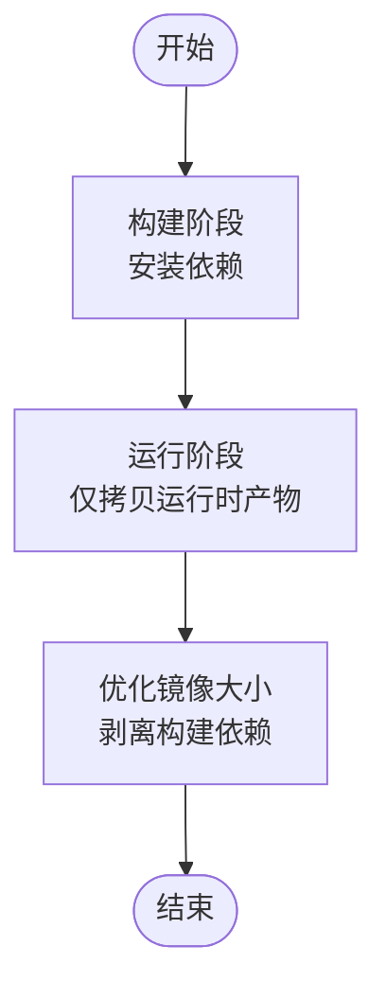
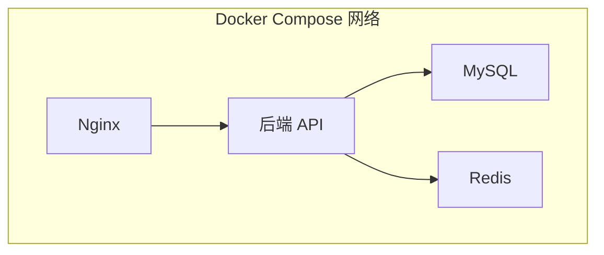
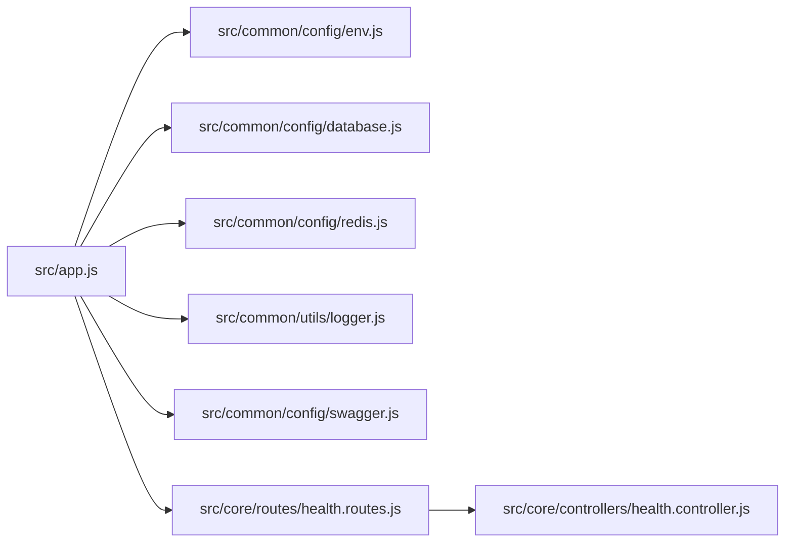

# Docker 容器化部署

<cite>
**本文引用的文件**
- [backend/package.json](file://backend/package.json)
- [backend/src/app.js](file://backend/src/app.js)
- [backend/src/common/config/env.js](file://backend/src/common/config/env.js)
- [backend/src/common/config/database.js](file://backend/src/common/config/database.js)
- [backend/src/common/config/redis.js](file://backend/src/common/config/redis.js)
- [backend/src/common/utils/logger.js](file://backend/src/common/utils/logger.js)
- [backend/src/common/config/swagger.js](file://backend/src/common/config/swagger.js)
- [backend/src/core/routes/health.routes.js](file://backend/src/core/routes/health.routes.js)
- [backend/src/core/controllers/health.controller.js](file://backend/src/core/controllers/health.controller.js)
- [backend/.gitignore](file://backend/.gitignore)
</cite>

## 目录
1. [简介](#简介)
2. [项目结构](#项目结构)
3. [核心组件](#核心组件)
4. [架构总览](#架构总览)
5. [详细组件分析](#详细组件分析)
6. [依赖关系分析](#依赖关系分析)
7. [性能考量](#性能考量)
8. [故障排查指南](#故障排查指南)
9. [结论](#结论)
10. [附录](#附录)

## 简介
本文件面向“智慧办公助手 OA 系统”的容器化部署，围绕后端 API 服务提供从 Dockerfile 编写、多阶段构建、Docker Compose 编排到容器网络、数据卷、环境变量、监控与日志、健康检查以及生产最佳实践与故障排查的完整方案。文档以仓库现有代码为依据，确保方案可落地、可复现。

## 项目结构
后端 API 服务采用 Node.js + Express 架构，通过统一配置模块读取环境变量，连接 MySQL 与 Redis，并内置健康检查与日志能力。前端包含 Vue Web 管理后台与小程序工程，但本文聚焦后端 API 的容器化部署。

**图表来源**
- [backend/src/app.js:1-207](file://backend/src/app.js#L1-L207)
- [backend/src/common/config/env.js:1-118](file://backend/src/common/config/env.js#L1-L118)
- [backend/src/common/config/database.js:1-222](file://backend/src/common/config/database.js#L1-L222)
- [backend/src/common/config/redis.js:1-101](file://backend/src/common/config/redis.js#L1-L101)
- [backend/src/common/utils/logger.js:1-100](file://backend/src/common/utils/logger.js#L1-L100)
- [backend/src/common/config/swagger.js:1-137](file://backend/src/common/config/swagger.js#L1-L137)
- [backend/src/core/routes/health.routes.js:1-31](file://backend/src/core/routes/health.routes.js#L1-L31)
- [backend/src/core/controllers/health.controller.js:1-54](file://backend/src/core/controllers/health.controller.js#L1-L54)

**章节来源**
- [backend/src/app.js:1-207](file://backend/src/app.js#L1-L207)
- [backend/src/common/config/env.js:1-118](file://backend/src/common/config/env.js#L1-L118)
- [backend/src/common/config/database.js:1-222](file://backend/src/common/config/database.js#L1-L222)
- [backend/src/common/config/redis.js:1-101](file://backend/src/common/config/redis.js#L1-L101)
- [backend/src/common/utils/logger.js:1-100](file://backend/src/common/utils/logger.js#L1-L100)
- [backend/src/common/config/swagger.js:1-137](file://backend/src/common/config/swagger.js#L1-L137)
- [backend/src/core/routes/health.routes.js:1-31](file://backend/src/core/routes/health.routes.js#L1-L31)
- [backend/src/core/controllers/health.controller.js:1-54](file://backend/src/core/controllers/health.controller.js#L1-L54)

## 核心组件
- 应用入口与中间件
  - 安全中间件：Helmet、CORS、速率限制
  - 请求解析：JSON/URL 编码，错误拦截
  - 路由注册：认证、核心业务、消息、WPS 接口等
  - 优雅退出：监听 SIGTERM/SIGINT，关闭 HTTP 与 Redis
- 配置体系
  - 环境变量校验与默认值
  - 数据库连接池（OA 与旧库双实例）
  - Redis 客户端（延迟连接、重连策略）
  - Swagger 文档开关
- 日志与健康检查
  - Winston 结构化日志，控制台与文件输出
  - 健康检查接口：DB/Redis 连通性检测

**章节来源**
- [backend/src/app.js:1-207](file://backend/src/app.js#L1-L207)
- [backend/src/common/config/env.js:1-118](file://backend/src/common/config/env.js#L1-L118)
- [backend/src/common/config/database.js:1-222](file://backend/src/common/config/database.js#L1-L222)
- [backend/src/common/config/redis.js:1-101](file://backend/src/common/config/redis.js#L1-L101)
- [backend/src/common/utils/logger.js:1-100](file://backend/src/common/utils/logger.js#L1-L100)
- [backend/src/common/config/swagger.js:1-137](file://backend/src/common/config/swagger.js#L1-L137)
- [backend/src/core/routes/health.routes.js:1-31](file://backend/src/core/routes/health.routes.js#L1-L31)
- [backend/src/core/controllers/health.controller.js:1-54](file://backend/src/core/controllers/health.controller.js#L1-L54)

## 架构总览
后端 API 服务通过 Nginx 反向代理对外提供服务，内部依赖 MySQL 与 Redis。健康检查接口用于容器编排的存活/就绪探针。

**图表来源**
- [backend/src/app.js:142-204](file://backend/src/app.js#L142-L204)
- [backend/src/core/routes/health.routes.js:1-31](file://backend/src/core/routes/health.routes.js#L1-L31)
- [backend/src/core/controllers/health.controller.js:1-54](file://backend/src/core/controllers/health.controller.js#L1-L54)

## 详细组件分析

### Dockerfile 编写与多阶段构建
- 基础镜像选择
  - 生产镜像建议基于官方 Node.js LTS slim 镜像，减少攻击面
  - 构建阶段使用完整 Node.js 镜像安装依赖
- 依赖安装与缓存优化
  - 使用 .dockerignore 屏蔽 node_modules、日志、构建产物等
  - 先复制 package.json 与 lockfile，利用层缓存；再复制源码
- 应用配置
  - 设置 NODE_ENV=production，禁用 Swagger 文档
  - 显式设置进程退出信号（SIGTERM），配合优雅退出逻辑
- 多阶段构建收益
  - 最终镜像仅包含运行时所需文件，显著减小体积
  - 提升安全性：移除构建工具与开发依赖

[本图为概念流程图，无需图表来源]

### Docker Compose 编排
- 服务定义
  - 后端 API：暴露端口、挂载日志目录、注入环境变量
  - MySQL：持久化数据卷、初始化脚本、root 密码
  - Redis：持久化数据卷、密码（如启用）、配置文件
  - Nginx：反向代理静态资源与 API，映射 80/443
- 网络与存储
  - 自定义桥接网络，服务间通过服务名通信
  - 数据卷：logs、mysql-data、redis-data
- 健康检查与重启策略
  - API 服务：健康检查路径 /api/health
  - 数据库/缓存：使用内置健康检查或自定义脚本
- 环境变量管理
  - 使用 .env 文件集中管理，敏感信息通过 secrets 管理

[本图为概念编排图，无需图表来源]

### 容器网络与数据卷
- 网络
  - 使用自定义 bridge 网络，服务通过服务名访问
  - 反代与 API 服务之间保持最小暴露面
- 数据卷
  - logs：挂载宿主机目录，便于日志采集
  - mysql-data：持久化数据库
  - redis-data：持久化缓存（如启用 RDB/AOF）

[本节为通用实践说明，无需章节来源]

### 监控、日志与健康检查
- 日志
  - 容器标准输出与文件日志结合，建议接入集中日志系统
  - 日志轮转：单文件大小与保留数量按生产需求调整
- 健康检查
  - 使用 /api/health 作为就绪/存活探针
  - 建议初始延迟、超时与重试策略适配生产环境
- 监控
  - 指标：CPU、内存、连接池使用率、Redis 命中率
  - 告警：数据库/缓存不可用、健康检查失败、异常堆栈

**章节来源**
- [backend/src/common/utils/logger.js:1-100](file://backend/src/common/utils/logger.js#L1-L100)
- [backend/src/core/routes/health.routes.js:1-31](file://backend/src/core/routes/health.routes.js#L1-L31)
- [backend/src/core/controllers/health.controller.js:1-54](file://backend/src/core/controllers/health.controller.js#L1-L54)

### 生产环境最佳实践
- 安全
  - 非 root 用户运行、只读根文件系统、最小权限
  - 禁用不必要的调试与开发功能（如 Swagger）
  - 环境变量加密存储，敏感信息使用密钥管理服务
- 性能
  - 合理设置连接池大小与超时
  - 使用连接保活与重连策略
  - 反代层开启压缩与缓存
- 可靠性
  - 多副本部署与滚动更新
  - 健康检查与自动重启
  - 备份与回滚策略

[本节为通用实践说明，无需章节来源]

## 依赖关系分析
后端 API 的关键依赖与职责如下：

**图表来源**
- [backend/src/app.js:1-207](file://backend/src/app.js#L1-L207)
- [backend/src/common/config/env.js:1-118](file://backend/src/common/config/env.js#L1-L118)
- [backend/src/common/config/database.js:1-222](file://backend/src/common/config/database.js#L1-L222)
- [backend/src/common/config/redis.js:1-101](file://backend/src/common/config/redis.js#L1-L101)
- [backend/src/common/utils/logger.js:1-100](file://backend/src/common/utils/logger.js#L1-L100)
- [backend/src/common/config/swagger.js:1-137](file://backend/src/common/config/swagger.js#L1-L137)
- [backend/src/core/routes/health.routes.js:1-31](file://backend/src/core/routes/health.routes.js#L1-L31)
- [backend/src/core/controllers/health.controller.js:1-54](file://backend/src/core/controllers/health.controller.js#L1-L54)

**章节来源**
- [backend/src/app.js:1-207](file://backend/src/app.js#L1-L207)
- [backend/src/common/config/env.js:1-118](file://backend/src/common/config/env.js#L1-L118)
- [backend/src/common/config/database.js:1-222](file://backend/src/common/config/database.js#L1-L222)
- [backend/src/common/config/redis.js:1-101](file://backend/src/common/config/redis.js#L1-L101)
- [backend/src/common/utils/logger.js:1-100](file://backend/src/common/utils/logger.js#L1-L100)
- [backend/src/common/config/swagger.js:1-137](file://backend/src/common/config/swagger.js#L1-L137)
- [backend/src/core/routes/health.routes.js:1-31](file://backend/src/core/routes/health.routes.js#L1-L31)
- [backend/src/core/controllers/health.controller.js:1-54](file://backend/src/core/controllers/health.controller.js#L1-L54)

## 性能考量
- 连接池与超时
  - 数据库连接池上限与队列长度需结合并发与硬件资源评估
  - Redis 客户端重连策略避免抖动
- 中间件开销
  - CORS、速率限制、日志中间件在高并发场景需关注性能
- 静态资源与缓存
  - 反代层缓存与压缩提升响应速度
- 健康检查频率
  - 就绪探针间隔与超时需平衡启动时间与探测成本

[本节为通用性能讨论，无需章节来源]

## 故障排查指南
- 启动失败
  - 检查必需环境变量是否齐全（参考环境配置校验）
  - 查看日志文件与容器标准输出
- 数据库连接问题
  - 使用健康检查接口确认 DB/Redis 可达
  - 核对连接池参数与网络连通性
- Redis 连接异常
  - 检查密码、端口与网络策略
  - 关注重连策略与日志错误
- Swagger 文档不可用
  - 确认生产环境已关闭 Swagger 或正确配置访问
- 健康检查失败
  - 优先检查 DB/Redis 状态
  - 调整探针参数与初始延迟

**章节来源**
- [backend/src/common/config/env.js:13-44](file://backend/src/common/config/env.js#L13-L44)
- [backend/src/common/config/database.js:187-207](file://backend/src/common/config/database.js#L187-L207)
- [backend/src/common/config/redis.js:85-93](file://backend/src/common/config/redis.js#L85-L93)
- [backend/src/common/utils/logger.js:1-100](file://backend/src/common/utils/logger.js#L1-L100)
- [backend/src/core/controllers/health.controller.js:13-52](file://backend/src/core/controllers/health.controller.js#L13-L52)

## 结论
本文基于仓库现有代码，给出了后端 API 的容器化部署蓝图：从 Dockerfile 多阶段构建、Compose 编排到网络与存储、日志与健康检查、生产最佳实践与故障排查。建议在实际部署前，结合生产环境的网络策略、安全基线与容量规划进行细化与加固。

## 附录
- 关键环境变量清单（来源于环境配置校验）
  - NODE_ENV、PORT
  - OA_DB_*（host/port/user/password/name/poolMin/poolMax）
  - OLD_DB_*（host/port/user/password/name/poolMin/poolMax）
  - REDIS_HOST、REDIS_PORT、REDIS_PASSWORD、REDIS_DB、REDIS_KEY_PREFIX
  - JWT_SECRET、JWT_EXPIRES_IN
  - WX_APPID、WX_SECRET、QYWX_CORPID、QYWX_SECRET、QYWX_ADMIN_USERIDS
  - LOG_LEVEL、LOG_DIR、SWAGGER_ENABLED
- 健康检查端点
  - GET /api/health

**章节来源**
- [backend/src/common/config/env.js:13-115](file://backend/src/common/config/env.js#L13-L115)
- [backend/src/core/routes/health.routes.js:29](file://backend/src/core/routes/health.routes.js#L29)
- [backend/src/core/controllers/health.controller.js:13-52](file://backend/src/core/controllers/health.controller.js#L13-L52)