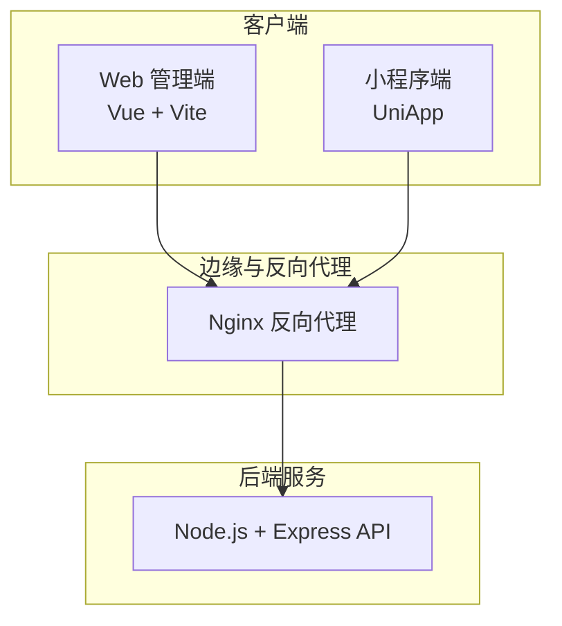
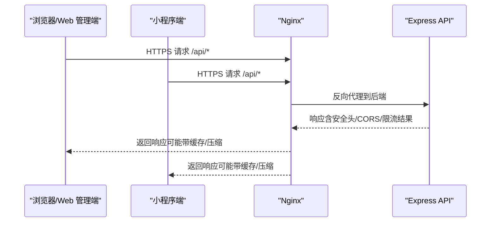
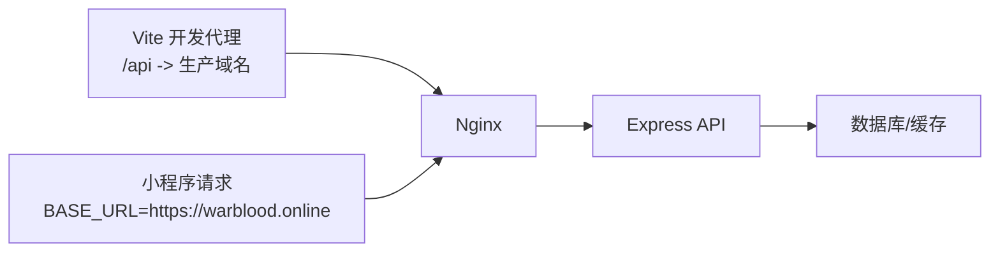

# Nginx 反向代理配置

<cite>
**本文引用的文件**
- [backend/src/app.js](file://backend/src/app.js)
- [backend/src/common/config/env.js](file://backend/src/common/config/env.js)
- [webapp/vite.config.ts](file://webapp/vite.config.ts)
- [webapp/src/utils/request.ts](file://webapp/src/utils/request.ts)
- [miniapp/src/services/request.js](file://miniapp/src/services/request.js)
- [backend/docs/技术可行性分析报告.md](file://backend/docs/技术可行性分析报告.md)
- [shared-docs/HANDOVER.md](file://shared-docs/HANDOVER.md)
</cite>

## 目录
1. [简介](#简介)
2. [项目结构](#项目结构)
3. [核心组件](#核心组件)
4. [架构总览](#架构总览)
5. [详细组件分析](#详细组件分析)
6. [依赖关系分析](#依赖关系分析)
7. [性能考虑](#性能考虑)
8. [故障排查指南](#故障排查指南)
9. [结论](#结论)
10. [附录](#附录)

## 简介
本文件面向“智慧办公助手 OA 系统”的 Nginx 反向代理配置，目标是帮助运维与开发团队在生产环境中正确部署 Nginx，以实现：
- 负载均衡与高可用
- 静态资源服务与缓存
- HTTPS 证书申请、自动续期与安全头加固
- 压缩、跨域、请求限流与性能优化
- 监控与可观测性

同时，结合后端 Express 应用的安全中间件、限流策略与 CORS 配置，给出 Nginx 侧的协同策略与最佳实践。

## 项目结构
该系统包含三个主要前端产物与一个后端 API 服务：
- Web 管理端（Vue + Vite）：通过 Vite 的开发代理指向生产域名
- 小程序端（UniApp）：直接请求生产域名
- 后端 API（Node.js + Express）：提供统一 REST API

图表来源
- [webapp/vite.config.ts:21-31](file://webapp/vite.config.ts#L21-L31)
- [miniapp/src/services/request.js:3](file://miniapp/src/services/request.js#L3)
- [backend/src/app.js:103-128](file://backend/src/app.js#L103-L128)

章节来源
- [webapp/vite.config.ts:1-33](file://webapp/vite.config.ts#L1-L33)
- [miniapp/src/services/request.js:1-127](file://miniapp/src/services/request.js#L1-L127)
- [backend/src/app.js:103-128](file://backend/src/app.js#L103-L128)

## 核心组件
- Nginx 反向代理：负责 HTTPS 终止、静态资源服务、上游转发、压缩与安全头
- 后端 API（Express）：提供统一 REST 接口，内置安全中间件、CORS、限流与错误处理
- 前端应用：Web 管理端与小程序端均通过 Nginx 访问后端 API

章节来源
- [backend/src/app.js:26-55](file://backend/src/app.js#L26-L55)
- [backend/src/common/config/env.js:13-44](file://backend/src/common/config/env.js#L13-L44)

## 架构总览
Nginx 作为统一入口，接收来自浏览器与小程序的请求，进行 TLS 终止、静态资源服务与反向代理，再将请求转发至后端 API。后端应用通过 Helmet、CORS、限流中间件保障安全与稳定性。

图表来源
- [backend/src/app.js:29-55](file://backend/src/app.js#L29-L55)
- [backend/src/app.js:103-128](file://backend/src/app.js#L103-L128)

## 详细组件分析

### Nginx 反向代理与上游配置
- 上游服务器建议至少两台以上以实现高可用与滚动升级
- 使用健康检查与故障转移，确保单点故障不影响整体服务
- 反向代理路径映射到后端 API 的根路径 /api

章节来源
- [backend/src/app.js:103-128](file://backend/src/app.js#L103-L128)

### 静态资源服务与缓存策略
- Web 管理端构建产物由 Nginx 提供，设置合理的缓存头与 ETag
- 对 HTML、JS、CSS、图片等资源分别设置长缓存与版本化策略
- 避免对动态接口开启静态缓存，保持 API 的实时性

章节来源
- [webapp/vite.config.ts:1-33](file://webapp/vite.config.ts#L1-L33)

### HTTPS 配置与证书管理
- 使用 Let’s Encrypt 自动签发与续期证书
- 强制 HTTPS 重定向与 HSTS
- 配置现代 TLS 版本与加密套件，禁用弱算法
- 设置安全响应头（如 X-Frame-Options、X-Content-Type-Options、Referrer-Policy）

章节来源
- [shared-docs/HANDOVER.md:175-213](file://shared-docs/HANDOVER.md#L175-L213)

### CORS 跨域处理
- 前端通过 Nginx 统一处理跨域，避免后端 CORS 配置分散
- 明确允许的源、方法、头与凭据设置，最小化暴露面

章节来源
- [backend/src/app.js:35-45](file://backend/src/app.js#L35-L45)

### 请求限流与安全头
- Nginx 层限流：针对 /api 路径设置每 IP 与全局速率限制，保护后端
- 后端限流：登录端点单独限流，避免暴力破解
- 安全头：Helmet 已在后端启用，Nginx 层补充 HSTS、X-Frame-Options 等

章节来源
- [backend/src/app.js:47-65](file://backend/src/app.js#L47-L65)
- [backend/src/app.js:29-34](file://backend/src/app.js#L29-L34)

### 压缩与性能优化
- 启用 gzip/deflate 并设置合适的压缩级别与阈值
- 合理设置 keepalive 超时，提升连接复用效率
- 对静态资源启用浏览器缓存与 ETag，减少带宽占用

章节来源
- [backend/src/app.js:68-81](file://backend/src/app.js#L68-L81)

### 监控与可观测性
- Nginx 访问日志与错误日志：记录请求路径、状态码、响应时间、客户端 IP
- 结合后端日志与指标（如 Prometheus + Grafana）进行统一监控
- 健康检查：Nginx 健康检查探针 + 后端 /health 接口

章节来源
- [backend/src/app.js:129-140](file://backend/src/app.js#L129-L140)

## 依赖关系分析
- 前端 Web 管理端通过 Vite 代理指向生产域名，便于开发联调
- 小程序端直接请求生产域名，确保线上访问一致性
- 后端 API 通过 Helmet、CORS、限流中间件增强安全性与稳定性

图表来源
- [webapp/vite.config.ts:21-31](file://webapp/vite.config.ts#L21-L31)
- [miniapp/src/services/request.js:3](file://miniapp/src/services/request.js#L3)
- [backend/src/app.js:103-128](file://backend/src/app.js#L103-L128)

章节来源
- [webapp/vite.config.ts:1-33](file://webapp/vite.config.ts#L1-L33)
- [miniapp/src/services/request.js:1-127](file://miniapp/src/services/request.js#L1-L127)
- [backend/src/app.js:103-128](file://backend/src/app.js#L103-L128)

## 性能考虑
- 连接与缓冲：合理设置 send_timeout、client_body_timeout、proxy_* 超时
- 压缩：gzip 压缩静态资源与文本类响应，减少带宽
- 缓存：静态资源强缓存 + 版本化，动态接口避免缓存
- 并发：根据后端实例数量与硬件资源，设置 worker_processes 与 worker_connections
- 健康检查：定期探测后端存活，故障快速摘除

## 故障排查指南
- 404/403：检查 Nginx 路由与后端 /api 前缀是否一致
- CORS 错误：确认 Nginx 层 CORS 配置与后端 CORS 是否冲突
- 502/504：检查上游健康状态、后端进程与资源限制
- 证书问题：确认证书链、到期时间与 TLS 版本
- 限流触发：检查 Nginx 与后端限流策略，避免误伤正常用户

章节来源
- [backend/src/app.js:129-140](file://backend/src/app.js#L129-L140)

## 结论
通过 Nginx 作为统一入口，结合后端的安全中间件与限流策略，可以有效提升系统的安全性、稳定性与性能。建议在生产环境中启用 HTTPS、CORS 管控、压缩与缓存，并配合监控与健康检查，持续优化用户体验与系统可靠性。

## 附录

### Nginx 配置要点清单
- HTTPS 终止与证书管理
- 静态资源服务与缓存头
- 反向代理到 /api
- CORS 与安全头
- gzip 压缩
- 请求限流
- 健康检查与故障转移
- 访问日志与错误日志

### 与后端配置的协同
- 后端信任 Nginx 代理（trust proxy），确保限流基于真实 IP
- CORS 在 Nginx 与后端分别配置，避免重复与冲突
- 安全头在 Nginx 与后端共同生效，形成纵深防御

章节来源
- [backend/src/app.js:26-55](file://backend/src/app.js#L26-L55)
- [backend/src/app.js:29-34](file://backend/src/app.js#L29-L34)