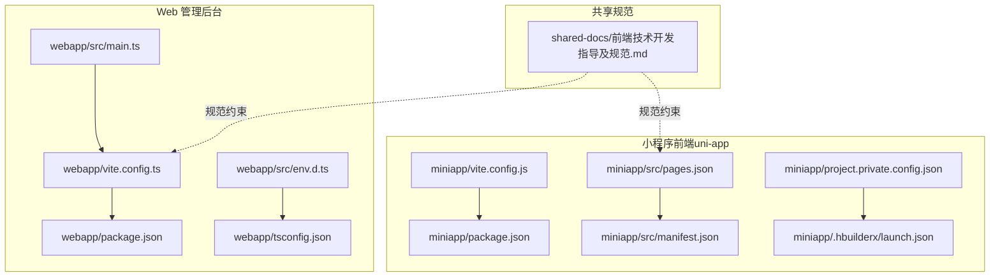
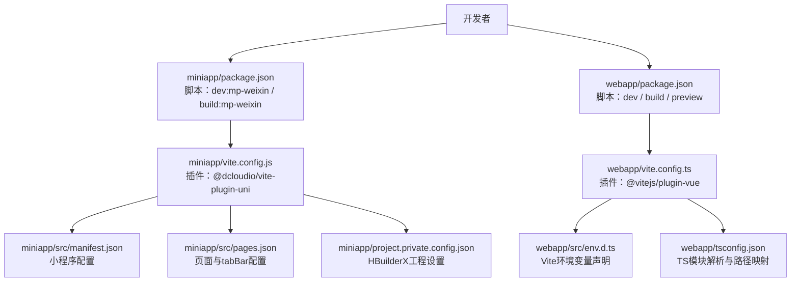
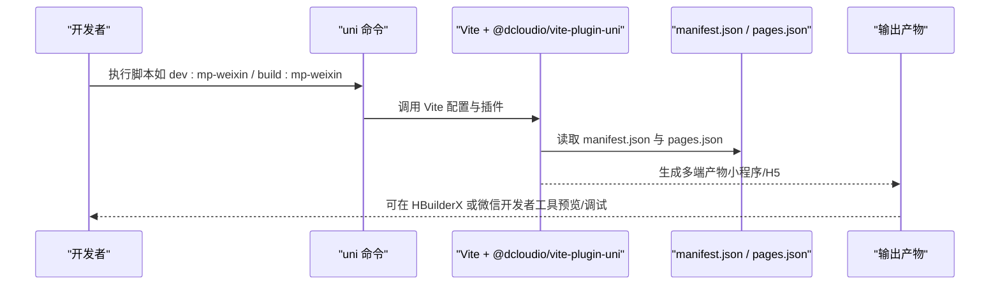
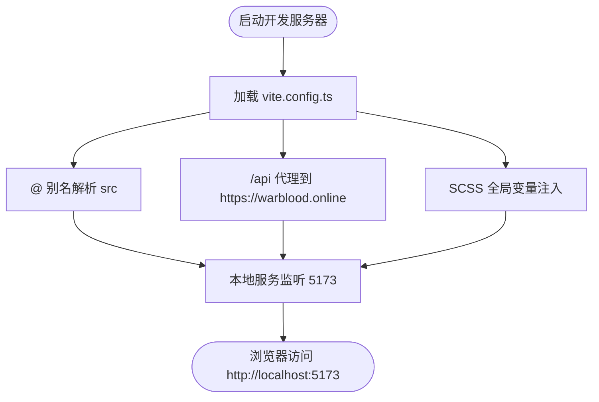
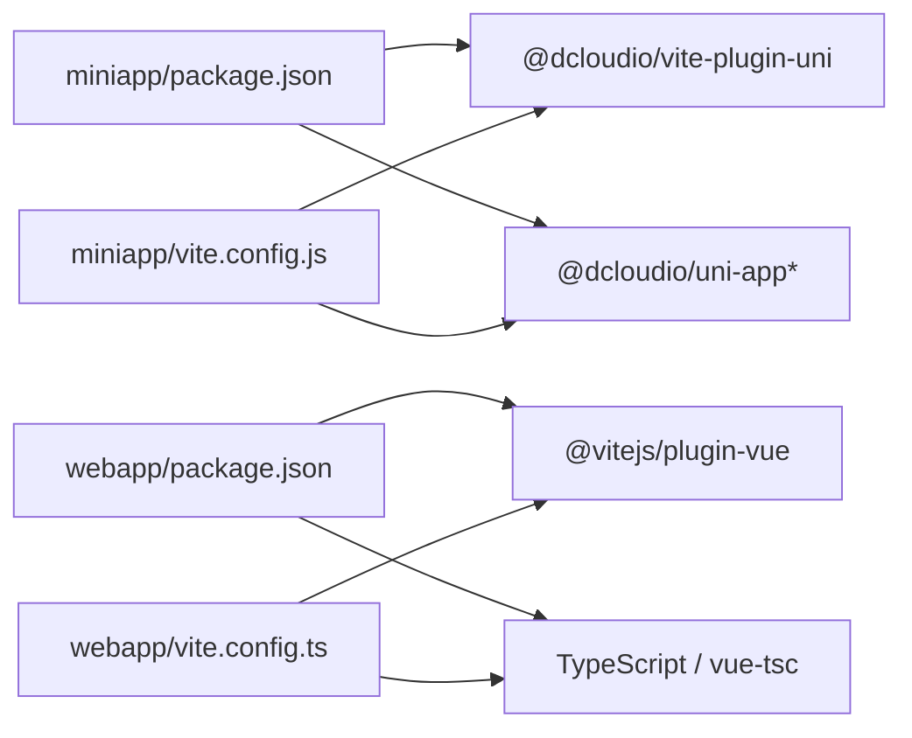

# 前端应用部署

<cite>
**本文引用的文件**
- [miniapp/vite.config.js](file://miniapp/vite.config.js)
- [webapp/vite.config.ts](file://webapp/vite.config.ts)
- [miniapp/package.json](file://miniapp/package.json)
- [webapp/package.json](file://webapp/package.json)
- [miniapp/src/manifest.json](file://miniapp/src/manifest.json)
- [miniapp/src/pages.json](file://miniapp/src/pages.json)
- [miniapp/project.private.config.json](file://miniapp/project.private.config.json)
- [miniapp/.hbuilderx/launch.json](file://miniapp/.hbuilderx/launch.json)
- [webapp/src/env.d.ts](file://webapp/src/env.d.ts)
- [webapp/tsconfig.json](file://webapp/tsconfig.json)
- [webapp/src/main.ts](file://webapp/src/main.ts)
- [miniapp/src/main.js](file://miniapp/src/main.js)
- [shared-docs/前端技术开发指导及规范.md](file://shared-docs/前端技术开发指导及规范.md)
</cite>

## 目录
1. [简介](#简介)
2. [项目结构](#项目结构)
3. [核心组件](#核心组件)
4. [架构总览](#架构总览)
5. [详细组件分析](#详细组件分析)
6. [依赖分析](#依赖分析)
7. [性能考虑](#性能考虑)
8. [故障排查指南](#故障排查指南)
9. [结论](#结论)
10. [附录](#附录)

## 简介
本文件为“智慧办公助手 OA”项目的前端部署指南，覆盖小程序前端与 Web 管理后台两套前端体系。内容包括：
- Vite 构建工具的配置与优化（代码分割、资源压缩、缓存策略）
- 小程序多端编译与发布流程（HBuilderX 配置、微信开发者平台发布）
- Web 应用静态资源部署方案（CDN、域名绑定、HTTPS）
- 构建脚本优化、环境变量管理与版本控制策略
- 部署后的性能监控与用户体验优化建议

## 项目结构
该项目采用多包结构，分别维护小程序前端与 Web 管理后台：
- miniapp：基于 uni-app 的小程序前端，支持 H5 与微信小程序多端编译
- webapp：基于 Vue 3 + TypeScript 的管理后台前端
- shared-docs：前端开发与对接规范，包含 API 基线、认证与错误码处理等

图表来源
- [miniapp/vite.config.js:1-13](file://miniapp/vite.config.js#L1-L13)
- [miniapp/package.json:1-29](file://miniapp/package.json#L1-L29)
- [miniapp/src/manifest.json:1-25](file://miniapp/src/manifest.json#L1-L25)
- [miniapp/src/pages.json:1-220](file://miniapp/src/pages.json#L1-L220)
- [miniapp/project.private.config.json:1-14](file://miniapp/project.private.config.json#L1-L14)
- [miniapp/.hbuilderx/launch.json:1-10](file://miniapp/.hbuilderx/launch.json#L1-L10)
- [webapp/vite.config.ts:1-33](file://webapp/vite.config.ts#L1-L33)
- [webapp/package.json:1-53](file://webapp/package.json#L1-L53)
- [webapp/src/env.d.ts:1-18](file://webapp/src/env.d.ts#L1-L18)
- [webapp/tsconfig.json:1-26](file://webapp/tsconfig.json#L1-L26)
- [webapp/src/main.ts:1-28](file://webapp/src/main.ts#L1-L28)
- [shared-docs/前端技术开发指导及规范.md:1-548](file://shared-docs/前端技术开发指导及规范.md#L1-L548)

章节来源
- [miniapp/vite.config.js:1-13](file://miniapp/vite.config.js#L1-L13)
- [webapp/vite.config.ts:1-33](file://webapp/vite.config.ts#L1-L33)
- [miniapp/package.json:1-29](file://miniapp/package.json#L1-L29)
- [webapp/package.json:1-53](file://webapp/package.json#L1-L53)
- [miniapp/src/manifest.json:1-25](file://miniapp/src/manifest.json#L1-L25)
- [miniapp/src/pages.json:1-220](file://miniapp/src/pages.json#L1-L220)
- [miniapp/project.private.config.json:1-14](file://miniapp/project.private.config.json#L1-L14)
- [miniapp/.hbuilderx/launch.json:1-10](file://miniapp/.hbuilderx/launch.json#L1-L10)
- [webapp/src/env.d.ts:1-18](file://webapp/src/env.d.ts#L1-L18)
- [webapp/tsconfig.json:1-26](file://webapp/tsconfig.json#L1-L26)
- [webapp/src/main.ts:1-28](file://webapp/src/main.ts#L1-L28)
- [shared-docs/前端技术开发指导及规范.md:1-548](file://shared-docs/前端技术开发指导及规范.md#L1-L548)

## 核心组件
- 小程序前端（uni-app）
  - 构建入口：Vite 插件 @dcloudio/vite-plugin-uni
  - 路径别名：@ -> src
  - 多端编译：通过 uni 命令选择目标平台（如 mp-weixin、h5）
  - 配置文件：manifest.json（小程序基础配置）、pages.json（页面路由与 tabBar）、project.private.config.json（HBuilderX 工程设置）
- Web 管理后台
  - 构建入口：Vite + @vitejs/plugin-vue
  - 路径别名：@ -> src
  - 开发代理：/api -> https://warblood.online
  - 类型与环境：env.d.ts 声明 Vite 环境变量；tsconfig.json 配置模块解析与路径映射
- 共享规范
  - API 基线、认证头、错误码、分页格式等统一规范，确保前后端一致

章节来源
- [miniapp/vite.config.js:1-13](file://miniapp/vite.config.js#L1-L13)
- [miniapp/package.json:5-10](file://miniapp/package.json#L5-L10)
- [miniapp/src/manifest.json:1-25](file://miniapp/src/manifest.json#L1-L25)
- [miniapp/src/pages.json:1-220](file://miniapp/src/pages.json#L1-L220)
- [miniapp/project.private.config.json:1-14](file://miniapp/project.private.config.json#L1-L14)
- [webapp/vite.config.ts:1-33](file://webapp/vite.config.ts#L1-L33)
- [webapp/src/env.d.ts:9-17](file://webapp/src/env.d.ts#L9-L17)
- [webapp/tsconfig.json:1-26](file://webapp/tsconfig.json#L1-L26)
- [shared-docs/前端技术开发指导及规范.md:22-43](file://shared-docs/前端技术开发指导及规范.md#L22-L43)

## 架构总览
下图展示小程序与 Web 前端在构建与运行阶段的关键交互关系。

图表来源
- [miniapp/package.json:5-10](file://miniapp/package.json#L5-L10)
- [miniapp/vite.config.js:1-13](file://miniapp/vite.config.js#L1-L13)
- [miniapp/src/manifest.json:1-25](file://miniapp/src/manifest.json#L1-L25)
- [miniapp/src/pages.json:1-220](file://miniapp/src/pages.json#L1-L220)
- [miniapp/project.private.config.json:1-14](file://miniapp/project.private.config.json#L1-L14)
- [webapp/package.json:6-14](file://webapp/package.json#L6-L14)
- [webapp/vite.config.ts:1-33](file://webapp/vite.config.ts#L1-L33)
- [webapp/src/env.d.ts:9-17](file://webapp/src/env.d.ts#L9-L17)
- [webapp/tsconfig.json:1-26](file://webapp/tsconfig.json#L1-L26)

## 详细组件分析

### 小程序前端（uni-app）构建与多端编译
- 构建工具链
  - 使用 @dcloudio/vite-plugin-uni 插件，结合 uni 命令进行多端编译
  - 路径别名 @ 指向 src，便于模块导入
- 多端编译命令
  - 开发（微信小程序）：通过脚本 dev:mp-weixin
  - 生产（微信小程序）：通过脚本 build:mp-weixin
  - 开发（H5）：通过脚本 dev:h5
  - 生产（H5）：通过脚本 build:h5
- 关键配置
  - manifest.json：小程序基础信息、平台特定设置（如微信小程序 appid、懒加载策略、组件化开关、扩展库启用等）
  - pages.json：页面路由、tabBar、导航栏样式与组件占位
  - project.private.config.json：HBuilderX 工程设置（如 urlCheck、coverView、skylineRenderEnable 等）

图表来源
- [miniapp/package.json:5-10](file://miniapp/package.json#L5-L10)
- [miniapp/vite.config.js:1-13](file://miniapp/vite.config.js#L1-L13)
- [miniapp/src/manifest.json:1-25](file://miniapp/src/manifest.json#L1-L25)
- [miniapp/src/pages.json:1-220](file://miniapp/src/pages.json#L1-L220)

章节来源
- [miniapp/vite.config.js:1-13](file://miniapp/vite.config.js#L1-L13)
- [miniapp/package.json:5-10](file://miniapp/package.json#L5-L10)
- [miniapp/src/manifest.json:9-23](file://miniapp/src/manifest.json#L9-L23)
- [miniapp/src/pages.json:202-218](file://miniapp/src/pages.json#L202-L218)
- [miniapp/project.private.config.json:4-12](file://miniapp/project.private.config.json#L4-L12)
- [miniapp/.hbuilderx/launch.json:4-8](file://miniapp/.hbuilderx/launch.json#L4-L8)

### Web 管理后台构建与开发代理
- 构建工具链
  - Vite + @vitejs/plugin-vue
  - 路径别名 @ -> src
  - SCSS 全局变量注入（通过 css.preprocessorOptions）
- 开发服务器
  - 本地端口 5173，默认打开浏览器
  - 代理 /api -> https://warblood.online，便于跨域联调
- 类型与环境
  - env.d.ts 声明 Vite 环境变量接口（如 VITE_API_BASE_URL、VITE_APP_TITLE、VITE_USE_MOCK）
  - tsconfig.json 配置模块解析策略与路径映射，确保 @/* 正确解析

图表来源
- [webapp/vite.config.ts:1-33](file://webapp/vite.config.ts#L1-L33)
- [webapp/src/env.d.ts:9-17](file://webapp/src/env.d.ts#L9-L17)
- [webapp/tsconfig.json:18-21](file://webapp/tsconfig.json#L18-L21)

章节来源
- [webapp/vite.config.ts:1-33](file://webapp/vite.config.ts#L1-L33)
- [webapp/src/env.d.ts:9-17](file://webapp/src/env.d.ts#L9-L17)
- [webapp/tsconfig.json:18-21](file://webapp/tsconfig.json#L18-L21)

### 构建脚本与环境变量管理
- 小程序
  - 脚本：dev:mp-weixin、build:mp-weixin、dev:h5、build:h5
  - 通过 uni 命令选择目标平台，无需手动维护多套构建脚本
- Web
  - 脚本：dev、build、preview、lint、format、type-check、prepare
  - 构建顺序：先类型检查（vue-tsc），再打包（vite build）
  - Husky 预提交钩子：lint-staged 统一格式化与 ESLint 修复
- 环境变量
  - 在 env.d.ts 中声明 VITE_* 变量类型，避免运行时报错
  - 建议在 CI/CD 中注入不同环境的 .env 文件（如 .env.production），区分 API 基址与功能开关

章节来源
- [miniapp/package.json:5-10](file://miniapp/package.json#L5-L10)
- [webapp/package.json:6-14](file://webapp/package.json#L6-L14)
- [webapp/src/env.d.ts:9-17](file://webapp/src/env.d.ts#L9-L17)

### 版本控制与发布流程（小程序）
- HBuilderX 工程配置
  - project.private.config.json 控制编译选项（如 urlCheck、lazyloadPlaceholderEnable、skylineRenderEnable 等）
  - .hbuilderx/launch.json 指定 Playground 与调试类型
- 发布流程建议
  - 开发阶段：使用 HBuilderX 预览，结合 pages.json 的自定义导航与 tabBar 进行界面验证
  - 提交审核：在微信开发者平台配置 appid 与业务域名，确保网络请求域名在白名单内
  - 注意：manifest.json 中微信小程序 setting.urlCheck 可按需关闭（开发阶段常用），但上线前务必开启并确保域名合规

章节来源
- [miniapp/project.private.config.json:4-12](file://miniapp/project.private.config.json#L4-L12)
- [miniapp/.hbuilderx/launch.json:4-8](file://miniapp/.hbuilderx/launch.json#L4-L8)
- [miniapp/src/manifest.json:9-18](file://miniapp/src/manifest.json#L9-L18)
- [miniapp/src/pages.json:202-218](file://miniapp/src/pages.json#L202-L218)

### Web 静态资源部署与 CDN
- 构建产物
  - 使用 vite build 生成静态资源（含哈希文件名），便于长期缓存与灰度发布
- CDN 配置
  - 将静态资源托管至 CDN，配置缓存策略（如强缓存 1 年、动态资源短缓存）
  - 配置 HTTP/2 或 HTTP/3，启用 Gzip/Brotli 压缩
- 域名与 HTTPS
  - 为站点配置域名并启用 HTTPS（Let’s Encrypt 或企业证书）
  - 配置 HSTS、CSP 等安全响应头
- 预览与本地验证
  - 使用 vite preview 在本地验证构建产物与代理配置

章节来源
- [webapp/package.json:7-10](file://webapp/package.json#L7-L10)
- [webapp/vite.config.ts:21-31](file://webapp/vite.config.ts#L21-L31)

## 依赖分析
- 小程序前端
  - 依赖 @dcloudio/vite-plugin-uni 与 uni-app 生态，构建由 uni 命令驱动
  - 路由与页面由 pages.json 管理，manifest.json 决定平台特性
- Web 管理后台
  - 依赖 @vitejs/plugin-vue、TypeScript、ESLint、Prettier、Husky 等工具链
  - 通过 tsconfig.json 与 env.d.ts 确保类型安全与路径别名可用

图表来源
- [miniapp/package.json:15-26](file://miniapp/package.json#L15-L26)
- [miniapp/vite.config.js:1-13](file://miniapp/vite.config.js#L1-L13)
- [webapp/package.json:24-45](file://webapp/package.json#L24-L45)
- [webapp/vite.config.ts:1-8](file://webapp/vite.config.ts#L1-L8)

章节来源
- [miniapp/package.json:15-26](file://miniapp/package.json#L15-L26)
- [webapp/package.json:24-45](file://webapp/package.json#L24-L45)

## 性能考虑
- 代码分割与懒加载
  - 小程序：manifest.json 中启用 requiredComponents 懒加载策略，减少首屏体积
  - Web：利用 Vite 的动态 import 进行路由级或组件级懒加载
- 资源压缩与缓存
  - 构建时启用压缩（Vite 默认），配合 CDN 强缓存与 ETag/Last-Modified
- 网络与代理
  - Web 开发代理 /api -> https://warblood.online，避免跨域；生产环境通过反向代理或 CDN 回源
- 图标与图片
  - 使用矢量图标（如 Element Plus Icons），图片按需加载与懒加载
- 首屏渲染
  - Web：合理拆分 vendor chunk，优先加载核心路由与首屏组件
  - 小程序：减少首页复杂组件数量，延迟初始化非关键模块

章节来源
- [miniapp/src/manifest.json:11-11](file://miniapp/src/manifest.json#L11-L11)
- [webapp/vite.config.ts:21-31](file://webapp/vite.config.ts#L21-L31)

## 故障排查指南
- 常见问题与处理
  - CORS 错误：确认后端 CORS 白名单包含前端域名
  - 401/403：检查 Token 是否存在且未过期；必要时清除本地存储并重新登录
  - 网络超时：调整请求超时时间（常规接口约 10s，提交/上传接口更长）
  - 小程序域名白名单：确保请求域名已在微信公众平台配置
- 开发代理
  - Web 本地代理 /api -> https://warblood.online，若联调失败，检查代理 target 与 changeOrigin 配置
- 构建失败
  - 小程序：确认 uni 命令可用与平台插件版本匹配
  - Web：先执行类型检查（vue-tsc），修复类型错误后再打包

章节来源
- [shared-docs/前端技术开发指导及规范.md:509-524](file://shared-docs/前端技术开发指导及规范.md#L509-L524)
- [webapp/vite.config.ts:24-30](file://webapp/vite.config.ts#L24-L30)

## 结论
本部署文档围绕小程序与 Web 前端两大体系，给出了基于现有配置的构建、编译与发布实践建议。通过合理的代码分割、资源压缩与缓存策略，以及规范化的环境变量与版本控制流程，可在保证开发效率的同时提升上线质量与用户体验。

## 附录
- 前端开发与对接规范要点
  - API 基线：开发/生产环境基址与前缀
  - 认证：JWT Bearer Token，统一在请求头携带
  - 错误码：统一处理 401、403、1001、2001 等业务与网络错误
  - 分页：统一 page/pageSize 参数与响应结构
  - 接口调用：小程序不支持 Cookie，上传文件使用 uni.uploadFile

章节来源
- [shared-docs/前端技术开发指导及规范.md:26-43](file://shared-docs/前端技术开发指导及规范.md#L26-L43)
- [shared-docs/前端技术开发指导及规范.md:136-220](file://shared-docs/前端技术开发指导及规范.md#L136-L220)
- [shared-docs/前端技术开发指导及规范.md:297-371](file://shared-docs/前端技术开发指导及规范.md#L297-L371)
- [shared-docs/前端技术开发指导及规范.md:505-543](file://shared-docs/前端技术开发指导及规范.md#L505-L543)