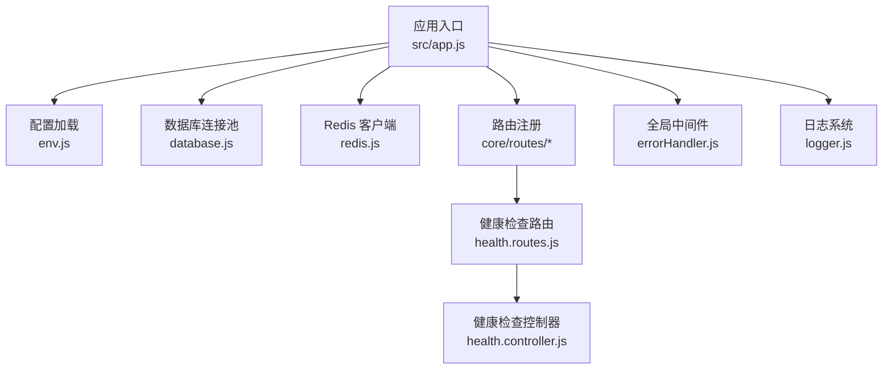
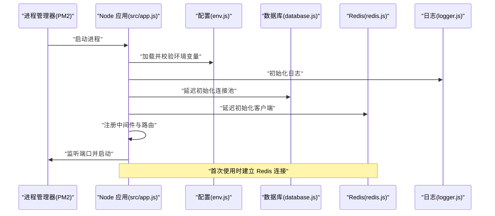
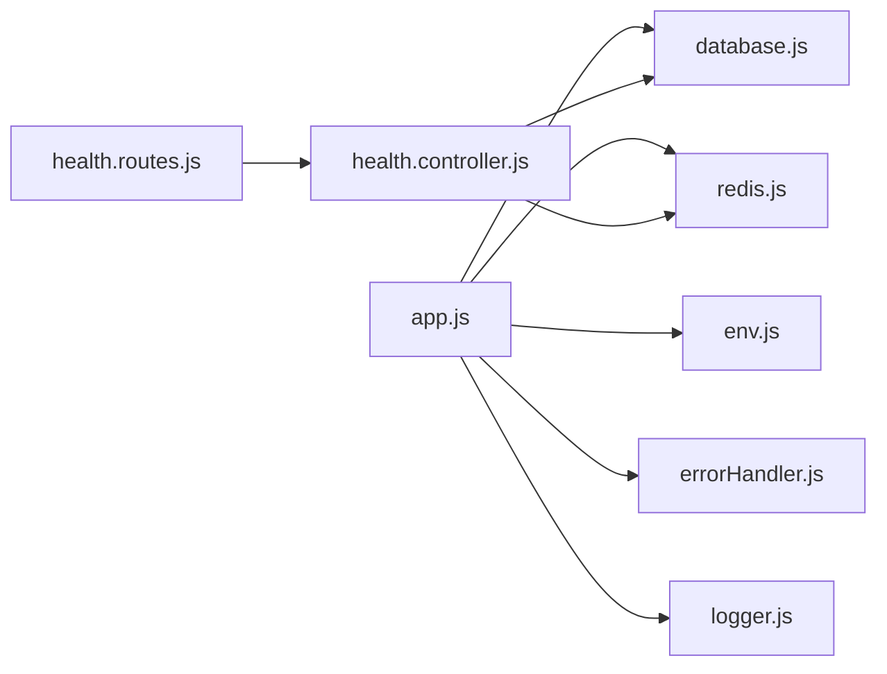

# 后端 API 服务部署

<cite>
**本文引用的文件**
- [package.json](file://backend/package.json)
- [env.js](file://backend/src/common/config/env.js)
- [database.js](file://backend/src/common/config/database.js)
- [redis.js](file://backend/src/common/config/redis.js)
- [app.js](file://backend/src/app.js)
- [logger.js](file://backend/src/common/utils/logger.js)
- [health.controller.js](file://backend/src/core/controllers/health.controller.js)
- [health.routes.js](file://backend/src/core/routes/health.routes.js)
- [errorHandler.js](file://backend/src/common/middleware/errorHandler.js)
- [swagger.js](file://backend/src/common/config/swagger.js)
- [init-db.js](file://backend/scripts/init-db.js)
- [技术可行性分析报告.md](file://backend/docs/技术可行性分析报告.md)
- [HANDOVER.md](file://shared-docs/HANDOVER.md)
</cite>

## 目录
1. [简介](#简介)
2. [项目结构](#项目结构)
3. [核心组件](#核心组件)
4. [架构总览](#架构总览)
5. [详细组件分析](#详细组件分析)
6. [依赖关系分析](#依赖关系分析)
7. [性能考虑](#性能考虑)
8. [故障排查指南](#故障排查指南)
9. [结论](#结论)
10. [附录](#附录)

## 简介
本部署文档面向后端 API 服务的生产环境上线与运维，覆盖以下主题：
- 环境变量配置与校验
- 数据库连接池与连接策略
- Redis 缓存客户端初始化与重连机制
- PM2 进程管理器安装与配置（守护、自动重启、日志、集群模式）
- 生产环境性能优化（内存、并发、资源限制）
- 启动脚本与服务注册、健康检查
- 部署验证与常见问题排查

## 项目结构
后端采用 Express 应用，按功能域拆分模块，核心配置集中在 common/config 下，应用入口位于 src/app.js。

图表来源
- [app.js:1-207](file://backend/src/app.js#L1-L207)
- [env.js:1-118](file://backend/src/common/config/env.js#L1-L118)
- [database.js:1-222](file://backend/src/common/config/database.js#L1-L222)
- [redis.js:1-101](file://backend/src/common/config/redis.js#L1-L101)
- [health.routes.js:1-32](file://backend/src/core/routes/health.routes.js#L1-L32)
- [health.controller.js:1-55](file://backend/src/core/controllers/health.controller.js#L1-L55)
- [errorHandler.js:1-28](file://backend/src/common/middleware/errorHandler.js#L1-L28)
- [logger.js:1-100](file://backend/src/common/utils/logger.js#L1-L100)

章节来源
- [package.json:1-58](file://backend/package.json#L1-L58)
- [app.js:1-207](file://backend/src/app.js#L1-L207)

## 核心组件
- 环境变量与配置中心：集中于 env.js，提供 NODE_ENV、端口、数据库、Redis、JWT、微信、日志级别等配置，并在启动时校验必需变量。
- 数据库连接池：database.js 提供 OA 主库与旧版库双连接池，支持参数化查询、事务、连通性检测。
- Redis 客户端：redis.js 提供延迟初始化、自动重连策略、事件监听与连通性检测。
- 应用入口与中间件：app.js 注册安全中间件、CORS、全局限流、JSON/URL 解析、请求日志、Swagger、路由与全局错误处理。
- 日志系统：logger.js 基于 winston，控制台彩色输出与文件滚动日志，支持请求上下文注入。
- 健康检查：health.routes.js 与 health.controller.js 提供 /api/health，检查数据库与 Redis 连通性。
- 全局错误处理：errorHandler.js 统一错误响应格式，区分业务错误与服务器错误。
- Swagger 文档：swagger.js 定义 OpenAPI 规范与组件，按路由与控制器注释自动生成文档。

章节来源
- [env.js:1-118](file://backend/src/common/config/env.js#L1-L118)
- [database.js:1-222](file://backend/src/common/config/database.js#L1-L222)
- [redis.js:1-101](file://backend/src/common/config/redis.js#L1-L101)
- [app.js:1-207](file://backend/src/app.js#L1-L207)
- [logger.js:1-100](file://backend/src/common/utils/logger.js#L1-L100)
- [health.controller.js:1-55](file://backend/src/core/controllers/health.controller.js#L1-L55)
- [health.routes.js:1-32](file://backend/src/core/routes/health.routes.js#L1-L32)
- [errorHandler.js:1-28](file://backend/src/common/middleware/errorHandler.js#L1-L28)
- [swagger.js:1-137](file://backend/src/common/config/swagger.js#L1-L137)

## 架构总览
后端服务启动流程概览如下：

图表来源
- [app.js:145-165](file://backend/src/app.js#L145-L165)
- [env.js:34-44](file://backend/src/common/config/env.js#L34-L44)
- [redis.js:16-57](file://backend/src/common/config/redis.js#L16-L57)
- [database.js:11-43](file://backend/src/common/config/database.js#L11-L43)

## 详细组件分析

### 环境变量与配置
- 必需变量清单：NODE_ENV、PORT、OA_DB_*、OLD_DB_*、REDIS_*、JWT_SECRET、WX_APPID 等。
- 默认值与类型转换：端口、连接池大小、日志级别、Swagger 开关等均有默认值。
- 启动校验：缺失变量将直接导致启动失败，确保生产环境配置完整。

章节来源
- [env.js:13-44](file://backend/src/common/config/env.js#L13-L44)
- [env.js:50-115](file://backend/src/common/config/env.js#L50-L115)

### 数据库连接池
- 双库设计：OA 主库（wx_app_oa）与旧版库（daily_report）分别配置连接池。
- 连接池参数：等待连接、最大连接数、队列限制、keep-alive、字符集与时区。
- 访问方法：提供 query/execute、oldQuery/oldExecute 与事务封装；ping 用于连通性检测。
- 事务保证：beginTransaction/commit/rollback 与连接释放。

章节来源
- [database.js:11-43](file://backend/src/common/config/database.js#L11-L43)
- [database.js:65-109](file://backend/src/common/config/database.js#L65-L109)
- [database.js:117-161](file://backend/src/common/config/database.js#L117-L161)
- [database.js:168-181](file://backend/src/common/config/database.js#L168-L181)
- [database.js:187-207](file://backend/src/common/config/database.js#L187-L207)

### Redis 缓存客户端
- 延迟初始化：首次使用时才建立连接，避免启动阻塞。
- 连接 URL：支持密码、主机、端口、DB 选择与键前缀。
- 重连策略：指数退避，超过上限则记录错误并终止重连。
- 事件监听：connect、error、end，便于可观测性。
- ping 检测：用于健康检查与运行时可用性判断。

章节来源
- [redis.js:16-57](file://backend/src/common/config/redis.js#L16-L57)
- [redis.js:85-93](file://backend/src/common/config/redis.js#L85-L93)

### 应用入口与中间件
- 安全中间件：Helmet（禁用特定策略以适配小程序场景）。
- CORS：开发阶段开放多源，生产可根据域名调整。
- 限流：全局限流与登录端点限流，避免滥用与暴力破解。
- 解析与日志：JSON/URL 解析、请求日志中间件。
- Swagger：按开关挂载，生成 OpenAPI 文档。
- 路由注册：核心路由、认证路由、特性路由、消息路由、WPS 路由。
- 优雅退出：SIGTERM/SIGINT 监听，关闭 HTTP 与 Redis，10 秒强制退出。
- 未捕获异常：记录错误并优雅退出。

章节来源
- [app.js:26-55](file://backend/src/app.js#L26-L55)
- [app.js:67-85](file://backend/src/app.js#L67-L85)
- [app.js:88-100](file://backend/src/app.js#L88-L100)
- [app.js:102-127](file://backend/src/app.js#L102-L127)
- [app.js:145-204](file://backend/src/app.js#L145-L204)

### 日志系统
- 输出：控制台（开发彩色）、错误文件、综合文件。
- 文件轮转：单文件最大 10MB，保留数量按策略配置。
- 请求上下文：为每个请求注入 requestId、URL、方法、状态码等元信息。
- 级别：受 LOG_LEVEL 控制，silent 可完全静默。

章节来源
- [logger.js:22-61](file://backend/src/common/utils/logger.js#L22-L61)
- [logger.js:67-96](file://backend/src/common/utils/logger.js#L67-L96)

### 健康检查
- 端点：GET /api/health
- 检查项：数据库与 Redis 连通性，返回响应时间与整体状态。
- 降级处理：任一组件异常返回 503 与 degraded 状态。

章节来源
- [health.routes.js:29](file://backend/src/core/routes/health.routes.js#L29)
- [health.controller.js:13-52](file://backend/src/core/controllers/health.controller.js#L13-L52)

### 全局错误处理
- 统一响应：业务错误与服务器错误均返回 HTTP 200，通过 code 区分。
- 日志记录：区分警告与错误级别，生产环境隐藏堆栈细节。

章节来源
- [errorHandler.js:12-25](file://backend/src/common/middleware/errorHandler.js#L12-L25)

### Swagger 文档
- 规范：OpenAPI 3.0，自动扫描路由与控制器注释。
- 组件：统一响应、分页、错误、健康检查等模型。
- 安全：Bearer JWT 配置。

章节来源
- [swagger.js:9-137](file://backend/src/common/config/swagger.js#L9-L137)

## 依赖关系分析
- 应用入口依赖配置、数据库、Redis、中间件与路由。
- 健康检查依赖数据库与 Redis 的 ping 能力。
- 日志系统被中间件与控制器共享。
- Swagger 依赖路由与控制器注释。

图表来源
- [app.js:1-207](file://backend/src/app.js#L1-L207)
- [env.js:1-118](file://backend/src/common/config/env.js#L1-L118)
- [database.js:1-222](file://backend/src/common/config/database.js#L1-L222)
- [redis.js:1-101](file://backend/src/common/config/redis.js#L1-L101)
- [health.routes.js:1-32](file://backend/src/core/routes/health.routes.js#L1-L32)
- [health.controller.js:1-55](file://backend/src/core/controllers/health.controller.js#L1-L55)
- [errorHandler.js:1-28](file://backend/src/common/middleware/errorHandler.js#L1-L28)
- [logger.js:1-100](file://backend/src/common/utils/logger.js#L1-L100)

## 性能考虑
- 连接池参数：根据并发与数据库性能调整 poolMin/poolMax，避免过小导致排队、过大导致资源争用。
- 限流策略：全局限流与登录限流平衡用户体验与防护需求。
- 请求体大小：JSON/URL 解析限制为 10MB，避免内存压力。
- 日志级别：生产环境建议提升日志级别，减少低价值日志写入。
- 优雅退出：10 秒强制退出窗口，确保容器编排或负载均衡正确感知下线。
- Swagger：仅在开发/调试开启，避免不必要的解析开销。

章节来源
- [database.js:17-23](file://backend/src/common/config/database.js#L17-L23)
- [database.js:36-42](file://backend/src/common/config/database.js#L36-L42)
- [app.js:48-55](file://backend/src/app.js#L48-L55)
- [app.js:68-69](file://backend/src/app.js#L68-L69)
- [app.js:185-190](file://backend/src/app.js#L185-L190)
- [env.js:114](file://backend/src/common/config/env.js#L114)

## 故障排查指南
- 启动失败（缺少环境变量）
  - 现象：启动即报错，提示缺失必需变量。
  - 排查：核对 .env 文件，确保 NODE_ENV、PORT、数据库与 Redis 相关变量齐全。
  - 参考：环境变量校验逻辑与必需变量清单。
- 数据库无法连接
  - 现象：健康检查数据库状态 error，或业务接口报错。
  - 排查：检查 OA_DB_HOST/PORT/USER/PASSWORD/NAME 与网络连通性；确认连接池参数合理。
  - 参考：数据库连接池初始化与 ping 方法。
- Redis 无法连接
  - 现象：健康检查 Redis 状态 error，或缓存相关功能异常。
  - 排查：检查 REDIS_HOST/PORT/PASSWORD/DB 与网络连通性；关注重连策略日志。
  - 参考：Redis 初始化与事件监听。
- 限流触发
  - 现象：出现 429 响应。
  - 排查：确认客户端是否为正常业务行为；必要时调整限流阈值。
  - 参考：全局限流与登录限流配置。
- 健康检查降级
  - 现象：返回 503，checks 中某组件 error。
  - 排查：分别检查数据库与 Redis 的 ping 结果与日志。
  - 参考：健康检查控制器。
- 未捕获异常
  - 现象：服务崩溃或日志出现未捕获异常。
  - 排查：查看日志中的错误堆栈，定位异常来源并修复。
  - 参考：优雅退出与未捕获异常处理。
- Swagger 文档挂载失败
  - 现象：/api-docs 无法访问。
  - 排查：确认 SWAGGER_ENABLED=true 且依赖已安装；查看日志警告。
  - 参考：Swagger 挂载逻辑。

章节来源
- [env.js:34-44](file://backend/src/common/config/env.js#L34-L44)
- [database.js:187-207](file://backend/src/common/config/database.js#L187-L207)
- [redis.js:85-93](file://backend/src/common/config/redis.js#L85-L93)
- [app.js:48-65](file://backend/src/app.js#L48-L65)
- [health.controller.js:13-52](file://backend/src/core/controllers/health.controller.js#L13-L52)
- [app.js:196-203](file://backend/src/app.js#L196-L203)
- [app.js:88-100](file://backend/src/app.js#L88-L100)

## 结论
本部署文档基于现有代码实现，提供了从环境变量、数据库与 Redis 配置，到 PM2 进程管理、性能优化、健康检查与故障排查的完整实践指南。建议在生产环境中结合监控与告警体系持续迭代。

## 附录

### 环境变量清单与默认值
- 服务与日志
  - NODE_ENV：运行环境（development/production/test）
  - PORT：服务端口，默认 3000
  - LOG_LEVEL：日志级别，默认 info
  - LOG_DIR：日志目录，默认 ./logs
  - SWAGGER_ENABLED：是否启用 Swagger，默认 false
- 数据库（OA 主库 wx_app_oa）
  - OA_DB_HOST/PORT/USER/PASSWORD/NAME：连接信息
  - OA_DB_POOL_MIN/MAX：连接池最小/最大连接数
- 数据库（旧版 daily_report）
  - OLD_DB_HOST/PORT/USER/PASSWORD/NAME：连接信息
  - OLD_DB_POOL_MIN/MAX：连接池最小/最大连接数
- Redis
  - REDIS_HOST/PORT/PASSWORD/DB/KEY_PREFIX：连接与键前缀
- 安全与鉴权
  - JWT_SECRET：JWT 密钥
  - JWT_EXPIRES_IN：过期时间，默认 7d
  - WX_APPID/WX_SECRET：微信应用配置
  - QYWX_CORPID/QYWX_SECRET/QYWX_ADMIN_USERIDS：企业微信配置
- 其他
  - trust proxy：Express 代理信任（Nginx 反代）

章节来源
- [env.js:13-115](file://backend/src/common/config/env.js#L13-L115)

### PM2 安装与配置（生产）
- 安装
  - 使用 npm 全局安装 PM2。
- 启动
  - 使用 PM2 启动 src/app.js，设置进程名（如 wx-app-oa-backend）。
- 守护与自动重启
  - 使用 PM2 守护进程，配合 ecosystem 配置实现自动重启与日志管理。
- 集群模式
  - 可按 CPU 核心数启动多实例，实现水平扩展；注意共享资源与 Redis 的幂等处理。
- 日志管理
  - PM2 内置日志切割与聚合，结合应用日志策略统一管理。
- 优雅退出
  - 确保 SIGTERM/SIGINT 信号被正确处理，避免连接泄漏。

章节来源
- [HANDOVER.md:204-213](file://shared-docs/HANDOVER.md#L204-L213)
- [app.js:167-190](file://backend/src/app.js#L167-L190)

### 启动脚本与服务注册
- 启动命令
  - 使用 PM2 启动应用入口文件。
- 服务注册
  - 将服务注册为系统服务（systemd 等），实现开机自启与崩溃重启。
- 健康检查集成
  - 在容器编排或云平台健康检查探针中调用 /api/health。

章节来源
- [HANDOVER.md:204-213](file://shared-docs/HANDOVER.md#L204-L213)
- [health.routes.js:29](file://backend/src/core/routes/health.routes.js#L29)

### 数据库初始化
- 初始化脚本
  - 使用 scripts/init-db.js 创建 M2 阶段所需的基础表。
- 执行步骤
  - 确认 .env 中 OA_DB_* 配置正确；
  - 执行初始化脚本，逐条创建表并输出结果。

章节来源
- [init-db.js:1-374](file://backend/scripts/init-db.js#L1-L374)
- [技术可行性分析报告.md:515-523](file://backend/docs/技术可行性分析报告.md#L515-L523)

### 部署验证清单
- 环境变量
  - 核对所有必需变量已配置。
- 服务启动
  - PM2 显示应用在线，端口监听正常。
- 健康检查
  - GET /api/health 返回 ok，各组件响应时间合理。
- 功能验证
  - 关键接口（如登录、报表、审批）可正常访问。
- 日志
  - 控制台与文件日志均正常输出，无严重错误。

章节来源
- [env.js:34-44](file://backend/src/common/config/env.js#L34-L44)
- [health.controller.js:13-52](file://backend/src/core/controllers/health.controller.js#L13-L52)
- [logger.js:22-61](file://backend/src/common/utils/logger.js#L22-L61)