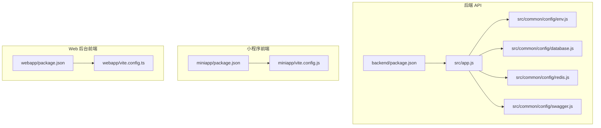
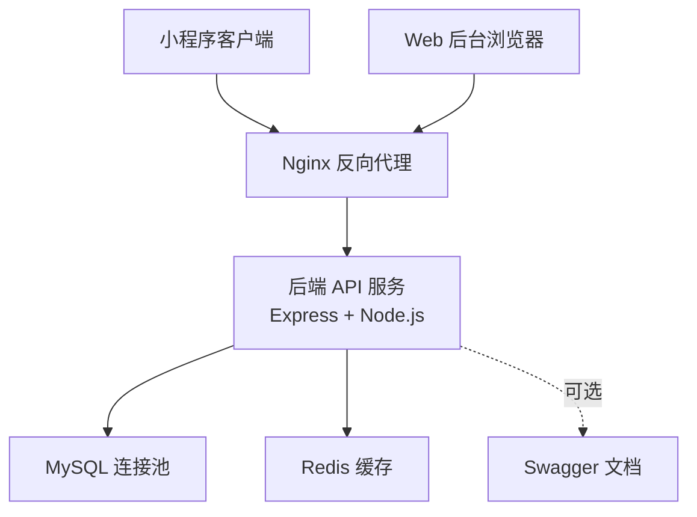
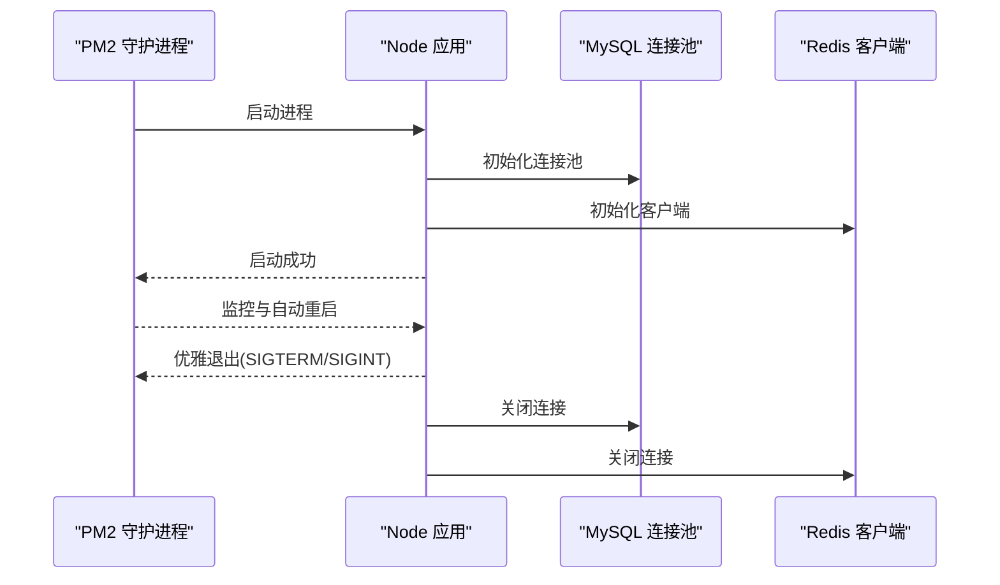
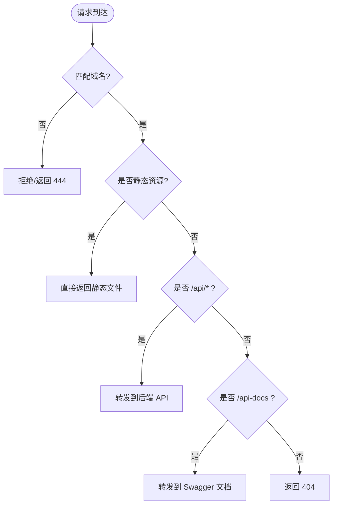
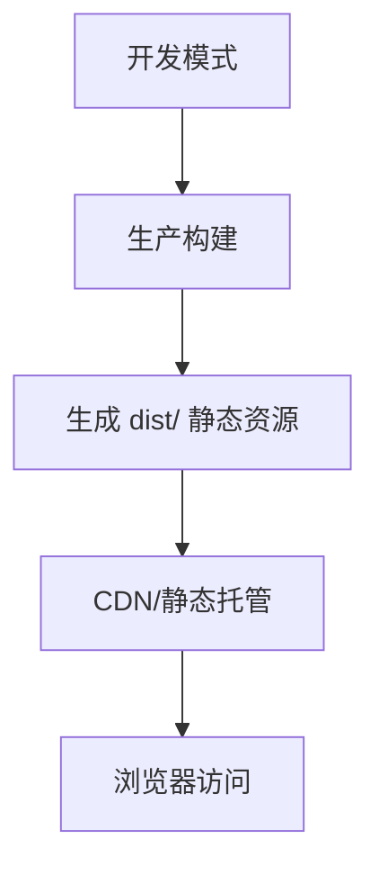
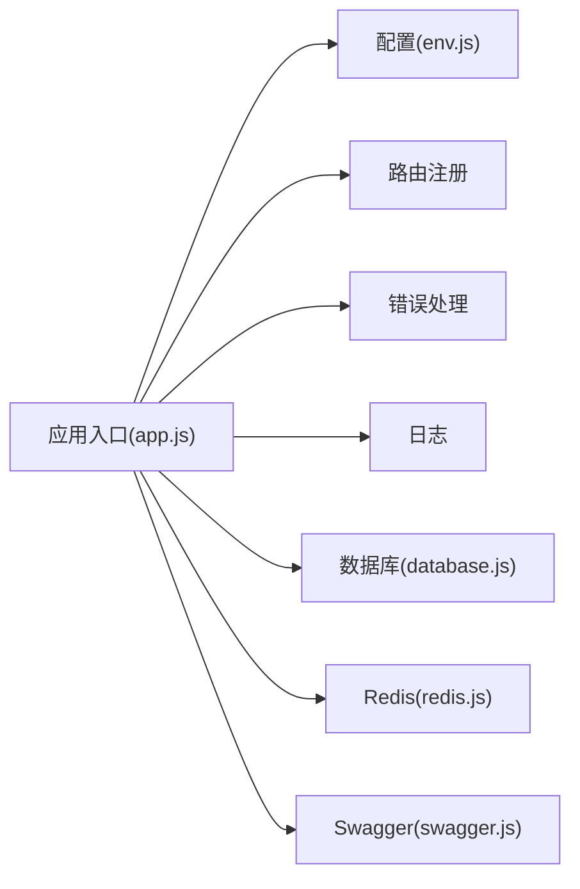

# 应用部署

<cite>
**本文引用的文件**
- [backend/package.json](file://backend/package.json)
- [backend/src/app.js](file://backend/src/app.js)
- [backend/src/common/config/env.js](file://backend/src/common/config/env.js)
- [backend/src/common/config/database.js](file://backend/src/common/config/database.js)
- [backend/src/common/config/redis.js](file://backend/src/common/config/redis.js)
- [backend/src/common/config/swagger.js](file://backend/src/common/config/swagger.js)
- [backend/docs/后端接口文档.md](file://backend/docs/后端接口文档.md)
- [miniapp/package.json](file://miniapp/package.json)
- [miniapp/vite.config.js](file://miniapp/vite.config.js)
- [webapp/package.json](file://webapp/package.json)
- [webapp/vite.config.ts](file://webapp/vite.config.ts)
- [shared-docs/overview.md](file://shared-docs/overview.md)
</cite>

## 目录
1. [简介](#简介)
2. [项目结构](#项目结构)
3. [核心组件](#核心组件)
4. [架构总览](#架构总览)
5. [详细组件分析](#详细组件分析)
6. [依赖关系分析](#依赖关系分析)
7. [性能考虑](#性能考虑)
8. [故障排查指南](#故障排查指南)
9. [结论](#结论)
10. [附录](#附录)

## 简介
本文件面向“智慧办公助手 OA 系统”的部署工程师与运维人员，提供后端 API 服务、小程序前端与 Web 后台的完整部署指南。内容涵盖：
- 后端 API 服务的 PM2 进程管理、进程守护与自动重启
- Nginx 反向代理的配置要点（负载均衡、静态资源、SSL）
- 前端小程序与 Web 后台的构建与部署策略（Vite、CDN）
- Docker 容器化与编排思路
- 部署脚本、自动化流程与回滚策略
- 部署后验证与常见问题排查

## 项目结构
该仓库采用多工程组织方式：后端 Node.js API、小程序前端、Web 后台前端，分别独立构建与部署。

**图表来源**
- [backend/package.json:1-58](file://backend/package.json#L1-L58)
- [backend/src/app.js:1-207](file://backend/src/app.js#L1-L207)
- [backend/src/common/config/env.js:1-118](file://backend/src/common/config/env.js#L1-L118)
- [backend/src/common/config/database.js:1-222](file://backend/src/common/config/database.js#L1-L222)
- [backend/src/common/config/redis.js:1-101](file://backend/src/common/config/redis.js#L1-L101)
- [backend/src/common/config/swagger.js:1-137](file://backend/src/common/config/swagger.js#L1-L137)
- [miniapp/package.json:1-29](file://miniapp/package.json#L1-L29)
- [miniapp/vite.config.js:1-13](file://miniapp/vite.config.js#L1-L13)
- [webapp/package.json:1-53](file://webapp/package.json#L1-L53)
- [webapp/vite.config.ts:1-33](file://webapp/vite.config.ts#L1-L33)

**章节来源**
- [backend/package.json:1-58](file://backend/package.json#L1-L58)
- [miniapp/package.json:1-29](file://miniapp/package.json#L1-L29)
- [webapp/package.json:1-53](file://webapp/package.json#L1-L53)

## 核心组件
- 后端 API 服务
  - 应用入口与中间件：安全头、CORS、速率限制、JSON 解析、请求日志、Swagger 文档、路由注册、全局错误处理、优雅退出
  - 配置中心：环境变量校验与默认值、数据库与 Redis 连接池、Swagger 开关
  - 数据层：OA 主库与旧库双连接池、事务封装、连通性检测
  - 缓存层：Redis 客户端初始化、重连策略、连通性检测
- 小程序前端
  - 构建命令：开发与生产构建
  - Vite 配置：别名与插件
- Web 后台前端
  - 构建命令：开发、生产构建与预览
  - Vite 配置：开发代理、SCSS 变量注入、路径别名

**章节来源**
- [backend/src/app.js:1-207](file://backend/src/app.js#L1-L207)
- [backend/src/common/config/env.js:1-118](file://backend/src/common/config/env.js#L1-L118)
- [backend/src/common/config/database.js:1-222](file://backend/src/common/config/database.js#L1-L222)
- [backend/src/common/config/redis.js:1-101](file://backend/src/common/config/redis.js#L1-L101)
- [miniapp/vite.config.js:1-13](file://miniapp/vite.config.js#L1-L13)
- [webapp/vite.config.ts:1-33](file://webapp/vite.config.ts#L1-L33)

## 架构总览
后端 API 作为统一入口，提供 RESTful 接口；小程序与 Web 后台通过反向代理访问后端。生产环境建议使用 Nginx 提供 HTTPS、静态资源与上游转发；后端通过 PM2 守护 Node 进程，实现自动重启与优雅退出。

**图表来源**
- [backend/src/app.js:102-140](file://backend/src/app.js#L102-L140)
- [backend/src/common/config/env.js:50-115](file://backend/src/common/config/env.js#L50-L115)
- [backend/src/common/config/database.js:11-43](file://backend/src/common/config/database.js#L11-L43)
- [backend/src/common/config/redis.js:16-57](file://backend/src/common/config/redis.js#L16-L57)
- [backend/src/common/config/swagger.js:20-25](file://backend/src/common/config/swagger.js#L20-L25)

## 详细组件分析

### 后端 API 服务部署
- 进程管理与守护
  - 使用 PM2 启动后端应用，建议配置进程数、内存阈值与自动重启策略
  - 配置优雅退出信号（SIGTERM/SIGINT），确保关闭前释放数据库与缓存连接
- 环境变量与配置
  - 必需变量：运行环境、端口、数据库与 Redis 连接、JWT 密钥、微信 AppID 等
  - Swagger 开关可按环境控制
- 安全与限流
  - Helmet 安全头、CORS 白名单、速率限制（全局限流与登录端点限流）
- 数据与缓存
  - OA 主库与旧库双连接池，事务封装；Redis 初始化与重连策略
- 健康检查
  - 提供健康检查接口，包含数据库与 Redis 的连通性与响应时间

**图表来源**
- [backend/src/app.js:145-204](file://backend/src/app.js#L145-L204)
- [backend/src/common/config/database.js:11-43](file://backend/src/common/config/database.js#L11-L43)
- [backend/src/common/config/redis.js:16-57](file://backend/src/common/config/redis.js#L16-L57)

**章节来源**
- [backend/src/app.js:26-140](file://backend/src/app.js#L26-L140)
- [backend/src/common/config/env.js:13-44](file://backend/src/common/config/env.js#L13-L44)
- [backend/src/common/config/database.js:168-207](file://backend/src/common/config/database.js#L168-L207)
- [backend/src/common/config/redis.js:85-93](file://backend/src/common/config/redis.js#L85-L93)
- [backend/docs/后端接口文档.md:78-166](file://backend/docs/后端接口文档.md#L78-L166)

### Nginx 反向代理配置要点
- 基本要求
  - 将域名解析至服务器 IP，配置 HTTPS（SSL 证书）
  - 将静态资源（小程序与 Web 后台构建产物）指向对应目录
- 反向代理
  - 将 /api 前缀转发至后端 API（例如 http://127.0.0.1:3000）
  - 对于 Swagger 文档路径 /api-docs，按需开放或保护
- 负载均衡
  - 若部署多实例后端，可在 Nginx 层做 upstream 负载均衡
- 速率限制与安全
  - 配合后端速率限制策略，必要时在 Nginx 层补充限流

[此图为概念性流程图，不直接映射具体源文件，故不提供图表来源]

### 前端小程序与 Web 后台构建与部署
- 小程序前端
  - 构建命令：开发与生产构建
  - Vite 配置：路径别名、插件
  - 部署策略：将构建产物上传至 CDN 或静态托管平台
- Web 后台前端
  - 构建命令：开发、生产构建与预览
  - Vite 配置：开发代理（指向后端）、SCSS 变量注入、路径别名
  - 部署策略：生产构建后将 dist 目录交由 Nginx 提供静态服务

**图表来源**
- [miniapp/package.json:5-10](file://miniapp/package.json#L5-L10)
- [miniapp/vite.config.js:5-12](file://miniapp/vite.config.js#L5-L12)
- [webapp/package.json:7-13](file://webapp/package.json#L7-L13)
- [webapp/vite.config.ts:21-31](file://webapp/vite.config.ts#L21-L31)

**章节来源**
- [miniapp/package.json:5-10](file://miniapp/package.json#L5-L10)
- [miniapp/vite.config.js:5-12](file://miniapp/vite.config.js#L5-L12)
- [webapp/package.json:7-13](file://webapp/package.json#L7-L13)
- [webapp/vite.config.ts:21-31](file://webapp/vite.config.ts#L21-L31)

### Docker 容器化与编排（思路）
- Dockerfile 设计
  - 基于 Node LTS 镜像
  - 复制依赖与源码，安装依赖，构建后端与前端（如需）
  - 暴露端口（后端端口、静态资源目录映射）
  - 使用 PM2 启动后端，前台运行 Nginx 提供静态资源
- docker-compose
  - 后端服务、MySQL、Redis、Nginx 四方编排
  - 环境变量集中管理，持久化卷用于数据库与日志
- 注意事项
  - 端口映射与网络隔离
  - 健康检查与重启策略
  - 证书与 TLS 配置（建议在反向代理层处理）

[本节为容器化部署思路说明，不直接分析具体源文件，故不提供章节来源]

## 依赖关系分析
后端应用的运行依赖数据库与缓存，二者通过配置中心统一管理；Swagger 文档按开关启用；前端通过 Nginx 与后端交互。

**图表来源**
- [backend/src/app.js:102-140](file://backend/src/app.js#L102-L140)
- [backend/src/common/config/env.js:50-115](file://backend/src/common/config/env.js#L50-L115)
- [backend/src/common/config/database.js:11-43](file://backend/src/common/config/database.js#L11-L43)
- [backend/src/common/config/redis.js:16-57](file://backend/src/common/config/redis.js#L16-L57)
- [backend/src/common/config/swagger.js:20-25](file://backend/src/common/config/swagger.js#L20-L25)

**章节来源**
- [backend/src/app.js:102-140](file://backend/src/app.js#L102-L140)
- [backend/src/common/config/env.js:50-115](file://backend/src/common/config/env.js#L50-L115)

## 性能考虑
- 连接池与事务
  - 合理设置数据库连接池大小与队列上限，避免阻塞
  - 事务封装减少锁竞争与回滚成本
- 缓存策略
  - Redis 重连策略与错误日志，保证高可用
- 限流与安全
  - 全局限流与登录端点限流，结合 Nginx 层限流
- 健康检查
  - 定期调用健康检查接口，监控数据库与缓存状态

[本节提供通用性能建议，不直接分析具体源文件，故不提供章节来源]

## 故障排查指南
- 启动失败
  - 检查必需环境变量是否齐全
  - 查看日志输出，确认数据库与 Redis 连接是否成功
- 429 限流
  - 检查速率限制配置与客户端并发
- 404 资源不存在
  - 确认路由前缀与路径拼接
- Swagger 文档不可用
  - 检查 Swagger 开关与文档挂载路径
- 健康检查异常
  - 检查数据库与 Redis 的连通性与响应时间

**章节来源**
- [backend/src/common/config/env.js:13-44](file://backend/src/common/config/env.js#L13-L44)
- [backend/src/app.js:47-65](file://backend/src/app.js#L47-L65)
- [backend/src/common/config/swagger.js:88-99](file://backend/src/common/config/swagger.js#L88-L99)
- [backend/docs/后端接口文档.md:78-166](file://backend/docs/后端接口文档.md#L78-L166)

## 结论
本部署文档围绕后端 API、小程序前端与 Web 后台三部分，给出了从进程管理、反向代理、构建部署到容器化与故障排查的完整方案。建议在生产环境中结合 Nginx 的 HTTPS、静态资源与上游转发能力，配合 PM2 的守护与优雅退出机制，确保服务稳定与可维护性。

## 附录
- 项目交付概览与待办事项
  - 包含模块新增与改造清单、前端页面对接情况、待办事项等

**章节来源**
- [shared-docs/overview.md:64-108](file://shared-docs/overview.md#L64-L108)