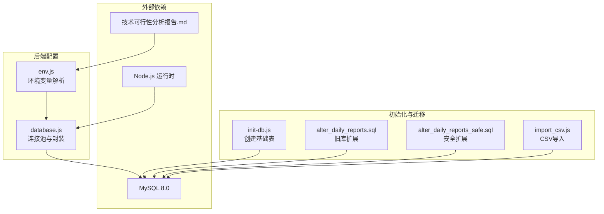
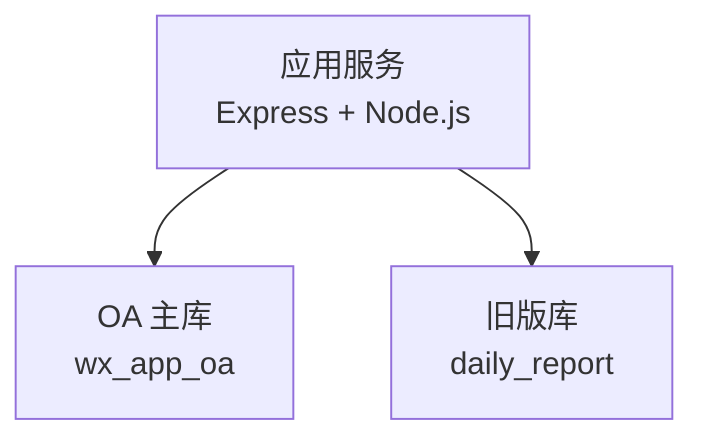
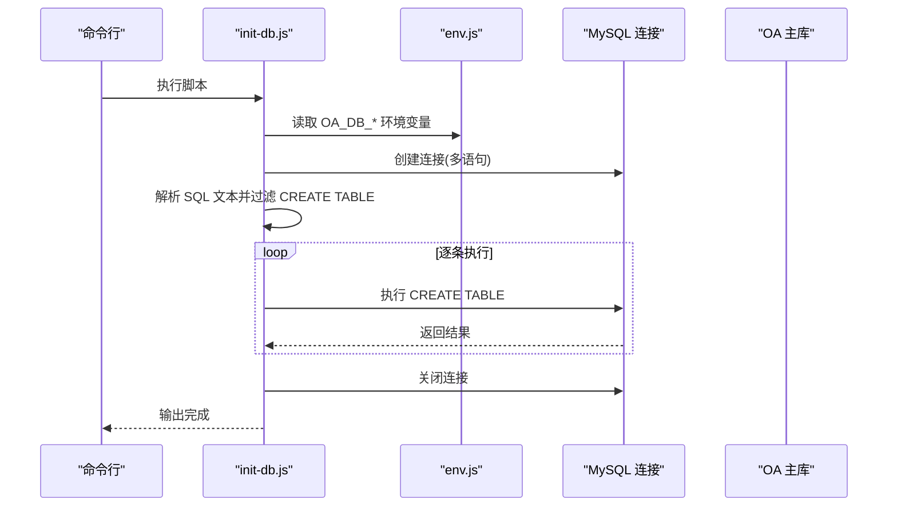
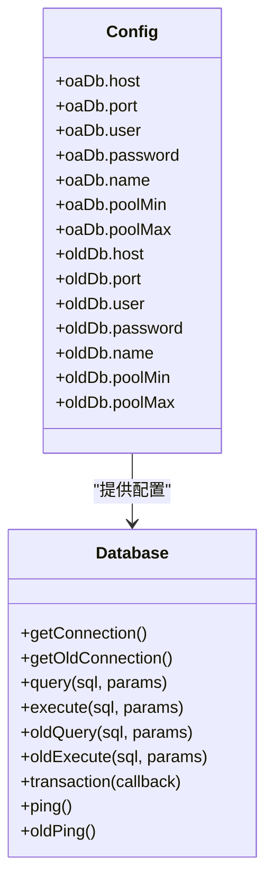
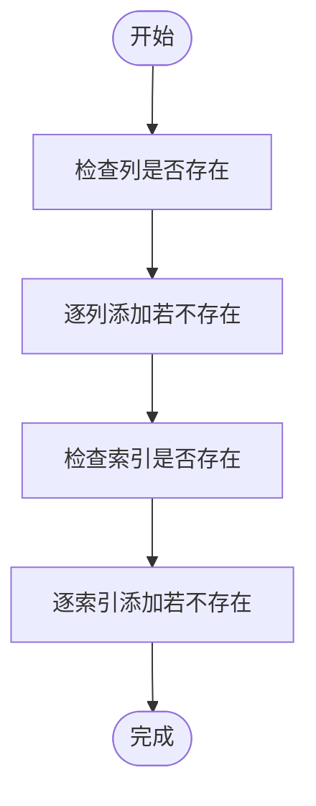
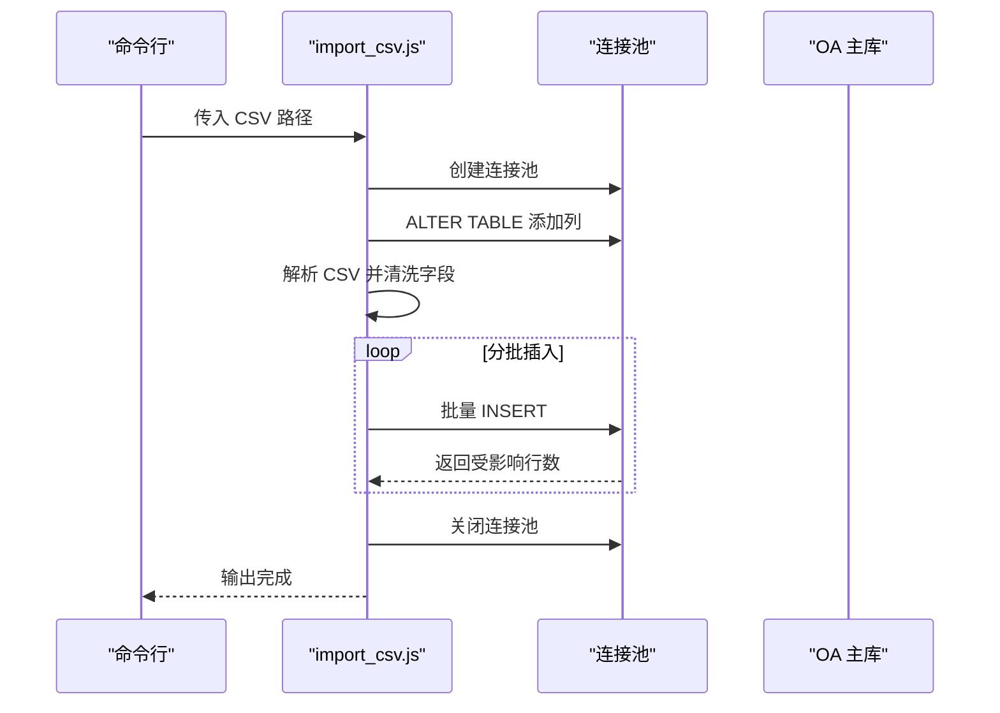
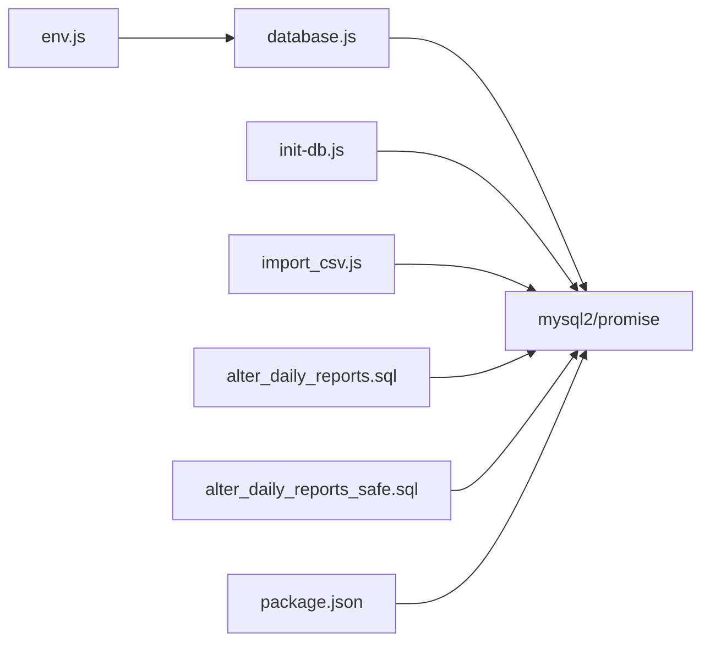

# MySQL 数据库部署

<cite>
**本文引用的文件**
- [database.js](file://backend/src/common/config/database.js)
- [env.js](file://backend/src/common/config/env.js)
- [init-db.js](file://backend/scripts/init-db.js)
- [alter_daily_reports.sql](file://backend/scripts/alter_daily_reports.sql)
- [alter_daily_reports_safe.sql](file://backend/scripts/alter_daily_reports_safe.sql)
- [import_csv.js](file://backend/scripts/import_csv.js)
- [package.json](file://backend/package.json)
- [技术可行性分析报告.md](file://backend/docs/技术可行性分析报告.md)
</cite>

## 目录
1. [简介](#简介)
2. [项目结构](#项目结构)
3. [核心组件](#核心组件)
4. [架构总览](#架构总览)
5. [详细组件分析](#详细组件分析)
6. [依赖关系分析](#依赖关系分析)
7. [性能考虑](#性能考虑)
8. [故障排查指南](#故障排查指南)
9. [结论](#结论)
10. [附录](#附录)

## 简介
本文件面向智慧办公助手 OA 系统的 MySQL 数据库部署与运维，覆盖安装与配置、初始化脚本执行流程、连接配置与参数、性能优化建议、备份与恢复策略、数据迁移与版本升级最佳实践。文档基于仓库中的实际代码与文档进行梳理，帮助开发者与运维人员快速、安全地完成数据库部署与日常维护。

## 项目结构
与数据库相关的关键文件分布如下：
- 运行时数据库连接与封装：backend/src/common/config/database.js
- 环境变量与数据库配置：backend/src/common/config/env.js
- 初始化数据库脚本：backend/scripts/init-db.js
- 旧库扩展与安全迁移脚本：backend/scripts/alter_daily_reports.sql、backend/scripts/alter_daily_reports_safe.sql
- 数据导入脚本（CSV → daily_reports）：backend/scripts/import_csv.js
- 项目脚本与依赖：backend/package.json
- 部署与配置参考：backend/docs/技术可行性分析报告.md

图表来源
- [database.js:11-43](file://backend/src/common/config/database.js#L11-L43)
- [env.js:50-78](file://backend/src/common/config/env.js#L50-L78)
- [init-db.js:18-322](file://backend/scripts/init-db.js#L18-L322)
- [alter_daily_reports.sql:1-29](file://backend/scripts/alter_daily_reports.sql#L1-L29)
- [alter_daily_reports_safe.sql:1-87](file://backend/scripts/alter_daily_reports_safe.sql#L1-L87)
- [import_csv.js:1-319](file://backend/scripts/import_csv.js#L1-L319)

章节来源
- [database.js:1-222](file://backend/src/common/config/database.js#L1-L222)
- [env.js:1-118](file://backend/src/common/config/env.js#L1-L118)
- [init-db.js:1-374](file://backend/scripts/init-db.js#L1-L374)
- [alter_daily_reports.sql:1-29](file://backend/scripts/alter_daily_reports.sql#L1-L29)
- [alter_daily_reports_safe.sql:1-87](file://backend/scripts/alter_daily_reports_safe.sql#L1-L87)
- [import_csv.js:1-319](file://backend/scripts/import_csv.js#L1-L319)
- [package.json:1-58](file://backend/package.json#L1-L58)
- [技术可行性分析报告.md:146-166](file://backend/docs/技术可行性分析报告.md#L146-L166)

## 核心组件
- 环境变量与数据库配置：集中管理 OA 与旧版数据库的主机、端口、用户、密码、库名、连接池大小等，并在启动时校验必需变量。
- 连接池封装：提供 OA 主库与旧版库两套连接池，支持事务、参数化查询、日志记录与连通性检测。
- 初始化脚本：批量创建系统所需的基础表，包含用户、部门、审批、日报、消息、公告、项目、任务、资产、操作日志、系统配置等。
- 迁移与扩展脚本：对旧库 daily_reports 表进行字段与索引扩展，提供安全版本以避免重复执行导致的错误。
- 数据导入脚本：将 CSV 数据解析并批量导入到新库的 daily_reports 表中，支持字段清洗与批量插入。
- 项目脚本：提供 init-db 与 migrate 等脚本入口，便于一键执行数据库初始化与迁移。

章节来源
- [env.js:13-41](file://backend/src/common/config/env.js#L13-L41)
- [database.js:11-24](file://backend/src/common/config/database.js#L11-L24)
- [database.js:30-43](file://backend/src/common/config/database.js#L30-L43)
- [init-db.js:18-322](file://backend/scripts/init-db.js#L18-L322)
- [alter_daily_reports.sql:7-28](file://backend/scripts/alter_daily_reports.sql#L7-L28)
- [alter_daily_reports_safe.sql:6-86](file://backend/scripts/alter_daily_reports_safe.sql#L6-L86)
- [import_csv.js:19-55](file://backend/scripts/import_csv.js#L19-L55)
- [package.json:6-14](file://backend/package.json#L6-L14)

## 架构总览
数据库层采用双库架构：
- OA 主库（wx_app_oa）：承载新业务的所有表结构与数据。
- 旧版库（daily_report）：仅保留用户表等历史数据，用于兼容与迁移。

图表来源
- [database.js:11-43](file://backend/src/common/config/database.js#L11-L43)

章节来源
- [database.js:11-43](file://backend/src/common/config/database.js#L11-L43)

## 详细组件分析

### 数据库初始化脚本 init-db.js
该脚本负责在 OA 主库中创建所有基础表，包含完整的表结构、索引与约束定义。执行流程如下：
- 读取环境变量中的 OA 数据库连接信息。
- 创建连接（支持多语句）。
- 解析 SQL 文本，提取 CREATE TABLE 语句并逐条执行。
- 记录每个表的创建结果，最终输出完成信息。

图表来源
- [init-db.js:327-370](file://backend/scripts/init-db.js#L327-L370)
- [env.js:58-67](file://backend/src/common/config/env.js#L58-L67)

章节来源
- [init-db.js:18-374](file://backend/scripts/init-db.js#L18-L374)
- [env.js:58-67](file://backend/src/common/config/env.js#L58-L67)

### 数据库连接配置与封装
- 连接池参数
  - OA 主库：host、port、user、password、database、waitForConnections、connectionLimit、queueLimit、enableKeepAlive、keepAliveInitialDelay、charset、timezone。
  - 旧版库：同 OA 主库参数，但连接池上限不同。
- 查询与执行
  - 提供参数化 query 与 execute，支持事务 transaction。
  - 提供旧版库的查询与执行方法，便于迁移期间的数据互通。
- 连通性检测
  - 提供 ping 与 oldPing，用于健康检查。

图表来源
- [env.js:58-78](file://backend/src/common/config/env.js#L58-L78)
- [database.js:11-24](file://backend/src/common/config/database.js#L11-L24)
- [database.js:30-43](file://backend/src/common/config/database.js#L30-L43)
- [database.js:65-109](file://backend/src/common/config/database.js#L65-L109)
- [database.js:117-161](file://backend/src/common/config/database.js#L117-L161)
- [database.js:168-181](file://backend/src/common/config/database.js#L168-L181)
- [database.js:187-207](file://backend/src/common/config/database.js#L187-L207)

章节来源
- [database.js:11-24](file://backend/src/common/config/database.js#L11-L24)
- [database.js:30-43](file://backend/src/common/config/database.js#L30-L43)
- [database.js:65-109](file://backend/src/common/config/database.js#L65-L109)
- [database.js:117-161](file://backend/src/common/config/database.js#L117-L161)
- [database.js:168-181](file://backend/src/common/config/database.js#L168-L181)
- [database.js:187-207](file://backend/src/common/config/database.js#L187-L207)
- [env.js:58-78](file://backend/src/common/config/env.js#L58-L78)

### 旧库扩展与安全迁移
- alter_daily_reports.sql：为旧库 daily_reports 表添加字段与索引，适用于一次性补全场景。
- alter_daily_reports_safe.sql：通过信息表检查列与索引是否存在，避免重复执行报错，适合生产环境的安全迁移。

图表来源
- [alter_daily_reports_safe.sql:8-86](file://backend/scripts/alter_daily_reports_safe.sql#L8-L86)

章节来源
- [alter_daily_reports.sql:7-28](file://backend/scripts/alter_daily_reports.sql#L7-L28)
- [alter_daily_reports_safe.sql:8-86](file://backend/scripts/alter_daily_reports_safe.sql#L8-L86)

### 数据导入脚本 import_csv.js
该脚本用于将 CSV 数据导入到 OA 主库的 daily_reports 表中，流程分为三步：
- 第一步：ALTER TABLE 为 daily_reports 表添加所需字段。
- 第二步：解析 CSV，清洗字段，构造记录集合。
- 第三步：批量插入，分批提交，提升性能与稳定性。

图表来源
- [import_csv.js:18-55](file://backend/scripts/import_csv.js#L18-L55)
- [import_csv.js:58-193](file://backend/scripts/import_csv.js#L58-L193)
- [import_csv.js:196-252](file://backend/scripts/import_csv.js#L196-L252)
- [import_csv.js:291-318](file://backend/scripts/import_csv.js#L291-L318)

章节来源
- [import_csv.js:1-319](file://backend/scripts/import_csv.js#L1-L319)

## 依赖关系分析
- 环境变量依赖：数据库连接参数由 env.js 读取并校验，database.js 依赖 env.js 提供的配置。
- 脚本依赖：init-db.js 与 import_csv.js 依赖 mysql2/promise 与 dotenv；package.json 中声明了 mysql2 依赖。
- 迁移脚本：alter_daily_reports.sql 与 alter_daily_reports_safe.sql 直接作用于旧库 daily_report。

图表来源
- [env.js:1-118](file://backend/src/common/config/env.js#L1-L118)
- [database.js:1-222](file://backend/src/common/config/database.js#L1-L222)
- [init-db.js:1-374](file://backend/scripts/init-db.js#L1-L374)
- [import_csv.js:1-319](file://backend/scripts/import_csv.js#L1-L319)
- [alter_daily_reports.sql:1-29](file://backend/scripts/alter_daily_reports.sql#L1-L29)
- [alter_daily_reports_safe.sql:1-87](file://backend/scripts/alter_daily_reports_safe.sql#L1-L87)
- [package.json:16-35](file://backend/package.json#L16-L35)

章节来源
- [env.js:1-118](file://backend/src/common/config/env.js#L1-L118)
- [database.js:1-222](file://backend/src/common/config/database.js#L1-L222)
- [init-db.js:1-374](file://backend/scripts/init-db.js#L1-L374)
- [import_csv.js:1-319](file://backend/scripts/import_csv.js#L1-L319)
- [alter_daily_reports.sql:1-29](file://backend/scripts/alter_daily_reports.sql#L1-L29)
- [alter_daily_reports_safe.sql:1-87](file://backend/scripts/alter_daily_reports_safe.sql#L1-L87)
- [package.json:16-35](file://backend/package.json#L16-L35)

## 性能考虑
- 连接池参数
  - OA 主库连接池上限可在环境变量中配置，默认最小 2、最大 10；旧版库默认最小 1、最大 5。
  - 连接池启用 keep-alive，减少频繁握手开销。
- 字符集与时区
  - 统一使用 utf8mb4 字符集与 +08:00 时区，保证中文与时间显示一致。
- 查询与执行
  - 使用参数化查询与 execute，避免 SQL 注入并提升执行效率。
  - 事务封装确保多步操作的一致性。
- 批量导入
  - import_csv.js 采用分批插入，降低单次事务压力，提升导入稳定性。

章节来源
- [env.js:65-77](file://backend/src/common/config/env.js#L65-L77)
- [database.js:17-24](file://backend/src/common/config/database.js#L17-L24)
- [database.js:37-43](file://backend/src/common/config/database.js#L37-L43)
- [import_csv.js:196-252](file://backend/scripts/import_csv.js#L196-L252)

## 故障排查指南
- 环境变量缺失
  - 启动时会校验必需变量，如缺失会抛出错误。请检查 .env 中的 OA_DB_* 与 OLD_DB_* 变量。
- 连接失败
  - 使用 ping 与 oldPing 方法进行连通性检测；如失败，检查主机、端口、用户、密码与网络策略。
- 初始化失败
  - init-db.js 会在创建表过程中输出每个表的创建结果；若失败，请查看具体错误信息并修正 SQL。
- 迁移冲突
  - 使用安全扩展脚本 alter_daily_reports_safe.sql，避免重复添加列或索引。
- 导入异常
  - import_csv.js 会输出 CSV 解析与插入进度；遇到错误时检查 CSV 格式与字段映射。

章节来源
- [env.js:34-41](file://backend/src/common/config/env.js#L34-L41)
- [database.js:187-207](file://backend/src/common/config/database.js#L187-L207)
- [init-db.js:354-360](file://backend/scripts/init-db.js#L354-L360)
- [alter_daily_reports_safe.sql:8-86](file://backend/scripts/alter_daily_reports_safe.sql#L8-L86)
- [import_csv.js:12-15](file://backend/scripts/import_csv.js#L12-L15)
- [import_csv.js:242-249](file://backend/scripts/import_csv.js#L242-L249)

## 结论
本部署文档基于仓库中的实际代码与文档，提供了从环境变量配置、连接池封装、初始化脚本执行、旧库迁移与扩展、数据导入到性能优化与故障排查的完整流程。按照本文档执行，可确保 OA 系统数据库的稳定部署与高效运维。

## 附录

### 环境变量与默认值
- OA 主库
  - OA_DB_HOST、OA_DB_PORT（默认 3306）、OA_DB_USER、OA_DB_PASSWORD、OA_DB_NAME、OA_DB_POOL_MIN（默认 2）、OA_DB_POOL_MAX（默认 10）
- 旧版库
  - OLD_DB_HOST、OLD_DB_PORT（默认 3306）、OLD_DB_USER、OLD_DB_PASSWORD、OLD_DB_NAME、OLD_DB_POOL_MIN（默认 1）、OLD_DB_POOL_MAX（默认 5）

章节来源
- [env.js:58-78](file://backend/src/common/config/env.js#L58-L78)
- [技术可行性分析报告.md:146-166](file://backend/docs/技术可行性分析报告.md#L146-L166)

### 数据库初始化脚本执行步骤
- 准备环境变量与 MySQL 8.0 可用的凭据。
- 执行初始化脚本，自动创建所有基础表。
- 如需对旧库进行扩展，可选择一次性或安全模式执行扩展脚本。
- 如需从 CSV 导入数据，准备 CSV 文件并执行导入脚本。

章节来源
- [init-db.js:327-370](file://backend/scripts/init-db.js#L327-L370)
- [alter_daily_reports.sql:7-28](file://backend/scripts/alter_daily_reports.sql#L7-L28)
- [alter_daily_reports_safe.sql:8-86](file://backend/scripts/alter_daily_reports_safe.sql#L8-L86)
- [import_csv.js:287-318](file://backend/scripts/import_csv.js#L287-L318)

### 备份与恢复策略（建议）
- 备份
  - 使用逻辑备份工具导出数据库结构与数据，定期归档。
  - 对关键表（如 users、daily_reports）增加增量备份策略。
- 恢复
  - 在隔离环境中验证备份完整性。
  - 恢复时先恢复结构，再恢复数据，最后校验索引与约束。
- 注意
  - 生产环境执行备份与恢复前，务必做好停机窗口与回滚预案。

[本节为通用建议，不直接分析具体文件]

### 数据迁移与版本升级最佳实践
- 迁移策略
  - 优先采用“数据同步”方案，逐步将旧库数据迁移到新库，保持新旧库并行一段时间以验证一致性。
  - 使用安全扩展脚本（alter_daily_reports_safe.sql）进行字段与索引扩展，避免重复执行错误。
- 版本升级
  - 通过脚本化的方式执行 SQL 变更，配合版本号与变更记录，确保可追踪与可回滚。
  - 对涉及表结构的重大变更，先在测试环境验证，再在预生产环境灰度，最后上线。

章节来源
- [技术可行性分析报告.md:375-426](file://backend/docs/技术可行性分析报告.md#L375-L426)
- [alter_daily_reports_safe.sql:8-86](file://backend/scripts/alter_daily_reports_safe.sql#L8-L86)