# Redis 缓存部署

<cite>
**本文档引用的文件**
- [redis.js](file://backend/src/common/config/redis.js)
- [env.js](file://backend/src/common/config/env.js)
- [app.js](file://backend/src/app.js)
- [redis.test.js](file://backend/tests/unit/config/redis.test.js)
- [env.test.js](file://backend/tests/unit/config/env.test.js)
- [技术可行性分析报告.md](file://backend/docs/技术可行性分析报告.md)
- [package.json](file://backend/package.json)
</cite>

## 目录
1. [简介](#简介)
2. [项目结构](#项目结构)
3. [核心组件](#核心组件)
4. [架构概览](#架构概览)
5. [详细组件分析](#详细组件分析)
6. [部署方案](#部署方案)
7. [性能优化配置](#性能优化配置)
8. [监控与故障排查](#监控与故障排查)
9. [备份与恢复策略](#备份与恢复策略)
10. [最佳实践](#最佳实践)
11. [故障排查指南](#故障排查指南)
12. [总结](#总结)

## 简介

智慧办公助手 OA 系统采用 Redis 作为缓存层，为系统提供高性能的数据缓存能力。Redis 6.x 作为缓存解决方案，主要用于会话存储、API 响应缓存和热点数据缓存，显著降低数据库查询压力，提升系统整体性能。

本项目使用 Redis 4.6.0 版本，通过官方客户端库实现连接管理和数据操作。系统实现了完善的连接管理机制，包括连接池、重连策略、错误处理和优雅关闭等功能。

## 项目结构

Redis 缓存相关的核心文件位于后端项目的配置目录中：

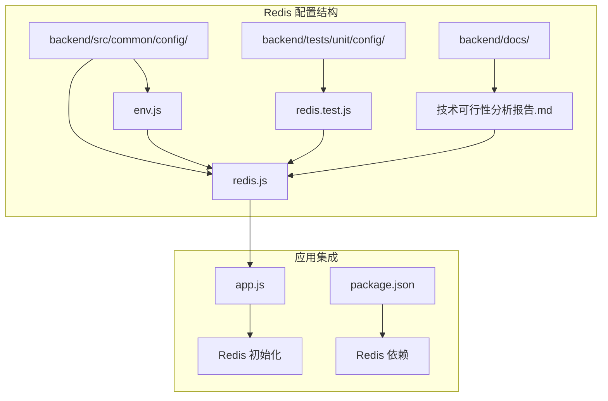
```mermaid
graph TB
subgraph "Redis 配置结构"
A[backend/src/common/config/] --> B[redis.js]
A --> C[env.js]
D[backend/tests/unit/config/] --> E[redis.test.js]
F[backend/docs/] --> G[技术可行性分析报告.md]
end
subgraph "应用集成"
H[app.js] --> I[Redis 初始化]
J[package.json] --> K[Redis 依赖]
end
B --> H
C --> B
E --> B
G --> B
```

**图表来源**
- [redis.js:1-101](file://backend/src/common/config/redis.js#L1-L101)
- [env.js:1-118](file://backend/src/common/config/env.js#L1-L118)
- [app.js:155-164](file://backend/src/app.js#L155-L164)

**章节来源**
- [redis.js:1-101](file://backend/src/common/config/redis.js#L1-L101)
- [env.js:1-118](file://backend/src/common/config/env.js#L1-L118)
- [app.js:155-164](file://backend/src/app.js#L155-L164)

## 核心组件

### Redis 客户端管理器

系统实现了专门的 Redis 客户端管理器，负责连接生命周期管理和错误处理：

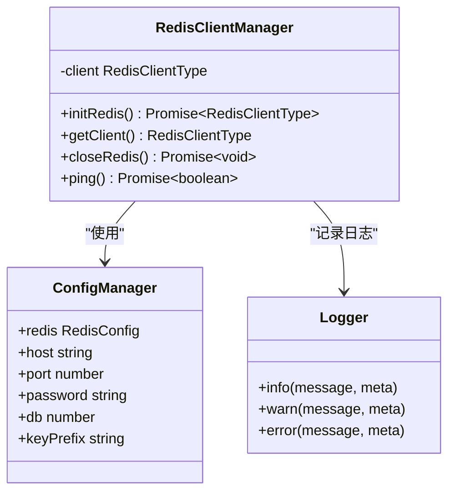
```mermaid
classDiagram
class RedisClientManager {
-client RedisClientType
+initRedis() Promise~RedisClientType~
+getClient() RedisClientType
+closeRedis() Promise~void~
+ping() Promise~boolean~
}
class ConfigManager {
+redis RedisConfig
+host string
+port number
+password string
+db number
+keyPrefix string
}
class Logger {
+info(message, meta)
+warn(message, meta)
+error(message, meta)
}
RedisClientManager --> ConfigManager : "使用"
RedisClientManager --> Logger : "记录日志"
```

**图表来源**
- [redis.js:10-101](file://backend/src/common/config/redis.js#L10-L101)
- [env.js:80-87](file://backend/src/common/config/env.js#L80-L87)

### 连接配置管理

系统通过环境变量管理 Redis 连接配置，支持多种部署场景：

| 配置项 | 默认值 | 用途 | 环境变量 |
|--------|--------|------|----------|
| host | 127.0.0.1 | Redis 服务器地址 | REDIS_HOST |
| port | 6379 | Redis 端口号 | REDIS_PORT |
| password | 空字符串 | 认证密码 | REDIS_PASSWORD |
| db | 0 | 数据库索引 | REDIS_DB |
| keyPrefix | 'oa:' | 键前缀 | REDIS_KEY_PREFIX |

**章节来源**
- [env.js:80-87](file://backend/src/common/config/env.js#L80-L87)
- [redis.js:21-23](file://backend/src/common/config/redis.js#L21-L23)

## 架构概览

### 系统架构图

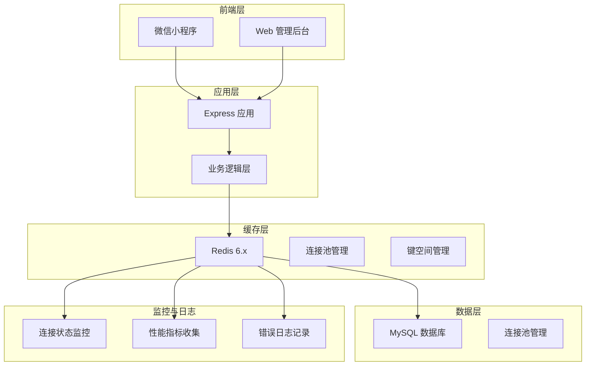
```mermaid
graph TB
subgraph "前端层"
A[微信小程序]
B[Web 管理后台]
end
subgraph "应用层"
C[Express 应用]
D[业务逻辑层]
end
subgraph "缓存层"
E[Redis 6.x]
F[连接池管理]
G[键空间管理]
end
subgraph "数据层"
H[MySQL 数据库]
I[连接池管理]
end
A --> C
B --> C
C --> D
D --> E
E --> H
subgraph "监控与日志"
J[连接状态监控]
K[性能指标收集]
L[错误日志记录]
end
E --> J
E --> K
E --> L
```

**图表来源**
- [app.js:155-164](file://backend/src/app.js#L155-L164)
- [redis.js:16-57](file://backend/src/common/config/redis.js#L16-L57)

### 连接流程图

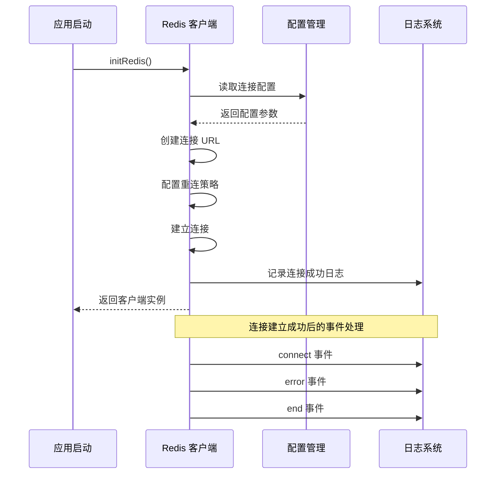
```mermaid
sequenceDiagram
participant App as 应用启动
participant Redis as Redis 客户端
participant Config as 配置管理
participant Logger as 日志系统
App->>Redis : initRedis()
Redis->>Config : 读取连接配置
Config-->>Redis : 返回配置参数
Redis->>Redis : 创建连接 URL
Redis->>Redis : 配置重连策略
Redis->>Redis : 建立连接
Redis->>Logger : 记录连接成功日志
Redis-->>App : 返回客户端实例
Note over Redis,Logger : 连接建立成功后的事件处理
Redis->>Logger : connect 事件
Redis->>Logger : error 事件
Redis->>Logger : end 事件
```

**图表来源**
- [redis.js:16-57](file://backend/src/common/config/redis.js#L16-L57)
- [app.js:155-164](file://backend/src/app.js#L155-L164)

## 详细组件分析

### 连接管理组件

#### 初始化流程

Redis 客户端初始化过程包含多个关键步骤：

1. **连接状态检查**：避免重复初始化
2. **配置参数构建**：从环境变量读取配置
3. **URL 构造**：根据认证信息构造连接字符串
4. **重连策略配置**：设置指数退避算法
5. **事件监听**：注册连接状态事件处理器

#### 重连策略

系统实现了智能的重连机制：

```mermaid
flowchart TD
Start([连接断开]) --> RetryCount{重试次数}
RetryCount --> |超过10次| Fail[连接失败]
RetryCount --> |≤10次| Delay[计算延迟时间]
Delay --> CalcDelay[延迟 = min(重试×100ms, 3000ms)]
CalcDelay --> Connect[重新连接]
Connect --> Success{连接成功?}
Success --> |是| Ready[连接就绪]
Success --> |否| RetryCount
Ready --> Monitor[监控连接状态]
Monitor --> Event{事件发生?}
Event --> |connect| LogConnect[记录连接日志]
Event --> |error| LogError[记录错误日志]
Event --> |end| LogEnd[记录断开日志]
LogConnect --> Monitor
LogError --> Monitor
LogEnd --> Monitor
```

**图表来源**
- [redis.js:28-34](file://backend/src/common/config/redis.js#L28-L34)

**章节来源**
- [redis.js:16-57](file://backend/src/common/config/redis.js#L16-L57)

### 键空间管理

#### 键前缀策略

系统使用统一的键前缀策略，确保键空间的组织性和安全性：

- **默认前缀**：`oa:` - 项目标识
- **可配置性**：通过环境变量 `REDIS_KEY_PREFIX` 自定义
- **命名规范**：采用 `前缀:模块:类型:标识符` 的格式

#### 键空间设计原则

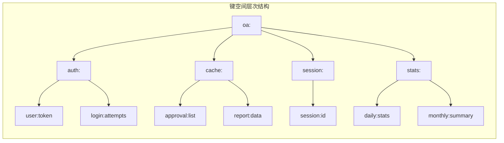
```mermaid
graph LR
subgraph "键空间层次结构"
A[oa:] --> B[auth:]
A --> C[cache:]
A --> D[session:]
A --> E[stats:]
B --> F[user:token]
B --> G[login:attempts]
C --> H[approval:list]
C --> I[report:data]
D --> J[session:id]
E --> K[daily:stats]
E --> L[monthly:summary]
end
```

**图表来源**
- [env.js:86](file://backend/src/common/config/env.js#L86)
- [redis.js:21-23](file://backend/src/common/config/redis.js#L21-L23)

**章节来源**
- [env.js:86](file://backend/src/common/config/env.js#L86)
- [redis.js:21-23](file://backend/src/common/config/redis.js#L21-L23)

### 错误处理机制

#### 异常处理策略

系统实现了多层次的错误处理机制：

1. **连接异常**：记录错误并触发重连
2. **操作异常**：捕获异常并返回默认值
3. **优雅降级**：Redis 不可用时回退到数据库
4. **资源清理**：确保连接正确关闭

#### 错误恢复流程

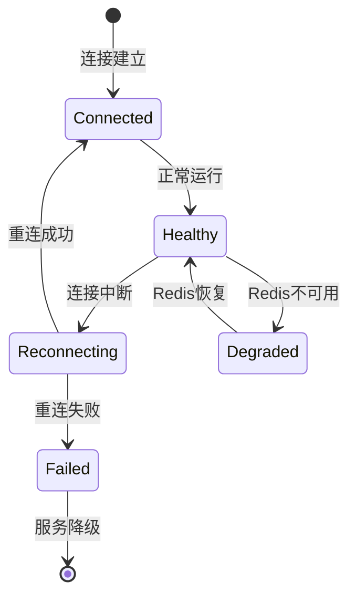
```mermaid
stateDiagram-v2
[*] --> Connected : 连接建立
Connected --> Healthy : 正常运行
Healthy --> Reconnecting : 连接中断
Reconnecting --> Connected : 重连成功
Reconnecting --> Failed : 重连失败
Failed --> [*] : 服务降级
Healthy --> Degraded : Redis不可用
Degraded --> Healthy : Redis恢复
```

**图表来源**
- [redis.js:47-53](file://backend/src/common/config/redis.js#L47-L53)

**章节来源**
- [redis.js:47-53](file://backend/src/common/config/redis.js#L47-L53)

## 部署方案

### 单机模式部署

#### 安装步骤

```bash
# 1. 更新包列表并安装 Redis
sudo apt update
sudo apt install -y redis-server

# 2. 验证安装版本
redis-server --version

# 3. 启动并设置开机自启
sudo systemctl start redis-server
sudo systemctl enable redis-server
sudo systemctl status redis-server
```

#### 基础配置

```bash
# 1. 备份原始配置
sudo cp /etc/redis/redis.conf /etc/redis/redis.conf.bak

# 2. 基础安全配置
sudo sed -i 's/^bind .*/bind 127.0.0.1/' /etc/redis/redis.conf
sudo sed -i 's/^port .*/port 6379/' /etc/redis/redis.conf

# 3. 内存限制配置
sudo sed -i 's/^# maxmemory .*/maxmemory 256mb/' /etc/redis/redis.conf
sudo sed -i 's/^# maxmemory-policy .*/maxmemory-policy allkeys-lru/' /etc/redis/redis.conf

# 4. 开启持久化
sudo sed -i 's/^appendonly no/appendonly yes/' /etc/redis/redis.conf

# 5. 重启服务
sudo systemctl restart redis-server
```

#### 验证连接

```bash
# 本地连接测试
redis-cli ping
# 输出: PONG

# 带密码连接测试
redis-cli -a YourRedisPassword2024 ping

# 基本功能测试
redis-cli set test_key "Hello OA"
redis-cli get test_key
redis-cli del test_key
```

**章节来源**
- [技术可行性分析报告.md:172-247](file://backend/docs/技术可行性分析报告.md#L172-L247)

### 集群模式部署

#### 集群架构设计

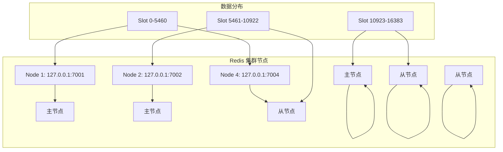
```mermaid
graph TB
subgraph "Redis 集群节点"
A[Node 1: 127.0.0.1:7001] --> C[主节点]
B[Node 2: 127.0.0.1:7002] --> D[主节点]
E[Node 3: 127.0.0.1:7003] --> E[主节点]
F[Node 4: 127.0.0.1:7004] --> G[从节点]
H[Node 5: 127.0.0.1:7005] --> H[从节点]
I[Node 6: 127.0.0.1:7006] --> I[从节点]
end
subgraph "数据分布"
J[Slot 0-5460] --> A
J --> F
K[Slot 5461-10922] --> B
K --> G
L[Slot 10923-16383] --> E
L --> H
end
```

#### 集群配置要点

| 配置项 | 主节点 | 从节点 | 说明 |
|--------|--------|--------|------|
| port | 7001-7003 | 7004-7006 | 端口范围 |
| cluster-enabled | yes | yes | 启用集群模式 |
| cluster-config-file | nodes-7001.conf | nodes-7004.conf | 配置文件 |
| cluster-node-timeout | 15000 | 15000 | 节点超时时间 |
| appendonly | yes | yes | 持久化开启 |

### 环境配置

#### .env 文件配置

```env
# Redis 连接配置
REDIS_HOST=127.0.0.1
REDIS_PORT=6379
REDIS_PASSWORD=
REDIS_DB=0
REDIS_KEY_PREFIX=oa:

# 应用配置
NODE_ENV=development
PORT=3000
```

**章节来源**
- [技术可行性分析报告.md:249-257](file://backend/docs/技术可行性分析报告.md#L249-L257)
- [env.js:24-87](file://backend/src/common/config/env.js#L24-L87)

## 性能优化配置

### 内存配置优化

#### 内存管理策略

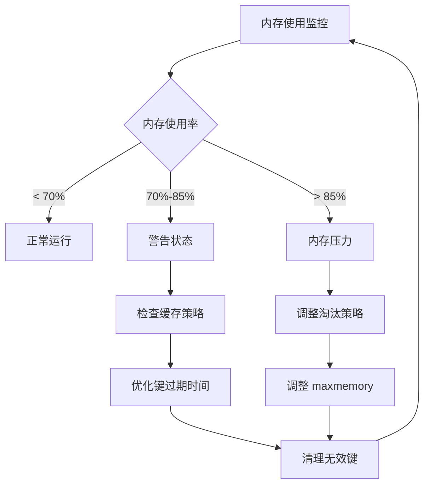
```mermaid
flowchart TD
A[内存使用监控] --> B{内存使用率}
B --> |< 70%| C[正常运行]
B --> |70%-85%| D[警告状态]
B --> |> 85%| E[内存压力]
D --> F[检查缓存策略]
E --> G[调整淘汰策略]
F --> H[优化键过期时间]
G --> I[调整 maxmemory]
H --> J[清理无效键]
I --> J
J --> A
```

#### 关键配置参数

| 参数 | 建议值 | 说明 |
|------|--------|------|
| maxmemory | 256MB | 根据服务器内存调整 |
| maxmemory-policy | allkeys-lru | LRU 淘汰策略 |
| hash-max-ziplist-entries | 512 | 哈希优化 |
| hash-max-ziplist-value | 64 | 哈希优化 |
| list-max-ziplist-size | -2 | 列表优化 |
| zset-max-ziplist-entries | 128 | 集合优化 |
| zset-max-ziplist-value | 64 | 集合优化 |

### 持久化配置优化

#### AOF 持久化配置

```bash
# AOF 配置优化
echo "appendonly yes" >> /etc/redis/redis.conf
echo "appendfsync everysec" >> /etc/redis/redis.conf
echo "auto-aof-rewrite-percentage 100" >> /etc/redis/redis.conf
echo "auto-aof-rewrite-min-size 64mb" >> /etc/redis/redis.conf
```

#### RDB 快照配置

```bash
# RDB 配置优化
echo "save 900 1" >> /etc/redis/redis.conf
echo "save 300 10" >> /etc/redis/redis.conf
echo "save 60 10000" >> /etc/redis/redis.conf
echo "stop-writes-on-bgsave-error yes" >> /etc/redis/redis.conf
```

### 网络优化配置

#### TCP/IP 优化

```bash
# 网络参数优化
echo "tcp-keepalive 300" >> /etc/redis/redis.conf
echo "tcp-keepalive-interval 60" >> /etc/redis/redis.conf
echo "tcp-keepalive-probes 3" >> /etc/redis/redis.conf
echo "timeout 0" >> /etc/redis/redis.conf
echo "tcp-nodelay yes" >> /etc/redis/redis.conf
```

#### 连接池优化

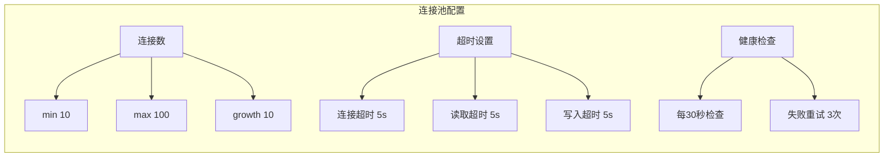
```mermaid
graph LR
subgraph "连接池配置"
A[连接数] --> B[min 10]
A --> C[max 100]
A --> D[growth 10]
E[超时设置] --> F[连接超时 5s]
E --> G[读取超时 5s]
E --> H[写入超时 5s]
I[健康检查] --> J[每30秒检查]
I --> K[失败重试 3次]
end
```

**章节来源**
- [技术可行性分析报告.md:202-231](file://backend/docs/技术可行性分析报告.md#L202-L231)

## 监控与故障排查

### 监控指标

#### 连接状态监控

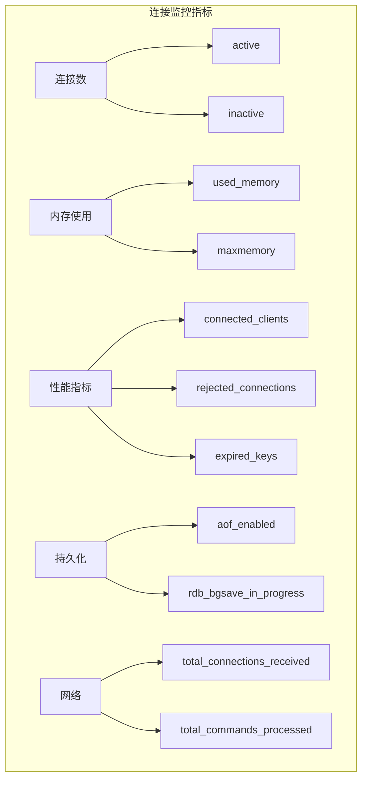
```mermaid
graph TB
subgraph "连接监控指标"
A[连接数] --> A1[active]
A --> A2[inactive]
B[内存使用] --> B1[used_memory]
B --> B2[maxmemory]
C[性能指标] --> C1[connected_clients]
C --> C2[rejected_connections]
C --> C3[expired_keys]
D[持久化] --> D1[aof_enabled]
D --> D2[rdb_bgsave_in_progress]
E[网络] --> E1[total_connections_received]
E --> E2[total_commands_processed]
end
```

#### 关键监控命令

```bash
# 基本状态检查
redis-cli info server
redis-cli info clients
redis-cli info memory
redis-cli info persistence

# 性能监控
redis-cli info stats
redis-cli info replication
redis-cli info cpu

# 键空间监控
redis-cli dbsize
redis-cli info keyspace
```

### 故障排查流程

#### 连接问题排查

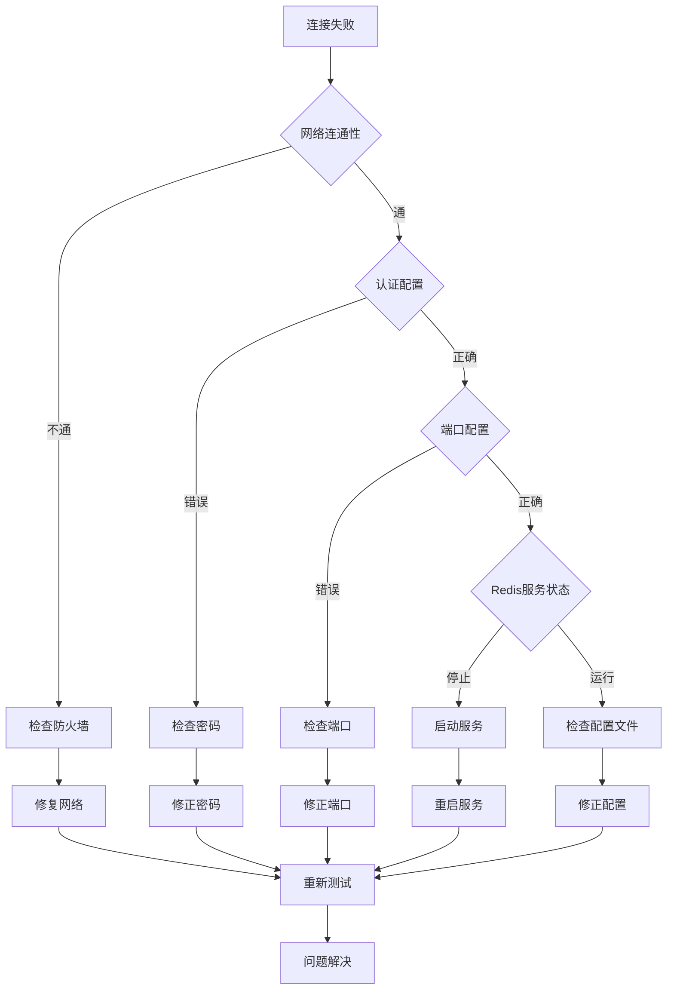
```mermaid
flowchart TD
A[连接失败] --> B{网络连通性}
B --> |不通| C[检查防火墙]
B --> |通| D{认证配置}
D --> |错误| E[检查密码]
D --> |正确| F{端口配置}
F --> |错误| G[检查端口]
F --> |正确| H{Redis服务状态}
H --> |停止| I[启动服务]
H --> |运行| J[检查配置文件]
C --> K[修复网络]
E --> L[修正密码]
G --> M[修正端口]
I --> N[重启服务]
J --> O[修正配置]
K --> P[重新测试]
L --> P
M --> P
N --> P
O --> P
P --> Q[问题解决]
```

#### 性能问题诊断

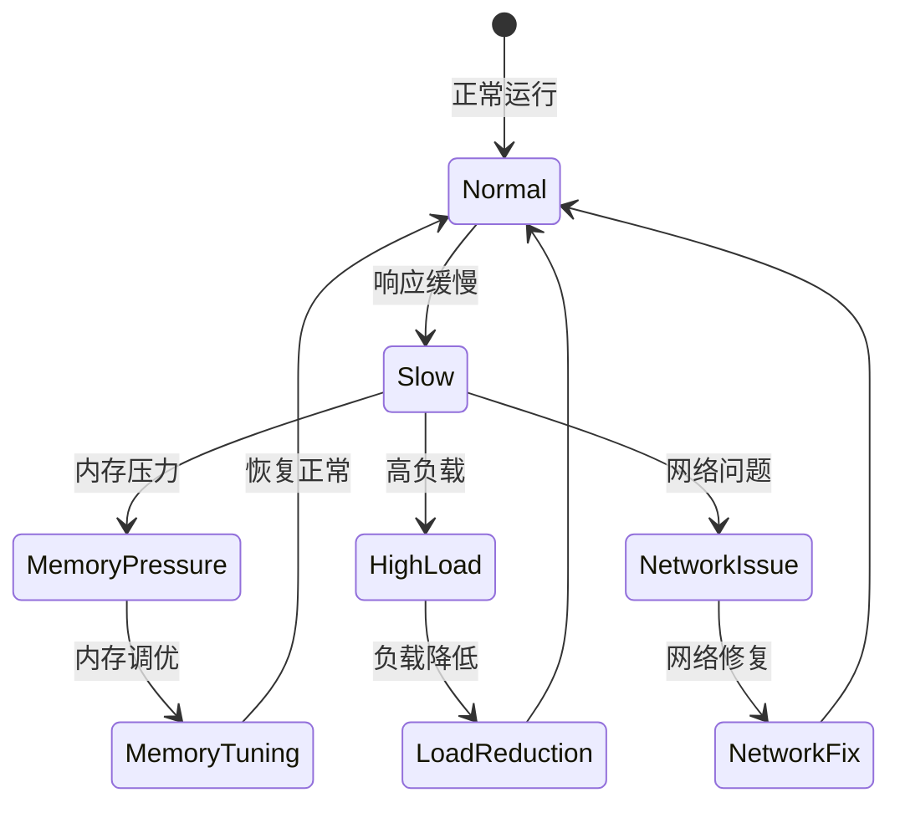
```mermaid
stateDiagram-v2
[*] --> Normal : 正常运行
Normal --> Slow : 响应缓慢
Slow --> MemoryPressure : 内存压力
Slow --> HighLoad : 高负载
Slow --> NetworkIssue : 网络问题
MemoryPressure --> MemoryTuning : 内存调优
HighLoad --> LoadReduction : 负载降低
NetworkIssue --> NetworkFix : 网络修复
MemoryTuning --> Normal : 恢复正常
LoadReduction --> Normal
NetworkFix --> Normal
```

**章节来源**
- [redis.js:47-53](file://backend/src/common/config/redis.js#L47-L53)

### 日志分析

#### 日志配置

系统实现了完整的日志记录机制：

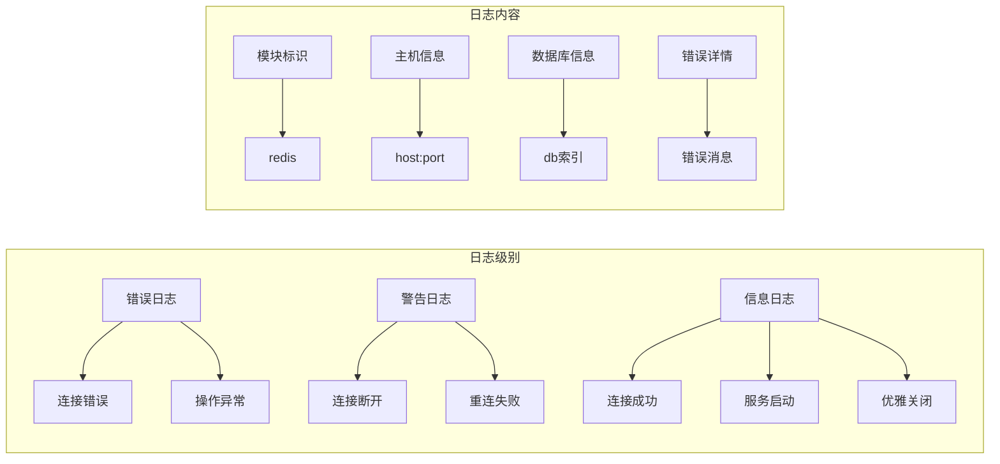
```mermaid
graph LR
subgraph "日志级别"
A[错误日志] --> B[连接错误]
A --> C[操作异常]
D[警告日志] --> E[连接断开]
D --> F[重连失败]
G[信息日志] --> H[连接成功]
G --> I[服务启动]
G --> J[优雅关闭]
end
subgraph "日志内容"
K[模块标识] --> L[redis]
M[主机信息] --> N[host:port]
O[数据库信息] --> P[db索引]
Q[错误详情] --> R[错误消息]
end
```

**章节来源**
- [redis.js:38-53](file://backend/src/common/config/redis.js#L38-L53)

## 备份与恢复策略

### 数据备份策略

#### AOF 备份

```bash
# AOF 文件位置
/var/lib/redis/appendonly.aof

# 备份脚本
#!/bin/bash
# Redis AOF 备份脚本
BACKUP_DIR="/backup/redis"
DATE=$(date +%Y%m%d_%H%M%S)

mkdir -p $BACKUP_DIR/$DATE
cp /var/lib/redis/appendonly.aof $BACKUP_DIR/$DATE/
echo "AOF 备份完成: $BACKUP_DIR/$DATE/appendonly.aof"
```

#### 快照备份

```bash
# RDB 文件位置
/var/lib/redis/dump.rdb

# 快照备份脚本
#!/bin/bash
# Redis RDB 备份脚本
BACKUP_DIR="/backup/redis"
DATE=$(date +%Y%m%d_%H%M%S)

mkdir -p $BACKUP_DIR/$DATE
cp /var/lib/redis/dump.rdb $BACKUP_DIR/$DATE/
echo "RDB 备份完成: $BACKUP_DIR/$DATE/dump.rdb"
```

### 恢复策略

#### AOF 恢复流程

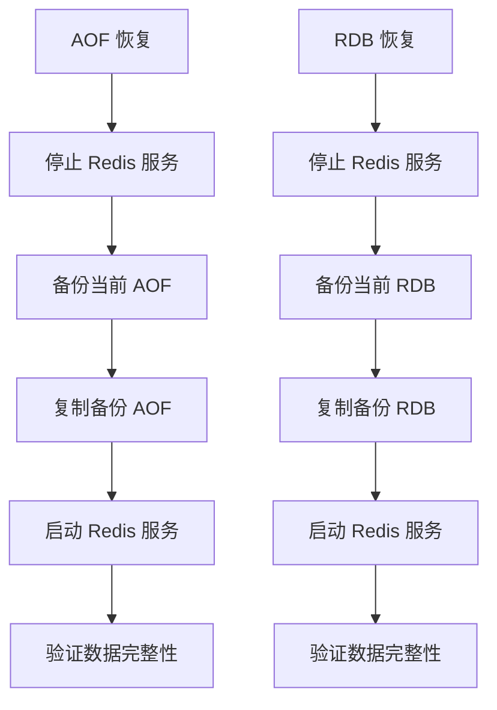
```mermaid
flowchart TD
A[AOF 恢复] --> B[停止 Redis 服务]
B --> C[备份当前 AOF]
C --> D[复制备份 AOF]
D --> E[启动 Redis 服务]
E --> F[验证数据完整性]
G[RDB 恢复] --> H[停止 Redis 服务]
H --> I[备份当前 RDB]
I --> J[复制备份 RDB]
J --> K[启动 Redis 服务]
K --> L[验证数据完整性]
```

#### 数据恢复验证

```bash
# 恢复后验证
redis-cli dbsize
redis-cli info memory
redis-cli ping

# 键空间验证
redis-cli keys "*"
redis-cli ttl "key:prefix:*"
```

**章节来源**
- [技术可行性分析报告.md:226-227](file://backend/docs/技术可行性分析报告.md#L226-L227)

## 最佳实践

### 连接池配置

#### 连接池最佳实践

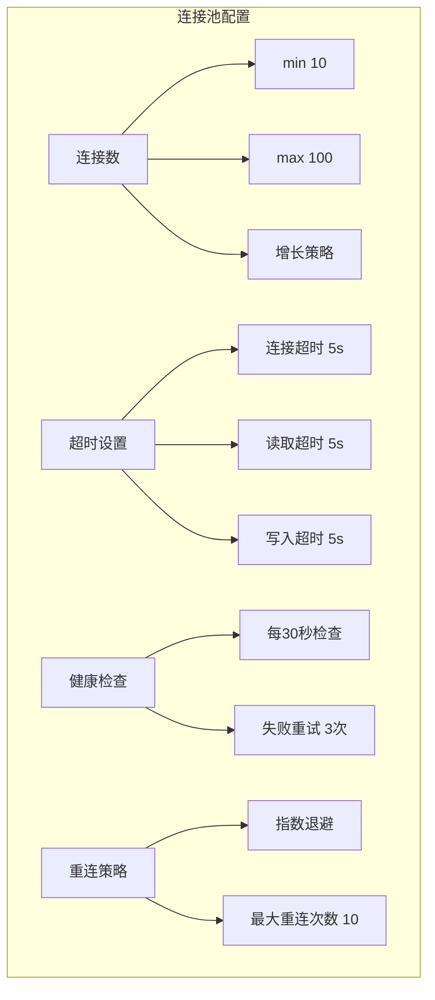
```mermaid
graph TB
subgraph "连接池配置"
A[连接数] --> B[min 10]
A --> C[max 100]
A --> D[增长策略]
E[超时设置] --> F[连接超时 5s]
E --> G[读取超时 5s]
E --> H[写入超时 5s]
I[健康检查] --> J[每30秒检查]
I --> K[失败重试 3次]
L[重连策略] --> M[指数退避]
L --> N[最大重连次数 10]
end
```

#### 键空间管理最佳实践

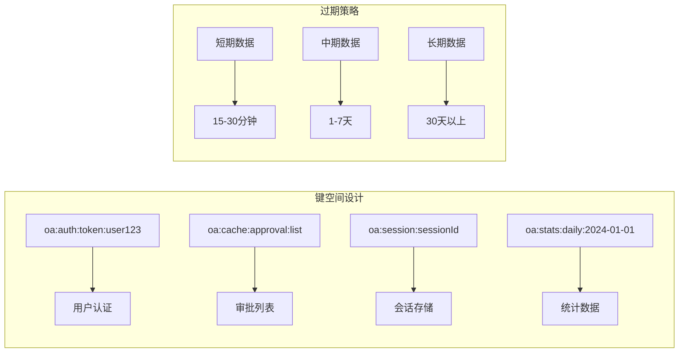
```mermaid
graph LR
subgraph "键空间设计"
A[oa:auth:token:user123] --> B[用户认证]
C[oa:cache:approval:list] --> D[审批列表]
E[oa:session:sessionId] --> F[会话存储]
G[oa:stats:daily:2024-01-01] --> H[统计数据]
end
subgraph "过期策略"
I[短期数据] --> J[15-30分钟]
K[中期数据] --> L[1-7天]
M[长期数据] --> N[30天以上]
end
```

### 缓存策略

#### 缓存层次结构

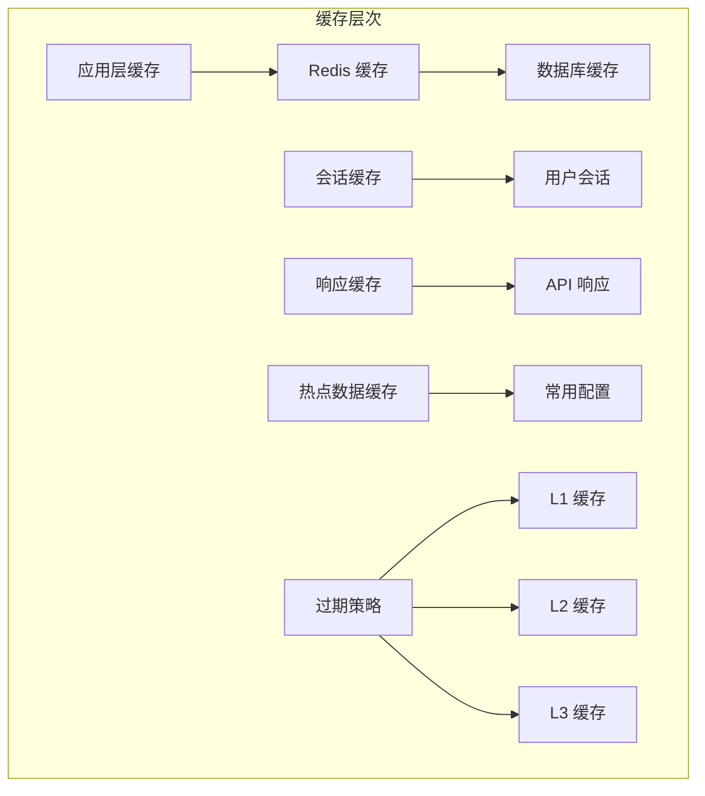
```mermaid
graph TB
subgraph "缓存层次"
A[应用层缓存] --> B[Redis 缓存]
B --> C[数据库缓存]
D[会话缓存] --> E[用户会话]
F[响应缓存] --> G[API 响应]
H[热点数据缓存] --> I[常用配置]
J[过期策略] --> K[L1 缓存]
J --> L[L2 缓存]
J --> M[L3 缓存]
end
```

#### 缓存失效策略

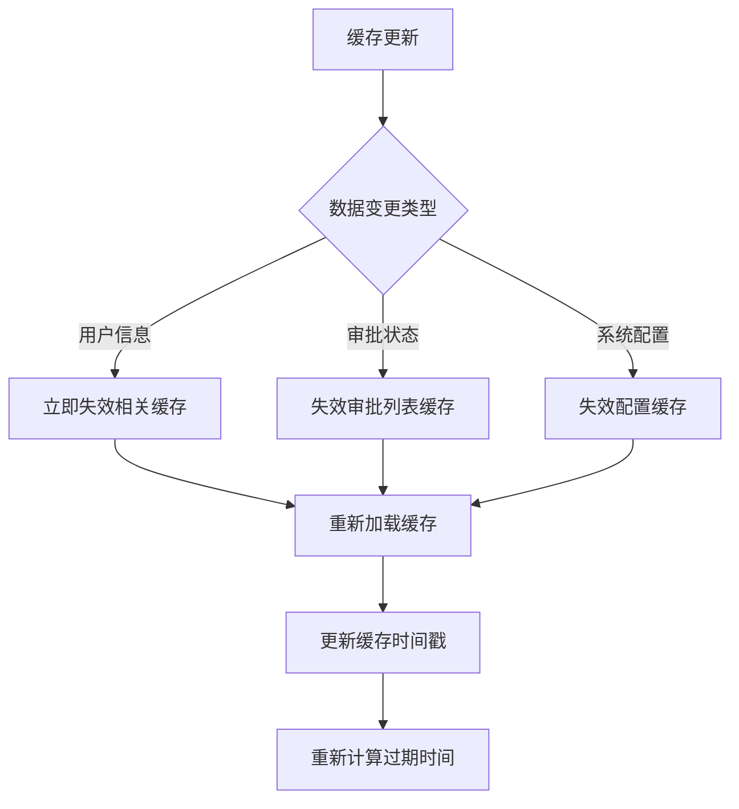
```mermaid
flowchart TD
A[缓存更新] --> B{数据变更类型}
B --> |用户信息| C[立即失效相关缓存]
B --> |审批状态| D[失效审批列表缓存]
B --> |系统配置| E[失效配置缓存]
C --> F[重新加载缓存]
D --> F
E --> F
F --> G[更新缓存时间戳]
G --> H[重新计算过期时间]
```

**章节来源**
- [redis.js:25-36](file://backend/src/common/config/redis.js#L25-L36)

## 故障排查指南

### 常见问题诊断

#### 连接问题诊断

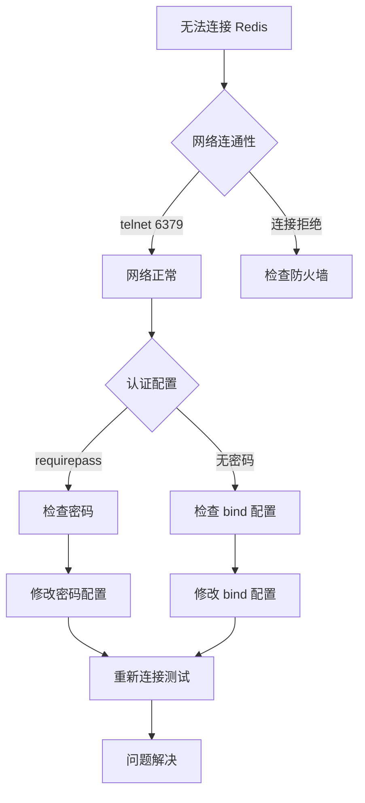
```mermaid
flowchart TD
A[无法连接 Redis] --> B{网络连通性}
B --> |telnet 6379| C[网络正常]
B --> |连接拒绝| D[检查防火墙]
C --> E{认证配置}
E --> |requirepass| F[检查密码]
E --> |无密码| G[检查 bind 配置]
F --> H[修改密码配置]
G --> I[修改 bind 配置]
H --> J[重新连接测试]
I --> J
J --> K[问题解决]
```

#### 性能问题诊断

```mermaid
flowchart TD
A[性能问题] --> B{内存使用率}
B --> |> 85%| C[内存压力]
B --> |70%-85%| D[警告状态]
B --> |< 70%| E[正常状态]
C --> F[检查 maxmemory-policy]
D --> G[优化缓存策略]
E --> H[监控性能指标]
F --> I[调整淘汰策略]
G --> J[优化键过期时间]
I --> K[重新测试]
J --> K
K --> L[问题解决]
```

### 调试工具

#### Redis 调试命令

```bash
# 连接调试
redis-cli --scan --pattern "oa:*"

# 性能分析
redis-cli --hotkeys

# 内存分析
redis-cli memory usage key_name
redis-cli memory stats

# 命令统计
redis-cli command stats
redis-cli command info get
```

#### 应用层调试

```mermaid
graph TB
subgraph "调试流程"
A[启用调试模式] --> B[增加日志级别]
B --> C[监控连接状态]
C --> D[分析错误日志]
D --> E[定位问题根因]
E --> F[实施修复方案]
F --> G[验证修复效果]
end
```

**章节来源**
- [redis.js:47-53](file://backend/src/common/config/redis.js#L47-L53)

## 总结

智慧办公助手 OA 系统的 Redis 缓存部署方案提供了完整的缓存解决方案，具有以下特点：

### 核心优势

1. **高可用性**：实现了智能重连机制和优雅降级策略
2. **高性能**：优化的连接池配置和内存管理策略
3. **易维护**：完善的监控指标和日志记录机制
4. **安全性**：支持密码认证和网络访问控制

### 部署建议

1. **单机部署**：适用于开发和测试环境，配置简单可靠
2. **集群部署**：适用于生产环境，提供高可用和水平扩展能力
3. **监控配置**：建立完善的监控体系，及时发现和解决问题

### 未来扩展

1. **集群化部署**：随着用户量增长，考虑部署 Redis 集群
2. **多级缓存**：结合本地缓存和分布式缓存，提升性能
3. **监控增强**：集成专业的监控工具，提供更全面的运维支持

通过合理的部署和配置，Redis 缓存将为 OA 系统提供稳定高效的缓存服务，显著提升系统的整体性能和用户体验。