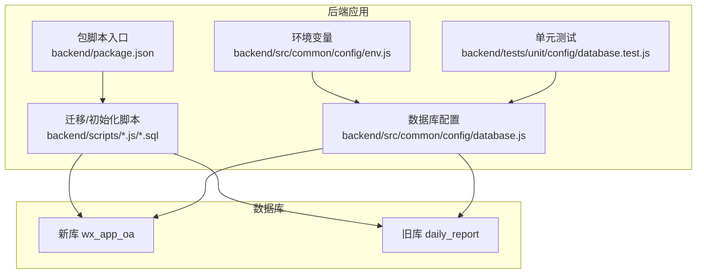
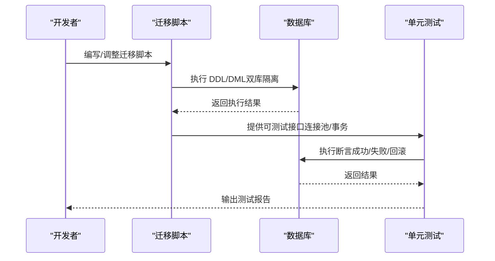
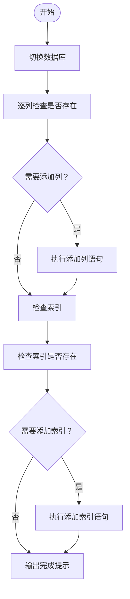
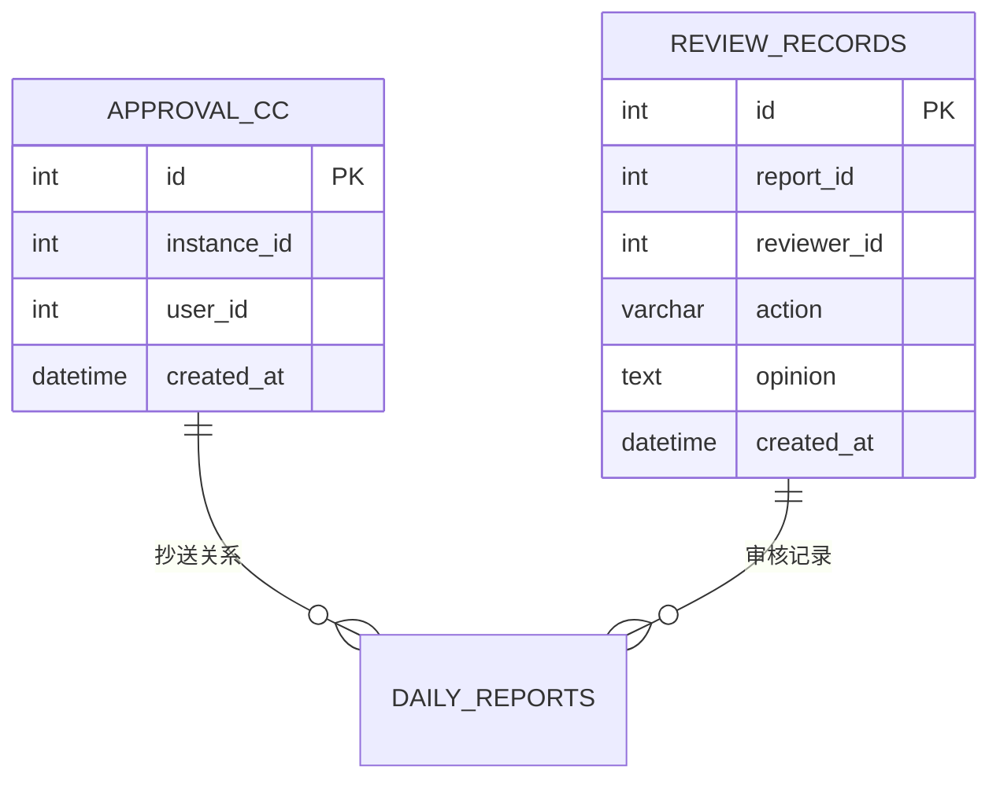
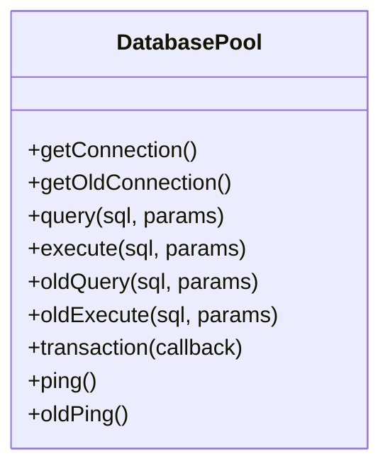
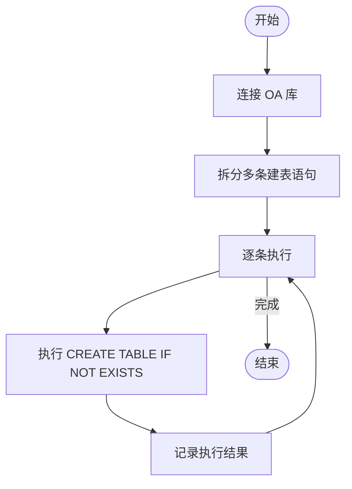
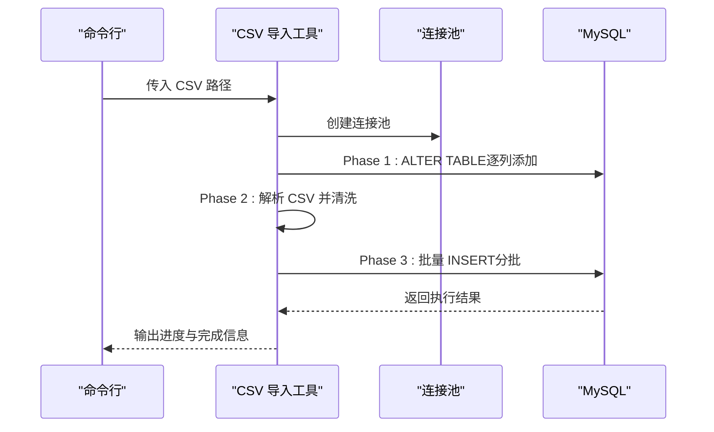
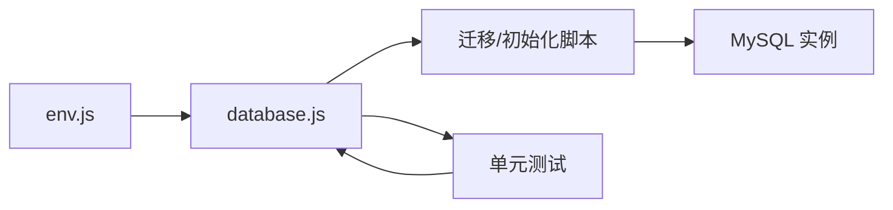

# 数据库迁移与版本管理

<cite>
**本文档引用的文件**
- [alter_daily_reports.sql](file://backend/scripts/alter_daily_reports.sql)
- [alter_daily_reports_safe.sql](file://backend/scripts/alter_daily_reports_safe.sql)
- [approval_cc.sql](file://backend/scripts/approval_cc.sql)
- [review_records.sql](file://backend/scripts/review_records.sql)
- [init-db.js](file://backend/scripts/init-db.js)
- [import_csv.js](file://backend/scripts/import_csv.js)
- [database.js](file://backend/src/common/config/database.js)
- [env.js](file://backend/src/common/config/env.js)
- [database.test.js](file://backend/tests/unit/config/database.test.js)
- [package.json](file://backend/package.json)
- [import_latest.sql](file://sql/import_latest.sql)
</cite>

## 目录
1. [简介](#简介)
2. [项目结构](#项目结构)
3. [核心组件](#核心组件)
4. [架构概览](#架构概览)
5. [详细组件分析](#详细组件分析)
6. [依赖分析](#依赖分析)
7. [性能考虑](#性能考虑)
8. [故障排查指南](#故障排查指南)
9. [结论](#结论)
10. [附录](#附录)

## 简介
本文件面向智慧办公助手 OA 系统，系统性梳理数据库迁移与版本管理策略，覆盖迁移脚本编写规范、执行流程、索引优化、数据迁移、安全迁移设计、版本标记与回滚机制、增量与全量迁移最佳实践、测试策略与生产部署流程。重点解析 alter_daily_reports_safe.sql 的安全设计与执行策略，并给出可落地的迁移治理方案。

## 项目结构
OA 后端采用 Node.js + MySQL2 的技术栈，数据库相关能力集中在以下位置：
- 迁移与初始化脚本：backend/scripts/
- 数据库连接与事务封装：backend/src/common/config/database.js
- 环境变量与数据库配置：backend/src/common/config/env.js
- 测试：backend/tests/unit/config/database.test.js
- 包管理与脚本入口：backend/package.json

图示来源
- [database.js:11-43](file://backend/src/common/config/database.js#L11-L43)
- [env.js:58-78](file://backend/src/common/config/env.js#L58-L78)
- [package.json:6-14](file://backend/package.json#L6-L14)

章节来源
- [database.js:11-43](file://backend/src/common/config/database.js#L11-L43)
- [env.js:58-78](file://backend/src/common/config/env.js#L58-L78)
- [package.json:6-14](file://backend/package.json#L6-L14)

## 核心组件
- 数据库连接池与事务封装：提供 OA 库与旧库双连接池、参数化查询、事务封装、连通性检测等能力，支撑迁移脚本与业务逻辑。
- 初始化脚本：一次性创建 M2 阶段所需的基础表，确保开发与测试环境快速就绪。
- 迁移脚本：针对 daily_reports 表的扩展与安全迁移，支持增量字段与索引的添加。
- 审批抄送与审核记录表：新增 approval_cc 与 review_records 表，完善审批流程与审计链路。
- CSV 导入工具：将历史 CSV 数据导入到 daily_reports，包含列扩展、解析与批量写入。

章节来源
- [database.js:11-43](file://backend/src/common/config/database.js#L11-L43)
- [database.js:168-181](file://backend/src/common/config/database.js#L168-L181)
- [init-db.js:18-322](file://backend/scripts/init-db.js#L18-L322)
- [alter_daily_reports.sql:7-28](file://backend/scripts/alter_daily_reports.sql#L7-L28)
- [alter_daily_reports_safe.sql:6-86](file://backend/scripts/alter_daily_reports_safe.sql#L6-L86)
- [approval_cc.sql:7-15](file://backend/scripts/approval_cc.sql#L7-L15)
- [review_records.sql:8-19](file://backend/scripts/review_records.sql#L8-L19)
- [import_csv.js:18-55](file://backend/scripts/import_csv.js#L18-L55)

## 架构概览
数据库迁移与版本管理围绕“脚本驱动 + 双库隔离 + 事务保障 + 测试覆盖”展开，形成从开发到生产的闭环。

图示来源
- [database.js:168-181](file://backend/src/common/config/database.js#L168-L181)
- [database.test.js:199-234](file://backend/tests/unit/config/database.test.js#L199-L234)

## 详细组件分析

### 安全迁移脚本：alter_daily_reports_safe.sql
该脚本采用“跳过已存在”的策略，避免重复执行导致的错误，提升幂等性与安全性。

- 设计要点
  - 使用 USE 切换数据库上下文。
  - 通过 information_schema 检查列/索引是否存在，仅在不存在时执行 ALTER。
  - 对每个列与索引分别判断，确保部分失败不影响整体执行。
  - 最终输出完成提示，便于自动化脚本识别执行状态。

- 执行策略
  - 支持幂等执行：多次运行不会产生重复列或索引。
  - 降低风险：避免因列/索引已存在而中断整个迁移流程。
  - 适合生产环境：无需预清理，可直接在现有表上叠加扩展。

图示来源
- [alter_daily_reports_safe.sql:6-86](file://backend/scripts/alter_daily_reports_safe.sql#L6-L86)

章节来源
- [alter_daily_reports_safe.sql:6-86](file://backend/scripts/alter_daily_reports_safe.sql#L6-L86)

### 增量迁移与全量迁移对比
- 增量迁移（推荐）
  - 特点：按需添加列/索引，保持现有数据与结构不变。
  - 优势：停机时间短、风险低、可回滚。
  - 适用场景：日常功能扩展、字段补齐、索引优化。
- 全量迁移
  - 特点：重建表结构，适合大规模重构。
  - 风险：停机时间较长、数据一致性要求高。
  - 适用场景：架构演进、废弃字段清理、统一编码规范。

章节来源
- [alter_daily_reports.sql:7-28](file://backend/scripts/alter_daily_reports.sql#L7-L28)
- [alter_daily_reports_safe.sql:6-86](file://backend/scripts/alter_daily_reports_safe.sql#L6-L86)

### 审批抄送与审核记录表
- approval_cc 表
  - 作用：记录审批实例与抄送人的关系，支持按实例与用户维度检索。
  - 索引：instance_id、user_id，满足常用查询路径。
- review_records 表
  - 作用：记录管理员对日报的审核动作，支持按 report_id、reviewer_id、created_at 等维度查询。
  - 索引：辅助审计与统计分析。

图示来源
- [approval_cc.sql:7-15](file://backend/scripts/approval_cc.sql#L7-L15)
- [review_records.sql:8-19](file://backend/scripts/review_records.sql#L8-L19)

章节来源
- [approval_cc.sql:7-15](file://backend/scripts/approval_cc.sql#L7-L15)
- [review_records.sql:8-19](file://backend/scripts/review_records.sql#L8-L19)

### 数据库连接与事务封装
- 双连接池
  - OA 库：新业务主库，承载日常业务。
  - 旧库：兼容旧系统，支持迁移与历史数据访问。
- 事务封装
  - 提供 transaction 回调，自动 begin/commit/rollback，确保数据一致性。
- 连接与查询
  - 参数化 query/execute，减少注入风险。
  - 日志记录查询耗时与错误，便于定位问题。

图示来源
- [database.js:11-43](file://backend/src/common/config/database.js#L11-L43)
- [database.js:168-181](file://backend/src/common/config/database.js#L168-L181)

章节来源
- [database.js:11-43](file://backend/src/common/config/database.js#L11-L43)
- [database.js:168-181](file://backend/src/common/config/database.js#L168-L181)

### 初始化脚本：M2 阶段基础表
- 功能：一次性创建用户、部门、审批、日报、消息、公告、项目、任务、资产、操作日志、系统配置等表。
- 特点：使用 IF NOT EXISTS 避免重复建表；多语句执行；逐条校验表名与执行结果。

图示来源
- [init-db.js:327-370](file://backend/scripts/init-db.js#L327-L370)

章节来源
- [init-db.js:18-322](file://backend/scripts/init-db.js#L18-L322)
- [init-db.js:327-370](file://backend/scripts/init-db.js#L327-L370)

### CSV 导入工具：公出日志迁移
- 分阶段执行
  - Phase 1：ALTER TABLE 为 daily_reports 补充必要列（幂等处理）。
  - Phase 2：解析 CSV，清洗字段，构造记录集。
  - Phase 3：批量插入，分批写入，降低锁竞争。
- 错误处理
  - 列存在性错误捕获并跳过，保证流程连续性。
  - 批次写入失败时输出错误并终止，避免脏数据。

图示来源
- [import_csv.js:18-55](file://backend/scripts/import_csv.js#L18-L55)
- [import_csv.js:196-252](file://backend/scripts/import_csv.js#L196-L252)
- [import_csv.js:287-318](file://backend/scripts/import_csv.js#L287-L318)

章节来源
- [import_csv.js:18-55](file://backend/scripts/import_csv.js#L18-L55)
- [import_csv.js:196-252](file://backend/scripts/import_csv.js#L196-L252)
- [import_csv.js:287-318](file://backend/scripts/import_csv.js#L287-L318)

## 依赖分析
- 环境变量驱动数据库配置，确保不同环境（开发/测试/生产）的连接参数可控。
- 迁移脚本依赖数据库连接池与事务封装，保证执行一致性与可观测性。
- 测试覆盖连接池创建、查询、执行、事务、连通性等关键路径。

图示来源
- [env.js:58-78](file://backend/src/common/config/env.js#L58-L78)
- [database.js:11-43](file://backend/src/common/config/database.js#L11-L43)
- [database.test.js:32-35](file://backend/tests/unit/config/database.test.js#L32-L35)

章节来源
- [env.js:58-78](file://backend/src/common/config/env.js#L58-L78)
- [database.js:11-43](file://backend/src/common/config/database.js#L11-L43)
- [database.test.js:32-35](file://backend/tests/unit/config/database.test.js#L32-L35)

## 性能考虑
- 索引优化
  - 在高频查询字段上建立合适索引，如 report_date、user_id、status 等。
  - 避免冗余索引，定期评估索引使用率。
- 批量写入
  - 导入工具采用分批写入，降低锁竞争与内存占用。
- 连接池
  - 合理设置连接上限与超时，避免资源枯竭。
- 事务范围
  - 将相关 DML 放入单事务，减少中间态，提高一致性。

## 故障排查指南
- 常见问题
  - 列/索引已存在：使用安全脚本（幂等）避免中断。
  - 连接失败：检查环境变量与网络连通性，使用 ping/oldPing 排查。
  - 事务回滚：通过 transaction 回调的错误传播定位失败点。
- 测试建议
  - 单元测试覆盖连接池创建、查询/执行日志、事务提交/回滚、连通性检测。
  - 集成测试模拟真实迁移场景，验证幂等性与数据一致性。

章节来源
- [database.test.js:199-234](file://backend/tests/unit/config/database.test.js#L199-L234)
- [database.test.js:236-263](file://backend/tests/unit/config/database.test.js#L236-L263)

## 结论
通过“安全幂等迁移 + 双库隔离 + 事务保障 + 测试覆盖”的体系化设计，OA 系统可在保证数据一致性的前提下，实现低风险、可回滚的数据库演进。建议在生产环境优先采用安全迁移脚本与分阶段导入策略，结合完善的测试与监控，持续提升迁移效率与稳定性。

## 附录

### 数据库迁移脚本编写规范
- 幂等性
  - 使用 IF NOT EXISTS 或存在性检查，避免重复执行失败。
- 可观测性
  - 记录执行日志与耗时，便于审计与排错。
- 安全性
  - 限制 ALTER 范围，优先增量迁移；涉及数据迁移时先备份。
- 可回滚
  - 为 DDL 提供逆向脚本；事务包裹关键步骤。

### 迁移脚本命名规范与版本标记
- 命名规范
  - 增量迁移：YYYYMMDD_HHMMSS_description.sql
  - 全量迁移：YYYYMMDD_HHMMSS_full_reset.sql
  - 安全脚本：_safe 后缀
- 版本标记
  - 在脚本头部注释中标注适用数据库、目标版本与变更说明。
  - 生产环境以“已执行清单”记录版本号与执行时间。

### 回滚机制
- 逆向脚本：为每次 DDL 提供对应的 DROP/REVERT。
- 事务回滚：在 transaction 回调中捕获错误并回滚。
- 快照与备份：在执行重大变更前进行快照与备份。

### 增量迁移与全量迁移最佳实践
- 增量迁移
  - 逐项验证索引与列的存在性；分批写入数据；监控慢查询。
- 全量迁移
  - 选择维护窗口；离线导出/导入；校验数据完整性与索引重建。

### 测试策略与生产部署流程
- 测试策略
  - 单元测试：覆盖连接池、查询/执行、事务、连通性。
  - 集成测试：模拟迁移全流程，验证幂等性与一致性。
- 生产部署
  - 预发布验证：在测试环境执行相同脚本。
  - 执行顺序：先安全脚本，再业务脚本；最后索引优化。
  - 监控与回滚：执行后监控慢查询与错误日志，准备回滚预案。

章节来源
- [alter_daily_reports_safe.sql:6-86](file://backend/scripts/alter_daily_reports_safe.sql#L6-L86)
- [import_csv.js:18-55](file://backend/scripts/import_csv.js#L18-L55)
- [database.js:168-181](file://backend/src/common/config/database.js#L168-L181)
- [database.test.js:199-234](file://backend/tests/unit/config/database.test.js#L199-L234)