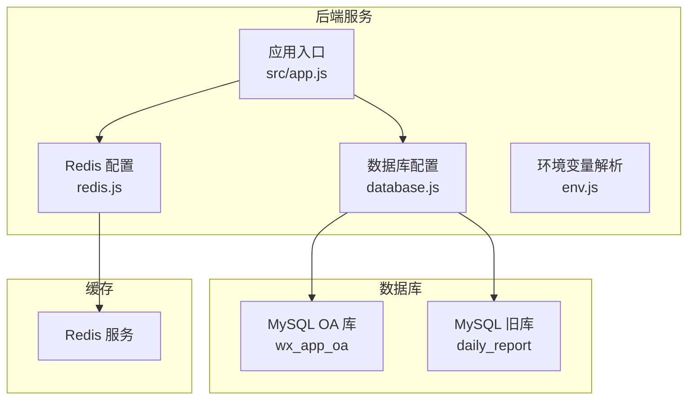
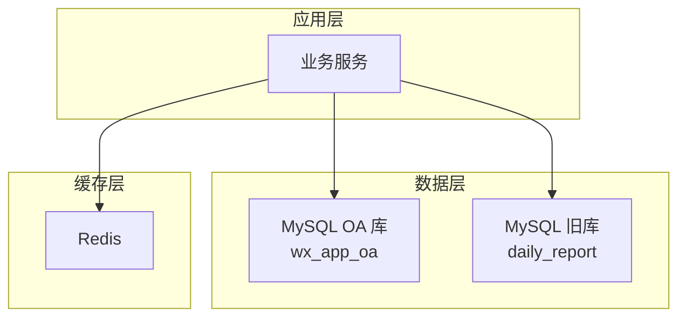
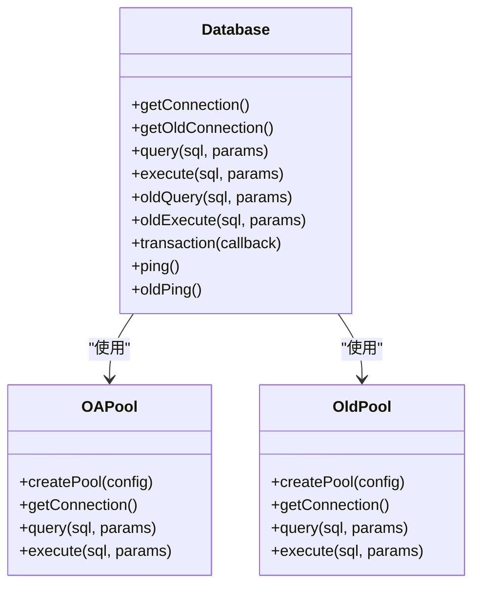
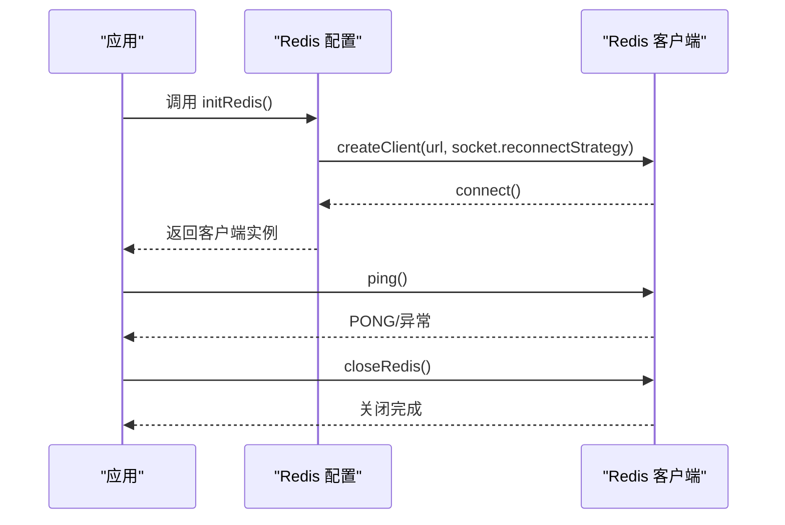
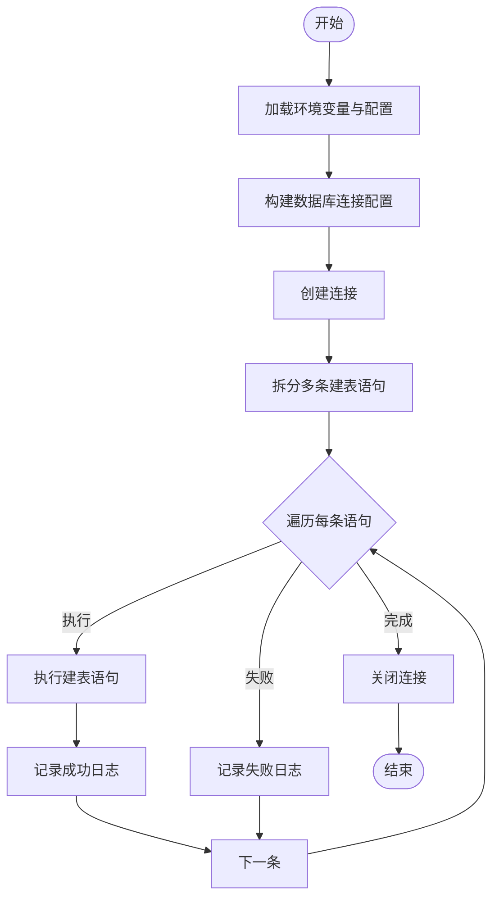
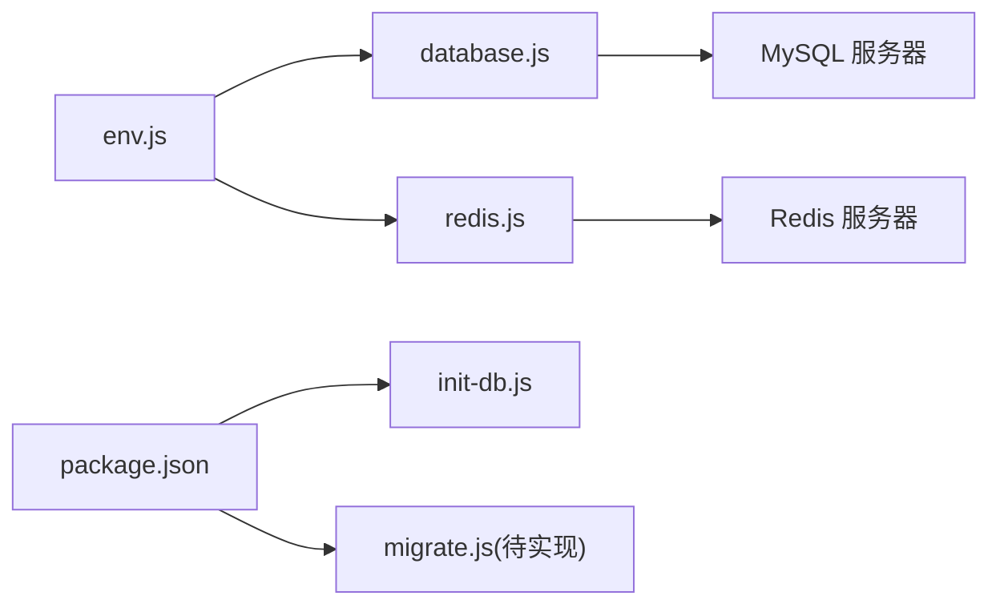

# 数据库部署

<cite>
**本文引用的文件**
- [database.js](file://backend/src/common/config/database.js)
- [redis.js](file://backend/src/common/config/redis.js)
- [env.js](file://backend/src/common/config/env.js)
- [init-db.js](file://backend/scripts/init-db.js)
- [alter_daily_reports.sql](file://backend/scripts/alter_daily_reports.sql)
- [alter_daily_reports_safe.sql](file://backend/scripts/alter_daily_reports_safe.sql)
- [approval_cc.sql](file://backend/scripts/approval_cc.sql)
- [review_records.sql](file://backend/scripts/review_records.sql)
- [package.json](file://backend/package.json)
- [database.test.js](file://backend/tests/unit/config/database.test.js)
- [redis.test.js](file://backend/tests/unit/config/redis.test.js)
- [技术可行性分析报告.md](file://backend/docs/技术可行性分析报告.md)
</cite>

## 目录
1. [简介](#简介)
2. [项目结构](#项目结构)
3. [核心组件](#核心组件)
4. [架构总览](#架构总览)
5. [详细组件分析](#详细组件分析)
6. [依赖分析](#依赖分析)
7. [性能考虑](#性能考虑)
8. [故障排查指南](#故障排查指南)
9. [结论](#结论)
10. [附录](#附录)

## 简介
本文件面向“智慧办公助手 OA 系统”的数据库部署与运维，覆盖 MySQL 主库与旧库双连接池、数据库初始化脚本、Redis 缓存部署、连接池与性能优化、备份与迁移策略等主题。文档以仓库现有实现与脚本为依据，结合测试用例与可行性报告中的部署要点，形成可落地的部署与运维指南。

## 项目结构
围绕数据库与缓存的关键文件分布如下：
- 数据库连接池与事务封装：backend/src/common/config/database.js
- Redis 客户端封装：backend/src/common/config/redis.js
- 环境变量与配置解析：backend/src/common/config/env.js
- 数据库初始化脚本：backend/scripts/init-db.js
- 旧库扩展与安全迁移脚本：backend/scripts/alter_daily_reports*.sql
- 审批抄送与审核记录表脚本：backend/scripts/approval_cc.sql、backend/scripts/review_records.sql
- 包管理与脚本入口：backend/package.json
- 单元测试（验证数据库与 Redis 行为）：backend/tests/unit/config/database.test.js、backend/tests/unit/config/redis.test.js
- 部署与迁移参考：backend/docs/技术可行性分析报告.md

图表来源
- [database.js:11-43](file://backend/src/common/config/database.js#L11-L43)
- [redis.js:16-57](file://backend/src/common/config/redis.js#L16-L57)
- [env.js:58-87](file://backend/src/common/config/env.js#L58-L87)

章节来源
- [database.js:1-222](file://backend/src/common/config/database.js#L1-L222)
- [redis.js:1-101](file://backend/src/common/config/redis.js#L1-L101)
- [env.js:1-118](file://backend/src/common/config/env.js#L1-L118)
- [package.json:13](file://backend/package.json#L13)

## 核心组件
- 数据库连接池与事务
  - 提供 OA 库与旧库两套连接池，分别对应新旧业务库。
  - 支持参数化查询、执行、事务封装与连通性检测。
- Redis 客户端
  - 支持密码认证、重连策略、事件监听与连通性检测。
- 环境变量
  - 统一读取并校验 OA/旧库与 Redis 的主机、端口、账号、密码、库名、连接池大小等关键配置。
- 初始化脚本
  - 自动创建 M2 阶段的基础表集合，包含用户、部门、审批、日报、消息、公告、项目、任务、资产、操作日志、系统配置等。
- 迁移与扩展脚本
  - 旧库 daily_report 的字段补齐与索引增强，提供安全版跳过已存在对象的 ALTER。
  - 新增 approval_cc 与 review_records 两张辅助表。

章节来源
- [database.js:11-43](file://backend/src/common/config/database.js#L11-L43)
- [database.js:65-181](file://backend/src/common/config/database.js#L65-L181)
- [redis.js:16-57](file://backend/src/common/config/redis.js#L16-L57)
- [env.js:58-87](file://backend/src/common/config/env.js#L58-L87)
- [init-db.js:18-322](file://backend/scripts/init-db.js#L18-L322)
- [alter_daily_reports.sql:7-28](file://backend/scripts/alter_daily_reports.sql#L7-L28)
- [alter_daily_reports_safe.sql:6-86](file://backend/scripts/alter_daily_reports_safe.sql#L6-L86)
- [approval_cc.sql:7-15](file://backend/scripts/approval_cc.sql#L7-L15)
- [review_records.sql:8-19](file://backend/scripts/review_records.sql#L8-L19)

## 架构总览
系统采用“双数据库 + 单 Redis”的架构：
- OA 库（wx_app_oa）承载新业务主数据与新功能。
- 旧库（daily_report）用于兼容旧系统与历史数据迁移。
- Redis 作为缓存与会话存储，支持重连与事件日志。

图表来源
- [database.js:11-43](file://backend/src/common/config/database.js#L11-L43)
- [redis.js:16-57](file://backend/src/common/config/redis.js#L16-L57)

## 详细组件分析

### 数据库连接池与事务（database.js）
- 连接池参数
  - 支持连接池最大并发、等待队列、字符集、时区、长连接保活等。
  - OA 库与旧库分别独立配置，便于隔离与容量规划。
- 查询与执行
  - 提供参数化 query/execute 与旧库对应的 oldQuery/oldExecute。
  - 统一日志记录 SQL 与耗时，便于诊断。
- 事务
  - 封装 begin/commit/rollback，并在 finally 中释放连接。
- 连通性检测
  - 提供 ping/oldPing，用于健康检查。

图表来源
- [database.js:11-43](file://backend/src/common/config/database.js#L11-L43)
- [database.js:65-181](file://backend/src/common/config/database.js#L65-L181)

章节来源
- [database.js:11-43](file://backend/src/common/config/database.js#L11-L43)
- [database.js:65-181](file://backend/src/common/config/database.js#L65-L181)
- [database.test.js:39-264](file://backend/tests/unit/config/database.test.js#L39-L264)

### Redis 客户端（redis.js）
- 连接初始化
  - 支持带/不带密码的连接串，内置重连策略与事件监听。
- 客户端生命周期
  - 提供获取、关闭与连通性检测。
- 事件与日志
  - connect/error/end 事件均输出结构化日志，便于运维观测。

图表来源
- [redis.js:16-57](file://backend/src/common/config/redis.js#L16-L57)
- [redis.js:85-93](file://backend/src/common/config/redis.js#L85-L93)

章节来源
- [redis.js:16-57](file://backend/src/common/config/redis.js#L16-L57)
- [redis.js:85-93](file://backend/src/common/config/redis.js#L85-L93)
- [redis.test.js:60-210](file://backend/tests/unit/config/redis.test.js#L60-L210)

### 环境变量与配置（env.js）
- 必需变量
  - OA/旧库主机、端口、账号、密码、库名、连接池上下限。
  - Redis 主机、端口、密码、库号、Key 前缀。
  - JWT 密钥、微信 AppID 等。
- 默认值与类型转换
  - 对端口、池大小等进行整型转换，提供默认兜底。
- 启动校验
  - 应用启动前强制校验必需变量是否存在。

章节来源
- [env.js:13-44](file://backend/src/common/config/env.js#L13-L44)
- [env.js:58-87](file://backend/src/common/config/env.js#L58-L87)

### 数据库初始化脚本（init-db.js）
- 功能
  - 一次性创建 M2 阶段所需的基础表集合，包含用户、部门、审批、日报、消息、公告、项目、任务、资产、操作日志、系统配置等。
- 执行流程
  - 读取环境变量构建连接配置，使用多语句模式逐条执行建表 SQL。
  - 对每个表创建进行日志输出，失败时记录错误并退出。
- 使用方式
  - 通过 npm 脚本或直接执行 node scripts/init-db.js。

图表来源
- [init-db.js:327-370](file://backend/scripts/init-db.js#L327-L370)

章节来源
- [init-db.js:18-322](file://backend/scripts/init-db.js#L18-L322)
- [init-db.js:327-370](file://backend/scripts/init-db.js#L327-L370)
- [package.json:13](file://backend/package.json#L13)

### 旧库扩展与安全迁移（alter_daily_reports*.sql）
- 字段补齐
  - 为 daily_reports 表新增项目、区域、工作类型、人员、数量、进度、备注、附件、时间戳等字段，并补充常用索引。
- 安全版 ALTER
  - 使用信息表检查列与索引是否存在，仅在不存在时执行 ADD COLUMN/ADD INDEX，避免重复执行报错。

章节来源
- [alter_daily_reports.sql:7-28](file://backend/scripts/alter_daily_reports.sql#L7-L28)
- [alter_daily_reports_safe.sql:6-86](file://backend/scripts/alter_daily_reports_safe.sql#L6-L86)

### 审批抄送与审核记录表（approval_cc.sql、review_records.sql）
- approval_cc
  - 存储审批实例与抄送人的关系，包含实例 ID、抄送人 ID 与创建时间。
- review_records
  - 存储管理员对日报的审核记录，包含日报 ID、审核人 ID、操作动作、意见与创建时间。

章节来源
- [approval_cc.sql:7-15](file://backend/scripts/approval_cc.sql#L7-L15)
- [review_records.sql:8-19](file://backend/scripts/review_records.sql#L8-L19)

## 依赖分析
- 组件耦合
  - database.js 依赖 env.js 提供的数据库配置；redis.js 依赖 env.js 提供的 Redis 配置。
  - 两者均通过进程环境变量驱动，启动前由 env.js 校验。
- 外部依赖
  - MySQL2（Promise 版）、Redis 官方客户端。
- 脚本入口
  - package.json 中定义了 init-db 与 migrate 脚本，便于一键执行初始化与迁移。

图表来源
- [env.js:58-87](file://backend/src/common/config/env.js#L58-L87)
- [database.js:11-43](file://backend/src/common/config/database.js#L11-L43)
- [redis.js:16-57](file://backend/src/common/config/redis.js#L16-L57)
- [package.json:13](file://backend/package.json#L13)

章节来源
- [package.json:13](file://backend/package.json#L13)
- [env.js:58-87](file://backend/src/common/config/env.js#L58-L87)

## 性能考虑
- 连接池参数
  - OA/旧库各自独立池，按业务压力设定 poolMin/poolMax，避免跨库争抢。
  - keepAliveInitialDelay 与 enableKeepAlive 降低长连接抖动。
- SQL 与索引
  - 初始化脚本为高频查询字段建立索引，建议结合慢查询日志持续优化。
- 缓存命中
  - Redis 作为热点数据缓存，建议配合 TTL 与淘汰策略控制内存占用。
- 监控指标
  - 建议采集数据库连接池活跃数、排队长度、平均等待时间；Redis 连接数、内存使用、命令耗时等。

章节来源
- [database.js:17-24](file://backend/src/common/config/database.js#L17-L24)
- [database.js:36-43](file://backend/src/common/config/database.js#L36-L43)
- [redis.js:25-36](file://backend/src/common/config/redis.js#L25-L36)

## 故障排查指南
- 数据库连通性
  - 使用 ping/oldPing 检查 OA/旧库连通性；若失败，检查网络、账号密码与防火墙。
- 查询与执行异常
  - 查看日志中 SQL 与耗时，定位慢查询或参数问题；必要时开启慢查询日志。
- 事务回滚
  - 事务失败自动回滚并抛出异常，确认业务逻辑与约束条件。
- Redis 连接
  - 关注 connect/error/end 事件日志；重连策略最多尝试若干次后终止，避免无限重试。
- 环境变量缺失
  - 启动前会校验必需变量，缺失时直接报错，按报错清单补齐。

章节来源
- [database.js:187-207](file://backend/src/common/config/database.js#L187-L207)
- [redis.js:38-53](file://backend/src/common/config/redis.js#L38-L53)
- [env.js:34-44](file://backend/src/common/config/env.js#L34-L44)
- [redis.test.js:103-127](file://backend/tests/unit/config/redis.test.js#L103-L127)

## 结论
本部署文档基于仓库现有实现，明确了数据库与缓存的配置要点、初始化流程、迁移脚本与运维监控方向。建议在生产环境中进一步完善主从复制、读写分离与高可用方案，并配套完善的备份与回滚机制。

## 附录

### A. MySQL 安装与配置要点（基于可行性报告）
- 安装与启动
  - 参考可行性报告中的 Ubuntu 安装步骤与 systemctl 管理方式。
- 安全加固
  - bind、port、requirepass、maxmemory、appendonly、loglevel 等配置项建议按报告要求调整。
- 连接池参数
  - OA/旧库的 poolMin/poolMax 建议结合业务峰值合理设置。

章节来源
- [技术可行性分析报告.md:172-215](file://backend/docs/技术可行性分析报告.md#L172-L215)
- [技术可行性分析报告.md:202-230](file://backend/docs/技术可行性分析报告.md#L202-L230)
- [env.js:65-78](file://backend/src/common/config/env.js#L65-L78)

### B. 数据库初始化与表结构（基于 init-db.js）
- 初始化脚本会创建以下核心表：
  - 用户、部门、审批类型、审批实例、审批流程节点、日报、消息、公告、项目、任务、资产、操作日志、系统配置。
- 建议在初始化后评估索引覆盖度与查询路径，必要时补充复合索引。

章节来源
- [init-db.js:18-322](file://backend/scripts/init-db.js#L18-L322)

### C. 旧库迁移与扩展（基于 alter_daily_reports*.sql）
- 旧库 daily_report 的字段补齐与索引增强，确保 Report 模块表单数据完整存储。
- 安全版脚本可多次执行而不报错，适合灰度与回滚场景。

章节来源
- [alter_daily_reports.sql:7-28](file://backend/scripts/alter_daily_reports.sql#L7-L28)
- [alter_daily_reports_safe.sql:6-86](file://backend/scripts/alter_daily_reports_safe.sql#L6-L86)

### D. 审批与审核辅助表（基于 approval_cc.sql、review_records.sql）
- approval_cc：支撑审批抄送关系。
- review_records：支撑管理员对日报的审核记录追踪。

章节来源
- [approval_cc.sql:7-15](file://backend/scripts/approval_cc.sql#L7-L15)
- [review_records.sql:8-19](file://backend/scripts/review_records.sql#L8-L19)

### E. Redis 部署与持久化（基于技术可行性分析报告）
- 单机模式
  - 安装后启用并设置开机自启；根据内存设置 maxmemory 与淘汰策略。
- 持久化
  - 建议开启 AOF（appendonly yes）提升可靠性。
- 访问控制
  - 生产环境建议设置 requirepass 并限制 bind。

章节来源
- [技术可行性分析报告.md:170-215](file://backend/docs/技术可行性分析报告.md#L170-L215)

### F. 备份与恢复（基于可行性报告）
- 全量备份
  - 使用 mysqldump 导出数据库结构与数据，建议压缩存储。
- 增量备份
  - 建议开启 binlog 并定期归档；结合 GTID 保障一致性。
- 恢复流程
  - 先恢复全量，再按时间点应用增量；恢复前先停写并校验一致性。

章节来源
- [技术可行性分析报告.md:232-270](file://backend/docs/技术可行性分析报告.md#L232-L270)

### G. 数据库迁移与版本升级（基于技术可行性分析报告）
- 迁移策略
  - 采用“读写分离 + 渐进式切换”，先迁移只读流量，再迁移写入。
- 版本升级
  - 通过独立的迁移脚本（如 migrate.js）执行 DDL/DML，升级前后均做快照。
- 回滚机制
  - 保留反向 SQL 与快照，出现异常立即回滚至最近稳定版本。

章节来源
- [技术可行性分析报告.md:375-426](file://backend/docs/技术可行性分析报告.md#L375-L426)