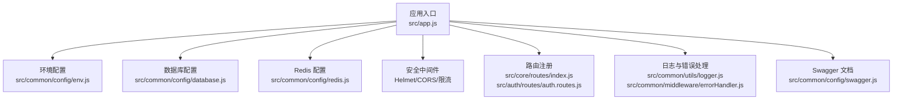
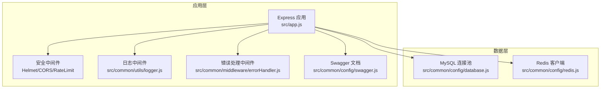
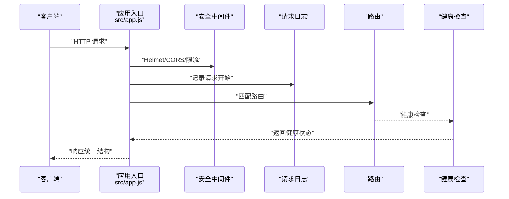
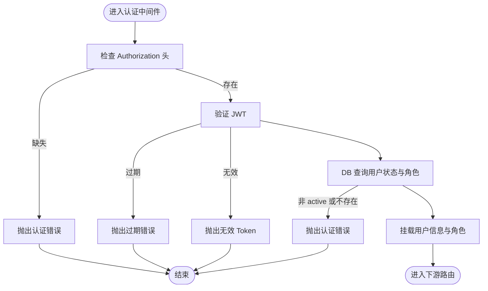
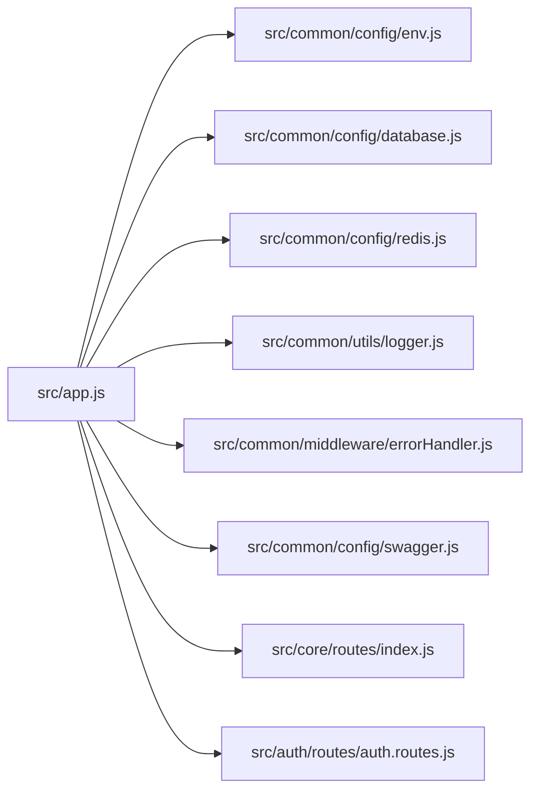

# 服务器配置

<cite>
**本文引用的文件**   
- [package.json](file://backend/package.json)
- [env.js](file://backend/src/common/config/env.js)
- [database.js](file://backend/src/common/config/database.js)
- [redis.js](file://backend/src/common/config/redis.js)
- [app.js](file://backend/src/app.js)
- [swagger.js](file://backend/src/common/config/swagger.js)
- [errorHandler.js](file://backend/src/common/middleware/errorHandler.js)
- [logger.js](file://backend/src/common/utils/logger.js)
- [errors.js](file://backend/src/common/utils/errors.js)
- [auth.js](file://backend/src/common/middleware/auth.js)
- [validator.js](file://backend/src/common/middleware/validator.js)
- [auth.routes.js](file://backend/src/auth/routes/auth.routes.js)
- [index.js](file://backend/src/core/routes/index.js)
</cite>

## 目录
1. [简介](#简介)
2. [项目结构](#项目结构)
3. [核心组件](#核心组件)
4. [架构总览](#架构总览)
5. [详细组件分析](#详细组件分析)
6. [依赖关系分析](#依赖关系分析)
7. [性能考虑](#性能考虑)
8. [故障排查指南](#故障排查指南)
9. [结论](#结论)
10. [附录](#附录)

## 简介
本文件面向智慧办公助手 OA 系统的生产环境服务器配置，围绕硬件与系统、运行时环境、网络与安全、环境变量与敏感信息保护等方面，结合代码库中的实际实现，给出可落地的配置建议与最佳实践。内容以仓库中的后端配置与中间件为依据，确保与系统实际行为一致。

## 项目结构
后端采用 Node.js + Express 架构，核心启动流程与配置集中在应用入口文件中；数据库与缓存通过独立配置模块管理；安全与中间件在应用层集中装配；日志与错误处理统一收敛。

**图示来源**
- [app.js:1-207](file://backend/src/app.js#L1-L207)
- [env.js:1-118](file://backend/src/common/config/env.js#L1-L118)
- [database.js:1-222](file://backend/src/common/config/database.js#L1-L222)
- [redis.js:1-101](file://backend/src/common/config/redis.js#L1-L101)
- [index.js:1-21](file://backend/src/core/routes/index.js#L1-L21)
- [auth.routes.js:1-38](file://backend/src/auth/routes/auth.routes.js#L1-L38)
- [logger.js:1-100](file://backend/src/common/utils/logger.js#L1-L100)
- [errorHandler.js:1-28](file://backend/src/common/middleware/errorHandler.js#L1-L28)
- [swagger.js:1-137](file://backend/src/common/config/swagger.js#L1-L137)

**章节来源**
- [app.js:1-207](file://backend/src/app.js#L1-L207)
- [env.js:1-118](file://backend/src/common/config/env.js#L1-L118)

## 核心组件
- 环境变量与配置中心：集中读取并校验必需变量，提供数据库、Redis、JWT、微信、日志、Swagger 等配置项。
- 数据库连接池：维护 OA 与旧版双库连接池，支持事务、参数化查询与连通性检测。
- Redis 客户端：按配置动态构建连接 URL，内置重连策略与事件监听。
- 应用入口与中间件：Helmet 安全头、CORS 白名单、全局限流、JSON 解析与错误处理、请求日志、Swagger 文档挂载。
- 日志与错误处理：统一日志格式与落盘策略，全局错误中间件统一返回结构。
- 认证与参数校验：JWT 校验与角色中间件、Joi 参数校验中间件。

**章节来源**
- [env.js:1-118](file://backend/src/common/config/env.js#L1-L118)
- [database.js:1-222](file://backend/src/common/config/database.js#L1-L222)
- [redis.js:1-101](file://backend/src/common/config/redis.js#L1-L101)
- [app.js:1-207](file://backend/src/app.js#L1-L207)
- [logger.js:1-100](file://backend/src/common/utils/logger.js#L1-L100)
- [errorHandler.js:1-28](file://backend/src/common/middleware/errorHandler.js#L1-L28)
- [auth.js:1-83](file://backend/src/common/middleware/auth.js#L1-L83)
- [validator.js:1-60](file://backend/src/common/middleware/validator.js#L1-L60)

## 架构总览
系统采用“应用进程 + MySQL + Redis”的三段式架构。应用进程负责接入层安全、路由与中间件，数据库负责持久化，Redis 负责缓存与会话等。

**图示来源**
- [app.js:1-207](file://backend/src/app.js#L1-L207)
- [database.js:1-222](file://backend/src/common/config/database.js#L1-L222)
- [redis.js:1-101](file://backend/src/common/config/redis.js#L1-L101)
- [logger.js:1-100](file://backend/src/common/utils/logger.js#L1-L100)
- [errorHandler.js:1-28](file://backend/src/common/middleware/errorHandler.js#L1-L28)
- [swagger.js:1-137](file://backend/src/common/config/swagger.js#L1-L137)

## 详细组件分析

### 环境变量与配置（生产关键）
- 必需变量清单：NODE_ENV、PORT、OA_DB_*（主机、用户、密码、库名、端口、连接池）、OLD_DB_*（旧库）、REDIS_*、JWT_SECRET、WX_APPID 等。
- 默认值与类型：端口、连接池大小、JWT 过期时间、日志级别与目录、Swagger 开关等均有默认兜底。
- 生产建议：
  - 所有必需变量必须在部署时注入，严禁留空。
  - REDIS_* 建议开启密码与 DB 索引隔离。
  - JWT_SECRET 必须足够随机且保密，定期轮换。
  - WX_APPID/WX_SECRET/QYWX_* 为外部集成凭据，务必通过密钥管理服务注入。

**章节来源**
- [env.js:13-44](file://backend/src/common/config/env.js#L13-L44)
- [env.js:50-115](file://backend/src/common/config/env.js#L50-L115)

### 数据库连接池（双库）
- OA 主库与旧库分别维护连接池，均启用 keep-alive、UTF8MB4、+08:00 时区。
- 提供 query/execute/oldQuery/oldExecute/transaction 等封装，并内置日志与错误上报。
- 连通性检测：提供 ping/oldPing，便于健康检查。

**章节来源**
- [database.js:11-43](file://backend/src/common/config/database.js#L11-L43)
- [database.js:65-161](file://backend/src/common/config/database.js#L65-L161)
- [database.js:187-207](file://backend/src/common/config/database.js#L187-L207)

### Redis 客户端
- 支持带/不带密码的连接 URL 构造，内置指数退避重连策略。
- 事件监听：connect/error/end，便于运维观测。
- ping 检测：可用于健康检查。

**章节来源**
- [redis.js:16-57](file://backend/src/common/config/redis.js#L16-L57)
- [redis.js:85-93](file://backend/src/common/config/redis.js#L85-L93)

### 应用入口与中间件
- 安全：Helmet（关闭 CSP 以适配小程序）、CORS 白名单（开发阶段放开）、全局限流与登录端点限流。
- 解析：JSON/URL 编码体大小限制，解析失败统一 400。
- 日志：请求进入/完成日志，带请求追踪 ID。
- Swagger：按开关挂载，开发友好。
- 路由：核心模块与认证模块路由注册。

**图示来源**
- [app.js:29-140](file://backend/src/app.js#L29-L140)
- [logger.js:67-96](file://backend/src/common/utils/logger.js#L67-L96)
- [index.js:12-18](file://backend/src/core/routes/index.js#L12-L18)

**章节来源**
- [app.js:29-140](file://backend/src/app.js#L29-L140)
- [logger.js:67-96](file://backend/src/common/utils/logger.js#L67-L96)

### 认证与参数校验
- JWT 认证：从 Authorization 头提取 Bearer Token，校验过期与有效性，DB 校验用户状态与角色一致性。
- 角色中间件：基于用户角色进行权限拦截。
- 参数校验：基于 Joi 的 validate 中间件，统一错误格式化。

**图示来源**
- [auth.js:14-56](file://backend/src/common/middleware/auth.js#L14-L56)

**章节来源**
- [auth.js:14-83](file://backend/src/common/middleware/auth.js#L14-L83)
- [validator.js:28-57](file://backend/src/common/middleware/validator.js#L28-L57)

### 日志与错误处理
- 日志：控制台彩色输出（开发）、error.log 与 combined.log 文件落盘，带时间戳与模块追踪。
- 错误：全局中间件统一返回 HTTP 200，业务错误码区分成功/失败；生产环境隐藏具体错误堆栈。

**章节来源**
- [logger.js:23-61](file://backend/src/common/utils/logger.js#L23-L61)
- [logger.js:67-96](file://backend/src/common/utils/logger.js#L67-L96)
- [errorHandler.js:12-25](file://backend/src/common/middleware/errorHandler.js#L12-L25)

### Swagger 文档
- 按开关挂载，扫描路由与控制器注释生成 OpenAPI 3.0 文档，开发调试友好。

**章节来源**
- [swagger.js:9-132](file://backend/src/common/config/swagger.js#L9-L132)
- [app.js:88-100](file://backend/src/app.js#L88-L100)

## 依赖关系分析
- 应用入口依赖环境配置、数据库与 Redis 初始化；中间件与路由在入口处装配。
- 数据库与 Redis 作为外部依赖，通过配置模块解耦。
- 日志与错误处理作为横切关注点贯穿应用。

**图示来源**
- [app.js:1-207](file://backend/src/app.js#L1-L207)
- [env.js:1-118](file://backend/src/common/config/env.js#L1-L118)
- [database.js:1-222](file://backend/src/common/config/database.js#L1-L222)
- [redis.js:1-101](file://backend/src/common/config/redis.js#L1-L101)
- [logger.js:1-100](file://backend/src/common/utils/logger.js#L1-L100)
- [errorHandler.js:1-28](file://backend/src/common/middleware/errorHandler.js#L1-L28)
- [swagger.js:1-137](file://backend/src/common/config/swagger.js#L1-L137)
- [index.js:1-21](file://backend/src/core/routes/index.js#L1-L21)
- [auth.routes.js:1-38](file://backend/src/auth/routes/auth.routes.js#L1-L38)

**章节来源**
- [app.js:1-207](file://backend/src/app.js#L1-L207)

## 性能考虑
- 连接池：OA 与旧库连接池上限与最小值已在配置中设定，建议根据并发与慢查询情况调整。
- 限流：全局限流与登录限流策略已内置，可根据业务峰值调优窗口与阈值。
- 日志：生产环境建议降低日志级别，避免磁盘 IO 压力。
- 图片处理：Sharp 依赖可能带来 CPU 开销，建议在独立节点或容器中按需扩展。

**章节来源**
- [database.js:17-23](file://backend/src/common/config/database.js#L17-L23)
- [app.js:48-65](file://backend/src/app.js#L48-L65)
- [logger.js:22-61](file://backend/src/common/utils/logger.js#L22-L61)
- [package.json:16-41](file://backend/package.json#L16-L41)

## 故障排查指南
- 启动失败：检查必需环境变量是否齐全，确认数据库与 Redis 可达性。
- 认证失败：核对 JWT_SECRET 一致性、Token 是否过期、用户状态是否 active。
- 登录被限流：检查登录端点限流策略与 IP 黑名单/白名单。
- 日志定位：查看 combined.log 与 error.log，结合请求追踪 ID 定位问题。
- Swagger 不可用：确认开关与路由扫描路径。

**章节来源**
- [env.js:34-44](file://backend/src/common/config/env.js#L34-L44)
- [auth.js:14-56](file://backend/src/common/middleware/auth.js#L14-L56)
- [app.js:48-65](file://backend/src/app.js#L48-L65)
- [logger.js:39-60](file://backend/src/common/utils/logger.js#L39-L60)
- [swagger.js:88-100](file://backend/src/common/config/swagger.js#L88-L100)

## 结论
本配置文档基于代码库的实际实现，给出了生产环境服务器的硬件建议、系统与运行时要求、网络与安全配置要点、以及环境变量与敏感信息保护的最佳实践。建议在部署前完成环境变量注入、数据库与 Redis 连通性验证、防火墙与安全组放行、以及日志与监控的准备。

## 附录

### 硬件与系统要求（建议）
- CPU：单实例建议 ≥2 核，高并发场景建议 ≥4 核。
- 内存：单实例建议 ≥2 GB，高并发与图片处理场景建议 ≥4 GB。
- 存储：系统盘 ≥40 GB SSD；数据库与日志目录单独挂载，预留增长空间。
- 操作系统：Ubuntu 20.04/22.04 或 CentOS 7/8（需满足 Node.js 版本要求）。
- Node.js：建议使用长期支持版本（LTS），与项目脚本与依赖兼容。

### Node.js 运行时与依赖
- 运行命令：生产使用 npm start（Node 启动入口）。
- 依赖管理：使用 npm，生产依赖包含 Express、MySQL2、Redis、JWT、Winston、Helmet、Joi、Swagger 等。

**章节来源**
- [package.json:6-14](file://backend/package.json#L6-L14)
- [package.json:16-41](file://backend/package.json#L16-L41)

### 网络与端口
- 监听地址：0.0.0.0，端口由 PORT 环境变量决定。
- 反向代理：信任代理以正确解析 X-Forwarded-For。
- Swagger：按开关挂载于 /api-docs。

**章节来源**
- [app.js:146-153](file://backend/src/app.js#L146-L153)
- [app.js:27](file://backend/src/app.js#L27)
- [app.js:88-100](file://backend/src/app.js#L88-L100)

### 安全配置要点
- SSH：使用密钥认证，禁用 root 密码登录。
- 防火墙：仅开放必要端口（如 22、80、443、3306、6379），其余封禁。
- 安全组：云服务器安全组放行来源网段与端口。
- 应用安全：Helmet 默认安全头已启用；CORS 白名单按环境调整；登录端点限流有效防暴力破解。

**章节来源**
- [app.js:29-65](file://backend/src/app.js#L29-L65)

### 环境变量清单与最佳实践
- 必需变量：NODE_ENV、PORT、OA_DB_*、OLD_DB_*、REDIS_*、JWT_SECRET、WX_APPID。
- 最佳实践：
  - 使用密钥管理服务注入敏感变量，避免明文写入配置文件。
  - 不同环境使用不同 .env 文件并通过 CI/CD 注入。
  - REDIS_* 建议开启密码与 DB 隔离。
  - JWT_SECRET 定期轮换，严格保密。

**章节来源**
- [env.js:13-44](file://backend/src/common/config/env.js#L13-L44)
- [env.js:50-115](file://backend/src/common/config/env.js#L50-L115)