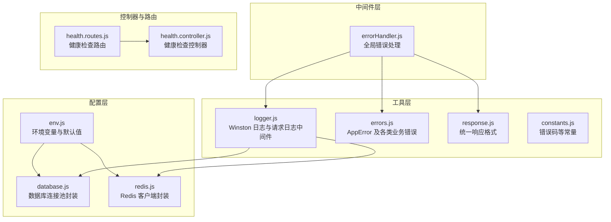
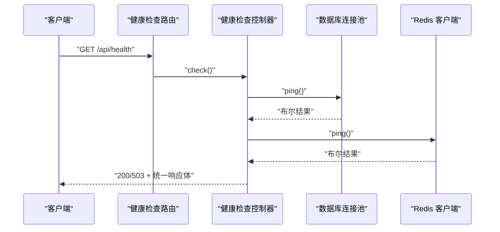
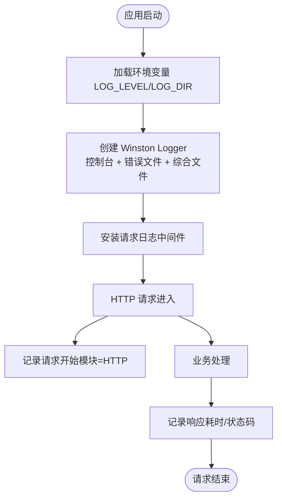
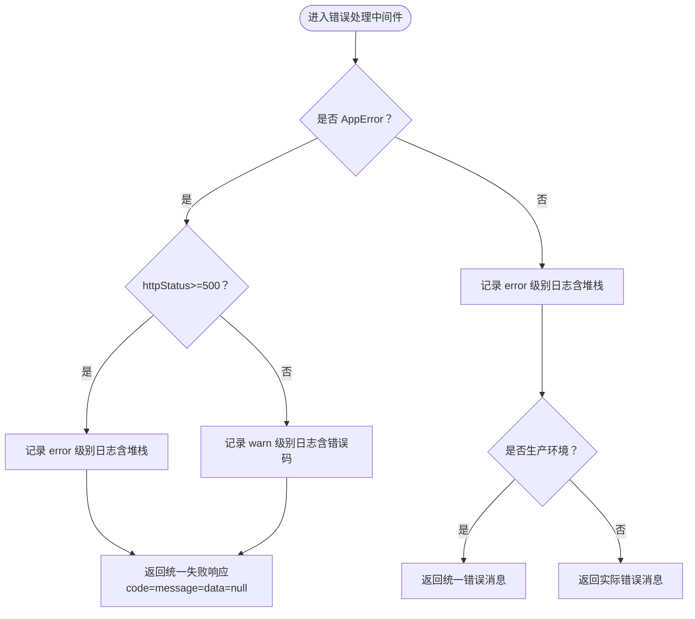
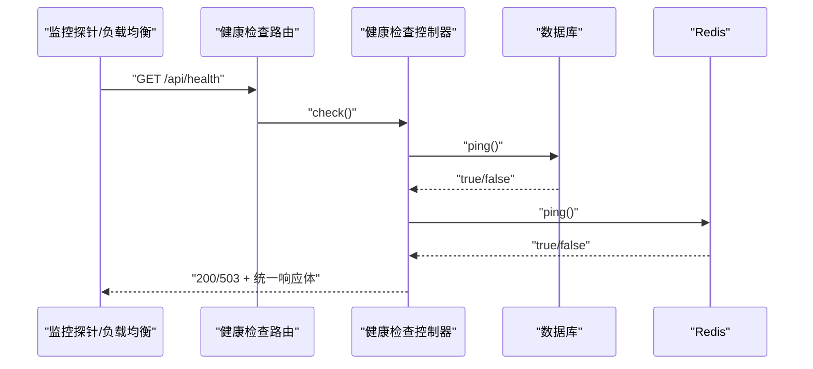
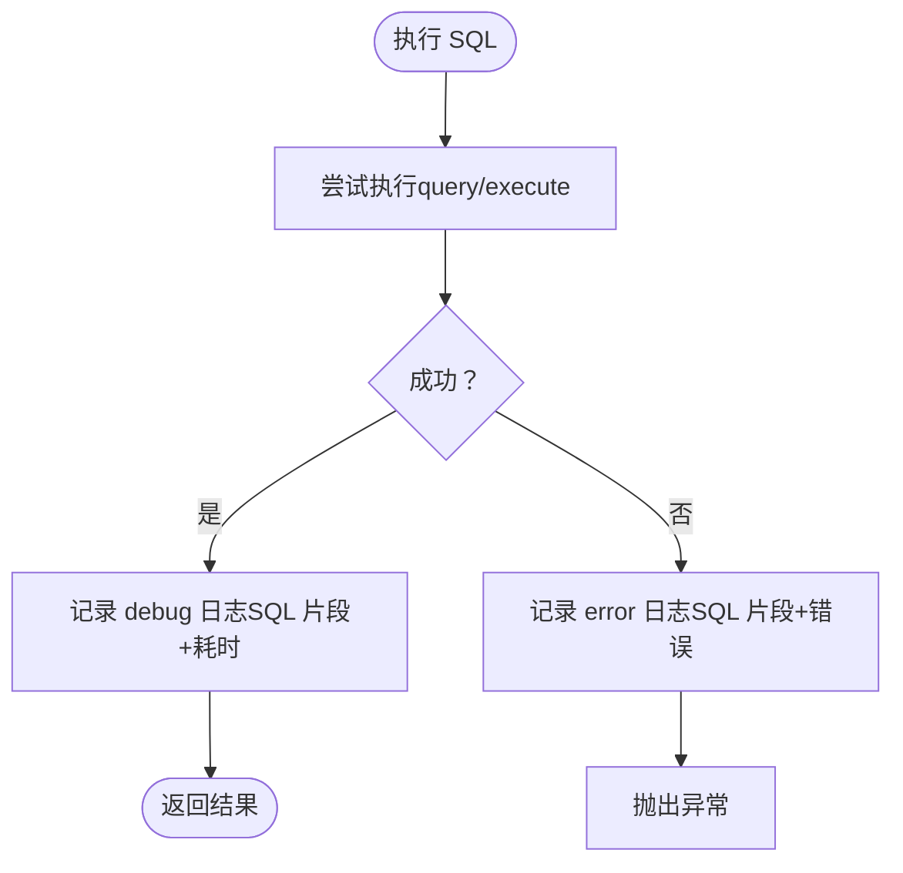
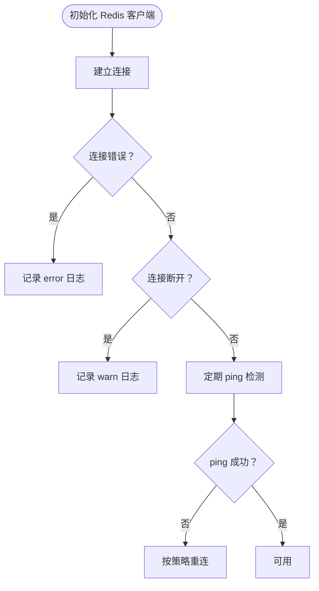
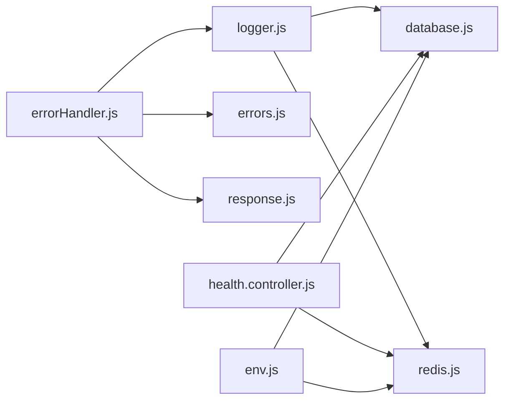

# 监控运维

<cite>
**本文引用的文件**
- [logger.js](file://backend/src/common/utils/logger.js)
- [errorHandler.js](file://backend/src/common/middleware/errorHandler.js)
- [env.js](file://backend/src/common/config/env.js)
- [database.js](file://backend/src/common/config/database.js)
- [redis.js](file://backend/src/common/config/redis.js)
- [health.controller.js](file://backend/src/core/controllers/health.controller.js)
- [health.routes.js](file://backend/src/core/routes/health.routes.js)
- [errors.js](file://backend/src/common/utils/errors.js)
- [response.js](file://backend/src/common/utils/response.js)
- [constants.js](file://backend/src/common/utils/constants.js)
- [health.test.js](file://backend/tests/integration/health.test.js)
- [package.json](file://backend/package.json)
- [init-db.js](file://backend/scripts/init-db.js)
</cite>

## 目录
1. [简介](#简介)
2. [项目结构](#项目结构)
3. [核心组件](#核心组件)
4. [架构总览](#架构总览)
5. [详细组件分析](#详细组件分析)
6. [依赖关系分析](#依赖关系分析)
7. [性能考虑](#性能考虑)
8. [故障排查指南](#故障排查指南)
9. [结论](#结论)
10. [附录](#附录)

## 简介
本文件面向智慧办公助手 OA 系统的监控与运维，围绕日志管理、错误监控与告警、性能监控、健康检查、备份恢复、运维自动化与监控仪表板配置、以及故障排查与应急响应进行系统化梳理。文档以代码为依据，结合现有实现与可扩展点，给出可落地的实践建议。

## 项目结构
后端采用 Express 应用，按“配置/工具/中间件/控制器/路由/服务”分层组织；监控相关能力主要集中在日志系统、全局错误处理、数据库与 Redis 连接、以及健康检查接口。

图表来源
- [env.js:1-118](file://backend/src/common/config/env.js#L1-L118)
- [database.js:1-222](file://backend/src/common/config/database.js#L1-L222)
- [redis.js:1-101](file://backend/src/common/config/redis.js#L1-L101)
- [logger.js:1-100](file://backend/src/common/utils/logger.js#L1-L100)
- [errorHandler.js:1-28](file://backend/src/common/middleware/errorHandler.js#L1-L28)
- [health.controller.js:1-55](file://backend/src/core/controllers/health.controller.js#L1-L55)
- [health.routes.js:1-32](file://backend/src/core/routes/health.routes.js#L1-L32)

章节来源
- [env.js:1-118](file://backend/src/common/config/env.js#L1-L118)
- [logger.js:1-100](file://backend/src/common/utils/logger.js#L1-L100)
- [errorHandler.js:1-28](file://backend/src/common/middleware/errorHandler.js#L1-L28)
- [health.controller.js:1-55](file://backend/src/core/controllers/health.controller.js#L1-L55)
- [health.routes.js:1-32](file://backend/src/core/routes/health.routes.js#L1-L32)

## 核心组件
- 日志管理：基于 Winston 的多传输器配置，支持控制台彩色输出、错误日志文件与综合日志文件，并在请求中间件中注入请求级上下文。
- 错误监控与告警：全局错误中间件统一拦截 AppError 与非预期错误，按级别记录到日志，并返回统一响应结构；可扩展接入外部告警通道。
- 健康检查：提供 /api/health 接口，检查数据库与 Redis 连通性与响应时间，服务降级时返回 503。
- 数据库与 Redis：封装连接池与重连策略，提供 ping 能力供健康检查使用；数据库层对查询/执行进行耗时与错误记录。
- 统一响应与错误码：统一 success/fail 返回结构，配合错误码便于前端与监控系统识别。

章节来源
- [logger.js:1-100](file://backend/src/common/utils/logger.js#L1-L100)
- [errorHandler.js:1-28](file://backend/src/common/middleware/errorHandler.js#L1-L28)
- [health.controller.js:1-55](file://backend/src/core/controllers/health.controller.js#L1-L55)
- [database.js:1-222](file://backend/src/common/config/database.js#L1-L222)
- [redis.js:1-101](file://backend/src/common/config/redis.js#L1-L101)
- [response.js:1-49](file://backend/src/common/utils/response.js#L1-L49)
- [errors.js:1-99](file://backend/src/common/utils/errors.js#L1-L99)
- [constants.js:1-106](file://backend/src/common/utils/constants.js#L1-L106)

## 架构总览
下图展示从客户端到服务端、再到数据库与缓存的典型调用链路，以及健康检查与日志记录的关键节点。

图表来源
- [health.routes.js:1-32](file://backend/src/core/routes/health.routes.js#L1-L32)
- [health.controller.js:1-55](file://backend/src/core/controllers/health.controller.js#L1-L55)
- [database.js:187-207](file://backend/src/common/config/database.js#L187-L207)
- [redis.js:85-93](file://backend/src/common/config/redis.js#L85-L93)

## 详细组件分析

### 日志管理系统（Winston）
- 配置要点
  - 日志级别：由环境变量 LOG_LEVEL 决定，默认 info；当级别为 silent 时禁用日志输出。
  - 输出目标：控制台（开发环境带颜色）、错误日志文件 error.log（仅 error 及以上）、综合日志文件 combined.log。
  - 文件轮转：错误日志最大 10MB，最多保留 10 份；综合日志最大 10MB，最多保留 30 份。
  - 请求日志中间件：在每个请求上挂载 req.logger，自动注入请求追踪信息（如请求 ID、URL、方法、IP、UA、耗时、状态码）。
- 日志格式：包含时间戳、级别、模块名、消息与元数据 JSON 序列化。
- 使用建议
  - 生产环境建议开启文件输出并定期归档与清理。
  - 对敏感信息避免直接写入日志，或在输出前脱敏。
  - 结合日志采集与可视化平台（如 ELK/EFK）集中分析。

图表来源
- [logger.js:22-61](file://backend/src/common/utils/logger.js#L22-L61)
- [logger.js:67-96](file://backend/src/common/utils/logger.js#L67-L96)
- [env.js:109-111](file://backend/src/common/config/env.js#L109-L111)

章节来源
- [logger.js:1-100](file://backend/src/common/utils/logger.js#L1-L100)
- [env.js:109-111](file://backend/src/common/config/env.js#L109-L111)

### 错误监控与告警机制
- 全局错误处理
  - AppError：统一业务错误，区分 5xx 与非 5xx，分别记录 error/warn 级别日志。
  - 非 AppError：记录 error 级别日志，并在生产环境返回统一错误消息。
  - 统一响应：始终返回 HTTP 200，通过 code 字段区分成功/失败。
- 告警扩展
  - 可在错误处理中间件中增加外部告警通道（如邮件、IM、短信）调用。
  - 建议对 5xx 错误与特定业务错误码触发即时告警。

图表来源
- [errorHandler.js:12-25](file://backend/src/common/middleware/errorHandler.js#L12-L25)
- [errors.js:9-24](file://backend/src/common/utils/errors.js#L9-L24)
- [response.js:22-24](file://backend/src/common/utils/response.js#L22-L24)

章节来源
- [errorHandler.js:1-28](file://backend/src/common/middleware/errorHandler.js#L1-L28)
- [errors.js:1-99](file://backend/src/common/utils/errors.js#L1-L99)
- [response.js:1-49](file://backend/src/common/utils/response.js#L1-L49)
- [constants.js:8-15](file://backend/src/common/utils/constants.js#L8-L15)

### 健康检查接口与监控探针
- 接口路径：GET /api/health
- 检查项：数据库与 Redis 连通性，记录各自响应时间；汇总状态 ok/degraded。
- 响应：data 中包含 status、timestamp、uptime、version、checks；若任一组件异常返回 503。
- 测试覆盖：集成测试断言响应结构、时间戳格式、version 非空、uptime 为正数。

图表来源
- [health.routes.js:29](file://backend/src/core/routes/health.routes.js#L29)
- [health.controller.js:13-51](file://backend/src/core/controllers/health.controller.js#L13-L51)
- [database.js:187-207](file://backend/src/common/config/database.js#L187-L207)
- [redis.js:85-93](file://backend/src/common/config/redis.js#L85-L93)

章节来源
- [health.controller.js:1-55](file://backend/src/core/controllers/health.controller.js#L1-L55)
- [health.routes.js:1-32](file://backend/src/core/routes/health.routes.js#L1-L32)
- [health.test.js:1-57](file://backend/tests/integration/health.test.js#L1-L57)

### 数据库性能监控与指标采集
- 连接池与参数：支持最小/最大连接数、等待队列、keep-alive、字符集与时区等配置。
- 查询与执行：对 query/execute/oldQuery/oldExecute 统一记录耗时与错误，便于定位慢查询与异常。
- 事务：封装事务执行，确保一致性与回滚后的资源释放。
- 指标建议
  - 采集数据库响应时间、错误率、连接池利用率、排队长度。
  - 基于日志中的 SQL 片段与耗时进行热点 SQL 分析。

图表来源
- [database.js:65-109](file://backend/src/common/config/database.js#L65-L109)
- [database.js:117-161](file://backend/src/common/config/database.js#L117-L161)
- [database.js:168-181](file://backend/src/common/config/database.js#L168-L181)

章节来源
- [database.js:1-222](file://backend/src/common/config/database.js#L1-L222)

### Redis 连接与监控
- 客户端初始化：支持密码认证、重连策略（指数退避，超过上限记录错误并终止重连）。
- 事件监听：connect/error/end 记录关键事件，便于问题定位。
- 健康检查：提供 ping 能力，供 /api/health 使用。
- 指标建议
  - 连接状态、命令延迟、错误计数、重连次数。
  - 缓存命中率与过期策略评估。

图表来源
- [redis.js:16-57](file://backend/src/common/config/redis.js#L16-L57)
- [redis.js:85-93](file://backend/src/common/config/redis.js#L85-L93)

章节来源
- [redis.js:1-101](file://backend/src/common/config/redis.js#L1-L101)

### 统一响应与错误码体系
- 统一成功/失败响应结构，便于前端与监控系统解析。
- 错误码枚举：SUCCESS、AUTH_ERROR、FORBIDDEN、VALIDATION_ERROR、NOT_FOUND、BUSINESS_ERROR。
- 业务错误：AppError 及其子类（ValidationError/AuthError/ForbiddenError/NotFoundError/BusinessError）。

章节来源
- [response.js:1-49](file://backend/src/common/utils/response.js#L1-L49)
- [errors.js:1-99](file://backend/src/common/utils/errors.js#L1-L99)
- [constants.js:8-15](file://backend/src/common/utils/constants.js#L8-L15)

## 依赖关系分析
- Winston 日志：被请求中间件与数据库/Redis封装使用，形成跨模块的日志输出。
- 全局错误处理：依赖错误类与统一响应，向上游返回标准化错误。
- 健康检查：依赖数据库与 Redis 的 ping 能力，返回统一响应。
- 环境变量：贯穿配置层，决定日志级别、日志目录、数据库与 Redis 连接参数等。

图表来源
- [logger.js:1-100](file://backend/src/common/utils/logger.js#L1-L100)
- [errorHandler.js:1-28](file://backend/src/common/middleware/errorHandler.js#L1-L28)
- [health.controller.js:1-55](file://backend/src/core/controllers/health.controller.js#L1-L55)
- [database.js:1-222](file://backend/src/common/config/database.js#L1-L222)
- [redis.js:1-101](file://backend/src/common/config/redis.js#L1-L101)
- [env.js:1-118](file://backend/src/common/config/env.js#L1-L118)

章节来源
- [package.json:16-34](file://backend/package.json#L16-L34)

## 性能考虑
- 日志性能
  - 控制台输出在开发环境启用颜色，生产环境建议关闭颜色并减少控制台输出频率。
  - 文件输出采用固定大小与文件数限制，避免磁盘膨胀；建议结合系统日志轮转策略。
- 数据库性能
  - 合理设置连接池大小与等待队列，避免高并发下的连接争用。
  - 对慢查询与异常进行日志记录与报警，定期分析热点 SQL。
- Redis 性能
  - 重连策略避免频繁重试导致 CPU 占用；关注 ping 延迟与错误率。
- 健康检查
  - 响应时间包含数据库与 Redis 的 ping 调用，建议在探针中设置合理的超时与重试策略。

[本节为通用性能建议，不直接分析具体文件]

## 故障排查指南
- 日志定位
  - 查看 backend/logs 下的 error.log 与 combined.log，结合请求日志中的请求 ID、URL、方法、耗时、状态码定位问题。
  - 对 5xx 错误与异常堆栈进行重点分析。
- 健康检查
  - 若返回 503，检查数据库与 Redis 的连通性与响应时间；确认连接参数与网络状况。
  - 集成测试可作为健康检查行为的参考：响应结构、时间戳格式、version 非空、uptime 为正数。
- 数据库与 Redis
  - 使用 ping 能力快速判断连通性；关注连接池状态与错误日志。
- 错误处理
  - 确认错误是否为 AppError，区分业务错误与系统错误；检查统一响应结构与错误码。

章节来源
- [health.test.js:14-56](file://backend/tests/integration/health.test.js#L14-L56)
- [logger.js:67-96](file://backend/src/common/utils/logger.js#L67-L96)
- [errorHandler.js:12-25](file://backend/src/common/middleware/errorHandler.js#L12-L25)

## 结论
本系统在日志、错误处理、健康检查与数据库/缓存连接方面具备清晰的实现与可扩展点。建议在现有基础上完善外部告警通道、引入更细粒度的性能指标采集与可视化、制定备份与恢复演练流程，并持续优化日志轮转与存储策略，以满足生产环境的监控与运维需求。

[本节为总结性内容，不直接分析具体文件]

## 附录

### 环境变量与配置清单
- 必需环境变量：NODE_ENV、PORT、OA_DB_*、OLD_DB_*、REDIS_*、JWT_SECRET、WX_APPID。
- 日志配置：LOG_LEVEL、LOG_DIR。
- Swagger：SWAGGER_ENABLED。

章节来源
- [env.js:13-41](file://backend/src/common/config/env.js#L13-L41)
- [env.js:109-115](file://backend/src/common/config/env.js#L109-L115)

### 健康检查接口定义
- 路径：GET /api/health
- 响应：统一响应结构，data 包含 status、timestamp、uptime、version、checks（database/redis）。
- 异常：任一组件异常返回 503。

章节来源
- [health.routes.js:29](file://backend/src/core/routes/health.routes.js#L29)
- [health.controller.js:13-51](file://backend/src/core/controllers/health.controller.js#L13-L51)

### 数据库初始化脚本
- 功能：创建 OA 系统所需的基础表（用户、部门、审批、日报、消息、公告、项目、任务、资产、操作日志、系统配置等）。
- 使用：npm run init-db 或 node scripts/init-db.js。

章节来源
- [init-db.js:1-374](file://backend/scripts/init-db.js#L1-L374)